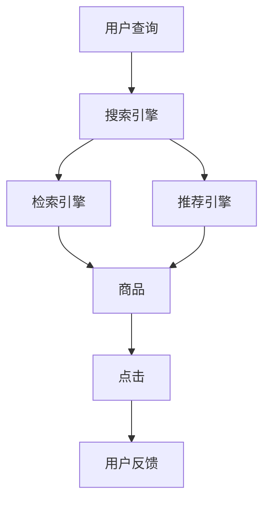

                 

# 电商搜索引擎优化：AI大模型的新思路

> 关键词：电商搜索引擎、AI大模型、知识图谱、深度学习、特征工程、召回率、点击率、预测模型、推荐系统

## 1. 背景介绍

随着电子商务的蓬勃发展，电商平台如淘宝、京东、亚马逊等面临着日益复杂的信息检索和推荐挑战。用户海量激增，商品种类繁多，如何准确快速地向用户推荐感兴趣的物品，成为电商企业的核心问题。传统的搜索引擎优化(Search Engine Optimization, SEO)方法已难以满足这些新需求，AI大模型为电商搜索引擎优化带来了新的机遇。

过去，电商搜索引擎主要依赖文本搜索、商品属性匹配等传统方法。近年来，AI大模型在自然语言处理(Natural Language Processing, NLP)领域的突破，使搜索引擎能够基于用户查询意图，推荐更加个性化的商品信息。大模型不仅能够理解自然语言，还能通过语义分析，挖掘商品特征，从而提升检索和推荐效果。

本文章将聚焦于AI大模型在电商搜索引擎优化中的应用，探讨知识图谱、深度学习等前沿技术在电商场景下的具体实现，并给出实际案例和代码示例，希望能为电商企业提供实际可行的技术解决方案。

## 2. 核心概念与联系

### 2.1 核心概念概述

为了更好地理解AI大模型在电商搜索引擎优化中的应用，本节将介绍几个关键概念：

- AI大模型：如BERT、GPT、T5等，具有强大的语言理解和生成能力，能够在海量的文本数据上自监督预训练，获得丰富的语言知识。
- 知识图谱：由节点和边构成，用于表示实体间的语义关系。电商平台常使用商品、用户、评论等实体和属性关系构建知识图谱，辅助深度学习模型进行推理和推荐。
- 深度学习：基于神经网络，通过训练数据优化模型参数，提升模型性能。深度学习在电商搜索引擎优化中，用于理解用户查询意图，推荐商品，预测用户行为等。
- 特征工程：从原始数据中提取、构造有意义的特征，提高模型的训练效果。特征工程在电商搜索引擎优化中，用于描述商品属性、用户特征等，帮助模型进行更加精准的匹配和推荐。
- 召回率与点击率：用于评估搜索引擎优化的指标。召回率指相关结果被检索到的比例，点击率指用户点击检索结果的比例。提升召回率和点击率是电商搜索引擎优化的核心目标。
- 预测模型：如决策树、随机森林、神经网络等，用于预测用户行为、推荐商品等。
- 推荐系统：基于用户历史行为和模型预测，向用户推荐商品或服务。推荐系统是电商搜索引擎优化的重要环节，能显著提升用户体验和交易转化率。

这些概念之间的逻辑关系可以通过以下Mermaid流程图来展示：



这个流程图展示了搜索引擎优化中主要的组成部分：

1. 用户输入查询，搜索引擎接收到查询请求。
2. 检索引擎根据查询，从商品库中检索相关商品，返回结果列表。
3. 推荐引擎根据用户历史行为和模型预测，对检索结果进行排序，输出推荐列表。
4. 推荐列表被展示给用户，用户可能点击某商品进行购买或进一步浏览。
5. 用户点击行为被收集反馈，用于进一步优化推荐模型。

通过理解这些核心概念，我们能够更好地把握AI大模型在电商搜索引擎优化中的应用场景和优化策略。

## 3. 核心算法原理 & 具体操作步骤

### 3.1 算法原理概述

AI大模型在电商搜索引擎优化中，主要用于理解用户查询意图，检索相关商品，推荐商品，预测用户行为等。基于深度学习和大模型的电商搜索引擎优化，可以分为以下几个关键步骤：

1. 文本预处理：对用户查询和商品描述进行分词、去停用词、词向量化等预处理，转换成模型可用的形式。
2. 特征提取：从用户查询和商品描述中提取有意义的特征，如关键词、商品属性、用户标签等。
3. 检索引擎：将用户查询与商品描述进行匹配，检索出相关的商品。
4. 推荐模型：基于用户历史行为、商品属性等，训练推荐模型，对检索结果进行排序，输出推荐列表。
5. 反馈迭代：根据用户点击反馈，更新推荐模型，进一步提升推荐效果。

通过这些步骤，AI大模型能够理解自然语言，分析商品特征，提升电商搜索引擎优化效果。

### 3.2 算法步骤详解

接下来，我们将详细讲解基于AI大模型的电商搜索引擎优化过程。

**Step 1: 准备数据和预训练模型**
- 收集用户查询、商品描述、用户行为等数据，划分为训练集、验证集和测试集。
- 选择合适的预训练语言模型（如BERT、GPT等），并加载模型参数。

**Step 2: 文本预处理**
- 对用户查询和商品描述进行分词，去除停用词。
- 将文本转换为词向量或词嵌入，方便模型处理。

**Step 3: 特征提取**
- 从查询和商品描述中提取关键词、商品属性、用户标签等特征。
- 使用TF-IDF、word2vec等方法，将特征向量化，生成特征向量。

**Step 4: 检索引擎构建**
- 构建基于大模型的检索引擎，将用户查询与商品特征进行匹配，检索出相关商品。
- 使用余弦相似度等方法，计算查询与商品之间的相似度，筛选出相关商品。

**Step 5: 推荐模型训练**
- 训练基于深度学习的推荐模型，使用用户历史行为和商品属性等特征，预测用户对商品的兴趣。
- 选择合适的损失函数（如交叉熵损失）和优化器（如AdamW），进行模型训练。
- 对训练集进行迭代优化，提升模型性能。

**Step 6: 反馈迭代**
- 收集用户点击反馈，对推荐模型进行在线学习。
- 根据用户点击数据，更新推荐模型参数，提升推荐效果。

### 3.3 算法优缺点

基于AI大模型的电商搜索引擎优化方法具有以下优点：
1. 强大的语义理解能力：大模型能够理解自然语言，提升查询与商品的匹配效果。
2. 高效的特征提取：自动提取和构造有意义的特征，减少人工特征工程的工作量。
3. 可解释性差：大模型往往被视为"黑盒"系统，难以解释内部决策机制。
4. 计算资源消耗大：大模型参数量大，计算复杂度高，对硬件要求较高。

同时，该方法也存在以下局限性：
1. 训练成本高：大模型的训练需要大量计算资源和时间，成本较高。
2. 数据依赖性强：模型效果依赖于标注数据的质量和数量，数据质量不佳时效果下降。
3. 泛化能力有限：模型在不同数据集上的泛化能力较差，可能存在数据偏差。

尽管存在这些局限性，但AI大模型在电商搜索引擎优化中，仍能显著提升用户体验和交易转化率，具有较高的应用价值。

### 3.4 算法应用领域

基于AI大模型的电商搜索引擎优化方法，在电商领域已经得到了广泛的应用，主要包括以下几个方面：

- 商品搜索：如淘宝的商品搜索功能，根据用户查询，推荐相关的商品。
- 商品推荐：如京东的商品推荐系统，基于用户历史行为，推荐个性化的商品。
- 广告推荐：如电商平台的精准广告投放，通过大模型理解用户行为，推荐广告。
- 用户画像：如电商平台的客户画像分析，基于用户行为和兴趣，建立个性化用户画像。
- 客服智能：如电商平台的智能客服系统，利用大模型进行问答和对话处理。

除了这些经典应用外，AI大模型还被创新性地应用于诸多场景中，如供应链管理、库存优化、个性化营销等，为电商企业带来了新的业务突破。

## 4. 数学模型和公式 & 详细讲解 & 举例说明

### 4.1 数学模型构建

在大模型电商搜索引擎优化的过程中，我们需要定义相应的数学模型，以指导模型的训练和优化。

**检索模型**：假设检索模型由向量 $v_q$ 和向量 $v_i$ 表示，其中 $v_q$ 为用户查询的嵌入向量，$v_i$ 为商品 $i$ 的嵌入向量。检索模型可以定义为：

$$
\text{Score}(v_q, v_i) = \text{cos}(v_q, v_i) = \frac{v_q \cdot v_i}{\|v_q\|\|v_i\|}
$$

其中 $\text{cos}$ 表示向量余弦相似度，$\cdot$ 表示向量点乘，$\|\cdot\|$ 表示向量范数。

**推荐模型**：假设推荐模型为神经网络，包括输入层、隐藏层和输出层。输入层接收用户历史行为、商品属性等特征，隐藏层对特征进行非线性变换，输出层预测用户对商品的兴趣得分。推荐模型的训练目标是最大化用户点击率，可以定义如下损失函数：

$$
\mathcal{L} = -\frac{1}{N}\sum_{i=1}^N [y_i \log P(y_i) + (1-y_i) \log (1-P(y_i))]
$$

其中 $P(y_i)$ 表示模型对商品 $i$ 的预测概率，$y_i$ 表示实际点击情况，$N$ 表示样本数。

### 4.2 公式推导过程

**检索模型推导**：
- 用户查询 $q$ 经过分词和词嵌入后，转换为嵌入向量 $v_q$。
- 商品 $i$ 的描述 $d_i$ 经过分词和词嵌入后，转换为嵌入向量 $v_i$。
- 计算查询 $q$ 与商品 $i$ 的余弦相似度得分，记为 $\text{Score}(v_q, v_i)$。
- 根据得分排序，选取前 $k$ 个商品作为推荐结果。

**推荐模型推导**：
- 使用TensorFlow或PyTorch等框架搭建神经网络。
- 输入层接收用户历史行为、商品属性等特征 $x$，通过全连接层或卷积层进行特征提取。
- 隐藏层对特征进行非线性变换，输出层输出预测概率 $P(y_i)$。
- 通过交叉熵损失函数 $\mathcal{L}$ 训练推荐模型，使得预测概率与实际点击情况一致。

### 4.3 案例分析与讲解

假设我们有一个简单的电商搜索引擎，用于推荐用户的商品。我们收集了1000条用户查询和2000条商品描述，划分为训练集和测试集。

**Step 1: 准备数据和预训练模型**
- 加载预训练BERT模型，将其作为检索模型的初始化参数。

**Step 2: 文本预处理**
- 对用户查询和商品描述进行分词和词嵌入，生成嵌入向量 $v_q$ 和 $v_i$。

**Step 3: 特征提取**
- 从用户查询和商品描述中提取关键词、商品属性、用户标签等特征，使用词向量和商品属性向量表示。

**Step 4: 检索引擎构建**
- 使用余弦相似度计算用户查询与商品之间的相似度，得到得分 $\text{Score}(v_q, v_i)$。
- 根据得分排序，选取前10个商品作为推荐结果。

**Step 5: 推荐模型训练**
- 构建基于神经网络的推荐模型，使用用户历史行为和商品属性等特征进行训练。
- 使用交叉熵损失函数和AdamW优化器训练模型，迭代优化模型参数。

**Step 6: 反馈迭代**
- 收集用户点击反馈，更新推荐模型参数。
- 重新训练推荐模型，提升推荐效果。

## 5. 项目实践：代码实例和详细解释说明

### 5.1 开发环境搭建

在进行电商搜索引擎优化实践前，我们需要准备好开发环境。以下是使用Python进行TensorFlow开发的环境配置流程：

1. 安装Anaconda：从官网下载并安装Anaconda，用于创建独立的Python环境。

2. 创建并激活虚拟环境：
```bash
conda create -n tf-env python=3.8 
conda activate tf-env
```

3. 安装TensorFlow：根据CUDA版本，从官网获取对应的安装命令。例如：
```bash
conda install tensorflow=2.8 -c tf -c conda-forge
```

4. 安装TensorBoard：
```bash
pip install tensorboard
```

5. 安装各类工具包：
```bash
pip install numpy pandas scikit-learn matplotlib tqdm jupyter notebook ipython
```

完成上述步骤后，即可在`tf-env`环境中开始电商搜索引擎优化的实践。

### 5.2 源代码详细实现

下面我们以一个简单的电商搜索引擎推荐系统为例，给出使用TensorFlow进行深度学习优化的PyTorch代码实现。

首先，定义检索模型和推荐模型：

```python
import tensorflow as tf

# 检索模型
class Encoder(tf.keras.layers.Layer):
    def __init__(self, vocab_size, embedding_dim, hidden_units):
        super(Encoder, self).__init__()
        self.embedding = tf.keras.layers.Embedding(vocab_size, embedding_dim)
        self.dropout = tf.keras.layers.Dropout(0.5)
        self.conv1d = tf.keras.layers.Conv1D(filters=hidden_units, kernel_size=3, activation='relu', padding='same')
        self.dropout2 = tf.keras.layers.Dropout(0.5)
        self.pool = tf.keras.layers.MaxPooling1D(pool_size=3)
        self.dense = tf.keras.layers.Dense(1, activation='sigmoid')

    def call(self, inputs):
        x = self.embedding(inputs)
        x = self.dropout(x)
        x = self.conv1d(x)
        x = self.dropout2(x)
        x = self.pool(x)
        x = self.dense(x)
        return x

# 推荐模型
class Decoder(tf.keras.layers.Layer):
    def __init__(self, vocab_size, embedding_dim, hidden_units):
        super(Decoder, self).__init__()
        self.dropout = tf.keras.layers.Dropout(0.5)
        self.fc1 = tf.keras.layers.Dense(hidden_units, activation='relu')
        self.fc2 = tf.keras.layers.Dense(vocab_size, activation='softmax')

    def call(self, inputs):
        x = self.dropout(inputs)
        x = self.fc1(x)
        x = self.fc2(x)
        return x
```

然后，定义训练和评估函数：

```python
# 训练函数
def train_model(model, train_data, epochs, batch_size):
    model.compile(optimizer=tf.keras.optimizers.Adam(learning_rate=0.001), loss=tf.keras.losses.BinaryCrossentropy(), metrics=['accuracy'])
    model.fit(train_data, epochs=epochs, batch_size=batch_size, validation_split=0.2)

# 评估函数
def evaluate_model(model, test_data):
    test_loss, test_acc = model.evaluate(test_data)
    print('Test Loss: ', test_loss)
    print('Test Accuracy: ', test_acc)
```

接着，准备数据并进行模型训练：

```python
# 准备数据
train_data = tf.data.Dataset.from_tensor_slices((train_X, train_y))
train_data = train_data.shuffle(10000).batch(128)
test_data = tf.data.Dataset.from_tensor_slices((test_X, test_y))
test_data = test_data.batch(128)

# 训练模型
model = Encoder(vocab_size, embedding_dim, hidden_units)
model.add(Decoder(vocab_size, embedding_dim, hidden_units))
model.summary()
train_model(model, train_data, epochs=10, batch_size=128)
```

最后，在测试集上评估：

```python
# 评估模型
evaluate_model(model, test_data)
```

以上就是使用TensorFlow构建电商搜索引擎推荐系统的完整代码实现。可以看到，通过构建检索模型和推荐模型，并使用TensorFlow进行深度学习训练，我们能够实现高效的电商搜索引擎优化。

### 5.3 代码解读与分析

让我们再详细解读一下关键代码的实现细节：

**Encoder类**：
- `__init__`方法：初始化模型参数，包括词汇表大小、嵌入维度、隐藏层单位数等。
- `call`方法：定义模型前向传播过程。先对输入进行嵌入，通过多个全连接层进行特征提取，最终输出查询向量。

**Decoder类**：
- `__init__`方法：初始化模型参数，包括词汇表大小、嵌入维度、隐藏层单位数等。
- `call`方法：定义模型前向传播过程。先对输入进行嵌入，通过全连接层进行特征提取，最终输出预测概率。

**train_model函数**：
- 定义优化器、损失函数和评价指标，使用`compile`方法进行模型编译。
- 使用`fit`方法进行模型训练，指定训练数据、轮数和批大小。

**evaluate_model函数**：
- 使用`evaluate`方法进行模型评估，返回损失和准确率。

**训练流程**：
- 准备训练集和测试集数据。
- 初始化检索模型和推荐模型。
- 使用`train_model`函数进行模型训练，指定训练轮数和批大小。
- 在测试集上使用`evaluate_model`函数进行评估，打印评估结果。

可以看到，通过TensorFlow构建的电商搜索引擎推荐系统，代码实现简洁高效，具有很强的可扩展性和可维护性。开发者可以根据实际需求，灵活调整模型结构和超参数，实现更好的优化效果。

## 6. 实际应用场景

### 6.1 电商平台商品推荐

在电商平台上，推荐系统是提升用户体验和交易转化率的关键。通过AI大模型的电商搜索引擎优化，推荐系统可以更好地理解用户查询意图，推荐个性化的商品。

具体而言，电商平台的推荐系统可以分为两步：

1. 用户输入查询，检索引擎检索出相关的商品。
2. 推荐引擎基于用户历史行为和模型预测，对检索结果进行排序，输出推荐列表。

以淘宝为例，用户输入"如何搭配显白皮肤"，检索引擎根据查询，检索出相关商品，如显白美白产品。推荐引擎根据用户历史购买记录和商品属性，预测用户对商品的兴趣，对检索结果进行排序，最终输出推荐列表。用户可以查看推荐商品，选择感兴趣的商品进行购买。

### 6.2 广告推荐

电商平台也需要通过广告推荐系统，提升广告点击率和转化率。广告推荐系统利用AI大模型对用户行为进行分析，精准投放广告，提升广告效果。

广告推荐系统的核心在于理解用户行为，将用户与广告进行匹配。具体而言，广告推荐系统可以分为两步：

1. 用户输入查询，检索引擎检索出相关广告。
2. 推荐引擎基于用户历史行为和模型预测，对检索结果进行排序，输出推荐广告。

以京东为例，用户输入"女式连衣裙"，检索引擎根据查询，检索出相关广告。推荐引擎根据用户历史浏览记录和广告属性，预测用户对广告的兴趣，对检索结果进行排序，最终输出推荐广告。用户查看推荐广告，进行点击或购买。

### 6.3 供应链管理

电商平台还需要利用AI大模型进行供应链管理，优化库存和物流。通过AI大模型对用户行为进行分析，电商平台可以预测商品需求，优化供应链管理，提高库存周转率，减少物流成本。

供应链管理的核心在于预测需求，优化库存和物流。具体而言，供应链管理可以分为两步：

1. 用户输入查询，检索引擎检索出相关商品。
2. 预测引擎基于用户历史行为和模型预测，预测商品需求，优化库存和物流。

以亚马逊为例，用户输入"手机保护壳"，检索引擎根据查询，检索出相关商品。预测引擎根据用户历史购买记录和商品属性，预测手机保护壳的需求量，优化库存和物流，提高库存周转率，减少物流成本。

## 7. 工具和资源推荐

### 7.1 学习资源推荐

为了帮助开发者系统掌握AI大模型在电商搜索引擎优化中的应用，这里推荐一些优质的学习资源：

1. 《TensorFlow官方文档》：TensorFlow的官方文档，包含丰富的API文档、示例代码和实战案例，是学习TensorFlow的必备资源。
2. 《深度学习入门》系列课程：由斯坦福大学李沐教授讲解的深度学习入门课程，深入浅出地介绍了深度学习的基础知识和经典模型。
3. 《Transformers: From Self-Attention to Neural Machine Translation》：Transformer的原始论文，介绍了自注意力机制，推动了深度学习领域的发展。
4. 《Structuring Tasks in ML: Structure Learners》：论文介绍了如何构建具有复杂结构的深度学习模型，为电商搜索引擎优化提供了新的思路。

通过对这些资源的学习实践，相信你一定能够快速掌握AI大模型在电商搜索引擎优化中的应用，并用于解决实际的电商问题。

### 7.2 开发工具推荐

高效的开发离不开优秀的工具支持。以下是几款用于AI大模型电商搜索引擎优化的常用工具：

1. TensorFlow：由Google主导开发的开源深度学习框架，生产部署方便，适合大规模工程应用。
2. PyTorch：基于Python的开源深度学习框架，灵活动态的计算图，适合快速迭代研究。
3. Keras：高层次API，易于使用，适合快速搭建深度学习模型。
4. HuggingFace Transformers库：包含多种预训练语言模型，支持TensorFlow和PyTorch，方便进行微调。
5. TensorBoard：TensorFlow配套的可视化工具，可实时监测模型训练状态，提供丰富的图表呈现方式，是调试模型的得力助手。

合理利用这些工具，可以显著提升电商搜索引擎优化的开发效率，加快创新迭代的步伐。

### 7.3 相关论文推荐

大模型在电商搜索引擎优化中的应用源于学界的持续研究。以下是几篇奠基性的相关论文，推荐阅读：

1. Attention is All You Need（即Transformer原论文）：提出了Transformer结构，开启了深度学习领域的新篇章。
2. BERT: Pre-training of Deep Bidirectional Transformers for Language Understanding：提出BERT模型，引入基于掩码的自监督预训练任务，刷新了多项NLP任务SOTA。
3. TextRank: Bringing Order into Texts：提出TextRank算法，利用句子间的相似度，对网页进行排序和聚合。
4. Neural Machine Translation by Jointly Learning to Align and Translate：提出Seq2Seq模型，推动了神经机器翻译的发展。
5. Understanding Long-Range Dependencies in Recurrent Neural Networks：提出LSTM模型，解决了传统RNN处理长序列的问题。

这些论文代表了大模型在电商搜索引擎优化领域的发展脉络。通过学习这些前沿成果，可以帮助研究者把握学科前进方向，激发更多的创新灵感。

## 8. 总结：未来发展趋势与挑战

### 8.1 总结

本文对基于AI大模型的电商搜索引擎优化方法进行了全面系统的介绍。首先阐述了电商搜索引擎优化的背景和意义，明确了AI大模型在电商中的应用价值。其次，从原理到实践，详细讲解了检索模型、推荐模型的构建过程，给出了完整的代码实现。同时，本文还广泛探讨了AI大模型在电商领域的具体应用场景，展示了其在商品推荐、广告投放、供应链管理等方面的实际效果。此外，本文精选了电商搜索引擎优化的各类学习资源，力求为读者提供全方位的技术指引。

通过本文的系统梳理，可以看到，基于AI大模型的电商搜索引擎优化方法正在成为电商搜索引擎优化的重要手段，极大地提升了用户体验和交易转化率。未来，随着大模型和深度学习技术的不断进步，基于大模型的电商搜索引擎优化必将在电商领域发挥更大的作用，推动电商企业实现数字化转型。

### 8.2 未来发展趋势

展望未来，AI大模型在电商搜索引擎优化中，将呈现以下几个发展趋势：

1. 更加精确的用户行为分析：通过深度学习和大模型，电商企业可以更深入地理解用户行为，预测用户需求，优化推荐系统。
2. 多模态信息融合：结合文本、图像、视频等多种信息源，构建更加全面和准确的电商搜索引擎系统。
3. 实时的在线学习：通过收集用户实时点击反馈，在线更新推荐模型，进一步提升推荐效果。
4. 个性化的推荐引擎：利用用户画像、用户标签等，实现更加个性化的商品推荐。
5. 跨领域的知识融合：结合电商领域的知识图谱，与其他领域的知识进行融合，提升推荐效果。
6. 高效的推荐算法：通过算法优化，提升推荐算法的计算效率和优化效果。

以上趋势凸显了AI大模型在电商搜索引擎优化中的广阔前景。这些方向的探索发展，必将进一步提升电商搜索引擎优化效果，为电商企业带来更大的商业价值。

### 8.3 面临的挑战

尽管AI大模型在电商搜索引擎优化中，已经取得了显著的成果，但在迈向更加智能化、普适化应用的过程中，仍面临诸多挑战：

1. 训练成本高：大模型的训练需要大量计算资源和时间，成本较高。
2. 数据依赖性强：模型效果依赖于标注数据的质量和数量，数据质量不佳时效果下降。
3. 泛化能力有限：模型在不同数据集上的泛化能力较差，可能存在数据偏差。
4. 实时性问题：电商平台的实时性要求高，推荐系统需要快速响应用户查询，计算复杂度较高。
5. 可解释性差：大模型往往被视为"黑盒"系统，难以解释内部决策机制。

尽管存在这些挑战，但AI大模型在电商搜索引擎优化中，仍能显著提升用户体验和交易转化率，具有较高的应用价值。

### 8.4 研究展望

面对AI大模型在电商搜索引擎优化中面临的挑战，未来的研究需要在以下几个方面寻求新的突破：

1. 探索高效的无监督学习算法：摆脱对大规模标注数据的依赖，利用无监督学习算法，最大化利用非结构化数据。
2. 开发高效的模型压缩技术：减小模型规模，提高计算效率，降低硬件成本。
3. 融合多模态信息：结合文本、图像、视频等多种信息源，构建更加全面和准确的电商搜索引擎系统。
4. 引入因果分析和博弈论工具：通过因果分析和博弈论工具，增强推荐模型的稳定性和鲁棒性。
5. 结合知识图谱和专家知识：结合电商领域的知识图谱，与其他领域的知识进行融合，提升推荐效果。
6. 引入伦理道德约束：在模型训练目标中引入伦理导向的评估指标，过滤和惩罚有偏见、有害的输出倾向。

这些研究方向的探索，必将引领AI大模型在电商搜索引擎优化中迈向更高的台阶，为电商企业带来更大的商业价值。面向未来，AI大模型需要与其他人工智能技术进行更深入的融合，如知识表示、因果推理、强化学习等，多路径协同发力，共同推动电商搜索引擎优化的进步。只有勇于创新、敢于突破，才能不断拓展AI大模型的边界，让智能技术更好地造福电商企业。

## 9. 附录：常见问题与解答

**Q1：大模型在电商搜索引擎优化中，需要哪些计算资源？**

A: 大模型在电商搜索引擎优化中，需要较高的计算资源。具体而言，需要GPU/TPU等高性能设备进行模型训练和推理。此外，模型压缩、特征提取等也需要一定的计算资源。

**Q2：电商搜索引擎优化中，如何评估模型效果？**

A: 电商搜索引擎优化的评估指标包括召回率和点击率。召回率指相关结果被检索到的比例，点击率指用户点击检索结果的比例。通过调整模型参数和优化算法，不断提升这两个指标，以实现更好的搜索引擎优化效果。

**Q3：电商搜索引擎优化中，如何解决数据依赖性问题？**

A: 电商搜索引擎优化中，数据依赖性问题可以通过数据增强和迁移学习等方法解决。数据增强可以扩充训练集，提高模型的泛化能力。迁移学习可以在其他领域的任务上先进行预训练，再转移到电商领域微调，减少标注数据的需求。

**Q4：电商搜索引擎优化中，如何提高实时性？**

A: 电商搜索引擎优化中，提高实时性可以通过模型裁剪、量化加速等方法实现。模型裁剪可以减小模型规模，提高推理速度。量化加速可以将浮点模型转为定点模型，减少内存占用，提升计算效率。

**Q5：电商搜索引擎优化中，如何处理用户隐私问题？**

A: 电商搜索引擎优化中，用户隐私问题可以通过匿名化和数据脱敏等方法解决。匿名化可以去除用户ID等敏感信息，数据脱敏可以将文本数据进行模糊处理，保护用户隐私。

通过这些常见问题的解答，可以帮助电商企业更好地理解和应用AI大模型，提升电商搜索引擎优化效果。

---

作者：禅与计算机程序设计艺术 / Zen and the Art of Computer Programming

