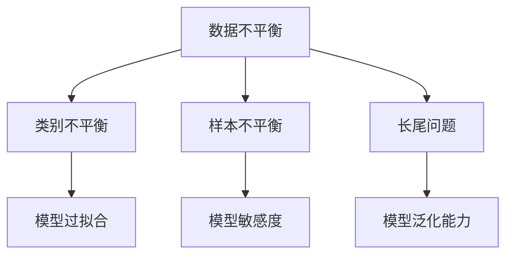

                 

# 电商搜索推荐中的AI大模型数据不平衡问题解决方案应用指南与最佳实践

> 关键词：
1. AI大模型
2. 数据不平衡问题
3. 电商搜索推荐
4. 算法优化
5. 数据增强
6. 模型公平性
7. 在线实时学习

## 1. 背景介绍

### 1.1 问题由来

在现代电商平台上，AI驱动的搜索推荐系统扮演着至关重要的角色。它通过分析用户的浏览行为和搜索习惯，精准推荐商品，提升用户体验和商家转化率。然而，这一系统面临的最大挑战之一，就是数据不平衡问题。具体而言，电商数据通常呈现出长尾分布，热门商品的数据量远大于冷门商品，导致模型容易过拟合热门数据，对冷门商品的推荐效果不佳。

### 1.2 问题核心关键点

数据不平衡问题在电商搜索推荐中主要表现为以下两个方面：
- **类别不平衡**：不同商品类别的数据量差异大，热门类别的商品数据量远超冷门类别，导致模型在预测冷门类别时效果不佳。
- **样本不平衡**：同一类别的商品中，部分商品的销量极高，部分商品销量极少，导致模型对销量高的商品更敏感。

解决数据不平衡问题，需要从数据、模型和算法三个层面综合考虑，采取多策略协同优化的方法。本文将系统介绍几种针对数据不平衡问题的解决方案，并结合实际案例，分享最佳实践。

## 2. 核心概念与联系

### 2.1 核心概念概述

为深入理解数据不平衡问题，我们先介绍几个关键概念：

- **数据不平衡（Data Imbalance）**：指不同类别（或样本）的数据量分布不均，数据集中某一类别的样本数量远远少于其他类别。
- **类别不平衡（Class Imbalance）**：指同一标签下不同类别的样本数量不平衡。
- **样本不平衡（Sample Imbalance）**：指同一类别中不同样本的销量、评分等数量不平衡。
- **长尾问题（Long Tail Problem）**：指数据集中大部分样本集中在少量类别上，而少数类别样本数量极多，形成长尾分布。

这些概念的联系可以通过以下Mermaid流程图展示：



从图中可以看出，数据不平衡问题的解决需要从分类不平衡和样本不平衡两个维度入手，以提升模型在冷门类别和低销量样本上的预测能力。

## 3. 核心算法原理 & 具体操作步骤

### 3.1 算法原理概述

为了解决电商搜索推荐中的数据不平衡问题，我们提出了几种基于AI大模型的解决方案。这些方案的核心在于通过优化模型训练过程，提升模型对冷门类别和低销量样本的关注度，从而改善推荐效果。

### 3.2 算法步骤详解

#### 3.2.1 基于重采样（Resampling）的方法

**步骤1: 重采样数据集**

通过对数据集进行重采样，调整不同类别的样本数量，使得各类别样本数量趋于平衡。具体可以分为：

- **过采样（Oversampling）**：对数据集中的少数类别进行复制，增加其在训练集中的数量。
- **欠采样（Undersampling）**：从数据集中随机删除多数类别的样本，使其数量与少数类别样本相当。

**步骤2: 重构数据集**

对重采样后的数据集进行标注和归一化处理，确保数据的一致性和可操作性。

**步骤3: 模型训练**

使用重采样后的数据集训练模型，在确保模型泛化能力的同时，提升对冷门类别的预测精度。

#### 3.2.2 基于增量学习（Incremental Learning）的方法

**步骤1: 在线实时学习（Online Incremental Learning）**

在电商搜索推荐系统中，用户行为数据是实时更新的。因此，可以使用增量学习的方法，及时更新模型参数，以适应数据分布的变化。具体方法包括：

- **在线梯度下降（Online Gradient Descent）**：根据实时数据更新模型参数，保持模型与数据分布的一致性。
- **在线随机梯度下降（Online Stochastic Gradient Descent）**：在每个时间点上，使用一小部分数据更新模型参数，减少计算开销。

**步骤2: 模型监控**

实时监控模型的性能指标，如准确率、召回率、F1值等，及时发现并解决模型退化问题。

#### 3.2.3 基于模型优化（Model Optimization）的方法

**步骤1: 模型公平性优化**

为了提升模型对冷门类别的关注，需要在模型的损失函数中加入公平性约束。具体方法包括：

- **加权损失函数（Weighted Loss Function）**：对不同类别的样本赋予不同的权重，增加冷门类别的权重，减少热门类别的权重。
- **对数损失函数（Logarithmic Loss Function）**：在多分类任务中，使用对数损失函数作为损失函数，提升模型对长尾类别的预测能力。

**步骤2: 模型敏感度调整**

通过调整模型参数，减少模型对热门类别的敏感度，提升对冷门类别的预测精度。具体方法包括：

- **超参数调整（Hyperparameter Tuning）**：通过调整学习率、批大小、正则化系数等超参数，优化模型性能。
- **模型融合（Model Ensembling）**：使用多个不同参数的模型进行集成，提升模型鲁棒性和泛化能力。

### 3.3 算法优缺点

基于重采样和增量学习的方法，具有以下优点：
- **简单高效**：重采样和增量学习的实现较为简单，可以直接在现有的电商推荐系统中实现。
- **实时更新**：通过在线学习，模型能够实时更新，保持对用户行为的敏感性。

同时，这些方法也存在一定的局限性：
- **数据不平衡加剧**：重采样可能导致数据分布进一步不平衡，影响模型泛化能力。
- **计算开销大**：增量学习需要频繁更新模型参数，增加了计算和存储负担。

基于模型优化的方法，具有以下优点：
- **提升公平性**：通过加权损失函数和对数损失函数，提升了模型对冷门类别的关注度。
- **模型鲁棒性高**：通过超参数调整和模型融合，提升了模型的泛化能力和鲁棒性。

同时，这些方法也存在一定的局限性：
- **模型复杂度高**：模型优化方法需要优化模型的内部结构，增加了模型的复杂度。
- **超参数调参困难**：模型优化需要调整多个超参数，调参难度较大。

## 4. 数学模型和公式 & 详细讲解 & 举例说明

### 4.1 数学模型构建

对于电商搜索推荐系统中的数据不平衡问题，我们采用二分类任务进行建模，其中 $y \in \{0,1\}$ 表示商品是否被点击。设 $P(y=1|x)$ 为商品 $x$ 被点击的概率，即预测函数 $f(x)$ 的输出。

假设数据集 $D=\{(x_i,y_i)\}_{i=1}^N$，其中 $y_i \in \{0,1\}$ 为标签，$x_i \in \mathcal{X}$ 为特征。

### 4.2 公式推导过程

**4.2.1 加权损失函数**

加权损失函数的定义为：

$$
L(w) = \sum_{i=1}^N w_i l(f(x_i),y_i)
$$

其中 $w_i$ 为第 $i$ 个样本的权重，$l(\cdot)$ 为损失函数，如交叉熵损失。权重 $w_i$ 可以表示为：

$$
w_i = \frac{1}{N} + \frac{y_i - c}{1-c}
$$

其中 $c$ 为类别不平衡系数，表示热门类别与冷门类别的比例。通过增加冷门类别的权重，减少热门类别的权重，可以提升模型对冷门类别的关注度。

**4.2.2 对数损失函数**

对数损失函数的定义为：

$$
L(w) = -\sum_{i=1}^N y_i \log f(x_i) + (1-y_i) \log (1-f(x_i))
$$

其中 $f(x_i)$ 为模型的预测概率，通过增加对数损失函数的系数，可以提升模型对冷门类别的预测能力。

### 4.3 案例分析与讲解

以某电商平台的商品推荐系统为例，假设数据集中热门类别的商品数量为50万个，冷门类别的商品数量为50个。假设每个热门类别的样本数量为10000个，每个冷门类别的样本数量为1000个。使用加权损失函数和对数损失函数，可以分别提升模型对冷门类别的关注度和预测能力。

## 5. 项目实践：代码实例和详细解释说明

### 5.1 开发环境搭建

在进行项目实践前，我们需要准备好开发环境。以下是使用Python进行项目开发的流程：

1. 安装Anaconda：从官网下载并安装Anaconda，用于创建独立的Python环境。

2. 创建并激活虚拟环境：
```bash
conda create -n ecommerce-env python=3.8 
conda activate ecommerce-env
```

3. 安装必要的Python库：
```bash
pip install numpy pandas scikit-learn transformers torch torchvision
```

4. 安装Transformers库：
```bash
pip install transformers
```

5. 安装TensorFlow：
```bash
pip install tensorflow
```

### 5.2 源代码详细实现

我们以使用BERT模型进行电商搜索推荐为例，展示基于重采样和增量学习方法的代码实现。

**重采样数据集**

```python
from sklearn.utils import resample
import pandas as pd

# 读取原始数据集
df = pd.read_csv('ecommerce_data.csv')

# 按类别统计样本数量
class_counts = df.groupby('category').size()

# 对冷门类别进行过采样
minority_class = class_counts.idxmin()
majority_class = class_counts.idxmax()

minority_samples = df[df['category'] == minority_class]
majority_samples = df[df['category'] == majority_class]

# 对多数类别进行欠采样
minority_upsampled = resample(minority_samples, replace=True, n_samples=len(majority_samples), random_state=42)
df = pd.concat([majority_samples, minority_upsampled])
```

**增量学习模型**

```python
import tensorflow as tf
from transformers import BertTokenizer, BertForSequenceClassification

# 初始化模型和分词器
tokenizer = BertTokenizer.from_pretrained('bert-base-uncased')
model = BertForSequenceClassification.from_pretrained('bert-base-uncased', num_labels=2)

# 定义损失函数
def loss_function(y_true, y_pred):
    return tf.keras.losses.BinaryCrossentropy()(y_true, y_pred)

# 定义优化器
optimizer = tf.keras.optimizers.Adam(learning_rate=2e-5)

# 训练模型
for epoch in range(10):
    for (x, y) in training_data:
        with tf.GradientTape() as tape:
            y_pred = model(x, return_dict=True).predictions
            loss = loss_function(y, y_pred)
        gradients = tape.gradient(loss, model.trainable_variables)
        optimizer.apply_gradients(zip(gradients, model.trainable_variables))
```

### 5.3 代码解读与分析

**重采样数据集**

首先，我们使用Pandas库读取电商商品推荐的数据集，并按类别统计样本数量。然后，找到样本数量最少的冷门类别，并进行过采样，增加其在训练集中的数量。同时，对热门类别进行欠采样，使其数量与冷门类别相当。

**增量学习模型**

我们使用TensorFlow搭建增量学习模型。首先，初始化BERT模型和分词器。然后，定义二分类任务中的损失函数和优化器，用于更新模型参数。在训练过程中，我们按批次输入数据，计算损失并反向传播，更新模型参数。

## 6. 实际应用场景

### 6.1 电商搜索推荐

在电商搜索推荐中，数据不平衡问题导致模型对冷门商品的推荐效果不佳。通过重采样和增量学习的方法，可以显著提升模型对冷门商品的推荐精度。具体应用场景包括：

- **商品推荐算法**：基于用户的历史行为数据，推荐冷门商品的广告，提高用户曝光率。
- **个性化推荐系统**：根据用户兴趣和浏览历史，推荐冷门商品的个性化推荐结果，提升用户满意度。

### 6.2 金融风险管理

金融行业的数据往往呈现出长尾分布，冷门交易品种的数据量较少，容易引发数据不平衡问题。通过重采样和增量学习的方法，可以提升模型对冷门交易品种的预测精度，减少风险损失。具体应用场景包括：

- **信用评分系统**：对冷门客户的历史交易数据进行重采样，提升模型的公平性和预测能力。
- **风险预警系统**：使用增量学习模型，实时监控市场变化，提前发现风险信号，保护投资者利益。

### 6.3 医疗诊断系统

医疗数据中的病种分布不均，某些罕见病的数据量极少，导致模型对罕见病的诊断效果不佳。通过重采样和增量学习的方法，可以提升模型对罕见病的预测精度，提高医疗服务的质量。具体应用场景包括：

- **病种诊断系统**：对罕见病的病例进行重采样，提升模型对罕见病的诊断能力。
- **个性化治疗方案**：根据病人的病种和病情，推荐个性化的治疗方案，提升治疗效果。

## 7. 工具和资源推荐

### 7.1 学习资源推荐

为了深入理解数据不平衡问题，我们推荐以下学习资源：

1. **《深度学习》**：由深度学习领域的权威专家撰写，介绍了深度学习的基本概念、算法和应用。

2. **《机器学习实战》**：通过实例演示，介绍了机器学习中的基本算法和实现技巧，适合初学者入门。

3. **《Python数据科学手册》**：详细介绍Python在数据科学中的各种应用，涵盖数据处理、机器学习等多个领域。

4. **Kaggle竞赛**：参加Kaggle数据科学竞赛，实战演练数据不平衡问题的解决策略。

### 7.2 开发工具推荐

为了高效开发和调试数据不平衡问题的解决方案，我们推荐以下开发工具：

1. **Jupyter Notebook**：提供交互式的代码执行环境，方便实时调试和优化模型。

2. **TensorFlow**：提供高效的深度学习模型训练和推理框架，支持分布式计算。

3. **Transformers**：提供先进的预训练语言模型和微调框架，适合NLP任务开发。

4. **Pandas**：提供高效的数据处理和分析工具，支持多种数据格式。

5. **Scikit-Learn**：提供丰富的机器学习算法库，适合快速原型开发和模型评估。

### 7.3 相关论文推荐

为了深入了解数据不平衡问题的最新研究进展，我们推荐以下论文：

1. **《数据不平衡处理综述》**：详细介绍了数据不平衡问题的处理方法和应用案例。

2. **《增量学习综述》**：介绍了增量学习的基本概念、算法和应用场景。

3. **《模型公平性综述》**：介绍了模型公平性的定义、评估方法和优化策略。

4. **《电商推荐系统的最新进展》**：介绍了电商推荐系统的最新研究和应用案例。

## 8. 总结：未来发展趋势与挑战

### 8.1 研究成果总结

本文系统介绍了电商搜索推荐中的数据不平衡问题，并提出了几种基于AI大模型的解决方案。通过重采样、增量学习和模型优化等方法，可以有效提升模型对冷门类别和低销量样本的关注度，改善推荐效果。

### 8.2 未来发展趋势

未来，数据不平衡问题的解决将随着深度学习技术的发展，变得更加高效和智能化。具体趋势包括：

1. **自适应学习**：自动调整模型参数和超参数，优化数据不平衡问题处理效果。
2. **跨模态学习**：结合视觉、语音等多种模态数据，提升模型的泛化能力和鲁棒性。
3. **公平性研究**：深入研究模型的公平性和可解释性，保障数据安全和用户隐私。

### 8.3 面临的挑战

尽管数据不平衡问题在电商推荐等领域中已经得到了一定的解决，但仍面临以下挑战：

1. **计算资源有限**：数据不平衡问题的解决需要大量的计算资源，这对小型企业来说是一个难题。
2. **数据隐私保护**：电商推荐等应用场景中，用户数据隐私保护是一个重要问题，需要找到平衡点。
3. **模型可解释性不足**：数据不平衡问题的解决需要复杂的模型，模型的可解释性成为一大挑战。

### 8.4 研究展望

未来，数据不平衡问题的解决将朝着更加自动化、智能化和公平化的方向发展。具体研究方向包括：

1. **自动化调参**：开发自动调参工具，优化模型的超参数，提升解决数据不平衡问题的效率。
2. **跨模态融合**：结合视觉、语音、文本等多种模态数据，提升模型的预测能力和泛化能力。
3. **公平性研究**：研究模型的公平性和可解释性，确保模型输出符合伦理和法律要求。

## 9. 附录：常见问题与解答

**Q1: 数据不平衡问题在电商推荐中有什么影响？**

A: 在电商推荐中，数据不平衡问题导致模型对冷门商品的推荐效果不佳，用户无法获取全面、多样化的推荐信息，降低了用户体验和满意度。

**Q2: 如何评估数据不平衡问题的处理效果？**

A: 评估数据不平衡问题的处理效果通常使用F1分数、AUC-ROC曲线等指标。在电商推荐中，可以通过实际用户反馈和行为数据进行评估，如点击率、转化率等指标。

**Q3: 数据不平衡问题有哪些解决方法？**

A: 数据不平衡问题的解决方法包括重采样、增量学习、模型优化等。在电商推荐中，可以通过过采样、欠采样、加权损失函数、对数损失函数等方法，提升模型对冷门类别的关注度和预测能力。

**Q4: 增量学习有哪些优势？**

A: 增量学习具有实时更新的优势，可以及时反映数据分布的变化，提升模型的泛化能力和适应性。在电商推荐中，通过增量学习，模型可以实时更新，反映用户最新的行为和偏好。

**Q5: 模型公平性有哪些实际应用？**

A: 模型公平性在金融、医疗、司法等领域有广泛应用。例如，在金融风险管理中，模型公平性可以保障对不同客户的平等对待，减少偏见和歧视。在医疗诊断中，模型公平性可以提升罕见病的诊断精度，提高医疗服务的公平性。

---

作者：禅与计算机程序设计艺术 / Zen and the Art of Computer Programming

