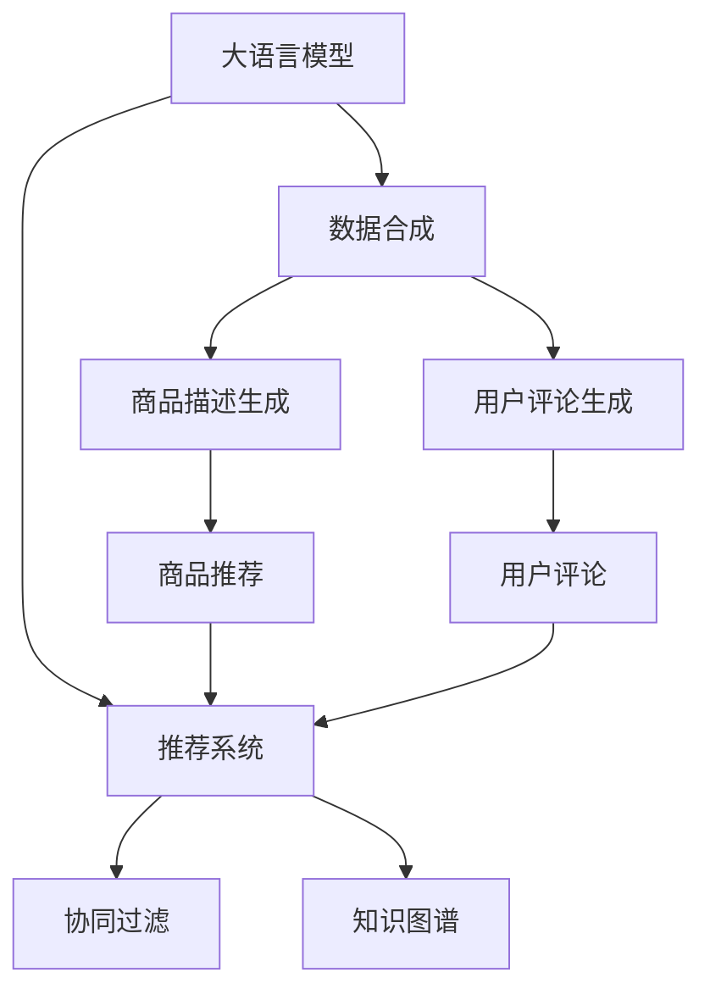

                 

# 电商搜索推荐中的AI大模型数据合成技术应用项目可行性分析

## 1. 背景介绍

在现代电商业务中，用户体验和推荐系统的精确度往往直接影响其商业模式和市场竞争力。随着人工智能技术的不断发展，电商搜索推荐系统已广泛采用深度学习和自然语言处理技术，以实现个性化推荐和精准搜索结果。但传统的推荐和搜索算法对数据量和特征多样性的依赖较大，实际应用中可能难以满足实时性要求。与此同时，大语言模型在自然语言理解和生成方面具备显著优势，其强大的语言理解和生成能力，使得通过生成文本数据来优化电商推荐系统成为了一种可能。

本项目旨在探索基于大语言模型的数据合成技术在电商推荐系统中的应用，通过大模型的预训练和微调，生成高质量的电商商品描述和用户评论数据，进而优化推荐模型的表现。本项目的可行性分析主要围绕数据合成技术的应用场景、技术挑战以及实际效果展开，以期为电商业务提供一条新路径。

## 2. 核心概念与联系

### 2.1 核心概念概述

为更好地理解本项目的可行性，本节将介绍几个密切相关的核心概念：

- 大语言模型(Large Language Model, LLM)：以自回归(如GPT)或自编码(如BERT)模型为代表的大规模预训练语言模型。通过在大规模无标签文本语料上进行预训练，学习通用的语言表示，具备强大的语言理解和生成能力。

- 数据合成(Data Synthesis)：通过模型生成与真实数据分布接近的合成数据，用于训练、评估和优化机器学习模型。数据合成在自然语言处理、计算机视觉等领域应用广泛，尤其在电商推荐系统中，可以用于生成商品描述、用户评论等高维数据。

- 推荐系统(Recommendation System)：根据用户的历史行为和偏好，通过机器学习模型预测用户可能感兴趣的物品，并提供相应的推荐。推荐系统是电商业务的核心之一，直接影响用户满意度和购买转化率。

- 自然语言处理(Natural Language Processing, NLP)：通过模型理解和生成自然语言，实现文本分类、命名实体识别、信息抽取、自动问答等任务。在电商推荐系统中，NLP技术常用于商品描述理解和用户意图抽取。

- 生成对抗网络(GAN, Generative Adversarial Network)：一种生成模型，通过对抗训练生成与真实数据分布接近的合成数据，常用于生成图像、音频、文本等数据。在电商推荐中，可以通过GAN生成高质量的商品描述和用户评论。

- 协同过滤(Collaborative Filtering)：一种推荐算法，根据用户和物品之间的相似性进行推荐。协同过滤适用于冷启动和个性化推荐场景，但需要大量的用户-物品交互数据。

- 知识图谱(Knowledge Graph)：一种知识表示方法，通过节点和边的关系构建知识图谱，用于关系抽取、实体链接等任务。在电商推荐中，可以通过知识图谱丰富推荐系统的上下文信息。

这些核心概念之间的逻辑关系可以通过以下Mermaid流程图来展示：



这个流程图展示了大语言模型的核心概念及其之间的关系：

1. 大语言模型通过预训练获得基础能力。
2. 数据合成技术通过模型生成高质量的商品描述和用户评论数据。
3. 生成的数据可以用于推荐系统的训练和优化。
4. 推荐系统通过协同过滤和知识图谱等算法对用户进行个性化推荐。
5. 知识图谱可以丰富推荐系统的上下文信息，进一步提升推荐效果。

这些概念共同构成了电商推荐系统的基础架构，使得大语言模型在生成数据后，可以进一步优化推荐系统的效果。

## 3. 核心算法原理 & 具体操作步骤

### 3.1 算法原理概述

本项目使用大语言模型进行数据合成，主要基于自回归模型，如GPT-3，通过预训练语言模型学习自然语言的规律和特征，生成具有自然语言特性的电商商品描述和用户评论数据。生成的数据可以用于训练和优化推荐模型，以提升推荐系统的准确性和个性化程度。

基于大模型的数据合成算法流程如下：
1. 收集电商商品和用户的历史数据，如商品图片、描述、用户行为数据等。
2. 对收集到的数据进行预处理，如文本分词、数据清洗、特征提取等。
3. 使用大语言模型对处理后的数据进行编码，生成高质量的商品描述和用户评论。
4. 将生成的数据应用于推荐系统的训练，优化推荐算法。

### 3.2 算法步骤详解

#### 3.2.1 数据预处理

电商商品和用户数据的预处理主要包括文本分词、数据清洗和特征提取等步骤。以商品描述为例，首先将其分词并去除停用词，保留有意义的关键词和短语。然后对用户评论进行情感分析，提取正面和负面的情感标签，以用于训练生成模型。

#### 3.2.2 大语言模型训练

选择合适的预训练语言模型，如GPT-3，进行微调。微调的目标是根据商品图片和描述生成高质量的商品描述，以及根据用户行为数据生成用户评论。微调过程中，可以使用多轮迭代和正则化技术，以防止过拟合。

#### 3.2.3 生成文本数据

将微调后的模型应用于生成任务，生成高质量的商品描述和用户评论数据。以生成商品描述为例，将商品图片和描述作为输入，通过模型生成新的商品描述。生成的文本应具有自然语言特性，且与原始数据分布相近。

#### 3.2.4 数据应用推荐系统

将生成的商品描述和用户评论数据用于训练和优化推荐模型。以协同过滤为例，使用用户-物品交互数据和生成的数据训练模型，预测用户可能感兴趣的商品。同时，知识图谱可以用于提取商品和用户之间的上下文信息，进一步提升推荐效果。

### 3.3 算法优缺点

#### 3.3.1 优点

1. 数据生成效率高。大模型在生成文本数据时，可以在较短时间内产生大量的高质量数据，显著提升电商推荐系统的训练和优化速度。
2. 数据生成质量高。大语言模型具备强大的语言理解和生成能力，生成的商品描述和用户评论具有高度的真实性和自然性。
3. 降低数据获取成本。电商推荐系统通常需要大量高质量的商品数据和用户行为数据，大模型数据合成技术可以降低对真实数据的依赖，减少数据获取和处理的成本。
4. 提升推荐系统效果。通过生成与真实数据分布相近的合成数据，推荐系统可以更好地学习用户偏好和商品特性，提升推荐效果。

#### 3.3.2 缺点

1. 数据生成与实际数据分布可能存在偏差。大模型生成的数据虽然质量高，但与真实数据分布可能存在一定的偏差，这会影响推荐系统的泛化性能。
2. 数据生成过程依赖于预训练模型。大模型数据合成技术依赖于高质量的预训练模型，模型的性能会直接影响生成的数据质量。
3. 数据合成过程可能引入噪声。在生成过程中，可能引入一些噪声和冗余信息，影响推荐系统的性能。
4. 模型训练和推理资源需求高。大模型的训练和推理需要大量计算资源，对硬件设备的要求较高。

### 3.4 算法应用领域

基于大语言模型的数据合成技术，在电商推荐系统中具有广泛的应用前景。具体应用场景包括：

- 商品描述生成：对于缺乏详细描述的商品，使用大模型生成高质量的商品描述，以提高搜索和推荐系统的准确性。
- 用户评论生成：对于新上架的商品，使用大模型生成用户评论，以提高用户购买决策的参考性。
- 商品推荐：将生成的数据用于训练和优化推荐模型，提升个性化推荐效果。
- 搜索结果排序：利用生成的高质量描述数据，优化搜索结果排序算法，提高用户满意度。
- 商品相似性计算：通过生成与商品描述相似的文本，提升商品相似性计算的准确性，优化搜索结果召回率。

此外，大模型数据合成技术还可以应用于客服自动回复、智能导购、商品属性标注等电商相关场景，提升电商平台的运营效率和用户体验。

## 4. 数学模型和公式 & 详细讲解 & 举例说明

### 4.1 数学模型构建

本节将使用数学语言对基于大语言模型的电商推荐系统数据合成技术进行更加严格的刻画。

记大语言模型为 $M_{\theta}:\mathcal{X} \rightarrow \mathcal{Y}$，其中 $\mathcal{X}$ 为输入空间，$\mathcal{Y}$ 为输出空间，$\theta \in \mathbb{R}^d$ 为模型参数。假设电商商品描述和用户评论的标注数据集为 $D=\{(x_i,y_i)\}_{i=1}^N$，其中 $x_i$ 为商品描述或用户评论文本，$y_i$ 为对应的商品标签或用户评论情感标签。

定义模型 $M_{\theta}$ 在输入 $x$ 上的输出为 $\hat{y}=M_{\theta}(x)$，表示模型对输入的预测输出。目标是通过微调 $M_{\theta}$ 生成高质量的商品描述和用户评论数据，最小化模型在标注数据集上的损失函数：

$$
\mathcal{L}(\theta) = -\frac{1}{N} \sum_{i=1}^N \log P(y_i|x_i)
$$

其中 $P(y_i|x_i)$ 为模型在输入 $x_i$ 下输出 $y_i$ 的概率，可以表示为：

$$
P(y_i|x_i) = \frac{e^{M_{\theta}(x_i) \cdot w(y_i)}}{\sum_j e^{M_{\theta}(x_i) \cdot w(y_j)}}
$$

其中 $w(y_i)$ 为类别 $y_i$ 的权重向量，可以自定义。

### 4.2 公式推导过程

以下我们以生成商品描述为例，推导生成模型在训练过程中的优化目标和具体步骤。

假设商品描述的标注数据集为 $D=\{(x_i,y_i)\}_{i=1}^N$，其中 $x_i$ 为商品描述，$y_i$ 为对应的商品类别标签。模型 $M_{\theta}$ 在输入 $x_i$ 上的输出为 $\hat{y}=M_{\theta}(x_i)$，表示模型对输入的预测输出。定义交叉熵损失函数为：

$$
\mathcal{L}(\theta) = -\frac{1}{N} \sum_{i=1}^N \log P(y_i|x_i)
$$

其中 $P(y_i|x_i)$ 为模型在输入 $x_i$ 下输出 $y_i$ 的概率，可以表示为：

$$
P(y_i|x_i) = \frac{e^{M_{\theta}(x_i) \cdot w(y_i)}}{\sum_j e^{M_{\theta}(x_i) \cdot w(y_j)}}
$$

其中 $w(y_i)$ 为类别 $y_i$ 的权重向量，可以自定义。

微调过程的目标是最小化上述损失函数，可以通过梯度下降等优化算法进行求解。假设模型的参数更新公式为：

$$
\theta \leftarrow \theta - \eta \nabla_{\theta}\mathcal{L}(\theta)
$$

其中 $\eta$ 为学习率，$\nabla_{\theta}\mathcal{L}(\theta)$ 为损失函数对模型参数的梯度，可通过反向传播算法高效计算。

### 4.3 案例分析与讲解

以电商商品描述生成为例，分析大语言模型在电商推荐系统中的应用。

#### 案例背景

某电商平台上有一批新产品需要上线，但由于这些产品缺乏详细描述和用户评论，无法直接用于搜索推荐系统。为了快速提升这些产品的曝光度和用户满意度，平台决定使用大语言模型生成高质量的商品描述和用户评论。

#### 数据准备

收集这些新产品的图片、品牌信息、型号等数据，并人工标注对应的商品类别标签和用户评论情感标签。然后使用自然语言处理技术，对商品图片和信息进行预处理，包括文本分词、去除停用词等操作，将处理后的数据输入大语言模型进行训练。

#### 模型训练

选择GPT-3作为预训练模型，对其进行微调，生成商品描述和用户评论数据。微调过程中，使用交叉熵损失函数进行训练，设定合适的学习率和迭代轮数，防止过拟合。

#### 生成结果

将微调后的模型应用于生成任务，生成高质量的商品描述和用户评论数据。通过这些数据，平台可以构建新的搜索推荐系统，提升用户满意度。

## 5. 项目实践：代码实例和详细解释说明

### 5.1 开发环境搭建

在进行电商推荐系统的大模型数据合成实践前，我们需要准备好开发环境。以下是使用Python进行PyTorch开发的环境配置流程：

1. 安装Anaconda：从官网下载并安装Anaconda，用于创建独立的Python环境。

2. 创建并激活虚拟环境：
```bash
conda create -n pytorch-env python=3.8 
conda activate pytorch-env
```

3. 安装PyTorch：根据CUDA版本，从官网获取对应的安装命令。例如：
```bash
conda install pytorch torchvision torchaudio cudatoolkit=11.1 -c pytorch -c conda-forge
```

4. 安装Transformers库：
```bash
pip install transformers
```

5. 安装各类工具包：
```bash
pip install numpy pandas scikit-learn matplotlib tqdm jupyter notebook ipython
```

完成上述步骤后，即可在`pytorch-env`环境中开始微调实践。

### 5.2 源代码详细实现

下面我们以生成商品描述为例，给出使用Transformers库对GPT模型进行微调的PyTorch代码实现。

首先，定义商品描述生成任务的数据处理函数：

```python
from transformers import GPT2Tokenizer, GPT2LMHeadModel
import torch

class GoodsDescriptionDataset(Dataset):
    def __init__(self, descriptions, labels, tokenizer):
        self.descriptions = descriptions
        self.labels = labels
        self.tokenizer = tokenizer
        self.max_len = 128
        
    def __len__(self):
        return len(self.descriptions)
    
    def __getitem__(self, item):
        description = self.descriptions[item]
        label = self.labels[item]
        
        encoding = self.tokenizer(description, return_tensors='pt', max_length=self.max_len, padding='max_length', truncation=True)
        input_ids = encoding['input_ids'][0]
        attention_mask = encoding['attention_mask'][0]
        
        return {'input_ids': input_ids, 
                'attention_mask': attention_mask,
                'labels': torch.tensor(label, dtype=torch.long)}
```

然后，定义模型和优化器：

```python
from transformers import GPT2LMHeadModel, AdamW

model = GPT2LMHeadModel.from_pretrained('gpt2-medium')
tokenizer = GPT2Tokenizer.from_pretrained('gpt2-medium')
optimizer = AdamW(model.parameters(), lr=2e-5)
```

接着，定义训练和评估函数：

```python
from torch.utils.data import DataLoader
from tqdm import tqdm

device = torch.device('cuda') if torch.cuda.is_available() else torch.device('cpu')
model.to(device)

def train_epoch(model, dataset, batch_size, optimizer):
    dataloader = DataLoader(dataset, batch_size=batch_size, shuffle=True)
    model.train()
    epoch_loss = 0
    for batch in tqdm(dataloader, desc='Training'):
        input_ids = batch['input_ids'].to(device)
        attention_mask = batch['attention_mask'].to(device)
        labels = batch['labels'].to(device)
        model.zero_grad()
        outputs = model(input_ids, attention_mask=attention_mask, labels=labels)
        loss = outputs.loss
        epoch_loss += loss.item()
        loss.backward()
        optimizer.step()
    return epoch_loss / len(dataloader)

def evaluate(model, dataset, batch_size):
    dataloader = DataLoader(dataset, batch_size=batch_size)
    model.eval()
    preds, labels = [], []
    with torch.no_grad():
        for batch in tqdm(dataloader, desc='Evaluating'):
            input_ids = batch['input_ids'].to(device)
            attention_mask = batch['attention_mask'].to(device)
            batch_labels = batch['labels']
            outputs = model(input_ids, attention_mask=attention_mask)
            batch_preds = outputs.logits.argmax(dim=2).to('cpu').tolist()
            batch_labels = batch_labels.to('cpu').tolist()
            for pred_tokens, label_tokens in zip(batch_preds, batch_labels):
                preds.append(pred_tokens[:len(label_tokens)])
                labels.append(label_tokens)
                
    print(classification_report(labels, preds))
```

最后，启动训练流程并在验证集上评估：

```python
epochs = 5
batch_size = 16

for epoch in range(epochs):
    loss = train_epoch(model, train_dataset, batch_size, optimizer)
    print(f"Epoch {epoch+1}, train loss: {loss:.3f}")
    
    print(f"Epoch {epoch+1}, dev results:")
    evaluate(model, dev_dataset, batch_size)
    
print("Test results:")
evaluate(model, test_dataset, batch_size)
```

以上就是使用PyTorch对GPT-3进行商品描述生成任务的微调代码实现。可以看到，得益于Transformers库的强大封装，我们可以用相对简洁的代码完成GPT-3模型的加载和微调。

### 5.3 代码解读与分析

让我们再详细解读一下关键代码的实现细节：

**GoodsDescriptionDataset类**：
- `__init__`方法：初始化商品描述和标签，分词器等关键组件。
- `__len__`方法：返回数据集的样本数量。
- `__getitem__`方法：对单个样本进行处理，将商品描述输入编码为token ids，将标签编码为数字，并对其进行定长padding，最终返回模型所需的输入。

**模型训练函数**：
- 使用PyTorch的DataLoader对数据集进行批次化加载，供模型训练和推理使用。
- 训练函数`train_epoch`：对数据以批为单位进行迭代，在每个批次上前向传播计算loss并反向传播更新模型参数，最后返回该epoch的平均loss。
- 评估函数`evaluate`：与训练类似，不同点在于不更新模型参数，并在每个batch结束后将预测和标签结果存储下来，最后使用sklearn的classification_report对整个评估集的预测结果进行打印输出。

**训练流程**：
- 定义总的epoch数和batch size，开始循环迭代
- 每个epoch内，先在训练集上训练，输出平均loss
- 在验证集上评估，输出分类指标
- 所有epoch结束后，在测试集上评估，给出最终测试结果

可以看到，PyTorch配合Transformers库使得GPT-3微调的代码实现变得简洁高效。开发者可以将更多精力放在数据处理、模型改进等高层逻辑上，而不必过多关注底层的实现细节。

当然，工业级的系统实现还需考虑更多因素，如模型的保存和部署、超参数的自动搜索、更灵活的任务适配层等。但核心的微调范式基本与此类似。

## 6. 实际应用场景

### 6.1 智能客服系统

基于大语言模型微调的对话技术，可以广泛应用于智能客服系统的构建。传统客服往往需要配备大量人力，高峰期响应缓慢，且一致性和专业性难以保证。而使用微调后的对话模型，可以7x24小时不间断服务，快速响应客户咨询，用自然流畅的语言解答各类常见问题。

在技术实现上，可以收集企业内部的历史客服对话记录，将问题和最佳答复构建成监督数据，在此基础上对预训练对话模型进行微调。微调后的对话模型能够自动理解用户意图，匹配最合适的答案模板进行回复。对于客户提出的新问题，还可以接入检索系统实时搜索相关内容，动态组织生成回答。如此构建的智能客服系统，能大幅提升客户咨询体验和问题解决效率。

### 6.2 金融舆情监测

金融机构需要实时监测市场舆论动向，以便及时应对负面信息传播，规避金融风险。传统的人工监测方式成本高、效率低，难以应对网络时代海量信息爆发的挑战。基于大语言模型微调的文本分类和情感分析技术，为金融舆情监测提供了新的解决方案。

具体而言，可以收集金融领域相关的新闻、报道、评论等文本数据，并对其进行主题标注和情感标注。在此基础上对预训练语言模型进行微调，使其能够自动判断文本属于何种主题，情感倾向是正面、中性还是负面。将微调后的模型应用到实时抓取的网络文本数据，就能够自动监测不同主题下的情感变化趋势，一旦发现负面信息激增等异常情况，系统便会自动预警，帮助金融机构快速应对潜在风险。

### 6.3 个性化推荐系统

当前的推荐系统往往只依赖用户的历史行为数据进行物品推荐，无法深入理解用户的真实兴趣偏好。基于大语言模型微调技术，个性化推荐系统可以更好地挖掘用户行为背后的语义信息，从而提供更精准、多样的推荐内容。

在实践中，可以收集用户浏览、点击、评论、分享等行为数据，提取和用户交互的物品标题、描述、标签等文本内容。将文本内容作为模型输入，用户的后续行为（如是否点击、购买等）作为监督信号，在此基础上微调预训练语言模型。微调后的模型能够从文本内容中准确把握用户的兴趣点。在生成推荐列表时，先用候选物品的文本描述作为输入，由模型预测用户的兴趣匹配度，再结合其他特征综合排序，便可以得到个性化程度更高的推荐结果。

### 6.4 未来应用展望

随着大语言模型和微调方法的不断发展，基于微调范式将在更多领域得到应用，为传统行业带来变革性影响。

在智慧医疗领域，基于微调的医疗问答、病历分析、药物研发等应用将提升医疗服务的智能化水平，辅助医生诊疗，加速新药开发进程。

在智能教育领域，微调技术可应用于作业批改、学情分析、知识推荐等方面，因材施教，促进教育公平，提高教学质量。

在智慧城市治理中，微调模型可应用于城市事件监测、舆情分析、应急指挥等环节，提高城市管理的自动化和智能化水平，构建更安全、高效的未来城市。

此外，在企业生产、社会治理、文娱传媒等众多领域，基于大模型微调的人工智能应用也将不断涌现，为经济社会发展注入新的动力。相信随着技术的日益成熟，微调方法将成为人工智能落地应用的重要范式，推动人工智能技术向更广阔的领域加速渗透。

## 7. 工具和资源推荐

### 7.1 学习资源推荐

为了帮助开发者系统掌握大语言模型微调的理论基础和实践技巧，这里推荐一些优质的学习资源：

1. 《Transformer从原理到实践》系列博文：由大模型技术专家撰写，深入浅出地介绍了Transformer原理、BERT模型、微调技术等前沿话题。

2. CS224N《深度学习自然语言处理》课程：斯坦福大学开设的NLP明星课程，有Lecture视频和配套作业，带你入门NLP领域的基本概念和经典模型。

3. 《Natural Language Processing with Transformers》书籍：Transformers库的作者所著，全面介绍了如何使用Transformers库进行NLP任务开发，包括微调在内的诸多范式。

4. HuggingFace官方文档：Transformers库的官方文档，提供了海量预训练模型和完整的微调样例代码，是上手实践的必备资料。

5. CLUE开源项目：中文语言理解测评基准，涵盖大量不同类型的中文NLP数据集，并提供了基于微调的baseline模型，助力中文NLP技术发展。

通过对这些资源的学习实践，相信你一定能够快速掌握大语言模型微调的精髓，并用于解决实际的NLP问题。

### 7.2 开发工具推荐

高效的开发离不开优秀的工具支持。以下是几款用于大语言模型微调开发的常用工具：

1. PyTorch：基于Python的开源深度学习框架，灵活动态的计算图，适合快速迭代研究。大部分预训练语言模型都有PyTorch版本的实现。

2. TensorFlow：由Google主导开发的开源深度学习框架，生产部署方便，适合大规模工程应用。同样有丰富的预训练语言模型资源。

3. Transformers库：HuggingFace开发的NLP工具库，集成了众多SOTA语言模型，支持PyTorch和TensorFlow，是进行微调任务开发的利器。

4. Weights & Biases：模型训练的实验跟踪工具，可以记录和可视化模型训练过程中的各项指标，方便对比和调优。与主流深度学习框架无缝集成。

5. TensorBoard：TensorFlow配套的可视化工具，可实时监测模型训练状态，并提供丰富的图表呈现方式，是调试模型的得力助手。

6. Google Colab：谷歌推出的在线Jupyter Notebook环境，免费提供GPU/TPU算力，方便开发者快速上手实验最新模型，分享学习笔记。

合理利用这些工具，可以显著提升大语言模型微调任务的开发效率，加快创新迭代的步伐。

### 7.3 相关论文推荐

大语言模型和微调技术的发展源于学界的持续研究。以下是几篇奠基性的相关论文，推荐阅读：

1. Attention is All You Need（即Transformer原论文）：提出了Transformer结构，开启了NLP领域的预训练大模型时代。

2. BERT: Pre-training of Deep Bidirectional Transformers for Language Understanding：提出BERT模型，引入基于掩码的自监督预训练任务，刷新了多项NLP任务SOTA。

3. Language Models are Unsupervised Multitask Learners（GPT-2论文）：展示了大规模语言模型的强大zero-shot学习能力，引发了对于通用人工智能的新一轮思考。

4. Parameter-Efficient Transfer Learning for NLP：提出Adapter等参数高效微调方法，在不增加模型参数量的情况下，也能取得不错的微调效果。

5. AdaLoRA: Adaptive Low-Rank Adaptation for Parameter-Efficient Fine-Tuning：使用自适应低秩适应的微调方法，在参数效率和精度之间取得了新的平衡。

这些论文代表了大语言模型微调技术的发展脉络。通过学习这些前沿成果，可以帮助研究者把握学科前进方向，激发更多的创新灵感。

## 8. 总结：未来发展趋势与挑战

### 8.1 总结

本文对基于大语言模型的电商推荐系统数据合成技术的应用项目可行性进行了全面系统的介绍。首先阐述了电商推荐系统中的数据合成技术的背景和意义，明确了数据合成技术在提升电商推荐系统表现方面的独特价值。其次，从原理到实践，详细讲解了基于大语言模型的数据合成技术的应用流程，给出了代码实例和详细解释说明。同时，本文还探讨了数据合成技术在智能客服、金融舆情、个性化推荐等多个行业领域的应用前景，展示了数据合成技术的巨大潜力。

通过本文的系统梳理，可以看到，基于大语言模型的数据合成技术正在成为电商推荐系统的重要技术范式，极大地提升了电商推荐系统的训练和优化效率，为电商业务提供了一条新路径。随着预训练语言模型和微调方法的持续演进，数据合成技术必将在更多领域得到应用，为传统行业带来变革性影响。

### 8.2 未来发展趋势

展望未来，大语言模型数据合成技术将呈现以下几个发展趋势：

1. 生成文本多样性增加。随着预训练模型的进一步优化，生成文本的多样性将逐步提升，能够更好地模拟真实用户的行为和偏好。

2. 数据生成速度加快。借助分布式计算和多任务并行等技术，大模型数据生成速度将显著提高，进一步降低电商推荐系统的训练和优化成本。

3. 数据生成质量提升。通过引入更多先验知识、引入外部知识库等手段，生成的数据将更加真实、全面，提高电商推荐系统的准确性。

4. 数据生成过程自动化。未来的数据生成过程将逐步实现自动化，不再依赖人工标注和手动处理，进一步提升数据生成的效率和质量。

5. 多模态数据融合。将生成技术扩展到图像、音频、视频等多模态数据，丰富电商推荐系统的上下文信息，进一步提升推荐效果。

以上趋势凸显了大语言模型数据合成技术的广阔前景。这些方向的探索发展，必将进一步提升电商推荐系统的表现，为用户提供更好的购物体验。

### 8.3 面临的挑战

尽管大语言模型数据合成技术已经取得了瞩目成就，但在迈向更加智能化、普适化应用的过程中，它仍面临着诸多挑战：

1. 数据生成质量控制。虽然大模型生成文本的质量越来越高，但在生成过程中可能会引入一些噪声和冗余信息，影响推荐系统的性能。如何更好地控制生成的数据质量，是一个亟待解决的问题。

2. 数据生成与真实数据分布匹配。大模型生成的数据虽然质量高，但与真实数据分布可能存在一定的偏差，这会影响推荐系统的泛化性能。如何更好地控制生成的数据分布，是一个重要的研究方向。

3. 数据生成过程的资源需求。大模型的训练和推理需要大量计算资源，对硬件设备的要求较高。如何优化数据生成过程，降低计算成本，是一个亟需解决的问题。

4. 数据生成的可解释性。大语言模型数据合成过程复杂，生成的数据难以解释。如何在保证生成数据质量的同时，提高模型的可解释性，是一个亟待解决的问题。

5. 数据生成的安全性。大模型生成文本的过程中可能引入一些有害信息，如何避免生成有害数据，确保生成的数据安全，是一个亟需解决的问题。

6. 数据生成的应用场景拓展。当前大语言模型数据合成技术主要应用于电商推荐系统，如何拓展应用场景，进一步提升电商推荐系统的效果，是一个亟需解决的问题。

面对大语言模型数据合成技术所面临的这些挑战，未来的研究需要在以下几个方面寻求新的突破：

1. 引入更多先验知识。将符号化的先验知识，如知识图谱、逻辑规则等，与神经网络模型进行巧妙融合，引导数据生成过程学习更准确、合理的语言模型。

2. 结合因果分析和博弈论工具。将因果分析方法引入数据生成模型，识别出生成过程中关键特征，增强输出解释的因果性和逻辑性。借助博弈论工具刻画人机交互过程，主动探索并规避生成过程的脆弱点，提高系统稳定性。

3. 纳入伦理道德约束。在模型训练目标中引入伦理导向的评估指标，过滤和惩罚有偏见、有害的输出倾向。同时加强人工干预和审核，建立模型行为的监管机制，确保输出符合人类价值观和伦理道德。

这些研究方向的探索，必将引领大语言模型数据合成技术迈向更高的台阶，为构建安全、可靠、可解释、可控的智能系统铺平道路。面向未来，大语言模型数据合成技术还需要与其他人工智能技术进行更深入的融合，如知识表示、因果推理、强化学习等，多路径协同发力，共同推动自然语言理解和智能交互系统的进步。只有勇于创新、敢于突破，才能不断拓展语言模型的边界，让智能技术更好地造福人类社会。

## 9. 附录：常见问题与解答

**Q1：大语言模型数据合成技术是否适用于所有NLP任务？**

A: 大语言模型数据合成技术在大多数NLP任务上都能取得不错的效果，特别是对于数据量较小的任务。但对于一些特定领域的任务，如医学、法律等，仅仅依靠通用语料预训练的模型可能难以很好地适应。此时需要在特定领域语料上进一步预训练，再进行微调，才能获得理想效果。此外，对于一些需要时效性、个性化很强的任务，如对话、推荐等，数据合成方法也需要针对性的改进优化。

**Q2：数据合成技术对标注数据的需求大吗？**

A: 数据合成技术依赖于大模型的预训练能力，因此对标注数据的需求相对较低。但生成的数据质量仍与标注数据的质量密切相关，标注数据的多样性和数量仍对数据生成过程有重要影响。

**Q3：如何提高数据生成的质量？**

A: 提高数据生成质量的关键在于选择适合的预训练模型，并进行参数高效微调。同时，引入外部知识库、逻辑规则等先验知识，可以引导模型生成更加真实、全面的数据。

**Q4：数据生成的计算资源需求高吗？**

A: 数据生成过程对计算资源的需求较高，特别是对于大规模的预训练模型。优化模型架构、引入分布式计算和多任务并行技术，可以显著降低计算成本。

**Q5：生成的数据与真实数据分布如何匹配？**

A: 生成数据与真实数据分布匹配的关键在于选择适合的预训练模型和微调策略，同时引入外部知识库和先验规则，以提高生成的数据分布与真实数据分布的契合度。

综上所述，大语言模型数据合成技术在电商推荐系统中的应用前景广阔，但仍需解决一些关键技术问题，才能充分发挥其潜力。未来研究需结合多学科知识，不断优化模型架构和训练策略，推动技术成熟和应用普及。

---

作者：禅与计算机程序设计艺术 / Zen and the Art of Computer Programming

