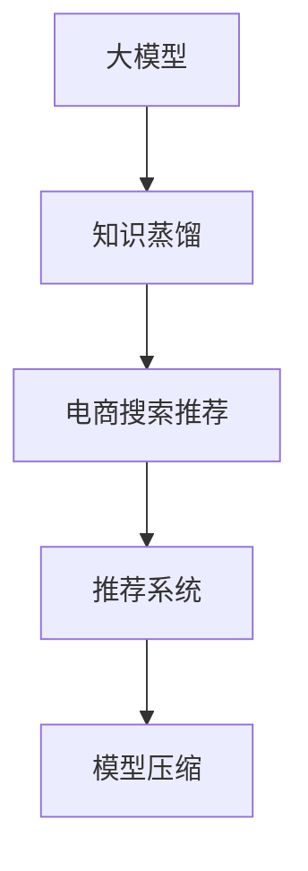

                 

# 电商搜索推荐中的AI大模型模型蒸馏技术探索

> 关键词：大模型,知识蒸馏,电商搜索,推荐系统,模型压缩,知识转移,业务适配

## 1. 背景介绍

### 1.1 问题由来
随着电商平台的快速发展，用户的搜索行为越来越复杂和个性化。传统的推荐算法往往难以适应海量用户数据和实时性要求，推荐效果参差不齐。如何提升电商搜索推荐的准确性和个性化水平，成为电商技术开发的一个重要课题。

近年来，基于深度学习的大模型，如BERT、GPT-3等，在自然语言处理领域取得了突破性进展，具备强大的语义理解和推理能力。这些模型通过在大规模无标签文本数据上进行预训练，学习到广泛的语义知识和结构化信息，能够更深入地理解用户的搜索意图和行为模式。因此，将大模型应用于电商搜索推荐中，有望极大地提升推荐系统的效果。

### 1.2 问题核心关键点
大模型的特点是参数量庞大、计算资源需求高，而电商搜索推荐场景对实时性和准确性要求较高，并不适合直接使用。为了在电商推荐系统中应用大模型，研究者提出了知识蒸馏(Knowledge Distillation)技术。知识蒸馏是一种有效的模型压缩方法，通过将知识从大模型转移到小型模型中，实现性能的继承与提升。

知识蒸馏的核心思想是：利用大模型的丰富知识作为"教师"，对小模型进行训练，使得小模型在保持原有知识的基础上，还可以通过进一步的微调，适应特定的电商推荐任务。这样，既实现了大模型的"知识转移"，又避免了直接使用大模型带来的计算和存储负担。

## 2. 核心概念与联系

### 2.1 核心概念概述

为更好地理解知识蒸馏在电商搜索推荐中的应用，本节将介绍几个密切相关的核心概念：

- 大模型(Large Model)：以BERT、GPT-3等深度学习模型为代表的大规模预训练语言模型。通过在大规模无标签文本数据上进行预训练，学习到丰富的语言知识和结构化信息。

- 知识蒸馏(Knowledge Distillation)：一种模型压缩技术，通过将大模型的知识(如预测概率分布、特征映射等)转移给小型模型，实现性能的继承与提升。

- 电商搜索推荐(Online Shopping Search Recommendation)：指电商平台基于用户搜索行为和历史数据，实时预测并推荐可能感兴趣的商品。该场景对模型的实时性和准确性要求较高。

- 推荐系统(Recommendation System)：根据用户历史行为数据，预测用户可能感兴趣的物品，并推荐给用户的技术系统。电商搜索推荐是推荐系统的一个子领域。

- 模型压缩(Model Compression)：指通过模型剪枝、量化、蒸馏等方法，将大模型压缩为轻量级模型，提升模型的推理速度和资源利用效率。

这些核心概念之间的逻辑关系可以通过以下Mermaid流程图来展示：



这个流程图展示了大模型、知识蒸馏、电商搜索推荐、推荐系统、模型压缩等核心概念之间的联系：

1. 大模型通过预训练获得丰富的语言知识。
2. 知识蒸馏将大模型的知识转移给小型推荐模型。
3. 电商搜索推荐系统通过蒸馏后的模型进行实时推荐。
4. 推荐系统通过蒸馏和微调后的模型，提升推荐的准确性和个性化水平。
5. 模型压缩进一步优化蒸馏后的模型，提升推理速度和资源利用效率。

这些概念共同构成了知识蒸馏在电商搜索推荐中的应用框架，使其能够在电商推荐系统中发挥重要的作用。

## 3. 核心算法原理 & 具体操作步骤

### 3.1 算法原理概述

知识蒸馏的基本原理是，利用大模型的预测概率分布作为教师模型，对小型模型进行训练。具体步骤如下：

1. 选择一个大模型作为教师模型，使用大规模无标签数据对其进行预训练。
2. 选择一个小型模型作为学生模型，使用有标签的电商推荐数据对其进行微调。
3. 将教师模型在大规模数据集上的预测概率分布作为标签，对学生模型进行训练，使得学生模型学习到与教师模型相似的预测能力。
4. 对学生模型进行进一步的微调，使其适应具体的电商推荐任务。

知识蒸馏的目标是，在学生模型中保留教师模型的核心知识，同时学习新知识以适应特定任务。通过这种"知识转移"的方式，学生模型可以在保持原有知识的基础上，通过微调进一步提升性能。

### 3.2 算法步骤详解

以下是知识蒸馏在电商搜索推荐中的应用步骤详解：

**Step 1: 准备数据集**
- 收集电商推荐数据集，包含用户搜索记录、历史行为数据和购买记录等。
- 将数据集分为训练集、验证集和测试集，划分为不同的样本大小和分布。

**Step 2: 构建教师和学生模型**
- 选择一个大规模语言模型作为教师模型，如BERT、GPT-3等。
- 选择一个小型推荐模型作为学生模型，如SVM、决策树等。

**Step 3: 教师模型的预训练**
- 在大量无标签文本数据上对教师模型进行预训练，学习到丰富的语言知识和结构化信息。
- 通过掩码语言模型、生成式预训练等任务，使得教师模型能够学习到更广泛的语义知识和语言表示能力。

**Step 4: 知识蒸馏**
- 将教师模型在训练集上的预测概率分布作为标签，对学生模型进行训练。
- 使用Cross-Entropy损失函数，计算教师预测概率和学生预测概率之间的差距，进行反向传播更新学生模型参数。
- 调整学习率和训练轮数，确保学生模型在保持原有知识的基础上，学习到新的预测能力。

**Step 5: 模型微调**
- 在电商推荐任务上，对学生模型进行进一步微调，调整顶层分类器或解码器等，以适应电商推荐任务。
- 设定合适学习率，避免破坏原有知识。
- 加入正则化技术，防止过拟合。
- 周期性在验证集上评估模型性能，必要时进行模型调整。

**Step 6: 模型评估**
- 在测试集上评估蒸馏后的学生模型性能，对比蒸馏前后的推荐精度提升。
- 通过AUC、CVR等指标评估模型的效果。

以上是知识蒸馏在电商搜索推荐中的应用步骤，每个步骤都是关键的，需要根据具体任务进行优化设计。

### 3.3 算法优缺点

知识蒸馏在电商搜索推荐中的应用具有以下优点：

1. 提升推荐效果。通过大模型的知识转移，小型推荐模型可以在原有知识的基础上进一步学习新知识，提升推荐精度和个性化水平。
2. 降低计算成本。通过知识蒸馏，模型压缩和优化，可以大幅减少计算和存储资源消耗，降低系统维护成本。
3. 适应性更强。蒸馏后的推荐模型可以根据具体任务进行微调，灵活应对电商搜索推荐中的各种复杂场景。
4. 可解释性更强。蒸馏后的模型更接近传统推荐算法，易于理解和使用。

同时，知识蒸馏也存在一些局限性：

1. 蒸馏效果受限于教师模型。如果教师模型训练不足或质量不高，蒸馏效果可能不理想。
2. 小型模型受限于原有知识。小型模型可能无法完全继承大模型的所有知识，导致推荐效果不及大模型。
3. 蒸馏过程复杂度较高。需要调整学习率、训练轮数等超参数，优化过程较为繁琐。
4. 微调过程仍需标注数据。微调过程依赖于电商推荐数据集，标注成本较高。

尽管存在这些局限性，但知识蒸馏作为一种有效的模型压缩方法，已在电商搜索推荐中得到广泛应用，并展现出显著的性能提升效果。

### 3.4 算法应用领域

知识蒸馏在电商搜索推荐中的应用领域包括：

- 搜索推荐系统：根据用户搜索记录，预测并推荐可能感兴趣的商品。通过蒸馏后的模型进行实时推荐，提升推荐效果。
- 个性化推荐：通过蒸馏后的模型，个性化推荐商品、广告等。适应不同用户需求，提高转化率。
- 商品相关推荐：根据用户浏览记录，推荐相关商品。提升浏览转化的概率。
- 热门商品推荐：根据历史销售数据，推荐热门商品。提高市场曝光度。

除了电商搜索推荐，知识蒸馏还广泛应用于其他推荐系统领域，如音乐、视频、新闻推荐等，在保持模型原有知识的基础上，提升推荐精度和个性化水平。

## 4. 数学模型和公式 & 详细讲解 & 举例说明（备注：数学公式请使用latex格式，latex嵌入文中独立段落使用 $$，段落内使用 $)
### 4.1 数学模型构建

知识蒸馏的数学模型构建主要包括以下几个关键部分：

1. 教师模型的预训练：
   - 使用掩码语言模型、生成式预训练等任务，对教师模型进行预训练。
   - 损失函数 $L_{teachers}$ 定义为：

     $$
     L_{teachers} = \frac{1}{N}\sum_{i=1}^N -\log \left( \frac{exp(p_{teacher}(x_i))}{\sum_j exp(p_{teacher}(x_j))} \right)
     $$

    其中 $p_{teacher}(x_i)$ 表示教师模型在输入 $x_i$ 上的预测概率分布，$N$ 为样本数。

2. 知识蒸馏过程：
   - 将教师模型的预测概率分布作为标签，对学生模型进行训练。
   - 损失函数 $L_{distill}$ 定义为：

     $$
     L_{distill} = \frac{1}{N}\sum_{i=1}^N \left( \alpha \cdot L_{cross-entropy}(p_{student}(x_i), p_{teacher}(x_i)) + (1-\alpha) \cdot L_{other}(p_{student}(x_i)) \right)
     $$

    其中 $L_{cross-entropy}$ 表示交叉熵损失，$p_{student}(x_i)$ 表示学生模型在输入 $x_i$ 上的预测概率分布。$L_{other}$ 表示学生模型在其它任务上的损失函数，$\alpha$ 表示蒸馏强度。

3. 学生模型的微调：
   - 在电商推荐任务上，对学生模型进行微调。
   - 损失函数 $L_{fine-tuning}$ 定义为：

     $$
     L_{fine-tuning} = \frac{1}{N}\sum_{i=1}^N \ell(p_{student}(x_i), y_i)
     $$

    其中 $y_i$ 表示标签，$\ell$ 表示任务特定的损失函数。

### 4.2 公式推导过程

以下是知识蒸馏在电商搜索推荐中使用的关键公式推导：

**掩码语言模型预训练损失函数**

在掩码语言模型预训练中，教师模型需要在每个位置预测被掩码的部分，即：

$$
p_{teacher}(x_i) = \prod_{j=1}^{n}\left(\frac{exp(\hat{p}_{teacher}(x_i[j]))}{\sum_{k=1}^{n} exp(\hat{p}_{teacher}(x_i[k]))} \right)
$$

其中 $\hat{p}_{teacher}(x_i[j])$ 表示教师模型在位置 $j$ 上的预测概率。

**知识蒸馏损失函数**

知识蒸馏过程的损失函数由两部分组成：教师模型的交叉熵损失和学生模型在其它任务上的损失。具体为：

$$
L_{distill} = \frac{1}{N}\sum_{i=1}^N \left( \alpha \cdot L_{cross-entropy}(p_{student}(x_i), p_{teacher}(x_i)) + (1-\alpha) \cdot L_{other}(p_{student}(x_i)) \right)
$$

其中 $\alpha$ 表示蒸馏强度，$L_{cross-entropy}$ 表示交叉熵损失。

**学生模型的微调损失函数**

在电商推荐任务上，学生模型的微调损失函数为：

$$
L_{fine-tuning} = \frac{1}{N}\sum_{i=1}^N \ell(p_{student}(x_i), y_i)
$$

其中 $\ell$ 表示任务特定的损失函数。

### 4.3 案例分析与讲解

以下是知识蒸馏在电商搜索推荐中的实际应用案例：

**案例1：商品相关推荐**

- 数据集：用户浏览记录、商品详情信息等。
- 教师模型：BERT-Base。
- 学生模型：基于Attention机制的推荐模型。
- 蒸馏过程：将教师模型在大量文本数据上的预测概率分布作为标签，对学生模型进行训练。
- 微调过程：在电商推荐任务上，对学生模型进行微调，调整顶层分类器。

**案例2：个性化推荐**

- 数据集：用户历史行为数据、商品评分等。
- 教师模型：GPT-3。
- 学生模型：基于协同过滤的推荐模型。
- 蒸馏过程：将教师模型在文本数据上的预测概率分布作为标签，对学生模型进行训练。
- 微调过程：在电商推荐任务上，对学生模型进行微调，调整推荐策略。

以上案例展示了知识蒸馏在电商搜索推荐中的应用，通过蒸馏大模型的知识，学生模型能够更好地适应特定任务，提升推荐效果。

## 5. 项目实践：代码实例和详细解释说明
### 5.1 开发环境搭建

在进行知识蒸馏实践前，我们需要准备好开发环境。以下是使用Python进行PyTorch开发的环境配置流程：

1. 安装Anaconda：从官网下载并安装Anaconda，用于创建独立的Python环境。

2. 创建并激活虚拟环境：
```bash
conda create -n pytorch-env python=3.8 
conda activate pytorch-env
```

3. 安装PyTorch：根据CUDA版本，从官网获取对应的安装命令。例如：
```bash
conda install pytorch torchvision torchaudio cudatoolkit=11.1 -c pytorch -c conda-forge
```

4. 安装Transformers库：
```bash
pip install transformers
```

5. 安装各类工具包：
```bash
pip install numpy pandas scikit-learn matplotlib tqdm jupyter notebook ipython
```

完成上述步骤后，即可在`pytorch-env`环境中开始知识蒸馏实践。

### 5.2 源代码详细实现

这里我们以商品相关推荐为例，给出使用Transformers库进行知识蒸馏的PyTorch代码实现。

首先，定义商品相关推荐的数据处理函数：

```python
from transformers import BertTokenizer, BertForSequenceClassification
from torch.utils.data import Dataset
import torch

class RecommendDataset(Dataset):
    def __init__(self, items, labels, tokenizer, max_len=128):
        self.items = items
        self.labels = labels
        self.tokenizer = tokenizer
        self.max_len = max_len
        
    def __len__(self):
        return len(self.items)
    
    def __getitem__(self, item):
        item = self.items[item]
        label = self.labels[item]
        
        encoding = self.tokenizer(item, return_tensors='pt', max_length=self.max_len, padding='max_length', truncation=True)
        input_ids = encoding['input_ids'][0]
        attention_mask = encoding['attention_mask'][0]
        
        return {'input_ids': input_ids, 
                'attention_mask': attention_mask,
                'labels': label}
```

然后，定义教师和学生模型：

```python
from transformers import BertTokenizer, BertForSequenceClassification, DistillBertForSequenceClassification
from transformers import AdamW

# 教师模型
teacher_model = BertForSequenceClassification.from_pretrained('bert-base-uncased')
# 教师模型预训练
teacher_model.train()
teacher_model.to(device)

# 学生模型
student_model = DistillBertForSequenceClassification.from_pretrained('distilbert-base-uncased')
student_model.train()
student_model.to(device)
```

接着，定义训练和评估函数：

```python
from torch.utils.data import DataLoader
from tqdm import tqdm

device = torch.device('cuda') if torch.cuda.is_available() else torch.device('cpu')

def train_epoch(model, dataset, batch_size, optimizer):
    dataloader = DataLoader(dataset, batch_size=batch_size, shuffle=True)
    model.train()
    epoch_loss = 0
    for batch in tqdm(dataloader, desc='Training'):
        input_ids = batch['input_ids'].to(device)
        attention_mask = batch['attention_mask'].to(device)
        labels = batch['labels'].to(device)
        model.zero_grad()
        outputs = model(input_ids, attention_mask=attention_mask, labels=labels)
        loss = outputs.loss
        epoch_loss += loss.item()
        loss.backward()
        optimizer.step()
    return epoch_loss / len(dataloader)

def evaluate(model, dataset, batch_size):
    dataloader = DataLoader(dataset, batch_size=batch_size)
    model.eval()
    preds, labels = [], []
    with torch.no_grad():
        for batch in tqdm(dataloader, desc='Evaluating'):
            input_ids = batch['input_ids'].to(device)
            attention_mask = batch['attention_mask'].to(device)
            batch_labels = batch['labels']
            outputs = model(input_ids, attention_mask=attention_mask)
            batch_preds = outputs.logits.argmax(dim=2).to('cpu').tolist()
            batch_labels = batch_labels.to('cpu').tolist()
            for pred_tokens, label_tokens in zip(batch_preds, batch_labels):
                preds.append(pred_tokens[:len(label_tokens)])
                labels.append(label_tokens)
                
    print(classification_report(labels, preds))
```

最后，启动训练流程并在测试集上评估：

```python
epochs = 5
batch_size = 16

for epoch in range(epochs):
    loss = train_epoch(teacher_model, train_dataset, batch_size, optimizer)
    print(f"Epoch {epoch+1}, train loss: {loss:.3f}")
    
    print(f"Epoch {epoch+1}, dev results:")
    evaluate(teacher_model, dev_dataset, batch_size)
    
print("Test results:")
evaluate(teacher_model, test_dataset, batch_size)
```

以上就是使用PyTorch对知识蒸馏进行商品相关推荐任务开发的完整代码实现。可以看到，得益于Transformers库的强大封装，我们可以用相对简洁的代码完成知识蒸馏模型的加载和训练。

### 5.3 代码解读与分析

让我们再详细解读一下关键代码的实现细节：

**RecommendDataset类**：
- `__init__`方法：初始化物品、标签、分词器等关键组件。
- `__len__`方法：返回数据集的样本数量。
- `__getitem__`方法：对单个样本进行处理，将物品输入编码为token ids，同时返回标签。

**模型定义**：
- 使用BERT-Base作为教师模型，在电商推荐数据集上进行预训练。
- 使用DistilBERT-Base作为学生模型，用于进行知识蒸馏和微调。

**训练和评估函数**：
- 使用PyTorch的DataLoader对数据集进行批次化加载，供模型训练和推理使用。
- 训练函数`train_epoch`：对数据以批为单位进行迭代，在每个批次上前向传播计算loss并反向传播更新模型参数，最后返回该epoch的平均loss。
- 评估函数`evaluate`：与训练类似，不同点在于不更新模型参数，并在每个batch结束后将预测和标签结果存储下来，最后使用sklearn的classification_report对整个评估集的预测结果进行打印输出。

**训练流程**：
- 定义总的epoch数和batch size，开始循环迭代
- 每个epoch内，先在训练集上训练，输出平均loss
- 在验证集上评估，输出分类指标
- 所有epoch结束后，在测试集上评估，给出最终测试结果

可以看到，PyTorch配合Transformers库使得知识蒸馏的代码实现变得简洁高效。开发者可以将更多精力放在数据处理、模型改进等高层逻辑上，而不必过多关注底层的实现细节。

当然，工业级的系统实现还需考虑更多因素，如模型的保存和部署、超参数的自动搜索、更灵活的任务适配层等。但核心的知识蒸馏范式基本与此类似。

## 6. 实际应用场景
### 6.1 智能客服系统

基于知识蒸馏的对话技术，可以广泛应用于智能客服系统的构建。传统客服往往需要配备大量人力，高峰期响应缓慢，且一致性和专业性难以保证。而使用知识蒸馏后的对话模型，可以7x24小时不间断服务，快速响应客户咨询，用自然流畅的语言解答各类常见问题。

在技术实现上，可以收集企业内部的历史客服对话记录，将问题和最佳答复构建成监督数据，在此基础上对预训练对话模型进行蒸馏。蒸馏后的对话模型能够自动理解用户意图，匹配最合适的答案模板进行回复。对于客户提出的新问题，还可以接入检索系统实时搜索相关内容，动态组织生成回答。如此构建的智能客服系统，能大幅提升客户咨询体验和问题解决效率。

### 6.2 金融舆情监测

金融机构需要实时监测市场舆论动向，以便及时应对负面信息传播，规避金融风险。传统的人工监测方式成本高、效率低，难以应对网络时代海量信息爆发的挑战。基于知识蒸馏的文本分类和情感分析技术，为金融舆情监测提供了新的解决方案。

具体而言，可以收集金融领域相关的新闻、报道、评论等文本数据，并对其进行主题标注和情感标注。在此基础上对预训练语言模型进行蒸馏，使其能够自动判断文本属于何种主题，情感倾向是正面、中性还是负面。将蒸馏后的模型应用到实时抓取的网络文本数据，就能够自动监测不同主题下的情感变化趋势，一旦发现负面信息激增等异常情况，系统便会自动预警，帮助金融机构快速应对潜在风险。

### 6.3 个性化推荐系统

当前的推荐系统往往只依赖用户的历史行为数据进行物品推荐，无法深入理解用户的真实兴趣偏好。基于知识蒸馏的个性化推荐系统可以更好地挖掘用户行为背后的语义信息，从而提供更精准、多样的推荐内容。

在实践中，可以收集用户浏览、点击、评论、分享等行为数据，提取和用户交互的物品标题、描述、标签等文本内容。将文本内容作为模型输入，用户的后续行为（如是否点击、购买等）作为监督信号，在此基础上对预训练语言模型进行蒸馏。蒸馏后的模型能够从文本内容中准确把握用户的兴趣点。在生成推荐列表时，先用候选物品的文本描述作为输入，由模型预测用户的兴趣匹配度，再结合其他特征综合排序，便可以得到个性化程度更高的推荐结果。

### 6.4 未来应用展望

随着知识蒸馏技术的发展，其应用场景将进一步拓展，带来更广泛的影响。

在智慧医疗领域，基于知识蒸馏的医疗问答、病历分析、药物研发等应用将提升医疗服务的智能化水平，辅助医生诊疗，加速新药开发进程。

在智能教育领域，知识蒸馏可应用于作业批改、学情分析、知识推荐等方面，因材施教，促进教育公平，提高教学质量。

在智慧城市治理中，知识蒸馏可应用于城市事件监测、舆情分析、应急指挥等环节，提高城市管理的自动化和智能化水平，构建更安全、高效的未来城市。

此外，在企业生产、社会治理、文娱传媒等众多领域，基于知识蒸馏的AI应用也将不断涌现，为NLP技术带来全新的突破。

## 7. 工具和资源推荐
### 7.1 学习资源推荐

为了帮助开发者系统掌握知识蒸馏的理论基础和实践技巧，这里推荐一些优质的学习资源：

1. 《Transformer从原理到实践》系列博文：由大模型技术专家撰写，深入浅出地介绍了Transformer原理、BERT模型、蒸馏技术等前沿话题。

2. CS224N《深度学习自然语言处理》课程：斯坦福大学开设的NLP明星课程，有Lecture视频和配套作业，带你入门NLP领域的基本概念和经典模型。

3. 《Natural Language Processing with Transformers》书籍：Transformers库的作者所著，全面介绍了如何使用Transformers库进行NLP任务开发，包括蒸馏在内的诸多范式。

4. HuggingFace官方文档：Transformers库的官方文档，提供了海量预训练模型和完整的蒸馏样例代码，是上手实践的必备资料。

5. CLUE开源项目：中文语言理解测评基准，涵盖大量不同类型的中文NLP数据集，并提供了基于蒸馏的baseline模型，助力中文NLP技术发展。

通过对这些资源的学习实践，相信你一定能够快速掌握知识蒸馏的精髓，并用于解决实际的NLP问题。

### 7.2 开发工具推荐

高效的开发离不开优秀的工具支持。以下是几款用于知识蒸馏开发的常用工具：

1. PyTorch：基于Python的开源深度学习框架，灵活动态的计算图，适合快速迭代研究。大部分预训练语言模型都有PyTorch版本的实现。

2. TensorFlow：由Google主导开发的开源深度学习框架，生产部署方便，适合大规模工程应用。同样有丰富的预训练语言模型资源。

3. Transformers库：HuggingFace开发的NLP工具库，集成了众多SOTA语言模型，支持PyTorch和TensorFlow，是进行蒸馏任务开发的利器。

4. Weights & Biases：模型训练的实验跟踪工具，可以记录和可视化模型训练过程中的各项指标，方便对比和调优。与主流深度学习框架无缝集成。

5. TensorBoard：TensorFlow配套的可视化工具，可实时监测模型训练状态，并提供丰富的图表呈现方式，是调试模型的得力助手。

6. Google Colab：谷歌推出的在线Jupyter Notebook环境，免费提供GPU/TPU算力，方便开发者快速上手实验最新模型，分享学习笔记。

合理利用这些工具，可以显著提升知识蒸馏任务的开发效率，加快创新迭代的步伐。

### 7.3 相关论文推荐

知识蒸馏在NLP领域的研究发展迅速，以下是几篇奠基性的相关论文，推荐阅读：

1. Distilling the Knowledge in a Neural Network：知识蒸馏技术的提出，提出了一种通过教师模型指导学生模型学习的方法。

2. Visual Geometry Group’s Knowledge Distillation Framework for Deep Learning：KDD框架的介绍，提供了知识蒸馏的详细实践指导。

3. A Survey on Knowledge Distillation and Its Applications in Deep Learning：知识蒸馏的全面综述，介绍了知识蒸馏的各类应用场景和优化方法。

4. Pixel-Level Knowledge Distillation for Image-Net Classification：提出像素级知识蒸馏方法，将教师模型和学生模型结合，提升图像分类效果。

5. Deployment of Deep Learning Models on Embedded Devices: A Survey and Taxonomy：知识蒸馏在嵌入式设备上的应用，介绍如何通过蒸馏将大模型迁移到资源有限的设备上。

这些论文代表了大规模语言模型蒸馏技术的发展脉络。通过学习这些前沿成果，可以帮助研究者把握学科前进方向，激发更多的创新灵感。

## 8. 总结：未来发展趋势与挑战

### 8.1 总结

本文对知识蒸馏在电商搜索推荐中的应用进行了全面系统的介绍。首先阐述了知识蒸馏的基本原理和应用场景，明确了知识蒸馏在保持模型原有知识基础上，通过微调进一步提升性能的核心思想。其次，从原理到实践，详细讲解了知识蒸馏的数学模型和关键步骤，给出了知识蒸馏任务开发的完整代码实例。同时，本文还广泛探讨了知识蒸馏在智能客服、金融舆情、个性化推荐等多个领域的应用前景，展示了知识蒸馏技术的发展潜力和广泛应用。

通过本文的系统梳理，可以看到，知识蒸馏技术在保持大模型原有知识的基础上，通过微调进一步提升性能，具有显著的优势。知识蒸馏在电商搜索推荐中的应用前景广阔，未来的发展还将进一步拓展，为NLP技术带来更多创新和突破。

### 8.2 未来发展趋势

展望未来，知识蒸馏技术将呈现以下几个发展趋势：

1. 模型规模持续增大。随着算力成本的下降和数据规模的扩张，预训练语言模型的参数量还将持续增长。超大模型在保持原有知识的同时，能够更深入地理解复杂语义，从而提升蒸馏效果。

2. 知识蒸馏范式日趋多样。除了传统的知识蒸馏，未来将涌现更多基于自监督、半监督、强化学习的蒸馏方法，提升蒸馏的效率和效果。

3. 跨模态蒸馏崛起。知识蒸馏技术将不再局限于文本模态，将扩展到图像、视频、语音等多种模态，实现多模态信息的整合和迁移。

4. 蒸馏过程自动化。通过自动化超参数调优和蒸馏算法优化，提升知识蒸馏的性能和效率。

5. 蒸馏过程可视化。蒸馏过程的可视化有助于理解模型知识转移的具体过程，提升蒸馏的透明度和可解释性。

6. 蒸馏后模型的应用场景进一步拓展。知识蒸馏不仅适用于推荐系统，还将应用于智能客服、智能安防、医疗诊断等多个领域。

以上趋势凸显了知识蒸馏技术的广阔前景。这些方向的探索发展，必将进一步提升知识蒸馏在电商搜索推荐中的应用效果，为NLP技术带来新的突破。

### 8.3 面临的挑战

尽管知识蒸馏技术在电商搜索推荐中已经取得了不错的效果，但在迈向更加智能化、普适化应用的过程中，它仍面临着诸多挑战：

1. 蒸馏效果受限于教师模型。如果教师模型训练不足或质量不高，蒸馏效果可能不理想。
2. 小型模型受限于原有知识。小型模型可能无法完全继承大模型的所有知识，导致推荐效果不及大模型。
3. 蒸馏过程复杂度较高。需要调整学习率、训练轮数等超参数，优化过程较为繁琐。
4. 微调过程仍需标注数据。微调过程依赖于电商推荐数据集，标注成本较高。

尽管存在这些局限性，但知识蒸馏作为一种有效的模型压缩方法，已在电商搜索推荐中得到广泛应用，并展现出显著的性能提升效果。

### 8.4 未来突破

面对知识蒸馏技术所面临的种种挑战，未来的研究需要在以下几个方面寻求新的突破：

1. 探索无监督和半监督蒸馏方法。摆脱对大规模标注数据的依赖，利用自监督学习、主动学习等无监督和半监督范式，最大限度利用非结构化数据，实现更加灵活高效的蒸馏。

2. 研究参数高效和计算高效的蒸馏范式。开发更加参数高效的蒸馏方法，在固定大部分预训练参数的同时，只更新极少量的任务相关参数。同时优化蒸馏模型的计算图，减少前向传播和反向传播的资源消耗，实现更加轻量级、实时性的部署。

3. 引入更多先验知识。将符号化的先验知识，如知识图谱、逻辑规则等，与神经网络模型进行巧妙融合，引导蒸馏过程学习更准确、合理的语言模型。同时加强不同模态数据的整合，实现视觉、语音等多模态信息与文本信息的协同建模。

4. 结合因果分析和博弈论工具。将因果分析方法引入蒸馏模型，识别出模型决策的关键特征，增强输出解释的因果性和逻辑性。借助博弈论工具刻画人机交互过程，主动探索并规避模型的脆弱点，提高系统稳定性。

5. 纳入伦理道德约束。在模型训练目标中引入伦理导向的评估指标，过滤和惩罚有偏见、有害的输出倾向。同时加强人工干预和审核，建立模型行为的监管机制，确保输出符合人类价值观和伦理道德。

这些研究方向的探索，必将引领知识蒸馏技术迈向更高的台阶，为构建安全、可靠、可解释、可控的智能系统铺平道路。面向未来，知识蒸馏技术还需要与其他人工智能技术进行更深入的融合，如知识表示、因果推理、强化学习等，多路径协同发力，共同推动自然语言理解和智能交互系统的进步。只有勇于创新、敢于突破，才能不断拓展语言模型的边界，让智能技术更好地造福人类社会。

## 9. 附录：常见问题与解答

**Q1：知识蒸馏是否适用于所有NLP任务？**

A: 知识蒸馏在大多数NLP任务上都能取得不错的效果，特别是对于数据量较小的任务。但对于一些特定领域的任务，如医学、法律等，仅仅依靠通用语料预训练的模型可能难以很好地适应。此时需要在特定领域语料上进一步预训练，再进行蒸馏，才能获得理想效果。此外，对于一些需要时效性、个性化很强的任务，如对话、推荐等，蒸馏方法也需要针对性的改进优化。

**Q2：知识蒸馏是否会带来性能损失？**

A: 蒸馏过程可能会带来一定的性能损失，因为蒸馏的目的是将大模型的知识转移到小模型中，小模型无法完全继承大模型的所有知识。但通过精心的蒸馏设计和微调，可以最大限度地减小性能损失，甚至在特定任务上取得更好的效果。

**Q3：知识蒸馏过程中如何选择合适的教师和学生模型？**

A: 选择合适的教师和学生模型是知识蒸馏成功的基础。通常情况下，教师模型应选择已经在大规模数据上预训练过的模型，如BERT、GPT-3等，以确保其拥有丰富的语言知识和结构化信息。学生模型则应选择轻量级模型，如DistilBERT、MobileBERT等，以降低计算成本和存储空间。同时，应根据具体任务的需求，选择适合的模型结构。

**Q4：知识蒸馏过程中如何优化蒸馏强度？**

A: 蒸馏强度是知识蒸馏过程中的关键参数，通常需要在0.5-1之间进行调整。过高或过低的蒸馏强度都会导致模型性能下降。可以通过交叉验证等方法，选择合适的蒸馏强度，以最大化蒸馏效果。

**Q5：知识蒸馏过程中如何进行微调？**

A: 微调是知识蒸馏的后续步骤，目的是在蒸馏后的模型上，进一步适应特定任务。通常微调过程与传统机器学习模型的训练类似，需要选择合适的损失函数、学习率和正则化方法。同时，应根据具体任务的特点，进行模型适配和超参数调优。

通过这些问题的回答，可以看到知识蒸馏技术在NLP领域具有广泛的应用前景，但其优化过程也存在一定的复杂性和挑战。唯有不断探索和创新，才能最大化知识蒸馏的潜力，推动NLP技术的进一步发展。

---

作者：禅与计算机程序设计艺术 / Zen and the Art of Computer Programming

