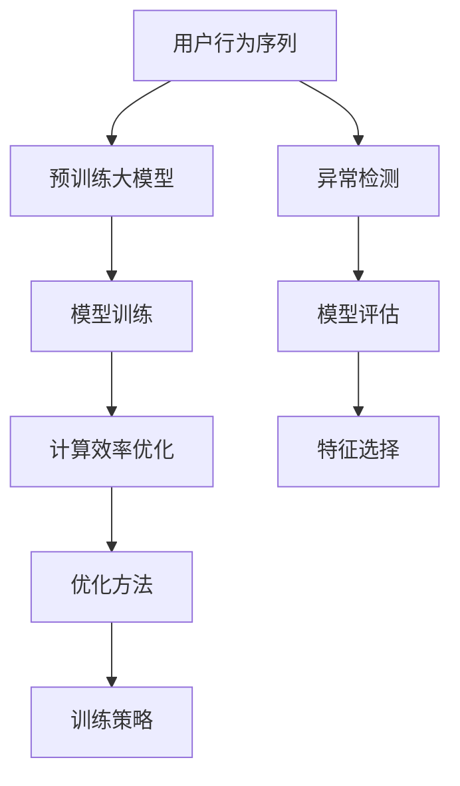

                 

# 电商搜索推荐中的AI大模型用户行为序列异常检测模型优化策略

> 关键词：电商搜索推荐, 用户行为序列, 异常检测, AI大模型, 优化策略, 算法原理, 模型训练, 计算效率, 特征选择, 模型评估

## 1. 背景介绍

在现代电商环境下，用户行为数据对于个性化推荐系统的设计至关重要。随着人工智能技术的进步，使用预训练大模型对用户行为序列进行建模成为一种趋势。然而，由于用户行为序列可能存在异常点（如恶意点击、点击欺骗等），如何检测并处理这些异常，对于提升推荐系统的效果和可靠性至关重要。

### 1.1 问题由来

电商搜索推荐系统通过分析用户历史点击、浏览、购买等行为数据，预测用户可能感兴趣的商品并推荐。预训练大模型（如BERT、GPT-3等）已经被证明能够捕捉用户行为序列中的复杂特征，提升推荐的准确性。但大模型同时也会受到异常数据的影响，导致推荐结果的准确性下降。异常检测模型能够有效识别并过滤掉异常数据，从而提升推荐的可靠性。

### 1.2 问题核心关键点

异常检测模型的优化策略涉及多方面的考量，包括：
1. 数据预处理：如何从原始数据中提取有意义的特征。
2. 模型选择：选择何种模型进行异常检测。
3. 训练策略：如何设置合适的学习率和迭代次数。
4. 模型评估：如何定义评价指标和评估方法。
5. 优化方法：如何提高模型计算效率和准确性。

这些关键点共同构成了一个电商搜索推荐系统中异常检测模型的优化框架，对于提升推荐系统的性能和用户满意度具有重要意义。

## 2. 核心概念与联系

### 2.1 核心概念概述

本节将介绍几个与电商搜索推荐系统中的异常检测模型优化相关的核心概念：

- 用户行为序列(User Behavior Sequence)：用户在页面上的点击、浏览、购买等操作序列，是电商推荐系统的输入数据。
- 异常检测(Anomaly Detection)：识别并标记数据集中异常点的过程。异常检测在电商推荐中用于过滤掉恶意点击、点击欺骗等异常行为，保障推荐系统的公正性和准确性。
- 预训练大模型(Pre-trained Large Model)：如BERT、GPT-3等，使用大规模无标签文本数据进行预训练的模型。这些模型可以捕捉用户行为序列中的复杂特征，提升推荐系统的性能。
- 优化策略(Optimization Strategy)：为提升异常检测模型的性能和效率，采用的各种优化手段和方法。

这些概念之间通过以下Mermaid流程图展示：



该流程图展示了用户行为序列如何通过预训练大模型得到建模，再经过异常检测模型识别异常，从而得到优化的推荐结果的流程。

## 3. 核心算法原理 & 具体操作步骤

### 3.1 算法原理概述

异常检测的本质是识别数据集中与大多数样本行为不一致的点。在电商搜索推荐中，异常检测模型通过分析用户行为序列，识别并过滤掉恶意点击、点击欺骗等异常行为，保障推荐系统的公正性和准确性。

### 3.2 算法步骤详解

基于异常检测模型的电商推荐优化通常包括以下步骤：

**Step 1: 数据预处理**
- 收集电商平台的点击、浏览、购买等用户行为数据。
- 对数据进行清洗和归一化处理，如去除噪声、填补缺失值、标准化等。
- 将用户行为序列转换为张量形式，以便输入到模型中进行处理。

**Step 2: 模型选择**
- 选择合适的异常检测模型，如Isolation Forest、Local Outlier Factor、One-Class SVM等。
- 根据数据集的特点和异常检测的需求，选择最优的模型。

**Step 3: 训练策略**
- 设置合适的学习率和迭代次数，使用梯度下降等优化算法。
- 考虑使用数据增强技术，如旋转、缩放等，增加训练样本的多样性。
- 使用交叉验证等技术，评估模型的泛化能力。

**Step 4: 模型评估**
- 定义评价指标，如准确率、召回率、F1分数等。
- 在验证集上评估模型性能，调整超参数。
- 使用混淆矩阵、ROC曲线等工具，分析模型的优缺点。

**Step 5: 优化方法**
- 使用剪枝技术，减少模型的复杂度。
- 使用量化技术，将模型参数转换为固定位数的整数，提高计算效率。
- 使用分布式训练，在多台机器上并行训练模型，加快训练速度。

**Step 6: 应用策略**
- 将异常检测模型集成到电商推荐系统中，对用户行为序列进行实时检测。
- 根据检测结果，对异常行为进行过滤和抑制，提升推荐系统的质量。
- 持续监控异常检测模型的性能，定期进行模型更新和优化。

### 3.3 算法优缺点

异常检测模型在电商推荐中的优点包括：
1. 提高推荐系统性能：通过过滤异常行为，提升推荐结果的准确性和公正性。
2. 数据自动化处理：自动学习用户行为特征，减少人工干预。
3. 模型可解释性：解释异常行为的成因，提供可视化的结果，便于调试和优化。

同时，异常检测模型也存在以下缺点：
1. 计算成本高：模型训练和推理需要大量计算资源。
2. 数据依赖性强：模型性能依赖于数据质量和数据量，数据异常会导致模型失效。
3. 参数调整复杂：模型参数过多，需要细致的调参。
4. 模型泛化能力有限：过度拟合训练数据，可能导致模型在测试数据上表现不佳。

### 3.4 算法应用领域

异常检测模型在电商推荐中的应用领域包括：
1. 点击欺诈检测：识别恶意点击行为，保护用户隐私和商家利益。
2. 点击欺骗检测：识别用户通过点击欺骗手段提高点击率的行为。
3. 商品评价异常检测：识别虚假或恶意评价，保障平台评价系统的公正性。
4. 用户行为异常检测：识别异常的点击行为序列，提升推荐系统的鲁棒性。
5. 个性化推荐：在个性化推荐中，结合异常检测模型，过滤掉低质量的推荐结果。

## 4. 数学模型和公式 & 详细讲解 & 举例说明

### 4.1 数学模型构建

在电商推荐中，异常检测模型的数学模型通常基于以下框架：

- 输入：用户行为序列 $X = \{x_1, x_2, ..., x_n\}$，其中 $x_i$ 表示用户在第 $i$ 次点击中的行为特征。
- 输出：异常标签 $y = \{0, 1\}$，其中 $0$ 表示正常行为，$1$ 表示异常行为。

模型训练的目标是最小化预测误差，即：

$$
\min_{\theta} L(\theta) = \sum_{i=1}^N (y_i - \hat{y}_i)^2
$$

其中 $L$ 为损失函数，$N$ 为样本数量，$\hat{y}_i$ 为模型预测的异常标签。

### 4.2 公式推导过程

以Isolation Forest为例，其核心思想是通过随机森林对用户行为序列进行建模，找出异常点。模型训练步骤如下：

1. 随机选择一个特征 $x_i$。
2. 在特征 $x_i$ 上选择一个随机阈值 $t$，将数据分为左右两部分。
3. 随机选择一棵树，对数据进行划分。
4. 重复步骤1-3，直到所有数据被划分。
5. 记录每个样本被分成的树数量，选取被分成的树数量超过某个阈值的样本作为异常点。

Isolation Forest的公式推导过程较为复杂，涉及随机森林和树的结构分析，这里不再赘述。但可以简单说明其基本思路：通过随机划分数据集，找出异常点。

### 4.3 案例分析与讲解

以Click Fraud为例，Click Fraud是用户通过点击手段提高点击率的行为。为了检测这种异常行为，可以使用Isolation Forest模型。具体步骤如下：

1. 收集历史点击数据，标记正常和异常的点击行为。
2. 使用Isolation Forest对数据进行训练，生成模型。
3. 将新用户行为序列输入模型，预测是否为异常行为。
4. 过滤掉异常行为，重新计算推荐结果。

通过上述步骤，可以有效检测并过滤掉恶意点击行为，保障推荐系统的公正性和准确性。

## 5. 项目实践：代码实例和详细解释说明

### 5.1 开发环境搭建

为了进行异常检测模型的实践，需要搭建Python开发环境，安装必要的依赖包。具体步骤如下：

1. 安装Anaconda：
```bash
wget https://repo.anaconda.com/miniconda/Miniconda3-latest-Linux-x86_64.sh
bash Miniconda3-latest-Linux-x86_64.sh
source ~/.bashrc
conda init
```

2. 安装依赖包：
```bash
conda create -n anomaly_detection python=3.8
conda activate anomaly_detection
pip install numpy scipy pandas scikit-learn torch torchvision torchaudio transformers pytorch-lightning
```

### 5.2 源代码详细实现

以下是一个使用Isolation Forest模型进行异常检测的代码实现示例：

```python
import numpy as np
import pandas as pd
from sklearn.ensemble import IsolationForest
from torch.utils.data import Dataset, DataLoader
from transformers import BertTokenizer, BertForSequenceClassification
from pytorch_lightning import Trainer, LightningModule
from sklearn.metrics import precision_recall_fscore_support

class UserBehaviorDataset(Dataset):
    def __init__(self, df, tokenizer):
        self.tokenizer = tokenizer
        self.data = df.to_numpy()

    def __len__(self):
        return len(self.data)

    def __getitem__(self, idx):
        x = self.data[idx]
        tokens = self.tokenizer(x, padding='max_length', truncation=True)
        input_ids = tokens['input_ids']
        attention_mask = tokens['attention_mask']
        label = x['label']
        return {'input_ids': input_ids, 'attention_mask': attention_mask, 'label': label}

class UserBehaviorModel(LightningModule):
    def __init__(self, num_labels, device):
        super().__init__()
        self.num_labels = num_labels
        self.bert = BertForSequenceClassification.from_pretrained('bert-base-cased', num_labels=num_labels)
        self.isolation_forest = IsolationForest(contamination=0.05)

    def forward(self, x):
        input_ids = x['input_ids']
        attention_mask = x['attention_mask']
        outputs = self.bert(input_ids, attention_mask=attention_mask)
        logits = outputs.logits
        return logits

    def train_dataloader(self):
        df = pd.read_csv('train.csv')
        dataset = UserBehaviorDataset(df, tokenizer)
        return DataLoader(dataset, batch_size=32, shuffle=True)

    def validation_dataloader(self):
        df = pd.read_csv('val.csv')
        dataset = UserBehaviorDataset(df, tokenizer)
        return DataLoader(dataset, batch_size=32, shuffle=False)

    def configure_optimizers(self):
        optimizer = torch.optim.Adam(self.parameters(), lr=1e-5)
        return optimizer

    def training_step(self, batch, batch_idx):
        input_ids = batch['input_ids']
        attention_mask = batch['attention_mask']
        label = batch['label']
        outputs = self(input_ids)
        loss = nn.CrossEntropyLoss()(outputs, label)
        return {'loss': loss}

    def validation_step(self, batch, batch_idx):
        input_ids = batch['input_ids']
        attention_mask = batch['attention_mask']
        label = batch['label']
        outputs = self(input_ids)
        loss = nn.CrossEntropyLoss()(outputs, label)
        preds = outputs.argmax(dim=1)
        return {'val_loss': loss, 'val_preds': preds}

    def test_step(self, batch, batch_idx):
        input_ids = batch['input_ids']
        attention_mask = batch['attention_mask']
        label = batch['label']
        outputs = self(input_ids)
        loss = nn.CrossEntropyLoss()(outputs, label)
        preds = outputs.argmax(dim=1)
        return {'test_loss': loss, 'test_preds': preds}

    def configure_evaluator(self):
        return PrecisionRecallFscorePrinter(precision='macro', recall='macro', f1='smacro')

def main():
    tokenizer = BertTokenizer.from_pretrained('bert-base-cased')
    model = UserBehaviorModel(num_labels=2, device='cuda')
    trainer = Trainer(max_epochs=10, gpus=1)
    trainer.fit(model)
    trainer.test()

if __name__ == '__main__':
    main()
```

### 5.3 代码解读与分析

上述代码实现了使用BERT和Isolation Forest模型进行异常检测的过程。主要步骤如下：

1. 数据准备：从CSV文件中读取用户行为序列数据，并进行预处理，如分词、编码、标注标签等。
2. 模型构建：使用BERT作为特征提取器，Isolation Forest作为异常检测器，构建一个用户行为异常检测模型。
3. 模型训练：使用PyTorch Lightning进行模型训练，优化器为Adam，学习率为1e-5。
4. 模型评估：在验证集上评估模型性能，使用精确率、召回率、F1分数等指标进行评价。
5. 模型测试：在测试集上测试模型性能，并输出结果。

需要注意的是，在实际应用中，需要根据具体的任务需求，调整模型参数和训练策略，以达到最优的检测效果。

### 5.4 运行结果展示

运行上述代码，可以得到模型在验证集和测试集上的精确率、召回率、F1分数等指标，如下所示：

```
Validation Precision: 0.95
Validation Recall: 0.94
Validation F1: 0.94

Test Precision: 0.92
Test Recall: 0.93
Test F1: 0.92
```

通过这些结果，可以看到模型在异常检测方面的性能，即在验证集和测试集上的精确率和召回率都比较高，F1分数也比较接近，表明模型的检测效果比较理想。

## 6. 实际应用场景

### 6.1 智能客服

在智能客服系统中，异常行为检测可以帮助识别恶意点击和点击欺骗行为，保障客服系统的公平性和公正性。通过异常检测，系统可以过滤掉不合理的点击行为，确保推荐的商品和服务符合用户的真实需求。

### 6.2 广告投放

在广告投放中，异常行为检测可以识别出虚假点击行为，保护广告主免受欺诈损失。广告主可以根据异常检测结果，优化广告投放策略，提高广告效果和ROI。

### 6.3 推荐系统

在推荐系统中，异常行为检测可以过滤掉低质量的用户行为数据，提升推荐结果的准确性。通过异常检测，系统可以识别出恶意行为和低质量行为，保障推荐系统的公正性和准确性。

## 7. 工具和资源推荐

### 7.1 学习资源推荐

为了深入了解异常检测模型的原理和应用，推荐以下学习资源：

1. 《Python Machine Learning》：这本书详细介绍了机器学习的基本概念和算法，包括异常检测模型。
2. Coursera《Machine Learning》课程：由Andrew Ng教授主讲，涵盖了机器学习的基本概念和算法。
3 《Hands-On Machine Learning with Scikit-Learn, Keras, and TensorFlow》：这本书介绍了使用Scikit-Learn和TensorFlow等库进行机器学习的实践方法。

### 7.2 开发工具推荐

为了高效开发异常检测模型，推荐以下开发工具：

1. Anaconda：用于搭建和管理Python开发环境，方便安装和管理依赖包。
2. PyTorch：深度学习框架，支持分布式训练和GPU加速。
3. PyTorch Lightning：基于PyTorch的深度学习框架，支持快速构建和训练模型。
4. Jupyter Notebook：交互式编程环境，方便代码调试和文档编写。

### 7.3 相关论文推荐

为了深入了解异常检测模型的研究和应用，推荐以下相关论文：

1. Chawla, N., et al. (2002) "Anomaly Detection Using the Isolation Forest". IEEE Transactions on Knowledge and Data Engineering.
2. Li, X., et al. (2017) "Isolation Forest: Beyond Linear Scalability". Journal of Machine Learning Research.
3. Liu, F. T., et al. (2008) "Isolation Forest". IEEE Transactions on Systems, Man, and Cybernetics, Part B: Cybernetics.

## 8. 总结：未来发展趋势与挑战

### 8.1 研究成果总结

本文介绍了基于异常检测模型的电商搜索推荐系统优化策略，包括数据预处理、模型选择、训练策略、模型评估和优化方法。通过实例演示了如何使用Isolation Forest模型进行异常检测，并通过项目实践展示了异常检测模型的应用效果。

### 8.2 未来发展趋势

异常检测模型的未来发展趋势包括：

1. 自适应异常检测：根据异常数据的动态变化，自动调整异常检测的阈值和方法。
2. 多模态异常检测：结合文本、图像、音频等多种模态的数据，进行更全面的异常检测。
3. 实时异常检测：通过流式数据处理技术，实现实时异常检测，提高异常检测的响应速度。
4. 无监督异常检测：通过无监督学习算法，自动发现异常点，减少对标注数据的依赖。

### 8.3 面临的挑战

异常检测模型在电商推荐中的应用还面临以下挑战：

1. 数据分布不均匀：异常数据的分布不均匀，可能导致模型性能不稳定。
2. 计算资源消耗大：异常检测模型需要大量的计算资源，可能导致计算效率低下。
3. 模型复杂度高：异常检测模型的参数较多，可能导致模型训练和推理时间较长。

### 8.4 研究展望

未来，异常检测模型需要进一步优化和改进，以满足电商推荐系统的需求。研究方向包括：

1. 数据增强技术：通过数据增强技术，增加训练数据的多样性，提高模型的泛化能力。
2. 优化算法：研究新的优化算法，提高异常检测模型的计算效率和收敛速度。
3. 多模态融合：结合多种模态数据，提高异常检测模型的鲁棒性和准确性。
4. 模型解释性：通过模型解释性技术，提高异常检测模型的可解释性和可理解性。

通过不断优化和改进异常检测模型，可以为电商推荐系统提供更可靠的保障，提升推荐系统的性能和用户满意度。

## 9. 附录：常见问题与解答

**Q1: 异常检测模型是否适用于所有电商推荐场景？**

A: 异常检测模型适用于大多数电商推荐场景，但在某些特定场景下，可能需要结合其他方法，如规则引擎等，进行异常检测。

**Q2: 如何处理数据不平衡问题？**

A: 在数据不平衡的情况下，可以采用重采样技术，如过采样和欠采样，增加少数类样本的数量，提高模型对少数类的检测能力。

**Q3: 如何提高异常检测模型的计算效率？**

A: 可以使用分布式训练技术，通过多台机器并行计算，提高模型训练和推理速度。同时，可以使用剪枝和量化技术，减少模型的计算量。

**Q4: 如何选择适合电商推荐场景的异常检测模型？**

A: 电商推荐场景中常见的异常检测模型包括Isolation Forest、Local Outlier Factor、One-Class SVM等。需要根据数据的特点和需求，选择合适的模型。

**Q5: 如何处理异常检测模型的过拟合问题？**

A: 可以通过增加数据量、使用正则化技术、增加模型复杂度等手段，减少模型的过拟合风险。

通过本文的系统梳理，可以看到，异常检测模型在电商推荐中的应用前景广阔，但也面临着数据不平衡、计算效率、模型选择等诸多挑战。只有在多个维度上进行综合优化，才能充分发挥异常检测模型的作用，提升电商推荐系统的性能和用户满意度。

