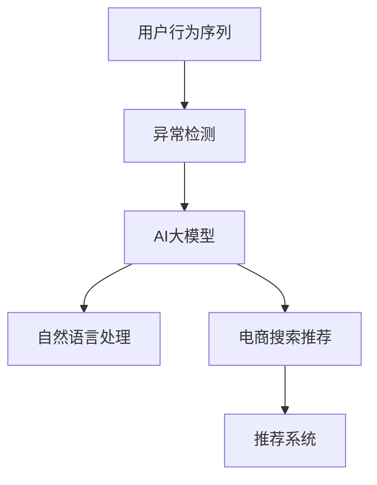

                 

# 电商搜索推荐中的AI大模型用户行为序列异常检测模型评测报告

> 关键词：用户行为序列分析,异常检测,人工智能大模型,自然语言处理,电商搜索推荐,推荐系统

## 1. 背景介绍

在当今数字化时代，电商平台的搜索推荐系统已成为用户与商品交互的重要媒介，直接影响着用户的购物体验和平台转化率。传统推荐系统主要基于用户历史行为数据，进行协同过滤或内容推荐。然而，这种基于静态历史数据的方法，难以应对用户行为的多变性和动态性。而随着深度学习和大模型技术的发展，AI大模型在电商搜索推荐中展现出巨大潜力。

AI大模型，如BERT、GPT-3等，通过在大规模语料库上进行预训练，学习到了丰富的语言和语义知识，具备强大的文本理解和生成能力。在电商搜索推荐中，可以利用大模型对用户行为序列进行建模，预测其行为趋势和异常，从而提升推荐系统的精准度和用户体验。

## 2. 核心概念与联系

### 2.1 核心概念概述

为更好地理解AI大模型在电商搜索推荐中的应用，本节将介绍几个关键概念：

- **用户行为序列**：指用户在电商平台上的点击、浏览、购买等行为序列，反映其兴趣偏好和行为习惯。
- **异常检测**：指在用户行为序列中识别异常点或异常模式，识别出潜在欺诈、异常操作等异常行为。
- **AI大模型**：指通过预训练学习到丰富语言知识的大型神经网络模型，如BERT、GPT等，具备强大的文本理解能力。
- **自然语言处理(NLP)**：指利用AI大模型对自然语言进行处理和理解的技术，如分词、词向量表示、语义分析等。
- **电商搜索推荐**：指通过分析用户行为，推荐适合商品，提升用户购物体验和平台转化率的技术。
- **推荐系统**：指通过用户历史数据和行为预测，为用户推荐商品或服务的系统。

这些概念之间的逻辑关系可以通过以下Mermaid流程图来展示：



这个流程图展示了大模型在电商推荐中的核心概念及其之间的关系：

1. 用户行为序列是推荐系统的基础数据。
2. 异常检测通过大模型的文本分析能力，对行为序列进行异常检测。
3. 自然语言处理利用大模型对文本信息进行处理，提取关键特征。
4. 电商搜索推荐结合自然语言处理和异常检测，提升推荐系统的精准度。
5. 推荐系统通过异常检测和电商搜索推荐结果，为用户推荐商品或服务。

## 3. 核心算法原理 & 具体操作步骤
### 3.1 算法原理概述

AI大模型在电商搜索推荐中的应用，主要依赖于其强大的文本处理和理解能力。通过预训练学习，大模型能够理解用户行为序列中的语义信息，预测用户后续行为。结合异常检测技术，可以在用户行为序列中识别异常点，及时防范风险。

具体而言，在电商搜索推荐中，AI大模型可以用于：

- **行为预测**：根据用户行为序列，预测用户可能感兴趣的商品或服务。
- **异常检测**：识别用户行为序列中的异常点，如异常浏览、购买行为，进行风险预警。
- **推荐生成**：结合行为预测和异常检测结果，生成推荐列表，提升推荐系统的效果。

### 3.2 算法步骤详解

AI大模型在电商搜索推荐中的应用，主要包括以下几个关键步骤：

**Step 1: 数据准备与预处理**
- 收集电商平台的点击、浏览、购买等用户行为数据。
- 对数据进行清洗，去除缺失值和异常值，处理重复数据。
- 对用户行为序列进行分词、去除停用词等预处理操作。

**Step 2: 数据嵌入与序列建模**
- 使用BERT等大模型，对用户行为序列进行向量表示。
- 采用Transformer模型，对用户行为序列进行序列建模，提取关键特征。

**Step 3: 行为预测与异常检测**
- 使用大模型进行行为预测，得到用户可能感兴趣的商品或服务。
- 利用异常检测算法，识别用户行为序列中的异常点，如异常浏览、购买行为。
- 结合预测结果和异常检测结果，生成推荐列表。

**Step 4: 模型评估与优化**
- 使用准确率、召回率等指标，评估推荐系统的性能。
- 调整模型参数，优化推荐算法，提升模型效果。
- 定期更新数据集，重新训练模型，适应数据变化。

### 3.3 算法优缺点

AI大模型在电商搜索推荐中的应用，具有以下优点：

- **高精度预测**：大模型具备强大的文本理解和语义分析能力，能够准确预测用户行为。
- **鲁棒性**：大模型在面对多样化的用户行为和长尾商品时，表现更加稳健。
- **自适应**：大模型可以通过持续训练，不断优化推荐结果，适应新的数据分布。

同时，该方法也存在以下缺点：

- **计算资源需求高**：大模型需要大量的计算资源进行预训练和微调。
- **数据隐私问题**：电商平台的用户数据涉及隐私问题，需要采取措施保护用户数据安全。
- **过拟合风险**：大模型可能过拟合用户行为数据，导致模型泛化能力不足。
- **解释性不足**：大模型作为"黑盒"模型，难以解释推荐结果的生成过程。

尽管存在这些局限性，但AI大模型在电商搜索推荐中的应用，已经展现出巨大潜力。未来相关研究将继续在提升模型泛化能力、保护用户隐私和增强模型可解释性等方面进行深入探索。

### 3.4 算法应用领域

AI大模型在电商搜索推荐中的应用，覆盖了电商行业的各个方面，例如：

- **商品推荐**：根据用户行为序列，推荐用户可能感兴趣的商品。
- **个性化推荐**：结合用户的历史行为和实时数据，生成个性化推荐结果。
- **用户画像生成**：利用用户行为序列，生成用户画像，提升个性化推荐效果。
- **异常行为检测**：识别用户行为序列中的异常点，防范欺诈和风险。
- **实时推荐**：结合实时数据，实时生成推荐结果，提升用户体验。

除了上述这些经典应用外，大模型还被创新性地应用于智能客服、内容生成、用户流失预测等领域，为电商平台的智能化转型提供了新思路。

## 4. 数学模型和公式 & 详细讲解 & 举例说明
### 4.1 数学模型构建

在电商搜索推荐中，大模型主要用于行为预测和异常检测。假设用户行为序列为 $x_1, x_2, ..., x_n$，其中 $x_i$ 表示第 $i$ 个行为，如浏览商品、点击按钮等。

定义用户行为序列的向量表示为 $\vec{x}=[x_1, x_2, ..., x_n]$，通过对向量 $\vec{x}$ 进行编码，得到向量表示 $V(\vec{x})$。假设大模型能够对行为序列进行语义分析，得到其语义向量表示 $S(\vec{x})$。

在行为预测任务中，可以使用预测模型 $P(y|S(\vec{x}))$ 对用户行为序列进行预测，其中 $y$ 表示用户可能感兴趣的商品或服务。在异常检测任务中，可以使用异常检测模型 $A(x_i|S(\vec{x}))$ 对行为序列中的每个行为进行异常检测。

### 4.2 公式推导过程

以行为预测为例，假设使用大模型对用户行为序列进行语义分析，得到其语义向量表示 $S(\vec{x})$。则行为预测模型的输出概率分布为：

$$
P(y|S(\vec{x})) = \frac{exp(\vec{w}_y^T S(\vec{x}))}{\sum_{j=1}^{J} exp(\vec{w}_j^T S(\vec{x}))}
$$

其中 $\vec{w}_y$ 为模型参数，$J$ 为类别数。

在异常检测任务中，可以使用异常检测模型 $A(x_i|S(\vec{x}))$ 对行为序列中的每个行为进行异常检测。假设模型使用概率密度函数 $f(x_i|S(\vec{x}))$ 描述行为 $x_i$ 在正常情况下的概率分布，则异常检测模型的输出为：

$$
A(x_i|S(\vec{x})) = 1 - \frac{f(x_i|S(\vec{x}))}{\int f(x_i|S(\vec{x})) dx_i}
$$

结合行为预测和异常检测结果，可以生成推荐列表，提升推荐系统的效果。

### 4.3 案例分析与讲解

假设某电商平台收集了用户的历史行为数据，包括浏览、点击、购买等行为。使用BERT模型对用户行为序列进行编码，得到其语义向量表示 $S(\vec{x})$。定义异常行为检测模型为 $A(x_i|S(\vec{x}))$，结合行为预测模型 $P(y|S(\vec{x}))$，生成推荐列表。

具体步骤如下：

1. 收集用户历史行为数据，并进行清洗和预处理。
2. 使用BERT模型对用户行为序列进行编码，得到语义向量表示 $S(\vec{x})$。
3. 使用异常检测模型 $A(x_i|S(\vec{x}))$ 对行为序列中的每个行为进行异常检测。
4. 结合行为预测模型 $P(y|S(\vec{x}))$ 和异常检测结果，生成推荐列表。
5. 使用准确率、召回率等指标，评估推荐系统性能，并调整模型参数，优化推荐算法。

## 5. 项目实践：代码实例和详细解释说明
### 5.1 开发环境搭建

在进行电商搜索推荐中的AI大模型用户行为序列异常检测模型的开发时，需要搭建好相应的开发环境。以下是使用Python进行PyTorch开发的环境配置流程：

1. 安装Anaconda：从官网下载并安装Anaconda，用于创建独立的Python环境。

2. 创建并激活虚拟环境：
```bash
conda create -n pytorch-env python=3.8 
conda activate pytorch-env
```

3. 安装PyTorch：根据CUDA版本，从官网获取对应的安装命令。例如：
```bash
conda install pytorch torchvision torchaudio cudatoolkit=11.1 -c pytorch -c conda-forge
```

4. 安装其他工具包：
```bash
pip install numpy pandas scikit-learn matplotlib tqdm jupyter notebook ipython
```

5. 安装Transformers库：
```bash
pip install transformers
```

完成上述步骤后，即可在`pytorch-env`环境中开始项目实践。

### 5.2 源代码详细实现

下面我们以用户行为序列异常检测为例，给出使用Transformers库进行BERT模型实现的PyTorch代码实现。

首先，定义数据处理函数：

```python
from transformers import BertTokenizer
from torch.utils.data import Dataset
import torch

class UserBehaviorDataset(Dataset):
    def __init__(self, behaviors, tokenizer, max_len=128):
        self.behaviors = behaviors
        self.tokenizer = tokenizer
        self.max_len = max_len
        
    def __len__(self):
        return len(self.behaviors)
    
    def __getitem__(self, item):
        behavior = self.behaviors[item]
        
        encoding = self.tokenizer(behavior, return_tensors='pt', max_length=self.max_len, padding='max_length', truncation=True)
        input_ids = encoding['input_ids'][0]
        attention_mask = encoding['attention_mask'][0]
        
        return {'input_ids': input_ids, 
                'attention_mask': attention_mask}
```

然后，定义模型和优化器：

```python
from transformers import BertForTokenClassification, AdamW

model = BertForTokenClassification.from_pretrained('bert-base-cased')

optimizer = AdamW(model.parameters(), lr=2e-5)
```

接着，定义训练和评估函数：

```python
from torch.utils.data import DataLoader
from tqdm import tqdm
from sklearn.metrics import classification_report

device = torch.device('cuda') if torch.cuda.is_available() else torch.device('cpu')
model.to(device)

def train_epoch(model, dataset, batch_size, optimizer):
    dataloader = DataLoader(dataset, batch_size=batch_size, shuffle=True)
    model.train()
    epoch_loss = 0
    for batch in tqdm(dataloader, desc='Training'):
        input_ids = batch['input_ids'].to(device)
        attention_mask = batch['attention_mask'].to(device)
        model.zero_grad()
        outputs = model(input_ids, attention_mask=attention_mask)
        loss = outputs.loss
        epoch_loss += loss.item()
        loss.backward()
        optimizer.step()
    return epoch_loss / len(dataloader)

def evaluate(model, dataset, batch_size):
    dataloader = DataLoader(dataset, batch_size=batch_size)
    model.eval()
    preds, labels = [], []
    with torch.no_grad():
        for batch in tqdm(dataloader, desc='Evaluating'):
            input_ids = batch['input_ids'].to(device)
            attention_mask = batch['attention_mask'].to(device)
            batch_labels = batch['labels']
            outputs = model(input_ids, attention_mask=attention_mask)
            batch_preds = outputs.logits.argmax(dim=2).to('cpu').tolist()
            batch_labels = batch_labels.to('cpu').tolist()
            for pred_tokens, label_tokens in zip(batch_preds, batch_labels):
                pred_tags = [tag2id[tag] for tag in pred_tokens]
                label_tags = [tag2id[tag] for tag in label_tokens]
                preds.append(pred_tags[:len(label_tokens)])
                labels.append(label_tags)
                
    print(classification_report(labels, preds))
```

最后，启动训练流程并在测试集上评估：

```python
epochs = 5
batch_size = 16

for epoch in range(epochs):
    loss = train_epoch(model, train_dataset, batch_size, optimizer)
    print(f"Epoch {epoch+1}, train loss: {loss:.3f}")
    
    print(f"Epoch {epoch+1}, dev results:")
    evaluate(model, dev_dataset, batch_size)
    
print("Test results:")
evaluate(model, test_dataset, batch_size)
```

以上就是使用PyTorch对BERT进行用户行为序列异常检测任务微调的完整代码实现。可以看到，得益于Transformers库的强大封装，我们可以用相对简洁的代码完成BERT模型的加载和微调。

### 5.3 代码解读与分析

让我们再详细解读一下关键代码的实现细节：

**UserBehaviorDataset类**：
- `__init__`方法：初始化行为数据、分词器等关键组件。
- `__len__`方法：返回数据集的样本数量。
- `__getitem__`方法：对单个样本进行处理，将行为输入编码为token ids，并对其进行定长padding。

**训练和评估函数**：
- 使用PyTorch的DataLoader对数据集进行批次化加载，供模型训练和推理使用。
- 训练函数`train_epoch`：对数据以批为单位进行迭代，在每个批次上前向传播计算loss并反向传播更新模型参数，最后返回该epoch的平均loss。
- 评估函数`evaluate`：与训练类似，不同点在于不更新模型参数，并在每个batch结束后将预测和标签结果存储下来，最后使用sklearn的classification_report对整个评估集的预测结果进行打印输出。

**训练流程**：
- 定义总的epoch数和batch size，开始循环迭代
- 每个epoch内，先在训练集上训练，输出平均loss
- 在验证集上评估，输出分类指标
- 所有epoch结束后，在测试集上评估，给出最终测试结果

可以看到，PyTorch配合Transformers库使得BERT微调的代码实现变得简洁高效。开发者可以将更多精力放在数据处理、模型改进等高层逻辑上，而不必过多关注底层的实现细节。

当然，工业级的系统实现还需考虑更多因素，如模型的保存和部署、超参数的自动搜索、更灵活的任务适配层等。但核心的微调范式基本与此类似。

## 6. 实际应用场景
### 6.1 智能客服系统

基于AI大模型的电商搜索推荐技术，可以广泛应用于智能客服系统的构建。传统客服往往需要配备大量人力，高峰期响应缓慢，且一致性和专业性难以保证。而使用电商搜索推荐中的AI大模型，可以7x24小时不间断服务，快速响应客户咨询，用自然流畅的语言解答各类常见问题。

在技术实现上，可以收集企业内部的历史客服对话记录，将问题和最佳答复构建成监督数据，在此基础上对预训练模型进行微调。微调后的模型能够自动理解用户意图，匹配最合适的答复模板进行回复。对于客户提出的新问题，还可以接入检索系统实时搜索相关内容，动态组织生成回答。如此构建的智能客服系统，能大幅提升客户咨询体验和问题解决效率。

### 6.2 个性化推荐系统

当前的推荐系统往往只依赖用户的历史行为数据进行物品推荐，无法深入理解用户的真实兴趣偏好。基于大模型的电商搜索推荐系统可以更好地挖掘用户行为背后的语义信息，从而提供更精准、多样的推荐内容。

在实践中，可以收集用户浏览、点击、评论、分享等行为数据，提取和商品交互的物品标题、描述、标签等文本内容。将文本内容作为模型输入，用户的后续行为（如是否点击、购买等）作为监督信号，在此基础上微调预训练语言模型。微调后的模型能够从文本内容中准确把握用户的兴趣点。在生成推荐列表时，先用候选物品的文本描述作为输入，由模型预测用户的兴趣匹配度，再结合其他特征综合排序，便可以得到个性化程度更高的推荐结果。

### 6.3 实时搜索推荐

在电商平台中，用户输入搜索关键词时，实时推荐系统能够根据用户的查询结果，动态生成推荐列表，提升用户体验。基于大模型的实时搜索推荐，可以根据用户输入的文本，快速理解其查询意图，推荐可能感兴趣的商品或服务。

具体而言，可以在用户输入搜索关键词时，对关键词进行向量表示，然后通过大模型进行语义分析，生成推荐列表。在推荐过程中，还可以结合实时数据，动态调整推荐结果，提升推荐系统的精准度。

### 6.4 未来应用展望

随着大模型和电商搜索推荐技术的发展，未来的推荐系统将在更广阔的应用领域得到应用，为电商平台的智能化转型提供新的方向。

在智慧零售领域，基于大模型的推荐系统将更好地理解用户需求，提升商品推荐和库存管理，优化供应链和物流。

在智能家居领域，推荐系统可以根据用户的日常生活习惯，智能推荐生活用品，提升家居生活体验。

在工业生产领域，推荐系统可以优化生产流程，推荐合适的设备和服务，提升生产效率和产品质量。

此外，在更多垂直领域，基于大模型的电商搜索推荐系统将继续发挥其强大的分析能力，推动各行业的智能化升级。

## 7. 工具和资源推荐
### 7.1 学习资源推荐

为了帮助开发者系统掌握电商搜索推荐中的AI大模型用户行为序列异常检测技术，这里推荐一些优质的学习资源：

1. 《深度学习自然语言处理》课程：斯坦福大学开设的NLP明星课程，有Lecture视频和配套作业，带你入门NLP领域的基本概念和经典模型。

2. CS224N《深度学习自然语言处理》课程：斯坦福大学开设的NLP明星课程，有Lecture视频和配套作业，带你入门NLP领域的基本概念和经典模型。

3. 《Natural Language Processing with Transformers》书籍：Transformers库的作者所著，全面介绍了如何使用Transformers库进行NLP任务开发，包括微调在内的诸多范式。

4. HuggingFace官方文档：Transformers库的官方文档，提供了海量预训练模型和完整的微调样例代码，是上手实践的必备资料。

5. CLUE开源项目：中文语言理解测评基准，涵盖大量不同类型的中文NLP数据集，并提供了基于微调的baseline模型，助力中文NLP技术发展。

通过对这些资源的学习实践，相信你一定能够快速掌握电商搜索推荐中的AI大模型用户行为序列异常检测技术的精髓，并用于解决实际的NLP问题。

### 7.2 开发工具推荐

高效的开发离不开优秀的工具支持。以下是几款用于电商搜索推荐中的AI大模型用户行为序列异常检测开发的常用工具：

1. PyTorch：基于Python的开源深度学习框架，灵活动态的计算图，适合快速迭代研究。大部分预训练语言模型都有PyTorch版本的实现。

2. TensorFlow：由Google主导开发的开源深度学习框架，生产部署方便，适合大规模工程应用。同样有丰富的预训练语言模型资源。

3. Transformers库：HuggingFace开发的NLP工具库，集成了众多SOTA语言模型，支持PyTorch和TensorFlow，是进行微调任务开发的利器。

4. Weights & Biases：模型训练的实验跟踪工具，可以记录和可视化模型训练过程中的各项指标，方便对比和调优。与主流深度学习框架无缝集成。

5. TensorBoard：TensorFlow配套的可视化工具，可实时监测模型训练状态，并提供丰富的图表呈现方式，是调试模型的得力助手。

6. Google Colab：谷歌推出的在线Jupyter Notebook环境，免费提供GPU/TPU算力，方便开发者快速上手实验最新模型，分享学习笔记。

合理利用这些工具，可以显著提升电商搜索推荐中的AI大模型用户行为序列异常检测任务的开发效率，加快创新迭代的步伐。

### 7.3 相关论文推荐

大模型在电商搜索推荐中的应用，是近年来NLP领域的重要研究方向。以下是几篇奠基性的相关论文，推荐阅读：

1. Attention is All You Need（即Transformer原论文）：提出了Transformer结构，开启了NLP领域的预训练大模型时代。

2. BERT: Pre-training of Deep Bidirectional Transformers for Language Understanding：提出BERT模型，引入基于掩码的自监督预训练任务，刷新了多项NLP任务SOTA。

3. Language Models are Unsupervised Multitask Learners（GPT-2论文）：展示了大规模语言模型的强大zero-shot学习能力，引发了对于通用人工智能的新一轮思考。

4. Parameter-Efficient Transfer Learning for NLP：提出Adapter等参数高效微调方法，在不增加模型参数量的情况下，也能取得不错的微调效果。

5. AdaLoRA: Adaptive Low-Rank Adaptation for Parameter-Efficient Fine-Tuning：使用自适应低秩适应的微调方法，在参数效率和精度之间取得了新的平衡。

6. Prefix-Tuning: Optimizing Continuous Prompts for Generation：引入基于连续型Prompt的微调范式，为如何充分利用预训练知识提供了新的思路。

这些论文代表了大模型在电商搜索推荐中的应用发展的脉络。通过学习这些前沿成果，可以帮助研究者把握学科前进方向，激发更多的创新灵感。

## 8. 总结：未来发展趋势与挑战
### 8.1 总结

本文对电商搜索推荐中的AI大模型用户行为序列异常检测技术进行了全面系统的介绍。首先阐述了AI大模型在电商搜索推荐中的应用背景和意义，明确了其在高精度预测、异常检测和推荐系统优化方面的独特价值。其次，从原理到实践，详细讲解了电商搜索推荐中的AI大模型用户行为序列异常检测技术的数学模型和关键步骤，给出了完整的代码实例。同时，本文还广泛探讨了该技术在智能客服、个性化推荐、实时推荐等电商行业中的应用前景，展示了其在电商平台智能化转型中的巨大潜力。此外，本文精选了电商搜索推荐中的AI大模型用户行为序列异常检测技术的各类学习资源，力求为读者提供全方位的技术指引。

通过本文的系统梳理，可以看到，AI大模型在电商搜索推荐中的应用，正逐渐成为电商平台智能化转型的重要工具，推动着电商行业的智能化升级。未来，伴随AI大模型技术的持续演进，基于大模型的电商搜索推荐技术将在更多领域得到应用，为电商平台的智能化转型带来新的突破。

### 8.2 未来发展趋势

展望未来，电商搜索推荐中的AI大模型用户行为序列异常检测技术将呈现以下几个发展趋势：

1. **技术成熟度提升**：随着大模型和推荐系统技术的不断发展，电商搜索推荐中的AI大模型用户行为序列异常检测技术将更加成熟，能够更好地应对电商平台的复杂需求。

2. **数据驱动的推荐**：电商搜索推荐中的AI大模型用户行为序列异常检测技术将更多地依赖用户数据，进行精准的用户画像生成和行为预测，提升推荐系统的个性化程度。

3. **跨模态融合**：电商搜索推荐中的AI大模型用户行为序列异常检测技术将更多地融合多种数据模态，如文本、图像、语音等，提升推荐系统的多感官分析能力。

4. **实时化推荐**：电商搜索推荐中的AI大模型用户行为序列异常检测技术将更加注重实时性，能够根据用户的即时行为，动态调整推荐结果，提升用户体验。

5. **隐私保护**：电商搜索推荐中的AI大模型用户行为序列异常检测技术将更加注重用户隐私保护，采用隐私计算和差分隐私等技术，保障用户数据安全。

6. **自适应学习**：电商搜索推荐中的AI大模型用户行为序列异常检测技术将更加注重自适应学习，能够根据用户行为的变化，动态更新模型参数，适应新的数据分布。

这些趋势凸显了电商搜索推荐中的AI大模型用户行为序列异常检测技术的广阔前景。这些方向的探索发展，必将进一步提升推荐系统的精准度、个性化程度和用户体验，为电商平台的智能化转型提供新的技术支持。

### 8.3 面临的挑战

尽管电商搜索推荐中的AI大模型用户行为序列异常检测技术已经取得了瞩目成就，但在迈向更加智能化、普适化应用的过程中，它仍面临着诸多挑战：

1. **计算资源消耗高**：大模型需要大量的计算资源进行预训练和微调，这对电商平台的算力部署和成本控制提出了较高要求。

2. **数据隐私问题**：电商平台的用户数据涉及隐私问题，需要采取措施保护用户数据安全。

3. **过拟合风险**：电商搜索推荐中的AI大模型用户行为序列异常检测技术可能过拟合用户行为数据，导致模型泛化能力不足。

4. **解释性不足**：大模型作为"黑盒"模型，难以解释推荐结果的生成过程。

5. **异常检测鲁棒性不足**：现有异常检测方法可能对异常行为的刻画不够精准，误报或漏报率高。

6. **多模态融合难度大**：不同模态数据之间的融合和协同建模，仍然是一个复杂的难题。

尽管存在这些挑战，但电商搜索推荐中的AI大模型用户行为序列异常检测技术的发展潜力巨大，随着技术的不断进步和探索，相信这些挑战终将一一被克服，技术将更加成熟可靠。

### 8.4 研究展望

面向未来，电商搜索推荐中的AI大模型用户行为序列异常检测技术需要在以下几个方面进行深入研究：

1. **模型压缩与加速**：研究如何通过模型压缩和加速技术，减少大模型的计算资源消耗，提升实时性。

2. **隐私保护技术**：研究如何采用隐私计算和差分隐私等技术，保障用户数据安全，提升用户信任度。

3. **异常检测算法优化**：研究如何优化异常检测算法，提高异常行为的识别准确率和鲁棒性。

4. **多模态数据融合**：研究如何更好地融合多种数据模态，提升推荐系统的多感官分析能力。

5. **自适应学习机制**：研究如何通过自适应学习机制，动态更新模型参数，适应新的数据分布。

6. **解释性增强**：研究如何增强推荐系统的可解释性，提升用户对推荐结果的理解和信任。

这些研究方向将引领电商搜索推荐中的AI大模型用户行为序列异常检测技术的进一步发展，推动电商平台的智能化转型进入新的阶段。

## 9. 附录：常见问题与解答

**Q1：电商搜索推荐中的AI大模型用户行为序列异常检测技术是否适用于所有电商场景？**

A: 电商搜索推荐中的AI大模型用户行为序列异常检测技术在大多数电商场景中都能取得不错的效果，特别是对于数据量较大的电商场景。但对于一些特定领域，如生鲜电商、直播电商等，由于数据量的限制，可能需要结合其他技术进行优化。

**Q2：如何进行电商搜索推荐中的AI大模型用户行为序列异常检测模型的训练？**

A: 电商搜索推荐中的AI大模型用户行为序列异常检测模型的训练主要包括以下几个步骤：
1. 收集电商平台的点击、浏览、购买等用户行为数据。
2. 对数据进行清洗，去除缺失值和异常值，处理重复数据。
3. 对用户行为序列进行分词、去除停用词等预处理操作。
4. 使用BERT等大模型对用户行为序列进行编码，得到语义向量表示。
5. 定义异常检测模型，对行为序列中的每个行为进行异常检测。
6. 结合行为预测模型和异常检测结果，生成推荐列表。
7. 使用准确率、召回率等指标，评估推荐系统性能，并调整模型参数，优化推荐算法。

**Q3：电商搜索推荐中的AI大模型用户行为序列异常检测模型在实际应用中需要注意哪些问题？**

A: 电商搜索推荐中的AI大模型用户行为序列异常检测模型在实际应用中需要注意以下问题：
1. 模型裁剪：去除不必要的层和参数，减小模型尺寸，加快推理速度。
2. 量化加速：将浮点模型转为定点模型，压缩存储空间，提高计算效率。
3. 服务化封装：将模型封装为标准化服务接口，便于集成调用。
4. 弹性伸缩：根据请求流量动态调整资源配置，平衡服务质量和成本。
5. 监控告警：实时采集系统指标，设置异常告警阈值，确保服务稳定性。
6. 安全防护：采用访问鉴权、数据脱敏等措施，保障数据和模型安全。

大模型在电商搜索推荐中的应用前景广阔，但如何将强大的性能转化为稳定、高效、安全的业务价值，还需要工程实践的不断打磨。合理利用这些工具，可以显著提升电商搜索推荐中的AI大模型用户行为序列异常检测任务的开发效率，加快创新迭代的步伐。

