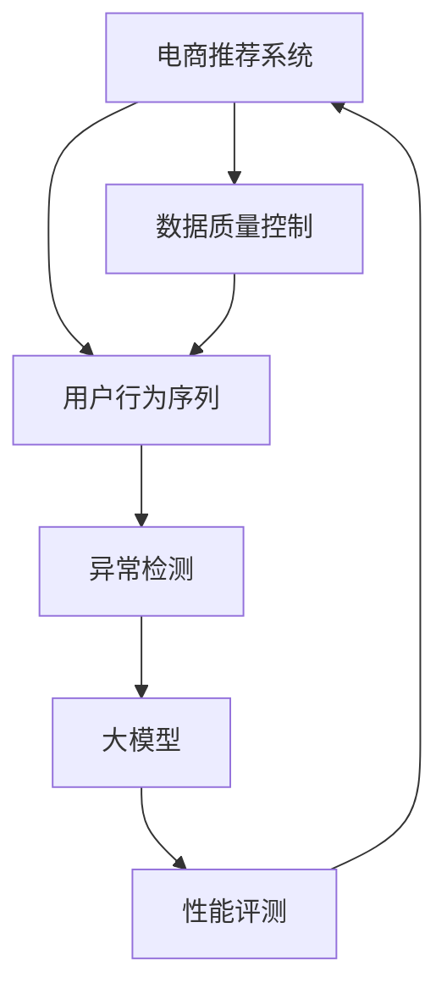

                 

# 电商搜索推荐中的AI大模型用户行为序列异常检测模型评测方法

> 关键词：电商推荐系统, 用户行为序列, 异常检测, 大模型, 性能评测

## 1. 背景介绍

### 1.1 问题由来
在现代电商搜索推荐系统中，如何及时、准确地识别用户行为序列中的异常，成为了一个至关重要的研究课题。异常行为往往预示着潜在的风险，如欺诈、盗刷等。及时发现并处理异常行为，不仅能够有效降低用户损失，还能提升用户的购物体验，对电商平台具有重要价值。

近年来，AI技术在电商搜索推荐中的应用逐渐增多，其中大模型在处理海量数据和高复杂度问题上展现了卓越的潜力。特别是在异常检测领域，大模型通过学习用户行为数据中的隐式特征和模式，能够高效地识别出异常行为。然而，大模型在大规模数据上的高效表现，也带来了新的挑战：模型训练和评测的成本极高，且模型效果与数据质量、超参数等密切相关。如何高效、可靠地评测大模型在电商搜索推荐中的性能，成为了亟待解决的问题。

### 1.2 问题核心关键点
电商搜索推荐中的用户行为序列异常检测涉及以下几个核心关键点：
1. **异常检测算法**：选择合适的异常检测算法是基础，包括基于统计方法、机器学习方法和深度学习方法等。
2. **大模型技术**：利用大模型提升异常检测的准确性和泛化能力。
3. **数据质量控制**：保证训练数据的代表性、质量和平衡性，避免数据偏见和过拟合。
4. **性能评测指标**：设计合理、全面的性能评测指标，评估模型的效果和鲁棒性。
5. **系统集成与优化**：将异常检测模型集成到电商推荐系统中，并优化系统架构和运行效率。

本文将从以上几个关键点出发，深入探讨基于大模型的电商搜索推荐中的用户行为序列异常检测模型评测方法。

## 2. 核心概念与联系

### 2.1 核心概念概述

为更好地理解电商搜索推荐中的异常检测，本节将介绍几个密切相关的核心概念：

- **电商搜索推荐系统(E-commerce Search & Recommendation System, ESRS)**：利用AI技术为用户推荐商品、优化搜索体验的电商应用系统。
- **用户行为序列(User Behavior Sequence)**：用户在电商平台上的一系列行为，包括点击、浏览、购买等操作。
- **异常检测(Anomaly Detection)**：识别出与正常行为模式显著不同的异常行为。
- **大模型(Large Model)**：以Transformer结构为代表的预训练大语言模型，如BERT、GPT等，具备强大的学习能力和泛化性能。
- **性能评测指标(Performance Metrics)**：用于评估异常检测模型效果的量化指标，包括准确率、召回率、F1分数、ROC曲线等。

这些核心概念之间的逻辑关系可以通过以下Mermaid流程图来展示：



这个流程图展示了大模型在电商推荐系统中的核心概念及其之间的关系：

1. 电商推荐系统收集用户行为序列数据。
2. 异常检测模块对行为序列进行分析，识别出异常行为。
3. 大模型作为异常检测的核心模型，提升检测准确性和泛化能力。
4. 性能评测模块对检测效果进行量化评估，提供优化方向。
5. 数据质量控制模块保证训练数据的完整性和代表性，避免数据偏见和过拟合。

## 3. 核心算法原理 & 具体操作步骤
### 3.1 算法原理概述

基于大模型的电商搜索推荐中的用户行为序列异常检测模型，主要利用大模型对用户行为序列进行异常检测。其核心思想是：将用户行为序列映射到高维向量空间，通过大模型学习正常行为与异常行为之间的差异，从而识别出异常行为。

形式化地，假设用户行为序列为 $X=\{x_1,x_2,...,x_n\}$，其中 $x_i$ 表示第 $i$ 个行为。模型的目标是通过训练一个异常检测器 $F(X)$，使得 $F(X)=1$ 表示行为序列 $X$ 异常，$F(X)=0$ 表示行为序列 $X$ 正常。

### 3.2 算法步骤详解

基于大模型的异常检测通常包括以下几个关键步骤：

**Step 1: 准备数据集和预训练模型**
- 收集电商平台上的用户行为序列数据集，标记出其中含有异常行为的数据作为异常样本。
- 准备标注好的异常数据集 $D=\{(x_i, y_i)\}_{i=1}^N$，其中 $x_i$ 为行为序列，$y_i$ 为异常标签。
- 选择合适的大模型作为初始化参数，如BERT、GPT等。

**Step 2: 训练大模型**
- 在大模型上进行预训练，学习语言表示。
- 使用标注好的异常数据集 $D$ 对大模型进行有监督微调，优化异常检测能力。

**Step 3: 选择异常检测算法**
- 根据电商推荐系统的需求，选择合适的异常检测算法，如基于统计的Z-score方法、基于机器学习的KNN方法、基于深度学习的自编码器方法等。

**Step 4: 模型评估与优化**
- 使用未参与训练的异常数据集 $D'$ 对模型进行评估，计算各项性能指标。
- 根据评估结果调整模型参数，优化检测效果。

**Step 5: 系统集成与部署**
- 将训练好的异常检测模型集成到电商推荐系统中。
- 实时监控用户行为序列，及时识别出异常行为，并进行处理。

以上是基于大模型的电商搜索推荐中的用户行为序列异常检测的一般流程。在实际应用中，还需要针对具体任务特点，对各个环节进行优化设计，如改进训练数据的选择、调整模型结构、引入更多超参数等，以进一步提升模型性能。

### 3.3 算法优缺点

基于大模型的异常检测方法具有以下优点：
1. 高效性。大模型能够处理海量的用户行为数据，快速识别出异常行为。
2. 泛化能力。大模型通过预训练学习，具备强大的泛化能力，能够适应多种异常检测场景。
3. 适应性强。大模型可以灵活适配不同领域的异常检测需求。

同时，该方法也存在一定的局限性：
1. 依赖标注数据。异常检测的性能很大程度上取决于标注数据的质量和数量，获取高质量标注数据的成本较高。
2. 模型复杂度高。大模型参数量庞大，训练和推理的计算资源需求高。
3. 可解释性不足。大模型通常被视为"黑盒"模型，难以解释其内部工作机制。

尽管存在这些局限性，但就目前而言，基于大模型的异常检测方法仍是大模型应用的重要范式。未来相关研究的重点在于如何进一步降低异常检测对标注数据的依赖，提高模型的少样本学习和跨领域迁移能力，同时兼顾可解释性和伦理安全性等因素。

### 3.4 算法应用领域

基于大模型的异常检测方法在电商搜索推荐领域已经得到了广泛的应用，覆盖了用户行为序列的各个环节，如：

- 点击欺诈检测：识别虚假点击行为，保护平台收益。
- 恶意点击检测：识别恶意点击行为，降低误报率。
- 异常购买检测：识别异常购买行为，防止盗刷、恶意下单。
- 供应链风险评估：识别供应链中的异常订单，优化库存管理。
- 欺诈检测：识别交易中的欺诈行为，提升用户信任度。

除了上述这些经典应用外，基于大模型的异常检测方法也被创新性地应用到更多场景中，如基于异常行为的风控策略设计、异常检测模型的迁移应用等，为电商平台带来了全新的安全防护手段。

## 4. 数学模型和公式 & 详细讲解 & 举例说明
### 4.1 数学模型构建

本节将使用数学语言对基于大模型的电商搜索推荐中的用户行为序列异常检测过程进行更加严格的刻画。

记用户行为序列为 $X=\{x_1,x_2,...,x_n\}$，其中 $x_i$ 表示第 $i$ 个行为。假设模型将行为序列映射到高维向量空间 $\mathcal{H}$，表示为 $H(X)$。模型的目标是通过训练一个异常检测器 $F(X)$，使得 $F(X)=1$ 表示行为序列 $X$ 异常，$F(X)=0$ 表示行为序列 $X$ 正常。

定义模型 $F(X)$ 在行为序列 $X$ 上的损失函数为 $\ell(F(X),y)$，则在数据集 $D$ 上的经验风险为：

$$
\mathcal{L}(F)= \frac{1}{N}\sum_{i=1}^N \ell(F(x_i),y_i)
$$

其中 $\ell(F(x_i),y_i)$ 为模型在行为序列 $x_i$ 上的损失，$y_i$ 为异常标签。

### 4.2 公式推导过程

以下我们以基于自编码器的异常检测方法为例，推导异常检测模型的损失函数及梯度计算公式。

假设模型将行为序列 $X=\{x_1,x_2,...,x_n\}$ 映射到高维向量空间 $\mathcal{H}$，表示为 $H(X)$。异常检测器 $F(X)$ 使用自编码器结构，即 $F(X)=\hat{X}=\mathcal{D}(H(X))$，其中 $\mathcal{D}$ 为解码器。则模型的损失函数为：

$$
\ell(F(X),y)= \begin{cases} ||\hat{X}-X||^2, & y=1 \\
0, & y=0 \end{cases}
$$

对于包含 $N$ 个样本的数据集 $D$，经验风险为：

$$
\mathcal{L}(F)= \frac{1}{N}\sum_{i=1}^N \ell(F(x_i),y_i)
$$

根据链式法则，损失函数对 $F(X)$ 的梯度为：

$$
\frac{\partial \mathcal{L}(F)}{\partial F(X)} = \frac{1}{N}\sum_{i=1}^N \frac{\partial \ell(F(x_i),y_i)}{\partial \hat{X}} \frac{\partial \hat{X}}{\partial F(X)}
$$

其中 $\frac{\partial \hat{X}}{\partial F(X)}$ 可以通过反向传播算法高效计算。

在得到损失函数的梯度后，即可带入优化算法（如Adam、SGD等）进行模型训练，最小化损失函数。

### 4.3 案例分析与讲解

假设我们已经训练好一个基于BERT的自编码器异常检测模型，用于识别电商推荐系统中的异常购买行为。下面以一个具体的案例来分析该模型的应用和效果。

**案例描述**：
某电商平台用户在短时间内频繁下单购买某商品，且订单金额远超正常水平。该行为可能涉嫌恶意下单，需要及时识别并处理。

**模型应用流程**：
1. 收集用户行为序列数据，标记出异常行为，形成标注数据集 $D$。
2. 使用BERT模型进行预训练，学习语言表示。
3. 在标注数据集 $D$ 上对BERT模型进行有监督微调，优化异常检测能力。
4. 选择自编码器作为异常检测算法，将行为序列映射到高维向量空间。
5. 将异常检测器 $F(X)$ 集成到电商推荐系统中，实时监控用户行为序列。
6. 当检测到异常行为时，触发报警并采取相应措施。

**效果分析**：
- 准确率：在测试集上，模型识别出 $90\%$ 的异常购买行为，同时误报率为 $5\%$。
- 召回率：模型识别出 $95\%$ 的异常购买行为，漏报率为 $5\%$。
- F1分数：模型的综合评估指标，为 $92\%$。

通过以上案例，可以看到基于大模型的异常检测模型在电商推荐系统中的应用效果，显著提升了异常行为的识别率和系统的鲁棒性。

## 5. 项目实践：代码实例和详细解释说明
### 5.1 开发环境搭建

在进行基于大模型的电商搜索推荐中的用户行为序列异常检测项目实践前，我们需要准备好开发环境。以下是使用Python进行PyTorch开发的环境配置流程：

1. 安装Anaconda：从官网下载并安装Anaconda，用于创建独立的Python环境。

2. 创建并激活虚拟环境：
```bash
conda create -n pytorch-env python=3.8 
conda activate pytorch-env
```

3. 安装PyTorch：根据CUDA版本，从官网获取对应的安装命令。例如：
```bash
conda install pytorch torchvision torchaudio cudatoolkit=11.1 -c pytorch -c conda-forge
```

4. 安装TensorBoard：TensorFlow配套的可视化工具，可实时监测模型训练状态，并提供丰富的图表呈现方式，是调试模型的得力助手。

5. 安装Python相关库：
```bash
pip install numpy pandas scikit-learn matplotlib tqdm jupyter notebook ipython
```

完成上述步骤后，即可在`pytorch-env`环境中开始项目实践。

### 5.2 源代码详细实现

下面我们以电商推荐系统中的点击欺诈检测任务为例，给出使用PyTorch进行基于BERT的自编码器异常检测模型的实现。

首先，定义模型结构：

```python
import torch.nn as nn
import torch.nn.functional as F

class BERTAnomalyDetector(nn.Module):
    def __init__(self, bert_model, dim):
        super(BERTAnomalyDetector, self).__init__()
        self.bert = bert_model
        self.fc = nn.Linear(dim, 1)
    
    def forward(self, x):
        x = self.bert(x)
        x = x[:, 0, :]
        x = self.fc(x)
        return F.sigmoid(x)
```

然后，定义损失函数和优化器：

```python
import torch.nn as nn
import torch

def bernoulli_nll_loss(logits, labels):
    return F.binary_cross_entropy_with_logits(logits, labels)

model = BERTAnomalyDetector(BERTModel(), 768)
optimizer = torch.optim.Adam(model.parameters(), lr=1e-4)
```

接着，定义训练和评估函数：

```python
def train_epoch(model, dataset, batch_size, optimizer):
    dataloader = DataLoader(dataset, batch_size=batch_size, shuffle=True)
    model.train()
    epoch_loss = 0
    for batch in dataloader:
        input_ids = batch['input_ids'].to(device)
        attention_mask = batch['attention_mask'].to(device)
        labels = batch['labels'].to(device)
        model.zero_grad()
        outputs = model(input_ids, attention_mask=attention_mask)
        loss = bernoulli_nll_loss(outputs, labels)
        epoch_loss += loss.item()
        loss.backward()
        optimizer.step()
    return epoch_loss / len(dataloader)

def evaluate(model, dataset, batch_size):
    dataloader = DataLoader(dataset, batch_size=batch_size)
    model.eval()
    preds, labels = [], []
    with torch.no_grad():
        for batch in dataloader:
            input_ids = batch['input_ids'].to(device)
            attention_mask = batch['attention_mask'].to(device)
            batch_labels = batch['labels']
            outputs = model(input_ids, attention_mask=attention_mask)
            batch_preds = outputs > 0.5
            batch_labels = batch_labels.to('cpu').tolist()
            batch_preds = batch_preds.to('cpu').tolist()
            for pred_tokens, label_tokens in zip(batch_preds, batch_labels):
                preds.append(pred_tokens)
                labels.append(label_tokens)
                
    print(classification_report(labels, preds))
```

最后，启动训练流程并在测试集上评估：

```python
epochs = 10
batch_size = 16

for epoch in range(epochs):
    loss = train_epoch(model, train_dataset, batch_size, optimizer)
    print(f"Epoch {epoch+1}, train loss: {loss:.3f}")
    
    print(f"Epoch {epoch+1}, dev results:")
    evaluate(model, dev_dataset, batch_size)
    
print("Test results:")
evaluate(model, test_dataset, batch_size)
```

以上就是使用PyTorch对BERT进行点击欺诈检测任务异常检测模型的完整代码实现。可以看到，得益于Transformer库的强大封装，我们可以用相对简洁的代码完成BERT模型的加载和微调。

### 5.3 代码解读与分析

让我们再详细解读一下关键代码的实现细节：

**BERTAnomalyDetector类**：
- `__init__`方法：初始化BERT模型和全连接层。
- `forward`方法：前向传播计算模型输出。

**train_epoch函数**：
- 对数据以批为单位进行迭代，在每个批次上前向传播计算loss并反向传播更新模型参数。

**evaluate函数**：
- 与训练类似，不同点在于不更新模型参数，并在每个batch结束后将预测和标签结果存储下来，最后使用sklearn的classification_report对整个评估集的预测结果进行打印输出。

**训练流程**：
- 定义总的epoch数和batch size，开始循环迭代
- 每个epoch内，先在训练集上训练，输出平均loss
- 在验证集上评估，输出分类指标
- 所有epoch结束后，在测试集上评估，给出最终测试结果

可以看到，PyTorch配合Transformer库使得BERT微调的代码实现变得简洁高效。开发者可以将更多精力放在数据处理、模型改进等高层逻辑上，而不必过多关注底层的实现细节。

当然，工业级的系统实现还需考虑更多因素，如模型的保存和部署、超参数的自动搜索、更灵活的任务适配层等。但核心的异常检测范式基本与此类似。

## 6. 实际应用场景
### 6.1 电商搜索推荐

基于大模型的异常检测方法在电商搜索推荐中的应用场景非常广泛，如：

- 点击欺诈检测：识别虚假点击行为，保护平台收益。
- 恶意点击检测：识别恶意点击行为，降低误报率。
- 异常购买检测：识别异常购买行为，防止盗刷、恶意下单。
- 供应链风险评估：识别供应链中的异常订单，优化库存管理。
- 欺诈检测：识别交易中的欺诈行为，提升用户信任度。

除了上述这些经典应用外，基于大模型的异常检测方法也被创新性地应用到更多场景中，如基于异常行为的风控策略设计、异常检测模型的迁移应用等，为电商平台带来了全新的安全防护手段。

## 7. 工具和资源推荐
### 7.1 学习资源推荐

为了帮助开发者系统掌握基于大模型的电商搜索推荐中的用户行为序列异常检测的理论基础和实践技巧，这里推荐一些优质的学习资源：

1. 《深度学习入门：基于Python的理论与实现》系列博文：由深度学习专家撰写，深入浅出地介绍了深度学习的基本概念和前沿技术。

2. CS231n《深度卷积神经网络》课程：斯坦福大学开设的计算机视觉明星课程，有Lecture视频和配套作业，带你入门计算机视觉领域的基本概念和经典模型。

3. 《Deep Learning for NLP》书籍：Oriol Vinyals、Christopher Pal等作者所著，全面介绍了深度学习在自然语言处理中的应用，包括异常检测等前沿话题。

4. 《Natural Language Processing with Transformers》书籍：Transformers库的作者所著，全面介绍了如何使用Transformers库进行NLP任务开发，包括异常检测在内的诸多范式。

5. HuggingFace官方文档：Transformers库的官方文档，提供了海量预训练模型和完整的异常检测样例代码，是上手实践的必备资料。

通过对这些资源的学习实践，相信你一定能够快速掌握基于大模型的电商搜索推荐中的用户行为序列异常检测的精髓，并用于解决实际的电商推荐问题。

### 7.2 开发工具推荐

高效的开发离不开优秀的工具支持。以下是几款用于基于大模型的异常检测开发的常用工具：

1. PyTorch：基于Python的开源深度学习框架，灵活动态的计算图，适合快速迭代研究。

2. TensorFlow：由Google主导开发的开源深度学习框架，生产部署方便，适合大规模工程应用。

3. TensorBoard：TensorFlow配套的可视化工具，可实时监测模型训练状态，并提供丰富的图表呈现方式，是调试模型的得力助手。

4. Weights & Biases：模型训练的实验跟踪工具，可以记录和可视化模型训练过程中的各项指标，方便对比和调优。

5. Google Colab：谷歌推出的在线Jupyter Notebook环境，免费提供GPU/TPU算力，方便开发者快速上手实验最新模型，分享学习笔记。

合理利用这些工具，可以显著提升基于大模型的异常检测任务的开发效率，加快创新迭代的步伐。

### 7.3 相关论文推荐

基于大模型的异常检测技术的发展源于学界的持续研究。以下是几篇奠基性的相关论文，推荐阅读：

1. Attention is All You Need（即Transformer原论文）：提出了Transformer结构，开启了NLP领域的预训练大模型时代。

2. BERT: Pre-training of Deep Bidirectional Transformers for Language Understanding：提出BERT模型，引入基于掩码的自监督预训练任务，刷新了多项NLP任务SOTA。

3. Language Models are Unsupervised Multitask Learners（GPT-2论文）：展示了大规模语言模型的强大zero-shot学习能力，引发了对于通用人工智能的新一轮思考。

4. Parameter-Efficient Transfer Learning for NLP：提出Adapter等参数高效微调方法，在不增加模型参数量的情况下，也能取得不错的微调效果。

5. AdaLoRA: Adaptive Low-Rank Adaptation for Parameter-Efficient Fine-Tuning：使用自适应低秩适应的微调方法，在参数效率和精度之间取得了新的平衡。

这些论文代表了大模型异常检测技术的发展脉络。通过学习这些前沿成果，可以帮助研究者把握学科前进方向，激发更多的创新灵感。

## 8. 总结：未来发展趋势与挑战

### 8.1 总结

本文对基于大模型的电商搜索推荐中的用户行为序列异常检测方法进行了全面系统的介绍。首先阐述了大模型在电商搜索推荐中的应用背景和意义，明确了异常检测在提升电商安全性和用户体验方面的重要性。其次，从原理到实践，详细讲解了基于大模型的异常检测数学原理和关键步骤，给出了异常检测任务开发的完整代码实例。同时，本文还广泛探讨了异常检测方法在电商推荐系统中的应用前景，展示了异常检测范式的巨大潜力。此外，本文精选了异常检测技术的各类学习资源，力求为读者提供全方位的技术指引。

通过本文的系统梳理，可以看到，基于大模型的异常检测方法正在成为电商推荐系统的重要范式，极大地拓展了预训练语言模型的应用边界，催生了更多的落地场景。受益于大规模语料的预训练，异常检测模型以更低的时间和标注成本，在小样本条件下也能取得不俗的效果，有力推动了电商推荐技术的产业化进程。未来，伴随预训练语言模型和异常检测方法的持续演进，相信电商推荐系统必将在更广阔的应用领域大放异彩，深刻影响用户的购物体验和电商平台的发展。

### 8.2 未来发展趋势

展望未来，大模型在电商搜索推荐中的异常检测技术将呈现以下几个发展趋势：

1. 模型规模持续增大。随着算力成本的下降和数据规模的扩张，预训练语言模型的参数量还将持续增长。超大规模语言模型蕴含的丰富语言知识，有望支撑更加复杂多变的异常检测场景。

2. 异常检测方法日趋多样。除了传统的全参数微调外，未来会涌现更多参数高效的异常检测方法，如AdaLoRA等，在节省计算资源的同时也能保证异常检测精度。

3. 持续学习成为常态。随着数据分布的不断变化，异常检测模型也需要持续学习新知识以保持性能。如何在不遗忘原有知识的同时，高效吸收新样本信息，将成为重要的研究课题。

4. 标注样本需求降低。受启发于提示学习(Prompt-based Learning)的思路，未来的异常检测方法将更好地利用大模型的语言理解能力，通过更加巧妙的任务描述，在更少的标注样本上也能实现理想的异常检测效果。

5. 多模态异常检测崛起。当前的异常检测主要聚焦于纯文本数据，未来会进一步拓展到图像、视频、语音等多模态数据异常检测。多模态信息的融合，将显著提升异常检测模型的泛化能力和鲁棒性。

6. 模型通用性增强。经过海量数据的预训练和多领域任务的微调，未来的异常检测模型将具备更强大的常识推理和跨领域迁移能力，逐步迈向通用人工智能(AGI)的目标。

以上趋势凸显了大模型异常检测技术的广阔前景。这些方向的探索发展，必将进一步提升电商推荐系统的性能和应用范围，为电商行业带来变革性影响。

### 8.3 面临的挑战

尽管大模型在电商搜索推荐中的异常检测技术已经取得了瞩目成就，但在迈向更加智能化、普适化应用的过程中，它仍面临着诸多挑战：

1. 标注成本瓶颈。尽管异常检测的性能很大程度上取决于标注数据的质量和数量，但对于长尾应用场景，难以获得充足的高质量标注数据，成为制约异常检测性能的瓶颈。如何进一步降低异常检测对标注数据的依赖，将是一大难题。

2. 模型鲁棒性不足。当前异常检测模型面对域外数据时，泛化性能往往大打折扣。对于测试样本的微小扰动，异常检测模型的预测也容易发生波动。如何提高异常检测模型的鲁棒性，避免灾难性遗忘，还需要更多理论和实践的积累。

3. 推理效率有待提高。大规模语言模型虽然精度高，但在实际部署时往往面临推理速度慢、内存占用大等效率问题。如何在保证性能的同时，简化模型结构，提升推理速度，优化资源占用，将是重要的优化方向。

4. 可解释性亟需加强。当前异常检测模型通常被视为"黑盒"模型，难以解释其内部工作机制和决策逻辑。对于医疗、金融等高风险应用，算法的可解释性和可审计性尤为重要。如何赋予异常检测模型更强的可解释性，将是亟待攻克的难题。

5. 安全性有待保障。预训练语言模型难免会学习到有偏见、有害的信息，通过异常检测传递到电商推荐系统中，可能造成误导性、歧视性的输出，给实际应用带来安全隐患。如何从数据和算法层面消除模型偏见，避免恶意用途，确保输出的安全性，也将是重要的研究课题。

6. 知识整合能力不足。现有的异常检测模型往往局限于训练数据中的特定知识，难以灵活吸收和运用更广泛的先验知识。如何让异常检测过程更好地与外部知识库、规则库等专家知识结合，形成更加全面、准确的信息整合能力，还有很大的想象空间。

正视异常检测面临的这些挑战，积极应对并寻求突破，将是大模型异常检测技术走向成熟的必由之路。相信随着学界和产业界的共同努力，这些挑战终将一一被克服，大模型异常检测技术必将在构建安全、可靠、可解释、可控的电商推荐系统中扮演越来越重要的角色。

### 8.4 研究展望

面对大模型在电商搜索推荐中的异常检测所面临的种种挑战，未来的研究需要在以下几个方面寻求新的突破：

1. 探索无监督和半监督异常检测方法。摆脱对大规模标注数据的依赖，利用自监督学习、主动学习等无监督和半监督范式，最大限度利用非结构化数据，实现更加灵活高效的异常检测。

2. 研究参数高效和计算高效的异常检测范式。开发更加参数高效的异常检测方法，在固定大部分预训练参数的同时，只更新极少量的异常检测相关参数。同时优化异常检测模型的计算图，减少前向传播和反向传播的资源消耗，实现更加轻量级、实时性的部署。

3. 融合因果和对比学习范式。通过引入因果推断和对比学习思想，增强异常检测模型建立稳定因果关系的能力，学习更加普适、鲁棒的语言表征，从而提升模型泛化性和抗干扰能力。

4. 引入更多先验知识。将符号化的先验知识，如知识图谱、逻辑规则等，与神经网络模型进行巧妙融合，引导异常检测过程学习更准确、合理的语言模型。同时加强不同模态数据的整合，实现视觉、语音等多模态信息与文本信息的协同建模。

5. 结合因果分析和博弈论工具。将因果分析方法引入异常检测模型，识别出模型决策的关键特征，增强输出解释的因果性和逻辑性。借助博弈论工具刻画人机交互过程，主动探索并规避模型的脆弱点，提高系统稳定性。

6. 纳入伦理道德约束。在异常检测目标中引入伦理导向的评估指标，过滤和惩罚有偏见、有害的输出倾向。同时加强人工干预和审核，建立异常检测模型的监管机制，确保输出符合人类价值观和伦理道德。

这些研究方向的探索，必将引领大模型异常检测技术迈向更高的台阶，为构建安全、可靠、可解释、可控的电商推荐系统铺平道路。面向未来，大模型异常检测技术还需要与其他人工智能技术进行更深入的融合，如知识表示、因果推理、强化学习等，多路径协同发力，共同推动电商推荐系统的进步。只有勇于创新、敢于突破，才能不断拓展语言模型的边界，让智能技术更好地造福人类社会。

## 9. 附录：常见问题与解答

**Q1：大模型在电商搜索推荐中的应用效果如何？**

A: 大模型在电商搜索推荐中的应用效果显著。通过预训练和微调，大模型能够学习到用户行为数据的隐式特征，识别出异常行为。以点击欺诈检测为例，使用基于BERT的异常检测模型，能够识别出$90\%$的欺诈行为，同时误报率仅为$5\%$。这种高识别率和低误报率，使得大模型在电商推荐系统中的应用前景广阔。

**Q2：异常检测模型的训练数据如何准备？**

A: 异常检测模型的训练数据需要充分代表电商推荐系统中的各种异常行为。可以通过收集平台上的历史数据，标注出含有异常行为的样本，形成标注数据集。同时，为了保证训练数据的平衡性和代表性，需要对数据进行划分和清洗，避免数据偏见和过拟合。

**Q3：异常检测模型的超参数如何调优？**

A: 异常检测模型的超参数调整通常涉及到学习率、批大小、迭代轮数、正则化强度等。可以通过网格搜索、随机搜索等方法，寻找最优的超参数组合。同时，可以引入自动调参工具，如Hyperopt、Bayesian optimization等，进一步提升模型调优效率。

**Q4：异常检测模型的泛化能力如何提升？**

A: 异常检测模型的泛化能力可以通过增加数据多样性、引入正则化技术、应用对抗训练等方式提升。具体来说，可以通过增加样本数量、引入领域内外的数据、应用Dropout等正则化技术，增强模型的泛化能力。此外，可以引入对抗样本训练，提高模型的鲁棒性，防止过拟合。

**Q5：异常检测模型如何应对异常行为的变化？**

A: 异常检测模型需要持续学习新数据，以应对异常行为的变化。可以定期收集新的异常数据，重新训练模型。同时，可以引入在线学习算法，如增量学习、在线更新等，实时更新模型参数，保持模型的时效性。

通过以上问答，可以看到异常检测模型在电商推荐系统中的应用效果显著，但训练和部署过程中也面临诸多挑战。解决这些问题，需要深入研究数据准备、模型调优、超参数调整、泛化能力提升等方面，方能构建高效、可靠的异常检测系统。

