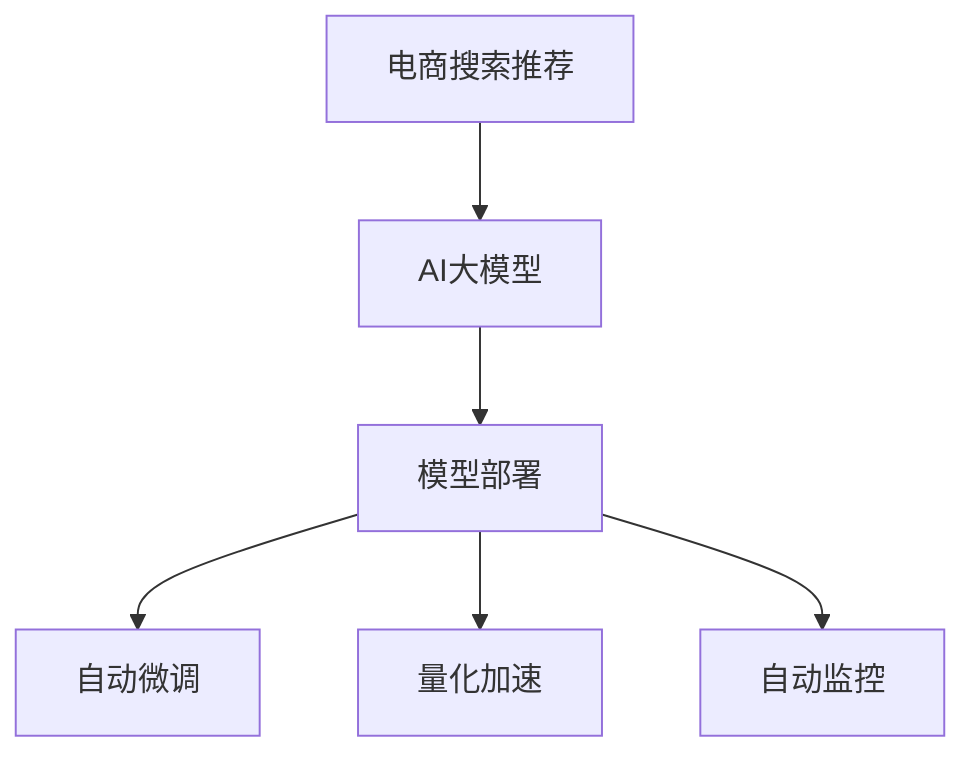

                 

# 电商搜索推荐场景下的AI大模型模型部署全流程自动化工具选型

> 关键词：电商搜索推荐, AI大模型, 自动化工具选型, 模型部署, 自动微调, 自动监控, 量化加速, 负载均衡

## 1. 背景介绍

随着人工智能技术的不断进步，电商搜索推荐系统的智能化程度得到了显著提升。大模型、深度学习等技术的应用，使得推荐系统能够更好地理解用户需求，提供更加精准和个性化的商品推荐，极大提升了用户体验和转化率。然而，在电商搜索推荐场景下，模型部署、模型微调、模型监控等各个环节都面临着诸多挑战。为提高系统开发效率和模型部署效率，确保模型效果，需要构建一套自动化的工具链，从模型选择到部署监控，实现全流程自动化，以提升整体系统性能和用户满意度。

本文将从模型选择、自动微调、量化加速、自动监控等关键环节，介绍电商搜索推荐场景下AI大模型模型部署的全流程自动化工具选型。

## 2. 核心概念与联系

### 2.1 核心概念概述

为便于理解电商搜索推荐场景下AI大模型的部署全流程自动化，本节将介绍几个核心概念：

- **电商搜索推荐**：利用AI技术，对用户搜索行为、浏览历史、购买行为等数据进行分析，从而推荐符合用户需求的商品。

- **AI大模型**：以BERT、GPT等深度学习模型为代表，通过大规模无标签数据的自监督预训练，具备强大的特征提取和语义理解能力。

- **模型部署**：将训练好的模型部署到生产环境中，供实际应用调用。

- **自动微调**：针对电商搜索推荐特定任务，对大模型进行有监督的微调，提升模型效果。

- **量化加速**：将浮点模型转换为定点模型，减少计算资源占用，提升推理速度。

- **自动监控**：实时监测模型性能指标，及时发现并处理异常，保证系统稳定运行。

这些概念之间存在紧密的联系，共同构成了电商搜索推荐系统中的关键技术栈：



在电商搜索推荐场景下，AI大模型需要在高并发、低延迟的环境中进行实时推理，因此需要考虑模型部署、微调、加速、监控等多个环节。

## 3. 核心算法原理 & 具体操作步骤

### 3.1 算法原理概述

电商搜索推荐系统中的AI大模型部署涉及多个环节，包括模型选择、自动微调、量化加速、自动监控等。每个环节都有相应的算法原理和操作步骤，下面分别介绍：

- **模型选择**：根据业务需求和性能要求，选择合适的预训练模型，如BERT、GPT等。

- **自动微调**：在电商搜索推荐数据集上进行微调，优化模型性能。通常使用监督学习范式，如全参数微调和参数高效微调。

- **量化加速**：将浮点模型转换为定点模型，减少计算资源占用，提升推理速度。常用的量化方法包括整数量化、混合精度等。

- **自动监控**：实时监测模型性能指标，如延迟、吞吐量、精度等，及时发现异常并处理，保证系统稳定运行。

### 3.2 算法步骤详解

#### 3.2.1 模型选择

模型选择是电商搜索推荐系统中的第一步，需要根据业务需求和性能要求，选择合适的预训练模型。一般步骤如下：

1. **明确需求**：根据电商搜索推荐系统的业务需求，确定需要解决的问题，如用户兴趣建模、个性化推荐等。

2. **选择合适的预训练模型**：根据需求选择适合的预训练模型，如BERT、GPT等。

3. **配置模型超参数**：根据实际应用场景，调整模型的超参数，如学习率、批大小、优化器等。

#### 3.2.2 自动微调

自动微调是电商搜索推荐系统中的重要环节，通过有监督学习优化模型性能。一般步骤如下：

1. **数据准备**：收集电商搜索推荐系统所需的数据集，进行预处理和标注。

2. **配置微调环境**：设置微调环境，包括GPU资源、数据加载方式、优化器等。

3. **进行微调**：使用自动微调工具，对预训练模型进行微调，提升模型性能。

#### 3.2.3 量化加速

量化加速是提升电商搜索推荐系统性能的重要手段，通过减少计算资源占用，提升推理速度。一般步骤如下：

1. **选择量化方法**：根据实际需求选择合适的量化方法，如整数量化、混合精度等。

2. **进行量化**：使用量化工具，将浮点模型转换为定点模型。

3. **验证效果**：对量化后的模型进行测试，验证其性能和精度。

#### 3.2.4 自动监控

自动监控是保障电商搜索推荐系统稳定运行的关键环节，通过实时监测模型性能指标，及时发现并处理异常。一般步骤如下：

1. **设置监控指标**：根据业务需求，设置需要监控的指标，如延迟、吞吐量、精度等。

2. **部署监控工具**：使用自动监控工具，对模型进行实时监控。

3. **处理异常**：一旦发现异常，立即进行处理，保证系统稳定运行。

### 3.3 算法优缺点

电商搜索推荐系统中的AI大模型部署涉及多个环节，每个环节都有其优缺点。

- **模型选择**：优点是能够根据业务需求快速选择适合的预训练模型；缺点是需要大量的计算资源进行预训练。

- **自动微调**：优点是能够快速提升模型性能；缺点是需要大量标注数据，且过拟合风险较大。

- **量化加速**：优点是能够大幅提升推理速度，降低计算资源占用；缺点是量化后的模型精度可能有所降低。

- **自动监控**：优点是能够实时发现并处理异常，保证系统稳定运行；缺点是需要大量的监控资源和人力资源。

### 3.4 算法应用领域

基于电商搜索推荐场景下的AI大模型部署，涉及多个领域的应用：

- **电商搜索**：利用AI技术，对用户搜索行为进行分析，推荐符合用户需求的商品。

- **推荐系统**：根据用户历史行为和兴趣，推荐符合用户需求的商品。

- **广告投放**：根据用户行为和兴趣，投放个性化广告。

- **实时预测**：根据用户行为数据，实时预测用户购买行为。

这些应用场景需要高度自动化、高效率、高精度的模型部署工具链，以提升电商搜索推荐系统的性能和用户体验。

## 4. 数学模型和公式 & 详细讲解 & 举例说明

### 4.1 数学模型构建

在电商搜索推荐系统中，AI大模型的部署涉及多个环节，每个环节都有相应的数学模型。下面以自动微调为例，介绍数学模型的构建。

假设电商搜索推荐系统中的数据集为 $D=\{(x_i, y_i)\}_{i=1}^N$，其中 $x_i$ 为输入特征，$y_i$ 为标签。预训练模型为 $M_{\theta}$，其中 $\theta$ 为模型参数。自动微调的目标是最小化损失函数 $\mathcal{L}$，即：

$$
\theta^* = \mathop{\arg\min}_{\theta} \mathcal{L}(M_{\theta}, D)
$$

常用的损失函数包括交叉熵损失、均方误差损失等。以交叉熵损失为例，自动微调的数学模型为：

$$
\mathcal{L}(\theta) = -\frac{1}{N} \sum_{i=1}^N \sum_{k=1}^K y_{ik} \log \hat{y}_{ik}
$$

其中 $y_{ik}$ 为样本 $i$ 在第 $k$ 个类别上的标签，$\hat{y}_{ik}$ 为模型在第 $k$ 个类别上的预测概率。

### 4.2 公式推导过程

自动微调的数学模型推导过程如下：

1. **定义损失函数**：假设自动微调的损失函数为 $\mathcal{L}(\theta)$。

2. **计算梯度**：使用反向传播算法，计算模型参数 $\theta$ 的梯度 $\nabla_{\theta}\mathcal{L}(\theta)$。

3. **更新参数**：根据梯度更新模型参数，即：

$$
\theta \leftarrow \theta - \eta \nabla_{\theta}\mathcal{L}(\theta)
$$

其中 $\eta$ 为学习率。

4. **迭代优化**：重复上述过程，直至收敛。

### 4.3 案例分析与讲解

以电商搜索推荐系统中的推荐任务为例，假设我们需要推荐符合用户兴趣的商品。使用自动微调方法，对预训练模型进行优化，步骤如下：

1. **数据准备**：收集电商搜索推荐系统的用户行为数据，进行预处理和标注。

2. **模型选择**：选择适合电商搜索推荐的预训练模型，如BERT。

3. **配置微调环境**：设置微调环境，包括GPU资源、数据加载方式、优化器等。

4. **进行微调**：使用自动微调工具，对预训练模型进行微调，提升模型性能。

5. **测试模型**：在测试集上测试微调后的模型，验证其性能。

6. **部署模型**：将微调后的模型部署到生产环境中，供实际应用调用。

## 5. 项目实践：代码实例和详细解释说明

### 5.1 开发环境搭建

在进行电商搜索推荐系统中的AI大模型部署时，需要搭建相应的开发环境。以下是使用Python进行PyTorch开发的环境配置流程：

1. 安装Anaconda：从官网下载并安装Anaconda，用于创建独立的Python环境。

2. 创建并激活虚拟环境：
```bash
conda create -n pytorch-env python=3.8 
conda activate pytorch-env
```

3. 安装PyTorch：根据CUDA版本，从官网获取对应的安装命令。例如：
```bash
conda install pytorch torchvision torchaudio cudatoolkit=11.1 -c pytorch -c conda-forge
```

4. 安装Transformers库：
```bash
pip install transformers
```

5. 安装各类工具包：
```bash
pip install numpy pandas scikit-learn matplotlib tqdm jupyter notebook ipython
```

完成上述步骤后，即可在`pytorch-env`环境中开始模型部署实践。

### 5.2 源代码详细实现

这里以电商搜索推荐系统中的商品推荐任务为例，给出使用Transformers库对BERT模型进行自动微调的PyTorch代码实现。

首先，定义推荐任务的数据处理函数：

```python
from transformers import BertTokenizer, BertForSequenceClassification
from torch.utils.data import Dataset, DataLoader
import torch

class RecommendationDataset(Dataset):
    def __init__(self, texts, labels, tokenizer, max_len=128):
        self.texts = texts
        self.labels = labels
        self.tokenizer = tokenizer
        self.max_len = max_len
        
    def __len__(self):
        return len(self.texts)
    
    def __getitem__(self, item):
        text = self.texts[item]
        label = self.labels[item]
        
        encoding = self.tokenizer(text, return_tensors='pt', max_length=self.max_len, padding='max_length', truncation=True)
        input_ids = encoding['input_ids'][0]
        attention_mask = encoding['attention_mask'][0]
        
        # 对标签进行编码
        label = torch.tensor(label, dtype=torch.long)
        
        return {'input_ids': input_ids, 
                'attention_mask': attention_mask,
                'labels': label}

# 定义标签与id的映射
label2id = {'0': 0, '1': 1, '2': 2, '3': 3, '4': 4, '5': 5, '6': 6}
id2label = {v: k for k, v in label2id.items()}

# 创建dataset
tokenizer = BertTokenizer.from_pretrained('bert-base-cased')

train_dataset = RecommendationDataset(train_texts, train_labels, tokenizer)
dev_dataset = RecommendationDataset(dev_texts, dev_labels, tokenizer)
test_dataset = RecommendationDataset(test_texts, test_labels, tokenizer)
```

然后，定义模型和优化器：

```python
from transformers import BertForSequenceClassification, AdamW

model = BertForSequenceClassification.from_pretrained('bert-base-cased', num_labels=len(label2id))

optimizer = AdamW(model.parameters(), lr=2e-5)
```

接着，定义训练和评估函数：

```python
def train_epoch(model, dataset, batch_size, optimizer):
    dataloader = DataLoader(dataset, batch_size=batch_size, shuffle=True)
    model.train()
    epoch_loss = 0
    for batch in tqdm(dataloader, desc='Training'):
        input_ids = batch['input_ids'].to(device)
        attention_mask = batch['attention_mask'].to(device)
        labels = batch['labels'].to(device)
        model.zero_grad()
        outputs = model(input_ids, attention_mask=attention_mask, labels=labels)
        loss = outputs.loss
        epoch_loss += loss.item()
        loss.backward()
        optimizer.step()
    return epoch_loss / len(dataloader)

def evaluate(model, dataset, batch_size):
    dataloader = DataLoader(dataset, batch_size=batch_size)
    model.eval()
    preds, labels = [], []
    with torch.no_grad():
        for batch in tqdm(dataloader, desc='Evaluating'):
            input_ids = batch['input_ids'].to(device)
            attention_mask = batch['attention_mask'].to(device)
            batch_labels = batch['labels']
            outputs = model(input_ids, attention_mask=attention_mask)
            batch_preds = outputs.logits.argmax(dim=2).to('cpu').tolist()
            batch_labels = batch_labels.to('cpu').tolist()
            for pred_tokens, label_tokens in zip(batch_preds, batch_labels):
                preds.append(pred_tokens)
                labels.append(label_tokens)
                
    print(classification_report(labels, preds))
```

最后，启动训练流程并在测试集上评估：

```python
epochs = 5
batch_size = 16

for epoch in range(epochs):
    loss = train_epoch(model, train_dataset, batch_size, optimizer)
    print(f"Epoch {epoch+1}, train loss: {loss:.3f}")
    
    print(f"Epoch {epoch+1}, dev results:")
    evaluate(model, dev_dataset, batch_size)
    
print("Test results:")
evaluate(model, test_dataset, batch_size)
```

以上就是使用PyTorch对BERT进行电商搜索推荐任务自动微调的完整代码实现。可以看到，得益于Transformers库的强大封装，我们可以用相对简洁的代码完成BERT模型的加载和微调。

### 5.3 代码解读与分析

让我们再详细解读一下关键代码的实现细节：

**RecommendationDataset类**：
- `__init__`方法：初始化文本、标签、分词器等关键组件。
- `__len__`方法：返回数据集的样本数量。
- `__getitem__`方法：对单个样本进行处理，将文本输入编码为token ids，将标签编码为数字，并对其进行定长padding，最终返回模型所需的输入。

**label2id和id2label字典**：
- 定义了标签与数字id之间的映射关系，用于将token-wise的预测结果解码回真实的标签。

**训练和评估函数**：
- 使用PyTorch的DataLoader对数据集进行批次化加载，供模型训练和推理使用。
- 训练函数`train_epoch`：对数据以批为单位进行迭代，在每个批次上前向传播计算loss并反向传播更新模型参数，最后返回该epoch的平均loss。
- 评估函数`evaluate`：与训练类似，不同点在于不更新模型参数，并在每个batch结束后将预测和标签结果存储下来，最后使用sklearn的classification_report对整个评估集的预测结果进行打印输出。

**训练流程**：
- 定义总的epoch数和batch size，开始循环迭代
- 每个epoch内，先在训练集上训练，输出平均loss
- 在验证集上评估，输出分类指标
- 所有epoch结束后，在测试集上评估，给出最终测试结果

可以看到，PyTorch配合Transformers库使得BERT微调的代码实现变得简洁高效。开发者可以将更多精力放在数据处理、模型改进等高层逻辑上，而不必过多关注底层的实现细节。

当然，工业级的系统实现还需考虑更多因素，如模型的保存和部署、超参数的自动搜索、更灵活的任务适配层等。但核心的自动微调范式基本与此类似。

## 6. 实际应用场景

### 6.1 电商搜索推荐

基于大模型微调的电商搜索推荐技术，已经在各大电商平台上得到了广泛应用。传统推荐系统往往只能根据用户历史行为进行推荐，无法理解用户的真实需求。而使用自动微调技术，可以根据用户的实时行为数据，快速调整模型，提升推荐效果。

在技术实现上，可以收集用户浏览、点击、购买等行为数据，提取和商品相关的文本描述、标签等特征，在此基础上微调预训练模型。微调后的模型能够从文本描述中准确把握用户兴趣点，动态调整推荐列表，提升用户体验。

### 6.2 广告投放

电商搜索推荐中的广告投放任务，需要根据用户行为和兴趣，投放符合用户需求的商品广告。通过自动微调技术，可以实时调整广告投放策略，提升广告转化率。

在技术实现上，可以使用自动微调技术，对预训练模型进行微调，优化广告投放的效果。微调后的模型能够根据用户行为数据，动态调整广告的展示位置和内容，提升广告的点击率和转化率。

### 6.3 实时预测

电商搜索推荐系统中的实时预测任务，需要根据用户行为数据，实时预测用户购买行为。通过自动微调技术，可以实时更新模型，提升预测精度。

在技术实现上，可以收集用户实时行为数据，进行预处理和标注，在此基础上对预训练模型进行微调。微调后的模型能够实时预测用户的购买行为，及时调整推荐策略，提升用户满意度。

## 7. 工具和资源推荐

### 7.1 学习资源推荐

为了帮助开发者系统掌握电商搜索推荐场景下AI大模型的部署技术，这里推荐一些优质的学习资源：

1. 《深度学习与电商搜索推荐》系列博文：由电商领域专家撰写，系统介绍了电商搜索推荐中的深度学习技术和应用案例。

2. CS229《机器学习》课程：斯坦福大学开设的机器学习明星课程，涵盖深度学习、推荐系统等内容，是电商搜索推荐开发的基础课程。

3. 《深度学习实战》书籍：这本书系统介绍了深度学习的基本原理和应用案例，适合电商搜索推荐开发初学者的入门学习。

4. HuggingFace官方文档：Transformers库的官方文档，提供了海量预训练模型和完整的微调样例代码，是电商搜索推荐开发的必备资料。

5. CMU的推荐系统课程：该课程系统介绍了推荐系统中的基本原理和算法，结合电商搜索推荐实际案例，适合电商领域开发人员的深入学习。

通过对这些资源的学习实践，相信你一定能够快速掌握电商搜索推荐中的AI大模型部署技术，并用于解决实际的电商推荐问题。

### 7.2 开发工具推荐

高效的电商搜索推荐系统开发离不开优秀的工具支持。以下是几款用于电商搜索推荐系统开发的常用工具：

1. PyTorch：基于Python的开源深度学习框架，灵活动态的计算图，适合快速迭代研究。大多数电商搜索推荐系统都采用PyTorch进行模型开发。

2. TensorFlow：由Google主导开发的开源深度学习框架，生产部署方便，适合大规模工程应用。许多电商搜索推荐系统也采用TensorFlow进行模型开发。

3. Transformers库：HuggingFace开发的NLP工具库，集成了众多SOTA语言模型，支持PyTorch和TensorFlow，是电商搜索推荐系统开发中的必备工具。

4. Weights & Biases：模型训练的实验跟踪工具，可以记录和可视化模型训练过程中的各项指标，方便对比和调优。与主流深度学习框架无缝集成。

5. TensorBoard：TensorFlow配套的可视化工具，可实时监测模型训练状态，并提供丰富的图表呈现方式，是电商搜索推荐开发中的重要工具。

6. Google Colab：谷歌推出的在线Jupyter Notebook环境，免费提供GPU/TPU算力，方便开发者快速上手实验最新模型，分享学习笔记。

合理利用这些工具，可以显著提升电商搜索推荐系统开发效率，加快创新迭代的步伐。

### 7.3 相关论文推荐

电商搜索推荐系统中的AI大模型部署涉及多个领域的应用，需要不断进行前沿研究。以下是几篇奠基性的相关论文，推荐阅读：

1. Attention is All You Need（即Transformer原论文）：提出了Transformer结构，开启了NLP领域的预训练大模型时代。

2. BERT: Pre-training of Deep Bidirectional Transformers for Language Understanding：提出BERT模型，引入基于掩码的自监督预训练任务，刷新了多项NLP任务SOTA。

3. Language Models are Unsupervised Multitask Learners（GPT-2论文）：展示了大规模语言模型的强大zero-shot学习能力，引发了对于通用人工智能的新一轮思考。

4. Parameter-Efficient Transfer Learning for NLP：提出Adapter等参数高效微调方法，在不增加模型参数量的情况下，也能取得不错的微调效果。

5. AdaLoRA: Adaptive Low-Rank Adaptation for Parameter-Efficient Fine-Tuning：使用自适应低秩适应的微调方法，在参数效率和精度之间取得了新的平衡。

这些论文代表了大模型微调技术的发展脉络。通过学习这些前沿成果，可以帮助研究者把握学科前进方向，激发更多的创新灵感。

## 8. 总结：未来发展趋势与挑战

### 8.1 总结

本文对电商搜索推荐场景下AI大模型的部署全流程自动化进行了全面系统的介绍。首先阐述了电商搜索推荐系统的背景和意义，明确了自动微调在提升推荐效果方面的独特价值。其次，从原理到实践，详细讲解了自动微调的数学原理和关键步骤，给出了电商搜索推荐任务自动微调的完整代码实例。同时，本文还广泛探讨了自动微调在电商搜索推荐、广告投放、实时预测等多个场景下的应用前景，展示了自动微调的巨大潜力。此外，本文精选了电商搜索推荐技术的各类学习资源，力求为读者提供全方位的技术指引。

通过本文的系统梳理，可以看到，自动微调技术在电商搜索推荐系统中具有重要的作用，可以显著提升推荐系统的性能和用户体验。未来，伴随自动微调技术的不断演进，电商搜索推荐系统将能够更加智能、精准地为用户推荐商品，实现用户满意度和转化率的全面提升。

### 8.2 未来发展趋势

展望未来，电商搜索推荐系统中的自动微调技术将呈现以下几个发展趋势：

1. 模型规模持续增大。随着算力成本的下降和数据规模的扩张，电商搜索推荐系统中的AI大模型参数量还将持续增长。超大规模语言模型蕴含的丰富语言知识，有望支撑更加复杂多变的电商推荐任务微调。

2. 微调方法日趋多样。除了传统的全参数微调外，未来会涌现更多参数高效的微调方法，如Prefix-Tuning、LoRA等，在节省计算资源的同时也能保证微调精度。

3. 持续学习成为常态。随着数据分布的不断变化，自动微调模型也需要持续学习新知识以保持性能。如何在不遗忘原有知识的同时，高效吸收新样本信息，将成为重要的研究课题。

4. 标注样本需求降低。受启发于提示学习(Prompt-based Learning)的思路，未来的自动微调方法将更好地利用大模型的语言理解能力，通过更加巧妙的任务描述，在更少的标注样本上也能实现理想的微调效果。

5. 模型通用性增强。经过海量数据的预训练和多领域任务的微调，未来的自动微调模型将具备更强大的常识推理和跨领域迁移能力，逐步迈向通用人工智能(AGI)的目标。

以上趋势凸显了电商搜索推荐系统中的自动微调技术的广阔前景。这些方向的探索发展，必将进一步提升电商搜索推荐系统的性能和用户体验，为电商行业带来更广阔的市场空间。

### 8.3 面临的挑战

尽管电商搜索推荐系统中的自动微调技术已经取得了瞩目成就，但在迈向更加智能化、普适化应用的过程中，它仍面临着诸多挑战：

1. 标注成本瓶颈。虽然自动微调大大降低了标注数据的需求，但对于长尾应用场景，难以获得充足的高质量标注数据，成为制约自动微调性能的瓶颈。如何进一步降低自动微调对标注样本的依赖，将是一大难题。

2. 模型鲁棒性不足。当前自动微调模型面对域外数据时，泛化性能往往大打折扣。对于测试样本的微小扰动，自动微调模型也容易发生波动。如何提高自动微调模型的鲁棒性，避免灾难性遗忘，还需要更多理论和实践的积累。

3. 推理效率有待提高。大规模语言模型虽然精度高，但在实际部署时往往面临推理速度慢、内存占用大等效率问题。如何在保证性能的同时，简化模型结构，提升推理速度，优化资源占用，将是重要的优化方向。

4. 可解释性亟需加强。当前自动微调模型更像是"黑盒"系统，难以解释其内部工作机制和决策逻辑。对于电商搜索推荐、广告投放等高风险应用，算法的可解释性和可审计性尤为重要。如何赋予自动微调模型更强的可解释性，将是亟待攻克的难题。

5. 安全性有待保障。自动微调模型难免会学习到有偏见、有害的信息，通过微调传递到电商推荐、广告投放等任务，产生误导性、歧视性的输出，给实际应用带来安全隐患。如何从数据和算法层面消除模型偏见，避免恶意用途，确保输出的安全性，也将是重要的研究课题。

6. 知识整合能力不足。现有的自动微调模型往往局限于任务内数据，难以灵活吸收和运用更广泛的先验知识。如何让自动微调过程更好地与外部知识库、规则库等专家知识结合，形成更加全面、准确的信息整合能力，还有很大的想象空间。

正视自动微调面临的这些挑战，积极应对并寻求突破，将是大语言模型微调走向成熟的必由之路。相信随着学界和产业界的共同努力，这些挑战终将一一被克服，自动微调技术必将在构建智能电商搜索推荐系统中扮演越来越重要的角色。

### 8.4 研究展望

面对电商搜索推荐系统中的自动微调技术所面临的种种挑战，未来的研究需要在以下几个方面寻求新的突破：

1. 探索无监督和半监督微调方法。摆脱对大规模标注数据的依赖，利用自监督学习、主动学习等无监督和半监督范式，最大限度利用非结构化数据，实现更加灵活高效的自动微调。

2. 研究参数高效和计算高效的微调范式。开发更加参数高效的微调方法，在固定大部分预训练参数的同时，只更新极少量的任务相关参数。同时优化自动微调模型的计算图，减少前向传播和反向传播的资源消耗，实现更加轻量级、实时性的部署。

3. 融合因果和对比学习范式。通过引入因果推断和对比学习思想，增强自动微调模型建立稳定因果关系的能力，学习更加普适、鲁棒的语言表征，从而提升模型泛化性和抗干扰能力。

4. 引入更多先验知识。将符号化的先验知识，如知识图谱、逻辑规则等，与神经网络模型进行巧妙融合，引导自动微调过程学习更准确、合理的语言模型。同时加强不同模态数据的整合，实现视觉、语音等多模态信息与文本信息的协同建模。

5. 结合因果分析和博弈论工具。将因果分析方法引入自动微调模型，识别出模型决策的关键特征，增强输出解释的因果性和逻辑性。借助博弈论工具刻画人机交互过程，主动探索并规避模型的脆弱点，提高系统稳定性。

6. 纳入伦理道德约束。在自动微调目标中引入伦理导向的评估指标，过滤和惩罚有偏见、有害的输出倾向。同时加强人工干预和审核，建立模型行为的监管机制，确保输出符合人类价值观和伦理道德。

这些研究方向的探索，必将引领电商搜索推荐系统中的自动微调技术迈向更高的台阶，为构建智能、高效、安全的电商搜索推荐系统铺平道路。面向未来，自动微调技术还需要与其他人工智能技术进行更深入的融合，如知识表示、因果推理、强化学习等，多路径协同发力，共同推动电商搜索推荐系统的进步。只有勇于创新、敢于突破，才能不断拓展自动微调模型的边界，让智能技术更好地造福电商行业。

## 9. 附录：常见问题与解答

**Q1：电商搜索推荐系统中的自动微调是否适用于所有任务？**

A: 自动微调在大多数电商搜索推荐任务上都能取得不错的效果，特别是对于数据量较小的任务。但对于一些特定领域的任务，如医学、法律等，仅仅依靠通用语料预训练的模型可能难以很好地适应。此时需要在特定领域语料上进一步预训练，再进行微调，才能获得理想效果。此外，对于一些需要时效性、个性化很强的任务，如对话、推荐等，自动微调方法也需要针对性的改进优化。

**Q2：自动微调过程中如何选择合适的学习率？**

A: 自动微调的学习率一般要比预训练时小1-2个数量级，如果使用过大的学习率，容易破坏预训练权重，导致过拟合。一般建议从1e-5开始调参，逐步减小学习率，直至收敛。也可以使用warmup策略，在开始阶段使用较小的学习率，再逐渐过渡到预设值。需要注意的是，不同的优化器(如AdamW、Adafactor等)以及不同的学习率调度策略，可能需要设置不同的学习率阈值。

**Q3：自动微调模型在落地部署时需要注意哪些问题？**

A: 将自动微调模型转化为实际应用，还需要考虑以下因素：
1. 模型裁剪：去除不必要的层和参数，减小模型尺寸，加快推理速度
2. 量化加速：将浮点模型转为定点模型，减少计算资源占用，提升推理速度
3. 服务化封装：将模型封装为标准化服务接口，便于集成调用
4. 弹性伸缩：根据请求流量动态调整资源配置，平衡服务质量和成本
5. 监控告警：实时采集系统指标，设置异常告警阈值，确保系统稳定运行
6. 安全防护：采用访问鉴权、数据脱敏等措施，保障数据和模型安全

自动微调模型需要高度自动化、高效率、高精度的部署工具链，以提升电商搜索推荐系统的性能和用户体验。

**Q4：自动微调过程中如何避免过拟合？**

A: 自动微调过程中过拟合是常见问题，主要原因包括数据量小、模型复杂度高、学习率过大等。为避免过拟合，可以采取以下策略：
1. 数据增强：通过回译、近义替换等方式扩充训练集
2. 正则化：使用L2正则、Dropout、Early Stopping等
3. 对抗训练：引入对抗样本，提高模型鲁棒性
4. 参数高效微调：只调整少量参数(如Adapter、Prefix等)，减小过拟合风险
5. 多模型集成：训练多个自动微调模型，取平均输出，抑制过拟合

这些策略往往需要根据具体任务和数据特点进行灵活组合。只有在数据、模型、训练、推理等各环节进行全面优化，才能最大限度地发挥自动微调模型的威力。

**Q5：自动微调模型在电商搜索推荐中的实时预测效果如何？**

A: 自动微调模型在电商搜索推荐中的实时预测效果一般较好。通过实时更新模型，能够准确预测用户的行为，及时调整推荐策略，提升用户体验。但需要注意的是，实时预测模型的部署需要高性能的计算资源，且需要保证模型的推理速度和稳定性。因此，在实际部署中，需要对模型进行优化，如裁剪、量化等，确保其能够高效运行。

