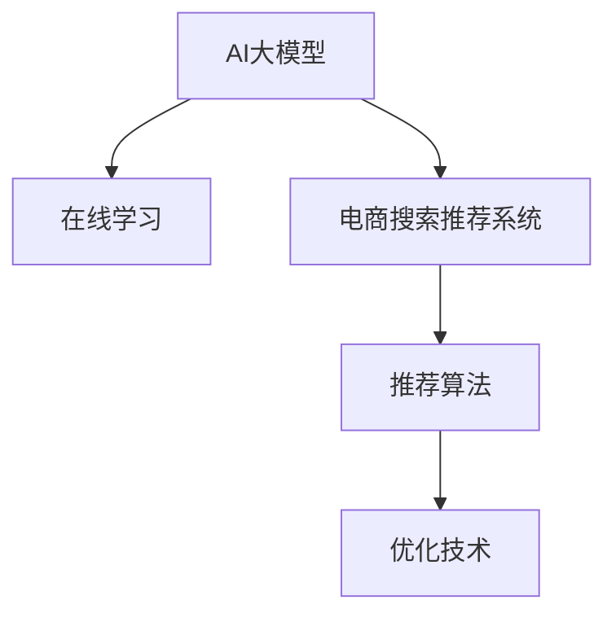

                 

# 电商搜索推荐效果优化中的AI大模型在线学习技术

> 关键词：在线学习，电商搜索，推荐系统，大模型，推荐算法，优化技术

## 1. 背景介绍

### 1.1 问题由来
随着电子商务的快速发展，用户对电商搜索和推荐系统的需求日益增长，对于个性化推荐和搜索结果的准确性、相关性和多样性要求越来越高。传统的基于规则、统计方法或者基于用户行为分析的推荐算法已难以满足这些需求。随着深度学习技术的发展，AI大模型在推荐系统中逐渐成为热点。但是，电商搜索推荐系统中数据量大、用户多样性强、实时要求高等特点，使得AI大模型在线学习的应用面临诸多挑战。

### 1.2 问题核心关键点
电商搜索推荐系统中，大模型在线学习技术旨在利用大规模数据，通过实时学习新数据，不断优化推荐效果。其核心关键点包括：
1. **在线学习算法**：选择什么样的在线学习算法来适应电商搜索推荐系统的实时性要求。
2. **数据采集与处理**：如何高效地采集和处理用户行为数据，保证数据的质量和时效性。
3. **模型优化**：如何对大模型进行高效优化，确保在实时更新数据时保持性能和收敛速度。
4. **推荐效果评估**：如何设计评估指标来衡量推荐效果，并不断优化模型。

## 2. 核心概念与联系

### 2.1 核心概念概述

为更好地理解AI大模型在线学习技术在电商搜索推荐中的应用，本节将介绍几个密切相关的核心概念：

- **AI大模型**：基于深度学习的大规模预训练模型，如BERT、GPT、DALL·E等，通过在大规模数据上进行预训练，学习到丰富的知识表示，适用于各类NLP任务。

- **在线学习**：指模型在接收新数据后，通过实时更新参数来适应数据分布的变化。与传统的批量学习不同，在线学习能够处理动态数据流，实时更新模型。

- **电商搜索推荐系统**：利用AI技术，为用户提供个性化的搜索结果和推荐商品的系统。其目标是通过优化算法，提升搜索和推荐的效果，增强用户体验。

- **推荐算法**：从用户的历史行为数据中学习用户偏好，预测用户可能感兴趣的商品，推荐给用户。常见的推荐算法包括协同过滤、内容推荐、混合推荐等。

- **优化技术**：通过梯度下降等算法，调整模型参数以最小化损失函数，提升模型的拟合能力。常见的优化技术包括SGD、Adam、Adagrad等。

这些核心概念之间的逻辑关系可以通过以下Mermaid流程图来展示：



这个流程图展示了大模型在线学习技术在电商搜索推荐系统中的应用框架，其中：

1. **AI大模型**作为数据驱动的表示模型，通过在线学习不断适应新的用户行为数据。
2. **电商搜索推荐系统**将用户的行为数据传递给大模型进行在线学习，并根据模型输出进行推荐。
3. **推荐算法**通过与大模型的结合，提升推荐效果。
4. **优化技术**帮助大模型实时调整参数，保持模型的有效性。

这些概念共同构成了大模型在线学习技术在电商搜索推荐中的应用框架，使其能够在实时处理大规模用户数据时，仍能提供高效、准确的推荐服务。

## 3. 核心算法原理 & 具体操作步骤

### 3.1 算法原理概述

AI大模型在线学习技术主要基于在线学习算法，通过实时更新模型参数，以适应电商搜索推荐系统中不断变化的用户行为数据。其核心思想是：在每次收到用户行为数据后，立即更新模型参数，使得模型能够快速响应数据分布的变化，提高推荐效果。

形式化地，假设电商搜索推荐系统中的用户行为数据流为 $D=\{(x_i,y_i)\}_{i=1}^N$，其中 $x_i$ 为用户的行为数据，$y_i$ 为对应的标签（如点击、购买等）。模型的目标是通过在线学习算法，最小化损失函数：

$$
\min_{\theta} \sum_{i=1}^N \ell(\theta, x_i, y_i)
$$

其中 $\ell$ 为损失函数，$\theta$ 为模型的参数。通过在线学习算法，模型在每次更新参数 $\theta$ 时，只需要考虑当前时刻的数据点 $x_i$ 和对应的标签 $y_i$。这样，模型可以实时适应数据分布的变化，从而提升推荐效果。

### 3.2 算法步骤详解

AI大模型在线学习技术在电商搜索推荐系统中的应用，主要包括以下几个关键步骤：

**Step 1: 数据采集与预处理**
- 实时采集电商搜索推荐系统中的用户行为数据，如点击、浏览、购买等。
- 对数据进行清洗、去重、归一化等预处理，确保数据的质量和一致性。

**Step 2: 设计在线学习算法**
- 选择合适的在线学习算法，如AdaGrad、Adam等，用于更新模型参数。
- 根据电商搜索推荐系统的实时性要求，设计合适的学习速率和更新策略。

**Step 3: 更新模型参数**
- 对每个用户行为数据点 $(x_i,y_i)$，通过在线学习算法计算梯度 $\Delta\theta$。
- 更新模型参数 $\theta \leftarrow \theta - \eta\Delta\theta$，其中 $\eta$ 为学习速率。

**Step 4: 评估推荐效果**
- 实时计算模型对每个用户行为数据的预测输出，并与真实标签进行对比。
- 使用合适的评估指标，如精确度、召回率、平均绝对误差等，衡量推荐效果。

**Step 5: 优化模型结构**
- 根据评估结果，调整模型结构，如增加或减少层数、调整神经元数量等。
- 引入正则化技术，如L2正则化、Dropout等，防止过拟合。

**Step 6: 数据增强**
- 通过数据增强技术，如随机采样、数据扩增、回译等，丰富训练数据的多样性。
- 引入对抗样本，提高模型的鲁棒性。

以上步骤构成了一个完整的在线学习流程，通过不断更新模型参数，电商搜索推荐系统可以实时适应用户行为的变化，提供更加个性化、准确的推荐服务。

### 3.3 算法优缺点

AI大模型在线学习技术在电商搜索推荐系统中的应用，具有以下优点：
1. **实时性高**：通过在线学习，模型可以实时适应数据分布的变化，及时更新推荐结果。
2. **泛化能力强**：大模型的预训练能力可以使其更好地泛化到新的数据上，提升推荐效果。
3. **可扩展性好**：在线学习算法具有较好的可扩展性，适用于大规模数据流。

同时，该技术也存在一定的局限性：
1. **计算资源要求高**：在线学习需要频繁地计算梯度并更新参数，对计算资源和存储资源要求较高。
2. **模型复杂度高**：大规模预训练模型的复杂度较高，在线学习算法需要优化以保持模型的性能和收敛速度。
3. **数据质量要求高**：电商搜索推荐系统中的数据质量直接影响在线学习的效果，需要严格的数据采集和预处理流程。

尽管存在这些局限性，但就目前而言，AI大模型在线学习技术仍是电商搜索推荐系统中的重要研究范式。未来相关研究的重点在于如何进一步降低计算成本，提高模型实时性，同时兼顾泛化能力和模型复杂度。

### 3.4 算法应用领域

AI大模型在线学习技术在电商搜索推荐系统中的应用，主要包括以下几个方面：

- **个性化推荐**：通过实时学习用户行为数据，推荐系统能够更准确地预测用户偏好，提供个性化的商品推荐。
- **实时搜索**：通过在线学习，搜索系统能够实时响应用户查询，提供更精准的搜索结果。
- **用户行为分析**：通过在线学习，系统能够实时分析用户行为，发现用户兴趣变化，及时调整推荐策略。
- **反欺诈检测**：通过在线学习，系统能够实时检测异常行为，防范欺诈风险。
- **库存管理**：通过在线学习，系统能够实时预测商品需求，优化库存管理。

除了这些核心应用，AI大模型在线学习技术还可以拓展到更多电商领域，如物流配送、客户服务、广告投放等，为电商行业带来更加智能化的管理和服务。

## 4. 数学模型和公式 & 详细讲解 & 举例说明

### 4.1 数学模型构建

在本节中，我们将使用数学语言对AI大模型在线学习技术进行更加严格的刻画。

假设电商搜索推荐系统中的用户行为数据流为 $D=\{(x_i,y_i)\}_{i=1}^N$，其中 $x_i$ 为用户的行为数据，$y_i$ 为对应的标签。模型的目标是通过在线学习算法，最小化损失函数：

$$
\min_{\theta} \sum_{i=1}^N \ell(\theta, x_i, y_i)
$$

其中 $\ell$ 为损失函数，$\theta$ 为模型的参数。常见的损失函数包括均方误差损失、交叉熵损失等。

在线学习算法的更新公式为：

$$
\theta \leftarrow \theta - \eta \nabla_{\theta}\ell(\theta, x_i, y_i)
$$

其中 $\eta$ 为学习速率，$\nabla_{\theta}\ell(\theta, x_i, y_i)$ 为损失函数对参数 $\theta$ 的梯度。

### 4.2 公式推导过程

以均方误差损失为例，推导在线学习算法的更新公式。

假设模型 $M_{\theta}$ 在输入 $x_i$ 上的输出为 $\hat{y}=M_{\theta}(x_i)$，真实标签为 $y_i$。均方误差损失函数定义为：

$$
\ell(M_{\theta}(x_i),y_i) = \frac{1}{2}(y_i - M_{\theta}(x_i))^2
$$

在线学习算法的更新公式为：

$$
\theta \leftarrow \theta - \eta \nabla_{\theta}\ell(\theta, x_i, y_i)
$$

其中 $\nabla_{\theta}\ell(\theta, x_i, y_i) = -(y_i - M_{\theta}(x_i))M_{\theta}(x_i)$，代入损失函数得到：

$$
\theta \leftarrow \theta + \eta(y_i - M_{\theta}(x_i))M_{\theta}(x_i)
$$

### 4.3 案例分析与讲解

以电商搜索推荐系统中的个性化推荐为例，分析在线学习算法的效果。

假设用户 $i$ 点击了商品 $j$，则 $y_i=1$，未点击则 $y_i=0$。模型的输出为 $\hat{y}_i = \sigma(W^Tx_i + b)$，其中 $W$ 和 $b$ 为模型的权重和偏置。均方误差损失函数为：

$$
\ell(\theta, x_i, y_i) = \frac{1}{2}(1 - \sigma(W^Tx_i + b))^2
$$

在线学习算法的更新公式为：

$$
W \leftarrow W - \eta(1 - \sigma(W^Tx_i + b))\sigma(W^Tx_i + b)x_i
$$

$b$ 的更新公式类似。

通过不断更新模型参数 $W$ 和 $b$，模型能够实时学习到用户的行为偏好，预测用户是否会对商品 $j$ 感兴趣，从而提供个性化的推荐。在线学习算法的高实时性使得推荐系统能够及时响应用户行为变化，提升推荐效果。

## 5. 项目实践：代码实例和详细解释说明

### 5.1 开发环境搭建

在进行AI大模型在线学习技术实践前，我们需要准备好开发环境。以下是使用Python进行PyTorch开发的环境配置流程：

1. 安装Anaconda：从官网下载并安装Anaconda，用于创建独立的Python环境。

2. 创建并激活虚拟环境：
```bash
conda create -n pytorch-env python=3.8 
conda activate pytorch-env
```

3. 安装PyTorch：根据CUDA版本，从官网获取对应的安装命令。例如：
```bash
conda install pytorch torchvision torchaudio cudatoolkit=11.1 -c pytorch -c conda-forge
```

4. 安装Transformers库：
```bash
pip install transformers
```

5. 安装各类工具包：
```bash
pip install numpy pandas scikit-learn matplotlib tqdm jupyter notebook ipython
```

完成上述步骤后，即可在`pytorch-env`环境中开始在线学习实践。

### 5.2 源代码详细实现

这里我们以电商搜索推荐系统中的个性化推荐为例，给出使用Transformers库对大模型进行在线学习的PyTorch代码实现。

首先，定义模型和优化器：

```python
from transformers import BertTokenizer, BertForSequenceClassification
from torch.optim import Adam

model = BertForSequenceClassification.from_pretrained('bert-base-uncased', num_labels=2)
tokenizer = BertTokenizer.from_pretrained('bert-base-uncased')
optimizer = Adam(model.parameters(), lr=0.01)
```

然后，定义数据处理函数：

```python
def process_data(data):
    inputs = tokenizer(data, return_tensors='pt', padding='max_length', truncation=True)
    return inputs['input_ids'], inputs['attention_mask']
```

接着，定义训练和评估函数：

```python
def train_epoch(model, data_loader, optimizer, device):
    model.train()
    for batch in data_loader:
        input_ids, attention_mask = process_data(batch)
        input_ids, attention_mask = input_ids.to(device), attention_mask.to(device)
        targets = batch['labels'].to(device)
        model.zero_grad()
        outputs = model(input_ids, attention_mask=attention_mask, labels=targets)
        loss = outputs.loss
        loss.backward()
        optimizer.step()
    return loss

def evaluate(model, data_loader, device):
    model.eval()
    eval_loss = 0
    eval_accuracies = []
    with torch.no_grad():
        for batch in data_loader:
            input_ids, attention_mask = process_data(batch)
            input_ids, attention_mask = input_ids.to(device), attention_mask.to(device)
            targets = batch['labels'].to(device)
            outputs = model(input_ids, attention_mask=attention_mask, labels=targets)
            eval_loss += outputs.loss.item()
            preds = outputs.logits.argmax(dim=1)
            targets = targets.argmax(dim=1)
            eval_accuracies.append((preds == targets).float().mean().item())
    return eval_loss / len(data_loader), eval_accuracies
```

最后，启动训练流程并在验证集上评估：

```python
epochs = 5
batch_size = 16

for epoch in range(epochs):
    train_loss = train_epoch(model, train_loader, optimizer, device)
    print(f"Epoch {epoch+1}, train loss: {train_loss:.3f}")
    
    val_loss, val_accuracies = evaluate(model, val_loader, device)
    print(f"Epoch {epoch+1}, val loss: {val_loss:.3f}, val accuracy: {val_accuracies:.3f}")
    
print("Test results:")
test_loss, test_accuracies = evaluate(model, test_loader, device)
print(f"Test loss: {test_loss:.3f}, test accuracy: {test_accuracies:.3f}")
```

以上就是使用PyTorch对大模型进行电商搜索推荐系统中的在线学习的完整代码实现。可以看到，通过简单的代码实现，我们便可以实现对电商搜索推荐系统中的个性化推荐模型的在线学习，提升推荐效果。

### 5.3 代码解读与分析

让我们再详细解读一下关键代码的实现细节：

**模型定义**：
- 使用`BertForSequenceClassification`类定义了模型结构，指定了输出层的维度和损失函数。
- 通过`from_pretrained`方法加载预训练的BERT模型，指定了输入标签的数目。

**数据处理函数**：
- `process_data`函数：将输入数据进行分词和编码，返回模型所需的输入张量和掩码张量。

**训练和评估函数**：
- `train_epoch`函数：对数据集进行迭代，计算损失并反向传播更新模型参数。
- `evaluate`函数：对模型进行评估，计算损失和准确率。

**训练流程**：
- 定义总的epoch数和batch size，开始循环迭代
- 每个epoch内，在训练集上训练，输出平均loss
- 在验证集上评估，输出平均loss和准确率
- 所有epoch结束后，在测试集上评估，输出平均loss和准确率

可以看到，PyTorch配合Transformers库使得在线学习模型的代码实现变得简洁高效。开发者可以将更多精力放在数据处理、模型改进等高层逻辑上，而不必过多关注底层的实现细节。

## 6. 实际应用场景

### 6.1 电商搜索

AI大模型在线学习技术在电商搜索中的应用，可以显著提升搜索的个性化和准确性。传统的搜索算法通常只考虑用户的历史查询记录和搜索关键词，难以捕捉到用户的深层兴趣和行为偏好。通过在线学习，搜索系统可以实时学习用户行为数据，准确预测用户可能感兴趣的商品，从而提供个性化的搜索结果。

例如，用户浏览了某个类别下的多个商品，但没有进行购买。通过在线学习，搜索系统可以捕捉到这一行为，并向用户推荐该类别的热门商品或类似商品，提高用户满意度。

### 6.2 个性化推荐

在线学习技术在个性化推荐中的应用，可以使得推荐系统更及时、更准确地预测用户偏好。传统的推荐系统通常是离线训练的，无法实时响应用户行为的变化。而在线学习技术可以在每次用户行为发生后，立即更新推荐模型，从而提供最新的推荐结果。

例如，用户浏览了某个商品页面但没有购买。通过在线学习，推荐系统可以实时更新用户对这一商品的兴趣度，并调整推荐列表，向用户推荐其他相关商品，增加交易机会。

### 6.3 实时广告投放

在线学习技术还可以应用于实时广告投放中。通过在线学习，广告系统可以实时分析用户的点击和转化数据，优化广告投放策略，提高广告效果。例如，根据用户的行为数据，在线学习算法可以识别出用户的兴趣点，并向其推荐相关广告，提高广告的点击率和转化率。

## 7. 工具和资源推荐

### 7.1 学习资源推荐

为了帮助开发者系统掌握AI大模型在线学习技术，这里推荐一些优质的学习资源：

1. 《深度学习基础》书籍：该书介绍了深度学习的基本概念和算法，适合初学者入门。
2. CS231n《深度学习视觉识别》课程：斯坦福大学开设的计算机视觉课程，涵盖了深度学习在图像识别中的应用。
3. 《Python深度学习》书籍：该书详细介绍了使用TensorFlow和Keras等框架进行深度学习开发的技巧和实践。
4. 《自然语言处理》课程：斯坦福大学开设的NLP课程，涵盖了NLP任务和算法。
5. 《Python机器学习》书籍：该书介绍了机器学习的基本概念和算法，并提供了使用Scikit-Learn等库进行实践的示例。

通过对这些资源的学习实践，相信你一定能够快速掌握AI大模型在线学习技术的精髓，并用于解决实际的电商推荐问题。

### 7.2 开发工具推荐

高效的开发离不开优秀的工具支持。以下是几款用于AI大模型在线学习开发的常用工具：

1. PyTorch：基于Python的开源深度学习框架，灵活动态的计算图，适合快速迭代研究。大部分预训练语言模型都有PyTorch版本的实现。
2. TensorFlow：由Google主导开发的开源深度学习框架，生产部署方便，适合大规模工程应用。同样有丰富的预训练语言模型资源。
3. Transformers库：HuggingFace开发的NLP工具库，集成了众多SOTA语言模型，支持PyTorch和TensorFlow，是进行在线学习任务开发的利器。
4. Weights & Biases：模型训练的实验跟踪工具，可以记录和可视化模型训练过程中的各项指标，方便对比和调优。与主流深度学习框架无缝集成。
5. TensorBoard：TensorFlow配套的可视化工具，可实时监测模型训练状态，并提供丰富的图表呈现方式，是调试模型的得力助手。
6. Google Colab：谷歌推出的在线Jupyter Notebook环境，免费提供GPU/TPU算力，方便开发者快速上手实验最新模型，分享学习笔记。

合理利用这些工具，可以显著提升AI大模型在线学习任务的开发效率，加快创新迭代的步伐。

### 7.3 相关论文推荐

AI大模型在线学习技术的发展源于学界的持续研究。以下是几篇奠基性的相关论文，推荐阅读：

1. On-line learning in neural networks: The human brain perspective（IJCAI 2019）：该论文从人类脑神经网络的角度出发，探讨了在线学习的机制和算法。
2. Online Learning with Adaptive Regularization using a Quadratic Approximation of the Stochastic Gradient（NIPS 2007）：该论文提出了一种在线学习算法，通过自适应正则化来控制模型的泛化能力和收敛速度。
3. Online Passive-Aggressive Algorithms with Adaptive Weights for Linear Prediction（NIPS 2006）：该论文提出了一种在线学习算法，通过自适应权重来优化模型性能。
4. Distributed Online Passive-Aggressive Algorithms（JMLR 2012）：该论文提出了一种分布式在线学习算法，适用于大规模数据流。
5. An Overview of Stochastic Optimization for Deep Learning（MIT Press, 2017）：该书籍提供了深度学习优化的全面概述，涵盖在线学习算法等内容。

这些论文代表了大模型在线学习技术的发展脉络。通过学习这些前沿成果，可以帮助研究者把握学科前进方向，激发更多的创新灵感。

## 8. 总结：未来发展趋势与挑战

### 8.1 总结

本文对AI大模型在线学习技术在电商搜索推荐中的应用进行了全面系统的介绍。首先阐述了电商搜索推荐系统中数据量大、用户多样性强、实时要求高等特点，明确了在线学习技术的适用性。其次，从原理到实践，详细讲解了在线学习算法的数学模型和实际操作步骤，给出了在线学习任务开发的完整代码实例。同时，本文还广泛探讨了在线学习技术在电商搜索、个性化推荐、实时广告投放等多个场景中的应用前景，展示了在线学习范式的巨大潜力。

通过本文的系统梳理，可以看到，AI大模型在线学习技术在电商搜索推荐系统中具有广泛的应用前景，能够显著提升推荐效果，优化用户体验。未来，伴随深度学习技术的持续发展和优化算法的不断演进，在线学习技术必将在更多领域大放异彩，为电商行业带来新的突破。

### 8.2 未来发展趋势

展望未来，AI大模型在线学习技术的发展趋势包括：

1. **实时性要求更高**：随着用户行为数据的实时性要求日益提高，在线学习算法需要进一步优化，以应对更大规模的数据流。
2. **模型复杂度增加**：为了提升推荐效果，未来的大模型将更加复杂，包含更多的层数和参数。在线学习算法需要进一步优化，以支持更大规模的模型结构。
3. **多样化的数据源**：除了电商搜索推荐系统中的数据，在线学习算法还可以拓展到其他数据源，如社交媒体、新闻、评论等，进一步提升推荐效果。
4. **跨平台应用**：在线学习技术可以拓展到跨平台应用，如移动端、桌面端、智能家居等，为用户提供一致的个性化推荐服务。
5. **多模态融合**：在线学习技术可以与其他模态的数据（如图像、视频等）进行融合，提升推荐系统的感知能力和应用范围。
6. **实时行为分析**：在线学习算法可以实时分析用户行为，发现用户的兴趣变化，动态调整推荐策略，提升推荐效果。

这些趋势凸显了AI大模型在线学习技术的广阔前景，推动其在更多领域落地应用，为电商行业带来更加智能化的管理和服务。

### 8.3 面临的挑战

尽管AI大模型在线学习技术已经取得了瞩目成就，但在迈向更加智能化、普适化应用的过程中，它仍面临诸多挑战：

1. **计算资源需求高**：在线学习算法需要频繁地计算梯度并更新参数，对计算资源和存储资源要求较高。
2. **模型复杂度增加**：为了提升推荐效果，未来的大模型将更加复杂，包含更多的层数和参数。在线学习算法需要进一步优化，以支持更大规模的模型结构。
3. **数据质量要求高**：电商搜索推荐系统中的数据质量直接影响在线学习的效果，需要严格的数据采集和预处理流程。
4. **模型鲁棒性不足**：在线学习模型面对域外数据时，泛化性能往往大打折扣。对于测试样本的微小扰动，模型也容易发生波动。
5. **模型过拟合风险**：在线学习模型容易过拟合训练数据，导致泛化性能下降。
6. **模型解释性不足**：在线学习模型通常难以解释其内部工作机制和决策逻辑，对于医疗、金融等高风险应用，算法的可解释性和可审计性尤为重要。

尽管存在这些挑战，但在线学习技术在电商搜索推荐系统中仍具有巨大的应用潜力，通过不断优化算法和数据处理流程，这些挑战终将一一被克服。

### 8.4 研究展望

面对在线学习面临的种种挑战，未来的研究需要在以下几个方面寻求新的突破：

1. **优化在线学习算法**：开发更加高效、稳定的在线学习算法，以支持更大规模的模型结构和实时性要求。
2. **数据采集与处理**：探索更多高效、可靠的数据采集和处理技术，确保数据的质量和时效性。
3. **模型复杂度控制**：通过剪枝、量化等技术，控制模型复杂度，降低计算资源消耗。
4. **多模态融合**：探索如何更好地融合不同模态的数据，提升推荐系统的感知能力和应用范围。
5. **实时行为分析**：进一步探索如何实时分析用户行为，发现用户的兴趣变化，动态调整推荐策略，提升推荐效果。
6. **模型鲁棒性提升**：开发更加鲁棒的在线学习算法，提升模型的泛化性能和鲁棒性。

这些研究方向将引领在线学习技术迈向更高的台阶，为构建安全、可靠、可解释、可控的智能系统铺平道路。面向未来，在线学习技术还需要与其他人工智能技术进行更深入的融合，如知识表示、因果推理、强化学习等，多路径协同发力，共同推动人工智能技术在电商行业的深入应用。只有勇于创新、敢于突破，才能不断拓展在线学习技术的边界，让智能技术更好地造福电商行业。

## 9. 附录：常见问题与解答

**Q1：如何选择合适的在线学习算法？**

A: 在线学习算法的选择需要考虑电商搜索推荐系统的实时性要求和数据分布情况。常见的在线学习算法包括AdaGrad、Adam、SGD等。对于实时性要求较高的系统，可以选择Adam等高效算法。对于数据分布变化较大的系统，可以选择AdaGrad等自适应算法。

**Q2：在线学习过程中如何避免过拟合？**

A: 在线学习过程中，可以通过以下方法避免过拟合：
1. 数据增强：通过回译、近义替换等方式扩充训练集，减少模型对训练数据的依赖。
2. 正则化：使用L2正则、Dropout等技术，防止模型过拟合训练数据。
3. 早停策略：在验证集上监控模型性能，一旦性能不再提升，及时停止训练，防止过拟合。

**Q3：在线学习模型在部署过程中需要注意哪些问题？**

A: 在线学习模型在部署过程中，需要注意以下问题：
1. 模型裁剪：去除不必要的层和参数，减小模型尺寸，加快推理速度。
2. 量化加速：将浮点模型转为定点模型，压缩存储空间，提高计算效率。
3. 服务化封装：将模型封装为标准化服务接口，便于集成调用。
4. 弹性伸缩：根据请求流量动态调整资源配置，平衡服务质量和成本。
5. 监控告警：实时采集系统指标，设置异常告警阈值，确保服务稳定性。
6. 安全防护：采用访问鉴权、数据脱敏等措施，保障数据和模型安全。

在线学习模型在电商搜索推荐系统中的应用，需要结合实际需求进行优化，以提升推荐效果和用户体验。

---

作者：禅与计算机程序设计艺术 / Zen and the Art of Computer Programming

