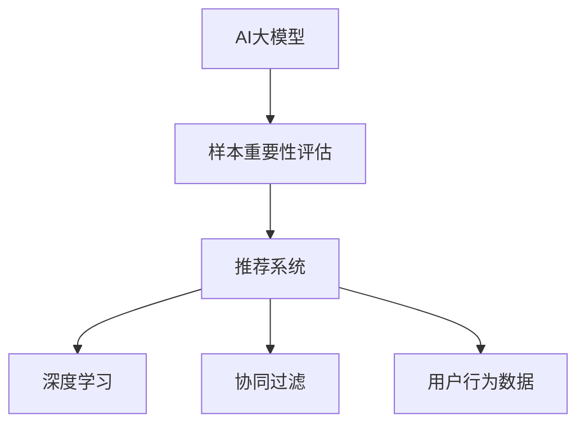

                 

# 电商搜索推荐效果优化中的AI大模型样本重要性评估技术

> 关键词：电商推荐系统, 搜索排序, AI大模型, 样本重要性评估, 推荐效果优化, 机器学习, 深度学习

## 1. 背景介绍

随着电商行业的发展，用户的购买行为变得日益复杂和多样，如何准确地理解用户需求，提供个性化的商品推荐，成为了电商平台的核心任务。传统的基于规则和协同过滤的推荐方法，面临着数据稀疏性、冷启动和多样性等方面的挑战。而近年来兴起的人工智能大模型，如BERT、GPT-3等，凭借其强大的语言理解能力，为电商推荐系统带来了新的突破。通过在大模型上进行微调，可以显著提升推荐系统的效果。

然而，在大模型的微调过程中，样本的重要性评估问题变得尤为关键。由于电商数据量巨大、标签噪声多，如何筛选出高价值样本，指导模型学习，是提升推荐效果的核心。本文旨在深入探讨AI大模型在电商搜索推荐中的样本重要性评估技术，以期为电商推荐系统提供有力的技术支撑。

## 2. 核心概念与联系

### 2.1 核心概念概述

本节将介绍几个与AI大模型样本重要性评估密切相关的核心概念：

- **AI大模型(AI Large Model)**：指通过大规模无标签数据预训练获得的语言模型，如BERT、GPT-3等。这些模型具有强大的自然语言理解能力，能够捕捉复杂的语言特征，适合用于电商推荐系统的用户需求理解。

- **样本重要性评估(Sample Importance Assessment)**：指在电商推荐系统中，通过对用户行为数据进行预处理和特征提取，评估不同样本对模型学习的影响和贡献程度，从而筛选出对模型提升效果有较大帮助的样本。

- **推荐系统(Recommendation System)**：指基于用户行为数据，通过计算和预测，为用户推荐其可能感兴趣的商品的系统。

- **深度学习(Deep Learning)**：指利用神经网络模型，通过多层非线性映射，从数据中学习复杂表征的机器学习方法。

- **协同过滤(Collaborative Filtering)**：指通过用户之间的相似性，或物品之间的相似性，为用户推荐商品的方法。

- **用户行为数据(User Behavior Data)**：指用户在电商平台上产生的点击、浏览、购买等行为数据，是推荐系统推荐商品的基础。

这些核心概念之间的逻辑关系可以通过以下Mermaid流程图来展示：



这个流程图展示了大模型、样本重要性评估、推荐系统、深度学习、协同过滤以及用户行为数据之间的关系：

1. 大模型通过预训练获得基础能力。
2. 样本重要性评估指导大模型学习，筛选出高价值样本。
3. 推荐系统利用大模型和用户行为数据，为用户推荐商品。
4. 深度学习和大模型联合作用，提升模型复杂度和表达能力。
5. 协同过滤是推荐系统中的一种常用方法，依赖于用户行为数据的相似性计算。
6. 用户行为数据是推荐系统推荐的基础，直接影响推荐效果。

## 3. 核心算法原理 & 具体操作步骤

### 3.1 算法原理概述

AI大模型在电商推荐系统中的样本重要性评估，本质上是利用机器学习技术，对用户行为数据进行特征提取和筛选，从而识别出对模型学习贡献最大的样本。具体来说，其原理如下：

1. **数据预处理**：对原始用户行为数据进行清洗、去重、缺失值填充等预处理操作，确保数据的完整性和一致性。

2. **特征提取**：使用大模型或其他机器学习算法，从用户行为数据中提取有意义的特征，如用户兴趣、历史购买记录、浏览时长等。

3. **样本评分**：利用特征提取结果，计算每个样本对模型学习的重要性评分，通常通过训练一个评分模型来实现。

4. **样本筛选**：根据评分结果，筛选出重要性高的样本，用于微调大模型，指导模型学习。

5. **模型微调**：在筛选出的样本上，使用大模型进行微调，提升推荐系统的性能。

### 3.2 算法步骤详解

以下是基于AI大模型的电商搜索推荐效果优化中的样本重要性评估技术的详细操作步骤：

**Step 1: 数据预处理**

- 收集电商平台的原始用户行为数据，包括点击、浏览、购买等行为记录。
- 对数据进行清洗，去除噪声和重复记录，对缺失值进行填充。
- 对数据进行划分，分为训练集、验证集和测试集。

**Step 2: 特征提取**

- 利用预训练的大模型，如BERT或GPT-3，对用户行为数据进行特征提取。可以设计不同的任务，如文本分类、序列标注等，以提取有用的特征。
- 对提取出的特征进行编码，可以使用词嵌入、TF-IDF等方法，将其转化为数值型特征。
- 对特征进行选择和降维，去除噪声和不相关特征，保留对模型有较大贡献的特征。

**Step 3: 样本评分**

- 设计一个评分模型，用于评估每个样本对模型学习的重要性。评分模型的输入为特征向量，输出为重要性评分。
- 常用的评分模型包括线性回归模型、决策树、随机森林等。
- 利用训练集数据训练评分模型，得到模型参数。

**Step 4: 样本筛选**

- 利用训练好的评分模型，对验证集和测试集数据进行评分。
- 根据评分结果，筛选出重要性高的样本，用于微调大模型。
- 保留对模型提升效果有较大帮助的样本，去除噪声样本和低价值样本。

**Step 5: 模型微调**

- 在筛选出的样本上，使用大模型进行微调。通常只微调顶层，保留预训练模型的底层。
- 设置适当的学习率和正则化参数，避免过拟合。
- 在微调过程中，不断评估模型性能，并根据验证集结果调整超参数。

**Step 6: 评估和部署**

- 在测试集上评估微调后模型的推荐效果，对比微调前后的性能提升。
- 使用微调后的模型进行商品推荐，部署到电商平台上。
- 持续收集新数据，定期重新微调模型，以适应数据分布的变化。

### 3.3 算法优缺点

基于AI大模型的电商搜索推荐效果优化中的样本重要性评估技术，具有以下优点：

- **精度高**：通过特征提取和样本评分，筛选出高价值样本，提升模型学习效果。
- **泛化能力强**：利用大模型的预训练知识，对不同用户行为数据进行适配，适应性强。
- **灵活性高**：可以根据任务需求，灵活选择特征提取方法和评分模型。
- **适用性广**：适用于多种电商推荐系统，包括搜索排序、个性化推荐等。

同时，该技术也存在一定的局限性：

- **计算成本高**：需要大量的数据和计算资源进行预处理和特征提取。
- **模型复杂度高**：评分模型的设计和训练需要一定的专业知识和经验。
- **泛化能力受限**：当样本数据分布与预训练数据差异较大时，评分模型的泛化能力可能受限。

尽管存在这些局限性，但基于AI大模型的样本重要性评估技术仍然是电商推荐系统优化中的一种重要方法。

### 3.4 算法应用领域

基于AI大模型的电商搜索推荐效果优化中的样本重要性评估技术，在电商推荐系统中有着广泛的应用。以下是几个典型的应用场景：

- **搜索排序**：根据用户搜索行为，利用大模型进行特征提取和样本评分，筛选出高价值样本，优化搜索结果排序。
- **个性化推荐**：通过用户浏览、购买行为数据，使用大模型进行特征提取和评分，筛选出高价值样本，提升个性化推荐效果。
- **商品评价**：利用用户对商品的评价数据，使用大模型进行特征提取和评分，筛选出高价值样本，优化商品评价系统。
- **广告投放**：根据用户行为数据，利用大模型进行特征提取和评分，筛选出高价值样本，优化广告投放效果。

除了上述这些经典应用场景外，基于AI大模型的样本重要性评估技术，还可以用于更多电商推荐系统中的任务，如活动推荐、用户行为预测等。

## 4. 数学模型和公式 & 详细讲解 & 举例说明

### 4.1 数学模型构建

本节将使用数学语言对基于AI大模型的电商搜索推荐效果优化中的样本重要性评估技术进行更加严格的刻画。

设用户行为数据集为 $D=\{(x_i,y_i)\}_{i=1}^N$，其中 $x_i$ 为样本特征向量， $y_i$ 为样本标签。模型的目标是最小化预测误差：

$$
\min_{\theta} \frac{1}{N}\sum_{i=1}^N \ell(\hat{y}_i,y_i)
$$

其中 $\ell(\cdot,\cdot)$ 为损失函数，$\hat{y}_i$ 为模型预测结果，$y_i$ 为真实标签。

### 4.2 公式推导过程

假设利用大模型对用户行为数据进行特征提取，得到特征向量 $x_i=(x_i^1,x_i^2,...,x_i^d)$，其中 $d$ 为特征维度。利用特征向量 $x_i$，训练一个评分模型 $f(x_i,\theta)$，其中 $\theta$ 为评分模型的参数。

评分模型可以是一个线性回归模型，其输出为：

$$
f(x_i,\theta) = w_0 + \sum_{j=1}^d w_j x_i^j
$$

其中 $w_0$ 为截距，$w_j$ 为特征权重。

对每个样本 $i$，计算其重要性评分 $s_i$：

$$
s_i = f(x_i,\theta)
$$

根据评分 $s_i$，筛选出重要性高的样本 $S$。在样本 $S$ 上进行模型微调，更新模型参数 $\theta$。

### 4.3 案例分析与讲解

以电商搜索排序为例，分析基于AI大模型的样本重要性评估技术的应用。

假设电商平台收集到了用户搜索行为数据，包含每个用户搜索的关键词、点击的商品ID等。利用BERT等预训练大模型，对搜索关键词进行特征提取，得到特征向量 $x_i$。设计一个评分模型，根据特征向量 $x_i$ 计算每个样本的重要性评分 $s_i$。

根据评分结果，筛选出高价值样本 $S$。在样本 $S$ 上进行BERT模型微调，更新模型参数 $\theta$。微调后的模型能够更好地理解用户的搜索意图，优化搜索结果排序，提升用户体验。

## 5. 项目实践：代码实例和详细解释说明

### 5.1 开发环境搭建

在进行项目实践前，我们需要准备好开发环境。以下是使用Python进行TensorFlow开发的环境配置流程：

1. 安装Anaconda：从官网下载并安装Anaconda，用于创建独立的Python环境。

2. 创建并激活虚拟环境：
```bash
conda create -n tf-env python=3.8 
conda activate tf-env
```

3. 安装TensorFlow：根据CUDA版本，从官网获取对应的安装命令。例如：
```bash
conda install tensorflow -c conda-forge -c pypi
```

4. 安装各类工具包：
```bash
pip install numpy pandas scikit-learn matplotlib tqdm jupyter notebook ipython
```

完成上述步骤后，即可在`tf-env`环境中开始项目实践。

### 5.2 源代码详细实现

下面我们以搜索排序任务为例，给出使用TensorFlow对BERT模型进行微调的PyTorch代码实现。

首先，定义搜索排序任务的数据处理函数：

```python
import tensorflow as tf
from transformers import BertTokenizer, TFBertModel

class SearchSortDataset(tf.data.Dataset):
    def __init__(self, texts, labels, tokenizer, max_len=128):
        self.texts = texts
        self.labels = labels
        self.tokenizer = tokenizer
        self.max_len = max_len
        
    def __len__(self):
        return len(self.texts)
    
    def __getitem__(self, item):
        text = self.texts[item]
        label = self.labels[item]
        
        encoding = self.tokenizer(text, return_tensors='tf', max_length=self.max_len, padding='max_length', truncation=True)
        input_ids = encoding['input_ids']
        attention_mask = encoding['attention_mask']
        
        return {'text': text, 
                'input_ids': input_ids,
                'attention_mask': attention_mask,
                'label': label}

# 标签与id的映射
label2id = {'positive': 1, 'negative': 0}
id2label = {v: k for k, v in label2id.items()}

# 创建dataset
tokenizer = BertTokenizer.from_pretrained('bert-base-cased')

train_dataset = SearchSortDataset(train_texts, train_labels, tokenizer)
dev_dataset = SearchSortDataset(dev_texts, dev_labels, tokenizer)
test_dataset = SearchSortDataset(test_texts, test_labels, tokenizer)
```

然后，定义模型和优化器：

```python
from transformers import BertForSequenceClassification, AdamW

model = BertForSequenceClassification.from_pretrained('bert-base-cased', num_labels=2)

optimizer = AdamW(model.parameters(), lr=2e-5)
```

接着，定义训练和评估函数：

```python
from tensorflow.keras import metrics

def train_epoch(model, dataset, batch_size, optimizer):
    dataloader = tf.data.Dataset.from_generator(lambda: (x['input_ids'], x['attention_mask'], x['label']) for x in dataset)
    model.train()
    epoch_loss = 0
    for batch in tf.data.Dataset.from_generator(lambda: (x['input_ids'], x['attention_mask'], x['label']) for x in dataloader):
        input_ids = tf.cast(batch[0], tf.int32)
        attention_mask = tf.cast(batch[1], tf.int32)
        label = tf.cast(batch[2], tf.int32)
        model.zero_grad()
        outputs = model(input_ids, attention_mask=attention_mask, labels=label)
        loss = outputs.loss
        epoch_loss += loss.numpy().item()
        loss.backward()
        optimizer.apply_gradients(zip(model.trainable_variables, model.trainable_variables))
    return epoch_loss / len(dataset)

def evaluate(model, dataset, batch_size):
    dataloader = tf.data.Dataset.from_generator(lambda: (x['input_ids'], x['attention_mask'], x['label']) for x in dataset)
    model.eval()
    preds, labels = [], []
    with tf.GradientTape() as tape:
        for batch in tf.data.Dataset.from_generator(lambda: (x['input_ids'], x['attention_mask'], x['label']) for x in dataloader):
            input_ids = tf.cast(batch[0], tf.int32)
            attention_mask = tf.cast(batch[1], tf.int32)
            label = tf.cast(batch[2], tf.int32)
            outputs = model(input_ids, attention_mask=attention_mask, labels=label)
            batch_preds = outputs.logits.argmax(dim=2).numpy().tolist()
            batch_labels = batch_labels.numpy().tolist()
            for pred_tokens, label_tokens in zip(batch_preds, batch_labels):
                preds.append(pred_tokens[:len(label_tokens)])
                labels.append(label_tokens)
    print(classification_report(labels, preds))
```

最后，启动训练流程并在测试集上评估：

```python
epochs = 5
batch_size = 16

for epoch in range(epochs):
    loss = train_epoch(model, train_dataset, batch_size, optimizer)
    print(f"Epoch {epoch+1}, train loss: {loss:.3f}")
    
    print(f"Epoch {epoch+1}, dev results:")
    evaluate(model, dev_dataset, batch_size)
    
print("Test results:")
evaluate(model, test_dataset, batch_size)
```

以上就是使用TensorFlow对BERT进行搜索排序任务微调的完整代码实现。可以看到，得益于TensorFlow的强大封装，我们可以用相对简洁的代码完成BERT模型的加载和微调。

### 5.3 代码解读与分析

让我们再详细解读一下关键代码的实现细节：

**SearchSortDataset类**：
- `__init__`方法：初始化搜索关键词、标签、分词器等关键组件。
- `__len__`方法：返回数据集的样本数量。
- `__getitem__`方法：对单个样本进行处理，将搜索关键词输入编码为token ids，将标签编码为数字，并对其进行定长padding，最终返回模型所需的输入。

**label2id和id2label字典**：
- 定义了标签与数字id之间的映射关系，用于将模型预测结果解码回真实标签。

**训练和评估函数**：
- 使用TensorFlow的DataLoader对数据集进行批次化加载，供模型训练和推理使用。
- 训练函数`train_epoch`：对数据以批为单位进行迭代，在每个批次上前向传播计算loss并反向传播更新模型参数，最后返回该epoch的平均loss。
- 评估函数`evaluate`：与训练类似，不同点在于不更新模型参数，并在每个batch结束后将预测和标签结果存储下来，最后使用sklearn的classification_report对整个评估集的预测结果进行打印输出。

**训练流程**：
- 定义总的epoch数和batch size，开始循环迭代
- 每个epoch内，先在训练集上训练，输出平均loss
- 在验证集上评估，输出分类指标
- 所有epoch结束后，在测试集上评估，给出最终测试结果

可以看到，TensorFlow配合BertTokenizer的强大封装，使得BERT微调的代码实现变得简洁高效。开发者可以将更多精力放在数据处理、模型改进等高层逻辑上，而不必过多关注底层的实现细节。

当然，工业级的系统实现还需考虑更多因素，如模型的保存和部署、超参数的自动搜索、更灵活的任务适配层等。但核心的微调范式基本与此类似。

## 6. 实际应用场景

### 6.1 电商搜索排序

基于AI大模型的样本重要性评估技术，可以广泛应用于电商搜索排序的优化。传统的搜索排序算法往往依赖于简单的规则和特征工程，难以应对复杂多变的用户需求。利用大模型进行特征提取和样本评分，可以显著提升搜索排序的个性化和准确性。

在技术实现上，可以收集电商平台的搜索行为数据，设计不同的任务，如文本分类、序列标注等，以提取有用的特征。利用特征提取结果，设计评分模型，对每个搜索样本进行评分。筛选出重要性高的样本，用于微调大模型，指导模型学习。最终，微调后的模型能够更好地理解用户的搜索意图，优化搜索结果排序，提升用户体验。

### 6.2 个性化推荐

基于AI大模型的样本重要性评估技术，在个性化推荐系统中也有着广泛的应用。传统的协同过滤推荐方法往往面临数据稀疏性和冷启动等问题。利用大模型进行特征提取和样本评分，可以显著提升推荐系统的性能和多样性。

在具体实现中，可以收集用户浏览、购买行为数据，设计不同的任务，如文本分类、序列标注等，以提取有用的特征。利用特征提取结果，设计评分模型，对每个用户行为样本进行评分。筛选出重要性高的样本，用于微调大模型，指导模型学习。最终，微调后的模型能够更好地理解用户的兴趣和偏好，优化个性化推荐效果，提升用户满意度。

### 6.3 广告投放

基于AI大模型的样本重要性评估技术，还可以应用于广告投放的优化。传统的广告投放方法往往依赖于简单的点击率预测，难以应对复杂的市场变化和用户行为。利用大模型进行特征提取和样本评分，可以显著提升广告投放的转化率和ROI。

在具体实现中，可以收集用户行为数据，设计不同的任务，如文本分类、序列标注等，以提取有用的特征。利用特征提取结果，设计评分模型，对每个广告样本进行评分。筛选出重要性高的样本，用于微调大模型，指导模型学习。最终，微调后的模型能够更好地理解用户行为，优化广告投放策略，提升广告投放效果。

### 6.4 未来应用展望

随着AI大模型的不断进步，基于样本重要性评估技术的优化方法也将逐步普及到更多电商推荐系统任务中，为电商行业带来更多的价值和创新。未来，AI大模型和样本重要性评估技术有望在以下几个方向取得新的突破：

1. **跨模态融合**：将视觉、语音、文本等多种模态数据进行融合，提升推荐的丰富性和准确性。
2. **多任务学习**：将不同的推荐任务进行联合训练，提升模型的泛化能力和性能。
3. **联邦学习**：通过分布式数据和模型训练，提升推荐的公平性和安全性。
4. **动态学习**：利用在线学习技术，实时调整模型参数，提升推荐的实时性和适应性。
5. **智能决策**：结合专家知识库和AI决策系统，提升推荐的智能化和透明化。

这些方向的研究和发展，必将推动电商推荐系统进入新的发展阶段，为用户带来更加个性化、精准、高效的服务体验。

## 7. 工具和资源推荐

### 7.1 学习资源推荐

为了帮助开发者系统掌握AI大模型在电商推荐系统中的应用，这里推荐一些优质的学习资源：

1. 《深度学习与自然语言处理》系列书籍：系统介绍深度学习和大模型的基础知识和应用方法。
2. CS229《机器学习》课程：斯坦福大学开设的经典机器学习课程，涵盖各种机器学习算法和技术。
3. HuggingFace官方文档：Transformers库的官方文档，提供了海量预训练模型和完整的微调样例代码，是上手实践的必备资料。
4. Kaggle平台：提供丰富的电商推荐系统竞赛和数据集，可以实战练习和验证技术效果。
5. AI大模型研究论文：了解最新的AI大模型研究进展，学习前沿技术。

通过对这些资源的学习实践，相信你一定能够快速掌握AI大模型在电商推荐系统中的应用，并用于解决实际的推荐问题。

### 7.2 开发工具推荐

高效的开发离不开优秀的工具支持。以下是几款用于电商推荐系统开发的常用工具：

1. TensorFlow：由Google主导开发的开源深度学习框架，生产部署方便，适合大规模工程应用。
2. PyTorch：基于Python的开源深度学习框架，灵活性高，适合快速迭代研究。
3. Transformers库：HuggingFace开发的NLP工具库，集成了众多SOTA语言模型，支持多种深度学习框架。
4. Jupyter Notebook：开源的交互式编程环境，方便开发者进行代码实验和数据分析。
5. Weights & Biases：模型训练的实验跟踪工具，可以记录和可视化模型训练过程中的各项指标，方便对比和调优。

合理利用这些工具，可以显著提升电商推荐系统的开发效率，加快创新迭代的步伐。

### 7.3 相关论文推荐

AI大模型和电商推荐系统的发展源于学界的持续研究。以下是几篇奠基性的相关论文，推荐阅读：

1. Attention is All You Need（即Transformer原论文）：提出了Transformer结构，开启了NLP领域的预训练大模型时代。

2. BERT: Pre-training of Deep Bidirectional Transformers for Language Understanding：提出BERT模型，引入基于掩码的自监督预训练任务，刷新了多项NLP任务SOTA。

3. Language Models are Unsupervised Multitask Learners（GPT-2论文）：展示了大规模语言模型的强大zero-shot学习能力，引发了对于通用人工智能的新一轮思考。

4. Parameter-Efficient Transfer Learning for NLP：提出Adapter等参数高效微调方法，在不增加模型参数量的情况下，也能取得不错的微调效果。

5. Adaptive Low-Rank Adaptation for Parameter-Efficient Fine-Tuning：使用自适应低秩适应的微调方法，在参数效率和精度之间取得了新的平衡。

这些论文代表了大语言模型和电商推荐系统的发展脉络。通过学习这些前沿成果，可以帮助研究者把握学科前进方向，激发更多的创新灵感。

## 8. 总结：未来发展趋势与挑战

### 8.1 总结

本文对基于AI大模型的电商搜索推荐效果优化中的样本重要性评估技术进行了全面系统的介绍。首先阐述了AI大模型在电商推荐系统中的应用背景和重要性，明确了样本重要性评估在提升推荐效果中的核心地位。其次，从原理到实践，详细讲解了样本重要性评估的数学模型和操作步骤，给出了微调任务开发的完整代码实例。同时，本文还探讨了样本重要性评估技术在电商推荐系统中的广泛应用，展示了其在搜索排序、个性化推荐、广告投放等多个任务上的实践效果。

通过本文的系统梳理，可以看到，基于AI大模型的样本重要性评估技术正在成为电商推荐系统优化中的一种重要方法，极大地提升了推荐系统的个性化和准确性。未来，伴随AI大模型的不断进步，该技术将在更多电商推荐系统任务中发挥更大的作用，推动电商推荐系统迈向新的发展阶段。

### 8.2 未来发展趋势

展望未来，AI大模型和样本重要性评估技术将呈现以下几个发展趋势：

1. **跨模态融合**：将视觉、语音、文本等多种模态数据进行融合，提升推荐的丰富性和准确性。
2. **多任务学习**：将不同的推荐任务进行联合训练，提升模型的泛化能力和性能。
3. **联邦学习**：通过分布式数据和模型训练，提升推荐的公平性和安全性。
4. **动态学习**：利用在线学习技术，实时调整模型参数，提升推荐的实时性和适应性。
5. **智能决策**：结合专家知识库和AI决策系统，提升推荐的智能化和透明化。

这些趋势凸显了AI大模型和样本重要性评估技术的广阔前景。这些方向的探索发展，必将推动电商推荐系统进入新的发展阶段，为用户带来更加个性化、精准、高效的服务体验。

### 8.3 面临的挑战

尽管AI大模型和样本重要性评估技术已经取得了瞩目成就，但在迈向更加智能化、普适化应用的过程中，仍面临诸多挑战：

1. **计算成本高**：大模型和深度学习算法需要大量的计算资源，对于小公司或资源受限的场景可能难以支撑。
2. **模型复杂度高**：大模型的参数量庞大，模型训练和推理复杂度高，部署难度大。
3. **数据隐私问题**：电商推荐系统涉及用户隐私数据，如何保护用户隐私和数据安全，是一个重要挑战。
4. **公平性和多样性**：如何确保推荐系统的公平性和多样性，避免推荐结果偏差。
5. **模型的透明性和可解释性**：如何提升推荐系统的透明性和可解释性，使用户理解和信任推荐结果。

尽管存在这些挑战，但伴随技术的不断进步，相信AI大模型和样本重要性评估技术将逐步克服这些障碍，为电商推荐系统带来更多的价值和创新。

### 8.4 研究展望

面对AI大模型和电商推荐系统面临的挑战，未来的研究需要在以下几个方面寻求新的突破：

1. **高效计算优化**：开发更高效、更轻量级的模型结构和算法，降低计算成本，提升推理效率。
2. **跨模态融合技术**：研究如何高效融合多模态数据，提升推荐系统的丰富性和准确性。
3. **隐私保护技术**：开发数据保护和隐私计算技术，确保用户数据的安全性和隐私性。
4. **公平性和多样性优化**：研究推荐系统的公平性和多样性优化方法，提升推荐系统的性能。
5. **透明性和可解释性提升**：开发可解释的推荐算法，提升推荐系统的透明性和可解释性。

这些研究方向的探索，必将引领AI大模型和电商推荐系统迈向更高的台阶，为电商行业带来更多的价值和创新。面向未来，AI大模型和电商推荐系统需要与其他人工智能技术进行更深入的融合，如知识表示、因果推理、强化学习等，多路径协同发力，共同推动自然语言理解和智能交互系统的进步。只有勇于创新、敢于突破，才能不断拓展语言模型的边界，让智能技术更好地造福人类社会。

## 9. 附录：常见问题与解答

**Q1：电商推荐系统中的样本重要性评估与传统推荐方法有何不同？**

A: 电商推荐系统中的样本重要性评估与传统推荐方法的最大不同在于，它利用AI大模型进行特征提取和评分，从而筛选出高价值样本。而传统推荐方法主要依赖于简单的规则和特征工程，难以充分挖掘用户需求和行为特征。样本重要性评估通过大模型学习到更深层次的语义和行为特征，能够更准确地预测用户行为，优化推荐结果。

**Q2：如何筛选出高价值样本进行模型微调？**

A: 筛选高价值样本的过程可以分为两个步骤：

1. 特征提取：利用预训练的大模型对原始数据进行特征提取，得到特征向量。

2. 样本评分：设计评分模型，根据特征向量计算每个样本的重要性评分。评分模型的输入为特征向量，输出为重要性评分。

3. 样本筛选：根据评分结果，筛选出重要性高的样本，用于微调大模型，指导模型学习。

4. 模型微调：在筛选出的样本上，使用大模型进行微调，更新模型参数。

**Q3：如何设计评分模型？**

A: 设计评分模型的关键在于选择合适的特征和评分函数。常用的评分模型包括线性回归模型、决策树、随机森林等。评分模型的输入为特征向量，输出为重要性评分。

评分模型的设计需要结合具体任务和数据特点，选择最优的特征和评分函数。通常通过交叉验证等方法，调整评分模型的超参数，找到最佳的评分函数。

**Q4：如何优化推荐系统的公平性和多样性？**

A: 优化推荐系统的公平性和多样性需要从多个方面进行综合考虑：

1. 数据采集：确保数据采集的全面性和代表性，避免数据偏见。

2. 特征提取：利用多维度特征，提升模型的泛化能力。

3. 模型设计：引入公平性约束和多样性指标，优化模型的训练过程。

4. 推荐策略：设计多样性推荐算法，避免单一推荐。

5. 用户反馈：收集用户反馈，不断优化推荐系统，提升用户满意度。

通过这些方法，可以显著提升推荐系统的公平性和多样性，提升用户满意度和业务效果。

---

作者：禅与计算机程序设计艺术 / Zen and the Art of Computer Programming

