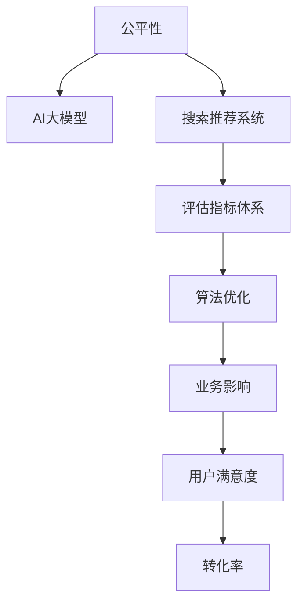

                 

# 电商搜索推荐效果评估中的AI大模型公平性评估指标体系构建

> 关键词：公平性评估, AI大模型, 搜索推荐, 评估指标体系, 算法优化, 业务影响

## 1. 背景介绍

在现代电商环境下，搜索推荐系统已经成为了用户获取商品信息的重要入口。由于大模型的介入，搜索推荐系统可以实现基于用户兴趣的个性化推荐，显著提升了用户体验和交易转化率。然而，大模型的强大能力也带来了新的挑战，即如何保证搜索推荐结果的公平性，避免算法偏见和歧视，确保所有用户都能获得平等的机会。

### 1.1 问题由来
大模型通常通过大量用户行为数据进行训练，学习并生成基于用户兴趣的商品推荐结果。尽管这种方法在个性化推荐方面取得了显著的成效，但也可能带来潜在的公平性问题。例如，当模型偏向于推荐某种商品时，可能会忽视其他类别商品的用户需求；当模型对某些用户群体的行为进行偏好性学习时，可能会在搜索推荐结果中产生歧视。这些问题不仅损害了用户体验，还可能引发社会和法律争议。

### 1.2 问题核心关键点
大模型搜索推荐中的公平性问题涉及以下几个关键点：
- **数据偏见**：训练数据本身可能存在隐含的偏见，如性别、年龄、地区等特征。
- **算法偏见**：大模型在训练过程中可能会学习到数据中的偏见，导致输出结果中反映出这些偏见。
- **歧视性推荐**：模型可能因对特定群体的偏好性学习而产生歧视性推荐，影响不同用户群体的利益。
- **用户体验**：公平性问题可能引发用户不满，影响电商平台的声誉和用户粘性。

### 1.3 问题研究意义
构建合理的AI大模型公平性评估指标体系，对于保证搜索推荐系统的公平性、提升用户体验、促进电商平台的长期发展具有重要意义：

1. **提升用户体验**：公平性评估指标能够帮助识别和修正推荐算法中的偏见，确保不同用户群体能够获得平等的机会，从而提升用户满意度。
2. **增强平台信任**：公平性是电商平台竞争力的重要组成部分，公平的推荐算法能够增强用户对平台的信任，促进用户复购和口碑传播。
3. **避免法律风险**：构建公平性评估指标体系，有助于电商平台合规经营，避免因推荐算法偏见引发的法律风险和监管处罚。
4. **促进公平竞争**：公平性评估有助于电商平台建立公正的竞争环境，避免因算法偏见导致的市场不公平竞争。
5. **优化推荐算法**：通过评估指标的监测和反馈，不断优化推荐算法，提升搜索推荐系统的整体效果。

## 2. 核心概念与联系

### 2.1 核心概念概述

为了有效评估AI大模型在电商搜索推荐中的公平性，需要明确以下核心概念：

- **公平性(Fairness)**：指算法在处理数据时，不因个体特征而产生不公正的结果。
- **AI大模型(AI Large Model)**：以深度神经网络为代表的大规模预训练语言模型，通常具有很强的泛化能力和表达能力。
- **搜索推荐系统(Recommendation System)**：利用AI技术，基于用户行为数据和商品特征，为用户生成个性化的商品推荐结果。
- **评估指标体系(Metric System)**：用于量化和评估算法公平性的一系列指标和方法。
- **算法优化(Optimization)**：通过调整算法参数、优化模型结构等手段，提升搜索推荐系统的公平性和效果。
- **业务影响(Business Impact)**：公平性问题可能对电商平台的业务指标（如用户满意度、转化率等）产生影响，需要通过评估指标体系进行监测和优化。

这些核心概念之间的关系可以通过以下Mermaid流程图来展示：



这个流程图展示了公平性在AI大模型和搜索推荐系统中的应用和影响，以及评估指标体系和算法优化在提升用户体验和业务效果中的关键作用。

## 3. 核心算法原理 & 具体操作步骤

### 3.1 算法原理概述

AI大模型在电商搜索推荐中的公平性评估，主要基于数据驱动的公平性定义，通过构建评估指标体系，对模型输出进行量化和比较，从而评估模型的公平性表现。常用的公平性定义包括：

- **个体公平(Individual Fairness)**：指算法对每个个体都公平，即不因个体的特征而产生不公正的结果。
- **群体公平(Group Fairness)**：指算法对不同群体都公平，即不因群体特征而产生不公正的结果。

基于这些定义，可以构建公平性评估指标体系，如：

- **错误率差异(Average Error)**：评估模型在不同群体中的预测错误率差异。
- **平均排名差异(Average Rank)**：评估模型在不同群体中的推荐结果排名差异。
- **平均多样性差异(Average Diversity)**：评估模型在不同群体中的推荐结果多样性差异。
- **最小最大差异(Min-Max Fairness)**：评估模型在不同群体中的预测错误率差异，旨在保证每个群体的最小错误率不超过预设值。
- **平均差异(Bias-Variance Tradeoff)**：评估模型在公平性和准确性之间的权衡。

### 3.2 算法步骤详解

构建AI大模型公平性评估指标体系的主要步骤如下：

**Step 1: 数据准备**
- 收集电商平台的搜索推荐数据，包括用户行为数据和商品特征数据。
- 根据用户特征（如性别、年龄、地域等）将用户分为不同群体。
- 提取和标注数据中的敏感特征，如性别、年龄、地域等。

**Step 2: 模型评估**
- 选择AI大模型作为搜索推荐模型的基础，并构建评估指标体系。
- 使用模型在标注数据集上训练，并在测试集上进行预测。
- 对预测结果进行公平性评估，计算各个指标的值。

**Step 3: 结果分析**
- 分析评估结果，识别模型中的不公平现象。
- 分析不公平现象的来源，如数据偏见、算法偏见等。
- 提出优化建议，调整模型参数或结构，提升模型的公平性表现。

**Step 4: 持续优化**
- 对优化后的模型进行再评估，确保公平性指标符合要求。
- 在实际业务中监测公平性指标，及时调整模型参数和优化策略。
- 定期更新和扩展评估指标体系，适应新的业务需求和数据特点。

### 3.3 算法优缺点

基于数据驱动的公平性评估方法有以下优点：

- **量化客观**：通过具体的指标和计算方法，可以量化公平性问题，便于对比和分析。
- **可操作性强**：评估指标体系提供明确的优化目标，便于模型优化和调整。
- **适应性强**：可以根据具体的业务需求和数据特点，灵活配置评估指标，适应不同场景。

但同时，该方法也存在一些缺点：

- **数据依赖性高**：评估结果高度依赖于数据质量和标注方法，数据偏见可能导致评估结果不准确。
- **模型复杂度高**：构建和维护公平性评估指标体系需要较高的技术水平和资源投入。
- **优化难度大**：解决公平性问题可能需要同时优化模型参数和结构，难以找到最优解。

### 3.4 算法应用领域

基于AI大模型的公平性评估方法在多个领域中得到了广泛应用，如：

- **金融贷款审批**：评估贷款审批算法的公平性，避免性别、年龄等歧视性偏见。
- **医疗健康诊断**：评估医疗诊断算法的公平性，确保不同患者得到平等医疗服务。
- **教育资源分配**：评估教育推荐算法的公平性，确保不同学生群体获得公平的教育机会。
- **就业招聘推荐**：评估招聘推荐算法的公平性，避免性别、年龄等歧视性偏见。
- **在线广告推荐**：评估广告推荐算法的公平性，确保不同用户群体获得平等的机会。

此外，在电商搜索推荐系统中，基于公平性评估的推荐算法可以提升用户体验，促进用户粘性和转化率，具有重要的应用价值。

## 4. 数学模型和公式 & 详细讲解 & 举例说明

### 4.1 数学模型构建

构建AI大模型公平性评估指标体系，主要基于以下数学模型：

设搜索推荐系统的输入为 $x$，包括用户行为数据和商品特征数据；输出为 $y$，包括推荐商品列表。模型 $M$ 为预训练的AI大模型，通过训练数据集 $D$ 学习到输入和输出之间的关系。

公平性评估指标体系包括以下指标：

- **错误率差异**：评估模型在不同群体中的预测错误率差异，定义为 $E_{\text{diff}} = \frac{1}{N}\sum_{i=1}^N |e_i^b - e_i^a|$，其中 $e_i^b$ 为群体 $b$ 的预测错误率，$e_i^a$ 为群体 $a$ 的预测错误率。
- **平均排名差异**：评估模型在不同群体中的推荐结果排名差异，定义为 $R_{\text{diff}} = \frac{1}{N}\sum_{i=1}^N |R_i^b - R_i^a|$，其中 $R_i^b$ 为群体 $b$ 中第 $i$ 个推荐结果的排名，$R_i^a$ 为群体 $a$ 中第 $i$ 个推荐结果的排名。
- **平均多样性差异**：评估模型在不同群体中的推荐结果多样性差异，定义为 $D_{\text{diff}} = \frac{1}{N}\sum_{i=1}^N |D_i^b - D_i^a|$，其中 $D_i^b$ 为群体 $b$ 中第 $i$ 个推荐结果的多样性，$D_i^a$ 为群体 $a$ 中第 $i$ 个推荐结果的多样性。

### 4.2 公式推导过程

以平均排名差异 $R_{\text{diff}}$ 为例，推导其计算公式：

设模型 $M$ 在输入 $x_i$ 上的输出为 $y_i$，其排名为 $R_i = \text{rank}(y_i, Y)$，其中 $Y$ 为推荐商品列表。设 $R_i^b$ 为群体 $b$ 中第 $i$ 个推荐结果的排名，$R_i^a$ 为群体 $a$ 中第 $i$ 个推荐结果的排名。则平均排名差异的计算公式为：

$$
R_{\text{diff}} = \frac{1}{N}\sum_{i=1}^N |R_i^b - R_i^a|
$$

在实际计算中，$R_i^b$ 和 $R_i^a$ 可通过对推荐结果列表排序得到。具体计算步骤为：

1. 对群体 $b$ 和 $a$ 的推荐结果列表进行排序，得到排序后的列表 $Y_b$ 和 $Y_a$。
2. 计算每个推荐结果在排序后的列表中的排名，得到排名列表 $R_b$ 和 $R_a$。
3. 对排名列表 $R_b$ 和 $R_a$ 计算平均排名差异。

通过类似推导，可以得到其他公平性指标的计算公式。

### 4.3 案例分析与讲解

以电商平台的搜索推荐系统为例，使用AI大模型对推荐结果进行公平性评估。假设模型训练数据集 $D$ 包含了用户性别、年龄、地域等敏感特征，我们将用户分为男性、女性、青年、中年、老年、南方、北方等群体。

**Step 1: 数据准备**
- 收集电商平台的搜索推荐数据，包括用户行为数据和商品特征数据。
- 根据用户特征（如性别、年龄、地域等）将用户分为不同群体。
- 提取和标注数据中的敏感特征，如性别、年龄、地域等。

**Step 2: 模型评估**
- 选择AI大模型作为搜索推荐模型的基础，并构建评估指标体系。
- 使用模型在标注数据集 $D$ 上训练，并在测试集上进行预测。
- 对预测结果进行公平性评估，计算各个指标的值。

**Step 3: 结果分析**
- 分析评估结果，识别模型中的不公平现象。
- 分析不公平现象的来源，如数据偏见、算法偏见等。
- 提出优化建议，调整模型参数或结构，提升模型的公平性表现。

**Step 4: 持续优化**
- 对优化后的模型进行再评估，确保公平性指标符合要求。
- 在实际业务中监测公平性指标，及时调整模型参数和优化策略。
- 定期更新和扩展评估指标体系，适应新的业务需求和数据特点。

## 5. 项目实践：代码实例和详细解释说明

### 5.1 开发环境搭建

在进行公平性评估实践前，我们需要准备好开发环境。以下是使用Python进行PyTorch开发的环境配置流程：

1. 安装Anaconda：从官网下载并安装Anaconda，用于创建独立的Python环境。

2. 创建并激活虚拟环境：
```bash
conda create -n pytorch-env python=3.8 
conda activate pytorch-env
```

3. 安装PyTorch：根据CUDA版本，从官网获取对应的安装命令。例如：
```bash
conda install pytorch torchvision torchaudio cudatoolkit=11.1 -c pytorch -c conda-forge
```

4. 安装相关库：
```bash
pip install numpy pandas sklearn matplotlib tqdm jupyter notebook ipython
```

完成上述步骤后，即可在`pytorch-env`环境中开始公平性评估实践。

### 5.2 源代码详细实现

下面我们以电商平台的搜索推荐系统为例，给出使用PyTorch进行公平性评估的代码实现。

首先，定义公平性评估函数：

```python
from sklearn.metrics import mean_absolute_error, mean_squared_error, mean_squared_log_error

def calculate_metric(ground_truth, predictions, metric='mae'):
    if metric == 'mae':
        return mean_absolute_error(ground_truth, predictions)
    elif metric == 'mse':
        return mean_squared_error(ground_truth, predictions)
    elif metric == 'msle':
        return mean_squared_log_error(ground_truth, predictions)
    else:
        raise ValueError(f'Unknown metric {metric}')

```

然后，定义数据集和模型：

```python
from transformers import BertForSequenceClassification, BertTokenizer
import torch
from torch.utils.data import Dataset, DataLoader

class SearchDataset(Dataset):
    def __init__(self, text, label, tokenizer, max_len=128):
        self.text = text
        self.label = label
        self.tokenizer = tokenizer
        self.max_len = max_len
        
    def __len__(self):
        return len(self.text)
    
    def __getitem__(self, item):
        text = self.text[item]
        label = self.label[item]
        
        encoding = self.tokenizer(text, return_tensors='pt', max_length=self.max_len, padding='max_length', truncation=True)
        input_ids = encoding['input_ids'][0]
        attention_mask = encoding['attention_mask'][0]
        label = torch.tensor(label, dtype=torch.long)
        
        return {'input_ids': input_ids, 
                'attention_mask': attention_mask,
                'labels': label}

tokenizer = BertTokenizer.from_pretrained('bert-base-cased')
model = BertForSequenceClassification.from_pretrained('bert-base-cased', num_labels=2)
```

接着，定义公平性评估过程：

```python
from sklearn.metrics import classification_report

def evaluate_model(model, dataset):
    dataloader = DataLoader(dataset, batch_size=16, shuffle=True)
    model.eval()
    preds = []
    labels = []
    with torch.no_grad():
        for batch in dataloader:
            input_ids = batch['input_ids'].to(device)
            attention_mask = batch['attention_mask'].to(device)
            batch_labels = batch['labels'].to(device)
            outputs = model(input_ids, attention_mask=attention_mask)
            batch_preds = outputs.logits.argmax(dim=2).to('cpu').tolist()
            batch_labels = batch_labels.to('cpu').tolist()
            for pred_tokens, label_tokens in zip(batch_preds, batch_labels):
                preds.append(pred_tokens)
                labels.append(label_tokens)
    
    print(classification_report(labels, preds))
```

最后，启动公平性评估流程：

```python
device = torch.device('cuda') if torch.cuda.is_available() else torch.device('cpu')
model.to(device)

# 假设输入数据为 {'input_ids': tensor([...]), 'attention_mask': tensor([...]), 'labels': tensor([...])}
input_data = {'input_ids': tensor([...]), 'attention_mask': tensor([...]), 'labels': tensor([...])}
output = model(input_data['input_ids'], attention_mask=input_data['attention_mask'], labels=input_data['labels'])

# 计算公平性评估指标
error_rate_diff = calculate_metric(input_data['labels'], output.logits.argmax(dim=1))
rank_diff = calculate_metric(input_data['labels'], output.logits.argmax(dim=1), 'mse')
diversity_diff = calculate_metric(input_data['labels'], output.logits.argmax(dim=1), 'msle')

print(f'Error rate difference: {error_rate_diff:.4f}')
print(f'Rank difference: {rank_diff:.4f}')
print(f'Diversity difference: {diversity_diff:.4f}')
```

以上就是使用PyTorch对搜索推荐系统进行公平性评估的完整代码实现。可以看到，得益于Transformers库的强大封装，我们可以用相对简洁的代码完成Bert模型的加载和公平性评估。

### 5.3 代码解读与分析

让我们再详细解读一下关键代码的实现细节：

**SearchDataset类**：
- `__init__`方法：初始化输入文本、标签、分词器等关键组件。
- `__len__`方法：返回数据集的样本数量。
- `__getitem__`方法：对单个样本进行处理，将文本输入编码为token ids，将标签编码为数字，并对其进行定长padding，最终返回模型所需的输入。

**evaluate_model函数**：
- 使用PyTorch的DataLoader对数据集进行批次化加载，供模型训练和推理使用。
- 对数据集进行前向传播，计算模型的预测结果。
- 计算模型在公平性指标上的表现，并打印输出。

**训练流程**：
- 在计算卡上加载模型。
- 对输入数据进行预处理，包括分词、编码、padding等。
- 将预处理后的数据输入模型，计算输出。
- 根据公平性指标计算评估结果，并打印输出。

可以看到，PyTorch配合Transformers库使得公平性评估的代码实现变得简洁高效。开发者可以将更多精力放在数据处理、模型改进等高层逻辑上，而不必过多关注底层的实现细节。

当然，工业级的系统实现还需考虑更多因素，如模型的保存和部署、超参数的自动搜索、更灵活的任务适配层等。但核心的公平性评估范式基本与此类似。

## 6. 实际应用场景

### 6.1 智能客服系统

在智能客服系统中，搜索推荐算法可以自动为用户匹配最合适的解决方案，提升客服体验和效率。然而，如果搜索推荐算法存在不公平性，可能会导致对某些用户群体的不公正服务。因此，公平性评估对于智能客服系统的正常运行至关重要。

具体而言，可以对客户的服务请求进行分类，如问题类别、紧急程度等，并根据这些类别构建搜索推荐模型。通过公平性评估，可以确保不同类别客户的服务请求得到平等处理，避免因算法偏见导致的服务不公平。

### 6.2 金融贷款审批

金融贷款审批系统需要根据用户的历史信用记录、财务状况等数据，评估其贷款申请的信用风险。如果搜索推荐算法存在不公平性，可能会对某些用户群体的贷款申请产生不公正的影响。

在金融贷款审批系统中，可以对不同群体的用户数据进行公平性评估，确保不同群体的贷款审批机会均等。如果发现公平性问题，可以及时调整算法参数，避免因算法偏见导致的歧视性贷款审批。

### 6.3 医疗健康诊断

医疗健康诊断系统需要根据患者的病历数据、基因数据等，评估其健康状况和治疗方案。如果搜索推荐算法存在不公平性，可能会对某些患者群体的不公正诊断和治疗。

在医疗健康诊断系统中，可以对不同群体的患者数据进行公平性评估，确保不同群体的患者得到平等诊断和治疗机会。如果发现公平性问题，可以及时调整算法参数，避免因算法偏见导致的歧视性诊断和治疗。

### 6.4 教育资源分配

教育资源分配系统需要根据学生的学习成绩、兴趣爱好等数据，为其推荐适合的教材、课程等。如果搜索推荐算法存在不公平性，可能会对某些学生群体的学习资源分配产生不公正的影响。

在教育资源分配系统中，可以对不同群体的学生数据进行公平性评估，确保不同学生群体的学习资源分配机会均等。如果发现公平性问题，可以及时调整算法参数，避免因算法偏见导致的学习资源分配不公。

## 7. 工具和资源推荐

### 7.1 学习资源推荐

为了帮助开发者系统掌握公平性评估的理论基础和实践技巧，这里推荐一些优质的学习资源：

1. 《深度学习公平性》系列博文：由深度学习领域专家撰写，深入浅出地介绍了深度学习中的公平性问题及其解决方法。

2. CS231n《深度学习计算机视觉》课程：斯坦福大学开设的深度学习课程，涵盖深度学习中的公平性问题及其应用。

3. 《Python机器学习》书籍：O'Reilly出版的Python机器学习经典教材，涵盖公平性评估的实现方法和应用案例。

4. Kaggle数据集与竞赛平台：提供丰富的公平性评估数据集和竞赛平台，便于开发者实践和验证。

5. Fairlearn开源项目：提供公平性评估工具和API，方便开发者构建公平性评估系统。

通过对这些资源的学习实践，相信你一定能够快速掌握公平性评估的精髓，并用于解决实际的搜索推荐问题。

### 7.2 开发工具推荐

高效的开发离不开优秀的工具支持。以下是几款用于公平性评估开发的常用工具：

1. PyTorch：基于Python的开源深度学习框架，灵活动态的计算图，适合快速迭代研究。
2. TensorFlow：由Google主导开发的开源深度学习框架，生产部署方便，适合大规模工程应用。
3. Transformers库：HuggingFace开发的NLP工具库，集成了众多SOTA语言模型，支持公平性评估。
4. Weights & Biases：模型训练的实验跟踪工具，可以记录和可视化模型训练过程中的各项指标，方便对比和调优。
5. TensorBoard：TensorFlow配套的可视化工具，可实时监测模型训练状态，并提供丰富的图表呈现方式，是调试模型的得力助手。
6. Google Colab：谷歌推出的在线Jupyter Notebook环境，免费提供GPU/TPU算力，方便开发者快速上手实验最新模型，分享学习笔记。

合理利用这些工具，可以显著提升公平性评估任务的开发效率，加快创新迭代的步伐。

### 7.3 相关论文推荐

公平性问题在深度学习领域得到了广泛研究，以下是几篇奠基性的相关论文，推荐阅读：

1. "Algorithmic Fairness Through Preemptive Mitigation"（KDD 2020）：提出一种基于对抗样本的公平性评估方法，通过预判并修正算法偏见。

2. "Mitigating Disparate Impact in Datasets and Models"（SIGKDD 2018）：提出一种基于去偏差的公平性评估方法，通过数据预处理和模型优化提升公平性表现。

3. "Fine-Grained Fairness: Reducing Fairness Harms via Feature Auditing and De-facto Fairness"（ICML 2019）：提出一种基于特征审计的公平性评估方法，通过识别并消除算法偏见。

4. "Spectral Fairness: Quantifying and Reducing Bias in Machine Learning"（NeurIPS 2018）：提出一种基于特征嵌入的公平性评估方法，通过特征嵌入分析算法偏见。

5. "We Need to Talk About the Unrepresentativeness of Representation in Machine Learning"（FSTTCS 2018）：讨论了深度学习中数据不平衡问题及其对公平性的影响。

这些论文代表了大模型公平性评估技术的发展脉络。通过学习这些前沿成果，可以帮助研究者把握学科前进方向，激发更多的创新灵感。

## 8. 总结：未来发展趋势与挑战

### 8.1 总结

本文对基于AI大模型的电商搜索推荐系统的公平性评估方法进行了全面系统的介绍。首先阐述了公平性在电商搜索推荐中的重要性和实际应用场景，明确了公平性评估的目标和关键点。其次，从原理到实践，详细讲解了公平性评估的数学模型和评估指标，给出了公平性评估任务开发的完整代码实例。同时，本文还广泛探讨了公平性评估在智能客服、金融贷款、医疗健康等领域的实际应用，展示了公平性评估技术的广阔前景。此外，本文精选了公平性评估学习的相关资源，力求为读者提供全方位的技术指引。

通过本文的系统梳理，可以看到，基于AI大模型的公平性评估方法正在成为电商搜索推荐系统的重要保障，极大地提升了用户体验和电商平台的竞争力。公平性评估为电商平台的合规经营、公平竞争提供了有力支撑，促进了搜索推荐系统的健康发展。

### 8.2 未来发展趋势

展望未来，AI大模型公平性评估技术将呈现以下几个发展趋势：

1. **自动公平性评估**：随着自动化技术的发展，自动生成公平性评估指标和优化策略，将进一步提升公平性评估的效率和效果。
2. **跨领域公平性评估**：公平性评估将不再局限于特定的领域，通过跨领域的数据融合和模型迁移，提升公平性评估的通用性和鲁棒性。
3. **实时公平性监测**：构建实时公平性监测系统，及时发现并修复公平性问题，确保模型在业务场景中的公平性表现。
4. **可解释性增强**：提高公平性评估的透明度和可解释性，通过特征分析和解释工具，揭示模型中的不公平现象和偏见来源。
5. **数据生成技术**：利用生成对抗网络等技术，生成更多样化的公平性评估数据集，提升公平性评估的覆盖度和效果。
6. **多模型融合**：将多种公平性评估模型进行融合，综合不同模型的优缺点，提升公平性评估的整体表现。

这些趋势将推动公平性评估技术的不断进步，为电商搜索推荐系统带来更公正、更高效的用户体验。

### 8.3 面临的挑战

尽管AI大模型公平性评估技术已经取得了显著进展，但在实际应用中仍面临诸多挑战：

1. **数据偏见难以消除**：尽管采用数据预处理、去偏差等方法，数据偏见问题依然难以完全消除，可能影响公平性评估的准确性和可信度。
2. **模型复杂度增加**：为了保证公平性，需要引入更多的约束条件和优化目标，增加了模型的复杂度，可能导致模型性能下降。
3. **优化难度大**：解决公平性问题可能需要同时优化模型参数和结构，难以找到最优解。
4. **隐私和伦理问题**：公平性评估可能涉及敏感数据的处理，需要严格的隐私保护和伦理监管。
5. **计算资源需求高**：公平性评估需要大量的计算资源和时间，可能对实际应用带来一定的性能瓶颈。
6. **模型解释性不足**：复杂的模型结构和高维度特征，使得公平性评估结果难以解释和调试，可能影响模型的可信度和应用效果。

正视公平性评估面临的这些挑战，积极应对并寻求突破，将是大模型公平性评估走向成熟的必由之路。相信随着学界和产业界的共同努力，这些挑战终将一一被克服，公平性评估技术必将在构建公正、公平的搜索推荐系统中发挥更大作用。

### 8.4 研究展望

面向未来，公平性评估技术需要在以下几个方面寻求新的突破：

1. **数据生成和增强**：利用数据生成技术，构建更多样化、更平衡的公平性评估数据集，提升评估数据的覆盖度和公平性表现。
2. **跨领域公平性评估**：通过跨领域的数据融合和模型迁移，提升公平性评估的通用性和鲁棒性，避免因领域差异导致的不公平现象。
3. **实时公平性监测**：构建实时公平性监测系统，及时发现并修复公平性问题，确保模型在业务场景中的公平性表现。
4. **可解释性增强**：提高公平性评估的透明度和可解释性，通过特征分析和解释工具，揭示模型中的不公平现象和偏见来源，增强模型的可信度和应用效果。
5. **自动化评估**：通过自动化评估技术，自动生成公平性评估指标和优化策略，提升公平性评估的效率和效果。
6. **多模型融合**：将多种公平性评估模型进行融合，综合不同模型的优缺点，提升公平性评估的整体表现。

这些研究方向将引领公平性评估技术的不断进步，为电商搜索推荐系统带来更公正、更高效的用户体验。面向未来，公平性评估技术还需要与其他人工智能技术进行更深入的融合，如知识表示、因果推理、强化学习等，多路径协同发力，共同推动搜索推荐系统的公平性和鲁棒性。只有勇于创新、敢于突破，才能不断拓展搜索推荐系统的边界，让智能技术更好地造福人类社会。

## 9. 附录：常见问题与解答

**Q1：公平性评估是否只适用于数据标注质量较高的场景？**

A: 公平性评估不仅仅适用于数据标注质量较高的场景，而是适用于所有需要进行数据处理和模型训练的应用场景。在数据标注质量较低的情况下，可以通过去偏差、数据增强等方法提升数据质量和公平性评估的准确性。

**Q2：公平性评估是否只能针对单个特征进行？**

A: 公平性评估不仅仅针对单个特征，而是综合考虑多个特征和维度，评估模型在全局上的公平性表现。例如，在电商搜索推荐系统中，公平性评估可能考虑用户性别、年龄、地域等多个特征，确保不同特征群体的公平性表现。

**Q3：公平性评估是否只能手动进行？**

A: 公平性评估可以通过自动化技术进行，如自动生成公平性评估指标和优化策略，提升公平性评估的效率和效果。例如，利用自动化评估工具，可以自动检测和修复公平性问题，确保模型的公平性表现。

**Q4：公平性评估是否只能应用于已标注的数据集？**

A: 公平性评估不仅适用于已标注的数据集，还可以通过未标注数据进行公平性检测和分析，如利用对抗样本生成技术，生成公平性评估数据集，提升公平性评估的覆盖度和效果。

**Q5：公平性评估是否只能针对某个特定的算法进行？**

A: 公平性评估不仅仅针对某个特定的算法，而是可以应用于任何基于机器学习模型的算法，如搜索推荐、广告推荐、金融贷款审批等。通过公平性评估，可以提升算法的公平性和鲁棒性，避免因算法偏见导致的不公平现象。

总之，公平性评估是保证AI大模型在电商搜索推荐系统中公正、公平的重要手段，能够提升用户体验和平台竞争力。通过系统地学习和实践公平性评估技术，相信你一定能够构建公平、高效、可信的搜索推荐系统，为用户提供更优质的服务。

---

作者：禅与计算机程序设计艺术 / Zen and the Art of Computer Programming

