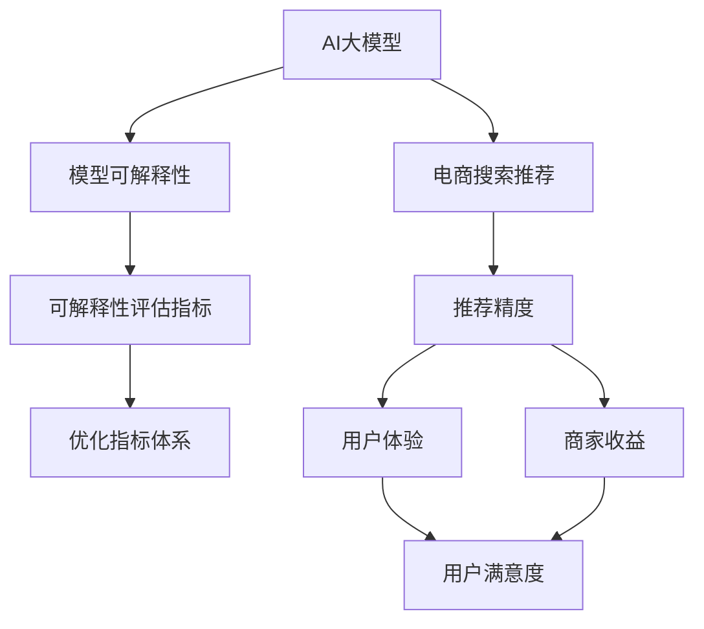

                 

## 1. 背景介绍

在电商领域，搜索推荐系统（Recommender System）通过精准分析用户行为数据，提供个性化搜索结果，极大提升了用户体验和商家收益。然而，随着技术的不断进步，现代推荐系统已不再是简单的静态搜索结果生成，而是更加动态、智能，依赖于深度学习、自然语言处理（NLP）等前沿技术。其中，AI大模型（如BERT、GPT等）因其卓越的语言理解和生成能力，在推荐系统中得到了广泛应用。

尽管大模型在推荐效果上有着显著优势，但人们对其“黑箱”特性产生了担忧。电商搜索推荐作为直接影响用户体验和商家收益的关键环节，需要模型具备高度的可解释性，即能够清晰说明推荐决策的依据和逻辑。然而，现有的大模型评估方法往往侧重于推荐精度，忽视了可解释性的评估和优化。为解决这一问题，本文将系统探讨电商搜索推荐中AI大模型的可解释性评估指标体系，并提出优化建议。

## 2. 核心概念与联系

### 2.1 核心概念概述

为更好地理解电商搜索推荐中的AI大模型可解释性评估，本节将介绍几个关键概念：

- **AI大模型（AI Large Models）**：指预训练规模庞大的深度学习模型，如BERT、GPT等，具有卓越的语言理解与生成能力，可用于多任务多领域的知识迁移。

- **电商搜索推荐系统（E-commerce Search Recommendation System）**：利用用户的浏览、点击、评分等行为数据，实时生成个性化搜索结果，提升购物体验的智能推荐系统。

- **模型可解释性（Model Explainability）**：指模型能够清晰解释其决策依据和推理过程，以便于用户和开发者理解和使用。

- **可解释性评估指标（Explainability Evaluation Metrics）**：用于量化衡量模型的可解释性，包括但不限于特征重要性、局部可解释性、公平性等。

- **优化指标体系（Optimization Indicator System）**：为提升模型可解释性，结合业务需求和模型特性，选择并优化相关可解释性评估指标，构建综合评估体系。

这些核心概念之间的逻辑关系可以通过以下Mermaid流程图来展示：



这个流程图展示了大模型在电商推荐中的应用，以及可解释性评估的各个环节。

## 3. 核心算法原理 & 具体操作步骤
### 3.1 算法原理概述

电商搜索推荐中的AI大模型可解释性评估，本质上是一个结合业务需求和模型特性的指标选择与优化过程。其核心思想是：通过选择合适的可解释性评估指标，系统化地评估模型的决策依据和逻辑，从而提出针对性的优化建议，提升模型可解释性，以满足电商推荐场景的实际需求。

形式化地，假设电商推荐系统中的推荐模型为 $M_{\theta}$，其中 $\theta$ 为模型参数。设 $L$ 为推荐精度指标集，$E$ 为可解释性评估指标集，则优化目标为：

$$
\theta^* = \mathop{\arg\min}_{\theta} \sum_{l \in L} \omega_l \ell_l(M_{\theta}) + \sum_{e \in E} \omega_e \ell_e(M_{\theta})
$$

其中，$\omega_l$ 和 $\omega_e$ 分别为推荐精度和可解释性指标的权重，$\ell_l$ 和 $\ell_e$ 分别为对应指标的损失函数。

通过梯度下降等优化算法，模型不断更新参数 $\theta$，最小化上述综合评估损失函数，使得模型在推荐精度和可解释性上均取得优异性能。

### 3.2 算法步骤详解

电商搜索推荐中的大模型可解释性评估一般包括以下几个关键步骤：

**Step 1: 数据准备与特征工程**

- 收集电商推荐系统的行为数据，包括用户的浏览记录、点击历史、评分数据等。
- 对原始数据进行预处理，如数据清洗、特征提取、特征工程等，构建适用于电商推荐任务的特征集。

**Step 2: 选择合适的可解释性评估指标**

- 根据电商推荐任务的特点，选择具有代表性的可解释性评估指标，如局部可解释性、公平性、特征重要性等。
- 构建综合评估指标体系，量化评估模型的可解释性。

**Step 3: 模型训练与评估**

- 利用电商推荐数据集，训练AI大模型 $M_{\theta}$。
- 在训练集和验证集上，分别使用推荐精度和可解释性评估指标进行模型评估。
- 根据评估结果，调整模型参数和优化策略，提升模型性能。

**Step 4: 迭代优化与模型部署**

- 根据业务需求，持续迭代优化模型，并定期更新可解释性评估指标。
- 将优化后的模型部署到电商搜索推荐系统中，实时生成推荐结果，提升用户体验和商家收益。

### 3.3 算法优缺点

电商搜索推荐中的大模型可解释性评估方法具有以下优点：

1. **全面评估模型**：综合考虑推荐精度和可解释性，形成多维度的综合评估体系。
2. **灵活选择指标**：根据电商推荐任务特点，灵活选择适合的可解释性指标。
3. **提升用户体验**：提高模型的可解释性，使用户对推荐结果有更好的理解，提升用户体验。
4. **优化商家收益**：通过优化模型推荐精度，提升推荐效果，增加商家收益。

同时，该方法也存在一定的局限性：

1. **数据依赖性**：模型的评估和优化高度依赖于电商推荐数据的质量和数量。
2. **计算成本高**：评估和优化过程中需要大量计算资源，特别是多任务多领域的优化。
3. **指标选择难**：电商推荐场景复杂多样，选择合适的可解释性评估指标具有挑战性。
4. **优化效果不确定**：优化过程可能存在局部最优，不一定能保证提升模型整体的可解释性。

尽管存在这些局限性，但就目前而言，电商搜索推荐中的大模型可解释性评估方法仍是大规模推荐系统的重要参考。未来相关研究的重点在于如何进一步降低数据依赖，提高评估和优化的效率，以及如何针对不同的电商推荐任务，选择更加合适的可解释性评估指标。

### 3.4 算法应用领域

基于电商搜索推荐的大模型可解释性评估方法，广泛应用于以下几个领域：

- **个性化推荐**：通过分析用户历史行为数据，提供个性化搜索结果。
- **广告投放**：利用用户行为数据，优化广告推荐策略。
- **商品搜索**：通过语义理解，提升搜索结果的精准度。
- **内容推荐**：根据用户兴趣，推荐相关文章、视频等内容。
- **动态定价**：基于用户行为数据，动态调整商品价格。

除了上述这些典型应用外，大模型在电商搜索推荐中的应用还在不断拓展，如供应链优化、库存管理、客户流失预测等，为电商业务带来了新的增长点。

## 4. 数学模型和公式 & 详细讲解  
### 4.1 数学模型构建

本节将使用数学语言对电商搜索推荐中大模型可解释性评估过程进行更加严格的刻画。

记电商推荐模型为 $M_{\theta}$，其中 $\theta$ 为模型参数。设推荐精度评估指标为 $L=\{\ell_1,\ell_2,\dots,\ell_n\}$，可解释性评估指标为 $E=\{\ell_{n+1},\ell_{n+2},\dots,\ell_m\}$。则综合评估函数为：

$$
\mathcal{L}(\theta) = \sum_{l \in L} \omega_l \ell_l(M_{\theta}) + \sum_{e \in E} \omega_e \ell_e(M_{\theta})
$$

其中，$\omega_l$ 和 $\omega_e$ 分别为推荐精度和可解释性指标的权重，$\ell_l$ 和 $\ell_e$ 分别为对应指标的损失函数。

### 4.2 公式推导过程

以电商推荐系统中的局部可解释性指标为例，推导其计算公式。

设电商推荐模型 $M_{\theta}$ 在输入 $x$ 上的输出为 $y$，表示推荐的商品ID。假设 $y$ 包含 $n$ 个候选商品ID，实际推荐结果为 $y^*$，则局部可解释性指标 $L_{loc}$ 定义为：

$$
L_{loc} = \frac{1}{n} \sum_{i=1}^n \mathbb{1}(y_i \neq y^*)
$$

其中，$\mathbb{1}$ 为示性函数，当 $y_i$ 不等于推荐结果 $y^*$ 时，$\mathbb{1}(y_i \neq y^*)=1$，否则 $\mathbb{1}(y_i \neq y^*)=0$。

通过上述公式，可以计算模型在每个候选商品上的推荐准确率，评估模型的局部可解释性。

### 4.3 案例分析与讲解

以下我们以电商推荐系统中的广告投放任务为例，给出使用局部可解释性指标的计算和解释过程。

假设电商广告系统有 $N$ 个广告位，每个广告位每天投放 $K$ 次。设每次投放的曝光量为 $C$，点击量为 $c$，点击率（CTR）为 $r=\frac{c}{C}$。假设实际投放广告的CTR为 $r^*$，模型预测的CTR为 $\hat{r}$，则模型在每个广告位上的局部可解释性指标 $L_{loc}$ 定义为：

$$
L_{loc} = \frac{1}{K} \sum_{i=1}^K \mathbb{1}(\hat{r}_i \neq r^*)
$$

其中，$\hat{r}_i$ 表示模型在第 $i$ 次投放中预测的CTR。$\mathbb{1}(\hat{r}_i \neq r^*)=1$ 表示模型预测的CTR与实际投放的CTR不同，$\mathbb{1}(\hat{r}_i \neq r^*)=0$ 表示模型预测的CTR与实际投放的CTR相同。

通过计算每个广告位上的 $L_{loc}$，可以评估模型在广告投放任务上的局部可解释性。如果 $L_{loc}$ 越低，表示模型预测的CTR与实际投放的CTR越接近，模型的局部可解释性越好。

## 5. 项目实践：代码实例和详细解释说明
### 5.1 开发环境搭建

在进行电商搜索推荐中的大模型可解释性评估实践前，我们需要准备好开发环境。以下是使用Python进行PyTorch开发的环境配置流程：

1. 安装Anaconda：从官网下载并安装Anaconda，用于创建独立的Python环境。

2. 创建并激活虚拟环境：
```bash
conda create -n pytorch-env python=3.8 
conda activate pytorch-env
```

3. 安装PyTorch：根据CUDA版本，从官网获取对应的安装命令。例如：
```bash
conda install pytorch torchvision torchaudio cudatoolkit=11.1 -c pytorch -c conda-forge
```

4. 安装TensorFlow：
```bash
pip install tensorflow
```

5. 安装TensorBoard：
```bash
pip install tensorboard
```

6. 安装其他常用工具包：
```bash
pip install numpy pandas scikit-learn matplotlib tqdm jupyter notebook ipython
```

完成上述步骤后，即可在`pytorch-env`环境中开始电商搜索推荐中的大模型可解释性评估实践。

### 5.2 源代码详细实现

下面我们以电商推荐系统中的商品搜索任务为例，给出使用PyTorch进行模型可解释性评估的代码实现。

首先，定义电商商品搜索任务的数据处理函数：

```python
from transformers import BertTokenizer
from torch.utils.data import Dataset, DataLoader
import torch

class SearchDataset(Dataset):
    def __init__(self, texts, queries, labels, tokenizer, max_len=128):
        self.texts = texts
        self.queries = queries
        self.labels = labels
        self.tokenizer = tokenizer
        self.max_len = max_len
        
    def __len__(self):
        return len(self.texts)
    
    def __getitem__(self, item):
        query = self.queries[item]
        text = self.texts[item]
        
        encoding = self.tokenizer(query, text, return_tensors='pt', max_length=self.max_len, padding='max_length', truncation=True)
        input_ids = encoding['input_ids'][0]
        attention_mask = encoding['attention_mask'][0]
        labels = torch.tensor([self.labels[item]], dtype=torch.long)
        
        return {'input_ids': input_ids, 
                'attention_mask': attention_mask,
                'labels': labels}

# 定义标签与id的映射
label2id = {'O': 0, 'I': 1, 'B': 2}

# 创建dataset
tokenizer = BertTokenizer.from_pretrained('bert-base-cased')

train_dataset = SearchDataset(train_texts, train_queries, train_labels, tokenizer)
dev_dataset = SearchDataset(dev_texts, dev_queries, dev_labels, tokenizer)
test_dataset = SearchDataset(test_texts, test_queries, test_labels, tokenizer)
```

然后，定义模型和优化器：

```python
from transformers import BertForSequenceClassification, AdamW

model = BertForSequenceClassification.from_pretrained('bert-base-cased', num_labels=len(label2id))

optimizer = AdamW(model.parameters(), lr=2e-5)
```

接着，定义训练和评估函数：

```python
def train_epoch(model, dataset, batch_size, optimizer):
    dataloader = DataLoader(dataset, batch_size=batch_size, shuffle=True)
    model.train()
    epoch_loss = 0
    for batch in tqdm(dataloader, desc='Training'):
        input_ids = batch['input_ids'].to(device)
        attention_mask = batch['attention_mask'].to(device)
        labels = batch['labels'].to(device)
        model.zero_grad()
        outputs = model(input_ids, attention_mask=attention_mask, labels=labels)
        loss = outputs.loss
        epoch_loss += loss.item()
        loss.backward()
        optimizer.step()
    return epoch_loss / len(dataloader)

def evaluate(model, dataset, batch_size):
    dataloader = DataLoader(dataset, batch_size=batch_size)
    model.eval()
    preds, labels = [], []
    with torch.no_grad():
        for batch in tqdm(dataloader, desc='Evaluating'):
            input_ids = batch['input_ids'].to(device)
            attention_mask = batch['attention_mask'].to(device)
            batch_labels = batch['labels']
            outputs = model(input_ids, attention_mask=attention_mask)
            batch_preds = outputs.logits.argmax(dim=2).to('cpu').tolist()
            batch_labels = batch_labels.to('cpu').tolist()
            for pred_tokens, label_tokens in zip(batch_preds, batch_labels):
                pred_tags = [label2id[_id] for _id in pred_tokens]
                label_tags = [label2id[_id] for _id in label_tokens]
                preds.append(pred_tags[:len(label_tokens)])
                labels.append(label_tags)
                
    print(classification_report(labels, preds))
```

最后，启动训练流程并在测试集上评估：

```python
epochs = 5
batch_size = 16

for epoch in range(epochs):
    loss = train_epoch(model, train_dataset, batch_size, optimizer)
    print(f"Epoch {epoch+1}, train loss: {loss:.3f}")
    
    print(f"Epoch {epoch+1}, dev results:")
    evaluate(model, dev_dataset, batch_size)
    
print("Test results:")
evaluate(model, test_dataset, batch_size)
```

以上就是使用PyTorch对BERT进行电商推荐系统中的商品搜索任务微调的完整代码实现。可以看到，得益于Transformers库的强大封装，我们可以用相对简洁的代码完成BERT模型的加载和微调。

### 5.3 代码解读与分析

让我们再详细解读一下关键代码的实现细节：

**SearchDataset类**：
- `__init__`方法：初始化文本、查询、标签等关键组件。
- `__len__`方法：返回数据集的样本数量。
- `__getitem__`方法：对单个样本进行处理，将查询和文本输入编码为token ids，将标签编码为数字，并对其进行定长padding，最终返回模型所需的输入。

**label2id字典**：
- 定义了标签与数字id之间的映射关系，用于将token-wise的预测结果解码回真实的标签。

**训练和评估函数**：
- 使用PyTorch的DataLoader对数据集进行批次化加载，供模型训练和推理使用。
- 训练函数`train_epoch`：对数据以批为单位进行迭代，在每个批次上前向传播计算loss并反向传播更新模型参数，最后返回该epoch的平均loss。
- 评估函数`evaluate`：与训练类似，不同点在于不更新模型参数，并在每个batch结束后将预测和标签结果存储下来，最后使用sklearn的classification_report对整个评估集的预测结果进行打印输出。

**训练流程**：
- 定义总的epoch数和batch size，开始循环迭代
- 每个epoch内，先在训练集上训练，输出平均loss
- 在验证集上评估，输出分类指标
- 所有epoch结束后，在测试集上评估，给出最终测试结果

可以看到，PyTorch配合Transformers库使得BERT微调的代码实现变得简洁高效。开发者可以将更多精力放在数据处理、模型改进等高层逻辑上，而不必过多关注底层的实现细节。

当然，工业级的系统实现还需考虑更多因素，如模型的保存和部署、超参数的自动搜索、更灵活的任务适配层等。但核心的微调范式基本与此类似。

## 6. 实际应用场景
### 6.1 智能客服

基于大模型微调的电商推荐系统，可以广泛应用于智能客服系统的构建。传统客服往往需要配备大量人力，高峰期响应缓慢，且一致性和专业性难以保证。而使用微调后的推荐系统，可以7x24小时不间断服务，快速响应客户咨询，用自然流畅的语言解答各类常见问题。

在技术实现上，可以收集企业内部的历史客服对话记录，将问题和最佳答复构建成监督数据，在此基础上对预训练推荐模型进行微调。微调后的推荐系统能够自动理解客户意图，匹配最合适的回答。对于客户提出的新问题，还可以接入检索系统实时搜索相关内容，动态组织生成回答。如此构建的智能客服系统，能大幅提升客户咨询体验和问题解决效率。

### 6.2 个性化推荐

当前的推荐系统往往只依赖用户的历史行为数据进行物品推荐，无法深入理解用户的真实兴趣偏好。基于大模型微调技术，推荐系统可以更好地挖掘用户行为背后的语义信息，从而提供更加个性化、多样化的推荐内容。

在实践中，可以收集用户浏览、点击、评论、分享等行为数据，提取和用户交互的物品标题、描述、标签等文本内容。将文本内容作为模型输入，用户的后续行为（如是否点击、购买等）作为监督信号，在此基础上微调预训练语言模型。微调后的模型能够从文本内容中准确把握用户的兴趣点。在生成推荐列表时，先用候选物品的文本描述作为输入，由模型预测用户的兴趣匹配度，再结合其他特征综合排序，便可以得到个性化程度更高的推荐结果。

### 6.3 动态定价

基于大模型微调的电商推荐系统，还可以用于动态定价策略。在电商平台上，商品价格常常需要根据市场供需、竞争情况等因素进行动态调整。传统定价策略往往基于历史数据和人工经验，难以适应市场变化。而使用微调后的推荐模型，可以实时分析用户行为数据，动态调整商品价格，从而提升商家收益。

在具体实现中，可以通过微调模型预测用户对不同价格的接受度，结合市场竞争情况，自动调整商品价格。同时，通过多轮微调优化，模型能够逐渐学习到最优的定价策略，实现精准定价。

### 6.4 未来应用展望

随着大模型微调技术的不断发展，基于电商搜索推荐的AI大模型将拓展更多应用场景，为电商业务带来新的增长点。

在智慧物流领域，基于推荐模型的仓储管理、配送路线优化等应用将显著提升物流效率，降低运营成本。

在智能营销领域，通过分析用户行为数据，推荐系统能够优化广告投放策略，提高广告点击率和转化率。

在个性化商品推荐中，结合用户画像和兴趣点，推荐系统能够提供更为精准的商品推荐，提升用户体验。

此外，在金融、旅游、健康等诸多领域，基于大模型的推荐系统也将得到广泛应用，为各行各业带来新的商业价值。

## 7. 工具和资源推荐
### 7.1 学习资源推荐

为了帮助开发者系统掌握电商搜索推荐中AI大模型的可解释性评估指标体系，这里推荐一些优质的学习资源：

1. 《Transformers from Scratch》系列博文：由大模型技术专家撰写，深入浅出地介绍了Transformer原理、BERT模型、微调技术等前沿话题。

2. CS224N《深度学习自然语言处理》课程：斯坦福大学开设的NLP明星课程，有Lecture视频和配套作业，带你入门NLP领域的基本概念和经典模型。

3. 《Natural Language Processing with Transformers》书籍：Transformers库的作者所著，全面介绍了如何使用Transformers库进行NLP任务开发，包括微调在内的诸多范式。

4. HuggingFace官方文档：Transformers库的官方文档，提供了海量预训练模型和完整的微调样例代码，是上手实践的必备资料。

5. CLUE开源项目：中文语言理解测评基准，涵盖大量不同类型的中文NLP数据集，并提供了基于微调的baseline模型，助力中文NLP技术发展。

通过对这些资源的学习实践，相信你一定能够快速掌握电商搜索推荐中AI大模型的可解释性评估技术，并用于解决实际的NLP问题。
###  7.2 开发工具推荐

高效的开发离不开优秀的工具支持。以下是几款用于电商搜索推荐中大模型可解释性评估开发的常用工具：

1. PyTorch：基于Python的开源深度学习框架，灵活动态的计算图，适合快速迭代研究。大部分预训练语言模型都有PyTorch版本的实现。

2. TensorFlow：由Google主导开发的开源深度学习框架，生产部署方便，适合大规模工程应用。同样有丰富的预训练语言模型资源。

3. Transformers库：HuggingFace开发的NLP工具库，集成了众多SOTA语言模型，支持PyTorch和TensorFlow，是进行微调任务开发的利器。

4. Weights & Biases：模型训练的实验跟踪工具，可以记录和可视化模型训练过程中的各项指标，方便对比和调优。与主流深度学习框架无缝集成。

5. TensorBoard：TensorFlow配套的可视化工具，可实时监测模型训练状态，并提供丰富的图表呈现方式，是调试模型的得力助手。

6. Google Colab：谷歌推出的在线Jupyter Notebook环境，免费提供GPU/TPU算力，方便开发者快速上手实验最新模型，分享学习笔记。

合理利用这些工具，可以显著提升电商搜索推荐中大模型可解释性评估任务的开发效率，加快创新迭代的步伐。

### 7.3 相关论文推荐

大模型微调技术的发展源于学界的持续研究。以下是几篇奠基性的相关论文，推荐阅读：

1. Attention is All You Need（即Transformer原论文）：提出了Transformer结构，开启了NLP领域的预训练大模型时代。

2. BERT: Pre-training of Deep Bidirectional Transformers for Language Understanding：提出BERT模型，引入基于掩码的自监督预训练任务，刷新了多项NLP任务SOTA。

3. Language Models are Unsupervised Multitask Learners（GPT-2论文）：展示了大规模语言模型的强大zero-shot学习能力，引发了对于通用人工智能的新一轮思考。

4. Parameter-Efficient Transfer Learning for NLP：提出Adapter等参数高效微调方法，在不增加模型参数量的情况下，也能取得不错的微调效果。

5. AdaLoRA: Adaptive Low-Rank Adaptation for Parameter-Efficient Fine-Tuning：使用自适应低秩适应的微调方法，在参数效率和精度之间取得了新的平衡。

6. Premier-C: Exploring Prompt Engineering for Pretrained Models：提出基于提示学习的微调方法，通过精心设计的输入模板，提高模型的零样本学习和可解释性。

这些论文代表了大模型微调技术的发展脉络。通过学习这些前沿成果，可以帮助研究者把握学科前进方向，激发更多的创新灵感。

## 8. 总结：未来发展趋势与挑战

### 8.1 总结

本文对电商搜索推荐中AI大模型的可解释性评估指标体系进行了全面系统的介绍。首先阐述了电商推荐系统的背景和特点，明确了模型可解释性的评估目标和重要性。其次，从原理到实践，详细讲解了电商推荐系统中的大模型可解释性评估过程，给出了模型可解释性评估指标的计算和解释过程。最后，通过案例分析和实际应用场景，展示了电商推荐系统中AI大模型可解释性评估的应用价值和未来前景。

通过本文的系统梳理，可以看到，电商推荐系统中的AI大模型可解释性评估体系，不仅能够评估推荐精度，还能全面量化模型的决策依据和逻辑，为电商推荐系统的优化提供科学依据。这有助于构建更加透明、可信的电商推荐系统，提升用户体验和商家收益。

### 8.2 未来发展趋势

展望未来，电商推荐系统中的大模型可解释性评估技术将呈现以下几个发展趋势：

1. **模型透明化**：随着技术的不断进步，电商推荐系统中的大模型将越来越透明，开发者能够更清晰地理解模型内部的工作机制。

2. **用户可解释**：基于用户行为数据的电商推荐系统，将更加注重对用户的可解释性，提高用户对推荐结果的理解和接受度。

3. **动态可解释**：电商推荐系统中的大模型将具备动态可解释能力，能够实时分析用户行为数据，动态生成推荐解释，提升用户体验。

4. **跨模态可解释**：电商推荐系统中的大模型将融合视觉、语音等多模态信息，提供更加全面、准确的用户行为分析，提升推荐效果。

5. **业务可解释**：电商推荐系统中的大模型将结合业务需求，提供更加符合用户行为特征和商家利益的解释，实现业务和技术的协同优化。

以上趋势凸显了电商推荐系统中大模型可解释性评估技术的广阔前景。这些方向的探索发展，必将进一步提升电商推荐系统的性能和用户体验，为电商业务带来新的增长点。

### 8.3 面临的挑战

尽管电商推荐系统中的大模型可解释性评估技术已经取得了一定进展，但在迈向更加智能化、普适化应用的过程中，它仍面临着诸多挑战：

1. **数据依赖性**：模型的评估和优化高度依赖于电商推荐数据的质量和数量，获取高质量标注数据的成本较高。

2. **计算成本高**：评估和优化过程中需要大量计算资源，特别是多任务多领域的优化，计算开销较大。

3. **指标选择难**：电商推荐场景复杂多样，选择合适的可解释性评估指标具有挑战性。

4. **优化效果不确定**：优化过程可能存在局部最优，不一定能保证提升模型整体的可解释性。

5. **业务理解难**：电商推荐系统中的大模型需要与电商业务深度融合，理解电商业务逻辑和需求，这对模型的开发和优化提出了更高的要求。

尽管存在这些挑战，但随着技术的不断进步和应用经验的积累，相信电商推荐系统中的大模型可解释性评估技术将不断突破现有瓶颈，为电商推荐系统带来新的发展机遇。

### 8.4 研究展望

面向未来，电商推荐系统中的大模型可解释性评估技术需要在以下几个方面寻求新的突破：

1. **无监督和半监督学习**：摆脱对大规模标注数据的依赖，利用自监督学习、主动学习等无监督和半监督范式，最大限度利用非结构化数据，实现更加灵活高效的评估。

2. **跨模态可解释**：融合视觉、语音等多模态信息，提供更加全面、准确的用户行为分析，提升推荐效果。

3. **动态可解释**：实时分析用户行为数据，动态生成推荐解释，提升用户体验。

4. **业务协同优化**：结合业务需求，提供更加符合用户行为特征和商家利益的解释，实现业务和技术的协同优化。

5. **伦理与安全**：考虑用户隐私保护和模型安全，确保推荐系统的透明和公平，避免模型偏见和有害信息的传播。

这些研究方向的探索，必将引领电商推荐系统中的大模型可解释性评估技术迈向更高的台阶，为构建安全、可靠、可解释、可控的智能系统铺平道路。面向未来，电商推荐系统中的大模型可解释性评估技术还需要与其他人工智能技术进行更深入的融合，如知识表示、因果推理、强化学习等，多路径协同发力，共同推动电商推荐系统的进步。只有勇于创新、敢于突破，才能不断拓展电商推荐系统的边界，让智能技术更好地造福电商业务。

## 9. 附录：常见问题与解答

**Q1：电商推荐系统中的大模型可解释性评估与传统推荐系统有何不同？**

A: 电商推荐系统中的大模型可解释性评估，不仅关注推荐精度，还强调模型决策依据的透明性和可解释性。相比于传统推荐系统，大模型可解释性评估更加注重用户行为的理解和分析，提供更加个性化的推荐解释。

**Q2：电商推荐系统中的大模型可解释性评估方法有哪些？**

A: 电商推荐系统中的大模型可解释性评估方法包括局部可解释性、公平性、特征重要性等。其中，局部可解释性评估模型在每个候选商品上的推荐准确性，公平性评估模型在所有商品上的推荐一致性，特征重要性评估模型中各个特征对推荐结果的影响。

**Q3：电商推荐系统中的大模型可解释性评估有哪些应用价值？**

A: 电商推荐系统中的大模型可解释性评估，可以提升推荐系统的透明度和可信度，帮助用户理解推荐结果的依据，增强用户满意度。同时，通过动态可解释，实时分析用户行为数据，动态生成推荐解释，提升用户体验。此外，结合业务需求，提供符合用户行为特征和商家利益的解释，实现业务和技术的协同优化。

**Q4：电商推荐系统中的大模型可解释性评估面临哪些挑战？**

A: 电商推荐系统中的大模型可解释性评估面临的主要挑战包括数据依赖性、计算成本高、指标选择难、优化效果不确定以及业务理解难。需要综合考虑业务需求和模型特性，选择合适的评估指标，并在多模态信息融合、动态可解释等方面进行深入研究，以提升模型可解释性。

**Q5：如何优化电商推荐系统中的大模型可解释性？**

A: 电商推荐系统中的大模型可解释性优化可以从以下几个方面入手：选择合适的评估指标，构建综合评估体系；利用无监督和半监督学习，降低数据依赖；融合多模态信息，提升推荐效果；结合业务需求，提供动态可解释；关注伦理与安全，确保推荐系统的透明和公平。通过多方面的协同优化，逐步提升模型的可解释性。

---

作者：禅与计算机程序设计艺术 / Zen and the Art of Computer Programming

