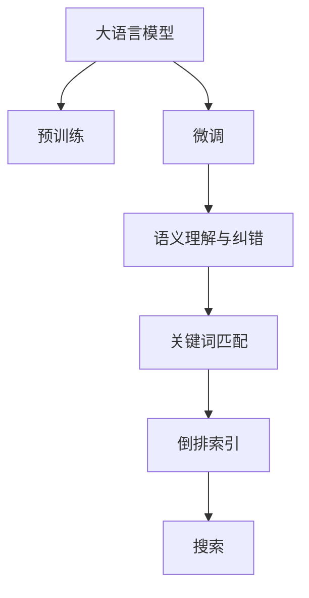

                 

# 电商搜索的语义理解与纠错：AI大模型的新突破

## 1. 背景介绍

### 1.1 问题由来

电商搜索作为电商平台的核心功能之一，其重要性不言而喻。通过精准的搜索服务，用户可以迅速找到符合自己需求的商品，极大提升用户体验，推动电商平台的商业转化率。然而，搜索体验的好坏往往受限于搜索语义理解的能力。

语义理解，即理解用户搜索词背后的真实意图，是一项复杂且挑战性极大的任务。传统的搜索系统主要依赖关键词匹配和倒排索引等技术，无法充分理解用户查询的深层次语义信息，导致搜索结果往往存在歧义、无关性等问题。

随着人工智能技术的快速发展和深度学习模型的崛起，通过引入大语言模型（Large Language Model, LLM）进行语义理解，显著提升了电商搜索的精准度和用户体验。通过语义理解与纠错，电商搜索系统能够更好地理解用户意图，提供更加贴近用户需求的搜索结果。

### 1.2 问题核心关键点

为深入理解AI大模型在电商搜索语义理解与纠错中的运用，本节将详细阐述相关核心概念，并分析其在电商搜索场景中的潜在应用。

- 大语言模型：指基于自回归或自编码机制，通过大规模预训练学习到的通用语言表示模型。
- 语义理解与纠错：通过大语言模型对用户搜索词进行语义分析，理解用户真实需求，并纠正可能的输入错误。
- 关键词匹配：基于传统的倒排索引技术，通过关键词匹配实现简单搜索。
- 倒排索引：一种将文档与词表反向索引的数据结构，用于快速检索文档。
- 深度学习：通过多层神经网络实现复杂非线性映射的机器学习技术。
- 预训练-微调（Pre-training & Fine-tuning）：在大规模语料上预训练模型，通过少量标注数据在下游任务上进行微调优化。

通过理解这些关键概念，我们可以更好地把握大语言模型在电商搜索语义理解与纠错中的作用和潜力。

## 2. 核心概念与联系

### 2.1 核心概念概述

为清晰呈现大语言模型在电商搜索语义理解与纠错中的应用，本节将重点介绍几个核心概念及其之间的关系：

- 大语言模型：作为预训练-微调的基础，大语言模型通过大规模无标签数据预训练，学习到丰富的语言知识，具备强大的语义理解能力。

- 预训练-微调：在大规模语料上预训练大语言模型，通过微调优化模型在特定任务上的性能。电商搜索场景下，微调后的模型能够理解用户搜索词的真实意图，提供更加精准的搜索结果。

- 语义理解与纠错：通过对用户搜索词进行语义分析，理解其背后的真实需求，并纠正可能的输入错误，提升搜索结果的相关性和精准度。

- 关键词匹配：简单直接的关键词匹配方式，通过查找倒排索引中包含查询关键词的文档，获取搜索结果。

- 倒排索引：一种高效的数据结构，通过将文档与词表反向索引，实现快速的文档检索。

- 深度学习：借助多层神经网络，实现复杂非线性映射，提高模型表达能力。

这些概念共同构成了电商搜索中语义理解与纠错的框架，通过大语言模型、预训练-微调等技术手段，为电商搜索带来了质的提升。

### 2.2 核心概念原理和架构的 Mermaid 流程图



该流程图展示了核心概念之间的关系：大语言模型通过预训练和微调获得语义理解能力，进一步与语义理解与纠错技术结合，提升搜索结果的精准度，最终与关键词匹配和倒排索引技术协同，实现高效的电商搜索服务。

## 3. 核心算法原理 & 具体操作步骤

### 3.1 算法原理概述

大语言模型在电商搜索语义理解与纠错中的应用，本质上是一种基于深度学习的预训练-微调范式。其核心思想是：

1. **预训练**：在大规模无标签文本数据上，通过自监督学习任务训练大语言模型，学习到通用的语言表示。
2. **微调**：使用下游任务的少量标注数据，通过有监督学习优化模型在特定任务上的性能，如电商搜索场景下的语义理解与纠错。
3. **语义理解与纠错**：通过大语言模型的语义分析能力，理解用户搜索词的真实意图，并纠正可能的输入错误，提升搜索结果的相关性和精准度。

通过预训练-微调范式，大语言模型能够在电商搜索场景下，高效地理解用户查询的深层次语义信息，并提供精准的搜索结果。

### 3.2 算法步骤详解

基于深度学习的电商搜索语义理解与纠错方法，主要包括以下几个步骤：

**Step 1: 准备预训练模型和数据集**
- 选择合适的预训练语言模型，如GPT、BERT等，作为初始化参数。
- 收集电商平台的搜索词和相关标注数据，准备训练集、验证集和测试集。

**Step 2: 设计任务适配层**
- 根据电商搜索任务的特点，设计合适的任务适配层，如文本分类、意图识别等。
- 针对搜索结果的相关性、精准度等指标，定义损失函数，如交叉熵损失等。

**Step 3: 设置微调超参数**
- 选择合适的优化算法及其参数，如AdamW、SGD等，设置学习率、批大小、迭代轮数等。
- 设置正则化技术及强度，包括权重衰减、Dropout、Early Stopping等。
- 确定冻结预训练参数的策略，如仅微调顶层，或全部参数都参与微调。

**Step 4: 执行梯度训练**
- 将训练集数据分批次输入模型，前向传播计算损失函数。
- 反向传播计算参数梯度，根据设定的优化算法和学习率更新模型参数。
- 周期性在验证集上评估模型性能，根据性能指标决定是否触发 Early Stopping。
- 重复上述步骤直到满足预设的迭代轮数或 Early Stopping 条件。

**Step 5: 测试和部署**
- 在测试集上评估微调后模型，对比微调前后的精度提升。
- 使用微调后的模型对新样本进行推理预测，集成到实际的应用系统中。
- 持续收集新的数据，定期重新微调模型，以适应数据分布的变化。

### 3.3 算法优缺点

基于深度学习的电商搜索语义理解与纠错方法，具有以下优点：

- **高效精准**：大语言模型通过预训练-微调范式，可以快速高效地理解用户查询的深层次语义信息，提供精准的搜索结果。
- **泛化性强**：通过大规模无标签数据的预训练，大语言模型具备较强的泛化能力，能够在各种场景下表现良好。
- **可扩展性好**：只需通过微调，大语言模型即可适配到不同的电商搜索场景，扩展性强。

同时，该方法也存在以下局限性：

- **依赖标注数据**：微调的效果很大程度上取决于标注数据的质量和数量，获取高质量标注数据的成本较高。
- **计算资源需求高**：大语言模型通常需要强大的计算资源支持，预训练和微调过程对硬件资源的需求较高。
- **可解释性不足**：大语言模型的决策过程通常缺乏可解释性，难以对其推理逻辑进行分析和调试。

尽管存在这些局限性，但就目前而言，基于深度学习的电商搜索语义理解与纠错方法仍是大语言模型应用的最主流范式。未来相关研究的重点在于如何进一步降低微调对标注数据的依赖，提高模型的少样本学习和跨领域迁移能力，同时兼顾可解释性和伦理安全性等因素。

### 3.4 算法应用领域

基于大语言模型的电商搜索语义理解与纠错方法，已在电商搜索、推荐系统等多个领域得到了广泛应用。以下是几个典型的应用场景：

- **电商搜索**：通过语义理解与纠错技术，提升搜索精度和相关性，提升用户体验。
- **推荐系统**：根据用户搜索词和历史记录，通过语义理解与纠错技术推荐相关商品。
- **智能客服**：结合语义理解与纠错技术，自动解答用户咨询，提升客服效率和准确性。
- **广告投放**：通过语义理解与纠错技术，识别用户需求，优化广告投放策略，提升转化率。

除了上述这些经典应用外，大语言模型在电商搜索语义理解与纠错方面的应用还将在更多领域得到扩展，为电商行业带来新的变革。

## 4. 数学模型和公式 & 详细讲解 & 举例说明

### 4.1 数学模型构建

假设预训练语言模型为 $M_{\theta}$，其中 $\theta$ 为模型参数。电商搜索场景下，搜索词 $x$ 和搜索结果 $y$ 之间的关系可以表示为：

$$ y = M_{\theta}(x) $$

其中 $M_{\theta}(x)$ 表示模型在输入 $x$ 上的输出，$y$ 为搜索结果的相关性评分。

### 4.2 公式推导过程

电商搜索场景下，通过大语言模型进行语义理解与纠错的过程，可以表示为：

1. **预训练阶段**：在大规模无标签数据上预训练大语言模型 $M_{\theta}$，使其学习到通用的语言表示。
2. **微调阶段**：使用电商搜索任务的标注数据，通过有监督学习优化模型 $M_{\theta}$，提升其对电商搜索场景的理解能力。
3. **语义理解与纠错**：通过大语言模型的语义分析能力，理解用户搜索词 $x$ 的真实意图，并纠正可能的输入错误，生成相关性评分 $y$。

以电商搜索中的意图识别任务为例，通过大语言模型进行语义理解与纠错的过程，可以表示为：

1. **预训练阶段**：在大规模无标签数据上预训练大语言模型 $M_{\theta}$，使其学习到通用的语言表示。
2. **微调阶段**：使用电商搜索任务的标注数据，通过有监督学习优化模型 $M_{\theta}$，提升其对电商搜索场景的理解能力。
3. **意图识别**：通过大语言模型的语义分析能力，理解用户搜索词 $x$ 的真实意图，生成意图分类 $z$。
4. **相关性评分**：根据用户搜索词 $x$ 和意图分类 $z$，生成搜索结果的相关性评分 $y$。

### 4.3 案例分析与讲解

以电商平台中的智能推荐系统为例，介绍大语言模型在电商搜索语义理解与纠错中的应用。

假设用户搜索词为 "iPhone 12 价格"，通过大语言模型的预训练和微调，可以理解用户的真实意图为寻找iPhone 12的最新价格。进一步通过语义分析，可以生成意图分类 "寻找最新价格"。根据该意图分类，智能推荐系统可以生成相关性评分较高的商品信息，如最新价格的iPhone 12商品列表。

通过大语言模型的语义理解与纠错能力，电商平台能够更好地理解用户查询的深层次语义信息，提供精准的搜索结果和个性化推荐，提升用户体验和转化率。

## 5. 项目实践：代码实例和详细解释说明

### 5.1 开发环境搭建

在进行电商搜索语义理解与纠错方法的实践前，我们需要准备好开发环境。以下是使用Python进行PyTorch开发的环境配置流程：

1. 安装Anaconda：从官网下载并安装Anaconda，用于创建独立的Python环境。

2. 创建并激活虚拟环境：
```bash
conda create -n pytorch-env python=3.8 
conda activate pytorch-env
```

3. 安装PyTorch：根据CUDA版本，从官网获取对应的安装命令。例如：
```bash
conda install pytorch torchvision torchaudio cudatoolkit=11.1 -c pytorch -c conda-forge
```

4. 安装Transformers库：
```bash
pip install transformers
```

5. 安装各类工具包：
```bash
pip install numpy pandas scikit-learn matplotlib tqdm jupyter notebook ipython
```

完成上述步骤后，即可在`pytorch-env`环境中开始电商搜索语义理解与纠错方法的实践。

### 5.2 源代码详细实现

下面我们以电商平台中的意图识别任务为例，给出使用Transformers库对BERT模型进行电商搜索语义理解与纠错的PyTorch代码实现。

首先，定义意图识别的数据处理函数：

```python
from transformers import BertTokenizer
from torch.utils.data import Dataset
import torch

class IntentDataset(Dataset):
    def __init__(self, texts, intents, tokenizer, max_len=128):
        self.texts = texts
        self.intents = intents
        self.tokenizer = tokenizer
        self.max_len = max_len
        
    def __len__(self):
        return len(self.texts)
    
    def __getitem__(self, item):
        text = self.texts[item]
        intent = self.intents[item]
        
        encoding = self.tokenizer(text, return_tensors='pt', max_length=self.max_len, padding='max_length', truncation=True)
        input_ids = encoding['input_ids'][0]
        attention_mask = encoding['attention_mask'][0]
        
        # 对token-wise的意图进行编码
        encoded_intents = [intent2id[intent] for intent in intents] 
        encoded_intents.extend([intent2id['None']] * (self.max_len - len(encoded_intents)))
        labels = torch.tensor(encoded_intents, dtype=torch.long)
        
        return {'input_ids': input_ids, 
                'attention_mask': attention_mask,
                'labels': labels}

# 意图与id的映射
intent2id = {'寻找最新价格': 0, '查找商品': 1, '购买商品': 2, '退换货': 3}
id2intent = {v: k for k, v in intent2id.items()}

# 创建dataset
tokenizer = BertTokenizer.from_pretrained('bert-base-cased')

train_dataset = IntentDataset(train_texts, train_intents, tokenizer)
dev_dataset = IntentDataset(dev_texts, dev_intents, tokenizer)
test_dataset = IntentDataset(test_texts, test_intents, tokenizer)
```

然后，定义模型和优化器：

```python
from transformers import BertForTokenClassification, AdamW

model = BertForTokenClassification.from_pretrained('bert-base-cased', num_labels=len(intent2id))

optimizer = AdamW(model.parameters(), lr=2e-5)
```

接着，定义训练和评估函数：

```python
from torch.utils.data import DataLoader
from tqdm import tqdm
from sklearn.metrics import classification_report

device = torch.device('cuda') if torch.cuda.is_available() else torch.device('cpu')
model.to(device)

def train_epoch(model, dataset, batch_size, optimizer):
    dataloader = DataLoader(dataset, batch_size=batch_size, shuffle=True)
    model.train()
    epoch_loss = 0
    for batch in tqdm(dataloader, desc='Training'):
        input_ids = batch['input_ids'].to(device)
        attention_mask = batch['attention_mask'].to(device)
        labels = batch['labels'].to(device)
        model.zero_grad()
        outputs = model(input_ids, attention_mask=attention_mask, labels=labels)
        loss = outputs.loss
        epoch_loss += loss.item()
        loss.backward()
        optimizer.step()
    return epoch_loss / len(dataloader)

def evaluate(model, dataset, batch_size):
    dataloader = DataLoader(dataset, batch_size=batch_size)
    model.eval()
    preds, labels = [], []
    with torch.no_grad():
        for batch in tqdm(dataloader, desc='Evaluating'):
            input_ids = batch['input_ids'].to(device)
            attention_mask = batch['attention_mask'].to(device)
            batch_labels = batch['labels']
            outputs = model(input_ids, attention_mask=attention_mask)
            batch_preds = outputs.logits.argmax(dim=2).to('cpu').tolist()
            batch_labels = batch_labels.to('cpu').tolist()
            for pred_tokens, label_tokens in zip(batch_preds, batch_labels):
                pred_intents = [id2intent[_id] for _id in pred_tokens]
                label_intents = [id2intent[_id] for _id in label_tokens]
                preds.append(pred_intents[:len(label_intents)])
                labels.append(label_intents)
                
    print(classification_report(labels, preds))
```

最后，启动训练流程并在测试集上评估：

```python
epochs = 5
batch_size = 16

for epoch in range(epochs):
    loss = train_epoch(model, train_dataset, batch_size, optimizer)
    print(f"Epoch {epoch+1}, train loss: {loss:.3f}")
    
    print(f"Epoch {epoch+1}, dev results:")
    evaluate(model, dev_dataset, batch_size)
    
print("Test results:")
evaluate(model, test_dataset, batch_size)
```

以上就是使用PyTorch对BERT进行电商搜索意图识别任务微调的完整代码实现。可以看到，得益于Transformers库的强大封装，我们可以用相对简洁的代码完成BERT模型的加载和微调。

### 5.3 代码解读与分析

让我们再详细解读一下关键代码的实现细节：

**IntentDataset类**：
- `__init__`方法：初始化文本、意图、分词器等关键组件。
- `__len__`方法：返回数据集的样本数量。
- `__getitem__`方法：对单个样本进行处理，将文本输入编码为token ids，将意图编码为数字，并对其进行定长padding，最终返回模型所需的输入。

**intent2id和id2intent字典**：
- 定义了意图与数字id之间的映射关系，用于将token-wise的预测结果解码回真实的意图。

**训练和评估函数**：
- 使用PyTorch的DataLoader对数据集进行批次化加载，供模型训练和推理使用。
- 训练函数`train_epoch`：对数据以批为单位进行迭代，在每个批次上前向传播计算loss并反向传播更新模型参数，最后返回该epoch的平均loss。
- 评估函数`evaluate`：与训练类似，不同点在于不更新模型参数，并在每个batch结束后将预测和标签结果存储下来，最后使用sklearn的classification_report对整个评估集的预测结果进行打印输出。

**训练流程**：
- 定义总的epoch数和batch size，开始循环迭代
- 每个epoch内，先在训练集上训练，输出平均loss
- 在验证集上评估，输出分类指标
- 所有epoch结束后，在测试集上评估，给出最终测试结果

可以看到，PyTorch配合Transformers库使得BERT微调的代码实现变得简洁高效。开发者可以将更多精力放在数据处理、模型改进等高层逻辑上，而不必过多关注底层的实现细节。

当然，工业级的系统实现还需考虑更多因素，如模型的保存和部署、超参数的自动搜索、更灵活的任务适配层等。但核心的微调范式基本与此类似。

## 6. 实际应用场景

### 6.1 电商搜索

电商搜索作为电商平台的核心功能之一，其重要性不言而喻。通过精准的搜索服务，用户可以迅速找到符合自己需求的商品，极大提升用户体验，推动电商平台的商业转化率。

然而，传统的电商搜索主要依赖关键词匹配和倒排索引等技术，无法充分理解用户查询的深层次语义信息，导致搜索结果往往存在歧义、无关性等问题。通过引入大语言模型进行语义理解与纠错，显著提升了电商搜索的精准度和用户体验。

具体而言，电商搜索系统通过大语言模型的预训练和微调，能够高效地理解用户查询的深层次语义信息，并生成精准的搜索结果。例如，用户搜索 "iPhone 12 价格"，大语言模型能够理解其真实意图为寻找iPhone 12的最新价格，并生成相关性评分较高的商品信息，如最新价格的iPhone 12商品列表。

### 6.2 推荐系统

推荐系统是电商平台的重要功能之一，通过推荐相关商品，提升用户转化率和平台收入。传统的推荐系统主要依赖用户的历史行为数据进行推荐，难以充分理解用户真实需求。

通过大语言模型的语义理解与纠错能力，推荐系统能够更好地理解用户查询的深层次语义信息，并生成相关性评分较高的商品推荐。例如，用户搜索 "运动装备"，推荐系统能够理解其真实意图为寻找各类运动装备，并生成相关性评分较高的商品推荐，如跑步装备、健身器材等。

### 6.3 智能客服

智能客服作为电商平台的重要组成部分，通过自动解答用户咨询，提升客服效率和用户满意度。传统的智能客服系统主要依赖预定义规则和模板，无法充分理解用户查询的深层次语义信息，导致回答缺乏针对性。

通过大语言模型的语义理解与纠错能力，智能客服系统能够更好地理解用户查询的深层次语义信息，并生成精准的回答。例如，用户咨询 "如何购买Apple Watch"，智能客服能够理解其真实意图为寻找购买Apple Watch的渠道和信息，并生成相关性评分较高的回答，如Apple官网购买链接、实体店地址等。

### 6.4 未来应用展望

随着大语言模型和语义理解与纠错技术的不断发展，其在电商搜索、推荐系统、智能客服等领域的潜在应用前景广阔。

在智慧零售领域，通过大语言模型进行语义理解与纠错，能够实现更精准的商品推荐、个性化的广告投放等，提升用户转化率和平台收入。

在智能客服领域，通过大语言模型进行语义理解与纠错，能够实现更精准的咨询回答、智能化的业务处理等，提升客服效率和用户满意度。

在智慧物流领域，通过大语言模型进行语义理解与纠错，能够实现更精准的订单处理、智能化的物流跟踪等，提升物流服务的效率和质量。

此外，在智能安防、智能医疗、智能教育等众多领域，大语言模型和语义理解与纠错技术的应用也将不断扩展，为相关领域带来新的变革。

## 7. 工具和资源推荐

### 7.1 学习资源推荐

为了帮助开发者系统掌握大语言模型在电商搜索语义理解与纠错中的运用，这里推荐一些优质的学习资源：

1. 《Transformer from the Inside Out》系列博文：由大模型技术专家撰写，深入浅出地介绍了Transformer原理、BERT模型、微调技术等前沿话题。

2. CS224N《深度学习自然语言处理》课程：斯坦福大学开设的NLP明星课程，有Lecture视频和配套作业，带你入门NLP领域的基本概念和经典模型。

3. 《Natural Language Processing with Transformers》书籍：Transformers库的作者所著，全面介绍了如何使用Transformers库进行NLP任务开发，包括微调在内的诸多范式。

4. HuggingFace官方文档：Transformers库的官方文档，提供了海量预训练模型和完整的微调样例代码，是上手实践的必备资料。

5. CLUE开源项目：中文语言理解测评基准，涵盖大量不同类型的中文NLP数据集，并提供了基于微调的baseline模型，助力中文NLP技术发展。

通过对这些资源的学习实践，相信你一定能够快速掌握大语言模型在电商搜索语义理解与纠错中的精髓，并用于解决实际的NLP问题。

### 7.2 开发工具推荐

高效的开发离不开优秀的工具支持。以下是几款用于大语言模型电商搜索语义理解与纠错方法开发的常用工具：

1. PyTorch：基于Python的开源深度学习框架，灵活动态的计算图，适合快速迭代研究。大部分预训练语言模型都有PyTorch版本的实现。

2. TensorFlow：由Google主导开发的开源深度学习框架，生产部署方便，适合大规模工程应用。同样有丰富的预训练语言模型资源。

3. Transformers库：HuggingFace开发的NLP工具库，集成了众多SOTA语言模型，支持PyTorch和TensorFlow，是进行电商搜索语义理解与纠错方法开发的利器。

4. Weights & Biases：模型训练的实验跟踪工具，可以记录和可视化模型训练过程中的各项指标，方便对比和调优。与主流深度学习框架无缝集成。

5. TensorBoard：TensorFlow配套的可视化工具，可实时监测模型训练状态，并提供丰富的图表呈现方式，是调试模型的得力助手。

6. Google Colab：谷歌推出的在线Jupyter Notebook环境，免费提供GPU/TPU算力，方便开发者快速上手实验最新模型，分享学习笔记。

合理利用这些工具，可以显著提升大语言模型电商搜索语义理解与纠错方法的开发效率，加快创新迭代的步伐。

### 7.3 相关论文推荐

大语言模型和电商搜索语义理解与纠错技术的发展源于学界的持续研究。以下是几篇奠基性的相关论文，推荐阅读：

1. Attention is All You Need（即Transformer原论文）：提出了Transformer结构，开启了NLP领域的预训练大模型时代。

2. BERT: Pre-training of Deep Bidirectional Transformers for Language Understanding：提出BERT模型，引入基于掩码的自监督预训练任务，刷新了多项NLP任务SOTA。

3. Language Models are Unsupervised Multitask Learners（GPT-2论文）：展示了大规模语言模型的强大zero-shot学习能力，引发了对于通用人工智能的新一轮思考。

4. Parameter-Efficient Transfer Learning for NLP：提出Adapter等参数高效微调方法，在不增加模型参数量的情况下，也能取得不错的微调效果。

5. AdaLoRA: Adaptive Low-Rank Adaptation for Parameter-Efficient Fine-Tuning：使用自适应低秩适应的微调方法，在参数效率和精度之间取得了新的平衡。

6. Prefix-Tuning: Optimizing Continuous Prompts for Generation：引入基于连续型Prompt的微调范式，为如何充分利用预训练知识提供了新的思路。

这些论文代表了大语言模型电商搜索语义理解与纠错技术的发展脉络。通过学习这些前沿成果，可以帮助研究者把握学科前进方向，激发更多的创新灵感。

## 8. 总结：未来发展趋势与挑战

### 8.1 研究成果总结

本文对大语言模型在电商搜索语义理解与纠错中的应用进行了全面系统的介绍。首先阐述了大语言模型和语义理解与纠错技术的研究背景和意义，明确了其在电商搜索场景中的潜在应用。其次，从原理到实践，详细讲解了深度学习在电商搜索语义理解与纠错中的具体方法，给出了电商搜索意图识别任务的完整代码实现。同时，本文还广泛探讨了大语言模型在电商搜索场景中的应用前景，展示了其广阔的潜在应用。

通过本文的系统梳理，可以看到，大语言模型和语义理解与纠错技术在电商搜索场景中具有巨大的应用价值，能够显著提升搜索精度和用户体验。随着技术的不断发展，大语言模型在电商搜索中的应用前景将更加广阔。

### 8.2 未来发展趋势

展望未来，大语言模型在电商搜索语义理解与纠错领域将呈现以下几个发展趋势：

1. 模型规模持续增大。随着算力成本的下降和数据规模的扩张，预训练语言模型的参数量还将持续增长。超大规模语言模型蕴含的丰富语言知识，有望支撑更加复杂多变的电商搜索场景。

2. 微调方法日趋多样。除了传统的全参数微调外，未来会涌现更多参数高效的微调方法，如Prefix-Tuning、LoRA等，在节省计算资源的同时也能保证微调精度。

3. 持续学习成为常态。随着数据分布的不断变化，微调模型也需要持续学习新知识以保持性能。如何在不遗忘原有知识的同时，高效吸收新样本信息，将成为重要的研究课题。

4. 标注样本需求降低。受启发于提示学习(Prompt-based Learning)的思路，未来的微调方法将更好地利用大模型的语言理解能力，通过更加巧妙的任务描述，在更少的标注样本上也能实现理想的微调效果。

5. 模型通用性增强。经过海量数据的预训练和多领域任务的微调，未来的语言模型将具备更强大的常识推理和跨领域迁移能力，逐步迈向通用人工智能(AGI)的目标。

以上趋势凸显了大语言模型电商搜索语义理解与纠错技术的广阔前景。这些方向的探索发展，必将进一步提升电商搜索的精准度和用户体验，为电商行业带来新的变革。

### 8.3 面临的挑战

尽管大语言模型电商搜索语义理解与纠错技术已经取得了瞩目成就，但在迈向更加智能化、普适化应用的过程中，它仍面临着诸多挑战：

1. 标注成本瓶颈。虽然微调大大降低了标注数据的需求，但对于长尾应用场景，难以获得充足的高质量标注数据，成为制约微调性能的瓶颈。如何进一步降低微调对标注样本的依赖，将是一大难题。

2. 模型鲁棒性不足。当前微调模型面对域外数据时，泛化性能往往大打折扣。对于测试样本的微小扰动，微调模型的预测也容易发生波动。如何提高微调模型的鲁棒性，避免灾难性遗忘，还需要更多理论和实践的积累。

3. 推理效率有待提高。大规模语言模型虽然精度高，但在实际部署时往往面临推理速度慢、内存占用大等效率问题。如何在保证性能的同时，简化模型结构，提升推理速度，优化资源占用，将是重要的优化方向。

4. 可解释性亟需加强。当前微调模型更像是"黑盒"系统，难以解释其内部工作机制和决策逻辑。对于医疗、金融等高风险应用，算法的可解释性和可审计性尤为重要。如何赋予微调模型更强的可解释性，将是亟待攻克的难题。

5. 安全性有待保障。预训练语言模型难免会学习到有偏见、有害的信息，通过微调传递到下游任务，产生误导性、歧视性的输出，给实际应用带来安全隐患。如何从数据和算法层面消除模型偏见，避免恶意用途，确保输出的安全性，也将是重要的研究课题。

6. 知识整合能力不足。现有的微调模型往往局限于任务内数据，难以灵活吸收和运用更广泛的先验知识。如何让微调过程更好地与外部知识库、规则库等专家知识结合，形成更加全面、准确的信息整合能力，还有很大的想象空间。

正视电商搜索语义理解与纠错面临的这些挑战，积极应对并寻求突破，将是大语言模型电商搜索语义理解与纠错技术走向成熟的必由之路。相信随着学界和产业界的共同努力，这些挑战终将一一被克服，大语言模型电商搜索语义理解与纠错技术必将在构建智能电商搜索系统中扮演越来越重要的角色。

### 8.4 研究展望

面对大语言模型电商搜索语义理解与纠错所面临的种种挑战，未来的研究需要在以下几个方面寻求新的突破：

1. 探索无监督和半监督微调方法。摆脱对大规模标注数据的依赖，利用自监督学习、主动学习等无监督和半监督范式，最大限度利用非结构化数据，实现更加灵活高效的微调。

2. 研究参数高效和计算高效的微调范式。开发更加参数高效的微调方法，在固定大部分预训练参数的同时，只更新极少量的任务相关参数。同时优化微调模型的计算图，减少前向传播和反向传播的资源消耗，实现更加轻量级、实时性的部署。

3. 融合因果和对比学习范式。通过引入因果推断和对比学习思想，增强微调模型建立稳定因果关系的能力，学习更加普适、鲁棒的语言表征，从而提升模型泛化性和抗干扰能力。

4. 引入更多先验知识。将符号化的先验知识，如知识图谱、逻辑规则等，与神经网络模型进行巧妙融合，引导微调过程学习更准确、合理的语言模型。同时加强不同模态数据的整合，实现视觉、语音等多模态信息与文本信息的协同建模。

5. 结合因果分析和博弈论工具。将因果分析方法引入微调模型，识别出模型决策的关键特征，增强输出解释的因果性和逻辑性。借助博弈论工具刻画人机交互过程，主动探索并规避模型的脆弱点，提高系统稳定性。

6. 纳入伦理道德约束。在模型训练目标中引入伦理导向的评估指标，过滤和惩罚有偏见、有害的输出倾向。同时加强人工干预和审核，建立模型行为的监管机制，确保输出符合人类价值观和伦理道德。

这些研究方向的探索，必将引领大语言模型电商搜索语义理解与纠错技术迈向更高的台阶，为构建智能电商搜索系统提供新的技术支持。面向未来，大语言模型电商搜索语义理解与纠错技术还需要与其他人工智能技术进行更深入的融合，如知识表示、因果推理、强化学习等，多路径协同发力，共同推动智能电商搜索系统的进步。只有勇于创新、敢于突破，才能不断拓展语言模型的边界，让智能技术更好地造福人类社会。

## 9. 附录：常见问题与解答

**Q1：大语言模型在电商搜索中的应用是否适用于所有场景？**

A: 大语言模型在电商搜索中的应用，特别是基于深度学习的语义理解与纠错方法，主要适用于电商搜索、推荐系统、智能客服等场景。对于部分场景，如特殊商品、地域性强的商品等，可能需要结合特定领域的知识库或规则库进行优化。

**Q2：如何提高大语言模型在电商搜索中的鲁棒性？**

A: 提高大语言模型在电商搜索中的鲁棒性，可以从以下几个方面入手：
1. 引入更多的先验知识，如领域知识库、规则库等，增强模型的泛化能力。
2. 通过对抗训练、噪声注入等方法，提高模型对输入噪声的鲁棒性。
3. 在模型训练过程中，加入更多的负样本，增强模型的鲁棒性。
4. 采用模型集成、模型融合等方法，提升模型的鲁棒性。

**Q3：大语言模型在电商搜索中的应用是否需要大量的标注数据？**

A: 大语言模型在电商搜索中的应用，通常需要一定量的标注数据进行微调。标注数据的质量和数量，对模型的性能提升至关重要。对于一些长尾应用场景，获取高质量标注数据的成本较高，可以考虑结合无监督学习、主动学习等方法，提高模型的性能。

**Q4：大语言模型在电商搜索中的应用是否容易受到领域分布的变化影响？**

A: 大语言模型在电商搜索中的应用，尤其是基于深度学习的语义理解与纠错方法，容易受到领域分布的变化影响。为了应对这一问题，可以定期重新训练模型，结合新数据进行微调，确保模型能够适应领域分布的变化。同时，可以引入动态学习策略，实时更新模型参数，以应对领域分布的动态变化。

**Q5：如何提高大语言模型在电商搜索中的应用效果？**

A: 提高大语言模型在电商搜索中的应用效果，可以从以下几个方面入手：
1. 结合业务需求，选择合适的任务适配层，如意图识别、关系抽取等。
2. 优化模型结构和训练参数，如增加模型层数、调整学习率等。
3. 引入更多的先验知识，如领域知识库、规则库等，增强模型的泛化能力。
4. 结合深度学习、自然语言处理等技术，进一步提升模型的效果。

通过以上方法，可以显著提升大语言模型在电商搜索中的应用效果，实现更精准、更高效的商品推荐和搜索服务。

---

作者：禅与计算机程序设计艺术 / Zen and the Art of Computer Programming

