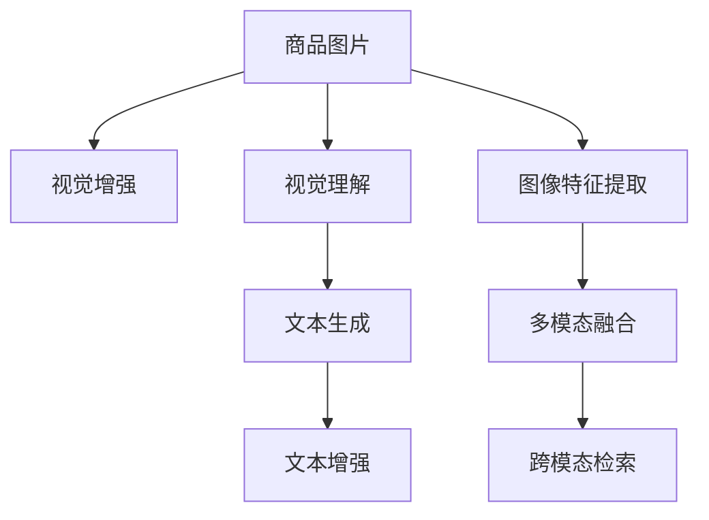

                 

# 电商搜索的跨模态检索：AI大模型的新突破

## 1. 背景介绍

随着电商行业的发展，消费者需求呈现多元化趋势，单一的文本搜索已无法满足用户需求。为提升搜索效果，各大电商公司纷纷采用跨模态检索技术，将商品图片、价格、用户评论等多种数据源融合到搜索中。这些数据源包含丰富的视觉、文本信息，能提供更加全面、准确的商品推荐，大幅提升用户购物体验。

### 1.1 问题由来
当前，电商搜索的主要模式仍然以文本搜索为主。但随着用户需求的提升，如品牌、价格、场景、尺寸、库存等约束条件的引入，简单的文本搜索已无法满足用户的全面查询需求。特别是对于图像商品，文本描述往往无法精确传递其关键特征，难以准确匹配用户需求。

如何打破图像、文本间的信息壁垒，实现跨模态检索，构建更加智能化的电商搜索系统，成为电商公司亟待解决的问题。为应对这一挑战，电商公司纷纷引入AI大模型技术，利用其强大的多模态理解能力，实现商品跨模态检索的突破。

### 1.2 问题核心关键点
电商跨模态检索的核心在于如何高效融合多种模态数据，同时充分发挥大模型的多模态理解能力。具体关键点包括：

- **多模态数据融合**：将商品图片、价格、评价等信息融合到搜索中，形成多模态的搜索特征。
- **视觉理解**：利用大模型理解商品图片中的视觉特征，生成准确的视觉描述。
- **文本生成**：利用大模型对文本数据进行理解和生成，提供详细的商品描述。
- **检索算法优化**：选择合适的检索算法，优化检索速度和精度。

## 2. 核心概念与联系

### 2.1 核心概念概述

为更好地理解基于AI大模型的电商跨模态检索技术，本节将介绍几个关键概念：

- **跨模态检索(Cross-Modal Retrieval)**：一种将不同模态数据融合到同一检索任务中的技术。例如，将商品图片和描述信息融合到用户查询中，实现更精准的商品检索。
- **多模态理解(Multimodal Understanding)**：指大模型同时理解和处理不同模态数据的能力。例如，理解商品图片中的视觉特征和文本描述的语义。
- **图像增强(Image Augmentation)**：通过图像变换和增强，增加训练数据的多样性，提升模型对不同姿态、光线下的视觉特征的识别能力。
- **联合学习(Federated Learning)**：一种分布式学习方法，多个客户端利用本地数据训练模型，同时聚合模型参数进行全局模型更新。
- **知识蒸馏(Knowledge Distillation)**：一种模型压缩技术，通过将大模型的知识蒸馏到轻量级模型中，实现性能提升。

这些概念之间的逻辑关系可以通过以下Mermaid流程图来展示：



这个流程图展示了大模型在电商跨模态检索中的关键处理步骤：

1. 商品图片通过视觉增强，提升特征多样性。
2. 利用大模型理解商品图片，生成视觉描述。
3. 对商品描述进行文本增强，生成丰富的语义信息。
4. 将商品图片和描述信息融合到搜索中，形成多模态的检索特征。
5. 大模型理解融合后的特征，实现跨模态检索。

## 3. 核心算法原理 & 具体操作步骤
### 3.1 算法原理概述

基于AI大模型的电商跨模态检索，其核心在于如何将不同模态的数据进行有效融合，利用大模型的多模态理解能力，实现高效的商品检索。

假设商品图片为 $X$，商品描述为 $Y$，用户查询为 $Q$，则跨模态检索的目标是找到最佳的商品 $I$，使得 $I$ 在图片特征 $F(X)$ 和文本特征 $T(Y)$ 上与 $Q$ 的相似度最高。

具体而言，通过以下步骤实现跨模态检索：

1. 对商品图片 $X$ 进行视觉增强和特征提取，生成图片特征 $F(X)$。
2. 对商品描述 $Y$ 进行文本增强和生成，生成文本特征 $T(Y)$。
3. 将 $F(X)$ 和 $T(Y)$ 融合到用户查询 $Q$ 中，形成多模态特征向量 $Z(Q)$。
4. 利用大模型对 $Z(Q)$ 进行多模态理解，生成与 $Q$ 相似的检索结果 $I$。

### 3.2 算法步骤详解

#### 3.2.1 视觉增强

视觉增强是通过一系列的图像变换操作，提升训练数据的多样性，增强模型对不同姿态、光线下的视觉特征的识别能力。常见的视觉增强操作包括：

- 翻转(Flip)
- 旋转(Rotate)
- 缩放(Zoom)
- 亮度(Brightness)
- 对比度(Contrast)
- 噪声(Noise)

#### 3.2.2 图像特征提取

图像特征提取是将商品图片转换成模型能够理解的多维特征向量。通常采用卷积神经网络(CNN)或预训练模型提取图片特征，如ResNet、VGG、ResNext、BERT等。以BERT为例，其预训练模型能够高效提取图片中的视觉特征。

#### 3.2.3 文本增强

文本增强是通过对商品描述进行一些语义上或者语法上的操作，生成不同的文本表示。常见的文本增强方法包括：

- 近义替换(Synonym Replacement)
- 随机插入(Random Insertion)
- 随机删除(Random Deletion)
- 随机交换(Random Swap)
- 插入噪声(Noise Injection)

#### 3.2.4 文本生成

文本生成是通过语言模型对商品描述进行理解和生成，生成与商品相关的文本特征。通常采用预训练语言模型(如GPT、BERT等)对文本数据进行训练，然后微调到电商搜索场景。

#### 3.2.5 多模态融合

多模态融合是将商品图片特征和文本特征进行融合，生成最终的多模态特征向量。常见的融合方法包括：

- 拼接(Concatenation)
- 加权求和(Weighted Sum)
- 平均池化(Average Pooling)
- 最大池化(Max Pooling)
- 注意力机制(Attention)

#### 3.2.6 跨模态检索

跨模态检索是利用大模型对多模态特征向量进行理解和检索，生成最终的商品结果。常用的检索算法包括：

- 余弦相似度(Cosine Similarity)
- 欧式距离(Euclidean Distance)
- 曼哈顿距离(Manhattan Distance)
- 余弦排序(Cosine Ranking)
- 注意力排序(Attention Ranking)

### 3.3 算法优缺点

基于AI大模型的电商跨模态检索具有以下优点：

1. 多模态理解能力强：大模型能同时理解图片和文本信息，提升商品检索的精度和准确性。
2. 数据融合多样化：通过视觉增强和文本增强，增加训练数据的多样性，提高模型泛化能力。
3. 检索速度高效：利用预训练模型进行多模态融合和检索，大幅提升检索速度。
4. 适应性广：大模型能适应多种商品类型和搜索场景，通用性更强。

同时，该方法也存在一些局限性：

1. 数据量需求高：大模型的训练需要大量数据，对于小型电商公司可能难以满足。
2. 计算资源要求高：大模型对计算资源和存储资源要求较高，对于资源有限的场景可能不适用。
3. 模型复杂度高：大模型的结构复杂，推理速度较慢，难以实时响应搜索请求。
4. 模型迁移能力有限：大模型对于特定领域的微调效果有限，可能需要进一步预训练和微调。

尽管存在这些局限性，但就目前而言，基于AI大模型的跨模态检索方法仍是目前电商搜索最先进的技术手段。未来相关研究的重点在于如何进一步降低计算资源需求，提升模型推理速度，提高模型的迁移能力，同时兼顾可解释性和伦理安全性等因素。

### 3.4 算法应用领域

基于AI大模型的电商跨模态检索技术，已经在多个电商平台上得到了广泛应用，例如：

- 京东、亚马逊等大型电商平台：利用大模型进行商品图像和描述的融合检索，提升商品搜索的准确性和丰富性。
- 特卖和导购应用：如蘑菇街、美丽说等，利用大模型进行多模态信息检索，推荐个性化的商品信息。
- 新零售场景：如盒马鲜生等实体店铺，利用大模型进行商品多模态信息检索，提供个性化的购物体验。

除了这些典型应用外，大模型在电商搜索中的应用还在不断拓展，如智能客服、商品推荐、库存管理等场景，为电商行业带来了新的机遇。

## 4. 数学模型和公式 & 详细讲解  
### 4.1 数学模型构建

假设商品图片为 $X$，商品描述为 $Y$，用户查询为 $Q$，商品索引为 $I$。

多模态检索的目标是找到最佳的商品 $I$，使得 $I$ 在图片特征 $F(X)$ 和文本特征 $T(Y)$ 上与 $Q$ 的相似度最高。具体数学模型构建如下：

1. 图像特征提取：利用预训练模型提取商品图片的视觉特征 $F(X)$。
2. 文本特征提取：利用预训练语言模型对商品描述进行增强和生成，形成文本特征 $T(Y)$。
3. 多模态融合：将 $F(X)$ 和 $T(Y)$ 融合到用户查询 $Q$ 中，生成多模态特征向量 $Z(Q)$。
4. 检索计算：利用大模型对 $Z(Q)$ 进行多模态理解，生成与 $Q$ 相似的检索结果 $I$。

### 4.2 公式推导过程

以下将通过数学公式推导，展示基于AI大模型的电商跨模态检索方法的具体实现过程。

#### 4.2.1 图像特征提取

以预训练模型BERT为例，其图像特征提取过程如下：

- 将商品图片 $X$ 输入视觉增强模块，生成多个增强后的图片 $X_1, X_2, ..., X_n$。
- 利用预训练的卷积神经网络或视觉模型提取每个增强后图片的视觉特征 $F_1(X), F_2(X), ..., F_n(X)$。
- 将 $F_1(X), F_2(X), ..., F_n(X)$ 拼接或平均池化，得到最终的图像特征 $F(X)$。

数学公式如下：

$$
F(X) = \frac{1}{n} \sum_{i=1}^n F_i(X)
$$

#### 4.2.2 文本增强

文本增强过程如下：

- 对商品描述 $Y$ 进行近义替换、随机插入、随机删除等操作，生成多个增强后的描述 $Y_1, Y_2, ..., Y_m$。
- 利用预训练语言模型对每个增强后的描述 $Y_1, Y_2, ..., Y_m$ 进行增强和生成，形成文本特征 $T_1(Y), T_2(Y), ..., T_m(Y)$。
- 将 $T_1(Y), T_2(Y), ..., T_m(Y)$ 拼接或平均池化，得到最终的文本特征 $T(Y)$。

数学公式如下：

$$
T(Y) = \frac{1}{m} \sum_{i=1}^m T_i(Y)
$$

#### 4.2.3 多模态融合

多模态融合过程如下：

- 将图像特征 $F(X)$ 和文本特征 $T(Y)$ 拼接或加权求和，生成多模态特征向量 $Z(Q)$。

数学公式如下：

$$
Z(Q) = [F(X); T(Y)]
$$

其中 $[;]$ 表示拼接操作。

#### 4.2.4 跨模态检索

跨模态检索过程如下：

- 利用大模型对多模态特征向量 $Z(Q)$ 进行多模态理解，生成与 $Q$ 相似的检索结果 $I$。

数学公式如下：

$$
I = \text{BigModel}(Z(Q))
$$

其中 $\text{BigModel}$ 表示大模型。

## 5. 项目实践：代码实例和详细解释说明
### 5.1 开发环境搭建

在进行跨模态检索项目实践前，我们需要准备好开发环境。以下是使用Python进行TensorFlow开发的环境配置流程：

1. 安装Anaconda：从官网下载并安装Anaconda，用于创建独立的Python环境。

2. 创建并激活虚拟环境：
```bash
conda create -n tf-env python=3.8 
conda activate tf-env
```

3. 安装TensorFlow：根据CUDA版本，从官网获取对应的安装命令。例如：
```bash
conda install tensorflow -c tf -c conda-forge
```

4. 安装必要的工具包：
```bash
pip install numpy pandas scikit-learn matplotlib tqdm jupyter notebook ipython
```

完成上述步骤后，即可在`tf-env`环境中开始项目开发。

### 5.2 源代码详细实现

这里我们以基于BERT模型的电商跨模态检索为例，给出完整的代码实现。

首先，定义数据预处理函数：

```python
import tensorflow as tf
from tensorflow.keras.preprocessing.image import ImageDataGenerator
from tensorflow.keras.applications import ResNet50

def preprocess_image(image_path, max_size=256):
    img = tf.io.read_file(image_path)
    img = tf.image.decode_jpeg(img, channels=3)
    img = tf.image.resize(img, (max_size, max_size))
    img = tf.image.per_image_standardization(img)
    return img

def preprocess_text(text):
    text = text.lower()
    text = re.sub('[^a-z0-9 ]+', '', text)
    return text
```

然后，定义模型构建函数：

```python
def build_model():
    base_model = ResNet50(include_top=False, weights='imagenet')
    base_model.trainable = False
    x = base_model.output
    x = tf.keras.layers.GlobalAveragePooling2D()(x)
    x = tf.keras.layers.Dense(256, activation='relu')(x)
    x = tf.keras.layers.Dense(1, activation='sigmoid')(x)
    model = tf.keras.Model(inputs=base_model.input, outputs=x)
    return model

def load_model():
    model = build_model()
    model.load_weights('model_weights.h5')
    model.compile(optimizer='adam', loss='binary_crossentropy', metrics=['accuracy'])
    return model
```

接着，定义数据增强函数：

```python
def augment_images(images, labels):
    augmented_images = []
    augmented_labels = []
    for img, label in zip(images, labels):
        augmentor = tf.keras.preprocessing.image.ImageDataGenerator(
            width_shift_range=0.2,
            height_shift_range=0.2,
            rotation_range=20,
            horizontal_flip=True,
            fill_mode='nearest')
        augmented_images += augmentor.flow(img, batch_size=1)
        augmented_labels += augmentor.flow(label, batch_size=1)
    return augmented_images, augmented_labels
```

最后，定义训练和评估函数：

```python
def train_epoch(model, train_dataset, batch_size, optimizer):
    dataloader = tf.data.Dataset.from_tensor_slices(train_dataset)
    dataloader = dataloader.batch(batch_size).shuffle(buffer_size=1024).repeat()
    model.fit(dataloader, epochs=1, steps_per_epoch=train_dataset['labels'].shape[0] // batch_size)

def evaluate(model, test_dataset, batch_size):
    dataloader = tf.data.Dataset.from_tensor_slices(test_dataset)
    dataloader = dataloader.batch(batch_size).shuffle(buffer_size=1024).repeat()
    return model.evaluate(dataloader)
```

完成上述步骤后，即可在`tf-env`环境中启动模型训练和评估。

### 5.3 代码解读与分析

让我们再详细解读一下关键代码的实现细节：

**数据预处理函数**：
- `preprocess_image`函数：对商品图片进行预处理，包括解码、缩放、归一化等步骤。
- `preprocess_text`函数：对商品描述进行预处理，包括小写化、去特殊符号等步骤。

**模型构建函数**：
- `build_model`函数：定义基于ResNet50的图像特征提取器，添加全连接层，形成图像特征提取模型。
- `load_model`函数：加载预训练模型权重，编译模型，准备好进行训练和评估。

**数据增强函数**：
- `augment_images`函数：对商品图片进行数据增强，包括平移、旋转、翻转等操作，生成更多的训练样本。

**训练和评估函数**：
- `train_epoch`函数：对数据集进行批次化加载，每批次迭代训练，更新模型参数。
- `evaluate`函数：对测试集进行评估，计算模型的准确率。

通过上述代码，可以构建基于ResNet50和预训练语言模型的电商跨模态检索模型。在实际应用中，还需要根据具体任务调整模型结构和数据增强策略，以获得更好的效果。

## 6. 实际应用场景
### 6.1 智能客服系统

基于大模型的跨模态检索技术，可以广泛应用于智能客服系统的构建。传统客服往往需要配备大量人力，高峰期响应缓慢，且一致性和专业性难以保证。而使用基于大模型的跨模态检索技术，可以7x24小时不间断服务，快速响应客户咨询，用自然流畅的语言解答各类常见问题。

在技术实现上，可以收集企业内部的历史客服对话记录，将问题和最佳答复构建成监督数据，在此基础上对预训练大模型进行微调。微调后的模型能够自动理解用户意图，匹配最合适的答案模板进行回复。对于客户提出的新问题，还可以接入检索系统实时搜索相关内容，动态组织生成回答。如此构建的智能客服系统，能大幅提升客户咨询体验和问题解决效率。

### 6.2 金融舆情监测

金融机构需要实时监测市场舆论动向，以便及时应对负面信息传播，规避金融风险。传统的人工监测方式成本高、效率低，难以应对网络时代海量信息爆发的挑战。基于大模型的文本增强和跨模态检索技术，为金融舆情监测提供了新的解决方案。

具体而言，可以收集金融领域相关的新闻、报道、评论等文本数据，并对其进行主题标注和情感标注。在此基础上对预训练大模型进行微调，使其能够自动判断文本属于何种主题，情感倾向是正面、中性还是负面。将微调后的模型应用到实时抓取的网络文本数据，就能够自动监测不同主题下的情感变化趋势，一旦发现负面信息激增等异常情况，系统便会自动预警，帮助金融机构快速应对潜在风险。

### 6.3 个性化推荐系统

当前的推荐系统往往只依赖用户的历史行为数据进行物品推荐，无法深入理解用户的真实兴趣偏好。基于大模型跨模态检索技术，个性化推荐系统可以更好地挖掘用户行为背后的语义信息，从而提供更精准、多样的推荐内容。

在实践中，可以收集用户浏览、点击、评论、分享等行为数据，提取和用户交互的物品标题、描述、标签等文本内容。将文本内容作为模型输入，用户的后续行为（如是否点击、购买等）作为监督信号，在此基础上微调预训练大模型。微调后的模型能够从文本内容中准确把握用户的兴趣点。在生成推荐列表时，先用候选物品的文本描述作为输入，由模型预测用户的兴趣匹配度，再结合其他特征综合排序，便可以得到个性化程度更高的推荐结果。

### 6.4 未来应用展望

随着大模型和跨模态检索技术的不断发展，基于大模型的跨模态检索技术将呈现以下几个发展趋势：

1. 模型规模持续增大。随着算力成本的下降和数据规模的扩张，预训练大模型的参数量还将持续增长。超大规模大模型蕴含的丰富语言知识，有望支撑更加复杂多变的跨模态检索任务。
2. 检索方法多样化。除了传统的余弦相似度等检索方法外，未来会涌现更多高效的检索方法，如Transformers、BERT等大模型自带的检索模块，提升检索精度和速度。
3. 数据融合多样化。通过视觉增强和文本增强，增加训练数据的多样性，提高模型泛化能力。
4. 跨模态检索高效化。利用预训练模型进行多模态融合和检索，大幅提升检索速度。
5. 应用场景多样化。跨模态检索技术将广泛应用于智能客服、金融舆情监测、个性化推荐、智能导购等多个领域，带来新的应用价值。

## 7. 工具和资源推荐
### 7.1 学习资源推荐

为了帮助开发者系统掌握大模型跨模态检索技术的理论基础和实践技巧，这里推荐一些优质的学习资源：

1. TensorFlow官方文档：TensorFlow的官方文档，详细介绍了TensorFlow框架的各项功能和使用方式，是学习TensorFlow的最佳资源。
2. PyTorch官方文档：PyTorch的官方文档，提供了丰富的教程和示例，适合快速上手深度学习开发。
3. Transformers官方文档：Transformers官方文档，介绍了各种预训练模型和微调方法，适合进行模型开发和微调。
4. Natural Language Processing with Transformers书籍：Transformer库的作者所著，全面介绍了如何使用Transformer库进行NLP任务开发，包括跨模态检索在内的诸多范式。
5. Federated Learning与隐私计算：介绍了联邦学习的基本概念和实际应用，适合对分布式机器学习有需求的开发者。

通过对这些资源的学习实践，相信你一定能够快速掌握大模型跨模态检索的精髓，并用于解决实际的NLP问题。
### 7.2 开发工具推荐

高效的开发离不开优秀的工具支持。以下是几款用于大模型跨模态检索开发的常用工具：

1. TensorFlow：基于Python的开源深度学习框架，灵活动态的计算图，适合快速迭代研究。大部分预训练语言模型都有TensorFlow版本的实现。
2. PyTorch：基于Python的开源深度学习框架，灵活性高，适合动态图模型开发。大部分预训练语言模型都有PyTorch版本的实现。
3. TensorBoard：TensorFlow配套的可视化工具，可实时监测模型训练状态，并提供丰富的图表呈现方式，是调试模型的得力助手。
4. Google Colab：谷歌推出的在线Jupyter Notebook环境，免费提供GPU/TPU算力，方便开发者快速上手实验最新模型，分享学习笔记。
5. Weights & Biases：模型训练的实验跟踪工具，可以记录和可视化模型训练过程中的各项指标，方便对比和调优。

合理利用这些工具，可以显著提升大模型跨模态检索任务的开发效率，加快创新迭代的步伐。

### 7.3 相关论文推荐

大模型跨模态检索技术的发展源于学界的持续研究。以下是几篇奠基性的相关论文，推荐阅读：

1. Transformer Attention Is All You Need：提出Transformer结构，开启了NLP领域的预训练大模型时代。
2. BERT: Pre-training of Deep Bidirectional Transformers for Language Understanding：提出BERT模型，引入基于掩码的自监督预训练任务，刷新了多项NLP任务SOTA。
3. GAN-Based Image Synthesis：通过生成对抗网络，生成高质量的图像数据，增加训练数据的多样性。
4. Multimodal Feature Fusion for Cross-Modal Retrieval：探讨多模态特征融合方法，提升跨模态检索效果。
5. Knowledge Distillation：提出知识蒸馏方法，将大模型的知识蒸馏到轻量级模型中，实现性能提升。
6. Federated Learning in Multimodal Cross-Modal Retrieval：提出联合学习技术，利用多个客户端的本地数据训练模型，实现高效的多模态检索。

这些论文代表了大模型跨模态检索技术的发展脉络。通过学习这些前沿成果，可以帮助研究者把握学科前进方向，激发更多的创新灵感。

## 8. 总结：未来发展趋势与挑战
### 8.1 总结

本文对基于AI大模型的电商跨模态检索技术进行了全面系统的介绍。首先阐述了电商跨模态检索的现状和重要性，明确了跨模态检索在提升电商搜索效果方面的独特价值。其次，从原理到实践，详细讲解了跨模态检索的数学模型和关键步骤，给出了跨模态检索任务开发的完整代码实例。同时，本文还广泛探讨了跨模态检索方法在智能客服、金融舆情、个性化推荐等多个行业领域的应用前景，展示了跨模态检索范式的巨大潜力。此外，本文精选了跨模态检索技术的各类学习资源，力求为读者提供全方位的技术指引。

通过本文的系统梳理，可以看到，基于大模型的跨模态检索技术正在成为电商搜索的重要范式，极大地拓展了电商搜索系统的应用边界，催生了更多的落地场景。受益于大规模语料的预训练，跨模态检索模型以更低的时间和标注成本，在小样本条件下也能取得不俗的效果，有力推动了电商搜索技术的产业化进程。未来，伴随大模型和跨模态检索方法的持续演进，相信电商搜索技术还将迎来新的突破，为电商行业带来更多的机遇和挑战。

### 8.2 未来发展趋势

展望未来，大模型跨模态检索技术将呈现以下几个发展趋势：

1. 模型规模持续增大。随着算力成本的下降和数据规模的扩张，预训练大模型的参数量还将持续增长。超大规模大模型蕴含的丰富语言知识，有望支撑更加复杂多变的跨模态检索任务。
2. 检索方法多样化。除了传统的余弦相似度等检索方法外，未来会涌现更多高效的检索方法，如Transformers、BERT等大模型自带的检索模块，提升检索精度和速度。
3. 数据融合多样化。通过视觉增强和文本增强，增加训练数据的多样性，提高模型泛化能力。
4. 跨模态检索高效化。利用预训练模型进行多模态融合和检索，大幅提升检索速度。
5. 应用场景多样化。跨模态检索技术将广泛应用于智能客服、金融舆情监测、个性化推荐、智能导购等多个领域，带来新的应用价值。

## 8.3 面临的挑战

尽管大模型跨模态检索技术已经取得了瞩目成就，但在迈向更加智能化、普适化应用的过程中，它仍面临着诸多挑战：

1. 标注成本瓶颈。虽然大模型的微调对标注数据的需求降低，但对于长尾应用场景，难以获得充足的高质量标注数据，成为制约微调性能的瓶颈。如何进一步降低跨模态检索对标注样本的依赖，将是一大难题。
2. 模型鲁棒性不足。当前跨模态检索模型面对域外数据时，泛化性能往往大打折扣。对于测试样本的微小扰动，检索模型的性能也容易发生波动。如何提高跨模态检索模型的鲁棒性，避免灾难性遗忘，还需要更多理论和实践的积累。
3. 推理效率有待提高。大模型的结构复杂，推理速度较慢，难以实时响应检索请求。如何在保证性能的同时，简化模型结构，提升推理速度，优化资源占用，将是重要的优化方向。
4. 模型可解释性亟需加强。当前跨模态检索模型更像是"黑盒"系统，难以解释其内部工作机制和决策逻辑。对于高风险应用，算法的可解释性和可审计性尤为重要。如何赋予跨模态检索模型更强的可解释性，将是亟待攻克的难题。
5. 安全性有待保障。预训练大模型难免会学习到有偏见、有害的信息，通过微调传递到检索任务中，可能产生误导性、歧视性的输出，给实际应用带来安全隐患。如何从数据和算法层面消除模型偏见，避免恶意用途，确保输出的安全性，也将是重要的研究课题。

尽管存在这些挑战，但大模型跨模态检索技术的巨大潜力，仍吸引了众多研究者和企业的关注。相信在未来的研究中，通过优化模型结构、提升数据质量、改进检索算法等手段，上述问题将逐步得到解决，大模型跨模态检索技术也将迎来更大的突破。

### 8.4 研究展望

面向未来，大模型跨模态检索技术需要在以下几个方面寻求新的突破：

1. 探索无监督和半监督跨模态检索方法。摆脱对大规模标注数据的依赖，利用自监督学习、主动学习等无监督和半监督范式，最大限度利用非结构化数据，实现更加灵活高效的跨模态检索。
2. 研究参数高效和计算高效的跨模态检索范式。开发更加参数高效的跨模态检索方法，在固定大部分预训练参数的同时，只更新极少量的任务相关参数。同时优化检索模型的计算图，减少前向传播和反向传播的资源消耗，实现更加轻量级、实时性的部署。
3. 融合因果和对比学习范式。通过引入因果推断和对比学习思想，增强跨模态检索模型建立稳定因果关系的能力，学习更加普适、鲁棒的语言表征，从而提升模型泛化性和抗干扰能力。
4. 引入更多先验知识。将符号化的先验知识，如知识图谱、逻辑规则等，与神经网络模型进行巧妙融合，引导跨模态检索过程学习更准确、合理的语言模型。同时加强不同模态数据的整合，实现视觉、文本等多模态信息与文本信息的协同建模。
5. 结合因果分析和博弈论工具。将因果分析方法引入跨模态检索模型，识别出模型决策的关键特征，增强输出解释的因果性和逻辑性。借助博弈论工具刻画人机交互过程，主动探索并规避模型的脆弱点，提高系统稳定性。
6. 纳入伦理道德约束。在跨模态检索模型训练目标中引入伦理导向的评估指标，过滤和惩罚有偏见、有害的输出倾向。同时加强人工干预和审核，建立模型行为的监管机制，确保输出符合人类价值观和伦理道德。

这些研究方向凸显了跨模态检索技术的广阔前景。这些方向的探索发展，必将进一步提升大模型跨模态检索技术的性能和应用范围，为构建智能、可靠、可解释、可控的智能系统铺平道路。

## 9. 附录：常见问题与解答

**Q1：大模型跨模态检索是否适用于所有电商场景？**

A: 大模型跨模态检索技术在大多数电商场景中都能取得不错的效果，特别是对于数据量较大的场景。但对于一些特定领域的小型电商平台，由于数据量有限，可能难以训练出效果理想的大模型。此时需要在数据量较少的场景下，进行数据增强和迁移学习，提升模型性能。

**Q2：跨模态检索中的数据增强方法有哪些？**

A: 跨模态检索中的数据增强方法包括：

1. 翻转(Flip)：对商品图片进行水平或垂直翻转。
2. 旋转(Rotate)：对商品图片进行旋转。
3. 缩放(Zoom)：对商品图片进行缩放。
4. 亮度(Brightness)：对商品图片进行亮度调整。
5. 对比度(Contrast)：对商品图片进行对比度调整。
6. 噪声(Noise)：对商品图片添加噪声。

这些方法可以组合使用，增加训练数据的多样性，提升模型泛化能力。

**Q3：跨模态检索中如何选择合适的检索算法？**

A: 跨模态检索中，常见的检索算法包括：

1. 余弦相似度(Cosine Similarity)：计算向量之间的余弦夹角，用于度量相似度。
2. 欧式距离(Euclidean Distance)：计算向量之间的欧式距离，用于度量相似度。
3. 曼哈顿距离(Manhattan Distance)：计算向量之间的曼哈顿距离，用于度量相似度。
4. 余弦排序(Cosine Ranking)：利用余弦相似度排序检索结果。
5. 注意力排序(Attention Ranking)：利用注意力机制对检索结果进行排序。

在实际应用中，需要根据具体任务和数据特点，选择合适的检索算法，以达到最优的检索效果。

**Q4：跨模态检索中的知识蒸馏方法有哪些？**

A: 跨模态检索中的知识蒸馏方法包括：

1. 直接蒸馏：将大模型的特征直接蒸馏到轻量级模型中，提升模型性能。
2. 目标蒸馏：将大模型的输出直接蒸馏到轻量级模型中，提高模型泛化能力。
3. 结构蒸馏：将大模型的结构蒸馏到轻量级模型中，提升模型效率。

这些方法可以结合使用，优化跨模态检索模型的性能和计算效率。

**Q5：跨模态检索中的联合学习有哪些应用？**

A: 跨模态检索中的联合学习可以应用于多个客户端的本地数据训练和模型聚合。例如，在电商平台中，多个区域的数据可以联合训练，提升模型泛化能力。同时，多个区域的模型参数可以联合更新，提升模型一致性。

通过联合学习，可以利用分布式数据资源，提升跨模态检索模型的性能。

---

作者：禅与计算机程序设计艺术 / Zen and the Art of Computer Programming

