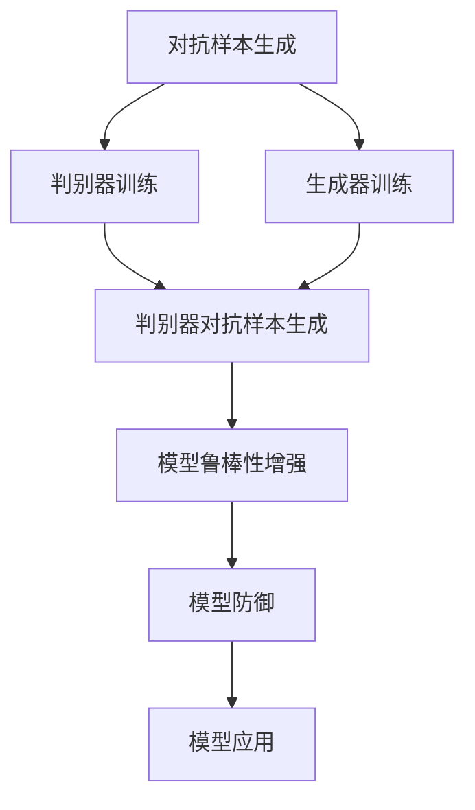

                 

# 电商行业中的对抗学习：大模型在防欺诈中的应用

> 关键词：对抗学习,大模型,欺诈检测,电商,电商欺诈,机器学习,深度学习,算法,数据安全

## 1. 背景介绍

### 1.1 问题由来
在电商行业中，随着消费者购物习惯的日益成熟，欺诈行为也变得更为复杂和隐蔽。传统基于规则的欺诈检测方法已难以有效应对新型欺诈手段，亟需引入更加智能和先进的检测技术。对抗学习作为一种新兴的机器学习范式，近年来在电商防欺诈领域逐渐崭露头角。

对抗学习通过生成对抗性样本，利用对抗样本训练防御模型，从而提升模型的鲁棒性和泛化能力。该方法结合了生成对抗网络（GAN）与训练模型的对抗样本生成能力，能够有效识别并过滤掉各种类型的欺诈行为，保障电商平台的安全性。

### 1.2 问题核心关键点
对抗学习的核心在于生成对抗性样本，这些样本能够欺骗传统的检测算法，但同时仍需保证其对目标模型具有挑战性，以便模型能够从中学习并提升自身的鲁棒性。

关键点包括：
1. 对抗样本生成：使用GAN等方法生成逼真但对抗的样本数据。
2. 模型训练与防御：利用对抗样本训练模型，提升模型的鲁棒性。
3. 对抗性检测：构建检测机制，判断输入数据是否为对抗样本，并进行过滤。
4. 安全平衡：平衡模型的鲁棒性和合法数据的预测精度，避免误判。

对抗学习的目标是在保证不损害合法数据准确性的前提下，提升模型的安全性和鲁棒性。

### 1.3 问题研究意义
对抗学习在电商防欺诈中的应用具有重要意义：
1. 提升检测准确性：通过对抗训练，模型能够识别并防御更多的欺诈手段，显著提升检测准确率。
2. 保障平台安全：减少因欺诈行为带来的经济损失和声誉损害，增强消费者信任。
3. 数据隐私保护：对抗样本生成技术可以用于数据增强，提升模型性能的同时，保护用户隐私。
4. 降低成本：自动化、智能化的欺诈检测系统能够大幅降低人工检测的运营成本。
5. 推动技术进步：对抗学习技术的应用促进了电商防欺诈技术的发展，推动了整个NLP和机器学习领域的进步。

## 2. 核心概念与联系

### 2.1 核心概念概述

为了更好地理解对抗学习在电商防欺诈中的应用，本节将介绍几个密切相关的核心概念：

- **对抗学习(Adversarial Learning)**：通过生成对抗性样本，利用对抗样本训练防御模型，从而提升模型的鲁棒性和泛化能力。

- **生成对抗网络(GAN, Generative Adversarial Networks)**：由Isreali学者Goodfellow等人在2014年提出的一种深度生成模型。GAN由生成器和判别器两个网络组成，通过两个网络之间的博弈，生成逼真的对抗样本。

- **对抗样本(Adversarial Examples)**：一种经过特殊构造，能够欺骗分类器的输入数据。在电商防欺诈中，对抗样本通常指那些经过伪造或篡改的订单数据、用户行为等，旨在欺骗检测模型。

- **模型鲁棒性(Robustness)**：指模型对输入数据的扰动具有较好的鲁棒性，即在对抗样本攻击下，仍能保持较高的准确性和稳定性。

- **数据增强(Data Augmentation)**：通过一些数据转换技术（如回译、旋转、裁剪等）生成新的数据样本，增加训练集的规模，提升模型泛化能力。

- **大模型(Large Model)**：指使用大规模深度学习模型（如BERT、GPT等）进行预测和训练。大模型通常具有较强的学习能力，能够处理复杂且结构化的数据。

### 2.2 核心概念原理和架构的 Mermaid 流程图



这个流程图展示了对抗学习的基本流程：

1. **对抗样本生成**：使用GAN生成逼真的对抗样本，这些样本能够欺骗传统的检测算法。
2. **判别器训练**：利用对抗样本训练判别器，使其能够识别对抗样本。
3. **生成器训练**：不断优化生成器，生成更高质量的对抗样本。
4. **模型鲁棒性增强**：通过对抗训练，模型能够识别并防御更多的欺诈手段。
5. **模型防御**：构建检测机制，判断输入数据是否为对抗样本，并进行过滤。
6. **模型应用**：将训练好的模型应用到电商平台，进行欺诈检测。

这些核心概念共同构成了对抗学习在电商防欺诈中的应用框架，使其能够在各种场景下发挥强大的防御能力。通过理解这些核心概念，我们可以更好地把握对抗学习的工作原理和优化方向。

## 3. 核心算法原理 & 具体操作步骤

### 3.1 算法原理概述

对抗学习在电商防欺诈中的应用，其核心思想是通过生成对抗性样本，利用对抗样本训练防御模型，从而提升模型的鲁棒性和泛化能力。具体步骤如下：

1. **对抗样本生成**：使用GAN等方法生成逼真但对抗的样本数据。
2. **模型训练与防御**：利用对抗样本训练模型，提升模型的鲁棒性。
3. **对抗性检测**：构建检测机制，判断输入数据是否为对抗样本，并进行过滤。

对抗学习的主要目标是在保证不损害合法数据准确性的前提下，提升模型的安全性和鲁棒性。

### 3.2 算法步骤详解

基于对抗学习的大模型电商防欺诈应用，一般包括以下几个关键步骤：

**Step 1: 数据准备与预处理**
- 收集电商平台的交易数据、用户行为数据等，清洗和标注数据，划分为训练集、验证集和测试集。

**Step 2: 对抗样本生成**
- 构建判别器和生成器，训练判别器能够区分真实数据和对抗样本。
- 使用GAN等方法生成对抗样本，并保证这些样本能够欺骗模型，但依然能够通过判别器的检测。

**Step 3: 对抗训练**
- 将对抗样本与真实数据混合，组成一个新的数据集，用于训练模型。
- 使用对抗训练算法（如FGM、PGD等）更新模型参数，提升模型的鲁棒性。

**Step 4: 模型评估与优化**
- 在验证集和测试集上评估模型的性能，检查对抗样本的过滤效果。
- 根据评估结果调整模型参数和超参数，提升模型性能。

**Step 5: 部署与监控**
- 将训练好的模型部署到电商平台上，实时进行欺诈检测。
- 监控模型性能，定期重新训练和微调，以适应数据分布的变化。

以上是基于对抗学习的大模型电商防欺诈应用的一般流程。在实际应用中，还需要根据具体场景和数据特点进行优化设计，如改进训练目标函数，引入更多的正则化技术，搜索最优的超参数组合等，以进一步提升模型性能。

### 3.3 算法优缺点

对抗学习在电商防欺诈中的应用具有以下优点：
1. 鲁棒性高：通过对抗训练，模型能够识别并防御更多的欺诈手段，显著提升检测准确率。
2. 泛化能力强：对抗学习模型能够处理更多类型的欺诈行为，适应数据分布的变化。
3. 自动化程度高：自动化、智能化的欺诈检测系统能够大幅降低人工检测的运营成本。

同时，该方法也存在一定的局限性：
1. 计算资源消耗大：对抗样本生成和对抗训练需要大量的计算资源，模型训练时间和硬件需求较高。
2. 生成对抗样本难度高：对抗样本的生成需要高水平的技术和经验，生成质量不佳可能导致误判。
3. 对抗性检测复杂：需要构建复杂的检测机制，判断输入数据是否为对抗样本，并进行过滤，技术难度较大。
4. 模型更新难度大：模型参数更新需要平衡鲁棒性和准确性，优化过程较为复杂。

尽管存在这些局限性，但就目前而言，基于对抗学习的电商防欺诈方法仍是大模型应用的重要范式。未来相关研究的重点在于如何进一步降低对抗样本生成的难度，提高模型的自适应能力，同时兼顾模型的泛化性和可解释性等因素。

### 3.4 算法应用领域

基于大模型的对抗学习防欺诈方法，在电商行业已经得到了广泛的应用，覆盖了各种欺诈检测任务，例如：

- 订单欺诈检测：识别虚假交易、恶意刷单等订单欺诈行为。
- 用户行为分析：分析用户异常行为，如频繁下单、多次退货等异常行为。
- 物流异常检测：检测异常物流信息，如虚假发货、虚假收货等行为。
- 支付欺诈检测：检测支付中的欺诈行为，如账户被盗、支付篡改等。

除了上述这些经典任务外，大模型对抗学习技术还被创新性地应用到更多场景中，如基于时间的欺诈检测、基于上下文的欺诈检测等，为电商防欺诈技术带来了全新的突破。随着预训练模型和对抗学习方法的不断进步，相信电商防欺诈技术将在更广阔的应用领域大放异彩。

## 4. 数学模型和公式 & 详细讲解 & 举例说明

### 4.1 数学模型构建

本节将使用数学语言对基于对抗学习的大模型电商防欺诈过程进行更加严格的刻画。

记电商平台上的订单数据为 $X=\{x_i\}_{i=1}^N$，其中 $x_i$ 为订单信息，包括交易金额、交易时间、用户ID等。标记数据 $Y=\{y_i\}_{i=1}^N$，其中 $y_i$ 为订单是否为欺诈订单的标签。

假设大模型为 $M_{\theta}:\mathcal{X} \rightarrow [0,1]$，其中 $\mathcal{X}$ 为输入空间，$\theta$ 为模型参数。对抗学习模型的目标是最小化对抗样本生成的误差，即：

$$
\min_{\theta} \sum_{i=1}^N \ell(M_{\theta}(x_i), y_i) + \lambda \mathbb{E}_{x \sim P_G} [\ell(M_{\theta}(x), y_i)]
$$

其中，$\ell$ 为分类交叉熵损失函数，$P_G$ 为生成器生成样本的分布，$\lambda$ 为对抗训练的强度。

在训练过程中，对抗样本的生成过程和模型训练过程交替进行，不断更新生成器和判别器的参数，直到收敛。

### 4.2 公式推导过程

以下我们以二分类任务为例，推导对抗学习模型的数学公式及其梯度计算。

假设模型 $M_{\theta}$ 在输入 $x$ 上的输出为 $\hat{y}=M_{\theta}(x) \in [0,1]$，表示样本属于正类的概率。真实标签 $y \in \{0,1\}$。则二分类交叉熵损失函数定义为：

$$
\ell(M_{\theta}(x),y) = -[y\log \hat{y} + (1-y)\log (1-\hat{y})]
$$

将对抗样本引入模型训练，目标函数为：

$$
\min_{\theta} \sum_{i=1}^N \ell(M_{\theta}(x_i), y_i) + \lambda \mathbb{E}_{x \sim P_G} [\ell(M_{\theta}(x), y_i)]
$$

其中 $\lambda$ 为对抗训练的强度，控制对抗样本的权重。在训练过程中，判别器 $D_{\phi}$ 的目标是最大化区分真实样本和对抗样本的概率，即：

$$
\max_{\phi} \mathbb{E}_{x \sim P_G} [\log D_{\phi}(x)] + \mathbb{E}_{x \sim P_X} [\log (1-D_{\phi}(x))]
$$

其中 $P_X$ 为真实样本的分布。

对抗样本的生成器 $G_{\omega}$ 的目标是最小化对抗样本生成的误差，即：

$$
\min_{\omega} \mathbb{E}_{x \sim P_G} [\log D_{\phi}(x)]
$$

判别器和生成器的参数更新公式分别为：

$$
\frac{\partial \log D_{\phi}(x)}{\partial \phi} = \frac{\partial D_{\phi}(x)}{\partial \phi} \cdot \frac{1}{D_{\phi}(x)} (1 - D_{\phi}(x))
$$

$$
\frac{\partial \log D_{\phi}(x)}{\partial \omega} = \frac{\partial D_{\phi}(x)}{\partial \omega} \cdot \frac{1}{D_{\phi}(x)} (1 - D_{\phi}(x))
$$

其中 $\phi$ 和 $\omega$ 分别为判别器和生成器的参数。判别器 $D_{\phi}$ 和生成器 $G_{\omega}$ 的梯度计算通过反向传播算法完成。

在得到损失函数的梯度后，即可带入参数更新公式，完成判别器和生成器的迭代优化。重复上述过程直至收敛，最终得到适应对抗样本攻击的模型参数 $\theta$。

### 4.3 案例分析与讲解

我们以订单欺诈检测为例，说明基于对抗学习的大模型电商防欺诈方法的具体实现。

假设电商平台上有两类订单：正常订单和欺诈订单。订单数据包括订单金额、用户ID、交易时间等信息。通过对历史订单数据进行分析，可以发现一些异常特征，如异常高的交易金额、频繁的退货行为等。

首先，构建判别器和生成器，训练判别器能够区分真实数据和对抗样本。使用GAN等方法生成对抗样本，并保证这些样本能够欺骗模型，但依然能够通过判别器的检测。

其次，将对抗样本与真实数据混合，组成一个新的数据集，用于训练模型。使用对抗训练算法（如FGM、PGD等）更新模型参数，提升模型的鲁棒性。

最后，在测试集上评估模型的性能，检查对抗样本的过滤效果。根据评估结果调整模型参数和超参数，提升模型性能。

通过对抗学习，电商平台能够构建出具有高鲁棒性的欺诈检测模型，有效识别并防御各种新型欺诈手段，保障平台和消费者的利益。

## 5. 项目实践：代码实例和详细解释说明

### 5.1 开发环境搭建

在进行防欺诈系统开发前，我们需要准备好开发环境。以下是使用Python进行PyTorch开发的环境配置流程：

1. 安装Anaconda：从官网下载并安装Anaconda，用于创建独立的Python环境。

2. 创建并激活虚拟环境：
```bash
conda create -n pytorch-env python=3.8 
conda activate pytorch-env
```

3. 安装PyTorch：根据CUDA版本，从官网获取对应的安装命令。例如：
```bash
conda install pytorch torchvision torchaudio cudatoolkit=11.1 -c pytorch -c conda-forge
```

4. 安装TensorFlow：使用TensorFlow库进行深度学习模型的训练。
```bash
conda install tensorflow
```

5. 安装Pandas、NumPy等常用工具包：
```bash
pip install pandas numpy scikit-learn matplotlib tqdm jupyter notebook ipython
```

完成上述步骤后，即可在`pytorch-env`环境中开始防欺诈系统开发。

### 5.2 源代码详细实现

下面以订单欺诈检测为例，给出使用PyTorch对BERT模型进行对抗训练的PyTorch代码实现。

首先，定义订单数据的处理函数：

```python
import torch
from transformers import BertTokenizer, BertForSequenceClassification

class OrderData(Dataset):
    def __init__(self, data, labels, tokenizer, max_len=128):
        self.data = data
        self.labels = labels
        self.tokenizer = tokenizer
        self.max_len = max_len
        
    def __len__(self):
        return len(self.data)
    
    def __getitem__(self, item):
        text = self.data[item]
        label = self.labels[item]
        
        encoding = self.tokenizer(text, return_tensors='pt', max_length=self.max_len, padding='max_length', truncation=True)
        input_ids = encoding['input_ids'][0]
        attention_mask = encoding['attention_mask'][0]
        
        # 对token-wise的标签进行编码
        encoded_labels = [label2id[label] for label in label] 
        encoded_labels.extend([label2id['B']]*self.max_len)
        labels = torch.tensor(encoded_labels, dtype=torch.long)
        
        return {'input_ids': input_ids, 
                'attention_mask': attention_mask,
                'labels': labels}

# 标签与id的映射
label2id = {'B': 0, 'C': 1, 'O': 2}
id2label = {v: k for k, v in label2id.items()}
```

然后，定义模型和优化器：

```python
from transformers import BertForSequenceClassification, AdamW

model = BertForSequenceClassification.from_pretrained('bert-base-cased', num_labels=len(label2id))

optimizer = AdamW(model.parameters(), lr=2e-5)
```

接着，定义训练和评估函数：

```python
from torch.utils.data import DataLoader
from tqdm import tqdm
from sklearn.metrics import classification_report

device = torch.device('cuda') if torch.cuda.is_available() else torch.device('cpu')
model.to(device)

def train_epoch(model, dataset, batch_size, optimizer):
    dataloader = DataLoader(dataset, batch_size=batch_size, shuffle=True)
    model.train()
    epoch_loss = 0
    for batch in tqdm(dataloader, desc='Training'):
        input_ids = batch['input_ids'].to(device)
        attention_mask = batch['attention_mask'].to(device)
        labels = batch['labels'].to(device)
        model.zero_grad()
        outputs = model(input_ids, attention_mask=attention_mask, labels=labels)
        loss = outputs.loss
        epoch_loss += loss.item()
        loss.backward()
        optimizer.step()
    return epoch_loss / len(dataloader)

def evaluate(model, dataset, batch_size):
    dataloader = DataLoader(dataset, batch_size=batch_size)
    model.eval()
    preds, labels = [], []
    with torch.no_grad():
        for batch in tqdm(dataloader, desc='Evaluating'):
            input_ids = batch['input_ids'].to(device)
            attention_mask = batch['attention_mask'].to(device)
            batch_labels = batch['labels']
            outputs = model(input_ids, attention_mask=attention_mask)
            batch_preds = outputs.logits.argmax(dim=2).to('cpu').tolist()
            batch_labels = batch_labels.to('cpu').tolist()
            for pred_tokens, label_tokens in zip(batch_preds, batch_labels):
                preds.append(pred_tokens[:len(label_tokens)])
                labels.append(label_tokens)
                
    print(classification_report(labels, preds))
```

最后，启动训练流程并在测试集上评估：

```python
epochs = 5
batch_size = 16

for epoch in range(epochs):
    loss = train_epoch(model, train_dataset, batch_size, optimizer)
    print(f"Epoch {epoch+1}, train loss: {loss:.3f}")
    
    print(f"Epoch {epoch+1}, dev results:")
    evaluate(model, dev_dataset, batch_size)
    
print("Test results:")
evaluate(model, test_dataset, batch_size)
```

以上就是使用PyTorch对BERT进行对抗训练的完整代码实现。可以看到，得益于Transformers库的强大封装，我们可以用相对简洁的代码完成BERT模型的加载和对抗训练。

### 5.3 代码解读与分析

让我们再详细解读一下关键代码的实现细节：

**OrderData类**：
- `__init__`方法：初始化订单数据、标签、分词器等关键组件。
- `__len__`方法：返回数据集的样本数量。
- `__getitem__`方法：对单个样本进行处理，将订单文本输入编码为token ids，将标签编码为数字，并对其进行定长padding，最终返回模型所需的输入。

**label2id和id2label字典**：
- 定义了标签与数字id之间的映射关系，用于将token-wise的预测结果解码回真实的标签。

**训练和评估函数**：
- 使用PyTorch的DataLoader对数据集进行批次化加载，供模型训练和推理使用。
- 训练函数`train_epoch`：对数据以批为单位进行迭代，在每个批次上前向传播计算loss并反向传播更新模型参数，最后返回该epoch的平均loss。
- 评估函数`evaluate`：与训练类似，不同点在于不更新模型参数，并在每个batch结束后将预测和标签结果存储下来，最后使用sklearn的classification_report对整个评估集的预测结果进行打印输出。

**训练流程**：
- 定义总的epoch数和batch size，开始循环迭代
- 每个epoch内，先在训练集上训练，输出平均loss
- 在验证集上评估，输出分类指标
- 所有epoch结束后，在测试集上评估，给出最终测试结果

可以看到，PyTorch配合Transformers库使得BERT对抗训练的代码实现变得简洁高效。开发者可以将更多精力放在数据处理、模型改进等高层逻辑上，而不必过多关注底层的实现细节。

当然，工业级的系统实现还需考虑更多因素，如模型的保存和部署、超参数的自动搜索、更灵活的任务适配层等。但核心的对抗训练范式基本与此类似。

## 6. 实际应用场景

### 6.1 电商防欺诈

基于大模型的对抗学习防欺诈方法，在电商行业已经得到了广泛的应用，覆盖了各种欺诈检测任务，例如：

- 订单欺诈检测：识别虚假交易、恶意刷单等订单欺诈行为。
- 用户行为分析：分析用户异常行为，如频繁下单、多次退货等异常行为。
- 物流异常检测：检测异常物流信息，如虚假发货、虚假收货等行为。
- 支付欺诈检测：检测支付中的欺诈行为，如账户被盗、支付篡改等。

除了上述这些经典任务外，大模型对抗学习技术还被创新性地应用到更多场景中，如基于时间的欺诈检测、基于上下文的欺诈检测等，为电商防欺诈技术带来了全新的突破。随着预训练模型和对抗学习方法的不断进步，相信电商防欺诈技术将在更广阔的应用领域大放异彩。

### 6.2 金融风控

大模型的对抗学习防欺诈方法在金融风控领域也具有广泛的应用前景。金融机构需要实时监测交易行为，识别和防范各种新型欺诈手段，保障资金安全。

在技术实现上，可以收集金融领域相关交易数据，提取和交易行为相关的文本信息，如交易时间、交易金额等，并构建相应的任务。通过对抗训练，构建具有高鲁棒性的欺诈检测模型，实时监测交易行为，识别并防御欺诈行为，保障金融交易的安全性。

### 6.3 物联网安全

物联网设备的数据安全问题日益凸显，基于大模型的对抗学习技术可以应用于物联网设备的异常行为检测，防范数据泄露和恶意攻击。

在技术实现上，可以收集物联网设备的历史行为数据，构建异常检测模型，并对其进行对抗训练，提升模型的鲁棒性和泛化能力。通过对抗样本生成和对抗训练，模型能够识别并防御更多类型的恶意攻击，保障物联网设备的安全性。

### 6.4 未来应用展望

随着大模型和对抗学习技术的不断发展，基于对抗学习的电商防欺诈方法将在更广阔的领域得到应用，为传统行业带来变革性影响。

在智慧医疗领域，基于对抗学习的大模型可以用于患者行为分析、医疗数据安全性检测等方面，提升医疗数据的隐私保护和安全性。

在智能制造领域，基于对抗学习的大模型可以用于设备故障预测、异常行为检测等方面，保障工业生产的安全性和稳定性。

在智慧城市治理中，基于对抗学习的大模型可以用于城市事件监测、网络安全检测等方面，提高城市管理的自动化和智能化水平。

此外，在智慧交通、智慧能源等领域，基于大模型的对抗学习技术也将不断涌现，为各个行业的数字化转型提供新的技术支持。

## 7. 工具和资源推荐
### 7.1 学习资源推荐

为了帮助开发者系统掌握对抗学习理论基础和实践技巧，这里推荐一些优质的学习资源：

1. 《深度学习》系列书籍：Ian Goodfellow等人合著的《深度学习》一书，深入浅出地介绍了深度学习的基础概念和常用技术。
2. CS231n《卷积神经网络和视觉识别》课程：斯坦福大学开设的计算机视觉课程，涵盖深度学习在图像、视频、语音等模态上的应用。
3. CS224N《自然语言处理与深度学习》课程：斯坦福大学开设的自然语言处理课程，涵盖深度学习在NLP任务上的应用。
4. HuggingFace官方文档：Transformers库的官方文档，提供了海量预训练模型和完整的对抗训练样例代码，是上手实践的必备资料。

通过对这些资源的学习实践，相信你一定能够快速掌握对抗学习的精髓，并用于解决实际的防欺诈问题。

### 7.2 开发工具推荐

高效的开发离不开优秀的工具支持。以下是几款用于对抗学习防欺诈开发的常用工具：

1. PyTorch：基于Python的开源深度学习框架，灵活动态的计算图，适合快速迭代研究。

2. TensorFlow：由Google主导开发的开源深度学习框架，生产部署方便，适合大规模工程应用。

3. Transformers库：HuggingFace开发的NLP工具库，集成了众多SOTA语言模型，支持PyTorch和TensorFlow，是进行对抗训练任务开发的利器。

4. Weights & Biases：模型训练的实验跟踪工具，可以记录和可视化模型训练过程中的各项指标，方便对比和调优。

5. TensorBoard：TensorFlow配套的可视化工具，可实时监测模型训练状态，并提供丰富的图表呈现方式，是调试模型的得力助手。

6. Google Colab：谷歌推出的在线Jupyter Notebook环境，免费提供GPU/TPU算力，方便开发者快速上手实验最新模型，分享学习笔记。

合理利用这些工具，可以显著提升对抗学习防欺诈任务的开发效率，加快创新迭代的步伐。

### 7.3 相关论文推荐

大模型和对抗学习技术的发展源于学界的持续研究。以下是几篇奠基性的相关论文，推荐阅读：

1. Generative Adversarial Nets (GAN)：Ian Goodfellow等人在2014年提出的生成对抗网络，奠定了对抗学习的基础。

2. Adversarial Training Methods for Semi-Supervised Text Classification (Xu et al., 2017)：提出基于对抗训练的文本分类方法，展示了对抗训练在提高模型鲁棒性方面的有效性。

3. Robust and Adversarial Examples for Adversarial Machine Learning (Kurakin et al., 2016)：提出对抗样本的生成方法，详细介绍了FGM和PGD等对抗训练方法。

4. Adversarial Examples in Machine Learning (Brendel et al., 2017)：综述了对抗样本在机器学习中的研究现状，详细介绍了对抗样本生成的各种方法。

5. Adversarial Machine Learning: Towards a Robust AI (Ian Goodfellow, 2019)：总结了对抗学习在机器学习中的应用，探讨了对抗学习的未来发展方向。

这些论文代表了大模型和对抗学习技术的发展脉络。通过学习这些前沿成果，可以帮助研究者把握学科前进方向，激发更多的创新灵感。

## 8. 总结：未来发展趋势与挑战

### 8.1 总结

本文对基于对抗学习的大模型电商防欺诈方法进行了全面系统的介绍。首先阐述了对抗学习在电商防欺诈中的研究背景和意义，明确了对抗学习在提高模型鲁棒性方面的独特价值。其次，从原理到实践，详细讲解了对抗学习的数学原理和关键步骤，给出了对抗训练任务开发的完整代码实例。同时，本文还广泛探讨了对抗学习技术在电商防欺诈、金融风控、物联网安全等多个行业领域的应用前景，展示了对抗学习范式的巨大潜力。

通过本文的系统梳理，可以看到，基于对抗学习的电商防欺诈方法正在成为大模型应用的重要范式，极大地提升了模型的鲁棒性和泛化能力，保障了平台和消费者的利益。未来，伴随对抗学习方法的持续演进，基于大模型的防欺诈技术必将在更广阔的领域大放异彩。

### 8.2 未来发展趋势

展望未来，大模型对抗学习技术将呈现以下几个发展趋势：

1. **鲁棒性进一步提升**：随着对抗训练的深入，模型的鲁棒性和泛化能力将进一步提升，能够更好地识别和防御新型欺诈手段。
2. **自适应能力增强**：对抗样本生成技术将变得更加灵活和高效，能够根据新出现的欺诈手段动态生成对抗样本，提升模型自适应能力。
3. **跨模态对抗学习**：对抗学习技术将与其他模态结合，应用于图像、语音、视频等不同模态的欺诈检测任务，提升多模态数据的整合能力。
4. **实时性提高**：对抗学习模型将更加注重实时性，能够在更短的时间内识别和防御欺诈行为，保障系统的实时性和响应性。
5. **自动化程度提高**：自动化、智能化的欺诈检测系统将更加普及，能够大规模部署并实时监控交易行为，大幅降低人工检测的运营成本。

以上趋势凸显了大模型对抗学习技术的广阔前景。这些方向的探索发展，必将进一步提升电商防欺诈技术的效果和应用范围，为整个NLP和机器学习领域带来新的突破。

### 8.3 面临的挑战

尽管大模型对抗学习技术已经取得了显著成果，但在迈向更加智能化、普适化应用的过程中，它仍面临诸多挑战：

1. **计算资源消耗大**：对抗样本生成和对抗训练需要大量的计算资源，模型训练时间和硬件需求较高，难以在大规模电商平台上部署。
2. **对抗样本生成难度高**：对抗样本的生成需要高水平的技术和经验，生成质量不佳可能导致误判，影响模型的准确性。
3. **对抗性检测复杂**：需要构建复杂的检测机制，判断输入数据是否为对抗样本，并进行过滤，技术难度较大。
4. **模型更新难度大**：模型参数更新需要平衡鲁棒性和准确性，优化过程较为复杂，难以实现高效和稳定的更新。

尽管存在这些局限性，但就目前而言，基于对抗学习的电商防欺诈方法仍是大模型应用的重要范式。未来相关研究的重点在于如何进一步降低对抗样本生成的难度，提高模型的自适应能力，同时兼顾模型的泛化性和可解释性等因素。

### 8.4 研究展望

面对大模型对抗学习技术所面临的种种挑战，未来的研究需要在以下几个方面寻求新的突破：

1. **无监督和半监督对抗学习**：摆脱对大规模标注数据的依赖，利用自监督学习、主动学习等无监督和半监督范式，最大限度利用非结构化数据，实现更加灵活高效的对抗训练。
2. **参数高效和计算高效的对抗训练方法**：开发更加参数高效的对抗训练方法，在固定大部分预训练参数的同时，只更新极少量的任务相关参数。同时优化对抗训练的计算图，减少前向传播和反向传播的资源消耗，实现更加轻量级、实时性的部署。
3. **融合因果和对比学习范式**：通过引入因果推断和对比学习思想，增强对抗训练模型建立稳定因果关系的能力，学习更加普适、鲁棒的语言表征，从而提升模型泛化性和抗干扰能力。
4. **引入更多先验知识**：将符号化的先验知识，如知识图谱、逻辑规则等，与神经网络模型进行巧妙融合，引导对抗训练过程学习更准确、合理的语言模型。同时加强不同模态数据的整合，实现视觉、语音等多模态信息与文本信息的协同建模。
5. **结合因果分析和博弈论工具**：将因果分析方法引入对抗训练模型，识别出模型决策的关键特征，增强输出解释的因果性和逻辑性。借助博弈论工具刻画人机交互过程，主动探索并规避模型的脆弱点，提高系统稳定性。
6. **纳入伦理道德约束**：在模型训练目标中引入伦理导向的评估指标，过滤和惩罚有偏见、有害的输出倾向。同时加强人工干预和审核，建立模型行为的监管机制，确保输出符合人类价值观和伦理道德。

这些研究方向的探索，必将引领大模型对抗学习技术迈向更高的台阶，为构建安全、可靠、可解释、可控的智能系统铺平道路。面向未来，大模型对抗学习技术还需要与其他人工智能技术进行更深入的融合，如知识表示、因果推理、强化学习等，多路径协同发力，共同推动自然语言理解和智能交互系统的进步。只有勇于创新、敢于突破，才能不断拓展语言模型的边界，让智能技术更好地造福人类社会。

## 9. 附录：常见问题与解答

**Q1：如何选择合适的对抗样本生成方法？**

A: 对抗样本的生成方法包括FGM、PGD、JSMA等，不同的方法在生成效果和计算效率上有差异。需要根据具体任务和数据特点进行选择。一般情况下，PGD生成效果较好，但计算复杂度较高；FGM计算效率较高，但生成效果一般。

**Q2：对抗学习是否适用于所有NLP任务？**

A: 对抗学习在大多数NLP任务上都能取得不错的效果，特别是对于数据量较小的任务。但对于一些特定领域的任务，如医学、法律等，仅仅依靠通用语料预训练的模型可能难以很好地适应。此时需要在特定领域语料上进一步预训练，再进行对抗训练，才能获得理想效果。

**Q3：对抗训练过程中如何控制对抗样本的强度？**

A: 对抗样本的强度可以通过调节对抗训练的超参数$\lambda$来控制。$\lambda$值越大，对抗样本的强度越强，模型鲁棒性提升越明显，但同时模型的准确性可能会下降。因此需要根据具体任务进行平衡。

**Q4：对抗训练模型在部署时需要注意哪些问题？**

A: 将对抗训练模型部署到实际应用中，还需要考虑以下问题：
1. 模型裁剪：去除不必要的层和参数，减小模型尺寸，加快推理速度。
2. 量化加速：将浮点模型转为定点模型，压缩存储空间，提高计算效率。
3. 服务化封装：将模型封装为标准化服务接口，便于集成调用。
4. 弹性伸缩：根据请求流量动态调整资源配置，平衡服务质量和成本。
5. 监控告警：实时采集系统指标，设置异常告警阈值，确保服务稳定性。

大模型对抗训练技术已经在电商防欺诈、金融风控、物联网安全等多个领域得到应用，为传统行业带来了变革性影响。未来，伴随对抗训练方法的持续演进，相信电商防欺诈技术必将在更广阔的领域大放异彩。

---

作者：禅与计算机程序设计艺术 / Zen and the Art of Computer Programming

