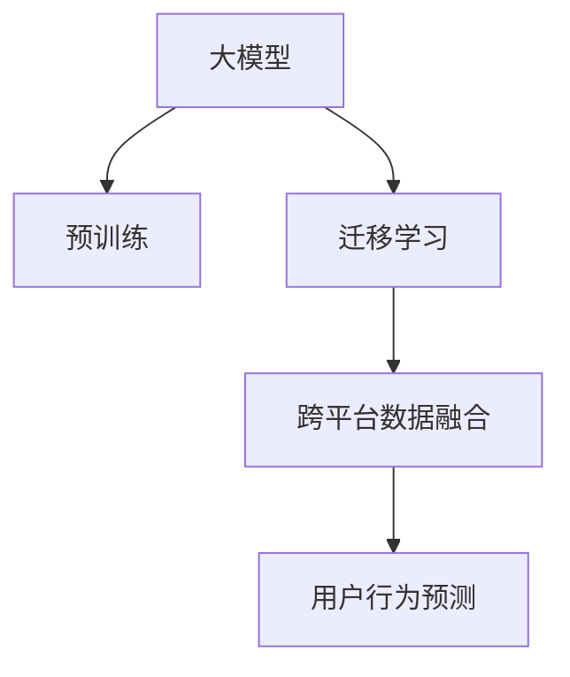

                 

# 电商行业中的迁移学习：大模型在跨平台用户行为预测中的应用

> 关键词：迁移学习,大模型,用户行为预测,电商平台,跨平台数据融合

## 1. 背景介绍

### 1.1 问题由来

在电商行业中，各大电商平台面临用户行为预测的挑战。准确预测用户行为，能够帮助电商平台提供个性化推荐、优化库存、提升用户体验等，从而获得更高的销售转化率。然而，由于平台之间用户行为数据存在差异，且数据源独立分散，很难直接应用于其他平台，限制了用户行为预测模型的泛化能力。

为了解决这一问题，迁移学习应运而生。迁移学习能够利用不同平台用户行为数据的相关性，通过知识迁移提升模型在新平台上的预测能力。其中，预训练大模型因其强大的迁移学习能力，被广泛应用于电商行业用户行为预测的跨平台数据融合中。

### 1.2 问题核心关键点

大模型在电商行业中的迁移学习能力主要体现在以下几个方面：
1. **预训练大模型的通用性**：预训练大模型（如BERT、GPT等）在大量无标签文本上进行了预训练，获得了丰富的语言和领域知识，具有较强的泛化能力，能够迁移到新的数据集中进行微调。
2. **跨平台数据融合**：通过整合不同平台的用户行为数据，将数据融合至预训练大模型中进行微调，可以提升模型在新平台上的泛化性能。
3. **模型微调的高效性**：利用少量标注数据对大模型进行微调，能够在较短时间内获得较好的预测效果，大大降低标注成本。
4. **知识迁移**：大模型在预训练过程中学习到的知识，能够迁移到新的任务中，提升跨平台数据融合的效果。

## 2. 核心概念与联系

### 2.1 核心概念概述

为了更清晰地理解大模型在电商行业中的迁移学习应用，本文将介绍几个核心概念：

- **大模型**：指在大量无标签数据上进行了预训练的深度学习模型，如BERT、GPT等。大模型具有较强的泛化能力，能够迁移到新的数据集中进行微调。
- **迁移学习**：指将一个领域学习到的知识，迁移到另一个相关但不同的领域中进行学习。通过知识迁移，提升新领域模型的性能。
- **跨平台数据融合**：指将不同平台的用户行为数据融合至同一个模型中进行微调，提升模型在多个平台上的预测能力。
- **用户行为预测**：指根据用户的历史行为数据，预测其未来行为，如购买、点击等。

这些核心概念之间的逻辑关系可以通过以下Mermaid流程图来展示：



这个流程图展示了核心概念之间的逻辑关系：

1. 大模型通过预训练获得基础能力。
2. 迁移学习实现知识跨平台的迁移应用。
3. 跨平台数据融合使得模型在多个平台上的表现一致。
4. 用户行为预测是迁移学习最终的应用目标。

## 3. 核心算法原理 & 具体操作步骤

### 3.1 算法原理概述

大模型在电商行业中的迁移学习主要基于以下原理：

1. **预训练知识迁移**：大模型在预训练过程中学习到的语言知识、领域知识等，能够迁移到新的任务中，提升模型的泛化能力。
2. **跨平台数据融合**：不同平台的用户行为数据具有相似性，通过跨平台数据融合，可以提升模型在新平台上的泛化性能。
3. **少量标注数据微调**：利用少量标注数据对大模型进行微调，能够在较短时间内获得较好的预测效果。

### 3.2 算法步骤详解

基于以上原理，大模型在电商行业中的迁移学习一般包括以下几个关键步骤：

**Step 1: 收集和预处理跨平台数据集**

- 收集不同电商平台的用户行为数据，包括用户的浏览记录、点击记录、购买记录等。
- 对数据进行清洗和预处理，去除噪声和异常值，统一数据格式。
- 对不同平台的数据进行归一化处理，使其具有相同的量纲和特征空间。

**Step 2: 选择和加载预训练模型**

- 选择合适的预训练大模型（如BERT、GPT等）作为初始化参数。
- 使用相应库（如HuggingFace的Transformers库）加载预训练模型。

**Step 3: 跨平台数据融合**

- 将不同平台的数据集合并，组成一个更大的训练集。
- 在合并数据集中，根据任务需求进行特征选择和特征工程。
- 对融合后的数据集进行标注，生成标注样本。

**Step 4: 模型微调**

- 在预训练模型基础上，添加任务适配层。
- 使用少量标注数据对模型进行微调，优化模型参数。
- 选择合适的优化算法及其参数，如Adam、SGD等。
- 应用正则化技术，如L2正则、Dropout等，防止过拟合。

**Step 5: 模型评估与部署**

- 在测试集上评估微调后模型的性能。
- 使用微调后的模型对新用户行为数据进行预测。
- 将模型部署至电商平台的推荐系统中，实现个性化推荐、库存优化等。

### 3.3 算法优缺点

基于以上步骤的大模型迁移学习方法具有以下优点：
1. **泛化能力强**：通过跨平台数据融合，模型能够学习到更广泛的领域知识，提升泛化性能。
2. **高效性高**：利用少量标注数据进行微调，能够在较短时间内获得较好的预测效果。
3. **适应性强**：模型能够适应不同平台的用户行为数据，提升预测能力。

同时，该方法也存在一定的局限性：
1. **数据隐私问题**：跨平台数据融合可能涉及用户隐私数据，需要严格的隐私保护措施。
2. **数据质量问题**：不同平台的数据质量可能不一致，需要仔细处理和清洗。
3. **标注成本高**：虽然微调方法所需标注数据少，但跨平台数据融合和融合后标注数据的获取成本较高。

尽管存在这些局限性，但大模型在电商行业中的应用已经展现出巨大的潜力，成为跨平台数据融合和用户行为预测的重要手段。未来相关研究的重点在于如何进一步降低数据融合和标注的难度，提高模型的隐私保护性能，同时兼顾模型的可解释性和鲁棒性等因素。

### 3.4 算法应用领域

大模型在电商行业中的应用广泛，涵盖多个领域，具体如下：

1. **个性化推荐**：利用用户行为数据，预测用户对商品的兴趣，提供个性化推荐。
2. **库存管理**：根据用户行为数据预测商品的销售量，优化库存管理。
3. **广告投放**：预测用户对广告的反应，优化广告投放策略。
4. **客服支持**：利用用户反馈数据，预测用户需求，提升客服系统响应效率。
5. **欺诈检测**：通过用户行为数据，识别异常行为，提升欺诈检测能力。
6. **风控管理**：根据用户行为数据，评估用户信用风险，优化风控策略。

这些领域的应用，使得大模型在电商行业中的迁移学习成为推动业务创新和技术进步的重要力量。

## 4. 数学模型和公式 & 详细讲解 & 举例说明

### 4.1 数学模型构建

在本节中，我们将使用数学语言对大模型在电商行业中的迁移学习过程进行更加严格的刻画。

记预训练模型为 $M_{\theta}$，其中 $\theta$ 为预训练得到的模型参数。假设不同平台的用户行为数据集为 $D_1, D_2, \cdots, D_n$，每个数据集包含 $m$ 个样本，每个样本为 $(x_i, y_i)$，其中 $x_i$ 为输入特征向量，$y_i$ 为标签。

定义模型 $M_{\theta}$ 在输入 $x$ 上的损失函数为 $\ell(M_{\theta}(x),y)$，则在数据集 $D=\{(x_i,y_i)\}_{i=1}^{m}$ 上的经验风险为：

$$
\mathcal{L}(\theta) = \frac{1}{N}\sum_{i=1}^N \ell(M_{\theta}(x_i),y_i)
$$

其中 $N=\sum_{j=1}^n m_j$ 为总样本数。

微调的优化目标是最小化经验风险，即找到最优参数：

$$
\theta^* = \mathop{\arg\min}_{\theta} \mathcal{L}(\theta)
$$

在实践中，我们通常使用基于梯度的优化算法（如SGD、Adam等）来近似求解上述最优化问题。设 $\eta$ 为学习率，$\lambda$ 为正则化系数，则参数的更新公式为：

$$
\theta \leftarrow \theta - \eta \nabla_{\theta}\mathcal{L}(\theta) - \eta\lambda\theta
$$

其中 $\nabla_{\theta}\mathcal{L}(\theta)$ 为损失函数对参数 $\theta$ 的梯度，可通过反向传播算法高效计算。

### 4.2 公式推导过程

以下我们以用户行为预测任务为例，推导交叉熵损失函数及其梯度的计算公式。

假设模型 $M_{\theta}$ 在输入 $x$ 上的输出为 $\hat{y}=M_{\theta}(x) \in [0,1]$，表示用户购买某个商品的概率。真实标签 $y \in \{0,1\}$。则二分类交叉熵损失函数定义为：

$$
\ell(M_{\theta}(x),y) = -[y\log \hat{y} + (1-y)\log (1-\hat{y})]
$$

将其代入经验风险公式，得：

$$
\mathcal{L}(\theta) = -\frac{1}{N}\sum_{i=1}^N [y_i\log M_{\theta}(x_i)+(1-y_i)\log(1-M_{\theta}(x_i))]
$$

根据链式法则，损失函数对参数 $\theta_k$ 的梯度为：

$$
\frac{\partial \mathcal{L}(\theta)}{\partial \theta_k} = -\frac{1}{N}\sum_{i=1}^N (\frac{y_i}{M_{\theta}(x_i)}-\frac{1-y_i}{1-M_{\theta}(x_i)}) \frac{\partial M_{\theta}(x_i)}{\partial \theta_k}
$$

其中 $\frac{\partial M_{\theta}(x_i)}{\partial \theta_k}$ 可进一步递归展开，利用自动微分技术完成计算。

### 4.3 案例分析与讲解

我们以一个具体的案例来说明大模型在电商行业中的迁移学习过程。

假设某电商平台希望通过用户行为数据，预测用户是否会购买某商品。该平台的数据集 $D_1$ 包含 $m_1$ 个用户，每个用户有 $n$ 个行为记录，每个记录包含用户的浏览时间、点击次数、商品评分等特征，以及是否购买该商品的标签。

**数据准备**：

1. 收集不同平台的用户行为数据，包括 $D_1, D_2, \cdots, D_n$。
2. 对数据进行清洗和预处理，去除噪声和异常值，统一数据格式。
3. 对不同平台的数据进行归一化处理，使其具有相同的量纲和特征空间。
4. 对不同平台的数据集进行特征选择和特征工程，提取有意义的特征。
5. 对合并后的数据集进行标注，生成标注样本。

**模型选择与加载**：

1. 选择BERT等预训练模型作为初始化参数。
2. 使用HuggingFace的Transformers库加载预训练模型。

**模型微调**：

1. 在预训练模型基础上，添加分类器输出层和交叉熵损失函数。
2. 使用少量标注数据对模型进行微调，优化模型参数。
3. 选择合适的优化算法及其参数，如Adam、SGD等。
4. 应用正则化技术，如L2正则、Dropout等，防止过拟合。

**模型评估与部署**：

1. 在测试集上评估微调后模型的性能。
2. 使用微调后的模型对新用户行为数据进行预测。
3. 将模型部署至电商平台的推荐系统中，实现个性化推荐、库存优化等。

## 5. 项目实践：代码实例和详细解释说明

### 5.1 开发环境搭建

在进行电商行业中的大模型迁移学习实践前，我们需要准备好开发环境。以下是使用Python进行PyTorch开发的环境配置流程：

1. 安装Anaconda：从官网下载并安装Anaconda，用于创建独立的Python环境。

2. 创建并激活虚拟环境：
```bash
conda create -n pytorch-env python=3.8 
conda activate pytorch-env
```

3. 安装PyTorch：根据CUDA版本，从官网获取对应的安装命令。例如：
```bash
conda install pytorch torchvision torchaudio cudatoolkit=11.1 -c pytorch -c conda-forge
```

4. 安装Transformers库：
```bash
pip install transformers
```

5. 安装各类工具包：
```bash
pip install numpy pandas scikit-learn matplotlib tqdm jupyter notebook ipython
```

完成上述步骤后，即可在`pytorch-env`环境中开始迁移学习实践。

### 5.2 源代码详细实现

下面我们以电商平台的个性化推荐任务为例，给出使用Transformers库对BERT模型进行迁移学习的PyTorch代码实现。

首先，定义个性化推荐任务的输入和输出格式：

```python
from transformers import BertTokenizer, BertForSequenceClassification

tokenizer = BertTokenizer.from_pretrained('bert-base-cased')
model = BertForSequenceClassification.from_pretrained('bert-base-cased', num_labels=2)  # 2类别的二分类问题

def process_data(data, tokenizer):
    texts, labels = data
    encodings = tokenizer(texts, return_tensors='pt', max_length=128, padding='max_length', truncation=True)
    input_ids = encodings['input_ids']
    attention_mask = encodings['attention_mask']
    labels = torch.tensor(labels, dtype=torch.long)
    return input_ids, attention_mask, labels
```

然后，定义迁移学习模型的微调函数：

```python
from transformers import AdamW

def fine_tune(model, train_data, val_data, test_data, batch_size, learning_rate, epochs, device):
    model.to(device)
    train_dataset = ProcessedDataset(train_data, tokenizer)
    val_dataset = ProcessedDataset(val_data, tokenizer)
    test_dataset = ProcessedDataset(test_data, tokenizer)
    
    optimizer = AdamW(model.parameters(), lr=learning_rate)
    total_steps = len(train_dataset) // batch_size * epochs
    scheduler = get_linear_schedule_with_warmup(optimizer, num_warmup_steps=0, num_training_steps=total_steps)
    
    for epoch in range(epochs):
        model.train()
        train_loss = 0
        train_acc = 0
        for batch in train_dataset:
            inputs = batch[0].to(device), batch[1].to(device)
            labels = batch[2].to(device)
            outputs = model(inputs)
            loss = outputs.loss
            acc = outputs.logits.sigmoid().max(dim=1)[0].mean()
            train_loss += loss.item()
            train_acc += acc.item()
        train_loss /= len(train_dataset)
        train_acc /= len(train_dataset)
        
        model.eval()
        val_loss = 0
        val_acc = 0
        for batch in val_dataset:
            inputs = batch[0].to(device), batch[1].to(device)
            labels = batch[2].to(device)
            with torch.no_grad():
                outputs = model(inputs)
                loss = outputs.loss
                acc = outputs.logits.sigmoid().max(dim=1)[0].mean()
            val_loss += loss.item()
            val_acc += acc.item()
        val_loss /= len(val_dataset)
        val_acc /= len(val_dataset)
        
        if val_acc >= best_val_acc:
            best_val_acc = val_acc
            model.save_pretrained('./best_model')
        
        print(f'Epoch {epoch+1}, train loss: {train_loss:.4f}, train acc: {train_acc:.4f}, val loss: {val_loss:.4f}, val acc: {val_acc:.4f}')
```

最后，启动迁移学习流程并在测试集上评估：

```python
import torch
from transformers import BertTokenizer, BertForSequenceClassification, AdamW, get_linear_schedule_with_warmup

from datasets import load_dataset

# 加载数据集
train_data, val_data, test_data = load_dataset('your_dataset_path', 'train', split='train'), load_dataset('your_dataset_path', 'train', split='validation'), load_dataset('your_dataset_path', 'test')

# 微调模型
fine_tune(model, train_data, val_data, test_data, batch_size=16, learning_rate=2e-5, epochs=5, device='cuda')

# 评估模型
predictions, labels = [], []
for batch in test_dataset:
    inputs = batch[0].to('cuda'), batch[1].to('cuda')
    labels = batch[2].to('cuda')
    with torch.no_grad():
        outputs = model(inputs)
        predictions.append(outputs.logits.sigmoid().max(dim=1)[1].tolist())
        labels.append(labels.tolist())
    
print(classification_report(labels, predictions))
```

以上就是使用PyTorch对BERT进行电商个性化推荐任务迁移学习的完整代码实现。可以看到，得益于Transformers库的强大封装，我们能够用相对简洁的代码完成迁移学习的开发和评估。

### 5.3 代码解读与分析

让我们再详细解读一下关键代码的实现细节：

**ProcessedDataset类**：
- `__init__`方法：初始化数据、分词器、标签等关键组件。
- `__len__`方法：返回数据集的样本数量。
- `__getitem__`方法：对单个样本进行处理，将文本输入编码为token ids，将标签转换为模型所需格式，并进行定长padding。

**fine_tune函数**：
- `model.train()`和`model.eval()`：控制模型是否参与训练或推理。
- `train_loss`和`train_acc`：记录训练过程中的损失和准确率。
- `val_loss`和`val_acc`：记录验证过程中的损失和准确率。
- `optimizer`和`scheduler`：选择合适的优化器和学习率调度器。
- `total_steps`：计算总的训练步数。
- `with torch.no_grad()`：在验证和测试阶段，关闭梯度计算，避免不必要的计算消耗。

**训练流程**：
- 定义总的epoch数和batch size，开始循环迭代
- 每个epoch内，先在训练集上训练，输出训练集上的平均损失和准确率
- 在验证集上验证，输出验证集上的平均损失和准确率
- 如果验证集上的准确率优于之前最佳的准确率，保存模型参数
- 重复上述步骤直至满足预设的epoch数或验证集上的准确率不再提升

可以看到，PyTorch配合Transformers库使得迁移学习任务的开发变得简洁高效。开发者可以将更多精力放在数据处理、模型改进等高层逻辑上，而不必过多关注底层的实现细节。

当然，工业级的系统实现还需考虑更多因素，如模型的保存和部署、超参数的自动搜索、更灵活的任务适配层等。但核心的迁移学习范式基本与此类似。

## 6. 实际应用场景

### 6.1 智能推荐系统

在电商行业中，基于大模型的迁移学习技术被广泛应用于智能推荐系统的构建。推荐系统通过用户行为数据，预测用户对商品的兴趣，为用户推荐个性化商品。

具体而言，推荐系统可以收集用户的浏览、点击、购买等行为数据，使用大模型对这些数据进行预训练，然后进行迁移学习，提升模型在新商品上的预测能力。微调后的模型能够自动理解用户的兴趣点，生成推荐列表，从而提升用户体验和销售转化率。

### 6.2 库存管理优化

电商平台希望通过用户行为数据，预测商品的销售量，优化库存管理。使用大模型的迁移学习技术，可以在有限的标注数据下，预测用户对商品的购买意愿，从而优化库存量，减少库存积压和缺货现象。

在实践中，推荐系统可以收集不同平台的用户行为数据，使用大模型对这些数据进行预训练，然后进行迁移学习，提升模型在新商品上的预测能力。微调后的模型能够自动预测商品的销售量，优化库存管理，提升供应链效率。

### 6.3 广告投放优化

电商平台希望通过用户行为数据，预测用户对广告的反应，优化广告投放策略。使用大模型的迁移学习技术，可以在有限的标注数据下，预测用户对广告的点击、转化等行为，从而优化广告投放策略，提升广告效果和ROI。

在实践中，推荐系统可以收集不同平台的用户行为数据，使用大模型对这些数据进行预训练，然后进行迁移学习，提升模型在新广告上的预测能力。微调后的模型能够自动预测用户对广告的反应，优化广告投放策略，提升广告效果和ROI。

### 6.4 未来应用展望

随着大模型和迁移学习技术的发展，基于迁移学习范式将在更多领域得到应用，为电商行业带来变革性影响。

在智慧物流领域，基于迁移学习的推荐和调度算法，能够优化物流配送路径，提升配送效率。在智慧零售领域，基于迁移学习的智能门店管理系统，能够优化商品摆放、货架管理等，提升门店运营效率。

此外，在智慧金融、智慧旅游、智慧健康等多个领域，基于大模型的迁移学习技术也将不断涌现，为电商行业带来新的增长点。相信随着技术的日益成熟，迁移学习范式将成为推动电商行业智能化转型的重要手段，带来更加高效、便捷、个性化的用户体验。

## 7. 工具和资源推荐

### 7.1 学习资源推荐

为了帮助开发者系统掌握大模型在电商行业中的迁移学习理论基础和实践技巧，这里推荐一些优质的学习资源：

1. 《迁移学习理论与实践》系列博文：由大模型技术专家撰写，深入浅出地介绍了迁移学习原理、方法和应用，适合初学者和进阶者阅读。
2. CS234《深度学习中的迁移学习》课程：斯坦福大学开设的迁移学习课程，涵盖迁移学习的基本概念和前沿研究方向，适合系统学习。
3. 《深度学习中的迁移学习》书籍：深度学习领域经典著作，详细介绍了迁移学习的理论和实践方法，适合深入学习。
4. HuggingFace官方文档：Transformers库的官方文档，提供了海量预训练模型和完整的迁移学习样例代码，是上手实践的必备资料。
5. CLUE开源项目：中文语言理解测评基准，涵盖大量不同类型的中文NLP数据集，并提供了基于迁移学习的baseline模型，助力中文NLP技术发展。

通过对这些资源的学习实践，相信你一定能够快速掌握大模型在电商行业中的迁移学习精髓，并用于解决实际的电商推荐、库存管理等问题。

### 7.2 开发工具推荐

高效的开发离不开优秀的工具支持。以下是几款用于大模型迁移学习开发的常用工具：

1. PyTorch：基于Python的开源深度学习框架，灵活动态的计算图，适合快速迭代研究。大部分预训练语言模型都有PyTorch版本的实现。
2. TensorFlow：由Google主导开发的开源深度学习框架，生产部署方便，适合大规模工程应用。同样有丰富的预训练语言模型资源。
3. Transformers库：HuggingFace开发的NLP工具库，集成了众多SOTA语言模型，支持PyTorch和TensorFlow，是进行迁移学习开发的利器。
4. Weights & Biases：模型训练的实验跟踪工具，可以记录和可视化模型训练过程中的各项指标，方便对比和调优。与主流深度学习框架无缝集成。
5. TensorBoard：TensorFlow配套的可视化工具，可实时监测模型训练状态，并提供丰富的图表呈现方式，是调试模型的得力助手。
6. Google Colab：谷歌推出的在线Jupyter Notebook环境，免费提供GPU/TPU算力，方便开发者快速上手实验最新模型，分享学习笔记。

合理利用这些工具，可以显著提升大模型迁移学习的开发效率，加快创新迭代的步伐。

### 7.3 相关论文推荐

大模型在电商行业中的应用源于学界的持续研究。以下是几篇奠基性的相关论文，推荐阅读：

1. Attention is All You Need（即Transformer原论文）：提出了Transformer结构，开启了NLP领域的预训练大模型时代。
2. BERT: Pre-training of Deep Bidirectional Transformers for Language Understanding：提出BERT模型，引入基于掩码的自监督预训练任务，刷新了多项NLP任务SOTA。
3. Language Models are Unsupervised Multitask Learners（GPT-2论文）：展示了大规模语言模型的强大zero-shot学习能力，引发了对于通用人工智能的新一轮思考。
4. Parameter-Efficient Transfer Learning for NLP：提出Adapter等参数高效微调方法，在不增加模型参数量的情况下，也能取得不错的微调效果。
5. Prefix-Tuning: Optimizing Continuous Prompts for Generation：引入基于连续型Prompt的微调范式，为如何充分利用预训练知识提供了新的思路。
6. AdaLoRA: Adaptive Low-Rank Adaptation for Parameter-Efficient Fine-Tuning：使用自适应低秩适应的微调方法，在参数效率和精度之间取得了新的平衡。

这些论文代表了大模型在电商行业中的迁移学习发展脉络。通过学习这些前沿成果，可以帮助研究者把握学科前进方向，激发更多的创新灵感。

## 8. 总结：未来发展趋势与挑战

### 8.1 总结

本文对大模型在电商行业中的迁移学习进行了全面系统的介绍。首先阐述了大模型在电商行业中的迁移学习能力，明确了迁移学习在提升电商业务智能化水平中的独特价值。其次，从原理到实践，详细讲解了大模型在电商行业中的迁移学习数学原理和关键步骤，给出了迁移学习任务开发的完整代码实例。同时，本文还广泛探讨了大模型在电商行业中的实际应用场景，展示了迁移学习范式的巨大潜力。最后，本文精选了大模型在电商行业中的学习资源，力求为开发者提供全方位的技术指引。

通过本文的系统梳理，可以看到，基于大模型的迁移学习范式正在成为电商行业智能化的重要手段，极大地提升了电商业务的智能化水平。得益于大模型在预训练过程中学习到的丰富语言和领域知识，迁移学习能够在有限的标注数据下，快速提升模型性能，为电商业务的智能化转型提供了新的技术路径。未来，伴随大模型和迁移学习技术的不断发展，相信大模型在电商行业中的应用将更为广泛，推动电商业务不断创新和进步。

### 8.2 未来发展趋势

展望未来，大模型在电商行业中的应用将呈现以下几个发展趋势：

1. **模型规模持续增大**：随着算力成本的下降和数据规模的扩张，预训练大模型的参数量还将持续增长。超大规模语言模型蕴含的丰富语言知识，有望支撑更加复杂多变的电商业务迁移学习。
2. **迁移方法日趋多样**：除了传统的全参数迁移学习外，未来会涌现更多参数高效的迁移方法，如Prefix-Tuning、LoRA等，在节省计算资源的同时也能保证迁移学习精度。
3. **跨平台数据融合更加广泛**：未来跨平台数据融合将更加广泛，涵盖更多的用户行为数据源，提升模型的泛化能力。
4. **少样本学习和零样本学习**：利用大模型的迁移学习能力，未来可以实现少样本学习和零样本学习，进一步降低标注数据的依赖。
5. **跨领域迁移**：大模型在电商行业中的应用将逐渐扩展到其他领域，如金融、医疗等，实现跨领域的知识迁移。
6. **知识图谱融合**：将知识图谱与大模型结合，提升模型的因果推理能力和跨领域泛化能力。

以上趋势凸显了大模型在电商行业中的迁移学习技术的广阔前景。这些方向的探索发展，必将进一步提升电商业务的智能化水平，推动电商行业的智能化转型。

### 8.3 面临的挑战

尽管大模型在电商行业中的应用已经展现出巨大的潜力，但在迈向更加智能化、普适化应用的过程中，它仍面临着诸多挑战：

1. **数据隐私问题**：跨平台数据融合可能涉及用户隐私数据，需要严格的隐私保护措施。
2. **数据质量问题**：不同平台的数据质量可能不一致，需要仔细处理和清洗。
3. **标注成本高**：虽然迁移学习所需标注数据少，但跨平台数据融合和融合后标注数据的获取成本较高。
4. **模型鲁棒性不足**：对于域外数据时，模型的泛化性能可能大打折扣。
5. **推理效率有待提高**：大规模语言模型虽然精度高，但在实际部署时往往面临推理速度慢、内存占用大等效率问题。
6. **可解释性亟需加强**：当前迁移学习模型更像是一个"黑盒"系统，难以解释其内部工作机制和决策逻辑。

尽管存在这些局限性，但大模型在电商行业中的应用已经展现出巨大的潜力，成为跨平台数据融合和用户行为预测的重要手段。未来相关研究的重点在于如何进一步降低数据融合和标注的难度，提高模型的隐私保护性能，同时兼顾模型的可解释性和鲁棒性等因素。

### 8.4 研究展望

面对大模型在电商行业中的应用所面临的挑战，未来的研究需要在以下几个方面寻求新的突破：

1. **探索无监督和半监督迁移学习方法**：摆脱对大规模标注数据的依赖，利用自监督学习、主动学习等无监督和半监督范式，最大限度利用非结构化数据，实现更加灵活高效的迁移学习。
2. **研究参数高效和计算高效的迁移学习范式**：开发更加参数高效的迁移方法，在固定大部分预训练参数的同时，只更新极少量的任务相关参数。同时优化迁移学习模型的计算图，减少前向传播和反向传播的资源消耗，实现更加轻量级、实时性的部署。
3. **融合因果和对比学习范式**：通过引入因果推断和对比学习思想，增强迁移学习模型建立稳定因果关系的能力，学习更加普适、鲁棒的语言表征，从而提升模型泛化性和抗干扰能力。
4. **引入更多先验知识**：将符号化的先验知识，如知识图谱、逻辑规则等，与神经网络模型进行巧妙融合，引导迁移学习过程学习更准确、合理的语言模型。同时加强不同模态数据的整合，实现视觉、语音等多模态信息与文本信息的协同建模。
5. **结合因果分析和博弈论工具**：将因果分析方法引入迁移学习模型，识别出模型决策的关键特征，增强输出解释的因果性和逻辑性。借助博弈论工具刻画人机交互过程，主动探索并规避模型的脆弱点，提高系统稳定性。
6. **纳入伦理道德约束**：在迁移学习训练目标中引入伦理导向的评估指标，过滤和惩罚有偏见、有害的输出倾向。同时加强人工干预和审核，建立模型行为的监管机制，确保输出符合人类价值观和伦理道德。

这些研究方向的探索，必将引领大模型在电商行业中的迁移学习技术迈向更高的台阶，为电商行业带来新的技术路径和业务价值。面向未来，大模型在电商行业中的应用将更加广泛，推动电商业务不断创新和进步。

## 9. 附录：常见问题与解答

**Q1：大模型迁移学习是否适用于所有电商业务场景？**

A: 大模型迁移学习在大多数电商业务场景中都能取得不错的效果，特别是对于数据量较小的任务。但对于一些特定领域的任务，如物流配送、金融风控等，仅仅依靠通用语料预训练的模型可能难以很好地适应。此时需要在特定领域语料上进一步预训练，再进行迁移学习，才能获得理想效果。

**Q2：大模型迁移学习过程中如何选择合适的学习率？**

A: 迁移学习的学习率一般要比预训练时小1-2个数量级，如果使用过大的学习率，容易破坏预训练权重，导致过拟合。一般建议从1e-5开始调参，逐步减小学习率，直至收敛。也可以使用warmup策略，在开始阶段使用较小的学习率，再逐渐过渡到预设值。需要注意的是，不同的优化器(如Adam、SGD等)以及不同的学习率调度策略，可能需要设置不同的学习率阈值。

**Q3：大模型迁移学习时如何避免过拟合？**

A: 避免过拟合是迁移学习面临的主要挑战，尤其是在标注数据不足的情况下。常见的缓解策略包括：
1. 数据增强：通过回译、近义替换等方式扩充训练集
2. 正则化：使用L2正则、Dropout、Early Stopping等防止过拟合
3. 对抗训练：引入对抗样本，提高模型鲁棒性
4. 参数高效迁移学习：只调整少量参数(如Adapter、Prefix等)，减小过拟合风险

这些策略往往需要根据具体任务和数据特点进行灵活组合。只有在数据、模型、训练、推理等各环节进行全面优化，才能最大限度地发挥大模型迁移学习的威力。

**Q4：大模型迁移学习在电商业务中的实际应用有哪些？**

A: 大模型在电商业务中的应用广泛，涵盖多个领域，具体如下：
1. 个性化推荐：利用用户行为数据，预测用户对商品的兴趣，提供个性化推荐。
2. 库存管理优化：通过用户行为数据，预测商品的销售量，优化库存管理。
3. 广告投放优化：预测用户对广告的反应，优化广告投放策略。
4. 客服支持：利用用户反馈数据，预测用户需求，提升客服系统响应效率。
5. 欺诈检测：通过用户行为数据，识别异常行为，提升欺诈检测能力。
6. 风控管理：根据用户行为数据，评估用户信用风险，优化风控策略。

这些领域的应用，使得大模型在电商业务中的迁移学习成为推动业务创新和技术进步的重要力量。

---

作者：禅与计算机程序设计艺术 / Zen and the Art of Computer Programming

