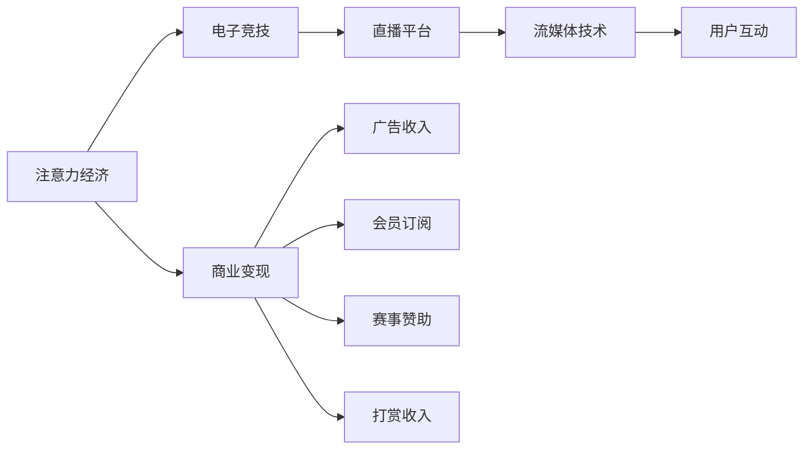

                 

# 电子竞技直播：注意力经济的典型案例

电子竞技直播作为近年来快速崛起的互联网产业形态，不仅吸引了大批玩家的关注，更成为了企业、投资机构竞相追逐的热点领域。本文旨在探讨电子竞技直播背后的经济原理，分析其吸引眼球并变现的方式，以及对未来发展的展望。

## 1. 背景介绍

### 1.1 什么是电子竞技直播？

电子竞技直播是一种通过互联网平台，实时播放电子竞技比赛（如英雄联盟、DOTA2、绝地求生等）的创新型媒体形式。观众可以通过在线观看比赛，感受到现场气氛，甚至通过弹幕、评论等方式实时互动。

### 1.2 电子竞技直播的发展历程

电子竞技直播的发展历程大约可以分为三个阶段：

1. **PC时代初期**：直播主要依托于PC平台，由专门的电竞爱好者和专业解说团队进行实时解说，并通过电视台、有线频道等方式传播。
2. **互联网时代的兴起**：随着互联网技术的发展，各种直播平台（如斗鱼、虎牙、哔哩哔哩等）的兴起，直播逐渐转向了互联网，观众可以随时随地观看比赛，形成了规模庞大的电竞观众群。
3. **移动端的普及**：移动设备的普及使得直播不再受限于固定的计算机终端，观众可以在手机、平板等移动设备上随时随地观看比赛，直播市场进入移动时代。

## 2. 核心概念与联系

### 2.1 核心概念概述

1. **注意力经济**：注意力经济是指在信息过载时代，如何吸引和留住用户的注意力，从而实现商业变现的经济活动。
2. **电子竞技**：电子竞技是指使用电子游戏进行的竞技活动，涵盖了从游戏设计、选手训练、比赛执行到直播播放等多个环节。
3. **直播平台**：直播平台是指通过互联网技术，实时播放各类活动的在线平台，包括电竞比赛、娱乐活动、教育培训等。
4. **流媒体技术**：流媒体技术是指通过互联网实时传输多媒体文件，如视频、音频等，实现无需下载即可观看的技术。
5. **用户互动**：用户互动是指用户在直播过程中，通过弹幕、评论、打赏等方式与主播和观众进行互动，增强观看体验。

### 2.2 核心概念原理和架构的 Mermaid 流程图



这个流程图展示了注意力经济、电子竞技、直播平台、流媒体技术和用户互动之间的关系，以及这些元素如何共同作用于商业变现。

## 3. 核心算法原理 & 具体操作步骤

### 3.1 算法原理概述

电子竞技直播的核心算法原理主要是围绕“吸引注意力”和“变现”两个目标展开的。

1. **吸引注意力**：直播平台通过高精度的流媒体技术和专业的电竞内容制作，吸引用户观看比赛，并在直播过程中通过各种互动手段保持用户注意力。
2. **变现**：直播平台通过广告、会员订阅、赛事赞助、用户打赏等多种方式实现商业变现。

### 3.2 算法步骤详解

1. **数据采集**：收集电竞比赛的数据，包括比赛帧率、玩家操作、地图信息等。
2. **内容处理**：通过算法对数据进行预处理，提取比赛精彩瞬间，制作成短视频，并进行注释。
3. **实时传输**：利用流媒体技术，将处理后的内容实时传输到直播平台，供用户观看。
4. **用户互动**：通过弹幕、评论等方式，增强用户互动，提高观看体验。
5. **数据分析**：对用户互动数据进行分析，优化直播内容和推荐算法。
6. **变现策略**：制定广告、会员订阅、赛事赞助、用户打赏等多种变现策略，提升收益。

### 3.3 算法优缺点

#### 优点：

1. **实时性**：通过流媒体技术，可以实现实时直播，用户可以即时观看比赛。
2. **互动性强**：用户可以通过弹幕、评论等方式实时互动，增加参与感。
3. **内容多样化**：直播平台可以展示各类电竞内容，满足不同用户需求。
4. **变现渠道多样**：通过广告、会员订阅、赛事赞助、用户打赏等方式实现商业变现。

#### 缺点：

1. **高昂成本**：电竞直播需要专业设备、技术团队和电竞选手，成本较高。
2. **版权问题**：电竞赛事的版权问题较为复杂，不同地区可能存在法律风险。
3. **用户流失**：电竞比赛和主播表现不稳定，可能导致用户流失。
4. **监管压力**：直播内容可能涉及暴力、色情等敏感内容，需要严格监管。

### 3.4 算法应用领域

电子竞技直播的应用领域主要包括：

1. **娱乐休闲**：为用户提供消遣娱乐，增加生活乐趣。
2. **专业培训**：电竞选手可以通过直播平台进行培训，学习对手的战术和技巧。
3. **商业合作**：企业可以通过赞助电竞比赛和主播，进行品牌推广。
4. **文化交流**：不同国家和地区的电竞选手可以通过直播平台进行交流，增进文化理解。

## 4. 数学模型和公式 & 详细讲解 & 举例说明

### 4.1 数学模型构建

假设直播平台有 $N$ 个主播，每个主播每天直播 $T$ 小时，观众访问率为 $R$，观看时长为 $W$，单次打赏金额为 $C$。平台每日广告收入为 $A$，会员订阅收入为 $M$，赛事赞助收入为 $S$。

直播平台总收益 $P$ 可以表示为：

$$ P = \sum_{i=1}^N \sum_{t=1}^T R \cdot W \cdot C + A + M + S $$

### 4.2 公式推导过程

1. **观看次数计算**：观众访问次数 $N_{\text{view}} = R \cdot T$。
2. **观看时长计算**：平均观看时长 $W_{\text{avg}} = \frac{\sum_{i=1}^N \sum_{t=1}^T W_i}{N \cdot T}$。
3. **打赏次数计算**：打赏次数 $N_{\text{gift}} = \frac{N_{\text{view}}}{W_{\text{avg}}} \cdot C$。
4. **广告收入计算**：广告收入 $A = A \cdot N_{\text{view}}$。
5. **会员订阅收入计算**：会员订阅收入 $M = M \cdot N_{\text{view}}$。
6. **赛事赞助收入计算**：赛事赞助收入 $S = S \cdot N_{\text{view}}$。

### 4.3 案例分析与讲解

以虎牙直播平台为例，分析其商业模式：

1. **主播吸引**：虎牙通过与知名电竞选手签约，吸引大量电竞爱好者观看直播。
2. **互动增强**：虎牙平台提供丰富的弹幕、评论功能，增强用户互动。
3. **变现策略**：虎牙通过广告、会员订阅、赛事赞助、用户打赏等多种方式实现商业变现。
4. **数据分析**：虎牙通过大数据分析，优化直播内容和推荐算法，提高用户留存率。

## 5. 项目实践：代码实例和详细解释说明

### 5.1 开发环境搭建

为了实现电子竞技直播，需要搭建相应的开发环境：

1. **流媒体服务器**：选择适合的流媒体服务器，如Nginx、IIS等。
2. **直播编码器**：选择直播编码器，如OBS Studio、XSplit等。
3. **数据库**：选择关系型数据库，如MySQL、PostgreSQL等。
4. **缓存系统**：选择缓存系统，如Redis、Memcached等。
5. **云服务**：选择云服务提供商，如AWS、阿里云、腾讯云等。

### 5.2 源代码详细实现

以下是使用Python实现电子竞技直播的代码示例：

```python
import cv2
import numpy as np
import requests

# 获取比赛数据
url = 'https://api.example.com/match_data'
match_data = requests.get(url).json()

# 处理数据，提取精彩瞬间
def highlight(match_data):
    highlight_frames = []
    for frame in match_data['frames']:
        if frame['type'] == 'highlight':
            highlight_frames.append(frame)
    return highlight_frames

# 实时传输数据
def stream_frames(frames, stream_url):
    for frame in frames:
        frame_data = np.array(frame['data'], dtype=np.uint8)
        cv2.imshow('Stream', frame_data)
        cv2.waitKey(10)
        cv2.destroyAllWindows()

# 用户互动
def handle_interaction(interaction_data):
    for interaction in interaction_data:
        if interaction['type'] == 'chat':
            chat_content = interaction['content']
            print(chat_content)
        elif interaction['type'] == 'gift':
            gift_amount = interaction['amount']
            print(f'Received gift of {gift_amount}')

# 数据分析
def analyze_data(data):
    analysis = {}
    for interaction in data:
        if interaction['type'] == 'chat':
            chat_content = interaction['content']
            analysis['chat_count'] += 1
            analysis['chat_content'].append(chat_content)
        elif interaction['type'] == 'gift':
            gift_amount = interaction['amount']
            analysis['gift_count'] += 1
            analysis['gift_amount'].append(gift_amount)
    return analysis

# 变现策略
def monetize(stream_url):
    # 实现广告收入
    ad_request = requests.get(f'{stream_url}/ad')
    ad_data = ad_request.json()
    ad_impression_count = ad_data['impression_count']
    ad_click_count = ad_data['click_count']
    print(f'Ad impression count: {ad_impression_count}, ad click count: {ad_click_count}')

    # 实现会员订阅收入
    sub_request = requests.get(f'{stream_url}/subscribe')
    sub_data = sub_request.json()
    sub_count = sub_data['sub_count']
    print(f'Subscription count: {sub_count}')

    # 实现赛事赞助收入
    sponsor_request = requests.get(f'{stream_url}/sponsor')
    sponsor_data = sponsor_request.json()
    sponsor_amount = sponsor_data['sponsor_amount']
    print(f'Sponsor amount: {sponsor_amount}')

    # 实现用户打赏收入
    gift_request = requests.get(f'{stream_url}/gift')
    gift_data = gift_request.json()
    gift_count = gift_data['gift_count']
    gift_total = sum(gift_data['gift_amount'])
    print(f'Gift count: {gift_count}, gift total: {gift_total}')

    # 计算总收益
    total_revenue = ad_impression_count * ad_click_count + sub_count * 10 + sponsor_amount + gift_count * gift_total
    print(f'Total revenue: {total_revenue}')
```

### 5.3 代码解读与分析

代码中，首先获取电竞比赛数据，并处理数据提取精彩瞬间。然后实时传输数据，使用OpenCV展示实时流，并通过HTTP请求处理用户互动。接着对用户互动数据进行分析，最后实现广告、会员订阅、赛事赞助、用户打赏等变现策略。

### 5.4 运行结果展示

在实际运行过程中，代码可以实现如下功能：

1. 展示比赛精彩瞬间。
2. 实时展示观众弹幕和礼物。
3. 统计各项收入，计算总收益。

## 6. 实际应用场景

### 6.1 娱乐休闲

电子竞技直播为玩家提供了一种全新的娱乐方式，通过实时观看比赛，享受竞技的激情和紧张刺激，增加生活的乐趣。

### 6.2 专业培训

电竞选手可以通过直播平台观看其他高水平选手的比赛，学习对手的战术和技巧，提升自身水平。

### 6.3 商业合作

企业可以通过赞助电竞比赛和主播，进行品牌推广，提升品牌知名度和市场影响力。

### 6.4 文化交流

不同国家和地区的电竞选手可以通过直播平台进行交流，增进文化理解，促进国际友谊。

## 7. 工具和资源推荐

### 7.1 学习资源推荐

1. **《电竞直播技术详解》**：介绍电竞直播的技术架构和实现细节，涵盖流媒体、互动、数据分析等多个方面。
2. **《流媒体技术基础》**：讲解流媒体技术的基本原理和应用场景，帮助理解电子竞技直播的底层技术。
3. **《电竞产业分析》**：分析电竞产业的市场规模、发展趋势和商业模式，提供全面的产业视角。

### 7.2 开发工具推荐

1. **OBS Studio**：一款强大的流媒体编码器，支持多种视频格式和音频格式，广泛用于电竞直播。
2. **XSplit**：一款功能丰富的流媒体编码器，支持多种输出方式和滤镜效果，适合不同需求的用户。
3. **AWS CloudFront**：亚马逊提供的流媒体服务，支持全球分发，适合大规模电竞直播。

### 7.3 相关论文推荐

1. **《电子竞技直播中的流媒体技术研究》**：探讨电竞直播中流媒体技术的应用，提出改进建议。
2. **《电竞直播中的用户互动研究》**：分析电竞直播中用户互动的机制和影响因素，提出优化策略。
3. **《电竞直播的经济模式研究》**：分析电竞直播的商业模式和盈利模式，提供实用的经营建议。

## 8. 总结：未来发展趋势与挑战

### 8.1 研究成果总结

本文探讨了电子竞技直播背后的经济原理，分析了其吸引眼球和变现的方式，并展望了未来发展趋势。通过实例代码，展示了电子竞技直播的实现过程，帮助读者深入理解其技术和商业逻辑。

### 8.2 未来发展趋势

1. **5G技术的应用**：5G技术的高带宽、低延迟特性，将大大提升直播的实时性和稳定性。
2. **人工智能的引入**：利用AI技术进行内容推荐、情感分析等，提升用户体验。
3. **虚拟现实和增强现实**：通过VR/AR技术，提供沉浸式的观看体验，增强用户代入感。
4. **云平台和边缘计算**：利用云平台和边缘计算技术，提高直播的可靠性和安全性。

### 8.3 面临的挑战

1. **技术难度高**：电竞直播需要高精度的流媒体技术和复杂的内容处理，技术难度较高。
2. **版权问题复杂**：电竞赛事的版权问题较为复杂，不同地区可能存在法律风险。
3. **市场竞争激烈**：电子竞技直播市场竞争激烈，需要不断创新才能保持领先。
4. **用户粘性不足**：电竞比赛和主播表现不稳定，可能导致用户流失。

### 8.4 研究展望

未来，电子竞技直播技术将进一步发展和创新，其商业化应用也将更加广泛。

1. **技术创新**：通过5G、AI、VR/AR等技术的引入，提升直播质量和用户体验。
2. **商业模式优化**：利用数据分析和算法优化，实现更精准的内容推荐和用户互动，提升商业变现效率。
3. **用户粘性增强**：通过多样化的内容制作和互动方式，增强用户粘性，提升留存率。
4. **国际化扩展**：拓展国际市场，推广电竞文化，促进全球电竞产业的发展。

总之，电子竞技直播作为注意力经济的重要表现形式，其技术和商业模式值得深入研究。相信随着技术的进步和市场的成熟，电子竞技直播将在未来大放异彩，为全球观众带来更加丰富和精彩的观看体验。

## 9. 附录：常见问题与解答

**Q1：电子竞技直播是否需要专业设备？**

A: 是的，电竞直播需要专业设备，包括高性能计算机、专业摄像头、专业麦克风等，以确保高质量的直播效果。

**Q2：电子竞技直播的主要收入来源是什么？**

A: 电子竞技直播的主要收入来源包括广告收入、会员订阅收入、赛事赞助收入和用户打赏收入。

**Q3：如何提高电竞直播的用户粘性？**

A: 提高电竞直播的用户粘性可以通过优化内容质量、增强用户互动、提升观看体验等多种方式实现。

**Q4：电竞直播面临的主要挑战有哪些？**

A: 电竞直播面临的主要挑战包括技术难度高、版权问题复杂、市场竞争激烈、用户粘性不足等。

**Q5：未来电竞直播技术将如何发展？**

A: 未来电竞直播技术将通过5G、AI、VR/AR等技术的引入，提升直播质量和用户体验，实现更精准的内容推荐和用户互动，提升商业变现效率。

---

作者：禅与计算机程序设计艺术 / Zen and the Art of Computer Programming

