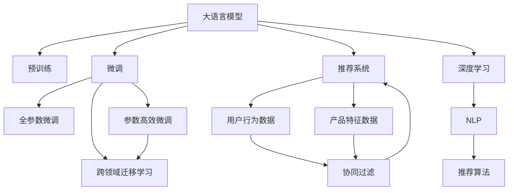

                 

# 直接将LLM作为推荐系统的可行性

大语言模型(Large Language Models, LLMs)在自然语言处理(Natural Language Processing, NLP)领域取得了显著进展，凭借其强大的语言理解和生成能力，正在逐渐渗透到推荐系统(Recommender Systems)中。本文将探讨将大语言模型直接应用于推荐系统的可行性，包括其核心概念、算法原理、操作步骤、案例分析、应用场景、工具推荐、未来展望和常见问题等，力求为这一新兴方向的深入研究和实际应用提供全面的指导。

## 1. 背景介绍

### 1.1 问题由来

推荐系统是互联网时代的重要应用之一，旨在为用户推荐符合其兴趣偏好的产品、内容或服务。传统推荐系统主要依赖用户行为数据进行建模，通过协同过滤、内容推荐、混合推荐等方法，提升推荐的个性化和精准度。但随着数据量和用户群体复杂性的增长，传统推荐系统面临着多方面挑战，如数据稀疏、冷启动、长尾问题、推荐多样性等。

大语言模型通过大规模预训练学习丰富的语言知识和常识，具备强大的上下文理解和生成能力，可以更好地捕捉用户需求和产品特征，为推荐系统带来新的解决思路。但直接将大语言模型应用于推荐系统，也存在诸多挑战，如模型计算资源消耗、推荐精度和效果评估等。本文将探讨这些挑战，并提出相应的优化策略。

## 2. 核心概念与联系

### 2.1 核心概念概述

为更好地理解将大语言模型应用于推荐系统，本节将介绍几个密切相关的核心概念：

- 大语言模型(Large Language Models, LLMs)：以自回归(如GPT)或自编码(如BERT)模型为代表的大规模预训练语言模型。通过在大规模无标签文本语料上进行预训练，学习通用的语言表示，具备强大的语言理解和生成能力。

- 推荐系统(Recommender Systems)：旨在为用户推荐符合其兴趣偏好的产品、内容或服务。常见的方法包括基于用户的协同过滤、基于内容的推荐、混合推荐等。

- 自然语言处理(Natural Language Processing, NLP)：涉及语音识别、文本分析、语言生成等任务，是推荐系统的重要工具。

- 深度学习(Deep Learning)：通过神经网络模型对数据进行建模和预测，是推荐系统的主要技术手段。

- 预训练(Pre-training)：指在大规模无标签文本语料上，通过自监督学习任务训练通用语言模型的过程。常见的预训练任务包括言语建模、遮挡语言模型等。

- 微调(Fine-tuning)：指在预训练模型的基础上，使用下游任务的少量标注数据，通过有监督学习优化模型在特定任务上的性能。

这些概念之间的逻辑关系可以通过以下Mermaid流程图来展示：



这个流程图展示了大语言模型的核心概念及其与推荐系统的关系：

1. 大语言模型通过预训练获得基础能力。
2. 微调优化模型，提升特定任务性能。
3. 通过微调获得特定领域知识，提高推荐效果。
4. 推荐系统主要依赖用户行为和产品特征数据。
5. 深度学习和自然语言处理技术是推荐算法的关键。
6. 跨领域迁移学习将大模型的知识引入推荐系统。

这些概念共同构成了将大语言模型应用于推荐系统的理论基础，使其能够在推荐任务中发挥强大作用。

## 3. 核心算法原理 & 具体操作步骤
### 3.1 算法原理概述

将大语言模型应用于推荐系统，主要基于以下原理：

- 利用预训练语言模型强大的语言理解能力，从文本描述中提取用户需求和产品特征。
- 通过微调优化模型，提高特定任务（如推荐任务）的精准度。
- 结合推荐系统中的协同过滤、内容推荐等算法，构建更智能、个性化的推荐模型。

具体而言，推荐系统的核心任务是根据用户的历史行为数据和产品特征数据，预测用户对新产品的偏好程度，从而生成推荐结果。大语言模型可以通过对产品描述、用户评论等文本数据进行预训练和微调，提取有价值的语义信息，用于改进推荐模型的性能。

### 3.2 算法步骤详解

将大语言模型应用于推荐系统，通常需要以下步骤：

**Step 1: 数据预处理**

- 收集产品描述、用户评论等文本数据。
- 对文本进行清洗、分词、去停用词等预处理，转化为模型可以接受的输入格式。
- 将产品特征（如类别、价格、评分等）转换为数值型数据。
- 将用户行为数据（如浏览历史、购买记录等）转换为序列型数据。

**Step 2: 模型初始化**

- 选择合适的预训练语言模型，如BERT、GPT等，作为推荐模型的初始化参数。
- 将预训练模型的权重固定，仅微调顶层，以提高计算效率和模型性能。

**Step 3: 微调**

- 将预训练模型作为特征提取器，输入产品特征和用户行为数据，进行前向传播。
- 设计合适的损失函数和优化器，如交叉熵损失、AdamW等，进行后向传播计算梯度，更新模型参数。
- 设置合理的超参数，如学习率、批大小、迭代轮数等。

**Step 4: 推荐算法集成**

- 将微调后的语言模型与推荐算法集成，生成推荐结果。
- 使用协同过滤、内容推荐等方法，综合多维度的特征进行推荐。

**Step 5: 效果评估**

- 在测试集上评估推荐模型的效果，如准确率、召回率、F1值等指标。
- 对比微调前后模型的性能变化，评估大语言模型对推荐系统的提升效果。

**Step 6: 部署和监控**

- 将训练好的模型部署到推荐系统中，进行实时推荐。
- 设置监控系统，实时收集推荐效果数据，进行模型优化和调整。

以上是基于大语言模型的推荐系统开发流程。在实际应用中，还需要根据具体任务的特点，对每个环节进行优化设计，以提高模型性能和用户体验。

### 3.3 算法优缺点

将大语言模型应用于推荐系统，具有以下优点：

1. 强大的语言理解能力：能够从文本数据中提取有价值的语义信息，提升推荐模型的精度。
2. 灵活性高：模型能够适应不同的推荐任务，提高推荐系统的个性化和多样化。
3. 参数高效微调：仅微调顶层，减少计算资源消耗，提高模型训练效率。
4. 跨领域迁移学习：将通用语言知识引入特定领域，提升推荐模型的泛化能力。

同时，该方法也存在一些局限性：

1. 数据质量要求高：文本数据的质量和标注样本的数量直接影响微调效果。
2. 计算资源消耗高：预训练语言模型和微调过程需要大量计算资源。
3. 推荐效果难以评估：推荐系统的效果难以通过传统评估指标完全量化。
4. 可解释性不足：大语言模型通常是"黑盒"系统，难以解释其推荐逻辑。

尽管存在这些局限性，但就目前而言，将大语言模型应用于推荐系统，依然具有显著的优势和潜力，值得进一步探索和实践。

### 3.4 算法应用领域

将大语言模型应用于推荐系统，已经在多个领域取得了初步应用：

- 电子商务推荐：如亚马逊、淘宝等电商平台的商品推荐。
- 内容推荐：如Netflix、YouTube等视频网站的推荐系统。
- 新闻推荐：如今日头条、知乎等新闻平台的个性化推荐。
- 社交推荐：如微信、微博等社交平台的推荐系统。

除了这些经典应用外，大语言模型还被创新性地应用于更多场景中，如可控推荐、知识推荐、多模态推荐等，为推荐系统带来了全新的突破。随着预训练语言模型和微调方法的不断进步，相信基于大语言模型的推荐系统将更加智能、高效，提升用户的体验和满意度。

## 4. 数学模型和公式 & 详细讲解 & 举例说明

### 4.1 数学模型构建

假设推荐系统包含$m$个产品和$n$个用户，每个产品$d$维特征向量，每个用户$k$个历史行为数据。我们定义用户-产品评分矩阵$R \in \mathbb{R}^{n \times m}$，其中$R_{ui}$表示用户$u$对产品$i$的评分。

推荐系统的目标是通过用户行为数据和产品特征数据，预测用户对新产品的评分，生成推荐结果。假设预训练语言模型为$f_{\theta}(x)$，其中$x$为产品描述或用户评论的文本向量，$\theta$为模型参数。模型输出的预测评分$y_i$可以通过如下公式计算：

$$
y_i = f_{\theta}(x_i)
$$

其中$x_i$为产品$i$的描述或评论文本向量。

### 4.2 公式推导过程

假设预训练语言模型为$f_{\theta}$，输入为产品$i$的描述或评论$x_i$，输出为评分预测值$y_i$。我们定义损失函数$\ell(R, y)$为实际评分与预测评分的平方误差：

$$
\ell(R, y) = \frac{1}{nm} \sum_{u=1}^n \sum_{i=1}^m (R_{ui} - y_i)^2
$$

在微调过程中，我们需要最小化损失函数$\ell(R, y)$，以提高模型对推荐任务的适应能力。

假设优化算法为AdamW，学习率为$\eta$，则参数$\theta$的更新公式为：

$$
\theta \leftarrow \theta - \eta \nabla_{\theta}\ell(R, y) - \eta\lambda\theta
$$

其中$\nabla_{\theta}\ell(R, y)$为损失函数对参数$\theta$的梯度，可通过反向传播算法高效计算。

### 4.3 案例分析与讲解

假设我们有一个商品推荐系统，产品描述为产品$i$的评论文本$x_i$，用户行为为浏览历史$h_u$。我们希望通过微调BERT模型，预测用户对新产品的评分。

首先，对产品描述和用户行为数据进行预处理，将其转化为BERT模型可以接受的格式。然后，将处理后的文本输入BERT模型进行编码，得到表示向量$z_i$和用户向量$h_u$。最后，通过这两个向量计算预测评分$y_i$：

$$
y_i = f_{\theta}(x_i) = f_{\theta}(z_i)
$$

其中$f_{\theta}$为BERT模型，$z_i$为产品描述的编码向量，$h_u$为用户行为的编码向量。

在微调过程中，我们可以设计交叉熵损失函数：

$$
\ell(R, y) = -\frac{1}{nm} \sum_{u=1}^n \sum_{i=1}^m R_{ui} \log f_{\theta}(z_i)
$$

通过最小化这个损失函数，模型将学习到如何从产品描述中提取有价值的语义信息，用于生成推荐结果。

## 5. 项目实践：代码实例和详细解释说明
### 5.1 开发环境搭建

在进行推荐系统微调实践前，我们需要准备好开发环境。以下是使用Python进行PyTorch开发的环境配置流程：

1. 安装Anaconda：从官网下载并安装Anaconda，用于创建独立的Python环境。

2. 创建并激活虚拟环境：
```bash
conda create -n pytorch-env python=3.8 
conda activate pytorch-env
```

3. 安装PyTorch：根据CUDA版本，从官网获取对应的安装命令。例如：
```bash
conda install pytorch torchvision torchaudio cudatoolkit=11.1 -c pytorch -c conda-forge
```

4. 安装Transformers库：
```bash
pip install transformers
```

5. 安装各类工具包：
```bash
pip install numpy pandas scikit-learn matplotlib tqdm jupyter notebook ipython
```

完成上述步骤后，即可在`pytorch-env`环境中开始微调实践。

### 5.2 源代码详细实现

下面以一个简单的推荐系统为例，给出使用Transformers库对BERT模型进行微调的PyTorch代码实现。

首先，定义推荐系统的数据处理函数：

```python
from transformers import BertTokenizer
from torch.utils.data import Dataset
import torch

class RecommendationDataset(Dataset):
    def __init__(self, texts, targets, tokenizer, max_len=128):
        self.texts = texts
        self.targets = targets
        self.tokenizer = tokenizer
        self.max_len = max_len
        
    def __len__(self):
        return len(self.texts)
    
    def __getitem__(self, item):
        text = self.texts[item]
        target = self.targets[item]
        
        encoding = self.tokenizer(text, return_tensors='pt', max_length=self.max_len, padding='max_length', truncation=True)
        input_ids = encoding['input_ids'][0]
        attention_mask = encoding['attention_mask'][0]
        
        target = torch.tensor(target, dtype=torch.long)
        
        return {'input_ids': input_ids, 
                'attention_mask': attention_mask,
                'target': target}

# 准备数据集
tokenizer = BertTokenizer.from_pretrained('bert-base-cased')

train_dataset = RecommendationDataset(train_texts, train_targets, tokenizer)
dev_dataset = RecommendationDataset(dev_texts, dev_targets, tokenizer)
test_dataset = RecommendationDataset(test_texts, test_targets, tokenizer)
```

然后，定义模型和优化器：

```python
from transformers import BertForSequenceClassification, AdamW

model = BertForSequenceClassification.from_pretrained('bert-base-cased', num_labels=len(tag2id))

optimizer = AdamW(model.parameters(), lr=2e-5)
```

接着，定义训练和评估函数：

```python
from torch.utils.data import DataLoader
from tqdm import tqdm
from sklearn.metrics import classification_report

device = torch.device('cuda') if torch.cuda.is_available() else torch.device('cpu')
model.to(device)

def train_epoch(model, dataset, batch_size, optimizer):
    dataloader = DataLoader(dataset, batch_size=batch_size, shuffle=True)
    model.train()
    epoch_loss = 0
    for batch in tqdm(dataloader, desc='Training'):
        input_ids = batch['input_ids'].to(device)
        attention_mask = batch['attention_mask'].to(device)
        targets = batch['target'].to(device)
        model.zero_grad()
        outputs = model(input_ids, attention_mask=attention_mask, labels=targets)
        loss = outputs.loss
        epoch_loss += loss.item()
        loss.backward()
        optimizer.step()
    return epoch_loss / len(dataloader)

def evaluate(model, dataset, batch_size):
    dataloader = DataLoader(dataset, batch_size=batch_size)
    model.eval()
    preds, labels = [], []
    with torch.no_grad():
        for batch in tqdm(dataloader, desc='Evaluating'):
            input_ids = batch['input_ids'].to(device)
            attention_mask = batch['attention_mask'].to(device)
            targets = batch['target']
            batch_preds = model(input_ids, attention_mask=attention_mask)
            batch_preds = batch_preds.argmax(dim=1).to('cpu').tolist()
            batch_labels = targets.to('cpu').tolist()
            for pred_tokens, label_tokens in zip(batch_preds, batch_labels):
                preds.append(pred_tokens)
                labels.append(label_tokens)
                
    print(classification_report(labels, preds))
```

最后，启动训练流程并在测试集上评估：

```python
epochs = 5
batch_size = 16

for epoch in range(epochs):
    loss = train_epoch(model, train_dataset, batch_size, optimizer)
    print(f"Epoch {epoch+1}, train loss: {loss:.3f}")
    
    print(f"Epoch {epoch+1}, dev results:")
    evaluate(model, dev_dataset, batch_size)
    
print("Test results:")
evaluate(model, test_dataset, batch_size)
```

以上就是使用PyTorch对BERT进行推荐系统微调的完整代码实现。可以看到，得益于Transformers库的强大封装，我们可以用相对简洁的代码完成BERT模型的加载和微调。

### 5.3 代码解读与分析

让我们再详细解读一下关键代码的实现细节：

**RecommendationDataset类**：
- `__init__`方法：初始化文本、标签、分词器等关键组件。
- `__len__`方法：返回数据集的样本数量。
- `__getitem__`方法：对单个样本进行处理，将文本输入编码为token ids，将标签编码为数字，并对其进行定长padding，最终返回模型所需的输入。

**tag2id和id2tag字典**：
- 定义了标签与数字id之间的映射关系，用于将token-wise的预测结果解码回真实的标签。

**训练和评估函数**：
- 使用PyTorch的DataLoader对数据集进行批次化加载，供模型训练和推理使用。
- 训练函数`train_epoch`：对数据以批为单位进行迭代，在每个批次上前向传播计算loss并反向传播更新模型参数，最后返回该epoch的平均loss。
- 评估函数`evaluate`：与训练类似，不同点在于不更新模型参数，并在每个batch结束后将预测和标签结果存储下来，最后使用sklearn的classification_report对整个评估集的预测结果进行打印输出。

**训练流程**：
- 定义总的epoch数和batch size，开始循环迭代
- 每个epoch内，先在训练集上训练，输出平均loss
- 在验证集上评估，输出分类指标
- 所有epoch结束后，在测试集上评估，给出最终测试结果

可以看到，PyTorch配合Transformers库使得BERT微调的代码实现变得简洁高效。开发者可以将更多精力放在数据处理、模型改进等高层逻辑上，而不必过多关注底层的实现细节。

当然，工业级的系统实现还需考虑更多因素，如模型的保存和部署、超参数的自动搜索、更灵活的任务适配层等。但核心的微调范式基本与此类似。

## 6. 实际应用场景
### 6.1 智能推荐引擎

智能推荐引擎是推荐系统的重要应用场景，旨在为用户提供个性化的商品、内容、服务推荐。基于大语言模型微调的推荐引擎，可以提升推荐的个性化程度，减少推荐偏差，提升用户体验。

在技术实现上，可以收集用户的历史行为数据和产品特征数据，利用BERT等预训练语言模型进行微调，提取产品描述和用户评论中的语义信息，用于生成推荐结果。微调后的语言模型可以自动学习用户需求和产品特征之间的关系，从而生成更加智能、个性化的推荐结果。

### 6.2 内容推荐系统

内容推荐系统是推荐系统的重要分支，旨在为用户推荐符合其兴趣偏好的视频、文章、音乐等内容。基于大语言模型微调的内容推荐系统，可以提升推荐的精度和多样性，让用户获得更好的内容体验。

在具体应用中，可以收集用户的历史行为数据和内容标签数据，利用BERT等预训练语言模型进行微调，提取内容描述和用户评论中的语义信息，用于生成推荐结果。微调后的语言模型可以自动学习内容描述和用户评论之间的关系，从而生成更加精准、多样化的推荐内容。

### 6.3 推荐系统中的多模态融合

当前推荐系统主要聚焦于纯文本数据，但文本数据难以完全表达用户需求和产品特征。为了提升推荐效果，可以引入图像、视频、语音等多模态数据，利用大语言模型进行融合，增强推荐系统的性能。

在实践中，可以收集用户的历史行为数据和产品特征数据，包括文本、图像、视频、语音等多种模态数据。利用BERT等预训练语言模型进行微调，提取不同模态数据中的语义信息，用于生成推荐结果。微调后的语言模型可以自动学习不同模态数据之间的关系，从而生成更加全面、精准的推荐结果。

## 7. 工具和资源推荐
### 7.1 学习资源推荐

为了帮助开发者系统掌握大语言模型应用于推荐系统的理论基础和实践技巧，这里推荐一些优质的学习资源：

1. 《Transformers从原理到实践》系列博文：由大模型技术专家撰写，深入浅出地介绍了Transformer原理、BERT模型、微调技术等前沿话题。

2. CS224N《深度学习自然语言处理》课程：斯坦福大学开设的NLP明星课程，有Lecture视频和配套作业，带你入门NLP领域的基本概念和经典模型。

3. 《Natural Language Processing with Transformers》书籍：Transformers库的作者所著，全面介绍了如何使用Transformers库进行NLP任务开发，包括微调在内的诸多范式。

4. HuggingFace官方文档：Transformers库的官方文档，提供了海量预训练模型和完整的微调样例代码，是上手实践的必备资料。

5. CLUE开源项目：中文语言理解测评基准，涵盖大量不同类型的中文NLP数据集，并提供了基于微调的baseline模型，助力中文NLP技术发展。

通过对这些资源的学习实践，相信你一定能够快速掌握大语言模型应用于推荐系统的精髓，并用于解决实际的推荐问题。

### 7.2 开发工具推荐

高效的开发离不开优秀的工具支持。以下是几款用于推荐系统微调开发的常用工具：

1. PyTorch：基于Python的开源深度学习框架，灵活动态的计算图，适合快速迭代研究。大部分预训练语言模型都有PyTorch版本的实现。

2. TensorFlow：由Google主导开发的开源深度学习框架，生产部署方便，适合大规模工程应用。同样有丰富的预训练语言模型资源。

3. Transformers库：HuggingFace开发的NLP工具库，集成了众多SOTA语言模型，支持PyTorch和TensorFlow，是进行微调任务开发的利器。

4. Weights & Biases：模型训练的实验跟踪工具，可以记录和可视化模型训练过程中的各项指标，方便对比和调优。与主流深度学习框架无缝集成。

5. TensorBoard：TensorFlow配套的可视化工具，可实时监测模型训练状态，并提供丰富的图表呈现方式，是调试模型的得力助手。

6. Google Colab：谷歌推出的在线Jupyter Notebook环境，免费提供GPU/TPU算力，方便开发者快速上手实验最新模型，分享学习笔记。

合理利用这些工具，可以显著提升推荐系统微调的开发效率，加快创新迭代的步伐。

### 7.3 相关论文推荐

大语言模型和微调技术的发展源于学界的持续研究。以下是几篇奠基性的相关论文，推荐阅读：

1. Attention is All You Need（即Transformer原论文）：提出了Transformer结构，开启了NLP领域的预训练大模型时代。

2. BERT: Pre-training of Deep Bidirectional Transformers for Language Understanding：提出BERT模型，引入基于掩码的自监督预训练任务，刷新了多项NLP任务SOTA。

3. Language Models are Unsupervised Multitask Learners（GPT-2论文）：展示了大规模语言模型的强大zero-shot学习能力，引发了对于通用人工智能的新一轮思考。

4. Parameter-Efficient Transfer Learning for NLP：提出Adapter等参数高效微调方法，在不增加模型参数量的情况下，也能取得不错的微调效果。

5. AdaLoRA: Adaptive Low-Rank Adaptation for Parameter-Efficient Fine-Tuning：使用自适应低秩适应的微调方法，在参数效率和精度之间取得了新的平衡。

6. Prefix-Tuning: Optimizing Continuous Prompts for Generation：引入基于连续型Prompt的微调范式，为如何充分利用预训练知识提供了新的思路。

这些论文代表了大语言模型微调技术的发展脉络。通过学习这些前沿成果，可以帮助研究者把握学科前进方向，激发更多的创新灵感。

## 8. 总结：未来发展趋势与挑战

### 8.1 总结

本文对将大语言模型应用于推荐系统的方法进行了全面系统的介绍。首先阐述了推荐系统和大语言模型的研究背景和意义，明确了微调在拓展预训练模型应用、提升推荐系统性能方面的独特价值。其次，从原理到实践，详细讲解了微调的数学模型和关键步骤，给出了微调任务开发的完整代码实例。同时，本文还广泛探讨了微调方法在智能推荐、内容推荐、多模态推荐等多个推荐系统应用中的实践场景，展示了微调范式的巨大潜力。

通过本文的系统梳理，可以看到，将大语言模型应用于推荐系统，正在成为推荐系统的重要研究范式，极大地拓展了推荐系统的应用边界，带来了新的解决思路。未来，伴随大语言模型和微调方法的持续演进，基于大语言模型的推荐系统必将在推荐任务中发挥更大作用，提升用户的体验和满意度。

### 8.2 未来发展趋势

展望未来，大语言模型微调技术将呈现以下几个发展趋势：

1. 模型规模持续增大。随着算力成本的下降和数据规模的扩张，预训练语言模型和微调模型的参数量还将持续增长。超大模型的庞大知识库，有望进一步提升推荐系统的性能。

2. 微调方法日趋多样。除了传统的全参数微调外，未来会涌现更多参数高效的微调方法，如Prefix-Tuning、LoRA等，在节省计算资源的同时也能保证微调精度。

3. 跨领域迁移学习更加灵活。未来，微调模型将具备更强的跨领域迁移能力，能够更加灵活地适应不同的推荐场景和数据分布。

4. 推荐系统中的多模态融合更加深入。未来，多模态推荐系统将更加成熟，能够更好地融合图像、视频、语音等多种模态数据，提升推荐系统的综合性能。

5. 知识图谱与推荐系统的深度融合。未来，推荐系统将更好地结合知识图谱，利用结构化知识提升推荐系统的精确度和多样性。

以上趋势凸显了大语言模型微调技术的广阔前景。这些方向的探索发展，必将进一步提升推荐系统的性能和用户体验，带来全新的应用场景和价值。

### 8.3 面临的挑战

尽管大语言模型微调技术已经取得了显著进展，但在迈向更加智能化、普适化应用的过程中，它仍面临着诸多挑战：

1. 数据质量瓶颈。推荐系统的微调效果很大程度上取决于标注数据的质量和数量，高质量标注数据的获取成本较高。如何降低数据质量对微调效果的影响，将是一大难题。

2. 推荐效果难以量化。推荐系统的推荐效果难以通过传统评估指标完全量化，如推荐系统如何处理长尾问题、推荐多样性、公平性等。如何在评估推荐系统时综合考虑这些因素，将是一个重要研究方向。

3. 计算资源消耗高。大规模语言模型和微调过程需要大量计算资源，如何优化模型结构和计算过程，降低计算成本，仍需进一步探索。

4. 模型可解释性不足。大语言模型通常是"黑盒"系统，难以解释其推荐逻辑。如何在保证模型性能的同时，提升模型的可解释性，将是一个重要的研究方向。

5. 推荐系统中的偏见问题。推荐系统中的偏见问题难以避免，如性别、年龄、地域等偏见可能导致不公正的推荐结果。如何识别和消除推荐系统中的偏见，确保推荐系统的公平性，将是一个重要的研究方向。

6. 推荐系统的安全性问题。推荐系统中的安全性问题不容忽视，如恶意内容推荐、虚假信息传播等。如何建立推荐系统的安全保障机制，确保用户安全，将是一个重要的研究方向。

这些挑战凸显了大语言模型微调技术的复杂性和现实性，需要研究者从数据、模型、算法、工程等多个维度协同发力，才能实现推荐系统的持续优化和创新。

### 8.4 研究展望

面对大语言模型微调技术所面临的种种挑战，未来的研究需要在以下几个方面寻求新的突破：

1. 探索无监督和半监督微调方法。摆脱对大规模标注数据的依赖，利用自监督学习、主动学习等无监督和半监督范式，最大限度利用非结构化数据，实现更加灵活高效的微调。

2. 研究参数高效和计算高效的微调范式。开发更加参数高效的微调方法，在固定大部分预训练参数的同时，只更新极少量的任务相关参数。同时优化微调模型的计算图，减少前向传播和反向传播的资源消耗，实现更加轻量级、实时性的部署。

3. 融合因果和对比学习范式。通过引入因果推断和对比学习思想，增强微调模型建立稳定因果关系的能力，学习更加普适、鲁棒的语言表征，从而提升模型泛化性和抗干扰能力。

4. 引入更多先验知识。将符号化的先验知识，如知识图谱、逻辑规则等，与神经网络模型进行巧妙融合，引导微调过程学习更准确、合理的语言模型。同时加强不同模态数据的整合，实现视觉、语音等多模态信息与文本信息的协同建模。

5. 结合因果分析和博弈论工具。将因果分析方法引入微调模型，识别出模型决策的关键特征，增强输出解释的因果性和逻辑性。借助博弈论工具刻画人机交互过程，主动探索并规避模型的脆弱点，提高系统稳定性。

6. 纳入伦理道德约束。在模型训练目标中引入伦理导向的评估指标，过滤和惩罚有偏见、有害的输出倾向。同时加强人工干预和审核，建立模型行为的监管机制，确保输出符合人类价值观和伦理道德。

这些研究方向的探索，必将引领大语言模型微调技术迈向更高的台阶，为推荐系统的智能化、普适化发展提供新的技术手段。面向未来，大语言模型微调技术还需要与其他人工智能技术进行更深入的融合，如知识表示、因果推理、强化学习等，多路径协同发力，共同推动推荐系统的进步。

## 9. 附录：常见问题与解答

**Q1：如何将大语言模型应用于推荐系统？**

A: 将大语言模型应用于推荐系统，主要基于以下步骤：
1. 收集产品描述、用户评论等文本数据。
2. 对文本进行清洗、分词、去停用词等预处理，转化为模型可以接受的输入格式。
3. 将产品特征（如类别、价格、评分等）转换为数值型数据。
4. 将用户行为数据（如浏览历史、购买记录等）转换为序列型数据。
5. 选择合适的预训练语言模型，如BERT、GPT等，作为推荐模型的初始化参数。
6. 将预训练模型的权重固定，仅微调顶层，以提高计算效率和模型性能。
7. 设计合适的损失函数和优化器，如交叉熵损失、AdamW等，进行微调。
8. 将微调后的语言模型与推荐算法集成，生成推荐结果。

**Q2：微调过程中如何选择合适的学习率？**

A: 微调的学习率一般要比预训练时小1-2个数量级，如果使用过大的学习率，容易破坏预训练权重，导致过拟合。一般建议从1e-5开始调参，逐步减小学习率，直至收敛。也可以使用warmup策略，在开始阶段使用较小的学习率，再逐渐过渡到预设值。需要注意的是，不同的优化器(如AdamW、Adafactor等)以及不同的学习率调度策略，可能需要设置不同的学习率阈值。

**Q3：微调过程中如何缓解过拟合问题？**

A: 过拟合是微调面临的主要挑战，尤其是在标注数据不足的情况下。常见的缓解策略包括：
1. 数据增强：通过回译、近义替换等方式扩充训练集。
2. 正则化：使用L2正则、Dropout、Early Stopping等避免过拟合。
3. 对抗训练：引入对抗样本，提高模型鲁棒性。
4. 参数高效微调：只调整少量参数(如Adapter、Prefix等)，减小过拟合风险。
5. 多模型集成：训练多个微调模型，取平均输出，抑制过拟合。

这些策略往往需要根据具体任务和数据特点进行灵活组合。只有在数据、模型、训练、推理等各环节进行全面优化，才能最大限度地发挥大语言模型微调的威力。

**Q4：推荐系统中的多模态融合有哪些方法？**

A: 推荐系统中的多模态融合方法主要包括：
1. 特征融合：将不同模态的数据进行拼接或合并，用于生成推荐结果。
2. 联合训练：将不同模态的数据在同一个模型中进行联合训练，提升推荐效果。
3. 半监督学习：利用无标签数据进行预训练，提高推荐模型的泛化能力。
4. 跨模态表示学习：将不同模态的数据映射到同一个低维空间，用于生成推荐结果。
5. 多任务学习：在推荐任务和预训练任务中同时训练模型，提升推荐效果。

这些方法需要根据具体应用场景进行合理选择和组合，以提升推荐系统的综合性能。

**Q5：如何衡量推荐系统的推荐效果？**

A: 推荐系统的推荐效果可以通过多种指标进行评估，包括：
1. 准确率：推荐结果与真实标签的一致性。
2. 召回率：实际标签中包含推荐结果的比例。
3. F1值：准确率和召回率的调和平均值。
4. NDCG：Normalized Discounted Cumulative Gain，用于衡量推荐结果的相关性。
5. HR@N：Hit Rate at N，用于衡量推荐结果的覆盖率。
6. 多样性指标：推荐结果的多样性，用于避免推荐结果的集中性。

这些指标需要根据具体应用场景进行合理选择和组合，以全面评估推荐系统的性能。

**Q6：如何构建智能推荐系统？**

A: 构建智能推荐系统需要考虑以下几个关键点：
1. 数据采集和处理：收集用户行为数据和产品特征数据，进行预处理和特征工程。
2. 模型选择和微调：选择合适的预训练语言模型，进行微调优化，提升模型的推荐效果。
3. 推荐算法集成：将微调后的语言模型与推荐算法集成，生成推荐结果。
4. 效果评估和优化：在测试集上评估推荐模型的效果，对比微调前后模型的性能变化，进行模型优化和调整。
5. 系统部署和监控：将训练好的模型部署到推荐系统中，设置监控系统，实时收集推荐效果数据，进行模型优化和调整。

通过以上步骤，可以构建出智能、高效、稳定的推荐系统，提升用户体验和满意度。

---

作者：禅与计算机程序设计艺术 / Zen and the Art of Computer Programming

