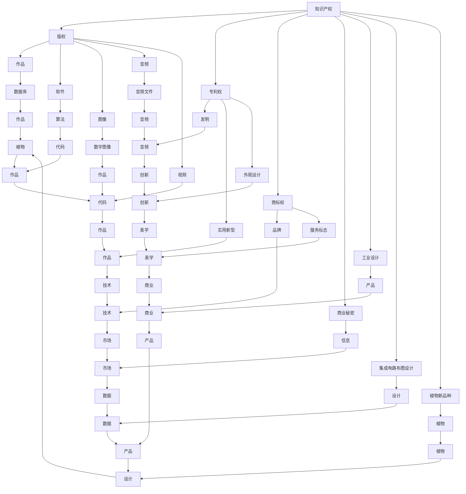

                 

# 知识产权与数字经济的融合

> 关键词：知识产权,数字经济,大数据,人工智能,法律合规,智慧合约,知识产权保护,数字版权管理

## 1. 背景介绍

### 1.1 问题由来
随着数字经济的蓬勃发展，知识产权（Intellectual Property, IP）的保护和利用变得愈发重要。尤其是在大数据、人工智能等新技术的推动下，传统的版权、专利、商标等知识产权形式面临着巨大的挑战和变革。数字经济时代，如何有效保护和利用知识产权，成为了亟需解决的重要问题。

## 2. 核心概念与联系

### 2.1 核心概念概述

本节将介绍几个与知识产权和数字经济融合密切相关的核心概念：

- **知识产权**：指创作者对其智力劳动成果所享有的一系列权利，包括但不限于版权、专利权、商标权等。知识产权是创新和创造力的重要保障。

- **数字经济**：以数字技术和信息网络为基础的经济形态，包括电子商务、电子金融、数字内容等。数字经济改变了传统经济的生产方式和消费模式。

- **大数据**：指通过数字化手段收集、处理和分析的大量数据。大数据在知识产权保护和利用中发挥着重要作用。

- **人工智能**：利用算法、模型等技术手段，赋予机器以学习能力，以实现复杂任务的自动化处理。

- **法律合规**：在数字经济中，需确保各方的商业行为符合相关法律法规，防止侵权和滥用。

- **智慧合约**：基于区块链技术的智能合约，可以自动执行合同条款，减少人工干预，提高交易效率。

- **数字版权管理**：通过技术手段，实现对数字作品的使用、复制、发行等权利的管理和监控。

- **版权区块链**：利用区块链技术，实现版权的溯源、验证和保护。

这些核心概念之间的逻辑关系可以通过以下Mermaid流程图来展示：



这个流程图展示了大知识产权的各类形式及其相关概念，以及它们在大数据、人工智能等数字经济环境下的应用和发展。

## 3. 核心算法原理 & 具体操作步骤

### 3.1 算法原理概述

知识产权与数字经济的融合，可以通过以下几个关键步骤来实现：

1. **数据收集与整理**：收集与知识产权相关的各种数据，包括但不限于作品、专利申请、商标信息等。

2. **数据分析与挖掘**：利用大数据技术对收集的数据进行分析和挖掘，提取有价值的知识和信息。

3. **人工智能模型构建**：构建人工智能模型，如自然语言处理（NLP）、计算机视觉（CV）等，实现对知识产权数据的自动化分析和处理。

4. **知识产权保护与管理**：利用人工智能和区块链等技术，实现对知识产权的自动化保护和管理，如版权验证、数字水印、内容溯源等。

5. **数字版权交易与利用**：利用智慧合约等技术，实现数字作品的自动化交易和利用，确保各方的合法权益。

6. **合规审查与风险管理**：利用人工智能和大数据分析，实现对知识产权相关行为的合规审查和风险管理，防止侵权和滥用。

### 3.2 算法步骤详解

以下是详细的算法步骤：

1. **数据收集与整理**：
   - 收集版权登记信息、专利申请信息、商标注册信息等。
   - 对数据进行清洗和预处理，确保数据的准确性和完整性。

2. **数据分析与挖掘**：
   - 利用大数据技术，如Hadoop、Spark等，对收集的数据进行分布式处理和分析。
   - 提取知识产权相关的特征，如作品长度、发明专利的创新点等。

3. **人工智能模型构建**：
   - 构建NLP模型，对文本进行分类、摘要、情感分析等处理。
   - 构建CV模型，对图像进行识别、分类、标注等处理。

4. **知识产权保护与管理**：
   - 利用区块链技术，实现版权的溯源、验证和保护。
   - 在数字作品中加入数字水印，防止未经授权的复制和使用。

5. **数字版权交易与利用**：
   - 利用智慧合约，实现数字作品的自动化交易和分发。
   - 记录交易过程，确保各方的合法权益。

6. **合规审查与风险管理**：
   - 利用机器学习和大数据分析，实现对知识产权相关行为的合规审查。
   - 及时发现并处理侵权和滥用行为，降低风险。

### 3.3 算法优缺点

知识产权与数字经济的融合算法具有以下优点：

- **高效处理**：通过大数据和人工智能技术，可以快速处理大量的知识产权数据，提高效率。
- **自动化管理**：实现知识产权的自动化保护和管理，减少人工干预，提高准确性。
- **降低风险**：通过合规审查和风险管理，可以有效预防和应对侵权和滥用行为，降低风险。

同时，该算法也存在一些缺点：

- **数据依赖**：算法的有效运行依赖于高质量的数据，数据缺失或不完整会影响结果。
- **技术门槛**：需要较高的技术门槛，对数据处理和模型构建的要求较高。
- **隐私保护**：在数据处理过程中，可能涉及隐私保护问题，需要采取相应的措施。

### 3.4 算法应用领域

该算法在以下几个领域有广泛的应用：

- **知识产权保护**：如版权验证、数字水印、内容溯源等。
- **数字内容管理**：如数字版权交易、利用等。
- **合规审查**：如侵权检测、风险管理等。

## 4. 数学模型和公式 & 详细讲解 & 举例说明

### 4.1 数学模型构建

本节将使用数学语言对知识产权与数字经济的融合算法进行更加严格的刻画。

记知识产权数据集为 $D=\{(x_i, y_i)\}_{i=1}^N, x_i \in X, y_i \in Y$，其中 $x_i$ 为知识产权数据，$y_i$ 为知识产权状态标签，如版权、专利、商标等。

定义知识产权保护与管理模型为 $M_{\theta}$，其中 $\theta$ 为模型参数。假设模型采用监督学习方法，则目标是最小化损失函数 $\mathcal{L}$：

$$
\mathcal{L}(\theta) = \frac{1}{N} \sum_{i=1}^N \ell(y_i, M_{\theta}(x_i))
$$

其中 $\ell$ 为损失函数，如交叉熵损失函数。

### 4.2 公式推导过程

以下我们以版权验证为例，推导基于深度学习模型的交叉熵损失函数及其梯度计算公式。

假设模型 $M_{\theta}$ 对输入 $x_i$ 的输出为 $\hat{y}_i$，其中 $\hat{y}_i \in [0,1]$ 表示作品 $x_i$ 是否属于版权保护，$y_i \in \{0,1\}$ 表示真实版权状态。则二分类交叉熵损失函数定义为：

$$
\ell(M_{\theta}(x_i),y_i) = -[y_i\log \hat{y}_i + (1-y_i)\log (1-\hat{y}_i)]
$$

将其代入损失函数，得：

$$
\mathcal{L}(\theta) = -\frac{1}{N}\sum_{i=1}^N [y_i\log M_{\theta}(x_i)+(1-y_i)\log(1-M_{\theta}(x_i))]
$$

根据链式法则，损失函数对模型参数 $\theta$ 的梯度为：

$$
\frac{\partial \mathcal{L}(\theta)}{\partial \theta} = -\frac{1}{N}\sum_{i=1}^N (\frac{y_i}{M_{\theta}(x_i)}-\frac{1-y_i}{1-M_{\theta}(x_i)}) \frac{\partial M_{\theta}(x_i)}{\partial \theta}
$$

其中 $\frac{\partial M_{\theta}(x_i)}{\partial \theta}$ 可通过自动微分技术高效计算。

在得到损失函数的梯度后，即可带入模型参数更新公式，完成模型的迭代优化。重复上述过程直至收敛，最终得到适应数字经济环境的最优模型参数 $\theta^*$。

### 4.3 案例分析与讲解

以版权验证为例，使用深度学习模型进行版权验证的过程如下：

1. **数据准备**：
   - 收集作品版权登记信息、作品样本等。
   - 对数据进行清洗和预处理，确保数据的准确性和完整性。

2. **模型构建**：
   - 构建深度学习模型，如卷积神经网络（CNN）、循环神经网络（RNN）等。
   - 使用交叉熵损失函数进行训练。

3. **模型训练与优化**：
   - 利用优化算法（如AdamW、SGD等）进行模型训练。
   - 调整学习率、批大小等参数，确保模型收敛。

4. **模型评估与验证**：
   - 在测试集上评估模型性能，如准确率、召回率、F1分数等。
   - 对模型进行验证，确保模型的泛化能力。

5. **版权验证**：
   - 对新的作品样本进行预测，判断其是否受到版权保护。
   - 记录版权验证结果，便于后续的管理和利用。

## 5. 项目实践：代码实例和详细解释说明

### 5.1 开发环境搭建

在进行项目实践前，我们需要准备好开发环境。以下是使用Python进行TensorFlow开发的环境配置流程：

1. 安装Anaconda：从官网下载并安装Anaconda，用于创建独立的Python环境。

2. 创建并激活虚拟环境：
```bash
conda create -n tf-env python=3.8 
conda activate tf-env
```

3. 安装TensorFlow：根据CUDA版本，从官网获取对应的安装命令。例如：
```bash
conda install tensorflow==2.8 -c conda-forge
```

4. 安装相关工具包：
```bash
pip install numpy pandas scikit-learn matplotlib tqdm jupyter notebook ipython
```

完成上述步骤后，即可在`tf-env`环境中开始项目实践。

### 5.2 源代码详细实现

下面我们以版权验证为例，给出使用TensorFlow进行深度学习模型开发的PyTorch代码实现。

首先，定义数据集处理函数：

```python
import tensorflow as tf
from tensorflow.keras.preprocessing.text import Tokenizer
from tensorflow.keras.preprocessing.sequence import pad_sequences

def load_data(path):
    with open(path, 'r') as f:
        data = f.readlines()
    return data

def preprocess_data(data):
    # 对文本进行分词
    tokenizer = Tokenizer(num_words=10000)
    tokenizer.fit_on_texts(data)
    sequences = tokenizer.texts_to_sequences(data)
    # 进行填充
    max_len = 50
    padded_sequences = pad_sequences(sequences, maxlen=max_len, padding='post')
    return padded_sequences, tokenizer.word_index
```

然后，定义模型和优化器：

```python
from tensorflow.keras.models import Sequential
from tensorflow.keras.layers import Embedding, Dense, Dropout

model = Sequential([
    Embedding(input_dim=10000, output_dim=64),
    Dropout(0.2),
    Dense(64, activation='relu'),
    Dropout(0.2),
    Dense(1, activation='sigmoid')
])

optimizer = tf.keras.optimizers.Adam()
```

接着，定义训练和评估函数：

```python
from tensorflow.keras.callbacks import EarlyStopping

def train_model(model, data, epochs=10, batch_size=32):
    train_data, test_data = data
    X_train, y_train = train_data
    X_test, y_test = test_data
    model.compile(loss='binary_crossentropy', optimizer=optimizer, metrics=['accuracy'])
    early_stopping = EarlyStopping(monitor='val_loss', patience=3)
    model.fit(X_train, y_train, epochs=epochs, batch_size=batch_size, validation_data=(X_test, y_test), callbacks=[early_stopping])

def evaluate_model(model, test_data):
    X_test, y_test = test_data
    loss, accuracy = model.evaluate(X_test, y_test)
    print(f'Test loss: {loss:.4f}, Test accuracy: {accuracy:.4f}')
```

最后，启动训练流程并在测试集上评估：

```python
train_data = preprocess_data(load_data('train_data.txt'))
test_data = preprocess_data(load_data('test_data.txt'))

train_model(model, train_data)
evaluate_model(model, test_data)
```

以上就是使用TensorFlow进行深度学习模型开发的完整代码实现。可以看到，得益于TensorFlow的强大封装，我们可以用相对简洁的代码完成版权验证模型的开发。

### 5.3 代码解读与分析

让我们再详细解读一下关键代码的实现细节：

**load_data函数**：
- 读取文本数据，并返回一个包含文本数据的列表。

**preprocess_data函数**：
- 对文本数据进行分词，使用Tokenizer将文本转换为序列。
- 进行填充，确保序列长度一致，方便后续的模型处理。

**train_model函数**：
- 定义模型的架构，包括嵌入层、全连接层等。
- 定义优化器，使用Adam优化器进行训练。
- 使用EarlyStopping回调函数，防止过拟合。
- 使用交叉熵损失函数进行模型训练。

**evaluate_model函数**：
- 在测试集上评估模型性能，输出损失和准确率。

**训练流程**：
- 加载并预处理数据集。
- 启动模型训练，使用EarlyStopping监控模型性能。
- 在测试集上评估模型性能，输出最终结果。

通过上述步骤，便完成了基于深度学习的版权验证模型的开发。代码实现简洁高效，易于理解和调试。

## 6. 实际应用场景

### 6.1 智能版权监控系统

智能版权监控系统可以应用于各类数字内容平台，如视频网站、音乐平台、电子书平台等。系统通过采集平台上的内容，使用深度学习模型进行版权验证，自动识别盗版内容，及时预警并处理，保护原创者的权益。

在技术实现上，可以收集平台上的内容样本，并进行标注，构建版权验证数据集。在预训练模型上进行微调，训练出适合版权验证的深度学习模型。模型可以实时处理平台上的新内容，判断是否存在版权侵权行为，并记录结果，便于后续的管理和利用。

### 6.2 数字版权交易平台

数字版权交易平台可以整合各类数字作品，提供交易、授权、分销等一站式服务。平台通过深度学习模型，对作品进行版权验证，确保交易内容的合法性。同时，利用智慧合约，实现数字作品的自动化交易，确保各方的合法权益。

在技术实现上，可以构建平台，整合版权验证模型和智慧合约系统。用户可以通过平台进行作品交易，系统自动验证作品版权，确保交易内容的合法性。平台还应支持智能合约，实现自动化的交易和分销。

### 6.3 内容管理系统

内容管理系统可以应用于各类企业，帮助其管理数字作品，确保内容的安全和合规。系统通过深度学习模型，对内容进行版权验证，记录版权信息，确保内容不被非法复制和分发。同时，系统还可以进行合规审查，检测内容是否符合相关法律法规，防止侵权和滥用行为。

在技术实现上，可以构建内容管理系统，整合版权验证模型和合规审查系统。管理员可以通过系统进行内容管理，系统自动验证内容版权，记录版权信息，并提供合规审查功能，检测内容的合法性。

### 6.4 未来应用展望

随着深度学习和大数据技术的发展，基于深度学习的版权验证和内容管理将广泛应用于各类数字经济领域，为知识产权保护提供新的解决方案。

在智慧城市治理中，智能版权监控系统可以帮助政府进行版权保护，减少侵权行为，提升城市管理水平。

在智慧医疗中，智能版权监控系统可以保护医疗数据的安全，防止数据泄露和滥用，提高医疗服务的质量和安全。

在智慧金融中，数字版权交易平台可以为金融数据的安全提供保障，防止数据侵权和滥用，促进金融市场的健康发展。

在智慧教育中，内容管理系统可以帮助学校管理数字资源，确保教育内容的合法性和合规性，提升教育质量。

## 7. 工具和资源推荐

### 7.1 学习资源推荐

为了帮助开发者系统掌握知识产权与数字经济的融合技术，这里推荐一些优质的学习资源：

1. 《深度学习》系列书籍：由大模型技术专家撰写，深入浅出地介绍了深度学习的基本概念和经典模型，是入门深度学习的不二之选。

2. 《机器学习实战》系列书籍：涵盖了机器学习的核心算法和实际应用案例，是系统学习机器学习的经典之作。

3. 《数据科学导论》课程：斯坦福大学开设的机器学习课程，内容丰富，涵盖从理论到实践的各个方面。

4. 《自然语言处理》课程：哈佛大学开设的NLP课程，涵盖自然语言处理的多个方面，包括文本分类、情感分析、命名实体识别等。

5. 《人工智能与未来社会》系列讲座：由知名专家讲授，涵盖人工智能与各个领域的交叉应用，帮助读者理解人工智能的社会影响。

通过对这些资源的学习实践，相信你一定能够快速掌握知识产权与数字经济融合的精髓，并用于解决实际的知识产权问题。

### 7.2 开发工具推荐

高效的开发离不开优秀的工具支持。以下是几款用于知识产权与数字经济融合开发的常用工具：

1. TensorFlow：基于Python的开源深度学习框架，功能强大，易于使用。

2. PyTorch：基于Python的开源深度学习框架，灵活高效，适合研究型项目。

3. Jupyter Notebook：交互式编程环境，支持代码编写和实时展示，适合数据分析和模型训练。

4. Visual Studio Code：轻量级代码编辑器，支持代码高亮、自动补全等功能，适合代码开发和调试。

5. GitHub：代码托管平台，支持版本控制和协作开发，适合团队项目管理和代码共享。

6. Docker：容器化技术，支持快速部署和环境隔离，适合模型训练和生产部署。

合理利用这些工具，可以显著提升知识产权与数字经济融合任务的开发效率，加快创新迭代的步伐。

### 7.3 相关论文推荐

知识产权与数字经济的融合技术源于学界的持续研究。以下是几篇奠基性的相关论文，推荐阅读：

1. "A Survey on Copyright Monitoring and Enforcement in the Internet of Things"：综述了物联网环境下版权监控和执法技术的研究现状和未来发展方向。

2. "Blockchain-based Digital Rights Management for Music and Movies"：提出基于区块链的数字版权管理方法，实现了版权的溯源、验证和保护。

3. "A Deep Learning Approach for Detecting Copyright Infringement in Digital Content"：使用深度学习模型进行版权侵权检测，提高了版权验证的准确性和效率。

4. "AI-based Comprehensive Copyright Protection Platform"：提出基于AI的综合版权保护平台，实现了版权验证、内容溯源和智能合约等功能。

5. "Deep Learning in Digital Rights Management: A Review"：综述了深度学习在数字版权管理中的应用，包括版权验证、内容保护和智能合约等。

这些论文代表了大知识产权与数字经济融合技术的发展脉络。通过学习这些前沿成果，可以帮助研究者把握学科前进方向，激发更多的创新灵感。

## 8. 总结：未来发展趋势与挑战

### 8.1 研究成果总结

本文对基于深度学习的知识产权与数字经济融合方法进行了全面系统的介绍。首先阐述了知识产权与数字经济融合的研究背景和意义，明确了深度学习在大知识产权保护中的应用价值。其次，从原理到实践，详细讲解了深度学习的算法原理和具体操作步骤，给出了知识产权与数字经济融合任务的完整代码实例。同时，本文还广泛探讨了深度学习在智能版权监控系统、数字版权交易平台、内容管理系统等多个领域的应用前景，展示了深度学习技术的巨大潜力。

通过本文的系统梳理，可以看到，基于深度学习的知识产权与数字经济融合技术正处于蓬勃发展之中。这些技术的应用，使得知识产权保护更加高效、智能、透明，为数字经济的繁荣发展提供了有力保障。

### 8.2 未来发展趋势

展望未来，知识产权与数字经济的融合技术将呈现以下几个发展趋势：

1. 深度学习技术的进一步发展。随着深度学习技术的不断进步，基于深度学习的知识产权保护将更加高效、智能，能够应对更为复杂和多变的应用场景。

2. 数据驱动的知识产权管理。深度学习技术需要大量的高质量数据进行训练，未来将有更多高质量的数据源被利用，进一步提升深度学习模型的准确性和泛化能力。

3. 跨领域融合。深度学习技术与其他领域（如物联网、区块链等）的融合将带来新的突破，提升知识产权保护的整体水平。

4. 人机协同的知识产权管理。深度学习技术可以与人机协同系统结合，实现更高效、透明的知识产权管理。

5. 全球化知识产权保护。深度学习技术的应用将打破地域限制，实现全球范围内的知识产权保护。

以上趋势凸显了深度学习在知识产权保护领域的广泛前景。这些方向的探索发展，将推动深度学习技术在知识产权保护领域的深入应用，为知识产权保护带来新的机遇。

### 8.3 面临的挑战

尽管深度学习在知识产权与数字经济融合中的应用取得了瞩目成就，但在迈向更加智能化、普适化应用的过程中，仍面临诸多挑战：

1. 数据获取难度大。高质量的数据获取和标注成本高，数据获取速度较慢，影响了深度学习模型的训练效率。

2. 模型泛化能力不足。深度学习模型在特定的场景下表现良好，但在泛化到其他场景时，性能往往会有所下降。

3. 技术复杂度高。深度学习模型训练和部署需要较高的技术门槛，对算力、存储、网络等硬件资源要求较高。

4. 隐私和安全问题。在数据处理和模型训练过程中，可能涉及隐私保护和安全问题，需要采取相应的措施。

5. 合规和伦理问题。深度学习模型在知识产权保护中的应用，需要符合相关法律法规和伦理标准，避免侵犯各方权益。

这些挑战需要各方共同努力，通过技术创新和政策支持，不断突破和解决。只有解决好这些挑战，才能真正实现深度学习技术在知识产权与数字经济融合领域的广泛应用。

### 8.4 研究展望

未来，随着深度学习技术的不断进步，知识产权与数字经济的融合将迎来新的发展机遇。研究重点将放在以下几个方向：

1. 多模态知识产权保护。将文本、图像、视频等多种模态的数据融合，实现更为全面的知识产权保护。

2. 跨领域深度学习模型。开发能够跨领域适用的深度学习模型，提升模型的泛化能力和应用范围。

3. 全球化知识产权保护。研究全球范围内的知识产权保护技术，打破地域限制，实现全球范围内的保护。

4. 隐私保护和安全技术。研究如何保护数据隐私和安全，防止数据泄露和滥用。

5. 法规和伦理问题。研究如何在知识产权保护中符合法律法规和伦理标准，保障各方的合法权益。

这些研究方向的研究突破，将为知识产权与数字经济的融合带来新的发展方向，推动深度学习技术在知识产权保护领域的广泛应用。

## 9. 附录：常见问题与解答

**Q1：如何选择合适的深度学习模型？**

A: 选择合适的深度学习模型需要考虑多个因素，包括数据类型、任务复杂度、模型参数量等。一般来说，文本相关的任务可以选择RNN、LSTM、GRU等序列模型，图像相关的任务可以选择CNN，多模态任务可以选择Transformer等。选择合适的模型可以提高模型的准确性和泛化能力。

**Q2：深度学习模型训练和优化需要注意哪些问题？**

A: 深度学习模型训练和优化需要注意以下几个问题：

1. 数据预处理：对数据进行清洗和预处理，确保数据的准确性和完整性。

2. 模型选择：选择合适的模型架构，根据任务复杂度和数据特点进行选择。

3. 超参数调整：调整学习率、批大小、迭代轮数等超参数，确保模型收敛。

4. 正则化技术：使用L2正则、Dropout、Early Stopping等正则化技术，防止过拟合。

5. 模型评估：在测试集上评估模型性能，使用交叉验证等方法提高模型泛化能力。

6. 模型优化：使用Adam、SGD等优化算法进行模型优化，提高模型精度。

7. 模型验证：使用模型验证集对模型进行验证，确保模型的泛化能力。

这些步骤可以帮助开发者系统地进行深度学习模型的训练和优化，确保模型的高效性和准确性。

**Q3：如何保护深度学习模型的知识产权？**

A: 保护深度学习模型的知识产权，需要采取以下措施：

1. 模型版权登记：将模型进行版权登记，保护模型的知识产权。

2. 代码开源协议：使用开源协议发布代码，如GPL、Apache等，明确代码的使用权利和责任。

3. 数据保护：保护训练数据的知识产权，防止数据泄露和滥用。

4. 用户授权：在使用深度学习模型时，获取用户的授权，防止未经授权的使用。

5. 法律保障：在合同中明确深度学习模型的知识产权和使用规则，防止侵权和滥用。

这些措施可以帮助开发者保护深度学习模型的知识产权，确保模型的高效利用和合法使用。

---

作者：禅与计算机程序设计艺术 / Zen and the Art of Computer Programming

