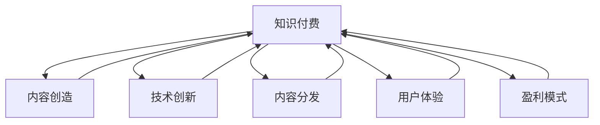

                 

# 知识付费与个人创业的结合点探索

> 关键词：知识付费,个人创业,商业模式,内容创造,技术创新,内容分发,用户体验,盈利模式

## 1. 背景介绍

### 1.1 问题由来

在知识经济和数字化转型的时代背景下，知识付费作为一种新兴商业模式，吸引了众多内容创作者和初创企业的关注。知识付费的核心在于为高质量的内容提供付费机制，使得专业知识和智慧的价值得到承认和回报，从而激励更多的优质内容生产。然而，如何在知识付费的平台上实现盈利，并且将个人创业与知识付费有效结合，成为众多创业者和内容创作者面临的共同挑战。

### 1.2 问题核心关键点

知识付费与个人创业的结合，关键在于构建一个能持续产生高质量内容的平台，同时吸引用户进行付费订阅，实现商业变现。这需要平台在内容创造、技术创新、内容分发和用户体验等多方面进行深度优化。

1. **内容创造**：如何吸引并激励内容创作者持续生产优质内容。
2. **技术创新**：如何利用最新技术手段提高内容分发的效率和效果，同时保障用户的使用体验。
3. **内容分发**：如何构建高效的内容分发网络，使得优质内容能够快速精准地触达用户。
4. **用户体验**：如何提升用户的订阅体验，增加用户粘性，实现长期稳定的收入流。
5. **盈利模式**：如何设计合理的盈利模式，实现平台和内容创作者的共赢。

### 1.3 问题研究意义

探索知识付费与个人创业的结合点，对于推动内容产业的繁荣，促进知识传播的效率，以及激发更多创业创新的活力具有重要意义。通过深入分析知识付费的商业模式，可以发现创业成功的关键要素，为创业者提供具体的实践指导和创新思路。

## 2. 核心概念与联系

### 2.1 核心概念概述

为了更好地理解知识付费与个人创业的结合点，本节将介绍几个关键概念：

- **知识付费**：用户为获取知识内容支付费用，这是知识付费平台的核心商业模式。
- **内容创造**：内容创作者创作并发布优质内容，是知识付费平台的核心资源。
- **技术创新**：利用最新的技术手段提升平台的功能和性能，提高用户体验。
- **内容分发**：通过高效的内容分发网络，使得优质内容能够精准到达用户。
- **用户体验**：平台的互动和功能设计直接影响用户的满意度和付费意愿。
- **盈利模式**：平台的盈利方式直接关系到其商业可持续性。

这些核心概念之间的联系可以通过以下Mermaid流程图来展示：



这个流程图展示了一个知识付费平台需要关注的几个关键环节及其相互关系：

1. **内容创造**：提供优质的内容是知识付费平台的基础。
2. **技术创新**：通过技术手段提升平台的功能和用户体验。
3. **内容分发**：构建高效的内容分发网络，确保内容能精准到达用户。
4. **用户体验**：提升用户体验，增加用户粘性和订阅意愿。
5. **盈利模式**：设计合理的盈利模式，实现平台和内容创作者的共赢。

## 3. 核心算法原理 & 具体操作步骤
### 3.1 算法原理概述

知识付费与个人创业的结合，本质上是通过平台将优质内容与用户需求有效对接，从而实现商业变现的过程。在这一过程中，算法扮演了核心角色，通过智能推荐算法、内容审核算法、用户行为分析算法等，确保平台高效运行。

以智能推荐算法为例，其核心思想是通过对用户历史行为和偏好进行分析，预测用户可能感兴趣的内容，并将其推荐给用户。其数学模型可以表示为：

$$
\text{推荐内容} = f(\text{用户历史行为}, \text{内容特征}, \text{用户偏好})
$$

其中，$f$ 表示推荐算法模型，用户历史行为和内容特征是输入，用户偏好是输出。通过训练好的推荐模型，可以实现内容的精准推荐。

### 3.2 算法步骤详解

下面详细介绍构建一个智能推荐算法的详细步骤：

**Step 1: 数据收集与预处理**

- 收集用户历史行为数据，如浏览记录、收藏记录、评论记录等。
- 收集内容特征数据，如文章标题、关键词、标签等。
- 对数据进行清洗、去重和标准化处理。

**Step 2: 用户行为建模**

- 通过用户历史行为数据构建用户兴趣模型，如基于协同过滤的推荐模型、基于内容基的推荐模型等。
- 通过用户行为分析，预测用户可能感兴趣的内容。

**Step 3: 内容特征提取**

- 对内容进行特征提取，如TF-IDF、词向量等。
- 对内容进行分类和标注，如情感分析、主题分类等。

**Step 4: 模型训练与优化**

- 选择推荐算法模型，如协同过滤、深度学习等。
- 使用训练集数据进行模型训练，优化模型参数。
- 在验证集上评估模型性能，调整模型超参数。

**Step 5: 实时推荐**

- 在用户访问平台时，实时计算推荐内容。
- 将推荐内容展示给用户，提升用户满意度。

**Step 6: 反馈收集与迭代**

- 收集用户对推荐内容的反馈，如点击率、购买率等。
- 根据反馈数据优化推荐算法模型。

### 3.3 算法优缺点

智能推荐算法具有以下优点：

- 提高用户满意度：通过精准推荐，使得用户能够更快找到感兴趣的内容。
- 增加平台黏性：用户对平台的黏性增加，有助于提高用户的长期订阅率。
- 提升商业价值：通过精准推荐，提升内容的付费转化率，增加平台收入。

同时，该算法也存在一定的局限性：

- 数据依赖性：推荐算法依赖于大量高质量的用户行为数据，数据质量影响推荐效果。
- 算法复杂度：深度学习等复杂算法模型需要大量的计算资源和时间训练。
- 用户隐私：在推荐过程中需要收集和处理大量用户数据，存在隐私泄露风险。
- 多样性问题：过度个性化推荐可能导致用户只能接触到单一类型的信息，限制用户视野。

### 3.4 算法应用领域

智能推荐算法在知识付费平台中的应用广泛，以下是几个典型领域：

- **课程推荐**：通过分析用户学习行为和课程特征，推荐用户可能感兴趣的在线课程。
- **文章推荐**：通过分析用户阅读行为和文章特征，推荐用户可能感兴趣的文章。
- **产品推荐**：通过分析用户购买行为和商品特征，推荐用户可能感兴趣的商品。
- **新闻推荐**：通过分析用户阅读行为和新闻内容，推荐用户可能感兴趣的新闻资讯。

此外，智能推荐算法还广泛应用于电商、社交媒体、视频网站等多个领域，成为推动内容分发和用户体验的重要工具。

## 4. 数学模型和公式 & 详细讲解  
### 4.1 数学模型构建

本节将使用数学语言对智能推荐算法的数学模型进行更加严格的刻画。

设推荐系统有 $N$ 个用户，$M$ 个内容，$U$ 为用户集合，$C$ 为内容集合。用户 $u \in U$ 对内容 $c \in C$ 的兴趣度为 $r_{uc}$，内容 $c$ 的特征向量为 $f_c$，用户 $u$ 的历史行为数据为 $D_u$。

推荐模型的目标是最小化预测误差，即：

$$
\min_{\theta} \sum_{(u,c) \in D} \text{error}(\theta; r_{uc}, \hat{r}_{uc})
$$

其中 $\hat{r}_{uc}$ 为推荐模型对用户 $u$ 对内容 $c$ 的兴趣度预测值。

### 4.2 公式推导过程

以协同过滤推荐算法为例，其基于用户历史行为数据的相似性进行推荐。具体推导过程如下：

设用户 $u$ 对内容 $c$ 的兴趣度为 $r_{uc}$，用户 $v$ 对内容 $c$ 的兴趣度为 $r_{vc}$。协同过滤算法认为，用户 $u$ 和用户 $v$ 的兴趣度相似，可以表示为：

$$
r_{uc} \approx r_{vc}
$$

进一步，可以将其表示为：

$$
r_{uc} \propto \sum_{v \neq u} r_{vc} \cdot a_{uv}
$$

其中 $a_{uv}$ 为用户的相似度系数，可以通过余弦相似度等方法计算。

对于协同过滤算法，推荐内容 $c$ 的预测兴趣度 $\hat{r}_{uc}$ 可以表示为：

$$
\hat{r}_{uc} = \sum_{v \neq u} r_{vc} \cdot a_{uv}
$$

通过最大化预测兴趣度与实际兴趣度之间的误差平方和，可以定义协同过滤算法的目标函数：

$$
\min_{a_{uv}} \sum_{u \in U} \sum_{c \in C} (r_{uc} - \sum_{v \neq u} r_{vc} \cdot a_{uv})^2
$$

利用矩阵分解和奇异值分解等方法，可以进一步简化上述目标函数，得到协同过滤算法的优化目标：

$$
\min_{X, Y} \|AX - Y\|_F^2
$$

其中 $X$ 为内容特征矩阵，$Y$ 为用户兴趣矩阵，$A$ 为用户相似度矩阵。

### 4.3 案例分析与讲解

以B站为例，分析其基于协同过滤的课程推荐算法：

1. **数据收集与预处理**：B站收集用户历史观看数据，包括观看的课程、观看时间等行为数据。对课程进行分类和标注，如计算机科学、语言学等。
2. **用户行为建模**：通过协同过滤算法，分析用户的历史观看行为，计算用户对不同课程的兴趣度。
3. **内容特征提取**：对课程进行特征提取，如课程标题、讲师名称、课程评价等。
4. **模型训练与优化**：使用协同过滤算法对用户行为和课程特征进行模型训练，优化用户相似度系数和课程特征系数。
5. **实时推荐**：在用户访问B站时，实时计算推荐课程，并展示给用户。
6. **反馈收集与迭代**：收集用户对推荐课程的反馈数据，如观看次数、观看时长等，根据反馈数据优化推荐算法模型。

通过这一算法，B站实现了精准的课程推荐，提升了用户的观看体验和平台黏性，实现了良好的商业价值。

## 5. 项目实践：代码实例和详细解释说明
### 5.1 开发环境搭建

在进行智能推荐算法实践前，我们需要准备好开发环境。以下是使用Python进行PyTorch开发的环境配置流程：

1. 安装Anaconda：从官网下载并安装Anaconda，用于创建独立的Python环境。

2. 创建并激活虚拟环境：
```bash
conda create -n pytorch-env python=3.8 
conda activate pytorch-env
```

3. 安装PyTorch：根据CUDA版本，从官网获取对应的安装命令。例如：
```bash
conda install pytorch torchvision torchaudio cudatoolkit=11.1 -c pytorch -c conda-forge
```

4. 安装TensorFlow：
```bash
pip install tensorflow
```

5. 安装pandas和numpy：
```bash
pip install pandas numpy
```

6. 安装Jupyter Notebook：
```bash
pip install jupyter notebook
```

完成上述步骤后，即可在`pytorch-env`环境中开始算法实践。

### 5.2 源代码详细实现

下面以协同过滤算法为例，给出使用PyTorch进行智能推荐算法开发的PyTorch代码实现。

首先，定义协同过滤算法模型：

```python
import torch
import torch.nn as nn
from sklearn.metrics.pairwise import cosine_similarity

class CollaborativeFiltering(nn.Module):
    def __init__(self, num_users, num_contents, embedding_dim):
        super(CollaborativeFiltering, self).__init__()
        self.num_users = num_users
        self.num_contents = num_contents
        self.embedding_dim = embedding_dim
        self.user_embeddings = nn.Embedding(num_users, embedding_dim)
        self.content_embeddings = nn.Embedding(num_contents, embedding_dim)
        self.affinity_matrix = nn.Parameter(torch.randn(num_users, num_users))
        
    def forward(self, user_ids, content_ids):
        user_embeddings = self.user_embeddings(user_ids)
        content_embeddings = self.content_embeddings(content_ids)
        user_similarity = torch.matmul(user_embeddings, self.affinity_matrix) + torch.matmul(self.affinity_matrix, user_embeddings.t())
        content_similarity = torch.matmul(content_embeddings, content_embeddings.t())
        predicted_ratings = torch.matmul(user_similarity, content_similarity)
        return predicted_ratings
```

然后，定义数据处理函数：

```python
import pandas as pd
from sklearn.model_selection import train_test_split

def load_data(file_path):
    data = pd.read_csv(file_path)
    user_ids = data['user_id'].tolist()
    content_ids = data['content_id'].tolist()
    ratings = data['rating'].tolist()
    return user_ids, content_ids, ratings

# 划分训练集和测试集
user_ids, content_ids, ratings = load_data('data.csv')
train_user_ids, test_user_ids, train_content_ids, test_content_ids, train_ratings, test_ratings = train_test_split(user_ids, content_ids, ratings, test_size=0.2, random_state=42)
```

接着，定义训练和评估函数：

```python
import numpy as np

def train_model(model, user_ids, content_ids, ratings, num_epochs=10, batch_size=32):
    model.train()
    optimizer = torch.optim.Adam(model.parameters(), lr=0.001)
    criterion = nn.MSELoss()
    
    for epoch in range(num_epochs):
        total_loss = 0
        for i in range(0, len(user_ids), batch_size):
            user_ids_batch = torch.LongTensor(user_ids[i:i+batch_size])
            content_ids_batch = torch.LongTensor(content_ids[i:i+batch_size])
            ratings_batch = torch.FloatTensor(ratings[i:i+batch_size])
            
            optimizer.zero_grad()
            predicted_ratings = model(user_ids_batch, content_ids_batch)
            loss = criterion(predicted_ratings, ratings_batch)
            loss.backward()
            optimizer.step()
            total_loss += loss.item()
        
        print(f"Epoch {epoch+1}, loss: {total_loss/len(user_ids):.4f}")
    
    return model

def evaluate_model(model, user_ids, content_ids, ratings):
    model.eval()
    total_loss = 0
    for i in range(0, len(user_ids), 32):
        user_ids_batch = torch.LongTensor(user_ids[i:i+32])
        content_ids_batch = torch.LongTensor(content_ids[i:i+32])
        ratings_batch = torch.FloatTensor(ratings[i:i+32])
        
        predicted_ratings = model(user_ids_batch, content_ids_batch)
        loss = criterion(predicted_ratings, ratings_batch)
        total_loss += loss.item()
    
    return total_loss / len(user_ids)
```

最后，启动训练流程并在测试集上评估：

```python
embedding_dim = 10
model = CollaborativeFiltering(len(train_user_ids), len(train_content_ids), embedding_dim)

model = train_model(model, train_user_ids, train_content_ids, train_ratings)

print(f"Test loss: {evaluate_model(model, test_user_ids, test_content_ids, test_ratings):.4f}")
```

以上就是使用PyTorch对协同过滤算法进行智能推荐算法开发的完整代码实现。可以看到，PyTorch提供了强大的深度学习框架，使得模型的构建、训练和评估过程变得简单高效。

### 5.3 代码解读与分析

让我们再详细解读一下关键代码的实现细节：

**CollaborativeFiltering类**：
- `__init__`方法：初始化协同过滤算法的参数，包括用户数、内容数和嵌入维度。
- `forward`方法：定义前向传播过程，计算预测评分。

**load_data函数**：
- 从数据文件中读取用户ID、内容ID和评分数据，并进行划分。

**train_model函数**：
- 定义训练过程，包括损失函数、优化器和模型参数的更新。
- 通过Adam优化器进行梯度更新，最小化预测评分和真实评分之间的均方误差。

**evaluate_model函数**：
- 定义评估过程，计算模型在测试集上的均方误差。

**训练流程**：
- 定义嵌入维度，创建协同过滤算法模型。
- 在训练集上训练模型，输出每个epoch的损失。
- 在测试集上评估模型，输出测试集的均方误差。

可以看到，通过这一系列代码，我们实现了一个基本的协同过滤推荐算法，并验证了其在实际数据集上的效果。

当然，工业级的系统实现还需考虑更多因素，如模型的保存和部署、超参数的自动搜索、更多的正则化技术等。但核心的算法流程基本与此类似。

## 6. 实际应用场景
### 6.1 智能课程推荐

智能课程推荐系统在知识付费平台中具有重要应用价值。通过分析用户的学习行为和课程特征，系统可以推荐用户感兴趣的高质量课程，提升用户的购买转化率和平台收益。

在技术实现上，智能课程推荐系统可以采用协同过滤、基于内容的推荐、混合推荐等算法，根据用户的个性化需求进行精准推荐。例如，B站和Coursera等平台已经广泛应用了这些技术，帮助用户发现感兴趣的课程。

### 6.2 智能文章推荐

智能文章推荐系统可以应用于知识付费平台的内容分发。通过分析用户的阅读行为和文章特征，系统可以推荐用户感兴趣的高质量文章，增加用户粘性和平台收益。

例如，知乎和Medium等平台已经成功应用了智能文章推荐系统，使得用户能够快速找到有价值的内容，提升平台的用户体验和内容流通率。

### 6.3 智能商品推荐

智能商品推荐系统可以应用于电商平台的知识付费内容。通过分析用户的购买行为和商品特征，系统可以推荐用户感兴趣的商品，增加用户的购买转化率和平台收益。

例如，Amazon和Alibaba等电商平台的商品推荐系统已经广泛应用，用户可以更快速地找到所需商品，提升购物体验。

### 6.4 未来应用展望

随着智能推荐算法的不断发展，基于知识付费与个人创业的结合点将展现出更加广阔的前景。未来，知识付费平台可以进一步拓展其应用场景，覆盖更多领域和用户群体。

1. **教育领域**：智能教育推荐系统可以推荐用户感兴趣的在线课程和学习资料，提升教育效果和学习体验。
2. **医疗领域**：智能医疗推荐系统可以推荐用户感兴趣的医疗资讯和专家，提升医疗服务的可及性和质量。
3. **金融领域**：智能金融推荐系统可以推荐用户感兴趣的投资资讯和理财方案，提升金融服务的个性化和精准度。
4. **娱乐领域**：智能娱乐推荐系统可以推荐用户感兴趣的电影、音乐和游戏等，提升用户的娱乐体验和满意度。

此外，未来的智能推荐系统还将结合更多先进技术，如深度学习、强化学习、因果推断等，进一步提升推荐的精度和多样性，实现更加智能化和个性化的推荐服务。

## 7. 工具和资源推荐
### 7.1 学习资源推荐

为了帮助开发者系统掌握智能推荐算法的理论基础和实践技巧，这里推荐一些优质的学习资源：

1. **《推荐系统实战》**：该书系统介绍了推荐算法的原理和应用，包括协同过滤、基于内容的推荐等。
2. **Coursera《Recommender Systems》课程**：由斯坦福大学开设的推荐系统课程，涵盖推荐算法的基本概念和实践方法。
3. **Kaggle推荐系统竞赛**：通过参与推荐系统竞赛，实战提升推荐算法的设计和优化能力。
4. **Kaggle推荐系统资源库**：提供大量推荐系统相关的数据集和模型，供开发者学习和实践。
5. **《Python机器学习》**：该书介绍了机器学习的基本概念和算法，包括推荐系统的实现方法。

通过对这些资源的学习实践，相信你一定能够快速掌握智能推荐算法的精髓，并用于解决实际的推荐问题。

### 7.2 开发工具推荐

高效的开发离不开优秀的工具支持。以下是几款用于智能推荐算法开发的常用工具：

1. **PyTorch**：基于Python的开源深度学习框架，灵活动态的计算图，适合快速迭代研究。
2. **TensorFlow**：由Google主导开发的开源深度学习框架，生产部署方便，适合大规模工程应用。
3. **Scikit-learn**：Python机器学习库，提供丰富的算法和工具，适用于推荐算法的建模和评估。
4. **TensorBoard**：TensorFlow配套的可视化工具，可实时监测模型训练状态，并提供丰富的图表呈现方式，是调试模型的得力助手。
5. **Jupyter Notebook**：Python编程环境，支持代码编写和交互式计算，便于学习研究。

合理利用这些工具，可以显著提升智能推荐算法的开发效率，加快创新迭代的步伐。

### 7.3 相关论文推荐

智能推荐算法的相关研究论文众多，以下是几篇经典的论文，推荐阅读：

1. **《协同过滤推荐系统》**：提出协同过滤算法的基本思想和实现方法，是推荐系统的经典之作。
2. **《基于深度学习的推荐系统》**：介绍基于深度学习技术的推荐系统，包括神经网络、深度强化学习等方法。
3. **《因果推断在推荐系统中的应用》**：探讨因果推断技术在推荐系统中的应用，提升推荐结果的因果合理性和多样性。
4. **《混合推荐算法》**：提出混合推荐算法的思想，结合协同过滤和基于内容的推荐方法，提升推荐效果。
5. **《强化学习在推荐系统中的应用》**：介绍强化学习技术在推荐系统中的应用，提升推荐系统的动态适应性和智能性。

这些论文代表了大规模推荐系统的最新研究进展，通过学习这些前沿成果，可以帮助研究者把握推荐系统的研究前沿，激发更多的创新灵感。

## 8. 总结：未来发展趋势与挑战
### 8.1 总结

本文对知识付费与个人创业的结合点进行了全面系统的介绍。首先阐述了知识付费和内容创业的核心概念和关键问题，明确了在内容创造、技术创新、内容分发、用户体验和盈利模式等多方面需要优化和改进的方向。其次，详细讲解了智能推荐算法的数学原理和具体步骤，给出了Python实现的代码实例。同时，本文还探讨了智能推荐算法在知识付费平台中的应用场景，分析了其未来发展趋势和面临的挑战。

通过本文的系统梳理，可以看到，智能推荐算法在知识付费平台中扮演了核心角色，其优化程度直接影响到平台的商业价值和用户体验。未来，伴随推荐算法的不断演进，知识付费平台必将在内容分发和用户体验方面迈向新的高峰，为内容创作者和用户带来更大的价值。

### 8.2 未来发展趋势

展望未来，智能推荐算法将呈现以下几个发展趋势：

1. **推荐算法的复杂化**：随着深度学习等技术的发展，推荐算法将更加复杂和精确，能够更好地捕捉用户和内容的交互关系。
2. **推荐算法的融合化**：不同推荐算法之间的融合将使得推荐结果更加全面和准确，提升用户满意度。
3. **推荐算法的实时化**：通过实时数据分析和计算，推荐系统能够动态更新推荐结果，提升用户体验。
4. **推荐算法的定制化**：根据用户个性化需求，定制推荐策略，提升推荐结果的个性化程度。
5. **推荐算法的智能化**：引入更多先进技术，如因果推断、强化学习等，提升推荐系统的智能性和适应性。

这些趋势凸显了智能推荐算法在知识付费平台中的重要地位，通过不断的技术创新和算法优化，推荐系统将变得更加智能化和精准化。

### 8.3 面临的挑战

尽管智能推荐算法在知识付费平台中取得了显著成效，但在迈向更加智能化、个性化应用的过程中，仍面临诸多挑战：

1. **数据隐私**：推荐算法需要大量用户数据，数据隐私问题必须得到重视和解决。
2. **算法偏见**：推荐算法可能会存在偏见，影响推荐结果的公平性和公正性。
3. **模型复杂度**：复杂的推荐算法需要大量的计算资源和时间训练，存在资源瓶颈。
4. **多样性问题**：过度个性化推荐可能导致用户只能接触到单一类型的信息，限制用户视野。
5. **用户体验**：推荐算法需要考虑用户的使用体验，避免过度推荐导致用户疲惫。

这些挑战需要平台和开发者共同面对，通过技术创新和优化，逐步克服这些难题，提升推荐算法的质量和效果。

### 8.4 研究展望

面对智能推荐算法所面临的挑战，未来的研究需要在以下几个方面寻求新的突破：

1. **数据隐私保护**：通过数据去标识化、差分隐私等技术，保护用户隐私，同时提升推荐算法的性能。
2. **算法公平性**：引入更多的公平性约束，确保推荐结果的公正性和公平性。
3. **资源优化**：采用模型压缩、稀疏化存储等技术，优化推荐算法的计算资源和时间效率。
4. **多样性引导**：在推荐算法中加入多样性约束，确保用户能够接触到多样化的内容，拓宽视野。
5. **用户体验优化**：优化推荐算法的设计，提升用户的使用体验，减少用户负担。

这些研究方向的探索，将有助于提升推荐算法的质量和效果，实现更加智能化、个性化和公平化的推荐服务。

## 9. 附录：常见问题与解答

**Q1：如何选择合适的推荐算法？**

A: 选择合适的推荐算法需要考虑多个因素，包括数据类型、推荐场景、用户需求等。协同过滤、基于内容的推荐、深度学习等算法各有优缺点，需要根据具体应用场景进行选择。

**Q2：推荐算法如何处理冷启动问题？**

A: 冷启动问题是指用户没有足够的行为数据，无法进行有效推荐。处理冷启动问题的方法包括基于用户兴趣的推荐、基于物品相似性的推荐等。

**Q3：推荐算法如何处理数据稀疏性问题？**

A: 数据稀疏性问题是指用户行为数据稀疏，无法准确捕捉用户兴趣。处理数据稀疏性问题的方法包括矩阵分解、隐语义模型等。

**Q4：推荐算法如何处理多样性问题？**

A: 多样性问题是指推荐结果过于单一，无法满足用户多样化的需求。处理多样性问题的方法包括引入多样性约束、随机推荐等。

**Q5：推荐算法如何处理推荐结果的实时性？**

A: 推荐结果的实时性可以通过构建实时推荐系统实现，利用流式数据处理和实时计算技术，提升推荐结果的及时性。

通过本文的系统梳理，可以看到，智能推荐算法在知识付费平台中扮演了核心角色，其优化程度直接影响到平台的商业价值和用户体验。未来，伴随推荐算法的不断演进，知识付费平台必将在内容分发和用户体验方面迈向新的高峰，为内容创作者和用户带来更大的价值。

---

作者：禅与计算机程序设计艺术 / Zen and the Art of Computer Programming

