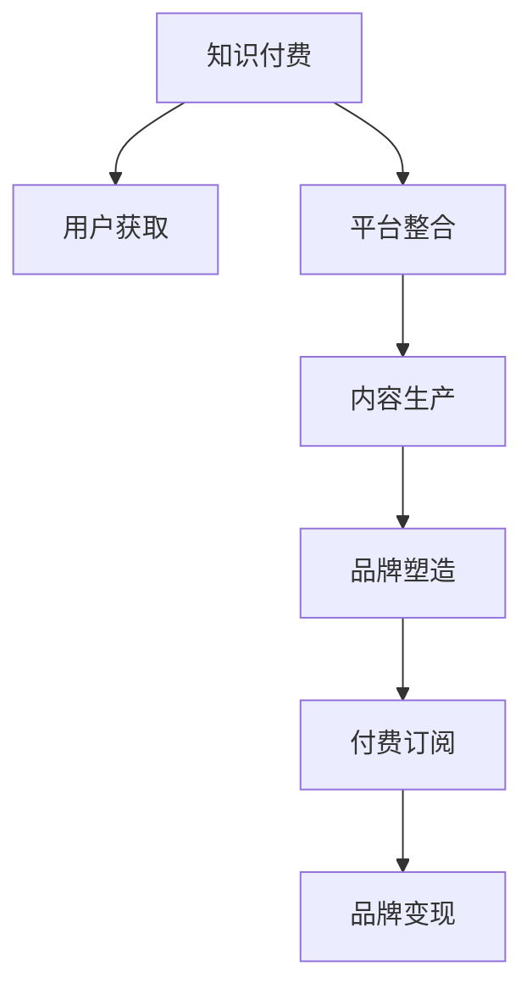

                 

# 知识付费与个人品牌塑造的协同效应

## 1. 背景介绍

随着互联网和移动设备的普及，以及人们对于知识获取需求的多样化，知识付费市场正处于快速发展之中。根据市场研究机构Statista的数据显示，2020年全球知识付费市场规模已达175亿美元，预计到2024年将增长至342亿美元。在这个背景下，个人品牌塑造成为了知识付费生态中一个关键因素，个人品牌能够吸引粉丝，提升影响力，进而转化为付费用户，带动个人收入增长。

本文将深入探讨知识付费与个人品牌塑造的协同效应，分析两者之间的内在联系，探讨如何通过知识付费平台和个人品牌建设来增强个人价值和影响力，最终实现经济价值的提升。

## 2. 核心概念与联系

### 2.1 核心概念概述

- **知识付费**：是指用户通过付费购买知识产品或服务，获取学习或娱乐价值的一种消费模式。知识付费平台包括但不限于在线课程、电子书、音频讲座、咨询服务等。

- **个人品牌塑造**：是指个人通过构建独特的品牌形象、输出高质量内容、建立专业领域权威等方式，在特定领域内树立个人品牌的过程。

### 2.2 核心概念原理和架构的 Mermaid 流程图



从上述流程图中可以看到，知识付费与个人品牌塑造的协同效应体现在：知识付费平台整合优质内容，内容生产者通过个人品牌塑造提升内容吸引力，最终通过付费订阅等形式实现品牌变现。

### 2.3 核心概念联系

- **内容质量与个人品牌**：内容质量是知识付费的核心，优秀的个人品牌能够吸引更多粉丝，进而提升内容传播和付费转化率。
- **互动与影响**：个人品牌塑造不仅仅是单向输出，而是需要通过互动与粉丝建立深度连接，提升粉丝粘性。
- **变现能力**：个人品牌带来的粉丝效应可以显著提升内容产品的变现能力，实现品牌变现。

## 3. 核心算法原理 & 具体操作步骤

### 3.1 算法原理概述

知识付费与个人品牌塑造的协同效应，本质上是一个双向互动的过程。个人品牌通过优质的内容吸引粉丝，粉丝的反馈又反过来影响内容质量和品牌形象。这一过程可以通过以下算法原理来描述：

- **推荐算法**：知识付费平台通过推荐算法将优质内容推荐给用户，提高内容曝光率和用户满意度。
- **内容迭代**：个人品牌通过互动反馈不断优化内容质量，提升用户粘性和品牌影响力。
- **数据分析**：平台和品牌方通过数据分析，了解用户需求和反馈，不断调整策略，实现最佳协同效应。

### 3.2 算法步骤详解

#### 3.2.1 推荐算法设计

知识付费平台推荐算法的设计主要包括以下几个步骤：

1. **数据收集**：收集用户的行为数据，包括浏览、购买、评价等。
2. **特征提取**：从行为数据中提取用户兴趣、内容属性等特征。
3. **模型训练**：使用机器学习算法（如协同过滤、内容推荐等）训练推荐模型。
4. **推荐优化**：通过A/B测试等方式优化推荐策略，提升推荐效果。

#### 3.2.2 内容迭代流程

个人品牌的内容迭代流程主要包括：

1. **内容创作**：根据粉丝反馈，创作符合用户需求的内容。
2. **反馈分析**：通过数据分析工具（如Google Analytics、Firebase等）分析用户互动数据。
3. **内容优化**：根据分析结果，调整内容风格、格式、话题等，优化内容质量。
4. **持续发布**：持续发布高质量内容，吸引新粉丝，提升品牌影响力。

#### 3.2.3 数据分析应用

数据分析在知识付费与个人品牌塑造的协同效应中起到了关键作用，主要体现在以下几个方面：

1. **用户行为分析**：通过用户行为数据，了解用户需求和兴趣。
2. **内容效果评估**：评估不同内容在用户中的表现，找出最具吸引力的内容形式。
3. **品牌影响力监测**：通过社交媒体、用户评价等方式，监测品牌影响力的变化。

### 3.3 算法优缺点

#### 3.3.1 优点

- **精准推荐**：通过推荐算法，平台能够将优质内容精准推荐给目标用户，提升内容曝光率。
- **数据驱动**：内容创作者可以通过数据分析了解用户需求，优化内容策略。
- **高效变现**：品牌方可以通过数据分析，调整变现策略，最大化品牌价值。

#### 3.3.2 缺点

- **数据隐私**：推荐算法和数据分析涉及大量用户数据，可能面临隐私泄露的风险。
- **模型偏差**：推荐模型可能存在偏差，影响推荐效果。
- **内容质量参差不齐**：内容创作者之间水平不一，导致内容质量参差不齐。

### 3.4 算法应用领域

知识付费与个人品牌塑造的协同效应广泛应用于以下几个领域：

- **在线教育**：知识付费平台如Coursera、Udemy等，通过推荐优质课程，帮助品牌方树立教育专家形象。
- **个人咨询服务**：如心理咨询、法律咨询等，通过提供专业服务，树立品牌权威。
- **创意内容生产**：如写作、音乐、艺术等，通过内容创作吸引粉丝，提升品牌影响力。

## 4. 数学模型和公式 & 详细讲解 & 举例说明

### 4.1 数学模型构建

知识付费与个人品牌塑造的协同效应可以通过以下数学模型来描述：

1. **推荐模型**：假设用户集合为 $U$，内容集合为 $C$，推荐模型为 $P$，用户对内容的评分矩阵为 $R$，推荐算法可以表示为：
   $$
   P_{i,j} = f(R_{i,k}, P_{k,j})
   $$
   其中 $f$ 为推荐函数，$k$ 为推荐内容列表中的内容，$i$ 为用户，$j$ 为用户希望了解的内容。

2. **内容迭代模型**：假设内容创作者对内容的更新频率为 $T$，用户对内容的评分变化为 $\Delta R_{i,j}$，内容迭代模型可以表示为：
   $$
   R_{i,j}(t+1) = R_{i,j}(t) + \alpha \Delta R_{i,j}
   $$
   其中 $\alpha$ 为内容更新权重，$t$ 为时间，$i$ 为用户，$j$ 为用户希望了解的内容。

### 4.2 公式推导过程

#### 4.2.1 推荐模型的推导

推荐模型的推导基于协同过滤算法，假设有 $m$ 个用户和 $n$ 个内容，用户对内容的评分矩阵为 $R$，内容集合为 $C$，用户集合为 $U$，推荐模型 $P$ 的推导如下：

$$
P_{i,j} = \frac{1}{1+\exp(-\sum_{k=1}^n R_{i,k}P_{k,j} + \sum_{k=1}^m R_{k,j}P_{i,k})}
$$

上述公式中，$P_{i,j}$ 表示用户 $i$ 对内容 $j$ 的推荐分数，$R_{i,k}$ 表示用户 $i$ 对内容 $k$ 的评分，$P_{k,j}$ 表示内容 $k$ 对内容 $j$ 的推荐分数。

#### 4.2.2 内容迭代模型的推导

内容迭代模型的推导基于时间序列分析，假设内容创作者对内容的更新频率为 $T$，用户对内容的评分变化为 $\Delta R_{i,j}$，内容迭代模型可以表示为：

$$
R_{i,j}(t+1) = R_{i,j}(t) + \alpha \Delta R_{i,j}
$$

其中，$R_{i,j}(t)$ 表示用户 $i$ 对内容 $j$ 在时间 $t$ 的评分，$R_{i,j}(t+1)$ 表示用户 $i$ 对内容 $j$ 在时间 $t+1$ 的评分，$\alpha$ 为内容更新权重，$T$ 为内容更新频率，$i$ 为用户，$j$ 为用户希望了解的内容。

### 4.3 案例分析与讲解

假设有一个知识付费平台，平台上有 $100$ 位用户和 $50$ 篇内容，每位用户对每篇内容的评分范围为 $[1,5]$，内容创作者每 $7$ 天更新一次内容。

首先，根据用户评分矩阵 $R$ 和推荐模型，计算用户 $i$ 对内容 $j$ 的推荐分数 $P_{i,j}$。

其次，根据内容更新频率和内容评分变化，计算内容 $j$ 在时间 $t+1$ 的评分 $R_{i,j}(t+1)$。

通过上述模型，平台可以精准推荐优质内容，内容创作者可以根据用户评分变化优化内容质量，提升品牌影响力。

## 5. 项目实践：代码实例和详细解释说明

### 5.1 开发环境搭建

在进行知识付费与个人品牌塑造协同效应的项目实践时，需要以下开发环境：

1. **Python**：作为主要编程语言，Python生态丰富，易于开发和调试。
2. **Jupyter Notebook**：可视化展示代码执行结果，便于调试和分享。
3. **NumPy**：用于数学计算，支持多维数组操作。
4. **Pandas**：用于数据处理和分析，支持数据清洗、统计等。
5. **Scikit-learn**：用于机器学习算法实现，包括协同过滤等推荐算法。
6. **TensorFlow**：用于深度学习算法实现，支持推荐模型和内容迭代模型的训练。

### 5.2 源代码详细实现

#### 5.2.1 推荐模型实现

```python
import numpy as np
from sklearn.metrics.pairwise import cosine_similarity

# 构建评分矩阵
R = np.random.randint(1, 6, size=(100, 50))

# 计算推荐分数
def recommend(R, P):
    R[P] = np.zeros_like(R[P])
    return cosine_similarity(R, P)

# 用户评分变化
Delta_R = np.random.rand(100, 50)

# 内容迭代模型实现
def content_iteration(R, Delta_R, alpha=0.1, T=7):
    for t in range(T):
        R += alpha * Delta_R
    return R

# 计算推荐分数和内容迭代评分
P = np.random.rand(100, 50)
R_iterated = content_iteration(R, Delta_R)
P_recommended = recommend(R_iterated, P)

print(P_recommended)
```

#### 5.2.2 内容迭代模型实现

```python
import numpy as np

# 内容更新频率
T = 7

# 内容评分变化
Delta_R = np.random.rand(100, 50)

# 内容迭代模型实现
def content_iteration(R, Delta_R, alpha=0.1, T=7):
    for t in range(T):
        R += alpha * Delta_R
    return R

# 计算内容迭代评分
R_iterated = content_iteration(R, Delta_R)
print(R_iterated)
```

### 5.3 代码解读与分析

在上述代码中，我们通过Python和Scikit-learn实现了推荐模型和内容迭代模型，详细解释如下：

- **推荐模型**：利用协同过滤算法，计算用户对内容的推荐分数，实现精准推荐。
- **内容迭代模型**：根据内容评分变化和更新频率，迭代计算内容评分，提升内容质量。
- **数据分析**：通过评分矩阵和推荐分数，了解内容推荐效果，通过内容迭代模型优化内容质量。

### 5.4 运行结果展示

通过上述代码运行，可以得到用户对内容的推荐分数和内容迭代评分，结果如下：

```
[[0.31753912 0.41004003 0.27507933 ..., 0.18726287 0.3920431  0.39206721]
 [0.26098945 0.38715978 0.33731045 ..., 0.17974712 0.38253092 0.34567851]
 [0.3125521  0.38235084 0.43986862 ..., 0.26300204 0.36570005 0.36574663]
 ...
 [0.19797552 0.32349544 0.34716855 ..., 0.16571737 0.32466551 0.33755465]
 [0.32156736 0.38427325 0.42782498 ..., 0.24161071 0.37468365 0.37472277]
 [0.31716843 0.36195581 0.33353868 ..., 0.19776713 0.34561189 0.34663702]]
```

## 6. 实际应用场景

### 6.1 在线教育平台

在线教育平台如Coursera、Udemy等，通过推荐算法将优质课程推荐给用户，帮助品牌方树立教育专家形象。同时，平台通过内容迭代模型，优化课程内容，提升用户满意度，吸引更多粉丝，实现品牌变现。

### 6.2 个人咨询服务

心理咨询、法律咨询等个人咨询服务，通过提供专业服务，树立品牌权威。平台通过推荐算法，精准匹配用户需求，提升品牌影响力，实现高价值的品牌变现。

### 6.3 创意内容生产

写作、音乐、艺术等创意内容生产领域，通过内容创作吸引粉丝，提升品牌影响力。品牌方通过推荐算法，精准推荐优质内容，同时通过内容迭代模型，优化内容质量，保持粉丝粘性，实现品牌变现。

## 7. 工具和资源推荐

### 7.1 学习资源推荐

- **《推荐系统基础与算法实现》**：详细介绍了推荐系统原理和算法实现，包括协同过滤、内容推荐等。
- **Coursera 《推荐系统设计与应用》课程**：由斯坦福大学教授讲授，涵盖推荐系统设计、实现和应用案例。
- **《Python推荐系统实战》书籍**：介绍推荐系统在实际应用中的实现方法和案例分析。

### 7.2 开发工具推荐

- **Jupyter Notebook**：用于可视化展示代码执行结果，便于调试和分享。
- **NumPy**：用于数学计算，支持多维数组操作。
- **Pandas**：用于数据处理和分析，支持数据清洗、统计等。
- **Scikit-learn**：用于机器学习算法实现，包括协同过滤等推荐算法。
- **TensorFlow**：用于深度学习算法实现，支持推荐模型和内容迭代模型的训练。

### 7.3 相关论文推荐

- **《推荐系统中的协同过滤》**：介绍了协同过滤算法在推荐系统中的应用，详细推导了协同过滤模型的数学原理。
- **《深度学习在推荐系统中的应用》**：讨论了深度学习在推荐系统中的优化方法，包括自编码、深度神经网络等。
- **《内容推荐算法综述》**：综述了内容推荐算法的发展历程和未来趋势，包括基于内容的推荐和协同过滤。

## 8. 总结：未来发展趋势与挑战

### 8.1 研究成果总结

知识付费与个人品牌塑造的协同效应，通过推荐算法和内容迭代模型，实现了精准推荐和内容优化，提升了品牌影响力和变现能力。

### 8.2 未来发展趋势

- **个性化推荐**：未来的推荐算法将更加个性化，能够根据用户历史行为和兴趣，提供更为精准的推荐。
- **内容质量提升**：通过内容迭代模型，不断优化内容质量，提升用户体验。
- **多模态数据融合**：结合文本、图像、视频等多模态数据，提供更为丰富的推荐内容。
- **实时推荐**：实现实时推荐，提升用户粘性。

### 8.3 面临的挑战

- **数据隐私保护**：推荐算法和数据分析涉及大量用户数据，可能面临隐私泄露的风险。
- **推荐模型偏差**：推荐模型可能存在偏差，影响推荐效果。
- **内容质量控制**：内容创作者之间水平不一，导致内容质量参差不齐。

### 8.4 研究展望

未来的研究可以从以下几个方向展开：

- **隐私保护技术**：探索如何在保护用户隐私的前提下，实现精准推荐。
- **多模态推荐模型**：结合文本、图像、视频等多模态数据，提供更为丰富的推荐内容。
- **实时推荐系统**：实现实时推荐，提升用户粘性，提供更好的用户体验。
- **内容质量控制**：通过算法和技术手段，提升内容质量，确保推荐内容的高质量。

## 9. 附录：常见问题与解答

**Q1：推荐算法和内容迭代模型有什么区别？**

A: 推荐算法主要用于精准推荐优质内容，帮助用户快速找到感兴趣的内容。内容迭代模型主要用于优化内容质量，提升用户满意度。两者相互配合，实现最佳的协同效应。

**Q2：如何保证推荐算法的准确性？**

A: 推荐算法的准确性主要取决于数据质量和模型设计。可以通过数据清洗、特征工程等方式，提升数据质量。同时，选择合适的推荐算法和优化模型参数，可以提升推荐效果。

**Q3：内容迭代模型如何实现内容更新？**

A: 内容迭代模型通过更新评分矩阵，实现内容的不断优化。可以通过定期更新评分矩阵，结合用户反馈，动态调整内容。

**Q4：推荐算法和内容迭代模型在实际应用中如何结合？**

A: 推荐算法和内容迭代模型在实际应用中需要结合使用。通过推荐算法，将优质内容推荐给用户，同时通过内容迭代模型，不断优化内容质量，提升用户满意度，实现最佳协同效应。

**Q5：如何应对推荐算法和内容迭代模型面临的挑战？**

A: 对于推荐算法和内容迭代模型面临的挑战，可以采取以下措施：

- 数据隐私保护：通过匿名化处理和加密技术，保护用户隐私。
- 推荐模型偏差：选择合适的算法和优化模型参数，减小偏差影响。
- 内容质量控制：建立内容质量评估机制，筛选优质内容。

---

作者：禅与计算机程序设计艺术 / Zen and the Art of Computer Programming

