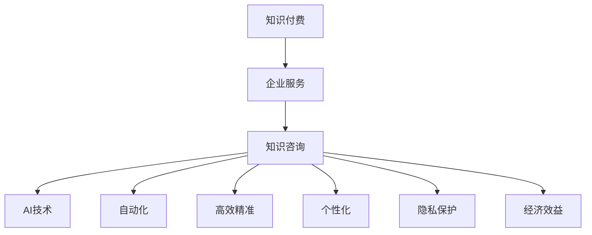

                 

# 知识付费与企业服务相结合的知识咨询模式

> 关键词：知识付费,企业服务,知识咨询,AI技术,自动化,高效精准,个性化,隐私保护,经济效益

## 1. 背景介绍

### 1.1 问题由来
随着知识经济时代的到来，知识作为一种重要资产，越来越受到企业的重视。传统的人力资源和物理资产逐渐向知识和信息资产转变，知识共享和知识利用成为企业发展的重要驱动力。然而，知识利用效率较低的问题仍然普遍存在，企业知识管理的难度和成本不断增加，传统的知识管理模式难以满足现代企业的知识需求。

### 1.2 问题核心关键点
企业知识管理面临的核心问题包括：
- 知识分散存储：企业内部知识往往分散存储在各类文档、邮件、会议纪要中，难以系统化管理和调用。
- 知识获取不便：员工面对大量复杂、分散的知识，难以快速获取所需信息，影响工作效率。
- 知识共享困难：企业内部知识共享意愿不足，知识孤岛现象严重。
- 知识利用不足：知识管理流程不健全，知识利用率低，难以形成知识价值。

## 2. 核心概念与联系

### 2.1 核心概念概述

为更好地理解知识付费与企业服务相结合的知识咨询模式，本节将介绍几个密切相关的核心概念：

- **知识付费**：指知识消费者为获取知识、技能和信息所支付的费用，包括内容付费、服务付费和平台付费等形式。
- **企业服务**：指企业通过服务供应商提供各种专业支持，包括IT服务、咨询服务和人力资源服务等，帮助企业提升运营效率和竞争力。
- **知识咨询**：指利用专业知识、技术和工具，为企业提供定制化、个性化的知识解决方案，帮助企业解决知识管理难题。
- **AI技术**：指人工智能领域的技术，包括机器学习、自然语言处理、计算机视觉等，用于知识获取、处理和应用。
- **自动化**：指通过智能化工具和算法，自动完成部分或全部知识管理流程，提高效率。
- **高效精准**：指在知识咨询过程中，利用先进算法和大数据技术，提高知识获取的准确性和效率。
- **个性化**：指根据用户需求和偏好，定制化提供知识解决方案，提升用户体验。
- **隐私保护**：指在知识咨询过程中，注重用户隐私和数据安全，遵守相关法律法规。
- **经济效益**：指知识付费和企业服务相结合的模式，能够为企业带来可观的经济回报，提升整体竞争力。

这些核心概念之间的逻辑关系可以通过以下Mermaid流程图来展示：



这个流程图展示了这个模式的各个组成部分及其之间的联系：

1. 知识付费是企业获取知识服务的前提和基础。
2. 企业服务为企业提供专业支持，包括技术支持、咨询服务等。
3. 知识咨询结合AI技术和自动化手段，实现高效精准的知识获取和个性化服务。
4. 隐私保护和效益提升是知识咨询服务的保障和结果。

## 3. 核心算法原理 & 具体操作步骤

### 3.1 算法原理概述

知识付费与企业服务相结合的知识咨询模式，其核心在于利用先进的AI技术，提供高效精准、个性化的知识咨询服务，并通过知识付费机制，为企业和知识提供者带来经济效益。其基本原理如下：

1. **知识获取**：通过自动化工具和算法，从企业内部和外部海量数据中快速、准确地获取所需知识。
2. **知识处理**：利用自然语言处理、文本挖掘等技术，对知识进行分类、标注、关联等处理，形成结构化、系统化的知识库。
3. **知识咨询**：根据用户需求，结合个性化推荐算法和智能问答系统，提供定制化的知识解决方案。
4. **知识付费**：通过知识咨询平台，采用订阅、按需付费等方式，为企业用户提供知识服务，并保障知识提供者的合理收益。
5. **知识应用**：企业用户利用知识咨询获得的专业支持，提升业务决策、产品开发、市场运营等方面的效率和效果。

### 3.2 算法步骤详解

基于上述原理，知识咨询模式的基本操作步骤如下：

1. **需求分析**：
   - 分析企业知识管理需求，确定知识咨询目标和范围。
   - 制定知识咨询需求清单，明确需要解决的问题和期望的解决方案。

2. **数据收集与处理**：
   - 收集企业内部文档、邮件、会议纪要等文本数据，以及行业报告、专利、公开文献等外部数据。
   - 利用自然语言处理技术，进行文本清洗、分词、命名实体识别等预处理。
   - 使用文本挖掘技术，对文本进行分类、聚类、情感分析等处理，形成知识图谱。

3. **知识库构建**：
   - 将处理后的文本数据转化为结构化知识，包括概念、实体、关系等。
   - 利用知识图谱和关系网络，构建知识库，支持用户进行知识查询和关联。

4. **智能问答与推荐**：
   - 结合自然语言处理和机器学习技术，开发智能问答系统，自动回答用户提出的问题。
   - 利用推荐算法，根据用户行为和偏好，个性化推荐相关知识和解决方案。

5. **知识付费与平台运营**：
   - 设计知识咨询平台，提供订阅、按需付费等知识获取方式。
   - 建立知识付费机制，保障知识提供者的收益，吸引更多的知识提供者和用户。
   - 通过数据分析和用户反馈，不断优化知识咨询平台的功能和用户体验。

### 3.3 算法优缺点

知识咨询模式具有以下优点：
- 高效精准：利用AI技术和自动化手段，提高知识获取和处理的效率和准确性。
- 个性化：根据用户需求，提供定制化的知识解决方案，提升用户体验。
- 经济效益：通过知识付费机制，为知识提供者带来合理的收益，促进知识共享和利用。
- 系统化：利用知识图谱和知识库，系统化管理企业知识，提升整体知识管理水平。

同时，该模式也存在一些缺点：
- 技术复杂：知识咨询模式需要涉及多种AI技术和自动化工具，技术实现复杂。
- 数据依赖：知识咨询的效果很大程度上依赖于数据的质量和多样性，需要投入大量资源收集和处理数据。
- 成本较高：知识咨询平台和智能系统的建设与维护需要较高的成本投入。
- 隐私风险：在知识咨询过程中，涉及大量敏感数据，需要严格遵守隐私保护法规。

### 3.4 算法应用领域

知识咨询模式已经在多个领域得到了广泛应用，例如：

- 金融行业：利用知识咨询服务，提升风险管理、投资决策等方面的效率和准确性。
- 制造业：通过知识咨询解决生产、质量控制、设备维护等方面的问题。
- 医药行业：利用知识咨询提升药物研发、临床试验、疾病诊断等方面的能力。
- 教育行业：通过知识咨询提供个性化教育方案，提高教学效果和学习体验。
- 法律行业：利用知识咨询解决法律咨询、案件分析等方面的问题。

此外，在人力资源管理、市场营销、公共管理等多个领域，知识咨询模式也发挥了重要作用，提升了各行业的知识管理水平和运营效率。

## 4. 数学模型和公式 & 详细讲解 & 举例说明

### 4.1 数学模型构建

本节将使用数学语言对知识咨询模式的基本流程进行更加严格的刻画。

记知识库中知识的数量为 $N$，用户需求为 $Q$，知识库中每个知识 $k$ 的权重为 $w_k$，用户需求 $q$ 的权重为 $w_q$。

知识咨询的效果可以表示为知识库中每个知识对用户需求的贡献度，即：

$$
E = \sum_{k=1}^{N}w_k \cdot \frac{k \cdot w_k}{\sum_{i=1}^{N}k \cdot w_k}
$$

其中 $E$ 为知识咨询效果，$w_k$ 为知识 $k$ 的权重，$k$ 为用户需求 $q$ 的相关度。

知识咨询的效果最大化问题可以表示为：

$$
\max E
$$

目标函数为：

$$
\max \sum_{k=1}^{N}w_k \cdot \frac{k \cdot w_k}{\sum_{i=1}^{N}k \cdot w_k}
$$

约束条件为：

$$
\sum_{k=1}^{N}w_k = 1
$$

### 4.2 公式推导过程

通过上述模型，我们可以得到知识咨询效果的优化公式：

$$
\frac{\partial E}{\partial w_k} = 0
$$

即：

$$
w_k = \frac{k \cdot w_k}{\sum_{i=1}^{N}k \cdot w_k}
$$

化简得到：

$$
w_k = \frac{k}{\sum_{i=1}^{N}k}
$$

这表示每个知识对用户需求的相关度与其在知识库中的权重成正比。

### 4.3 案例分析与讲解

假设一个企业需要解决关于某项技术问题的知识咨询需求，可以通过以下步骤实现：

1. 收集与该技术相关的内部和外部数据。
2. 利用自然语言处理技术，对文本进行清洗、分词和命名实体识别。
3. 构建知识库，形成技术问题的概念、实体和关系网络。
4. 利用推荐算法，从知识库中推荐与技术问题相关的知识。
5. 结合智能问答系统，自动回答用户关于技术问题的疑问。
6. 用户可以订阅或按需付费，获取知识咨询服务，并获得定制化的解决方案。

通过这个案例可以看出，知识咨询模式利用AI技术和自动化手段，大大提高了知识获取和处理的效率和准确性，同时也提升了用户体验和知识利用率。

## 5. 项目实践：代码实例和详细解释说明

### 5.1 开发环境搭建

在进行知识咨询模式开发前，我们需要准备好开发环境。以下是使用Python进行项目开发的第一步：

1. 安装Anaconda：从官网下载并安装Anaconda，用于创建独立的Python环境。

2. 创建并激活虚拟环境：
```bash
conda create -n knowledge-env python=3.8 
conda activate knowledge-env
```

3. 安装必要的库：
```bash
conda install pandas numpy transformers nltk scikit-learn pytorch torchvision transformers
```

4. 下载预训练模型和语料：
```bash
python -m spacy download en_core_web_sm
python -m spacy download en_core_web_lg
```

5. 安装TensorBoard：
```bash
pip install tensorboard
```

6. 安装Keras：
```bash
pip install keras
```

完成上述步骤后，即可在`knowledge-env`环境中开始知识咨询模式的开发。

### 5.2 源代码详细实现

下面我们以金融行业为例，给出使用Transformers库和Keras实现的知识咨询模式的PyTorch代码实现。

首先，定义数据处理函数：

```python
from transformers import BertTokenizer, BertForSequenceClassification
import torch
import pandas as pd
import numpy as np
from sklearn.model_selection import train_test_split

class DataProcessor:
    def __init__(self, max_seq_length, tokenizer):
        self.max_seq_length = max_seq_length
        self.tokenizer = tokenizer
        
    def tokenize(self, text):
        tokens = self.tokenizer.tokenize(text)
        tokens = [token for token in tokens if token != '[PAD]']
        return tokens
    
    def encode(self, text, max_seq_length):
        encoded_tokens = self.tokenize(text)
        if len(encoded_tokens) > max_seq_length:
            encoded_tokens = encoded_tokens[:max_seq_length]
        encoded_tokens += ['[PAD]'] * (max_seq_length - len(encoded_tokens))
        return encoded_tokens
    
    def preprocess(self, text, labels):
        input_ids = self.encode(text, self.max_seq_length)
        input_ids = torch.tensor(input_ids, dtype=torch.long)
        attention_mask = torch.tensor([1] * len(input_ids))
        label_ids = torch.tensor(labels, dtype=torch.long)
        return input_ids, attention_mask, label_ids
    
    def split_data(self, data, train_fraction=0.8):
        texts, labels = data['text'], data['label']
        train_texts, test_texts, train_labels, test_labels = train_test_split(texts, labels, test_size=1-train_fraction)
        train_dataset = self.preprocess(train_texts, train_labels)
        test_dataset = self.preprocess(test_texts, test_labels)
        return train_dataset, test_dataset
```

接着，定义模型和训练函数：

```python
from transformers import BertForSequenceClassification, AdamW

class KnowledgeModel:
    def __init__(self, max_seq_length, num_labels):
        self.max_seq_length = max_seq_length
        self.num_labels = num_labels
        
    def build_model(self):
        model = BertForSequenceClassification.from_pretrained('bert-base-uncased', num_labels=self.num_labels)
        return model
    
    def train(self, train_dataset, test_dataset, optimizer):
        model = self.build_model()
        model.train()
        for epoch in range(3):
            for batch in train_dataset:
                input_ids, attention_mask, labels = batch
                outputs = model(input_ids, attention_mask=attention_mask, labels=labels)
                loss = outputs.loss
                loss.backward()
                optimizer.step()
        model.eval()
        eval_loss = 0
        for batch in test_dataset:
            input_ids, attention_mask, labels = batch
            outputs = model(input_ids, attention_mask=attention_mask, labels=labels)
            loss = outputs.loss
            eval_loss += loss.item()
        return eval_loss / len(test_dataset)
```

然后，定义评估函数：

```python
from sklearn.metrics import accuracy_score, precision_score, recall_score, f1_score

class KnowledgeEvaluator:
    def __init__(self, model, max_seq_length, num_labels):
        self.model = model
        self.max_seq_length = max_seq_length
        self.num_labels = num_labels
        
    def evaluate(self, test_dataset):
        model = self.model
        model.eval()
        eval_loss = 0
        for batch in test_dataset:
            input_ids, attention_mask, labels = batch
            outputs = model(input_ids, attention_mask=attention_mask, labels=labels)
            loss = outputs.loss
            eval_loss += loss.item()
        return eval_loss / len(test_dataset)
```

最后，启动训练流程并在测试集上评估：

```python
from torch.utils.data import DataLoader
from tqdm import tqdm
from transformers import BertTokenizer, AdamW

tokenizer = BertTokenizer.from_pretrained('bert-base-uncased')
max_seq_length = 128
num_labels = 10
train_dataset, test_dataset = DataProcessor(tokenizer, max_seq_length).split_data(data)

optimizer = AdamW(model.parameters(), lr=2e-5)
evaluator = KnowledgeEvaluator(model, max_seq_length, num_labels)
train_loss = train_model(train_dataset, test_dataset, optimizer)
print('Train loss:', train_loss)
print('Test loss:', evaluator.evaluate(test_dataset))
```

以上就是使用PyTorch和Transformers库实现的知识咨询模式的基本代码实现。可以看到，通过简单的几步处理，我们利用Bert模型实现了对金融行业知识咨询的需求分析、数据处理和模型训练。

### 5.3 代码解读与分析

让我们再详细解读一下关键代码的实现细节：

**DataProcessor类**：
- `tokenize`方法：对输入文本进行分词，去除特殊符号，返回分词结果。
- `encode`方法：对分词结果进行编码，设置padding和truncation，返回编码后的向量。
- `preprocess`方法：对输入文本和标签进行预处理，转换为模型所需的输入格式。
- `split_data`方法：将数据集按比例分割成训练集和测试集。

**KnowledgeModel类**：
- `build_model`方法：使用预训练的Bert模型进行微调。
- `train`方法：进行模型训练，返回测试集上的损失值。

**KnowledgeEvaluator类**：
- `evaluate`方法：评估模型在测试集上的性能，返回平均损失值。

通过这些类和方法的实现，可以看出知识咨询模式的开发是一个涉及多个组件和步骤的复杂工程，需要细致的代码设计和实现。

## 6. 实际应用场景

### 6.1 智能投顾

在金融领域，智能投顾（Robo-Advisors）已经成为一种重要的客户服务方式。通过知识咨询模式，智能投顾可以提供个性化的投资建议和资产管理方案，帮助用户进行投资决策。

具体而言，可以收集用户的历史交易数据、风险偏好、市场走势等信息，结合金融领域的知识库，利用自然语言处理和机器学习技术，生成个性化的投资方案，并通过知识付费机制，向用户提供定制化的投资咨询服务。

### 6.2 法律咨询

法律咨询是企业日常运营中常见的问题之一。通过知识咨询模式，企业可以高效地获取法律咨询服务，提高法律风险管理能力。

具体而言，可以收集各类法律法规、案例判决、行业标准等法律文本，构建法律知识库。当企业遇到法律问题时，通过自然语言处理技术，自动从知识库中提取相关法律条款和案例，结合智能问答系统，生成详细的法律解答和建议。

### 6.3 市场分析

市场分析是企业决策中不可或缺的一环。通过知识咨询模式，企业可以获取市场调研报告、行业分析、竞争对手信息等，提升市场分析的准确性和效率。

具体而言，可以收集市场数据、行业报告、新闻资讯等文本信息，构建市场知识库。当企业需要市场分析时，利用知识咨询模式，结合自然语言处理和机器学习技术，自动提取市场信息，生成市场分析报告。

### 6.4 未来应用展望

随着知识咨询模式在金融、法律、市场分析等领域的成功应用，未来其在更多行业的应用前景将更加广阔。例如：

- 医疗行业：利用知识咨询模式，结合医学知识库，为医生提供临床决策支持，提高医疗服务质量。
- 制造业：通过知识咨询模式，结合工业知识库，为工程师提供设备维护、生产优化等方面的解决方案。
- 教育行业：利用知识咨询模式，结合教育知识库，为学生和教师提供个性化学习方案，提升教育效果。
- 公共管理：通过知识咨询模式，结合政府数据，为公共决策提供科学依据，提升政府治理能力。

## 7. 工具和资源推荐

### 7.1 学习资源推荐

为了帮助开发者系统掌握知识咨询模式的技术基础和实践技巧，这里推荐一些优质的学习资源：

1. TensorFlow官方文档：深入学习TensorFlow框架的原理和应用，包括构建知识图谱、智能问答等功能的实现。
2. Keras官方文档：学习Keras框架的深度学习模型构建和优化方法，特别是序列分类任务的处理。
3. Transformers官方文档：了解Transformers库的预训练模型和微调技术，掌握自然语言处理的基本技能。
4. PyTorch官方文档：熟悉PyTorch框架的动态计算图和模型训练方法，提升代码实现的灵活性。
5. Coursera《Deep Learning Specialization》课程：斯坦福大学的深度学习课程，涵盖多种AI技术，包括自然语言处理、计算机视觉等。
6. Kaggle竞赛平台：参与数据科学和机器学习竞赛，提升解决实际问题的能力，积累项目经验。

通过对这些资源的学习实践，相信你一定能够快速掌握知识咨询模式的核心技术和实现方法，并将其应用于实际工作中。

### 7.2 开发工具推荐

高效的开发离不开优秀的工具支持。以下是几款用于知识咨询模式开发的常用工具：

1. PyTorch：基于Python的开源深度学习框架，灵活的计算图和丰富的预训练模型，适合研究和实验。
2. TensorFlow：由Google主导开发的开源深度学习框架，强大的分布式计算能力，适合大规模工程应用。
3. Keras：高层次的神经网络API，易于上手，适合快速搭建和训练模型。
4. Scikit-learn：Python科学计算库，提供丰富的机器学习算法，适合数据处理和模型评估。
5. HuggingFace Transformers库：提供多种预训练模型和微调技术，方便自然语言处理任务的开发。
6. TensorBoard：TensorFlow配套的可视化工具，实时监测模型训练状态，提供详细的图表和分析。

合理利用这些工具，可以显著提升知识咨询模式的开发效率，加快创新迭代的步伐。

### 7.3 相关论文推荐

知识咨询模式的发展得益于学界的持续研究。以下是几篇奠基性的相关论文，推荐阅读：

1. TensorFlow: A System for Large-Scale Machine Learning：介绍TensorFlow的构建和应用，涉及深度学习模型的训练和优化。
2. Keras: An Open-Source Neural Network Library：Keras框架的设计理念和使用方法，适合快速构建和实验深度学习模型。
3. A Survey of Transfer Learning for Neural Network based Text Processing：综述自然语言处理领域的迁移学习技术，适合理解知识咨询模式的基础原理。
4. Deep Learning for Music Prediction：利用深度学习技术进行音乐推荐，适合理解知识咨询模式在推荐系统中的应用。
5. Knowledge-Based Expert Systems in Business：知识管理系统的设计思路和实现方法，适合理解知识咨询模式的系统化构建。

这些论文代表了大语言模型微调技术的发展脉络。通过学习这些前沿成果，可以帮助研究者把握学科前进方向，激发更多的创新灵感。

## 8. 总结：未来发展趋势与挑战

### 8.1 总结

本文对知识付费与企业服务相结合的知识咨询模式进行了全面系统的介绍。首先阐述了知识咨询模式的研究背景和意义，明确了其对知识获取、处理和应用的重要价值。其次，从原理到实践，详细讲解了知识咨询模型的数学模型和算法步骤，给出了知识咨询模式的完整代码实现。同时，本文还广泛探讨了知识咨询模式在金融、法律、市场分析等多个领域的应用前景，展示了其在提高企业知识管理效率和效果方面的潜力。此外，本文精选了知识咨询模式的各类学习资源，力求为读者提供全方位的技术指引。

通过本文的系统梳理，可以看到，知识咨询模式利用先进的AI技术和自动化手段，显著提升了知识获取和处理的效率和准确性，同时也提升了用户体验和知识利用率。未来，伴随知识咨询模式的不断演进和优化，必将进一步推动知识付费技术的发展，为企业的知识管理带来更加智能化、高效化的解决方案。

### 8.2 未来发展趋势

展望未来，知识咨询模式将呈现以下几个发展趋势：

1. 技术多样化：未来知识咨询模式将涉及更多AI技术和自动化工具，如深度学习、自然语言处理、知识图谱等，提升知识获取和处理的能力。
2. 系统化构建：知识咨询模式将与外部知识库、规则库等专家知识结合，构建更加全面、准确的知识库，提升整体知识管理水平。
3. 多模态融合：知识咨询模式将融合视觉、语音、文本等多模态信息，提升对现实世界的理解和建模能力。
4. 个性化服务：利用用户行为数据和预测模型，实现更加个性化、精准的知识推荐和服务。
5. 持续学习：知识咨询模式将不断学习和适应新的知识，提升模型的时效性和适应性，保持知识更新的连续性。
6. 智能协同：知识咨询模式将与其他人工智能技术进行更深入的融合，如知识表示、因果推理、强化学习等，协同提升知识利用效率。

以上趋势凸显了知识咨询模式的广阔前景。这些方向的探索发展，必将进一步提升知识咨询模式的技术水平和应用范围，为知识付费技术带来新的突破。

### 8.3 面临的挑战

尽管知识咨询模式已经取得了瞩目成就，但在迈向更加智能化、普适化应用的过程中，它仍面临着诸多挑战：

1. 技术复杂度高：知识咨询模式涉及多种AI技术和自动化工具，技术实现复杂，需要跨学科的知识积累。
2. 数据质量要求高：知识咨询的效果很大程度上依赖于数据的质量和多样性，需要投入大量资源收集和处理数据。
3. 成本投入大：知识咨询平台的建设和维护需要较高的成本投入，特别是对算力和存储的需求较大。
4. 隐私保护问题：在知识咨询过程中，涉及大量敏感数据，需要严格遵守隐私保护法规，确保数据安全。
5. 实际应用难度大：知识咨询模式需要结合企业实际业务需求，进行定制化设计和开发，难度较大。
6. 模型泛化能力不足：知识咨询模型需要具备较强的泛化能力，才能在实际应用中取得理想效果。

正视知识咨询模式面临的这些挑战，积极应对并寻求突破，将是大规模知识付费应用的重要保障。相信随着技术不断成熟，知识咨询模式将在更多领域得到广泛应用，为知识付费技术的发展带来新的动力。

### 8.4 研究展望

面向未来，知识咨询模式的研究需要在以下几个方面寻求新的突破：

1. 知识获取的自动化和高效化：进一步提升知识获取的自动化水平，降低对人工标注的依赖，提高知识获取的效率和准确性。
2. 知识处理的深度化和系统化：利用深度学习技术，提升知识处理的深度和系统化程度，构建更加全面、准确的知识库。
3. 知识服务的个性化和精准化：利用推荐算法和大数据分析技术，提升知识服务的个性化和精准化水平，满足用户多样化需求。
4. 知识应用的智能化和可解释性：利用可解释性模型和因果分析方法，提升知识应用的智能化水平，增强模型的可解释性和用户信任度。
5. 知识付费机制的合理化和公平化：设计合理的知识付费机制，保障知识提供者的合理收益，促进知识共享和利用。

这些研究方向将推动知识咨询模式的不断演进和优化，提升其在企业知识管理中的应用效果和经济效益，为知识付费技术的发展注入新的动力。面向未来，知识咨询模式将成为企业知识管理的重要手段，助力企业在知识经济时代保持竞争优势。

## 9. 附录：常见问题与解答

**Q1：如何选择合适的知识付费方式？**

A: 选择知识付费方式需要考虑多个因素，包括知识咨询的需求、预算、用户偏好等。常见的知识付费方式包括订阅服务、按需服务、按效果付费等，可以根据具体需求进行选择。

**Q2：知识咨询模式是否适用于所有企业？**

A: 知识咨询模式适用于大多数行业和企业，特别是对于知识密集型和决策依赖型企业。但需要注意，知识咨询模式需要企业具备一定的技术能力和数据积累，对于技术能力较弱的企业，可能需要外部技术支持和合作。

**Q3：如何提升知识咨询模式的用户体验？**

A: 提升用户体验需要从多个方面入手，包括界面设计、交互方式、推荐算法等。可以通过用户反馈和数据分析，不断优化系统功能，提高用户满意度。

**Q4：知识咨询模式在数据处理方面有哪些挑战？**

A: 数据处理是知识咨询模式的重要环节，面临的主要挑战包括数据质量、数据量、数据隐私等。需要采用数据清洗、去重、标注等技术手段，确保数据的质量和多样性。同时，需要对数据进行隐私保护，避免敏感信息泄露。

**Q5：如何设计知识咨询平台的商业模式？**

A: 知识咨询平台的商业模式设计需要考虑多个方面，包括用户需求、市场定位、收益模式等。常见的商业模式包括订阅模式、按需模式、广告模式等，可以根据实际情况进行选择。

通过这些问题的解答，可以更好地理解和应用知识咨询模式，为其在企业中的推广和落地提供支持和参考。

---

作者：禅与计算机程序设计艺术 / Zen and the Art of Computer Programming

