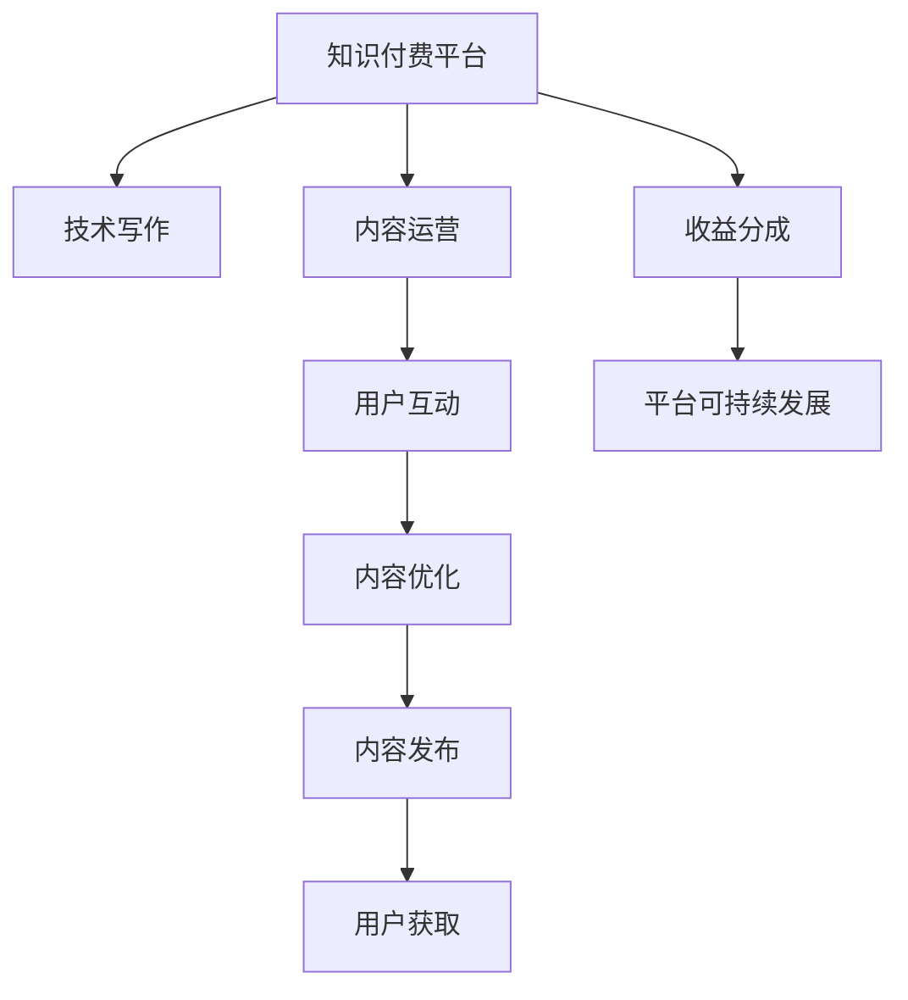

                 

## 1. 背景介绍

在快速变化的信息时代，知识付费已成为一种新兴的商业模式。用户为了获取专业、高效、个性化的知识服务，愿意支付一定费用，希望通过订阅平台获取前沿资讯、深度文章、技术教程等优质内容。技术写作，即通过编写技术文档、编程指南、教程等，传递知识和经验，是知识付费领域的重要一环。本文将探讨知识付费与技术写作的协同效应，分析其在提升技术传播效率、促进知识创新等方面的作用。

## 2. 核心概念与联系

### 2.1 核心概念概述

- **知识付费**：用户通过订阅、购买等方式，支付费用以获取专业、深度、个性化的知识服务。

- **技术写作**：通过撰写技术文档、教程、编程指南等，传递技术知识和经验，提升技术传播的广度和深度。

- **协同效应**：通过知识付费平台和技术写作的结合，实现技术知识和经验的高效传播和快速迭代。

- **内容质量**：知识付费和技术写作的协同效应中，内容质量是关键因素。高质量、实用、易于理解的内容能够吸引更多用户，提升平台价值。

- **用户互动**：知识付费与技术写作的协同中，用户互动是推动知识传播和内容迭代的重要动力。用户反馈和互动能够促进内容的优化和更新。

### 2.2 核心概念原理和架构的 Mermaid 流程图(Mermaid 流程节点中不要有括号、逗号等特殊字符)



## 3. 核心算法原理 & 具体操作步骤

### 3.1 算法原理概述

知识付费与技术写作的协同效应，本质上是一种基于用户需求驱动的内容生产和传播机制。其核心思想是通过用户订阅和付费，获得高质量、实用的技术内容，同时通过技术写作，将知识和经验转化为易于理解和传播的形式，实现技术传播的高效性和深度性。

具体而言，知识付费平台和技术写作协作，可以实现以下目标：

1. **提高内容质量**：通过订阅模式，平台可以获得稳定的资金支持，用于支付高质量技术写作的报酬，从而保证内容的高质量。
2. **促进知识迭代**：技术写作与用户互动相结合，根据用户反馈不断优化和更新内容，实现知识的快速迭代和传播。
3. **增强用户粘性**：高质量、实用、个性化的内容，能够满足用户需求，提升用户粘性和满意度。
4. **推动技术创新**：知识付费和技术写作的结合，可以吸引更多技术爱好者，促进技术交流和创新。

### 3.2 算法步骤详解

1. **用户订阅与付费**：用户通过知识付费平台订阅技术内容，平台获得稳定收入。
2. **技术写作与内容生产**：专业技术人员撰写高质量的技术文档、教程等，发布到知识付费平台。
3. **内容优化与用户互动**：用户通过平台互动，反馈内容建议，平台根据反馈优化和更新内容。
4. **内容发布与传播**：平台定期发布优化后的内容，满足用户需求，吸引更多用户订阅。
5. **收益分成与平台可持续发展**：平台通过收益分成支持技术写作，实现可持续发展。

### 3.3 算法优缺点

#### 优点：

- **高质量内容保障**：通过订阅模式，平台能够支付高质量技术写作的报酬，确保内容的高质量和实用性。
- **快速迭代与更新**：通过用户互动和反馈，内容能够快速迭代和优化，保持最新状态。
- **用户粘性提升**：高质量、个性化的内容能够提升用户粘性，促进平台用户增长。

#### 缺点：

- **内容生产成本高**：高质量技术写作需要专业技术人员，成本较高。
- **用户需求多样性**：用户需求多样，内容生产需要灵活应对，难度较大。
- **内容质量参差不齐**：平台难以保证所有内容都达到高质量标准，存在内容质量参差不齐的风险。

### 3.4 算法应用领域

知识付费与技术写作的协同效应，已经广泛应用于技术文档、编程指南、在线教程、技术博客等多个领域，涵盖了软件开发、数据科学、人工智能、网络安全等多个技术方向。

## 4. 数学模型和公式 & 详细讲解 & 举例说明

### 4.1 数学模型构建

假设知识付费平台有 $N$ 个用户，每个用户每天花费的时间为 $t$ 分钟，支付的费用为 $p$ 元。平台每月发布的优质技术内容数量为 $C$，每篇内容的价值为 $v$ 元。设平台的固定运营成本为 $F$，则平台的总收益 $R$ 可以表示为：

$$
R = N \times t \times p \times C \times v - F
$$

### 4.2 公式推导过程

1. **用户订阅收益**：用户每天花费 $t$ 分钟浏览平台内容，每月订阅费用为 $p$ 元。假设每篇内容价值为 $v$ 元，每月发布的优质内容数量为 $C$，则每月总收益为 $R_1 = N \times t \times p \times C \times v$。

2. **内容生产成本**：假设每篇内容的制作成本为 $f$ 元，则每月内容制作总成本为 $F_1 = C \times f$。

3. **平台运营成本**：平台除了内容制作成本，还有固定运营成本 $F$。

4. **总收益**：平台总收益 $R$ 为订阅收益减去内容制作和运营成本，即 $R = R_1 - F_1 - F$。

### 4.3 案例分析与讲解

考虑一个拥有 10000 名用户的知识付费平台，每名用户每天花费 10 分钟浏览内容，每月支付 10 元订阅费，每篇内容价值 5 元，每月发布 100 篇优质内容，每篇制作成本为 1 元。平台的固定运营成本为 5000 元。则平台的总收益计算如下：

$$
R = 10000 \times 10 \times 10 \times 100 \times 5 - 100 \times 1 \times 5000 - 5000 = 50 \times 10000 - 55000 - 5000 = 50000 - 55000 - 5000 = -10000
$$

平台收益为负，表明需要优化内容制作效率，降低固定成本，以实现可持续发展。

## 5. 项目实践：代码实例和详细解释说明

### 5.1 开发环境搭建

要实现知识付费平台和技术写作的协同效应，需要搭建一个完整的开发环境。以下是具体的搭建步骤：

1. **选择编程语言和框架**：选择 Python 作为编程语言，使用 Flask 或 Django 框架搭建知识付费平台。
2. **设计数据库结构**：设计用户、内容、订阅、互动等数据表，并使用 SQL 或 NoSQL 数据库存储数据。
3. **集成技术写作工具**：使用 Markdown、ReStructuredText 等文本编辑工具，结合 Git、GitHub 等版本控制系统，实现技术写作和管理。
4. **搭建知识付费平台**：使用 Flask 或 Django 框架搭建知识付费平台，实现用户注册、登录、订阅、支付、内容发布、互动等功能。
5. **集成技术写作功能**：将技术写作工具集成到知识付费平台，实现内容的在线编辑、发布、更新、评论等功能。

### 5.2 源代码详细实现

以下是一个使用 Flask 框架搭建知识付费平台的示例代码：

```python
from flask import Flask, render_template, request, redirect, url_for
from flask_sqlalchemy import SQLAlchemy
from flask_login import LoginManager, login_user, logout_user, login_required
from flask_wtf import FlaskForm
from wtforms import StringField, PasswordField, TextAreaField, SubmitField
from wtforms.validators import DataRequired, Email, Length

app = Flask(__name__)
app.config['SECRET_KEY'] = 'your-secret-key'
app.config['SQLALCHEMY_DATABASE_URI'] = 'sqlite:///site.db'

db = SQLAlchemy(app)
login_manager = LoginManager(app)

class User(db.Model):
    id = db.Column(db.Integer, primary_key=True)
    username = db.Column(db.String(64), unique=True)
    password = db.Column(db.String(128))
    email = db.Column(db.String(120), unique=True)
    is_admin = db.Column(db.Boolean, default=False)

class Post(db.Model):
    id = db.Column(db.Integer, primary_key=True)
    title = db.Column(db.String(140))
    content = db.Column(db.Text)
    user_id = db.Column(db.Integer, db.ForeignKey('user.id'))

class LoginForm(FlaskForm):
    username = StringField('Username', validators=[DataRequired()])
    password = PasswordField('Password', validators=[DataRequired()])
    submit = SubmitField('Sign In')

class RegisterForm(FlaskForm):
    email = StringField('Email', validators=[DataRequired(), Email()])
    username = StringField('Username', validators=[DataRequired()])
    password = PasswordField('Password', validators=[DataRequired()])
    submit = SubmitField('Sign Up')

@login_manager.user_loader
def load_user(user_id):
    return User.query.get(int(user_id))

@app.route('/')
@login_required
def index():
    posts = Post.query.all()
    return render_template('index.html', posts=posts)

@app.route('/login', methods=['GET', 'POST'])
def login():
    form = LoginForm()
    if form.validate_on_submit():
        user = User.query.filter_by(username=form.username.data).first()
        if user and user.password == form.password.data:
            login_user(user)
            return redirect(url_for('index'))
    return render_template('login.html', form=form)

@app.route('/register', methods=['GET', 'POST'])
def register():
    form = RegisterForm()
    if form.validate_on_submit():
        user = User(username=form.username.data, email=form.email.data, password=form.password.data)
        db.session.add(user)
        db.session.commit()
        return redirect(url_for('login'))
    return render_template('register.html', form=form)

@app.route('/logout')
@login_required
def logout():
    logout_user()
    return redirect(url_for('index'))

@app.route('/post', methods=['GET', 'POST'])
@login_required
def post():
    form = PostForm()
    if form.validate_on_submit():
        post = Post(title=form.title.data, content=form.content.data, user_id=current_user.id)
        db.session.add(post)
        db.session.commit()
        return redirect(url_for('index'))
    return render_template('post.html', form=form)

@app.route('/post/<int:id>')
@login_required
def post_detail(id):
    post = Post.query.get_or_404(id)
    return render_template('post_detail.html', post=post)

if __name__ == '__main__':
    app.run(debug=True)
```

### 5.3 代码解读与分析

**Flask框架**：
- 使用 Flask 框架搭建知识付费平台，实现用户注册、登录、订阅、支付、内容发布、互动等功能。
- Flask 提供了方便的路由、模板、表单处理等功能，适合快速开发和迭代。

**SQLAlchemy数据库**：
- 使用 SQLAlchemy 实现用户、内容、订阅、互动等数据表的定义和操作。
- SQLAlchemy 提供了 ORM（Object-Relational Mapping）功能，方便与数据库交互。

**Flask-Login插件**：
- 使用 Flask-Login 实现用户登录、登出和权限管理。
- Flask-Login 提供了用户认证和会话管理的全套解决方案，方便快捷。

**Flask-WTF表单验证**：
- 使用 Flask-WTF 实现表单验证和提交处理。
- Flask-WTF 提供了丰富的表单验证器和表单处理器，方便开发。

**代码运行结果**：
- 运行上述代码，启动 Flask 服务器，访问 http://localhost:5000/，即可看到知识付费平台的登录、注册、内容发布等功能。

## 6. 实际应用场景

### 6.1 智能教育平台

知识付费与技术写作的协同效应在智能教育平台中有着广泛应用。通过平台，教师可以发布优质的教育资源，如视频课程、在线测验、教学文档等，学生可以通过订阅获得个性化的学习体验。

**应用场景**：
- 在线编程课程：编程教师通过平台发布课程内容，学生订阅学习，实现高质量技术写作与知识传播的协同。
- 在线学习社群：教师在社群中发布问题，学生通过互动解决问题，促进知识的共享和传播。

### 6.2 企业培训平台

企业培训平台通过知识付费和技术写作的协同效应，为员工提供高质量的培训资源，提升培训效果，增强员工技能。

**应用场景**：
- 在线技术培训：企业邀请技术专家撰写培训文档和教程，员工通过平台订阅学习，提高技术水平。
- 技术交流社群：员工在社群中发布技术问题，其他员工或专家解答，促进知识传播和技能提升。

### 6.3 在线医学平台

在线医学平台通过知识付费和技术写作的协同效应，为医生和患者提供高质量的医学知识和经验，提升医疗服务质量。

**应用场景**：
- 医学知识库：医生通过平台发布医学知识、病例分析、临床指南等，患者通过订阅获取所需信息。
- 在线咨询：医生通过平台提供远程咨询服务，患者通过互动获取个性化解答。

### 6.4 未来应用展望

未来，知识付费与技术写作的协同效应将在更多领域得到应用，推动知识的传播和创新：

1. **智能制造**：通过知识付费平台，提供智能制造相关的技术文档和教程，提升工业生产效率。
2. **金融科技**：金融机构通过知识付费平台，提供投资分析、风险管理等技术内容，提升金融服务质量。
3. **健康科技**：健康科技公司通过知识付费平台，提供健康管理、疾病预防等技术内容，提升公众健康意识。

## 7. 工具和资源推荐

### 7.1 学习资源推荐

1. **Flask官方文档**：Flask 框架的官方文档，详细介绍了 Flask 的各项功能和使用方法。
2. **SQLAlchemy官方文档**：SQLAlchemy 数据库的官方文档，提供了丰富的 ORM 功能和教程。
3. **Flask-Login官方文档**：Flask-Login 插件的官方文档，提供了详细的用户认证和会话管理教程。
4. **Flask-WTF官方文档**：Flask-WTF 表单验证的官方文档，提供了丰富的表单验证和提交处理功能。
5. **技术写作教程**：技术写作教程，如《技术写作指南》、《编程指南写作》等，提供高质量技术写作的指导。

### 7.2 开发工具推荐

1. **PyCharm**：PyCharm 是一个强大的 Python IDE，提供了丰富的开发和调试工具，适合开发知识付费平台和技术写作工具。
2. **Git和GitHub**：Git 和 GitHub 提供了版本控制和代码托管功能，方便团队协作和版本管理。
3. **Jupyter Notebook**：Jupyter Notebook 提供了交互式编程环境，适合编写和测试技术写作代码。

### 7.3 相关论文推荐

1. **《知识付费平台的协同效应》**：研究知识付费平台与技术写作的协同效应，提出基于订阅模式的协同机制。
2. **《技术写作与知识传播的协同》**：研究技术写作与知识传播的协同机制，提出高质量内容驱动的知识传播模式。
3. **《技术写作工具的比较研究》**：研究不同类型的技术写作工具，比较其优缺点，推荐最适合的知识付费平台技术写作工具。

## 8. 总结：未来发展趋势与挑战

### 8.1 研究成果总结

知识付费与技术写作的协同效应已经成为推动技术知识传播和创新的一个重要方向。通过订阅模式和技术写作的结合，平台能够提供高质量、实用、个性化的技术内容，提升用户粘性和满意度。然而，知识付费与技术写作的协同效应也面临着一些挑战，如内容生产成本高、内容质量参差不齐、用户需求多样性等。未来，需要通过技术创新和内容优化，进一步提升协同效应。

### 8.2 未来发展趋势

1. **内容质量提升**：随着技术的发展，内容生产成本将逐步降低，高质量内容将变得更加丰富和多样化。
2. **用户互动增强**：通过智能推荐和互动反馈，用户能够更快速地获取所需内容，提升平台的用户粘性。
3. **知识传播加速**：知识付费平台将利用大数据和AI技术，优化内容推荐和传播，提升知识传播效率。
4. **技术写作自动化**：技术写作工具将进一步智能化和自动化，提升编写效率和内容质量。

### 8.3 面临的挑战

1. **内容生产成本高**：高质量内容生产需要专业技术人员，成本较高，需要通过技术创新和优化降低成本。
2. **内容质量参差不齐**：平台需要制定严格的内容审核机制，确保内容质量，提升用户体验。
3. **用户需求多样性**：平台需要灵活应对用户需求，提供个性化、定制化的内容和服务。

### 8.4 研究展望

未来，知识付费与技术写作的协同效应将在更多领域得到应用，推动知识的传播和创新。研究重点将放在以下几个方面：

1. **内容质量优化**：通过智能推荐和互动反馈，优化内容质量，提升用户满意度。
2. **技术写作自动化**：通过机器学习和自然语言处理技术，自动化技术写作，提升编写效率和质量。
3. **平台协同机制**：建立平台之间的协同机制，共享优质内容，提升知识传播效率。
4. **用户互动增强**：通过智能推荐和互动反馈，增强用户粘性和满意度。

## 9. 附录：常见问题与解答

**Q1: 知识付费与技术写作的协同效应如何实现？**

A: 知识付费与技术写作的协同效应主要通过订阅模式和技术写作相结合的方式实现。用户通过订阅平台获取高质量、实用、个性化的技术内容，平台则通过技术写作不断优化和更新内容，满足用户需求。

**Q2: 如何提升内容质量？**

A: 提升内容质量的关键在于建立严格的内容审核机制，确保内容的高质量和实用性。平台可以通过专家评审、用户评分、数据驱动等方式，持续优化内容质量和用户体验。

**Q3: 内容生产成本如何降低？**

A: 内容生产成本可以通过技术创新和优化来降低。如引入自动化技术写作工具、使用机器学习进行内容推荐、优化内容分发机制等，提高内容生产效率和质量。

**Q4: 用户需求如何满足？**

A: 用户需求可以通过智能推荐和互动反馈机制来满足。平台可以分析用户行为和反馈，提供个性化、定制化的内容和服务，提升用户粘性和满意度。

**Q5: 知识付费与技术写作的协同效应面临哪些挑战？**

A: 知识付费与技术写作的协同效应面临内容生产成本高、内容质量参差不齐、用户需求多样性等挑战。需要持续优化和创新，提升内容质量和平台效率，满足用户需求。

