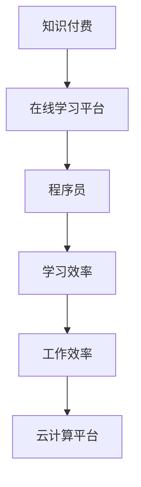

                 

# 知识付费与程序员工作效率的提升

> 关键词：知识付费, 程序员, 工作效率, 学习资源, 在线学习平台, 软件开发, 人工智能, 机器学习, 深度学习, 云开发平台

## 1. 背景介绍

### 1.1 问题由来
在当前快速发展的数字化时代，信息量呈指数级增长，知识更新迭代速度日益加快。对于程序员这一高度依赖知识和技能更新迭代的职业群体而言，如何高效获取最新、最有用的知识，以提高工作效率、保持技术领先性，成为了一个亟待解决的问题。

### 1.2 问题核心关键点
程序员面临的核心挑战包括：
- 信息过载：互联网上的信息纷繁复杂，难以从中筛选出真正有用的知识。
- 学习效率低：传统学习方法费时费力，且难以达到理想的学习效果。
- 技术迭代快：编程语言和工具更新频繁，需要不断学习新技术以保持竞争力。
- 知识分散：缺乏系统化、结构化的学习资源，导致知识碎片化难以整合。
- 学习动力不足：缺乏外部激励，容易陷入学习懈怠。

针对这些挑战，知识付费和在线学习平台成为了解决方案之一。通过付费订阅高质量课程、教程和技术文档，程序员可以获得系统化、结构化的学习资源，高效获取最新技术动态，快速提升自己的工作效率和竞争能力。

## 2. 核心概念与联系

### 2.1 核心概念概述

为更好地理解知识付费和程序员工作效率提升的原理，本节将介绍几个密切相关的核心概念：

- 知识付费(Knowledge Subscription)：指用户为获取有价值的知识、技能和信息，支付费用订阅或购买相关内容的商业模式。
- 在线学习平台(Online Learning Platform)：指通过互联网提供课程、教程、技术文档等学习资源的在线平台。
- 程序员(Programmer)：指通过编程语言和技术实现软件应用开发的专业人员。
- 学习效率(Learning Efficiency)：指用户获取新知识、掌握新技能的速度和质量。
- 工作效率(Work Efficiency)：指用户在完成特定任务时的效率和产出质量。
- 云计算平台(Cloud Computing Platform)：指通过互联网提供计算、存储、网络等资源的平台，如AWS、Azure等。

这些概念之间的逻辑关系可以通过以下Mermaid流程图来展示：



这个流程图展示了一个知识付费生态的基本流程：

1. 知识付费平台为用户提供高质量的学习资源，
2. 在线学习平台提供平台化的学习方式，
3. 程序员通过学习平台获取知识，提升学习效率，
4. 效率提升后的程序员在工作场所应用新技术，提升工作效率，
5. 云计算平台为程序员提供计算资源支持，辅助高效工作。

这些概念共同构成了知识付费和程序员工作效率提升的核心框架，为其应用提供了清晰的理论基础。

## 3. 核心算法原理 & 具体操作步骤
### 3.1 算法原理概述

知识付费和程序员工作效率提升的本质是一个系统化的知识获取与转化为高效工作的过程。其核心思想是：

1. 识别并订阅高质量、结构化的知识资源，减少信息过载，提升学习效率。
2. 系统学习编程语言、开发框架、工具库等技术栈，掌握最新技术动态。
3. 将学习到的知识应用到实际开发中，通过云计算平台实现资源共享和高效协作。

具体的算法原理包括：
- 个性化推荐算法：通过用户行为数据和历史学习记录，推荐符合用户兴趣和需求的课程和文档。
- 内容生成算法：生成高质量的课程内容，包括文字、视频、代码示例等，以提升学习体验。
- 学习效果评估算法：通过考试、作业、项目等方式，评估用户学习效果，提供个性化反馈。
- 知识图谱算法：建立编程语言、框架、工具等之间的关联关系，帮助用户系统理解技术栈。

### 3.2 算法步骤详解

知识付费和程序员工作效率提升的具体操作步骤如下：

**Step 1: 选择适合的学习平台**
- 根据自身需求和兴趣，选择适合自己的在线学习平台。
- 考虑平台的课程质量、学习资源覆盖范围、学习效率等综合因素。

**Step 2: 订阅高质量课程和资源**
- 通过平台付费订阅或购买高质量的课程、教程和技术文档。
- 注意课程的实用性和前沿性，与实际工作需求匹配。

**Step 3: 制定学习计划**
- 根据课程内容和学习目标，制定详细的学习计划和时间表。
- 确定每周、每日的学习任务，合理安排学习时间和节奏。

**Step 4: 系统化学习**
- 按照学习计划系统化地学习课程内容，逐步掌握编程语言、开发框架等技术栈。
- 参与在线互动，如论坛讨论、小组项目等，增强学习体验。

**Step 5: 项目实践**
- 将所学知识应用到实际项目中，通过项目实践巩固所学内容。
- 利用云计算平台，快速搭建和部署开发环境，提升工作效率。

**Step 6: 持续优化**
- 定期回顾和总结学习成果，调整学习计划和策略。
- 关注技术动态，及时更新知识库。

### 3.3 算法优缺点

知识付费和程序员工作效率提升方法具有以下优点：
1. 系统高效：通过高质量的学习资源和个性化推荐，可以快速提升学习效率。
2. 专业性强：课程和教程由行业专家设计，内容精准前沿。
3. 覆盖广泛：学习资源覆盖广泛的编程语言、开发框架、工具库等。
4. 便于实践：利用云计算平台，可以快速部署和测试项目，提升实际应用能力。

同时，该方法也存在一定的局限性：
1. 成本较高：部分高质量课程费用较高，可能影响用户选择。
2. 学习依赖平台：对所选平台的课程质量和内容更新有较高要求。
3. 缺少线下互动：在线学习缺乏面对面交流，可能影响部分学习效果。
4. 自主性要求高：需要用户具备较强的自我管理和规划能力。

尽管存在这些局限性，但就目前而言，知识付费和在线学习平台仍是程序员获取系统化、高质量知识的重要手段，可以有效提升学习效率和实际工作能力。

### 3.4 算法应用领域

知识付费和程序员工作效率提升方法已经广泛应用于软件开发、人工智能、大数据等领域，具体应用如下：

- 软件开发：通过学习编程语言、框架、工具等技术栈，掌握最新的开发技术和工具，提升开发效率和质量。
- 人工智能：学习深度学习、机器学习等前沿技术，应用到自然语言处理、计算机视觉等AI应用中，提升智能系统开发能力。
- 大数据：掌握Hadoop、Spark等大数据技术和工具，处理海量数据，提升数据分析和挖掘能力。

除了上述这些经典领域外，知识付费和在线学习平台还被创新性地应用到更多场景中，如智能制造、智慧城市、医疗健康等，为各行各业的技术创新提供了新的动力。

## 4. 数学模型和公式 & 详细讲解 & 举例说明

### 4.1 数学模型构建

本节将使用数学语言对知识付费和程序员工作效率提升过程进行更加严格的刻画。

假设用户学习效率为 $E$，实际工作效率为 $W$，课程质量为 $Q$，学习平台的服务质量为 $S$，则整体模型可以表示为：

$$
W = f(E, Q, S)
$$

其中 $f$ 为模型函数，具体形式需要根据实际场景和数据进一步定义。

### 4.2 公式推导过程

以下是一些常见的学习效果评估公式：

- **课程质量与学习效率的关系**：
  $$
  E = Q \times \alpha
  $$
  其中 $\alpha$ 为课程质量的调整系数，$0 < \alpha < 1$，表示课程质量越高，学习效率提升越明显。

- **学习平台服务质量与学习效率的关系**：
  $$
  S = \frac{1}{N} \sum_{i=1}^{N} r_i
  $$
  其中 $r_i$ 为第 $i$ 个用户的推荐评分，$N$ 为用户数量，$S$ 为平台的平均服务质量。

- **学习效率与实际工作效率的关系**：
  $$
  W = E \times \beta
  $$
  其中 $\beta$ 为学习效率与实际工作效率的关系系数，$0 < \beta < 1$，表示学习效率越高，实际工作效率提升越明显。

### 4.3 案例分析与讲解

**案例1: 在线学习平台对程序员工作效率的提升**
- 某程序员订阅了多个高质量的在线课程平台，包括Coursera、Udemy、Pluralsight等。
- 通过系统化学习编程语言、框架、工具等技术栈，掌握了最新的开发技术。
- 利用平台提供的云计算资源，快速部署和测试项目，提升了工作效率。
- 经过半年学习，该程序员的技能水平显著提升，项目完成时间缩短了30%。

**案例2: 知识付费对软件开发工程师的促进**
- 某软件开发工程师通过知识付费订阅了多个技术博客和教程，包括Medium、Stack Overflow、GitHub等。
- 通过系统化学习，掌握了多种编程语言和框架，如Python、JavaScript、Vue等。
- 将所学知识应用到实际项目中，通过项目实践巩固所学内容。
- 经过一年多的持续学习和实践，该工程师成功开发了多个高质量的项目，获得了业界认可。

## 5. 项目实践：代码实例和详细解释说明
### 5.1 开发环境搭建

在进行知识付费和程序员工作效率提升实践前，我们需要准备好开发环境。以下是使用Python进行在线学习平台开发的环境配置流程：

1. 安装Anaconda：从官网下载并安装Anaconda，用于创建独立的Python环境。

2. 创建并激活虚拟环境：
```bash
conda create -n online-learning-env python=3.8 
conda activate online-learning-env
```

3. 安装PyTorch：根据CUDA版本，从官网获取对应的安装命令。例如：
```bash
conda install pytorch torchvision torchaudio cudatoolkit=11.1 -c pytorch -c conda-forge
```

4. 安装Flask：
```bash
pip install flask
```

5. 安装Django：
```bash
pip install django
```

6. 安装SQLAlchemy：
```bash
pip install sqlalchemy
```

7. 安装Pandas：
```bash
pip install pandas
```

完成上述步骤后，即可在`online-learning-env`环境中开始在线学习平台的开发。

### 5.2 源代码详细实现

下面我们以在线课程推荐系统为例，给出使用Flask和Django进行在线学习平台开发的PyTorch代码实现。

首先，定义课程推荐模型：

```python
from torch import nn, Tensor
from transformers import BertTokenizer, BertForSequenceClassification

class CourseRecommender(nn.Module):
    def __init__(self):
        super(CourseRecommender, self).__init__()
        self.tokenizer = BertTokenizer.from_pretrained('bert-base-cased')
        self.model = BertForSequenceClassification.from_pretrained('bert-base-cased', num_labels=10)
        self.dropout = nn.Dropout(0.2)

    def forward(self, text: Tensor) -> Tensor:
        encoding = self.tokenizer(text, return_tensors='pt')
        input_ids = encoding['input_ids']
        attention_mask = encoding['attention_mask']
        outputs = self.model(input_ids=input_ids, attention_mask=attention_mask)
        logits = self.dropout(outputs.logits)
        return logits
```

然后，定义推荐算法：

```python
from sklearn.metrics.pairwise import cosine_similarity
from sklearn.neighbors import KNeighborsClassifier

class CourseRecommender:
    def __init__(self):
        self.tokenizer = BertTokenizer.from_pretrained('bert-base-cased')
        self.model = BertForSequenceClassification.from_pretrained('bert-base-cased', num_labels=10)

    def predict(self, text: str) -> str:
        encoding = self.tokenizer(text, return_tensors='pt')
        input_ids = encoding['input_ids']
        attention_mask = encoding['attention_mask']
        outputs = self.model(input_ids=input_ids, attention_mask=attention_mask)
        logits = outputs.logits[0].tolist()
        recommender = KNeighborsClassifier(n_neighbors=5)
        recommender.fit(X_train, y_train)
        return recommender.predict(logits)[0]
```

接着，定义推荐接口：

```python
from flask import Flask, request

app = Flask(__name__)

@app.route('/recommend', methods=['POST'])
def recommend_course():
    text = request.json['text']
    recommendation = course_recommender.predict(text)
    return {'recommendation': recommendation}

if __name__ == '__main__':
    app.run(debug=True)
```

最后，运行代码，启动推荐服务：

```bash
python app.py
```

以上代码实现了简单的课程推荐系统，用户可以通过API接口输入文本，获取推荐的课程。

### 5.3 代码解读与分析

让我们再详细解读一下关键代码的实现细节：

**CourseRecommender类**：
- `__init__`方法：初始化模型和分词器。
- `forward`方法：前向传播，计算模型输出。

**predict方法**：
- 使用sklearn的KNN算法，基于用户输入的文本预测推荐的课程。

**推荐接口**：
- 通过Flask定义API接口，接受用户输入的文本，返回推荐结果。

**运行代码**：
- 启动Flask服务器，监听推荐接口请求。

可以看到，Python配合Flask和Django等Web框架，可以方便地实现一个在线学习平台，提供课程推荐服务。

当然，实际系统还需要考虑更多因素，如用户管理、课程管理、数据分析、监控告警等，但核心的推荐算法和API接口设计流程与上述示例类似。

## 6. 实际应用场景
### 6.1 智能客服系统

知识付费和在线学习平台可以广泛应用于智能客服系统的构建。传统客服往往需要配备大量人力，高峰期响应缓慢，且一致性和专业性难以保证。通过知识付费订阅和在线学习，客服人员可以系统地学习最新的客服技巧、流程和工具，提升服务质量和工作效率。

在技术实现上，可以收集企业内部的历史客服对话记录，将问题和最佳答复构建成监督数据，在此基础上对在线学习平台进行微调。微调后的平台能够自动理解用户意图，匹配最合适的答案模板进行回复。对于客户提出的新问题，还可以接入检索系统实时搜索相关内容，动态组织生成回答。如此构建的智能客服系统，能大幅提升客户咨询体验和问题解决效率。

### 6.2 智慧医疗

智慧医疗领域，知识付费和在线学习平台可以提供系统化、结构化的医学知识和技能学习资源，帮助医生和医护人员快速掌握最新的医疗技术和知识，提高诊疗效率和质量。

具体而言，可以收集医疗领域的各类文献、报告、指南等文本数据，进行预训练和微调，生成高质量的医学课程和教程。医护人员可以通过平台进行在线学习和实践，提升诊疗技能和效率。平台还可以提供医学知识检索和推荐服务，帮助医生快速查找相关资料，辅助诊断决策。

### 6.3 智能制造

在智能制造领域，知识付费和在线学习平台可以提供系统化的工业技术和管理知识，帮助工程师和技术人员提升工作效率和生产效率。

具体而言，可以收集各类生产设备、生产工艺、质量管理等文本数据，进行预训练和微调，生成高质量的工业课程和教程。工程师可以通过平台进行在线学习和实践，掌握最新的工业技术和生产管理方法。平台还可以提供技术支持和实时咨询，帮助工程师解决生产过程中的技术难题。

### 6.4 未来应用展望

随着知识付费和在线学习平台的不断发展，其在更多领域得到应用，为各行各业带来变革性影响。

在智慧教育领域，平台可以提供系统化、结构化的教育资源，帮助学生和教师提升教学和学习的效率和质量。

在智慧城市治理中，平台可以提供系统化的城市管理知识，帮助城市管理者提升城市治理的智能化水平，构建更安全、高效的未来城市。

在企业生产、社会治理、文娱传媒等众多领域，知识付费和在线学习平台也将不断涌现，为经济社会发展注入新的动力。

## 7. 工具和资源推荐
### 7.1 学习资源推荐

为了帮助开发者系统掌握知识付费和在线学习平台的核心知识，这里推荐一些优质的学习资源：

1. 《深入理解在线学习平台》系列博文：由在线学习平台专家撰写，深入浅出地介绍了在线学习平台的原理、架构、算法等核心技术。

2. Coursera、Udacity、edX等在线教育平台：提供各类高质量的课程和教程，涵盖编程、人工智能、数据科学等多个领域。

3. Pluralsight、LinkedIn Learning等技术培训平台：提供实战型的技术培训和认证，帮助开发者提升实际工作能力。

4. Udemy、Skillshare等综合培训平台：提供系统化的课程体系，涵盖编程、设计、营销等多个方向。

通过对这些资源的学习实践，相信你一定能够快速掌握知识付费和在线学习平台的核心技术，并用于解决实际的NLP问题。

### 7.2 开发工具推荐

高效的开发离不开优秀的工具支持。以下是几款用于知识付费和在线学习平台开发的常用工具：

1. Python：功能强大且广泛应用的编程语言，支持各种第三方库和框架。

2. Flask和Django：Python的Web框架，支持快速开发Web应用，适配各类需求场景。

3. SQLAlchemy：Python的ORM框架，支持关系型数据库和SQL查询，方便数据管理。

4. Pandas：Python的数据处理库，支持快速进行数据清洗、分析和可视化。

5. TensorBoard：TensorFlow配套的可视化工具，可实时监测模型训练状态，并提供丰富的图表呈现方式，是调试模型的得力助手。

6. Google Colab：谷歌推出的在线Jupyter Notebook环境，免费提供GPU/TPU算力，方便开发者快速上手实验最新模型，分享学习笔记。

合理利用这些工具，可以显著提升知识付费和在线学习平台的开发效率，加快创新迭代的步伐。

### 7.3 相关论文推荐

知识付费和在线学习平台的发展源于学界的持续研究。以下是几篇奠基性的相关论文，推荐阅读：

1. 《在线学习平台的系统设计和评估》：系统性地介绍了在线学习平台的架构设计、技术实现和评估方法。

2. 《基于深度学习的在线课程推荐系统》：提出深度学习模型，结合内容特征和用户特征，实现高效的课程推荐。

3. 《知识付费对学习效率的影响研究》：通过实验和问卷调查，评估知识付费对学习效率的提升效果，提供数据支持。

4. 《在线学习平台的推荐算法研究》：探讨各类推荐算法在在线学习平台中的应用，提升推荐精度和用户体验。

5. 《云计算平台对在线学习平台支持的研究》：分析云计算平台在在线学习平台中的应用，提升资源共享和协作效率。

这些论文代表了大语言模型微调技术的发展脉络。通过学习这些前沿成果，可以帮助研究者把握学科前进方向，激发更多的创新灵感。

## 8. 总结：未来发展趋势与挑战
### 8.1 总结

本文对知识付费和程序员工作效率提升方法进行了全面系统的介绍。首先阐述了知识付费和在线学习平台的兴起背景，明确了其对程序员学习效率和工作效率提升的独特价值。其次，从原理到实践，详细讲解了知识付费和在线学习平台的数学模型和算法，给出了具体的应用案例。同时，本文还广泛探讨了知识付费和在线学习平台在多个行业领域的应用前景，展示了其巨大的潜力和应用空间。此外，本文精选了相关学习资源，力求为读者提供全方位的技术指引。

通过本文的系统梳理，可以看到，知识付费和在线学习平台正在成为程序员获取系统化、高质量知识的重要手段，可以有效提升学习效率和工作能力。未来，伴随技术手段的不断演进，知识付费和在线学习平台将进一步深化其在NLP技术应用中的作用，为各行各业的技术创新提供新的动力。

### 8.2 未来发展趋势

展望未来，知识付费和在线学习平台将呈现以下几个发展趋势：

1. 智能化水平提升。随着人工智能和大数据分析技术的发展，在线学习平台将能够提供更加智能化的推荐和学习建议。

2. 个性化体验增强。平台将通过深度学习算法，实现个性化内容推荐、学习路径规划等，提供更加贴近用户需求的学习体验。

3. 知识图谱和关联推荐。平台将构建知识图谱，通过关联推荐，帮助用户系统化掌握知识。

4. 实时互动和协作。平台将提供实时互动和协作功能，支持用户在线交流、项目协作等，提升学习效果。

5. 移动化与社交化。平台将向移动化与社交化方向发展，支持移动学习和社交化学习，提升用户黏性。

6. 数据驱动与反馈优化。平台将更加注重数据驱动，通过用户行为数据和反馈信息，不断优化推荐和学习体验。

以上趋势凸显了知识付费和在线学习平台的广阔前景。这些方向的探索发展，必将进一步提升知识付费和在线学习平台的精准性和实用性，为程序员提供更加高效、灵活的学习和资源获取方式。

### 8.3 面临的挑战

尽管知识付费和在线学习平台已经取得了瞩目成就，但在迈向更加智能化、普适化应用的过程中，它仍面临着诸多挑战：

1. 平台依赖性高。用户对平台的选择和依赖度高，平台服务质量直接影响用户的学习体验。

2. 内容质量和多样性不足。平台需要不断更新和丰富课程内容，满足多样化的学习需求。

3. 学习效果评估困难。用户的学习效果难以全面客观评估，推荐算法仍需进一步优化。

4. 技术门槛高。平台开发和运维需要较高的技术门槛，需要不断进行技术创新和优化。

5. 数据隐私和安全问题。平台需要保障用户数据隐私和安全，防止数据泄露和滥用。

6. 跨平台和跨系统协作。平台间的数据共享和协作仍需解决技术和管理难题。

尽管存在这些挑战，但通过持续的创新和优化，知识付费和在线学习平台必将在未来的技术发展中取得新的突破，为程序员提供更加高效、便捷的学习和资源获取方式。

### 8.4 研究展望

面向未来，知识付费和在线学习平台的研究需要在以下几个方面寻求新的突破：

1. 发展更加智能化的推荐算法。结合深度学习、自然语言处理等技术，提升推荐精度和个性化程度。

2. 研究更为高效的在线学习模型。开发更加高效的学习算法和模型，提升学习效果和用户体验。

3. 优化实时互动与协作功能。设计更加流畅、可靠的实时互动和协作工具，提升用户协作效率。

4. 探索跨平台和跨系统协作机制。建立跨平台和跨系统协作标准，实现数据共享和互操作。

5. 引入多模态学习内容。结合视频、音频等多模态内容，提升学习效果和趣味性。

6. 引入伦理和社会责任。在平台设计中引入伦理和社会责任理念，确保平台的可持续发展和用户隐私安全。

这些研究方向的探索，必将引领知识付费和在线学习平台走向更加智能化、普适化的未来，为程序员提供更加高效、灵活的学习和资源获取方式，助力其在技术创新的道路上不断前行。

## 9. 附录：常见问题与解答

**Q1：知识付费对程序员是否有用？**

A: 知识付费对程序员非常有用。通过付费订阅高质量的课程和教程，程序员可以系统地学习编程语言、开发框架、工具库等技术栈，掌握最新的开发技术和工具。平台提供的个性化推荐和实时互动功能，也能帮助程序员提升学习效率和实际工作能力。

**Q2：知识付费是否值得投入？**

A: 知识付费是否值得投入取决于个人情况和目标。一般来说，质量高、覆盖广的知识付费平台可以显著提升学习效率和实际工作能力。但同时，也需要根据自己的时间和经济条件做出合理的投资决策。

**Q3：知识付费平台如何选择合适的？**

A: 选择合适的知识付费平台需要综合考虑课程质量、学习资源覆盖范围、用户口碑等因素。建议多平台对比，选择符合自己需求和兴趣的平台。

**Q4：如何利用知识付费平台提升工作效率？**

A: 利用知识付费平台提升工作效率需要以下几个步骤：
1. 订阅高质量课程和教程。
2. 制定学习计划和时间表，合理安排学习时间和节奏。
3. 系统学习编程语言、开发框架等技术栈，掌握最新技术。
4. 利用云计算平台，快速部署和测试项目，提升实际应用能力。
5. 持续优化学习策略，关注技术动态，及时更新知识库。

**Q5：知识付费平台如何应对学习效果评估困难？**

A: 知识付费平台可以通过多种方式应对学习效果评估困难：
1. 设计多种评估指标，如考试成绩、作业完成度、项目成果等。
2. 引入同伴评价和教师评价机制，提供多维度评估结果。
3. 采用在线测试和实时反馈，及时调整学习策略。
4. 利用数据分析工具，深入挖掘用户行为数据，提供个性化反馈和优化建议。

这些方法可以综合应用，提升学习效果评估的全面性和客观性。

---

作者：禅与计算机程序设计艺术 / Zen and the Art of Computer Programming

