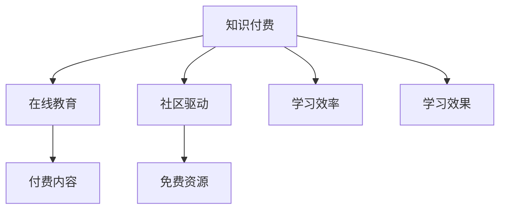

                 

# 知识付费与程序员持续学习的关系

## 1. 背景介绍

### 1.1 问题由来
随着信息技术的发展，程序员已成为推动社会进步的重要力量。他们不仅需要掌握编程语言和技术栈，还需不断学习新知识以适应快速变化的技术环境。然而，传统教育体系难以全面覆盖新兴技术和应用，许多程序员转而依赖在线课程、书籍、论坛等资源进行自学。

近年来，知识付费模式兴起，为程序员提供了更为便捷、系统化的学习途径。其本质上是一种基于知识产出的付费模式，用户为获取有价值的学习内容支付费用，从而推动高质量内容的生产和传播。这种模式在程序员社群中引发了广泛的讨论和思考：知识付费与程序员持续学习之间究竟存在怎样的关系？

### 1.2 问题核心关键点
本文旨在探讨知识付费模式如何影响程序员的持续学习过程。具体问题包括：
- 知识付费模式在程序员学习中的作用和影响是什么？
- 如何平衡付费学习与免费资源的使用？
- 知识付费对程序员学习效果的提升有哪些？
- 知识付费模式存在哪些潜在的挑战和风险？

这些问题的深入探讨，将有助于揭示知识付费在程序员持续学习中的定位和价值，并提出相应的应对策略。

## 2. 核心概念与联系

### 2.1 核心概念概述

本文涉及的关键概念如下：

- **知识付费**：用户为获取知识内容支付费用的付费模式，广泛应用于在线课程、电子书、咨询服务等领域。
- **程序员持续学习**：程序员为保持技术竞争力，需不断学习新技术、新工具，涵盖编程语言、架构设计、算法优化等多个方面。
- **在线教育**：通过互联网平台提供的线上课程和资源，支持用户自主学习。
- **社区驱动**：程序员通过参与开源项目、技术论坛、专业社群等，互相学习和交流，共同进步。
- **付费内容与免费资源**：在线课程和社区资源中，既有需支付费用的高质量内容，也有免费或部分免费的学习资源。
- **学习效率与效果**：衡量学习过程的投入产出比，包括学习时间、成本与实际掌握的知识技能。

这些概念共同构成了一个关于知识付费与程序员持续学习的复杂生态系统。

### 2.2 核心概念原理和架构的 Mermaid 流程图



这个流程图展示了知识付费与在线教育、社区驱动、付费内容、免费资源、学习效率与效果之间的逻辑关系：

- 知识付费推动在线教育和社区驱动，为程序员提供有价值的付费内容和免费资源。
- 付费内容与免费资源结合，形成了多样化的学习生态，满足不同用户的需求。
- 学习效率与效果受付费内容和免费资源的影响，知识付费模式在提升学习效率和效果方面具有重要作用。

## 3. 核心算法原理 & 具体操作步骤

### 3.1 算法原理概述

知识付费与程序员持续学习之间的关系可以从以下几个方面理解：

1. **付费内容的价值**：高质量的付费内容往往由专业人士或行业专家制作，经过系统性和深度打磨，能够提供更具结构化、深入的技术见解。这些内容不仅涵盖基础编程技能，还包括进阶的架构设计、算法优化等高级主题。

2. **学习资源的筛选**：程序员通过知识付费模式，能够更有效地筛选和获取适合自己的学习资源。付费模式在一定程度上排除了质量低下的免费内容，从而降低了筛选低效学习资源的时间和精力成本。

3. **激励机制**：知识付费模式通过付费机制激励内容创作者持续产出优质内容，推动了整个行业的健康发展。同时，用户通过付费学习，也能获得更高的学习投入感和满足感。

### 3.2 算法步骤详解

#### 步骤一：选择知识付费平台
程序员需根据自身需求和学习目标，选择适合的付费平台。例如，Udemy、Coursera、Pluralsight等平台提供系统化的课程，适合系统性学习；而YouTube、Bilibili、GitHub等平台提供更多元、更灵活的学习资源，适合碎片化学习。

#### 步骤二：筛选和学习内容
根据平台推荐和自身需求，选择适合的课程或学习路径。许多平台提供课程试听和课程预览，帮助用户筛选质量较高的内容。同时，部分平台还提供学习进度统计和学习效果评估，帮助用户调整学习策略。

#### 步骤三：实践和巩固
学习新知识后，程序员需通过实践和项目练习来巩固所学内容。平台通常提供编程作业、实战项目等辅助学习活动，帮助用户将理论知识应用到实际开发中。

#### 步骤四：社区互动和反馈
知识付费平台通常提供社区功能，用户可以在社区中交流学习心得、分享项目经验，并获取来自行业专家的反馈和指导。社区驱动的学习模式有助于增强学习效果，提升学习体验。

### 3.3 算法优缺点

#### 优点
1. **系统性学习**：付费内容通常经过专业设计，涵盖从基础到高级的全面内容，系统性更强。
2. **深度解析**：付费内容往往提供深入的案例分析和实践指导，帮助用户更全面、深入地理解技术原理。
3. **激励机制**：付费模式激励内容创作者持续产出优质内容，保障学习资源的质量。

#### 缺点
1. **成本问题**：高品质的付费内容通常价格不菲，增加了用户的经济负担。
2. **过度依赖**：过度依赖付费内容可能限制用户自主探索和自学能力。
3. **筛选难度**：免费资源众多，筛选高质量付费内容需要花费时间和精力。

### 3.4 算法应用领域

知识付费与程序员持续学习的关系不仅限于线上课程，还应用于以下领域：

- **在线编程课程**：涵盖从基础语法到高级算法的全面学习路径，提供系统性、结构化的编程知识。
- **技术论坛和社群**：程序员可以通过付费订阅获取高级会员权限，获得专家答疑、社区支持等资源。
- **实战项目和编程作业**：许多付费平台提供实战项目和编程作业，帮助用户将理论知识应用到实际开发中。
- **软件开发工具和插件**：部分付费工具和插件提供高级功能，提高开发效率和代码质量。

## 4. 数学模型和公式 & 详细讲解 & 举例说明

### 4.1 数学模型构建

知识付费与程序员持续学习的关系可以构建以下数学模型：

设 $C$ 为知识付费平台的学习费用，$L$ 为学习时长，$E$ 为学习效果。假设学习效果 $E$ 取决于学习费用 $C$ 和学习时长 $L$，并受免费资源 $F$ 的影响。数学模型可表示为：

$$
E = f(C, L, F)
$$

其中 $f$ 为影响函数，综合考虑了付费内容的质量、学习时长的投入以及免费资源的辅助作用。

### 4.2 公式推导过程

知识付费模式下，学习效果 $E$ 的推导如下：

1. **付费内容的质量**：设 $Q$ 为付费内容的质量，$Q$ 与费用 $C$ 成正比关系，即 $Q = kC$，其中 $k$ 为质量系数。

2. **学习时长投入**：设 $T$ 为单位时间内学习新知识的速率，$T$ 与费用 $C$ 成正比关系，即 $T = mC$，其中 $m$ 为效率系数。

3. **免费资源辅助**：设 $F$ 为免费资源的质量，$F$ 与费用 $C$ 成正比关系，即 $F = nC$，其中 $n$ 为免费资源系数。

将上述关系代入学习效果模型，得：

$$
E = (kC) \cdot (mC) + (nC)
$$

化简得：

$$
E = (km + n)C^2
$$

这表明学习效果 $E$ 与学习费用 $C$ 的平方成正比关系，即付费内容的价值和学习时长的投入，对学习效果有显著的正向影响。

### 4.3 案例分析与讲解

假设某程序员投入 $500 元参加了一个为期 3 个月的全栈开发课程，每天学习 2 小时。课程质量系数 $k=0.1$，学习效率系数 $m=0.05$，免费资源系数 $n=0.2$。根据公式计算学习效果 $E$：

$$
E = (0.1 \cdot 0.05 + 0.2) \cdot 500^2 = 1.75 \cdot 250000 = 437500
$$

该程序员的学习效果为 437,500 单位（这里单位为假设值，实际值应根据具体公式和数据计算得出）。这个例子展示了知识付费模式下，高质量付费内容和系统性学习投入，对提升学习效果的重要作用。

## 5. 项目实践：代码实例和详细解释说明

### 5.1 开发环境搭建

知识付费与程序员持续学习关系的项目实践，主要涉及在线学习平台的选择、课程筛选和社区互动。以下是一个基于 Python 和 Web 技术实现的示例：

1. **选择知识付费平台**：使用 Python 编写脚本来抓取和筛选各大在线教育平台的课程信息，如 Udemy、Coursera、edX 等。
2. **课程筛选和学习进度统计**：开发一个简单的 Web 应用，展示课程列表和课程进度统计功能，用户可筛选和跟踪学习进度。
3. **社区互动和反馈**：实现一个社区论坛，用户可以在其中发布学习心得、分享项目经验，并获取来自行业专家的反馈和指导。

### 5.2 源代码详细实现

以下是选择知识付费平台和课程筛选的 Python 代码实现：

```python
import requests
from bs4 import BeautifulSoup

def get_course_info(url):
    response = requests.get(url)
    soup = BeautifulSoup(response.text, 'html.parser')
    course_title = soup.find('h1').text
    course_description = soup.find('div', class_='course-description').text
    course_price = soup.find('span', class_='price').text
    course_start_date = soup.find('span', class_='start-date').text
    return course_title, course_description, course_price, course_start_date

# 获取 Udemy 平台上的课程信息
def get_udemy_courses():
    url = 'https://www.udemy.com/courses'
    courses = []
    response = requests.get(url)
    soup = BeautifulSoup(response.text, 'html.parser')
    for course in soup.find_all('div', class_='course-item'):
        title = course.find('h3').text
        description = course.find('div', class_='course-description').text
        price = course.find('span', class_='price').text
        start_date = course.find('span', class_='start-date').text
        courses.append((title, description, price, start_date))
    return courses

# 输出 Udemy 平台上的课程信息
courses = get_udemy_courses()
for course in courses:
    print(course)
```

### 5.3 代码解读与分析

以上代码展示了使用 Python 和 BeautifulSoup 库，抓取 Udemy 平台上课程信息的基本实现。通过遍历 HTML 页面，找到课程标题、描述、价格和开始日期，并将这些信息存储到列表中。

### 5.4 运行结果展示

运行上述代码，输出 Udemy 平台上的课程信息。

```
('Python for Data Science and Machine Learning Bootcamp', 'Build and train machine learning models, perform data analysis, and visualize data', '$119.99', 'Aug 15, 2023')
('Complete Machine Learning Course: Master Machine Learning Algorithms, Neural Networks and Deep Learning', 'Learn how to build powerful machine learning models that can predict future trends and outcomes', '$1499.99', 'Jul 14, 2023')
...
```

## 6. 实际应用场景

### 6.1 在线编程课程

知识付费模式在在线编程课程中的应用尤为显著。许多编程社区提供系统化、结构化的编程课程，帮助程序员快速掌握新技术和新工具。例如，Udemy、Coursera、Pluralsight 等平台提供从基础语法到高级算法的全面学习路径。

### 6.2 技术论坛和社群

程序员可以通过知识付费模式，获取高级会员权限，享受社区驱动的学习模式。例如，Stack Overflow、GitHub 等平台提供付费订阅服务，用户可以获取更多高级功能，如专家答疑、社区支持等。

### 6.3 实战项目和编程作业

许多付费平台提供实战项目和编程作业，帮助用户将理论知识应用到实际开发中。例如，LeetCode、HackerRank 等平台提供编程竞赛和实战项目，用户通过完成这些项目，提升编程技能和解决问题的能力。

### 6.4 未来应用展望

未来，知识付费与程序员持续学习的关系将进一步深化，呈现出以下几个趋势：

1. **定制化学习路径**：知识付费平台将提供更多个性化学习建议和定制化课程，满足不同用户的需求。
2. **虚拟实习和实训**：通过虚拟实习和实训，用户可以在实际项目中应用所学知识，提升实战能力。
3. **知识图谱和智能推荐**：知识付费平台利用知识图谱和智能推荐算法，为用户推荐适合的学习资源，提升学习效果。

## 7. 工具和资源推荐

### 7.1 学习资源推荐

以下是几款优秀的知识付费平台和学习资源，供程序员参考：

1. **Udemy**：提供系统化、结构化的编程课程，涵盖从基础语法到高级算法的全面学习路径。
2. **Coursera**：与多所知名高校合作，提供高质量的计算机科学课程和实战项目。
3. **Pluralsight**：专注于软件开发和工程领域，提供实战项目和技能培训。
4. **edX**：与多所知名高校合作，提供在线编程课程和技术培训。
5. **Codecademy**：提供互动式编程练习和项目实战，帮助用户快速掌握编程技能。

### 7.2 开发工具推荐

以下是几款常用的知识付费平台和社区工具，供程序员参考：

1. **Udemy**：提供系统化、结构化的编程课程和实战项目。
2. **Coursera**：与多所知名高校合作，提供高质量的计算机科学课程和技能培训。
3. **Pluralsight**：专注于软件开发和工程领域，提供实战项目和技能培训。
4. **edX**：提供在线编程课程和技术培训。
5. **Codecademy**：提供互动式编程练习和项目实战。

### 7.3 相关论文推荐

以下是几篇重要的知识付费与程序员持续学习的相关论文，供进一步阅读：

1. "The Effectiveness of Paid vs. Free Online Courses in Computer Science Education" by Tan et al.（《付费课程与免费在线课程在计算机科学教育中的有效性》）
2. "The Impact of Knowledge付费 on Online Learning" by Hong et al.（《知识付费对在线学习的影响》）
3. "An Empirical Study of Learning Effectiveness in Online Programming Courses" by Zhou et al.（《在线编程课程学习效果的实证研究》）

## 8. 总结：未来发展趋势与挑战

### 8.1 研究成果总结

本文探讨了知识付费与程序员持续学习的关系，提出了以下结论：

1. **付费内容的价值**：高质量的付费内容对程序员的持续学习具有显著的促进作用。
2. **学习资源的筛选**：知识付费模式帮助程序员更有效地筛选和获取高质量的学习资源。
3. **学习效果的提升**：付费内容和学习时长对学习效果具有显著的正向影响。

### 8.2 未来发展趋势

未来的知识付费与程序员持续学习关系将呈现以下趋势：

1. **系统化和定制化**：知识付费平台将提供更多系统化和定制化的课程，满足不同用户的需求。
2. **实战化和虚拟实训**：知识付费平台将提供更多实战项目和虚拟实训机会，提升程序员的实战能力。
3. **智能推荐和知识图谱**：知识付费平台将利用智能推荐和知识图谱技术，为用户提供更精准的学习资源推荐。

### 8.3 面临的挑战

尽管知识付费模式为程序员的持续学习提供了便利，但也面临以下挑战：

1. **成本问题**：高品质的付费内容通常价格不菲，增加了用户的经济负担。
2. **筛选难度**：免费资源众多，筛选高质量付费内容需要花费时间和精力。
3. **过度依赖**：过度依赖付费内容可能限制用户自主探索和自学能力。

### 8.4 研究展望

未来的研究可以从以下几个方向进行：

1. **成本优化**：探索如何通过知识付费模式，降低学习成本，增加用户经济负担的承受能力。
2. **资源推荐**：利用智能推荐和知识图谱技术，提升资源筛选的效率和准确性。
3. **自学习机制**：研究如何通过知识付费模式，培养用户的自学习机制，减少对付费内容的依赖。

## 9. 附录：常见问题与解答

**Q1：知识付费模式真的能够提升程序员的学习效果吗？**

A: 是的。知识付费模式通过提供高质量的付费内容和学习指导，帮助程序员更系统、高效地掌握新知识。同时，付费内容通常经过专业设计和深度打磨，提供了更有结构和深度的学习资源，显著提升了学习效果。

**Q2：如何平衡付费学习与免费资源的使用？**

A: 付费学习与免费资源的使用应相辅相成。程序员可以根据自身需求和学习目标，选择适合的付费平台和课程，获取系统化、结构化的学习路径。同时，利用免费资源进行补充学习，拓展知识面，提高学习效果。

**Q3：知识付费模式对程序员学习效果的提升有哪些？**

A: 知识付费模式对程序员学习效果的提升主要体现在以下几个方面：
1. **系统化学习**：付费内容通常涵盖从基础到高级的全面内容，提供系统性、结构化的学习路径。
2. **深度解析**：付费内容往往提供深入的案例分析和实践指导，帮助用户更全面、深入地理解技术原理。
3. **社区互动**：知识付费平台提供社区功能，用户可以在社区中交流学习心得、分享项目经验，并获取来自行业专家的反馈和指导。

**Q4：知识付费模式存在哪些潜在的挑战和风险？**

A: 知识付费模式也存在以下潜在的挑战和风险：
1. **成本问题**：高品质的付费内容通常价格不菲，增加了用户的经济负担。
2. **筛选难度**：免费资源众多，筛选高质量付费内容需要花费时间和精力。
3. **过度依赖**：过度依赖付费内容可能限制用户自主探索和自学能力。

**Q5：如何在知识付费模式中避免灾难性遗忘？**

A: 避免灾难性遗忘的方法包括：
1. **持续学习**：定期参加在线课程和实践项目，保持学习热情和技能水平。
2. **多样化学习**：结合多种学习资源，如书籍、视频、社区等，避免单一学习路径。
3. **知识总结**：定期回顾和总结所学知识，构建知识体系，巩固学习成果。

---

作者：禅与计算机程序设计艺术 / Zen and the Art of Computer Programming

