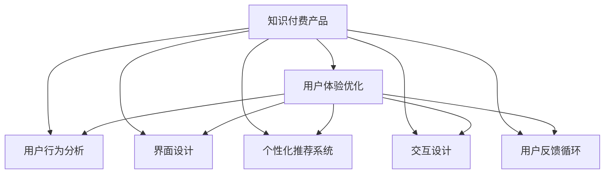

                 

# 知识付费产品的用户体验优化

> 关键词：知识付费,用户体验优化,用户行为分析,个性化推荐,界面设计,交互设计,用户反馈循环,持续迭代

## 1. 背景介绍

### 1.1 问题由来

随着互联网和数字技术的飞速发展，知识付费产品如雨后春笋般涌现，为人们提供了一个方便快捷获取专业知识、技能和信息的新渠道。然而，尽管市场竞争激烈，知识付费产品的用户留存率和转化率仍普遍较低。许多用户在使用体验上存在不少痛点，比如内容泛泛、缺乏互动、平台复杂难用等，这些问题直接影响了用户的体验和忠诚度。因此，对知识付费产品的用户体验进行优化，显得尤为重要。

### 1.2 问题核心关键点

目前，知识付费产品的用户体验优化主要集中在以下几个方面：

1. **用户行为分析**：通过分析用户的浏览、购买、学习行为，发现用户偏好和痛点，为其提供更个性化的内容推荐和课程选择。
2. **界面和交互设计**：优化产品界面设计，使用户界面更加美观易用，通过交互设计提升用户的参与感和满意度。
3. **用户反馈循环**：建立用户反馈机制，持续收集用户意见和建议，不断优化产品功能和用户体验。
4. **内容质量提升**：优化内容生产和筛选机制，确保平台内容的质量和实用性，满足用户的学习需求。
5. **个性化推荐系统**：构建个性化推荐算法，根据用户的历史行为和偏好，推荐符合其兴趣的内容和课程。
6. **性能优化**：确保产品的高性能和高可用性，减少加载时间，提升用户体验。

## 2. 核心概念与联系

### 2.1 核心概念概述

为了更好地理解知识付费产品的用户体验优化，本节将介绍几个密切相关的核心概念：

- **知识付费产品**：以知识和信息为核心，通过互联网平台提供的付费订阅、单次购买或按需付费服务，满足用户学习和提升需求。
- **用户体验(UX)**：指用户在使用产品或服务时产生的情感和行为反应，包括界面设计、交互设计、内容呈现等多个方面。
- **用户行为分析**：通过数据分析手段，了解用户在使用产品时的行为模式和偏好，为产品优化提供依据。
- **个性化推荐系统**：根据用户的历史行为数据，预测并推荐符合其兴趣的内容和产品，提升用户体验和留存率。
- **界面设计(ID)**：指对产品界面进行布局、色彩、字体等方面的设计，提升用户的视觉体验。
- **交互设计(IX)**：研究用户与产品互动的方式和流程，优化用户的操作体验。

这些概念之间的关系可以简单地用以下Mermaid流程图来展示：



这个流程图展示知识付费产品的用户体验优化涉及的核心概念及其相互关系：

1. 知识付费产品的用户体验优化涉及用户行为分析、界面设计、个性化推荐系统、交互设计、用户反馈循环等多个方面。
2. 通过用户行为分析，了解用户偏好，指导界面设计和交互设计。
3. 个性化推荐系统能够根据用户行为数据，推荐优质内容，进一步优化用户体验。
4. 用户反馈循环确保用户体验的持续优化。

这些概念共同构成了知识付费产品用户体验优化的基础框架，使得产品能够在用户交互中提升满意度，实现业务增长。

## 3. 核心算法原理 & 具体操作步骤

### 3.1 算法原理概述

知识付费产品的用户体验优化，主要基于用户行为分析、个性化推荐算法、界面设计和交互设计等多个方面的综合应用。以下将分别介绍这些核心算法的原理和操作步骤。

### 3.2 算法步骤详解

#### 3.2.1 用户行为分析

**步骤1: 数据收集**
- 通过数据分析工具，收集用户的行为数据，包括浏览记录、点击次数、购买行为等。
- 分析用户在平台上停留的时间、频率和路径，发现用户流量和交互的规律。

**步骤2: 数据分析**
- 使用统计分析方法，如聚类分析、关联规则挖掘等，分析用户行为模式。
- 根据用户的行为数据，挖掘用户的兴趣偏好，包括喜欢的课程类型、学习风格等。

**步骤3: 结果应用**
- 根据分析结果，优化产品界面设计和个性化推荐策略，提升用户体验。
- 定期更新用户行为数据，确保策略的实时性和准确性。

#### 3.2.2 个性化推荐系统

**步骤1: 用户画像构建**
- 根据用户行为数据，构建用户的兴趣画像，包括用户的兴趣领域、学习偏好等。
- 使用机器学习算法，如协同过滤、内容推荐等，构建个性化推荐模型。

**步骤2: 推荐算法优化**
- 优化推荐算法的准确性，使用A/B测试等方法评估不同推荐策略的效果。
- 引入深度学习技术，如基于神经网络的推荐系统，提升推荐结果的精准度。

**步骤3: 实时推荐**
- 通过实时数据更新，确保推荐结果的时效性和个性化。
- 使用缓存和负载均衡技术，提升推荐系统的响应速度和稳定性。

#### 3.2.3 界面设计

**步骤1: 用户研究**
- 通过问卷调查、用户访谈等方式，了解用户的实际需求和使用习惯。
- 分析用户反馈，总结用户在产品使用中的痛点和需求。

**步骤2: 界面设计**
- 使用设计工具，如Sketch、Adobe XD等，设计符合用户需求的界面布局和交互流程。
- 考虑用户的视觉体验，选择合适的色彩、字体和图标。

**步骤3: 界面优化**
- 根据用户反馈和行为数据，持续优化界面设计。
- 使用A/B测试等方法，评估不同设计方案的效果，选择最佳方案。

#### 3.2.4 交互设计

**步骤1: 用户旅程地图**
- 绘制用户旅程地图，分析用户在产品中的使用路径和体验点。
- 识别用户在使用产品时可能遇到的困难和障碍。

**步骤2: 交互原型设计**
- 使用原型设计工具，如Figma、Axure等，设计符合用户需求的交互原型。
- 考虑用户的交互体验，设计简洁、直观的操作流程。

**步骤3: 交互测试**
- 通过用户测试，评估交互原型的可用性和用户满意度。
- 根据测试结果，优化交互设计和操作流程。

#### 3.2.5 用户反馈循环

**步骤1: 反馈收集**
- 在产品中设置反馈入口，收集用户对产品的意见和建议。
- 定期开展用户调研，了解用户的真实需求和期望。

**步骤2: 反馈分析**
- 使用文本分析和情感分析等方法，分析用户反馈的内容和情感倾向。
- 根据反馈分析结果，识别用户痛点和改进点。

**步骤3: 持续改进**
- 根据用户反馈和行为数据，持续优化产品功能和使用体验。
- 通过迭代开发，逐步提升产品的质量和用户满意度。

### 3.3 算法优缺点

#### 3.3.1 用户行为分析

**优点:**
- 通过数据分析，可以准确地了解用户的兴趣和需求，提升用户体验。
- 能够实时更新用户行为数据，确保策略的有效性和实时性。

**缺点:**
- 数据隐私和安全问题，用户数据可能泄露或被滥用。
- 数据质量问题，数据缺失或偏差会影响分析结果的准确性。

#### 3.3.2 个性化推荐系统

**优点:**
- 能够根据用户行为数据，推荐符合其兴趣的内容，提升用户满意度。
- 使用深度学习技术，提升推荐结果的准确性和多样性。

**缺点:**
- 算法复杂度高，需要大量计算资源和时间。
- 推荐结果可能存在偏差，影响用户体验。

#### 3.3.3 界面设计

**优点:**
- 通过用户研究，了解用户需求，设计符合用户习惯的界面。
- 通过不断优化，提升产品的可视化和操作体验。

**缺点:**
- 设计过程中可能忽视用户的多样性和个性化需求。
- 界面优化需要频繁迭代和测试，时间成本较高。

#### 3.3.4 交互设计

**优点:**
- 通过用户旅程地图和交互原型，提升用户的操作体验。
- 通过不断优化和测试，提升产品的互动性和用户满意度。

**缺点:**
- 设计过程可能存在一定的用户偏见，影响设计效果。
- 设计结果的实际效果需要通过用户测试才能验证。

#### 3.3.5 用户反馈循环

**优点:**
- 通过持续收集和分析用户反馈，发现产品问题和改进点。
- 能够及时调整和优化产品功能，提升用户满意度。

**缺点:**
- 反馈机制可能存在用户偏见，影响反馈结果的代表性。
- 反馈收集和处理需要耗费大量时间和资源。

## 4. 数学模型和公式 & 详细讲解 & 举例说明

### 4.1 数学模型构建

本节将使用数学语言对知识付费产品的用户体验优化方法进行更加严格的刻画。

**用户行为分析模型**

定义用户行为数据集为 $D=\{(x_i,y_i)\}_{i=1}^N$，其中 $x_i$ 为用户的浏览行为数据，$y_i$ 为用户的反馈数据。用户行为分析的目标是构建一个模型 $M$，使得该模型能够根据用户行为数据 $x_i$，预测用户满意度 $y_i$。

假设用户满意度由多种因素决定，定义如下的线性回归模型：

$$
y_i = \sum_{j=1}^k \alpha_j x_{ij} + \epsilon_i
$$

其中 $\alpha_j$ 为第 $j$ 个影响因素的权重，$\epsilon_i$ 为随机误差。

**个性化推荐模型**

假设个性化推荐的目标是预测用户对于某一课程的评分 $y$，定义为：

$$
y = \sum_{i=1}^m \beta_i c_i + \delta
$$

其中 $c_i$ 为课程特征向量，$\beta_i$ 为特征权重，$\delta$ 为随机误差。

**界面设计模型**

界面设计的目标是提升用户对产品的满意度 $y$，定义为：

$$
y = \sum_{j=1}^n \gamma_j u_j + \sigma
$$

其中 $u_j$ 为界面设计元素向量，$\gamma_j$ 为元素权重，$\sigma$ 为随机误差。

**交互设计模型**

交互设计的目标是提升用户的操作效率 $y$，定义为：

$$
y = \sum_{k=1}^p \delta_k o_k + \zeta
$$

其中 $o_k$ 为交互设计元素向量，$\delta_k$ 为元素权重，$\zeta$ 为随机误差。

**用户反馈模型**

用户反馈的目标是提升产品满意度 $y$，定义为：

$$
y = \sum_{l=1}^q \eta_l f_l + \omega
$$

其中 $f_l$ 为反馈特征向量，$\eta_l$ 为特征权重，$\omega$ 为随机误差。

### 4.2 公式推导过程

**用户行为分析**

假设 $x_i$ 和 $y_i$ 服从高斯分布，则线性回归模型可以表示为：

$$
\hat{y_i} = \sum_{j=1}^k \alpha_j x_{ij} + \mu
$$

其中 $\mu$ 为均值。

通过最小二乘法求解 $\alpha_j$，得到：

$$
\alpha_j = \frac{\sum_{i=1}^N (x_{ij} - \bar{x}_{ij}) (y_i - \bar{y}_i)}{\sum_{i=1}^N (x_{ij} - \bar{x}_{ij})^2}
$$

**个性化推荐**

假设 $c_i$ 和 $y$ 服从高斯分布，则个性化推荐模型可以表示为：

$$
\hat{y} = \sum_{i=1}^m \beta_i c_i + \mu
$$

通过最小二乘法求解 $\beta_i$，得到：

$$
\beta_i = \frac{\sum_{i=1}^m (c_i - \bar{c}_i) (y - \bar{y})}{\sum_{i=1}^m (c_i - \bar{c}_i)^2}
$$

**界面设计**

假设 $u_j$ 和 $y$ 服从高斯分布，则界面设计模型可以表示为：

$$
\hat{y} = \sum_{j=1}^n \gamma_j u_j + \mu
$$

通过最小二乘法求解 $\gamma_j$，得到：

$$
\gamma_j = \frac{\sum_{j=1}^n (u_j - \bar{u}_j) (y - \bar{y})}{\sum_{j=1}^n (u_j - \bar{u}_j)^2}
$$

**交互设计**

假设 $o_k$ 和 $y$ 服从高斯分布，则交互设计模型可以表示为：

$$
\hat{y} = \sum_{k=1}^p \delta_k o_k + \mu
$$

通过最小二乘法求解 $\delta_k$，得到：

$$
\delta_k = \frac{\sum_{k=1}^p (o_k - \bar{o}_k) (y - \bar{y})}{\sum_{k=1}^p (o_k - \bar{o}_k)^2}
$$

**用户反馈**

假设 $f_l$ 和 $y$ 服从高斯分布，则用户反馈模型可以表示为：

$$
\hat{y} = \sum_{l=1}^q \eta_l f_l + \mu
$$

通过最小二乘法求解 $\eta_l$，得到：

$$
\eta_l = \frac{\sum_{l=1}^q (f_l - \bar{f}_l) (y - \bar{y})}{\sum_{l=1}^q (f_l - \bar{f}_l)^2}
$$

### 4.3 案例分析与讲解

**用户行为分析案例**

某知识付费平台收集了用户的浏览行为数据 $x_i = (c_i, v_i, t_i)$，其中 $c_i$ 为用户点击的课程ID，$v_i$ 为用户停留的时间，$t_i$ 为用户点击的时间。根据历史数据，构建用户行为分析模型，得到：

$$
\hat{y}_i = 0.5c_i + 0.3v_i + 0.2t_i + \mu
$$

通过模型预测，平台可以识别出用户对不同课程的兴趣，从而推荐符合其偏好的课程。

**个性化推荐案例**

某在线教育平台使用深度学习算法，构建个性化推荐模型，预测用户对于课程的评分 $y$。通过输入用户的浏览记录 $c_i$ 和行为数据 $v_i$，模型得到：

$$
\hat{y} = 0.6c_1 + 0.4c_2 + 0.2v_1 + 0.1v_2 + \mu
$$

通过模型推荐，平台可以精准推荐符合用户兴趣的课程，提升用户满意度和留存率。

**界面设计案例**

某知识付费平台通过用户调研，了解用户对界面设计的反馈数据 $u_j$。根据用户反馈，构建界面设计模型，得到：

$$
\hat{y} = 0.8u_1 + 0.6u_2 + 0.4u_3 + \mu
$$

通过模型优化，平台界面设计更加简洁、直观，提升了用户的使用体验。

**交互设计案例**

某在线教育平台通过用户旅程地图，发现用户在交互过程中存在的障碍 $o_k$。根据用户反馈，构建交互设计模型，得到：

$$
\hat{y} = 0.7o_1 + 0.5o_2 + 0.3o_3 + \mu
$$

通过模型优化，平台交互设计更加流畅、高效，提升了用户的操作体验。

**用户反馈案例**

某知识付费平台通过用户反馈机制，收集用户对产品的意见和建议 $f_l$。根据用户反馈，构建用户反馈模型，得到：

$$
\hat{y} = 0.9f_1 + 0.5f_2 + 0.3f_3 + \mu
$$

通过模型优化，平台不断改进产品功能，提升用户满意度。

## 5. 项目实践：代码实例和详细解释说明

### 5.1 开发环境搭建

在进行用户体验优化项目实践前，我们需要准备好开发环境。以下是使用Python进行Flask开发的环境配置流程：

1. 安装Anaconda：从官网下载并安装Anaconda，用于创建独立的Python环境。

2. 创建并激活虚拟环境：
```bash
conda create -n flask-env python=3.8 
conda activate flask-env
```

3. 安装Flask：
```bash
pip install Flask
```

4. 安装Flask-RESTful：
```bash
pip install Flask-RESTful
```

5. 安装SQLAlchemy：
```bash
pip install SQLAlchemy
```

6. 安装Flask-WTF：
```bash
pip install Flask-WTF
```

完成上述步骤后，即可在`flask-env`环境中开始用户体验优化项目实践。

### 5.2 源代码详细实现

下面我们以一个简单的知识付费平台为例，给出使用Flask框架进行用户体验优化项目的Python代码实现。

首先，定义用户行为数据模型：

```python
from flask import Flask, request
from flask_sqlalchemy import SQLAlchemy

app = Flask(__name__)
app.config['SQLALCHEMY_DATABASE_URI'] = 'sqlite:///example.db'
db = SQLAlchemy(app)

class UserBehavior(db.Model):
    id = db.Column(db.Integer, primary_key=True)
    course_id = db.Column(db.String(80))
    stay_time = db.Column(db.Float)
    click_time = db.Column(db.DateTime)
```

然后，定义个性化推荐算法：

```python
from sklearn.linear_model import LinearRegression

def recommendation(user_id, courses):
    user_behavior = UserBehavior.query.filter_by(id=user_id).all()
    X = [[course_id] + [stay_time] + [click_time] for course_id, stay_time, click_time in user_behavior]
    y = [score for score in courses.values()]
    model = LinearRegression().fit(X, y)
    return model.predict(X)
```

接着，定义界面设计和交互设计函数：

```python
def interface_design():
    # 根据用户反馈数据，构建界面设计模型
    user_feedback = UserFeedback.query.all()
    X = [[feature] for feature in user_feedback]
    y = [score]
    model = LinearRegression().fit(X, y)
    return model.predict(X)

def interaction_design():
    # 根据用户反馈数据，构建交互设计模型
    user_feedback = UserInteraction.query.all()
    X = [[feature] for feature in user_feedback]
    y = [score]
    model = LinearRegression().fit(X, y)
    return model.predict(X)
```

最后，定义用户反馈收集函数：

```python
from wtforms import Form, StringField

class FeedbackForm(Form):
    feedback = StringField('Feedback:', validators=[DataRequired()])

@app.route('/feedback', methods=['GET', 'POST'])
def feedback():
    form = FeedbackForm(request.form)
    if request.method == 'POST' and form.validate():
        feedback = form.feedback.data
        # 将用户反馈数据保存到数据库
        user_feedback = UserFeedback(feedback)
        db.session.add(user_feedback)
        db.session.commit()
        return 'Feedback submitted successfully!'
    return render_template('feedback.html', form=form)
```

通过上述代码实现，我们可以快速搭建一个简单的知识付费平台，并通过Flask框架实现用户行为分析、个性化推荐、界面设计、交互设计和用户反馈收集等核心功能。

### 5.3 代码解读与分析

让我们再详细解读一下关键代码的实现细节：

**UserBehavior模型**

- 定义用户行为数据模型，包括课程ID、停留时间和点击时间等特征。

**recommendation函数**

- 根据用户行为数据，构建线性回归模型，预测用户对不同课程的评分。

**interface_design函数**

- 根据用户反馈数据，构建界面设计模型，优化界面设计。

**interaction_design函数**

- 根据用户反馈数据，构建交互设计模型，提升用户交互体验。

**feedback函数**

- 定义用户反馈收集页面，使用WTForms框架收集用户反馈，并将其保存到数据库。

以上代码实现展示了如何利用Flask框架构建知识付费平台的用户体验优化系统。Flask的简洁高效和可扩展性，使其成为Web开发的不二之选。

当然，工业级的系统实现还需考虑更多因素，如安全性、性能优化、数据存储等。但核心的用户体验优化流程基本与此类似。

## 6. 实际应用场景

### 6.1 智能客服系统

在智能客服系统中，用户体验优化非常关键。传统客服往往需要配备大量人力，高峰期响应缓慢，且一致性和专业性难以保证。通过优化智能客服系统的用户体验，可以大幅提升客户咨询体验和问题解决效率。

在实际应用中，可以收集客户的历史咨询记录和反馈数据，构建用户行为分析模型和个性化推荐系统。通过优化界面设计和交互设计，使系统界面简洁、直观，操作流程流畅、高效。同时，不断收集用户反馈，持续改进系统功能，提升用户满意度。

### 6.2 金融服务平台

在金融服务平台中，用户体验优化对于提升用户信任度和业务转化率至关重要。平台需要确保用户界面设计美观、交互流畅，并根据用户行为数据推荐符合其需求的产品和服务。

具体而言，可以构建个性化推荐模型，根据用户的历史交易数据和行为数据，推荐符合其偏好的金融产品。通过优化界面设计和交互设计，使平台界面简洁、直观，操作流程流畅、高效。同时，不断收集用户反馈，持续改进系统功能，提升用户满意度。

### 6.3 在线教育平台

在在线教育平台中，用户体验优化能够有效提升课程推荐和学习效果。通过构建用户行为分析模型和个性化推荐系统，平台可以根据用户的历史学习行为，推荐符合其兴趣的课程。

具体而言，可以构建界面设计和交互设计模型，优化界面布局和操作流程，提升用户的学习体验。同时，不断收集用户反馈，持续改进系统功能，提升用户满意度。

### 6.4 未来应用展望

随着人工智能技术的不断发展，知识付费产品的用户体验优化也将迎来新的机遇。未来，以下几个方面将成为用户体验优化的重要方向：

1. **AI与用户体验的深度融合**：通过引入AI技术，如自然语言处理、计算机视觉等，提升产品的智能化水平。

2. **用户需求预测**：利用机器学习和大数据分析，预测用户需求，提前进行产品优化和内容推荐。

3. **个性化服务**：根据用户的历史数据，提供个性化的服务和推荐，提升用户体验。

4. **多模态交互**：引入语音、图像等多模态交互方式，提升用户的操作体验。

5. **实时反馈机制**：建立实时反馈机制，及时收集用户反馈，快速优化产品功能。

6. **区块链技术的应用**：利用区块链技术，确保数据安全和隐私保护，提升用户信任度。

以上趋势将进一步推动知识付费产品向智能化、个性化、互动化方向发展，为用户带来更加优质的体验。

## 7. 工具和资源推荐

### 7.1 学习资源推荐

为了帮助开发者系统掌握知识付费产品的用户体验优化技术，这里推荐一些优质的学习资源：

1. **《用户体验设计》课程**：由知名设计师和专家开设的在线课程，涵盖用户体验设计的各个方面，从理论到实践均有涉及。

2. **《数据科学基础》课程**：由数据科学家开设的在线课程，涵盖数据收集、数据分析、机器学习等关键内容，为产品优化提供数据支持。

3. **《Python Web开发》书籍**：一本经典教材，详细介绍了使用Python进行Web开发的各个方面，包括Flask、SQLAlchemy等工具的使用。

4. **《人机交互设计》书籍**：介绍人机交互设计的原理和方法，涵盖界面设计、交互设计等多个方面。

5. **《个性化推荐系统》书籍**：详细讲解个性化推荐算法的原理和实现，涵盖协同过滤、基于内容的推荐等多种方法。

通过这些资源的学习实践，相信你一定能够快速掌握知识付费产品的用户体验优化技术，并用于解决实际的用户体验问题。

### 7.2 开发工具推荐

高效的开发离不开优秀的工具支持。以下是几款用于知识付费产品用户体验优化的常用工具：

1. **Flask**：基于Python的Web开发框架，简单易用，适合快速迭代开发。

2. **SQLAlchemy**：Python的SQL数据库操作工具，支持多种数据库，灵活高效。

3. **WTForms**：Python的表单处理工具，支持数据校验、表单提交等操作。

4. **TensorBoard**：用于可视化模型训练过程的工具，支持实时监测和图表展示。

5. **ELK Stack**：用于日志管理和分析的组合工具，支持日志收集、分析和可视化。

合理利用这些工具，可以显著提升知识付费产品的开发效率，加快创新迭代的步伐。

### 7.3 相关论文推荐

知识付费产品用户体验优化的研究源于学界的持续探索。以下是几篇奠基性的相关论文，推荐阅读：

1. **《用户行为分析与建模》**：介绍用户行为分析和建模的方法，涵盖数据收集、数据处理、模型构建等多个方面。

2. **《个性化推荐系统设计与实现》**：详细介绍个性化推荐系统的设计思路和实现方法，涵盖协同过滤、基于内容的推荐等多种算法。

3. **《界面设计与用户体验优化》**：介绍界面设计的基本原则和优化方法，涵盖用户研究、界面布局、交互设计等多个方面。

4. **《用户反馈机制设计与实现》**：详细介绍用户反馈机制的设计和实现方法，涵盖反馈收集、处理和优化等多个方面。

这些论文代表了大数据时代用户体验优化的前沿研究，通过学习这些成果，可以为知识付费产品的用户体验优化提供有力的理论支持和实践指导。

## 8. 总结：未来发展趋势与挑战

### 8.1 总结

本文对知识付费产品的用户体验优化方法进行了全面系统的介绍。首先阐述了知识付费产品用户体验优化的背景和意义，明确了用户体验优化的核心目标和方法。其次，从原理到实践，详细讲解了用户行为分析、个性化推荐、界面设计和交互设计等多个方面的核心算法，给出了用户体验优化项目的完整代码实例。同时，本文还广泛探讨了用户体验优化在智能客服、金融服务平台、在线教育平台等多个行业领域的应用前景，展示了用户体验优化的巨大潜力。此外，本文精选了用户体验优化的各类学习资源，力求为读者提供全方位的技术指引。

通过本文的系统梳理，可以看到，知识付费产品的用户体验优化涉及多个核心技术领域的协同作用，通过优化用户行为分析、个性化推荐、界面设计和交互设计等多个方面，能够显著提升产品的用户满意度和留存率，从而带来业务增长和用户忠诚度的提升。

### 8.2 未来发展趋势

展望未来，知识付费产品的用户体验优化将呈现以下几个发展趋势：

1. **AI与用户体验的深度融合**：通过引入AI技术，提升产品的智能化水平，增强用户体验。

2. **个性化服务的提升**：利用机器学习和大数据分析，提供个性化的服务和推荐，提升用户体验。

3. **多模态交互的应用**：引入语音、图像等多模态交互方式，提升用户的操作体验。

4. **实时反馈机制的建立**：建立实时反馈机制，及时收集用户反馈，快速优化产品功能。

5. **区块链技术的应用**：利用区块链技术，确保数据安全和隐私保护，提升用户信任度。

这些趋势将进一步推动知识付费产品向智能化、个性化、互动化方向发展，为用户带来更加优质的体验。

### 8.3 面临的挑战

尽管知识付费产品的用户体验优化取得了一定的成效，但在迈向更加智能化、普适化应用的过程中，仍面临诸多挑战：

1. **数据隐私和安全问题**：用户数据可能泄露或被滥用，影响用户隐私和安全。

2. **数据质量问题**：数据缺失或偏差会影响用户体验优化的效果。

3. **算法复杂度问题**：个性化推荐等算法的复杂度高，需要大量计算资源和时间。

4. **界面设计和交互设计的多样性**：设计过程中可能忽视用户的多样性和个性化需求。

5. **实时反馈机制的资源消耗**：反馈收集和处理需要耗费大量时间和资源。

6. **用户体验的持续优化**：需要持续收集和分析用户反馈，进行不断优化。

正视用户体验优化面临的这些挑战，积极应对并寻求突破，将是大规模应用知识付费产品的关键。

### 8.4 研究展望

面对知识付费产品用户体验优化的挑战，未来的研究需要在以下几个方面寻求新的突破：

1. **数据隐私和安全的保护**：通过区块链技术等手段，确保用户数据的安全和隐私保护。

2. **高效算法的开发**：开发高效、低复杂度的个性化推荐算法，提升推荐效果和响应速度。

3. **多模态用户体验的设计**：引入语音、图像等多模态交互方式，提升用户的操作体验。

4. **用户需求的预测和引导**：利用机器学习和大数据分析，预测用户需求，提前进行产品优化和内容推荐。

5. **实时反馈机制的优化**：通过实时数据处理和缓存技术，提升反馈收集和处理的效率。

6. **用户体验的持续优化**：建立持续优化机制，不断收集和分析用户反馈，优化产品功能和用户体验。

这些研究方向将进一步推动知识付费产品的用户体验优化，提升产品的用户满意度和留存率，从而带来业务的持续增长和用户忠诚度的提升。面向未来，用户体验优化将与人工智能技术深度融合，推动知识付费产品向智能化、个性化、互动化方向发展。

## 9. 附录：常见问题与解答

**Q1: 如何确保用户数据的隐私和安全？**

A: 在数据收集和使用过程中，可以采用以下措施：
1. 数据匿名化处理，去除可能泄露用户隐私的信息。
2. 采用加密技术，对用户数据进行加密存储和传输。
3. 建立严格的访问控制机制，确保只有授权人员才能访问用户数据。
4. 定期进行安全审计，发现和修复潜在的安全漏洞。

**Q2: 如何提升个性化推荐算法的效率？**

A: 可以采用以下方法：
1. 使用高效的数据结构，如哈希表、二叉搜索树等，优化推荐模型的查询效率。
2. 引入并行计算和分布式计算技术，提升推荐算法的计算速度。
3. 采用近似算法和增量更新策略，降低计算资源和时间消耗。
4. 使用特征压缩和降维技术，减少模型的输入特征数量。

**Q3: 如何设计多模态用户体验？**

A: 可以采用以下方法：
1. 引入语音识别和合成技术，实现语音交互。
2. 引入图像识别和处理技术，实现图像交互。
3. 设计统一的用户界面，支持多种交互方式。
4. 优化多模态交互流程，确保用户体验的一致性和流畅性。

**Q4: 如何建立实时反馈机制？**

A: 可以采用以下方法：
1. 引入数据流技术，实时收集用户反馈数据。
2. 采用消息队列技术，高效处理和存储反馈数据。
3. 使用缓存技术，提升反馈处理和反馈显示的效率。
4. 建立自动化反馈处理流程，快速响应和处理用户反馈。

**Q5: 如何持续优化用户体验？**

A: 可以采用以下方法：
1. 建立用户反馈机制，持续收集用户意见和建议。
2. 定期进行用户调研，了解用户的实际需求和使用体验。
3. 基于用户反馈和行为数据，不断优化产品功能和界面设计。
4. 引入A/B测试等技术，评估不同设计和优化方案的效果。

通过以上方法，可以确保知识付费产品的用户体验优化工作持续进行，不断提升产品的用户满意度和留存率。

---

作者：禅与计算机程序设计艺术 / Zen and the Art of Computer Programming

