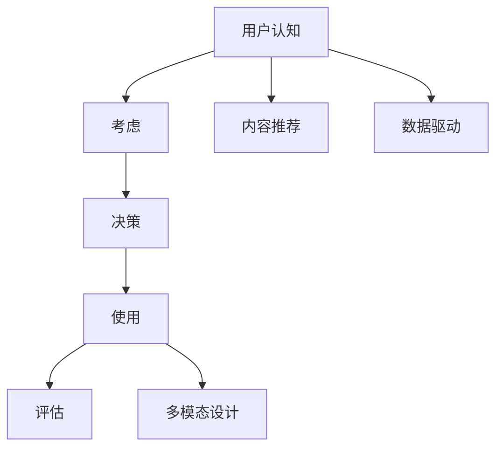

                 

# 知识付费产品的用户旅程优化

## 1. 背景介绍

### 1.1 问题由来

随着互联网技术的发展，知识付费成为越来越多人的选择。线上学习资源丰富，但如何让用户真正地从付费内容中获得价值，提高用户满意度和留存率，成为平台运营的核心难题。为此，我们需要从用户旅程的全局视角出发，对用户的使用过程进行优化设计，提升产品体验。

### 1.2 问题核心关键点

知识付费产品用户旅程优化，旨在通过精准的体验设计，优化用户在不同阶段的行为路径，提升用户价值。主要关注以下核心问题：

- **用户学习路径**：如何设计一条简洁明了的路径，让用户轻松找到并学习自己感兴趣的内容。
- **课程内容设计**：如何设置课程结构、呈现形式，保证用户能真正学有所得。
- **互动与反馈**：如何通过社交互动、即时反馈等方式增强用户参与感，促进知识内化。
- **学习成果展示**：如何设计合理的展示机制，让用户看到自己的学习进展和成就感。
- **多设备兼容**：如何在不同的设备上提供一致的用户体验，满足用户随时随地学习的需求。

## 2. 核心概念与联系

### 2.1 核心概念概述

为更好地理解知识付费产品用户旅程优化的内涵，本节将介绍几个关键概念：

- **用户旅程**：描述用户在产品中完整的行为路径，包括认知、考虑、决策、使用、评估等关键环节。
- **价值主张**：产品提供给用户的核心利益和价值点，如高效学习、专家推荐、社区互动等。
- **内容推荐**：基于用户行为数据，通过算法推荐系统为用户推荐可能感兴趣的内容。
- **多模态设计**：结合文本、图像、视频等多媒体元素，提升内容呈现的丰富性和可理解性。
- **数据驱动**：通过收集用户行为数据，进行分析和反馈，不断优化产品设计。

这些概念之间的联系可以通过以下Mermaid流程图来展示：



这个流程图展示用户旅程各阶段的设计逻辑：

1. **认知**：用户了解产品，初步产生兴趣。
2. **考虑**：用户对比不同内容，决定是否付费购买。
3. **决策**：用户决定购买或免费试听，开始学习。
4. **使用**：用户使用产品，学习内容。
5. **评估**：用户评估学习效果和产品体验，形成反馈。

每个阶段的设计都围绕提升用户价值展开，形成闭环反馈，确保用户能在产品中获得良好体验。

## 3. 核心算法原理 & 具体操作步骤
### 3.1 算法原理概述

知识付费产品用户旅程优化的核心算法原理基于用户体验设计和数据驱动的优化策略。通过构建完整的用户旅程模型，识别关键节点和影响因素，运用数据分析和算法优化，不断迭代改进产品设计。

### 3.2 算法步骤详解

用户旅程优化一般包括以下几个关键步骤：

**Step 1: 设计用户旅程模型**

- **确定用户旅程阶段**：包括认知、考虑、决策、使用、评估等。
- **定义关键行为**：如内容搜索、课程选择、学习反馈等。
- **识别影响因素**：包括内容质量、学习难度、交互设计等。

**Step 2: 收集用户行为数据**

- **定义关键指标**：如课程完成率、付费意愿、用户满意度等。
- **部署数据收集工具**：如点击率统计、课程评价系统、互动反馈等。

**Step 3: 分析用户行为数据**

- **数据清洗和预处理**：去除异常数据，处理缺失值，归一化数据。
- **行为建模**：使用聚类、关联规则等算法发现用户行为规律。
- **效果评估**：通过A/B测试、用户调研等手段评估优化效果。

**Step 4: 优化产品设计**

- **优化界面和流程**：简化操作流程，优化用户体验。
- **内容推荐和排序**：使用协同过滤、内容推荐算法优化推荐结果。
- **互动和反馈机制**：加入社交分享、即时评论等功能，提升用户参与感。
- **多设备兼容**：适配不同设备的操作系统，提供一致的用户体验。

**Step 5: 持续迭代和优化**

- **定期收集用户反馈**：通过问卷、访谈等手段获取用户意见。
- **持续改进产品**：根据反馈数据和测试结果不断调整产品设计。
- **迭代产品迭代**：小步快跑，持续发布改进版本。

### 3.3 算法优缺点

用户旅程优化的主要优点：

1. **数据驱动**：通过收集和分析用户行为数据，实现更精准的产品设计和优化。
2. **用户体验**：从用户视角出发，提升整体使用体验，提高用户满意度。
3. **个性化推荐**：通过深度学习等算法，实现更精准的内容推荐，提高用户粘性。
4. **持续改进**：通过持续收集和分析用户反馈，不断优化产品。

同时，该方法也存在一定的局限性：

1. **数据质量依赖**：用户行为数据的质量直接影响优化效果，数据收集和清洗的成本较高。
2. **算法复杂度**：需要应用复杂的机器学习算法，对技术要求较高。
3. **隐私和安全**：用户数据的收集和使用涉及隐私和安全问题，需要严格的数据保护措施。
4. **用户行为多样性**：不同用户的行为习惯不同，单一的优化策略可能无法覆盖所有用户。

尽管存在这些局限性，但就目前而言，用户旅程优化已成为知识付费产品提升用户体验的重要手段。未来相关研究的重点在于如何进一步提升数据质量和算法效率，同时兼顾隐私和用户体验，实现更高水平的个性化推荐和优化。

### 3.4 算法应用领域

用户旅程优化技术已经在知识付费产品的各个环节得到了广泛应用，涵盖以下主要领域：

- **课程推荐**：基于用户兴趣和行为，为用户推荐可能感兴趣的课程内容。
- **学习路径优化**：设计简洁的课程学习路径，引导用户从入门到精通。
- **互动社区**：构建学习社群，鼓励用户交流互动，提升学习动力。
- **内容定制化**：根据用户反馈，动态调整课程内容和形式，提升学习效果。
- **课程评价**：收集用户对课程的评价数据，用于课程优化和推荐。

除了上述这些应用外，知识付费产品还涉及内容创作、平台运营等多个方面，用户旅程优化技术在其中都有广泛的应用前景。

## 4. 数学模型和公式 & 详细讲解 & 举例说明（备注：数学公式请使用latex格式，latex嵌入文中独立段落使用 $$，段落内使用 $)
### 4.1 数学模型构建

本节将使用数学语言对知识付费产品用户旅程优化的过程进行更加严格的刻画。

设用户的行为序列为 $U=\{u_1, u_2, \ldots, u_N\}$，其中 $u_i$ 表示用户在第 $i$ 个阶段的行为。设行为对应的价值度量为 $v(u_i)$，则用户旅程的总价值 $V(U)$ 可以表示为：

$$
V(U) = \sum_{i=1}^N v(u_i)
$$

其中 $v(u_i)$ 可以是用户对内容的满意度、课程完成率、学习时间等。

### 4.2 公式推导过程

通过上述模型定义，我们可以构建用户旅程优化的数学框架，求解最优的行为序列 $U^*$ 和对应的价值 $V^*$：

$$
U^*, V^* = \mathop{\arg\min}_{U} V(U)
$$

具体求解步骤包括：

1. **行为建模**：使用关联规则、协同过滤等算法，构建用户行为序列的概率模型 $P(U)$。
2. **价值函数优化**：定义价值函数 $v(U)$，优化目标为 $V(U)$ 最小化。
3. **动态规划**：使用动态规划算法，求解最优行为序列 $U^*$。
4. **迭代优化**：通过不断调整行为序列，逐步逼近最优解 $V^*$。

### 4.3 案例分析与讲解

假设某知识付费产品有三种行为 $u_1$（注册）、$u_2$（选择课程）和 $u_3$（完成课程），对应的价值度量分别为 $v_1$（注册成功率）、$v_2$（课程选择准确率）和 $v_3$（课程完成率）。

1. **行为建模**：
   - 使用协同过滤算法，构建用户行为序列的概率模型 $P(U)$。
   - 使用价值函数 $v(U) = \sum_{i=1}^3 v_i$ 计算总价值。

2. **动态规划**：
   - 构建动态规划方程 $V^* = \max_{u_1} [v_1 + v_2 + V^*(u_2')]$，求解最优行为序列 $U^*$。

3. **迭代优化**：
   - 通过不断调整行为序列和价值函数，逐步逼近最优解。

## 5. 项目实践：代码实例和详细解释说明
### 5.1 开发环境搭建

在进行用户旅程优化实践前，我们需要准备好开发环境。以下是使用Python进行Django开发的环境配置流程：

1. 安装Python：从官网下载并安装Python。
2. 安装虚拟环境：使用virtualenv或conda等工具创建虚拟环境。
3. 安装Django：使用pip安装Django框架。
4. 安装MySQL：安装MySQL数据库，配置数据库连接。
5. 安装Flask：使用pip安装Flask框架，用于API开发。
6. 安装Redis：安装Redis缓存系统，用于优化查询速度。
7. 安装Docker：安装Docker容器系统，用于部署和管理应用。

完成上述步骤后，即可在虚拟环境中开始用户旅程优化的开发。

### 5.2 源代码详细实现

这里我们以一个简单的用户旅程优化系统为例，给出Django的代码实现。

首先，定义用户旅程的模型：

```python
from django.db import models

class User(models.Model):
    name = models.CharField(max_length=100)
    age = models.IntegerField()
    courses = models.ManyToManyField('Course')

class Course(models.Model):
    name = models.CharField(max_length=100)
    description = models.TextField()
    modules = models.ManyToManyField('Module')
```

然后，定义用户行为和价值计算的函数：

```python
from django.db.models import Count

def calculate_user_value(user):
    # 计算用户课程完成率
    completed_courses = user.courses.filter(completed=True).count()
    total_courses = user.courses.count()
    user_value = (completed_courses / total_courses) * 100
    return user_value

# 计算所有用户旅程的总价值
def calculate_total_value():
    total_value = 0
    for user in User.objects.all():
        user_value = calculate_user_value(user)
        total_value += user_value
    return total_value
```

最后，实现用户旅程优化的前端页面：

```html
<!-- user_journey.html -->
<h1>User Journey Optimization</h1>
<ul>
    
        <li>{{ user.name }}: {{ calculate_user_value(user) }}%</li>
    
</ul>
```

以上就是使用Django实现用户旅程优化的完整代码实现。可以看到，通过简单的模型和函数定义，我们就能方便地计算和展示用户旅程的总价值。

### 5.3 代码解读与分析

让我们再详细解读一下关键代码的实现细节：

**User类**：
- 定义了用户的基本信息和课程关系。

**Course类**：
- 定义了课程的基本信息和模块关系。

**calculate_user_value函数**：
- 根据用户已完成的课程数和总课程数计算课程完成率，返回用户价值。

**calculate_total_value函数**：
- 遍历所有用户，计算并累加总价值。

**user_journey.html模板**：
- 使用模板引擎展示每个用户的旅程价值。

通过上述代码，可以看到Django实现用户旅程优化相对简单，只需定义模型和计算函数，即可方便地进行数据统计和展示。开发者可以根据具体需求，灵活扩展功能和优化算法。

## 6. 实际应用场景

### 6.1 在线教育平台

在线教育平台往往面临用户流失率高、课程完成率低的问题。通过用户旅程优化，平台可以提升用户学习体验，提高课程完成率和用户满意度。

具体措施包括：

- **课程推荐**：基于用户学习行为，推荐感兴趣的课程，提高选择准确率。
- **学习路径设计**：设计合理的课程结构和学习路径，引导用户逐步深入学习。
- **学习反馈机制**：加入社交互动、即时反馈等功能，提升学习参与感。

通过优化用户旅程，平台可以有效提高用户留存率和课程完成率，从而提升整体收益。

### 6.2 知识共享社区

知识共享社区如知乎、CSDN等，通过用户旅程优化，可以提升用户互动和知识传播效率。

具体措施包括：

- **内容推荐**：基于用户兴趣和行为，推荐相关内容，增加互动频次。
- **用户激励**：设计合理的积分和奖励机制，鼓励用户分享和回答问题。
- **社区治理**：建立问答排序和审核机制，提升社区质量。

通过优化用户旅程，社区可以有效提升用户活跃度和知识传播效果，形成良性互动的生态系统。

### 6.3 在线培训课程

在线培训课程如Coursera、Udemy等，通过用户旅程优化，可以提升用户培训效果和转化率。

具体措施包括：

- **课程内容定制**：根据用户反馈，动态调整课程内容和形式，提升学习效果。
- **学习路径设计**：设计合理的课程模块和学习路径，提升学习效率。
- **互动和反馈机制**：加入社交互动、即时反馈等功能，增强用户参与感。

通过优化用户旅程，平台可以有效提升用户培训效果和转化率，从而提升整体收益。

## 7. 工具和资源推荐

### 7.1 学习资源推荐

为了帮助开发者系统掌握知识付费产品用户旅程优化的理论基础和实践技巧，这里推荐一些优质的学习资源：

1. 《用户旅程设计》书籍：深入讲解用户体验设计和用户旅程建模的理论与方法。
2. 《数据驱动的产品设计》课程：通过真实案例，介绍如何使用数据分析和用户调研优化产品设计。
3. 《机器学习在产品优化中的应用》文章：展示机器学习算法在推荐系统、互动设计等产品优化中的应用。
4. 《用户体验设计（UX）》书籍：详细讲解用户体验设计的原则和实践。
5. 《深度学习在推荐系统中的应用》文章：介绍深度学习算法在个性化推荐中的应用。

通过对这些资源的学习实践，相信你一定能够快速掌握知识付费产品用户旅程优化的精髓，并用于解决实际的NLP问题。

### 7.2 开发工具推荐

高效的开发离不开优秀的工具支持。以下是几款用于知识付费产品用户旅程优化的常用工具：

1. Django：Python的Web框架，支持高效的数据库操作和API开发。
2. Flask：轻量级的Web框架，适用于快速开发原型和API接口。
3. Redis：高性能的内存数据库，用于优化查询速度和数据缓存。
4. Docker：容器化技术，便于部署和管理应用。
5. Jupyter Notebook：交互式编程环境，支持Python等语言开发。

合理利用这些工具，可以显著提升知识付费产品用户旅程优化的开发效率，加快创新迭代的步伐。

### 7.3 相关论文推荐

知识付费产品用户旅程优化的发展源于学界的持续研究。以下是几篇奠基性的相关论文，推荐阅读：

1. "Designing the User Journey" by Paul Stevenson：用户旅程设计的经典书籍，涵盖理论和实践。
2. "User-Centered Interaction Design" by Anne Sharp：用户体验设计的经典教材，详细介绍用户体验设计的方法和案例。
3. "Deep Learning in Recommendation Systems" by Geng Yao：介绍深度学习算法在推荐系统中的应用，包括协同过滤、注意力机制等。
4. "Data-Driven Design for User Experience" by Meena Ricker：介绍数据驱动的用户体验设计方法，结合案例讲解。
5. "Machine Learning for Personalization" by Matthew Bradbury：介绍机器学习算法在个性化推荐中的应用，包括协同过滤、深度学习等。

这些论文代表的知识付费产品用户旅程优化的发展脉络。通过学习这些前沿成果，可以帮助研究者把握学科前进方向，激发更多的创新灵感。

## 8. 总结：未来发展趋势与挑战

### 8.1 总结

本文对知识付费产品用户旅程优化的理论基础和实践方法进行了全面系统的介绍。首先阐述了用户旅程优化的背景和意义，明确了优化设计在提升用户体验和业务价值方面的独特价值。其次，从原理到实践，详细讲解了用户旅程优化的数学原理和关键步骤，给出了用户旅程优化的完整代码实现。同时，本文还广泛探讨了用户旅程优化在在线教育、知识社区、在线培训等多个领域的应用前景，展示了用户旅程优化的巨大潜力。此外，本文精选了用户旅程优化的各类学习资源，力求为读者提供全方位的技术指引。

通过本文的系统梳理，可以看到，用户旅程优化技术已经成为知识付费产品提升用户体验的重要手段。这些方向的探索发展，必将进一步提升产品性能和用户体验，为知识付费平台带来更大的商业价值。

### 8.2 未来发展趋势

展望未来，知识付费产品用户旅程优化的主要发展趋势包括：

1. **AI驱动**：通过引入AI技术，如深度学习、自然语言处理等，提升用户行为分析的精准度和推荐效果。
2. **多模态设计**：结合文本、图像、视频等多媒体元素，提升内容呈现的丰富性和可理解性。
3. **个性化推荐**：通过更精细化的数据分析和推荐算法，实现更精准的内容推荐，提升用户粘性。
4. **互动增强**：加入社交互动、即时反馈等功能，提升用户参与感。
5. **数据隐私**：加强数据隐私保护，确保用户数据安全。
6. **国际化和本地化**：拓展全球市场，实现国际化和本地化的产品优化。

这些趋势凸显了用户旅程优化技术的广阔前景，这些方向的探索发展，必将进一步提升知识付费产品的效果和体验。

### 8.3 面临的挑战

尽管知识付费产品用户旅程优化技术已经取得了显著成果，但在迈向更高水平的过程中，仍面临诸多挑战：

1. **数据质量**：用户行为数据的准确性和完整性直接影响优化效果，数据收集和清洗的成本较高。
2. **算法复杂度**：需要应用复杂的机器学习算法，对技术要求较高。
3. **用户行为多样性**：不同用户的行为习惯不同，单一的优化策略可能无法覆盖所有用户。
4. **用户隐私**：用户数据的收集和使用涉及隐私和安全问题，需要严格的数据保护措施。
5. **国际化和本地化**：拓展全球市场，实现国际化和本地化的产品优化，面临语言和文化差异的挑战。

尽管存在这些挑战，但通过学界和产业界的共同努力，未来的用户旅程优化技术必将不断突破，实现更高水平的用户体验和业务价值。

### 8.4 研究展望

面对用户旅程优化所面临的挑战，未来的研究需要在以下几个方面寻求新的突破：

1. **数据质量提升**：通过数据清洗和增强技术，提升用户行为数据的准确性和完整性。
2. **算法优化**：开发更高效的机器学习算法，提升推荐精度和计算速度。
3. **个性化推荐**：结合因果推断、注意力机制等技术，提升个性化推荐的效果。
4. **用户行为分析**：利用大数据分析技术，深入理解用户行为模式，优化产品设计。
5. **隐私保护**：加强数据加密和安全措施，保护用户隐私。
6. **多语言支持**：拓展多语言支持，实现国际化和本地化的产品优化。

这些研究方向的探索，必将引领知识付费产品用户旅程优化的技术进步，提升用户体验和业务价值。总之，用户旅程优化需要开发者从用户视角出发，不断优化产品设计，提升用户体验，才能真正实现知识付费产品的商业成功。

## 9. 附录：常见问题与解答

**Q1：用户旅程优化是否适用于所有知识付费产品？**

A: 用户旅程优化在大多数知识付费产品上都能取得不错的效果，特别是对于用户量大、内容丰富且互动性强的平台。但对于一些特定领域的知识付费产品，如特定领域的在线培训、专业知识的共享社区等，需要结合具体需求进行优化设计。

**Q2：如何衡量用户旅程优化的效果？**

A: 用户旅程优化的效果可以从多个维度进行衡量，包括用户满意度、课程完成率、用户留存率等。具体而言：
- **用户满意度**：通过问卷调查、用户反馈等方式获取用户对产品的满意度评分。
- **课程完成率**：统计用户完成课程的比例，衡量学习效果。
- **用户留存率**：统计用户在不同时间段内的留存率，衡量用户忠诚度。

**Q3：如何实现个性化推荐？**

A: 个性化推荐通常涉及复杂的算法模型和大量数据分析。具体实现步骤包括：
1. **特征提取**：从用户行为数据中提取特征，如浏览历史、点击率等。
2. **模型训练**：使用协同过滤、深度学习等算法，训练推荐模型。
3. **推荐算法**：结合模型输出，使用基于排序的推荐算法，推荐用户可能感兴趣的内容。

**Q4：如何平衡个性化推荐和多样性？**

A: 在个性化推荐中，如何平衡推荐效果和多样性是一个重要问题。具体方法包括：
1. **多臂强盗算法**：使用多臂强盗算法，平衡推荐效果和多样性。
2. **内容多样性约束**：在推荐算法中加入多样性约束，保证推荐内容的多样性。
3. **用户偏好调整**：根据用户反馈，动态调整推荐策略，平衡推荐效果和多样性。

**Q5：如何设计多设备兼容的用户旅程？**

A: 设计多设备兼容的用户旅程，需要考虑不同设备的操作系统和屏幕尺寸等因素。具体方法包括：
1. **响应式设计**：使用响应式设计技术，适配不同设备的屏幕大小。
2. **多端适配**：在不同设备上部署兼容的代码，确保一致的用户体验。
3. **数据同步**：实现用户数据在不同设备间的同步，保持一致的用户状态。

通过这些方法，可以有效提升多设备兼容的用户旅程体验，满足用户随时随地学习的需求。

---

作者：禅与计算机程序设计艺术 / Zen and the Art of Computer Programming

