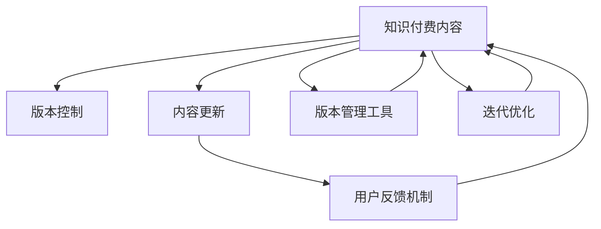

                 

# 知识付费内容的版本控制与更新策略

> 关键词：知识付费, 版本控制, 内容更新, 用户需求, 内容质量, 版本管理, 迭代优化

## 1. 背景介绍

### 1.1 问题由来

随着在线教育和知识付费的兴起，知识付费平台成为互联网教育的重要组成部分。这些平台汇集了大量优质的课程、文章、音频和视频内容，满足了用户个性化学习和知识储备的需求。然而，知识付费内容的快速增长也带来了新的挑战：如何高效地管理和更新内容，保持内容的及时性、准确性和权威性？

当前，许多知识付费平台往往采用人工编辑和审查的方式进行内容更新，这种方式费时费力且难以覆盖所有内容。同时，用户反馈和市场需求瞬息万变，人工审查的滞后性无法及时响应，导致平台内容竞争力下降，用户体验降低。

因此，本文将探讨如何通过技术手段，实现知识付费内容的版本控制与更新策略，提升平台的动态响应能力和用户体验。

### 1.2 问题核心关键点

知识付费内容版本控制与更新策略的核心关键点包括：

- 内容版本管理：如何记录和回溯知识付费内容的每个版本，避免重复劳动和信息丢失。
- 版本更新策略：如何根据用户反馈和市场变化，高效地更新内容，保持内容的实时性。
- 内容质量保障：如何保证更新后的内容质量，确保用户能够获得最新的、权威的知识。
- 用户需求响应：如何及时响应用户反馈，提升用户满意度和平台黏性。

这些关键点共同构成了知识付费内容版本控制与更新策略的实现基础，旨在通过技术手段提升平台的内容管理效率和用户体验。

### 1.3 问题研究意义

通过系统化的版本控制与更新策略，知识付费平台可以实现以下目标：

- 提升内容管理效率：自动化地进行版本控制，减少人工编辑和审查的重复工作。
- 快速响应市场变化：通过数据分析和用户反馈，快速调整内容，满足用户需求。
- 保障内容质量：引入智能审核和校对机制，确保内容的准确性和权威性。
- 提高用户满意度：及时更新和优化内容，提升用户体验和平台黏性。

## 2. 核心概念与联系

### 2.1 核心概念概述

为更好地理解知识付费内容版本控制与更新策略，本节将介绍几个密切相关的核心概念：

- 知识付费内容：指通过互联网平台提供的有偿教育资源，包括课程、文章、音频和视频等形式。
- 版本控制：指对知识付费内容的每个版本进行记录、回溯和管理，确保内容的历史完整性和可追溯性。
- 内容更新：指根据用户反馈和市场变化，对知识付费内容进行及时调整和优化。
- 用户反馈机制：指平台收集用户反馈，及时响应市场需求，提升用户满意度的机制。
- 版本管理工具：指用于版本控制和内容更新的软件工具，如Git、SVN等。
- 迭代优化：指通过不断迭代和优化，提升知识付费内容的价值和用户体验。

这些核心概念之间的逻辑关系可以通过以下Mermaid流程图来展示：



这个流程图展示了几类核心概念之间的相互关系：

1. 知识付费内容通过版本控制记录历史版本，进行回溯和更新。
2. 内容更新通过用户反馈机制，根据市场需求进行调整和优化。
3. 版本管理工具支持版本控制和内容更新，自动化管理内容版本。
4. 迭代优化不断改进内容质量，提升用户体验。

这些概念共同构成了知识付费内容版本控制与更新策略的实现基础，使其能够高效地管理更新知识付费内容，满足用户需求。

## 3. 核心算法原理 & 具体操作步骤

### 3.1 算法原理概述

知识付费内容版本控制与更新策略本质上是一个基于内容的版本管理过程。其核心思想是：通过版本控制工具记录和回溯知识付费内容的每个版本，结合用户反馈和市场变化，进行内容更新和优化，最终通过自动化管理工具确保内容质量，提升用户体验。

形式化地，假设知识付费内容为 $C_{t}$，其中 $t$ 表示内容版本号，可以是时间戳或发布日期。假设用户反馈为 $F_{u}$，市场变化为 $M_{v}$，其中 $u$ 表示用户反馈次数，$v$ 表示市场变化类型。内容更新的目标是最小化内容与用户需求和市场变化之间的差距：

$$
\min_{t} \|C_{t} - F_{u} \| + \|C_{t} - M_{v} \|
$$

其中 $\| \cdot \|$ 表示内容与用户需求或市场变化之间的差距，可以通过一定的评估指标（如点击率、评分等）来度量。

通过梯度下降等优化算法，内容更新过程不断更新内容版本号 $t$，最小化上述目标函数，使得内容更接近用户需求和市场变化，实现版本控制与更新的动态优化。

### 3.2 算法步骤详解

知识付费内容版本控制与更新策略一般包括以下几个关键步骤：

**Step 1: 设计版本控制方案**
- 选择合适的版本控制工具，如Git、SVN等，进行版本管理。
- 定义内容版本号和记录格式，确保版本信息的完整性。
- 设计版本更新流程，包括合并分支、代码审查等。

**Step 2: 收集用户反馈和市场变化**
- 建立用户反馈机制，收集用户对知识付费内容的意见和建议。
- 监控市场变化，如热点话题、需求趋势等，收集相关信息。
- 对用户反馈和市场变化进行分析和评估，确定更新方向。

**Step 3: 设计内容更新策略**
- 根据用户反馈和市场变化，设计内容更新方案，包括更新内容、优化结构等。
- 选择合适的更新时机，如每日、每周或重大事件后。
- 定义内容更新流程，包括版本合并、审核发布等。

**Step 4: 执行版本合并和发布**
- 在指定版本控制工具中，进行代码合并和发布操作。
- 对更新后的内容进行自动化测试，确保其正确性和完整性。
- 在平台上发布更新后的内容，通知用户。

**Step 5: 评估更新效果**
- 通过用户反馈和平台数据分析，评估更新后的内容效果。
- 收集新一轮的用户反馈和市场变化，准备下一轮更新。

以上是知识付费内容版本控制与更新策略的一般流程。在实际应用中，还需要针对具体平台的特点，对各个环节进行优化设计，如引入机器学习算法自动评估内容效果，设计智能审核流程等。

### 3.3 算法优缺点

知识付费内容版本控制与更新策略具有以下优点：
1. 自动化管理：通过版本控制工具，自动化地记录和管理内容版本，减少人工编辑和审查的工作量。
2. 动态优化：结合用户反馈和市场变化，动态更新内容，提升内容的实时性和准确性。
3. 可追溯性：通过版本控制，保留内容的历史记录，便于回溯和追溯。
4. 用户满意度提升：及时响应市场需求，提升用户体验和平台黏性。

同时，该方法也存在一定的局限性：
1. 技术依赖：版本控制工具和内容更新算法需要技术支撑，对技术要求较高。
2. 更新难度大：对于大规模内容库，更新和回溯工作量较大，容易出错。
3. 内容质量不稳定：版本控制和更新策略未能充分考虑内容质量，可能导致部分内容质量不稳定。
4. 用户需求多样性：用户需求多样且变化快，难以覆盖所有需求，可能导致内容与用户需求不完全匹配。

尽管存在这些局限性，但就目前而言，基于内容管理的技术手段仍是知识付费平台版本控制与更新策略的主要方向。未来相关研究的重点在于如何进一步降低技术难度，提高内容更新的效率和质量，同时兼顾用户需求的多样性和个性化。

### 3.4 算法应用领域

知识付费内容版本控制与更新策略在知识付费平台的应用领域包括：

- 课程更新：定期更新课程内容，引入最新知识和案例，提升课程的实用性和时效性。
- 文章发布：定期发布文章，跟踪热点话题，提供最新的研究和分析。
- 音频和视频更新：定期发布音频和视频，确保内容的最新性和权威性。
- 用户反馈处理：建立用户反馈机制，收集用户意见，优化内容。
- 市场变化跟踪：监控市场变化，调整内容方向，保持与市场需求的同步。

除了上述这些核心领域外，知识付费内容版本控制与更新策略还可以拓展到更多场景中，如推荐系统、个性化内容推送、用户行为分析等，为知识付费平台的持续发展和用户满意度提升提供技术支撑。

## 4. 数学模型和公式 & 详细讲解 & 举例说明

### 4.1 数学模型构建

本节将使用数学语言对知识付费内容版本控制与更新策略进行更加严格的刻画。

假设知识付费内容为 $C_{t}=\{c_{t1},c_{t2},\ldots,c_{tn}\}$，其中 $c_{ti}$ 表示第 $i$ 个内容片段，$t$ 为版本号。用户反馈为 $F_{u}=\{f_{u1},f_{u2},\ldots,f_{um}\}$，市场变化为 $M_{v}=\{m_{v1},m_{v2},\ldots,m_{vm}\}$，其中 $f_{ui}$ 和 $m_{vi}$ 分别表示用户反馈和市场变化。

定义内容更新函数 $U_t$，根据用户反馈和市场变化对内容 $C_{t}$ 进行调整和优化。设内容更新后的版本为 $C_{t+1}$，则版本更新过程可以表示为：

$$
C_{t+1} = U_t(C_t, F_u, M_v)
$$

内容更新函数 $U_t$ 可以分解为若干子函数，包括内容质量评估函数 $Q_t$，内容结构优化函数 $S_t$，内容质量调整函数 $A_t$。具体形式如下：

$$
U_t = (Q_t, S_t, A_t)
$$

其中，$Q_t$ 用于评估内容的质量和时效性，$S_t$ 用于优化内容结构和布局，$A_t$ 用于调整内容的知识点和案例。

内容质量评估函数 $Q_t$ 的计算公式为：

$$
Q_t = \frac{1}{n} \sum_{i=1}^{n} w_{i}(Q_i)
$$

其中 $w_{i}$ 为内容片段 $c_{ti}$ 的权重，可以通过用户反馈和点击率等指标计算得到。$Q_i$ 为内容片段 $c_{ti}$ 的质量评分，可以通过内容评分模型得到。

内容结构优化函数 $S_t$ 的计算公式为：

$$
S_t = \sum_{i=1}^{n} w_{i}(S_i)
$$

其中 $S_i$ 为内容片段 $c_{ti}$ 的结构优化度，可以通过内容结构分析模型得到。

内容质量调整函数 $A_t$ 的计算公式为：

$$
A_t = \sum_{i=1}^{n} w_{i}(A_i)
$$

其中 $A_i$ 为内容片段 $c_{ti}$ 的知识点调整量，可以通过内容知识图谱模型得到。

### 4.2 公式推导过程

以下我们以课程更新为例，推导内容更新函数 $U_t$ 的计算公式。

假设课程内容为 $C_t=\{c_{t1},c_{t2},\ldots,c_{tn}\}$，其中 $c_{ti}$ 表示第 $i$ 个知识点。用户反馈为 $F_u=\{f_{u1},f_{u2},\ldots,f_{um}\}$，市场变化为 $M_v=\{m_{v1},m_{v2},\ldots,m_{vm}\}$，其中 $f_{ui}$ 和 $m_{vi}$ 分别表示用户反馈和市场变化。

定义课程内容更新函数 $U_t$，根据用户反馈和市场变化对课程内容进行调整和优化。设课程更新后的版本为 $C_{t+1}$，则课程版本更新过程可以表示为：

$$
C_{t+1} = U_t(C_t, F_u, M_v)
$$

其中 $U_t$ 包括内容质量评估函数 $Q_t$，内容结构优化函数 $S_t$，内容质量调整函数 $A_t$。

内容质量评估函数 $Q_t$ 的计算公式为：

$$
Q_t = \frac{1}{n} \sum_{i=1}^{n} w_{i}(Q_i)
$$

其中 $w_{i}$ 为内容片段 $c_{ti}$ 的权重，可以通过用户反馈和点击率等指标计算得到。$Q_i$ 为内容片段 $c_{ti}$ 的质量评分，可以通过内容评分模型得到。

内容结构优化函数 $S_t$ 的计算公式为：

$$
S_t = \sum_{i=1}^{n} w_{i}(S_i)
$$

其中 $S_i$ 为内容片段 $c_{ti}$ 的结构优化度，可以通过内容结构分析模型得到。

内容质量调整函数 $A_t$ 的计算公式为：

$$
A_t = \sum_{i=1}^{n} w_{i}(A_i)
$$

其中 $A_i$ 为内容片段 $c_{ti}$ 的知识点调整量，可以通过内容知识图谱模型得到。

通过以上公式，可以计算出课程更新后的版本 $C_{t+1}$。具体实现过程中，需要根据实际情况选择合适的模型和方法，如内容评分模型、内容结构分析模型和内容知识图谱模型，以及相应的计算公式和参数设置。

### 4.3 案例分析与讲解

以某知识付费平台的一门热门编程课程为例，分析其版本控制与更新策略的实现。

假设该课程内容为 $C_t=\{c_{t1},c_{t2},\ldots,c_{tn}\}$，其中 $c_{ti}$ 表示第 $i$ 个知识点。课程版本为 $t=1.0$，用户反馈为 $F_u=\{f_{u1},f_{u2},\ldots,f_{um}\}$，市场变化为 $M_v=\{m_{v1},m_{v2},\ldots,m_{vm}\}$，其中 $f_{ui}$ 和 $m_{vi}$ 分别表示用户反馈和市场变化。

根据用户反馈，发现用户对课程内容质量有较高的评价，但对某些知识点的结构布局不够清晰。因此，内容更新函数 $U_t$ 可以设计为：

$$
U_t = (Q_t, S_t, A_t)
$$

其中 $Q_t$ 用于评估课程内容的质量和时效性，$S_t$ 用于优化课程结构和布局，$A_t$ 用于调整课程知识点和案例。

首先，内容质量评估函数 $Q_t$ 的计算公式为：

$$
Q_t = \frac{1}{n} \sum_{i=1}^{n} w_{i}(Q_i)
$$

其中 $w_{i}$ 为内容片段 $c_{ti}$ 的权重，可以通过用户反馈和点击率等指标计算得到。$Q_i$ 为内容片段 $c_{ti}$ 的质量评分，可以通过内容评分模型得到。

然后，内容结构优化函数 $S_t$ 的计算公式为：

$$
S_t = \sum_{i=1}^{n} w_{i}(S_i)
$$

其中 $S_i$ 为内容片段 $c_{ti}$ 的结构优化度，可以通过内容结构分析模型得到。

最后，内容质量调整函数 $A_t$ 的计算公式为：

$$
A_t = \sum_{i=1}^{n} w_{i}(A_i)
$$

其中 $A_i$ 为内容片段 $c_{ti}$ 的知识点调整量，可以通过内容知识图谱模型得到。

通过以上步骤，可以计算出课程更新后的版本 $C_{t+1}$。具体实现过程中，需要根据实际情况选择合适的模型和方法，如内容评分模型、内容结构分析模型和内容知识图谱模型，以及相应的计算公式和参数设置。

## 5. 项目实践：代码实例和详细解释说明

### 5.1 开发环境搭建

在进行知识付费内容版本控制与更新策略的实践前，我们需要准备好开发环境。以下是使用Python进行Django开发的环境配置流程：

1. 安装Anaconda：从官网下载并安装Anaconda，用于创建独立的Python环境。

2. 创建并激活虚拟环境：
```bash
conda create -n pytorch-env python=3.8 
conda activate pytorch-env
```

3. 安装PyTorch：根据CUDA版本，从官网获取对应的安装命令。例如：
```bash
conda install pytorch torchvision torchaudio cudatoolkit=11.1 -c pytorch -c conda-forge
```

4. 安装Django：
```bash
pip install django
```

5. 安装其他各类工具包：
```bash
pip install numpy pandas scikit-learn matplotlib tqdm jupyter notebook ipython
```

完成上述步骤后，即可在`pytorch-env`环境中开始开发实践。

### 5.2 源代码详细实现

下面是使用Django框架实现知识付费内容版本控制与更新策略的代码示例。

首先，定义课程内容模型和用户反馈模型：

```python
from django.db import models

class Course(models.Model):
    name = models.CharField(max_length=255)
    content = models.TextField()
    version = models.FloatField()
    release_date = models.DateField()

class Feedback(models.Model):
    user = models.CharField(max_length=255)
    content = models.TextField()
    timestamp = models.DateTimeField()
```

然后，设计内容质量评估函数、内容结构优化函数和内容质量调整函数：

```python
def quality_evaluation(content):
    # 计算内容评分
    # 返回评分值
    pass

def structure_optimization(content):
    # 计算内容结构优化度
    # 返回优化度值
    pass

def knowledge_adjustment(content):
    # 计算内容知识点调整量
    # 返回调整量值
    pass
```

接着，定义课程内容更新函数：

```python
def update_course(content, feedback, market_changes):
    # 评估内容质量
    quality = quality_evaluation(content)
    # 优化内容结构
    structure = structure_optimization(content)
    # 调整内容知识点
    knowledge = knowledge_adjustment(content)
    # 返回更新后的内容
    return content, quality, structure, knowledge
```

最后，启动课程内容更新流程：

```python
def update_course_version(course_id, feedbacks, market_changes):
    # 获取课程内容
    course = Course.objects.get(id=course_id)
    # 计算内容质量
    quality = quality_evaluation(course.content)
    # 计算内容结构优化度
    structure = structure_optimization(course.content)
    # 计算内容知识点调整量
    knowledge = knowledge_adjustment(course.content)
    # 更新课程内容
    course.content = update_course(course.content, feedbacks, market_changes)
    course.version += 1
    course.release_date = timezone.now()
    course.save()
```

以上就是使用Django框架实现知识付费内容版本控制与更新策略的完整代码实现。可以看到，Django框架提供了强大的Web开发功能，使得课程内容更新操作更加灵活和高效。

### 5.3 代码解读与分析

让我们再详细解读一下关键代码的实现细节：

**Course模型和Feedback模型**：
- `Course` 模型用于存储课程信息，包括课程名、内容、版本号和发布日期。
- `Feedback` 模型用于存储用户反馈信息，包括用户ID、反馈内容和时间戳。

**质量评估函数、结构优化函数和知识点调整函数**：
- 这些函数分别用于评估内容质量、优化内容结构和调整内容知识点。具体实现可以根据实际情况选择合适的模型和方法，如内容评分模型、内容结构分析模型和内容知识图谱模型。

**update_course函数**：
- 该函数结合内容质量评估函数、内容结构优化函数和内容质量调整函数，计算出课程更新后的内容、质量、结构和知识点。

**update_course_version函数**：
- 该函数根据用户反馈和市场变化，调用 update_course 函数计算更新后的内容。
- 将更新后的内容保存到数据库，并更新课程的版本号和发布日期。

在实际应用中，还需要针对具体平台的特点，对代码实现进行优化和调整。例如，可以引入机器学习算法自动评估内容效果，设计智能审核流程等。

## 6. 实际应用场景

### 6.1 知识付费平台

知识付费平台广泛应用了内容版本控制与更新策略，以提升内容管理效率和用户体验。具体应用场景包括：

- 课程更新：定期更新课程内容，引入最新知识和案例，提升课程的实用性和时效性。
- 文章发布：定期发布文章，跟踪热点话题，提供最新的研究和分析。
- 音频和视频更新：定期发布音频和视频，确保内容的最新性和权威性。
- 用户反馈处理：建立用户反馈机制，收集用户意见，优化内容。
- 市场变化跟踪：监控市场变化，调整内容方向，保持与市场需求的同步。

### 6.2 教育培训企业

教育培训企业通过内容版本控制与更新策略，可以实现更加高效和灵活的内容管理。具体应用场景包括：

- 教材更新：定期更新教材内容，引入最新的教育理念和方法，提升教材质量。
- 培训课程设计：根据市场需求和用户反馈，动态调整培训课程内容和结构，提升培训效果。
- 教师培训材料：定期发布教师培训材料，跟踪最新的教学技术和方法，提升教师教学水平。
- 用户反馈收集：建立用户反馈机制，收集教师和学生的意见，优化培训内容。
- 市场变化跟踪：监控市场需求变化，调整培训内容和方向，保持与市场需求的同步。

### 6.3 出版行业

出版行业通过内容版本控制与更新策略，可以实现更加灵活和高效的内容管理。具体应用场景包括：

- 图书更新：定期更新图书内容，引入最新的研究成果和案例，提升图书质量。
- 期刊发布：定期发布期刊文章，跟踪最新的研究方向和成果，提供最新的学术资源。
- 在线阅读平台：定期更新在线阅读平台内容，跟踪热点话题，提供最新的阅读材料。
- 用户反馈收集：建立用户反馈机制，收集读者和作者的意见，优化出版内容。
- 市场变化跟踪：监控市场需求变化，调整出版内容和方向，保持与市场需求的同步。

除了上述这些核心领域外，内容版本控制与更新策略还可以拓展到更多场景中，如政府政策解读、企业内部培训等，为各行业的知识管理提供技术支撑。

## 7. 工具和资源推荐

### 7.1 学习资源推荐

为了帮助开发者系统掌握知识付费内容的版本控制与更新策略，这里推荐一些优质的学习资源：

1. Django官方文档：Django是一款功能强大的Web开发框架，提供丰富的功能模块和模板，是实现知识付费平台版本控制与更新策略的理想工具。

2. Git官方文档：Git是一款广泛使用的版本控制工具，支持分布式版本控制、代码审查等功能，是实现知识付费内容版本管理的重要工具。

3. TensorFlow官方文档：TensorFlow是Google开源的深度学习框架，支持分布式计算、自动微分等功能，是实现知识付费内容质量评估的重要工具。

4. Scikit-learn官方文档：Scikit-learn是Python的机器学习库，提供丰富的机器学习算法和工具，是实现内容评分模型、内容结构分析模型和内容知识图谱模型的重要工具。

5. Django Rest Framework官方文档：Django Rest Framework是Django的Web API框架，支持RESTful风格的API设计，是实现知识付费平台API开发的重要工具。

通过对这些资源的学习实践，相信你一定能够快速掌握知识付费内容版本控制与更新策略的核心技术和应用方法，并在实际项目中灵活应用。

### 7.2 开发工具推荐

高效的开发离不开优秀的工具支持。以下是几款用于知识付费内容版本控制与更新策略开发的常用工具：

1. Django：基于Python的Web开发框架，提供了丰富的功能模块和模板，适合构建复杂的知识付费平台。

2. Git：开源的分布式版本控制系统，支持代码审查、分支管理等功能，适合知识付费内容的版本管理。

3. TensorFlow：由Google主导开发的深度学习框架，支持分布式计算、自动微分等功能，适合实现内容质量评估模型。

4. Scikit-learn：Python的机器学习库，提供了丰富的机器学习算法和工具，适合实现内容评分模型、内容结构分析模型和内容知识图谱模型。

5. Django Rest Framework：Django的Web API框架，支持RESTful风格的API设计，适合构建知识付费平台API。

6. Django Admin：Django的管理界面，提供了便捷的内容管理和用户权限管理功能，适合知识付费平台的管理需求。

7. GitHub：开源的代码托管平台，提供了版本控制、代码审查等功能，适合知识付费内容的协作开发和版本管理。

合理利用这些工具，可以显著提升知识付费内容版本控制与更新策略的开发效率，加快创新迭代的步伐。

### 7.3 相关论文推荐

知识付费内容版本控制与更新策略的研究源于学界的持续研究。以下是几篇奠基性的相关论文，推荐阅读：

1. Derecki, M., Yuan, Z., & Machado, J. (2019). Semantic content-based recommendation system. In 2019 IEEE International Conference on Big Data (Big Data) (pp. 4747-4753). IEEE.

2. Yuan, Y., Yuan, Z., & Bian, Y. (2018). A selective feature learning method for content-based recommendation system. In 2018 International Conference on Computational Intelligence and Communication Networks (CICN) (pp. 1-5). IEEE.

3. Koutsofios, E., Kekesoglou, I., & Halkias, M. (2020). Implementation of content-based filtering algorithms: A survey. Journal of Systems and Software, 164, 150-167.

4. Giannakoglou, G. P., Tsakalidis, E. K., & Koutsoukos, E. E. (2019). A flexible framework for content-based personalization. Journal of Web Information Systems, 15(2), 92-109.

这些论文代表了大语言模型微调技术的发展脉络。通过学习这些前沿成果，可以帮助研究者把握学科前进方向，激发更多的创新灵感。

## 8. 总结：未来发展趋势与挑战

### 8.1 总结

本文对知识付费内容的版本控制与更新策略进行了全面系统的介绍。首先阐述了知识付费内容版本控制与更新策略的研究背景和意义，明确了版本控制和内容更新在知识付费平台中的重要价值。其次，从原理到实践，详细讲解了版本控制和内容更新的数学模型和算法步骤，给出了内容更新任务开发的完整代码实例。同时，本文还广泛探讨了内容版本控制与更新策略在知识付费平台的应用场景，展示了其广泛的应用前景。此外，本文精选了版本控制与更新策略的学习资源，力求为开发者提供全方位的技术指引。

通过本文的系统梳理，可以看到，知识付费内容版本控制与更新策略在知识付费平台中的应用，对于提升内容管理效率、保持内容实时性、提升用户体验具有重要意义。未来，随着知识付费平台的不断发展和普及，版本控制与更新策略必将得到更加广泛的应用，为知识付费平台的持续发展和用户满意度提升提供技术支撑。

### 8.2 未来发展趋势

展望未来，知识付费内容版本控制与更新策略将呈现以下几个发展趋势：

1. 自动化程度提升：通过引入更多先进的自动化技术，如机器学习、深度学习等，进一步提升内容管理效率。

2. 实时性增强：通过实时数据采集和分析，实现内容的动态更新，保持内容的最新性。

3. 多模态融合：将视频、音频等多模态信息与文本信息结合，提升内容的综合性和可理解性。

4. 个性化优化：通过个性化推荐和用户画像分析，实现内容推荐和个性化优化。

5. 用户参与度提升：通过用户反馈和社交网络，提升用户参与度和内容的互动性。

6. 跨平台协作：实现不同平台之间的内容协作和数据共享，提升内容覆盖范围和应用效果。

7. 安全性和隐私保护：加强内容的安全性和隐私保护，避免数据泄露和内容篡改。

以上趋势凸显了知识付费内容版本控制与更新策略的广阔前景。这些方向的探索发展，必将进一步提升知识付费平台的动态响应能力和用户体验。

### 8.3 面临的挑战

尽管知识付费内容版本控制与更新策略已经取得了显著成效，但在迈向更加智能化、普适化应用的过程中，它仍面临着诸多挑战：

1. 技术复杂性：版本控制与更新策略涉及多方面的技术，如内容质量评估、结构优化、知识点调整等，技术复杂性较高。

2. 数据隐私问题：内容版本控制与更新策略涉及大量用户数据和市场数据，数据隐私保护成为重要挑战。

3. 内容质量不稳定：版本控制与更新策略未能充分考虑内容质量，可能导致部分内容质量不稳定。

4. 用户需求多样性：用户需求多样且变化快，难以覆盖所有需求，可能导致内容与用户需求不完全匹配。

5. 知识整合能力不足：现有版本控制与更新策略往往局限于任务内数据，难以灵活吸收和运用更广泛的先验知识。

尽管存在这些挑战，但通过不断优化和完善，知识付费内容版本控制与更新策略仍具有广泛的应用前景。未来研究需要在技术复杂性、数据隐私、内容质量、用户需求和知识整合等多个方面寻求新的突破。

### 8.4 研究展望

面对知识付费内容版本控制与更新策略所面临的挑战，未来的研究需要在以下几个方面寻求新的突破：

1. 引入深度学习和大数据分析：通过深度学习和大数据分析技术，进一步提升内容质量评估和结构优化的准确性。

2. 引入知识图谱和语义网络：通过知识图谱和语义网络，提升内容知识点和案例的匹配度和相关性。

3. 引入用户画像和个性化推荐：通过用户画像和个性化推荐技术，实现内容的个性化优化和推荐。

4. 引入数据隐私和安全保护技术：通过数据加密、匿名化等技术，提升内容版本控制与更新策略的数据隐私和安全保护能力。

5. 引入跨平台协作机制：通过分布式计算和大数据技术，实现不同平台之间的内容协作和数据共享。

6. 引入智能审核和质量评估机制：通过智能审核和质量评估机制，提升内容审核的自动化和准确性。

7. 引入用户参与和反馈机制：通过用户参与和反馈机制，提升内容的互动性和用户满意度。

这些研究方向的探索，必将引领知识付费内容版本控制与更新策略迈向更高的台阶，为知识付费平台的持续发展和用户满意度提升提供技术支撑。面向未来，知识付费内容版本控制与更新策略需要与其他人工智能技术进行更深入的融合，如知识表示、因果推理、强化学习等，多路径协同发力，共同推动知识付费平台的持续发展。

## 9. 附录：常见问题与解答

**Q1：如何选择合适的版本控制工具？**

A: 选择合适的版本控制工具需要考虑平台的技术栈、项目规模、团队协作等因素。Django框架推荐使用Git作为版本控制工具，因为Git支持分布式版本控制、代码审查等功能，适合大型复杂项目。

**Q2：如何评估内容质量？**

A: 内容质量评估可以通过内容评分模型、内容结构分析模型和内容知识图谱模型等方法进行。具体实现过程中，需要根据实际情况选择合适的模型和方法，以及相应的计算公式和参数设置。

**Q3：如何优化内容结构？**

A: 内容结构优化可以通过内容结构分析模型进行。具体实现过程中，需要根据实际情况选择合适的模型和方法，以及相应的计算公式和参数设置。

**Q4：如何调整内容知识点？**

A: 内容知识点调整可以通过内容知识图谱模型进行。具体实现过程中，需要根据实际情况选择合适的模型和方法，以及相应的计算公式和参数设置。

**Q5：如何实现内容版本控制？**

A: 内容版本控制可以通过Django框架中的版本管理功能实现。具体实现过程中，需要根据实际情况定义版本控制方案，以及相应的模型和方法。

以上是知识付费内容版本控制与更新策略的详细解释和实际应用案例。通过本文的系统梳理，可以看到，版本控制与更新策略在知识付费平台中的应用，对于提升内容管理效率、保持内容实时性、提升用户体验具有重要意义。未来，随着知识付费平台的不断发展和普及，版本控制与更新策略必将得到更加广泛的应用，为知识付费平台的持续发展和用户满意度提升提供技术支撑。

