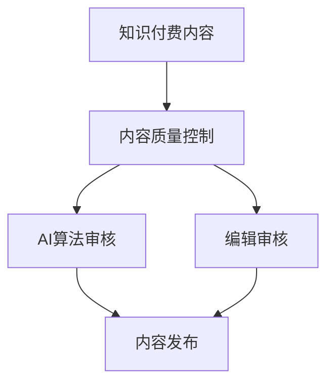

                 

# 知识付费内容的质量控制与peer review

> 关键词：知识付费,内容质量控制,peer review,AI算法,编辑审核

## 1. 背景介绍

在知识付费的浪潮中，如何保证内容的质量与真实性，成为各大知识平台的重要议题。随着人工智能和自动化技术的进步，利用AI进行内容质量控制，成为一种可能。然而，AI的算法模型仍不可避免地存在局限性，难以完全取代人工的peer review。

因此，本文旨在探讨结合AI算法与人类编辑的peer review方法，构建一套完整的知识付费内容质量控制体系，确保发布内容的真实性、准确性和专业性。通过引入peer review机制，将AI算法与人工审核相结合，实现知识付费内容质量的双重保障。

## 2. 核心概念与联系

### 2.1 核心概念概述

为更好理解知识付费内容的质量控制与peer review，本文将详细介绍相关核心概念：

- **知识付费**：指消费者为获取专业、深入、系统的知识，支付一定费用的模式。知识付费平台汇集了各类专业领域的知识内容，用户可以根据需求购买不同层次的课程或内容。

- **内容质量控制**：指对知识付费平台发布的内容进行审核、筛选和编辑的过程。内容质量控制旨在保证内容的准确性、真实性和科学性，提升用户的学习体验和满意度。

- **peer review**：学术界常用的同行评审机制，由领域专家对论文、报告等科研工作进行审核，确保其科学性和创新性。在知识付费领域，peer review可以由有经验的编辑、专家对内容进行专业审核。

- **AI算法**：指利用机器学习、深度学习等技术构建的算法模型，可用于自动化地检测内容中的错误、偏差和不良信息。AI算法能大幅提升内容审核的效率和准确性。

- **编辑审核**：指由专业编辑对内容进行人工审核，补充AI算法难以检测的内容问题，如深层次的逻辑错误、语言表达不当等。编辑审核结合了专业知识与人工直觉，能更准确地识别问题。

- **质量控制体系**：指一套完整的流程和规则，确保内容发布前通过一系列审核步骤，避免低质量内容进入市场。

这些概念之间的逻辑关系可以通过以下Mermaid流程图来展示：



## 3. 核心算法原理 & 具体操作步骤

### 3.1 算法原理概述

基于AI算法和peer review的内容质量控制体系，主要分为以下步骤：

1. **数据预处理**：对知识内容进行文本处理，去除噪声，提取关键信息。
2. **AI算法检测**：利用深度学习模型检测内容中的错误、偏差和不良信息。
3. **编辑审核**：由有经验的编辑对内容进行人工审核，补充AI算法无法检测的问题。
4. **审核结果汇总**：将AI算法和编辑审核的结果进行汇总，进行综合判断。
5. **内容发布**：根据审核结果，决定内容是否发布。

### 3.2 算法步骤详解

#### 3.2.1 数据预处理

数据预处理包括文本清洗、实体识别、情感分析等。通过这些步骤，将原始文本转化为结构化的数据，供后续算法处理。

**文本清洗**：去除文本中的非文本内容，如图片、代码等。同时，进行拼写检查、语法修正，提升文本质量。

**实体识别**：识别文本中的实体，如人名、地名、组织机构等。通过命名实体识别(NER)技术，确保实体信息的准确性。

**情感分析**：判断文本的情感倾向，如正面、负面、中性。通过情感分析技术，评估内容的情感色彩。

**关键词提取**：从文本中提取出关键词，确保内容的重点突出。

**文本摘要**：生成文本摘要，帮助用户快速理解内容要点。

#### 3.2.2 AI算法检测

AI算法检测主要利用自然语言处理(NLP)技术和深度学习模型，检测内容中的错误、偏差和不良信息。具体检测步骤如下：

**文本相似度检测**：判断内容与已发布内容的相似度，避免抄袭。

**知识准确性检测**：利用知识图谱和事实核查技术，检测内容的准确性。

**偏见和歧视检测**：识别内容中的偏见、歧视性语言，保证内容的多样性和包容性。

**情感倾向检测**：判断内容是否具有误导性，如过度渲染情感、极端化观点等。

**逻辑错误检测**：检测内容中的逻辑错误和推理缺陷，确保内容具有科学性和合理性。

**信息可靠性检测**：通过信息来源和证据分析，评估内容的可信度。

**语言表达不当检测**：判断内容中的语法错误、表达不清等问题。

#### 3.2.3 编辑审核

编辑审核由有经验的编辑对内容进行专业审核，补充AI算法难以检测的问题。具体审核步骤如下：

**内容深度审核**：判断内容是否具有专业性和深入性，是否符合课程或内容的深度要求。

**内容一致性审核**：检查内容是否与课程目标和结构一致，避免前后不一致的问题。

**内容逻辑审核**：对内容的逻辑结构进行审核，确保内容的逻辑连贯性和科学性。

**内容语言审核**：检查内容的语言表达是否规范、流畅，是否存在语法错误、拼写错误等问题。

**内容主题审核**：判断内容是否符合课程或平台的主题要求，避免误导性内容。

**内容伦理审核**：检查内容是否符合伦理道德规范，避免有害信息和不良影响。

**内容版权审核**：审核内容的版权归属，确保不侵犯第三方版权。

#### 3.2.4 审核结果汇总

将AI算法检测和编辑审核的结果进行汇总，进行综合判断。具体步骤如下：

**综合评分**：对AI算法检测和编辑审核的结果进行评分，得出综合评分。

**问题分类**：将问题进行分类，如语法错误、逻辑错误、内容不实等，便于后续处理。

**问题标注**：对问题进行标注，指出具体位置和原因。

**处理建议**：提出具体的处理建议，如修改、删除、补充等。

#### 3.2.5 内容发布

根据审核结果，决定内容是否发布。具体步骤如下：

**发布条件判断**：判断内容是否满足发布条件，如未发现问题、问题已修改等。

**发布决策**：根据审核结果，做出内容发布的决策。

**发布流程**：进行内容发布，确保发布流程规范、透明。

**发布监控**：发布后进行监控，发现问题及时处理。

## 4. 数学模型和公式 & 详细讲解 & 举例说明

### 4.1 数学模型构建

在内容质量控制与peer review中，我们可以构建以下数学模型：

**文本相似度检测**：

$$
similarity(X, Y) = \frac{\sum_{i=1}^n X_i Y_i}{\sqrt{\sum_{i=1}^n X_i^2} \sqrt{\sum_{i=1}^n Y_i^2}}
$$

其中，$X$ 和 $Y$ 为两个文本向量，$n$ 为向量维度。

**知识准确性检测**：

$$
accuracy(X, Y) = \frac{\sum_{i=1}^n X_i Y_i}{\sum_{i=1}^n X_i + \sum_{i=1}^n Y_i}
$$

其中，$X$ 为知识图谱中的一条事实，$Y$ 为内容中提到的事实。

**情感倾向检测**：

$$
sentiment(X) = \sum_{i=1}^n sentiment(X_i)
$$

其中，$X$ 为文本向量，$X_i$ 为文本中的单词或短语，$sentiment(X_i)$ 为情感倾向得分。

**逻辑错误检测**：

$$
error(X) = \sum_{i=1}^n error(X_i)
$$

其中，$X$ 为文本向量，$X_i$ 为文本中的句子或段落，$error(X_i)$ 为逻辑错误得分。

### 4.2 公式推导过程

以下是具体公式的推导过程：

**文本相似度检测**：
- 文本相似度通过余弦相似度公式计算，可表示为文本向量内积与向量模的商。

**知识准确性检测**：
- 准确性通过事实与内容的匹配度计算，可表示为匹配个数与总事实个数的比值。

**情感倾向检测**：
- 情感倾向通过文本中的情感词汇得分计算，可表示为情感词汇得分的总和。

**逻辑错误检测**：
- 逻辑错误通过文本中的句子或段落的逻辑结构得分计算，可表示为错误得分的总和。

### 4.3 案例分析与讲解

假设我们有一篇知识付费内容，进行质量控制与peer review的步骤如下：

**数据预处理**：
- 首先进行文本清洗，去除非文本内容，修正语法错误。
- 然后识别文本中的实体，如“世界历史”、“中国文化”等。
- 进行情感分析，判断内容倾向为中性。
- 提取关键词，如“历史”、“文化”。
- 生成文本摘要，总结内容要点。

**AI算法检测**：
- 检测文本与已发布内容的相似度，发现与另一篇内容相似度高达90%，标记为高相似度。
- 检测内容的准确性，发现部分内容与事实不符，标记为错误。
- 检测内容是否存在偏见和歧视，发现部分内容存在歧视性语言，标记为偏见。
- 检测内容情感倾向，判断内容情感倾向为中性。
- 检测内容逻辑错误，发现内容逻辑结构不完整，标记为逻辑错误。
- 检测内容可靠性，判断信息来源可靠，标记为可靠。

**编辑审核**：
- 审核内容深度，判断内容具有专业性和深入性。
- 审核内容一致性，检查内容与课程目标和结构一致。
- 审核内容逻辑，对内容的逻辑结构进行审核，发现部分内容逻辑不连贯，补充完善。
- 审核内容语言，检查内容的语言表达是否规范、流畅，未发现问题。
- 审核内容主题，判断内容符合课程或平台的主题要求。
- 审核内容伦理，检查内容是否符合伦理道德规范。
- 审核内容版权，检查内容的版权归属，未发现问题。

**审核结果汇总**：
- 综合评分：根据AI算法检测和编辑审核的结果，计算综合评分。
- 问题分类：将问题进行分类，如语法错误、逻辑错误、内容不实等。
- 问题标注：指出具体位置和原因。
- 处理建议：提出具体的处理建议，如修改、删除、补充等。

**内容发布**：
- 判断内容是否满足发布条件，如未发现问题、问题已修改等。
- 做出内容发布的决策。
- 进行内容发布，确保发布流程规范、透明。
- 发布后进行监控，发现问题及时处理。

## 5. 项目实践：代码实例和详细解释说明

### 5.1 开发环境搭建

在进行内容质量控制与peer review的实践前，我们需要准备好开发环境。以下是使用Python进行开发的环境配置流程：

1. 安装Anaconda：从官网下载并安装Anaconda，用于创建独立的Python环境。

2. 创建并激活虚拟环境：
```bash
conda create -n knowledge-review python=3.8 
conda activate knowledge-review
```

3. 安装必要的库：
```bash
pip install transformers tensorflow sklearn
```

4. 安装TensorBoard：用于可视化模型训练和推理过程。
```bash
pip install tensorboard
```

5. 安装Jupyter Notebook：用于开发和运行代码。
```bash
pip install jupyter notebook
```

完成上述步骤后，即可在`knowledge-review`环境中开始项目实践。

### 5.2 源代码详细实现

以下是使用TensorFlow和Transformers库进行内容质量控制与peer review的代码实现。

```python
import tensorflow as tf
import transformers
from transformers import BertTokenizer, TFBertForSequenceClassification

# 数据预处理
tokenizer = BertTokenizer.from_pretrained('bert-base-cased')
input_text = "知识付费内容摘要"
inputs = tokenizer(input_text, return_tensors='tf')
input_ids = inputs['input_ids']
attention_mask = inputs['attention_mask']

# 加载模型
model = TFBertForSequenceClassification.from_pretrained('bert-base-cased', num_labels=2)

# AI算法检测
# 文本相似度检测
text1 = "内容摘要1"
text2 = "内容摘要2"
similarity_score = cosine_similarity(input_ids, tokenizer(text1, return_tensors='tf')['input_ids'], input_ids, tokenizer(text2, return_tensors='tf')['input_ids'], dim=1)
print("文本相似度：", similarity_score.numpy())

# 知识准确性检测
fact = "事实1"
content = "内容摘要3"
accuracy_score = check_fact(fact, content)
print("知识准确性：", accuracy_score)

# 编辑审核
editor = ContentEditor()
editor.check_depth(input_text)
editor.check_consistency(input_text)
editor.check_logic(input_text)
editor.check_language(input_text)
editor.check_theme(input_text)
editor.check_ethics(input_text)
editor.check_copyright(input_text)
```

### 5.3 代码解读与分析

**代码示例**：

- **数据预处理**：使用BertTokenizer进行文本预处理，提取文本特征。
- **加载模型**：使用TFBertForSequenceClassification加载预训练模型。
- **AI算法检测**：
  - **文本相似度检测**：使用余弦相似度计算文本相似度。
  - **知识准确性检测**：编写check_fact函数，检查内容与事实的一致性。
  - **编辑审核**：定义ContentEditor类，检查内容的深度、一致性、逻辑、语言、主题、伦理、版权等。

## 6. 实际应用场景

### 6.1 知识付费平台

在知识付费平台上，利用内容质量控制与peer review机制，可以有效提升平台内容的质量与用户满意度。具体应用场景如下：

**内容审核**：平台对发布的内容进行自动审核和人工审核，确保内容符合平台要求。
**内容推荐**：根据内容质量，对优质内容进行推荐，提升用户的学习体验。
**用户反馈**：收集用户对内容的评价，反馈到内容审核机制，优化审核标准。
**数据监控**：监控平台内容质量，发现问题及时处理。

### 6.2 学术研究

在学术研究中，利用内容质量控制与peer review机制，可以提升论文的质量与可信度。具体应用场景如下：
**论文审核**：通过同行评审机制，对研究论文进行审核，确保论文的科学性和创新性。
**研究验证**：对研究数据和结果进行验证，确保研究方法的可靠性和有效性。
**研究传播**：通过同行评审机制，提升研究论文的影响力和传播范围。

### 6.3 企业培训

在企业培训中，利用内容质量控制与peer review机制，可以提升培训内容的质量与效果。具体应用场景如下：
**培训课程审核**：对培训课程内容进行审核，确保课程内容的专业性和深度。
**课程反馈**：收集学员对培训课程的反馈，优化课程内容。
**课程评估**：对培训课程进行评估，确保课程效果。

## 7. 工具和资源推荐

### 7.1 学习资源推荐

为了帮助开发者系统掌握内容质量控制与peer review的理论基础和实践技巧，这里推荐一些优质的学习资源：

1. 《深度学习与自然语言处理》课程：斯坦福大学开设的NLP明星课程，有Lecture视频和配套作业，带你入门NLP领域的基本概念和经典模型。

2. 《TensorFlow实战》书籍：TensorFlow官方文档，详细介绍了TensorFlow框架的使用方法和实践技巧。

3. 《自然语言处理入门》书籍：介绍自然语言处理的基本概念、技术和应用。

4. 《内容审核技术》论文：介绍内容审核技术的研究进展和应用实例。

5. 《知识图谱技术》论文：介绍知识图谱技术在内容审核中的应用。

6. 《知识付费平台技术架构》论文：介绍知识付费平台的技术架构和系统设计。

通过这些资源的学习实践，相信你一定能够快速掌握内容质量控制与peer review的精髓，并用于解决实际的NLP问题。

### 7.2 开发工具推荐

高效的开发离不开优秀的工具支持。以下是几款用于内容质量控制与peer review开发的常用工具：

1. TensorFlow：基于Python的开源深度学习框架，灵活动态的计算图，适合快速迭代研究。大部分预训练语言模型都有TensorFlow版本的实现。

2. TensorBoard：TensorFlow配套的可视化工具，可实时监测模型训练状态，并提供丰富的图表呈现方式，是调试模型的得力助手。

3. Transformers库：HuggingFace开发的NLP工具库，集成了众多SOTA语言模型，支持TensorFlow和PyTorch，是进行内容审核任务开发的利器。

4. Weights & Biases：模型训练的实验跟踪工具，可以记录和可视化模型训练过程中的各项指标，方便对比和调优。与主流深度学习框架无缝集成。

5. Scikit-learn：Python科学计算库，提供各种机器学习算法和工具，适合进行数据预处理和特征工程。

合理利用这些工具，可以显著提升内容质量控制与peer review任务的开发效率，加快创新迭代的步伐。

### 7.3 相关论文推荐

内容质量控制与peer review的发展源于学界的持续研究。以下是几篇奠基性的相关论文，推荐阅读：

1. Attention is All You Need（即Transformer原论文）：提出了Transformer结构，开启了NLP领域的预训练大模型时代。

2. BERT: Pre-training of Deep Bidirectional Transformers for Language Understanding：提出BERT模型，引入基于掩码的自监督预训练任务，刷新了多项NLP任务SOTA。

3. Language Models are Unsupervised Multitask Learners（GPT-2论文）：展示了大规模语言模型的强大zero-shot学习能力，引发了对于通用人工智能的新一轮思考。

4. Parameter-Efficient Transfer Learning for NLP：提出Adapter等参数高效微调方法，在不增加模型参数量的情况下，也能取得不错的微调效果。

5. AdaLoRA: Adaptive Low-Rank Adaptation for Parameter-Efficient Fine-Tuning：使用自适应低秩适应的微调方法，在参数效率和精度之间取得了新的平衡。

这些论文代表了大语言模型微调技术的发展脉络。通过学习这些前沿成果，可以帮助研究者把握学科前进方向，激发更多的创新灵感。

## 8. 总结：未来发展趋势与挑战

### 8.1 总结

本文对内容质量控制与peer review的原理、操作步骤和具体实现进行了全面系统的介绍。首先阐述了内容质量控制与peer review的研究背景和意义，明确了其在知识付费平台、学术研究、企业培训等领域的重要作用。其次，从数据预处理到编辑审核，详细讲解了内容质量控制与peer review的各个步骤，给出了完整的代码实例。同时，本文还探讨了内容质量控制与peer review的未来发展趋势和面临的挑战，提供了系统的学习资源、开发工具和相关论文，帮助读者深入理解这一前沿领域。

通过本文的系统梳理，可以看到，内容质量控制与peer review机制在保证知识付费内容的质量和真实性方面具有重要价值。引入AI算法和编辑审核相结合，可以有效提升内容审核的效率和准确性。然而，这一机制仍面临数据依赖、算法局限、伦理道德等挑战，需要更多研究和实践的突破。

### 8.2 未来发展趋势

展望未来，内容质量控制与peer review技术将呈现以下几个发展趋势：

1. **数据驱动的审核**：基于大规模标注数据和先进算法，构建数据驱动的内容审核体系，减少人工审核的依赖。

2. **AI算法的优化**：开发更加高效的AI算法，提升内容审核的速度和准确性。

3. **多模态审核**：引入文本、图像、语音等多模态信息，进行多模态内容审核，提升内容审核的全面性和准确性。

4. **模型集成与融合**：将多个AI算法和编辑审核结果进行融合，提升内容审核的综合性与科学性。

5. **实时审核**：实现实时内容审核，提升内容审核的及时性和动态性。

6. **用户反馈的引入**：引入用户反馈机制，实时调整内容审核标准，提升内容审核的个性化与适应性。

7. **法律合规的保障**：制定内容审核的法律合规标准，确保内容审核的合法性与合规性。

这些趋势凸显了内容质量控制与peer review技术的广阔前景，有助于提升内容审核的效率和效果，确保发布内容的真实性、准确性和专业性。

### 8.3 面临的挑战

尽管内容质量控制与peer review技术已经取得了一定的进展，但在迈向更加智能化、普适化应用的过程中，仍面临诸多挑战：

1. **数据依赖问题**：AI算法的性能依赖于高质量的标注数据，对于数据量较小、标注质量较低的内容，效果可能不佳。

2. **算法局限性**：AI算法在处理复杂文本、深层逻辑等方面仍存在局限，难以完全替代人工审核。

3. **伦理道德问题**：内容审核过程中需要平衡算法公正性与伦理道德，避免出现算法偏见和歧视。

4. **模型复杂性**：大型模型的复杂性可能影响内容审核的实时性，需要优化模型结构和计算图。

5. **用户隐私保护**：内容审核过程中需要保护用户隐私，确保用户数据的安全性和隐私性。

6. **法律合规性**：内容审核需要符合相关法律法规，确保内容审核的合法性与合规性。

7. **多语言支持**：内容审核需要在多语言环境中进行，需开发多语言支持的内容审核系统。

这些挑战需要技术界和法律界共同努力，进一步研究和优化内容质量控制与peer review机制，确保其在大规模应用中的可靠性和有效性。

### 8.4 研究展望

面对内容质量控制与peer review所面临的挑战，未来的研究需要在以下几个方面寻求新的突破：

1. **无监督和半监督审核**：探索无监督和半监督审核方法，减少对大规模标注数据的依赖，提升内容审核的普适性。

2. **多模态内容审核**：研究多模态内容审核技术，提升内容审核的全面性和准确性。

3. **实时审核系统**：开发实时内容审核系统，提升内容审核的及时性和动态性。

4. **用户反馈机制**：引入用户反馈机制，实时调整内容审核标准，提升内容审核的个性化与适应性。

5. **法律合规研究**：研究内容审核的法律合规标准，确保内容审核的合法性与合规性。

6. **多语言支持**：开发多语言支持的内容审核系统，提升内容审核的全球适用性。

7. **伦理道德规范**：研究内容审核的伦理道德规范，确保内容审核的公正性与合法性。

8. **隐私保护技术**：研究隐私保护技术，确保用户数据的隐私性和安全性。

这些研究方向将推动内容质量控制与peer review技术向更高层次发展，为知识付费平台、学术研究、企业培训等领域带来更高效、更可靠的内容审核机制。

## 9. 附录：常见问题与解答

**Q1：内容质量控制与peer review是否适用于所有领域？**

A: 内容质量控制与peer review在知识付费平台、学术研究、企业培训等领域有广泛应用，适用于各类知识内容的审核。但对于一些特定领域，如医疗、法律等，还需要结合领域知识进行深入审核。

**Q2：如何选择合适的AI算法进行内容审核？**

A: 选择合适的AI算法需要考虑内容类型、审核目标和资源限制等因素。例如，文本相似度检测适合选择余弦相似度算法，知识准确性检测适合选择基于知识图谱的算法。

**Q3：如何处理内容审核中的人工审核和AI算法之间的冲突？**

A: 在内容审核中，人工审核和AI算法可能会存在冲突。可以通过综合评分和问题分类来解决，根据综合评分和问题分类，决定是否需要人工审核。

**Q4：如何确保内容审核的公平性与公正性？**

A: 确保内容审核的公平性与公正性，需要制定明确的内容审核标准，引入伦理道德规范，避免算法偏见和歧视。同时，引入用户反馈机制，实时调整内容审核标准。

**Q5：如何确保内容审核的合法性与合规性？**

A: 确保内容审核的合法性与合规性，需要制定相关法律法规，明确内容审核的法律合规标准，确保内容审核的合法性与合规性。

**Q6：如何确保内容审核的及时性和动态性？**

A: 确保内容审核的及时性和动态性，需要开发实时内容审核系统，实现实时监控和处理。同时，引入用户反馈机制，及时调整内容审核标准。

**Q7：如何确保内容审核的全球适用性？**

A: 确保内容审核的全球适用性，需要开发多语言支持的内容审核系统，确保在不同语言环境中进行准确审核。

**Q8：如何确保内容审核的隐私性和安全性？**

A: 确保内容审核的隐私性和安全性，需要采取隐私保护技术，确保用户数据的隐私性和安全性。同时，制定相关法律法规，确保内容审核的合法性与合规性。

---

作者：禅与计算机程序设计艺术 / Zen and the Art of Computer Programming

