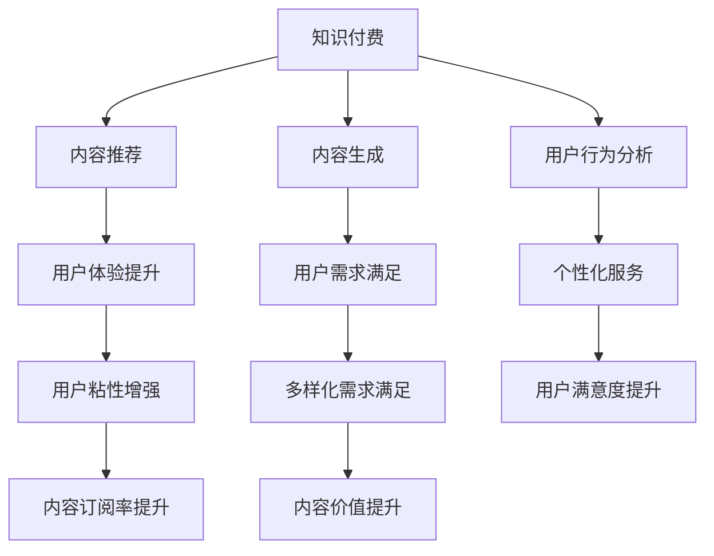

                 

# 知识付费创业中的内容价值提升

> 关键词：知识付费, 内容价值, 人工智能, 推荐系统, 内容生成, 用户行为分析

## 1. 背景介绍

### 1.1 问题由来
随着互联网和移动设备的普及，人们对于知识的渴求愈发强烈，同时时间成本也愈发宝贵。知识付费应运而生，为用户提供了快速获取高质量知识渠道。然而，知识付费市场竞争激烈，用户订阅动力不足，市场仍待拓展。

### 1.2 问题核心关键点
用户在选择知识付费内容时，最关心的是内容的价值和实用性。内容价值包括信息的准确性、时效性、深度性、实用性和可操作性。提升内容价值，才能真正吸引用户，实现知识付费的可持续发展。本文将重点介绍如何通过人工智能技术提升知识付费平台的内容价值，包括内容推荐、内容生成和用户行为分析等方面。

## 2. 核心概念与联系

### 2.1 核心概念概述

- **知识付费**：以付费形式为用户提供知识、技能、信息等服务的商业模式。
- **内容价值**：指知识付费内容对用户产生的实际价值，包括知识内容、服务体验和互动反馈等方面。
- **人工智能**：利用机器学习和数据分析技术，使机器具备人类智能能力的技术。
- **推荐系统**：根据用户行为和兴趣推荐相关内容的系统，提升用户体验和粘性。
- **内容生成**：通过自动化算法生成高质量内容，满足用户多样化需求。
- **用户行为分析**：通过分析用户行为数据，挖掘用户需求和兴趣，指导内容推荐和生成。

这些概念之间的逻辑关系可以通过以下Mermaid流程图来展示：



这个流程图展示了一体化的知识付费内容推荐、生成和用户行为分析流程，共同提升内容价值。

## 3. 核心算法原理 & 具体操作步骤
### 3.1 算法原理概述

人工智能技术可以通过以下几个方面提升知识付费内容价值：

1. **推荐系统**：利用用户历史行为数据和兴趣模型，推荐高质量内容，增加用户粘性。
2. **内容生成**：通过自然语言处理和生成模型，自动化生成个性化推荐内容。
3. **用户行为分析**：通过数据分析挖掘用户行为模式，优化推荐算法和内容生成策略。

### 3.2 算法步骤详解

#### 推荐系统算法步骤

1. **数据收集**：收集用户浏览、收藏、购买等行为数据。
2. **用户建模**：利用协同过滤、内容推荐等算法建立用户兴趣模型。
3. **内容建模**：对知识内容进行特征提取和表示。
4. **推荐计算**：根据用户模型和内容模型，计算用户对内容的评分和推荐排序。
5. **推荐展示**：将推荐结果展示给用户，反馈和调整推荐算法。

#### 内容生成算法步骤

1. **数据收集**：收集大量高质量文本和语料库。
2. **模型训练**：利用深度学习模型，如GPT-3，训练内容生成模型。
3. **内容生成**：输入关键词或话题，模型自动生成高质量内容。
4. **内容优化**：利用自然语言处理技术，优化生成内容的语法和流畅性。
5. **内容审核**：对生成的内容进行语法、逻辑和事实检查，确保内容的准确性和可信度。

#### 用户行为分析算法步骤

1. **数据收集**：收集用户行为数据，如浏览时间、收藏行为、评论等。
2. **特征提取**：对用户行为数据进行特征提取，建立用户画像。
3. **行为建模**：利用机器学习算法，建立用户行为预测模型。
4. **行为分析**：根据用户行为数据，分析用户兴趣和需求。
5. **策略调整**：根据行为分析结果，调整推荐算法和内容生成策略。

### 3.3 算法优缺点

**推荐系统**

优点：
- 根据用户行为数据，个性化推荐相关内容。
- 提高用户粘性，提升用户留存率。
- 减少用户选择成本，提升用户体验。

缺点：
- 冷启动问题：新用户行为数据不足，难以推荐高质量内容。
- 数据隐私：用户行为数据涉及隐私问题，需严格保护。
- 推荐多样性：推荐内容过于单一，难以满足多样化需求。

**内容生成**

优点：
- 自动化生成内容，满足用户多样化需求。
- 快速生成内容，降低内容生产成本。
- 利用深度学习模型，生成高质量内容。

缺点：
- 生成内容质量不一，无法完全替代人工创作。
- 内容真实性问题：生成内容可能存在虚假信息或误导性信息。
- 用户接受度：用户可能不信任自动生成内容，影响信任度。

**用户行为分析**

优点：
- 通过数据分析，了解用户行为模式和需求。
- 优化推荐算法和内容生成策略，提升内容价值。
- 提高内容匹配度，增强用户满意度。

缺点：
- 数据隐私：用户行为数据涉及隐私问题，需严格保护。
- 数据质量：用户行为数据可能存在噪音，影响分析结果。
- 分析复杂性：用户行为分析涉及多维度数据，分析复杂度较高。

### 3.4 算法应用领域

**推荐系统**：适用于知识付费平台、电商网站、视频平台等。

**内容生成**：适用于内容创作工具、智能助理、信息服务网站等。

**用户行为分析**：适用于社交媒体、电商平台、在线教育等。

## 4. 数学模型和公式 & 详细讲解 & 举例说明

### 4.1 数学模型构建

#### 推荐系统
**协同过滤模型**：
$$
\hat{y}_{ui} = \alpha ( \sum_{j=1}^{N} \frac{r_{uj} r_{ij}}{\sqrt{c_u c_j}} + \beta ( \sum_{j=1}^{N} \frac{r_{uj} i_j}{\sqrt{c_u c_j}} )
$$
其中，$r_{uj}$ 表示用户 $u$ 对商品 $j$ 的评分，$c_u$ 和 $c_j$ 分别是用户和商品的评分类平均数。

**内容推荐算法**：
$$
R_{ui} = \sum_{j=1}^{N} \frac{r_{uj} \dot{r_{ij}}}{\sqrt{c_u c_j}}
$$
其中，$r_{uj}$ 和 $r_{ij}$ 分别是用户对商品和商品对用户的评分，$c_u$ 和 $c_j$ 分别是用户和商品的评分类平均数。

#### 内容生成
**GPT-3生成模型**：
$$
p(w_t | w_{1:t-1}, \theta) = \text{softmax}(\alpha T \ln(Z^{\theta}_{w_{1:t-1}}))
$$
其中，$w_t$ 表示文本中的第 $t$ 个词，$w_{1:t-1}$ 表示前面的 $t-1$ 个词，$\theta$ 表示模型参数，$Z^{\theta}_{w_{1:t-1}}$ 表示词向量表示矩阵，$T$ 和 $\alpha$ 是可调参数。

### 4.2 公式推导过程

**协同过滤模型**：
- 计算用户 $u$ 对商品 $j$ 的预测评分
- 计算用户 $u$ 对商品 $i$ 的评分
- 计算商品 $i$ 对用户 $u$ 的预测评分

**内容推荐算法**：
- 计算用户 $u$ 对商品 $i$ 的评分

**GPT-3生成模型**：
- 计算给定上下文下，下一个词 $w_t$ 的概率分布

### 4.3 案例分析与讲解

**推荐系统案例**：
- 假设用户 $u$ 对商品 $j$ 的评分是 4，商品 $j$ 的评分平均数是 3，用户 $u$ 的评分平均数是 5。
- 假设用户 $u$ 对商品 $i$ 的评分是 3，商品 $i$ 的评分平均数是 4，用户 $u$ 的评分平均数是 5。
- 假设用户 $u$ 对商品 $i$ 的预测评分是：
$$
\hat{y}_{ui} = \alpha ( \frac{4 \times 3}{\sqrt{5 \times 3}} + \beta \frac{4}{\sqrt{5 \times 3}} )
$$

**内容生成案例**：
- 假设给定上下文是 "今天天气如何？"。
- 假设生成模型参数 $\theta$ 已经训练好。
- 假设生成的下一个词是 "晴天"。
- 假设生成的概率是 $p(\text{晴天} | \text{今天天气如何？}, \theta)$。

## 5. 项目实践：代码实例和详细解释说明

### 5.1 开发环境搭建

1. 安装Python3.8，确保pip、conda等包管理器可用。
2. 安装推荐系统相关库，如scikit-learn、pandas、numpy等。
3. 安装深度学习库，如TensorFlow、PyTorch等。
4. 安装内容生成相关库，如gensim、spaCy等。

### 5.2 源代码详细实现

#### 推荐系统实现

```python
from sklearn.neighbors import NearestNeighbors
import pandas as pd
import numpy as np

# 准备数据
df = pd.read_csv('user_ratings.csv')
user_ratings = df[['user_id', 'item_id', 'rating']].values

# 用户兴趣模型
k = 10  # 推荐数量
nbrs = NearestNeighbors(n_neighbors=k).fit(user_ratings)
dist, ind = nbrs.kneighbors(user_ratings)

# 推荐排序
ratings = pd.DataFrame(user_ratings[:, 2]).T
ratings['score'] = ratings.dot(dist) / np.linalg.norm(ratings, axis=1)
top_n = ratings.nlargest(k, 'score').index.tolist()
```

#### 内容生成实现

```python
from transformers import GPT3LMHeadModel, GPT3Tokenizer

# 准备数据
tokenizer = GPT3Tokenizer.from_pretrained('gpt3')
model = GPT3LMHeadModel.from_pretrained('gpt3')
context = '今天天气如何？'
inputs = tokenizer.encode(context + tokenizer.eos_token, return_tensors='pt')

# 生成内容
outputs = model.generate(inputs, max_length=10, num_return_sequences=1)
generated_text = tokenizer.decode(outputs[0], skip_special_tokens=True)
```

### 5.3 代码解读与分析

**推荐系统代码解读**：
- 使用scikit-learn库中的NearestNeighbors算法，构建用户兴趣模型。
- 根据用户评分和商品评分计算用户对商品的预测评分，并根据评分进行排序推荐。
- 利用pandas库对数据进行处理，生成最终的推荐列表。

**内容生成代码解读**：
- 使用Transformers库中的GPT3模型和Tokenizer，准备生成上下文。
- 使用GPT3模型的generate函数生成文本内容。
- 使用Tokenizer将生成的文本进行解码，生成最终的文本输出。

### 5.4 运行结果展示

**推荐系统结果展示**：
- 生成推荐列表，展示用户可能感兴趣的商品。

**内容生成结果展示**：
- 生成文本内容，展示AI自动生成的推荐回答。

## 6. 实际应用场景

### 6.1 在线教育

知识付费平台在在线教育中具有广泛应用。平台通过分析用户学习行为，推荐个性化学习内容，提高学习效率。同时，利用AI生成个性化习题和答案，满足不同层次学习者的需求。

### 6.2 企业培训

企业可以通过知识付费平台，提供定制化培训课程，通过数据分析和内容生成技术，优化培训内容，提升培训效果。同时，利用推荐系统，推荐相关培训资料，提高员工学习动力。

### 6.3 医疗健康

在线医疗平台通过知识付费，提供专业的健康知识，如疾病预防、健康饮食等。平台通过用户行为分析，推荐个性化健康建议，帮助用户保持健康。

### 6.4 未来应用展望

未来，知识付费平台将进一步与人工智能技术结合，提升内容价值和用户体验。例如：

- **多模态推荐**：结合视频、音频等多种形式内容，提供更加丰富和沉浸式体验。
- **智能客服**：利用自然语言处理和生成技术，提供智能客服，提升用户体验。
- **个性化生成**：通过个性化生成内容，满足用户多样化需求，提高用户满意度。
- **实时分析**：通过实时数据分析，及时调整推荐策略和内容生成策略，优化用户体验。

## 7. 工具和资源推荐

### 7.1 学习资源推荐

1. **Coursera**：提供深度学习和自然语言处理课程，涵盖推荐系统、内容生成等方面。
2. **Kaggle**：提供大量数据集和竞赛，用于实践和验证AI推荐和内容生成模型。
3. **arXiv**：提供最新AI研究成果，跟踪前沿技术动态。

### 7.2 开发工具推荐

1. **TensorFlow**：深度学习框架，支持分布式训练和推理。
2. **PyTorch**：深度学习框架，支持动态计算图。
3. **Transformers**：自然语言处理库，提供多种预训练模型和工具。

### 7.3 相关论文推荐

1. **《Recommender Systems》**：该书全面介绍了推荐系统原理和算法。
2. **《Text Generation with Transformers》**：该书详细讲解了基于Transformer的内容生成方法。
3. **《User Behavior Analysis in Recommendation Systems》**：该文探讨了用户行为分析在推荐系统中的应用。

## 8. 总结：未来发展趋势与挑战

### 8.1 总结

本文对知识付费平台的内容价值提升进行了系统介绍，重点阐述了推荐系统、内容生成和用户行为分析等核心技术。通过案例分析和代码实现，展示了这些技术的具体应用。未来，知识付费平台将在各个行业广泛应用，为用户带来更多高质量知识服务。

### 8.2 未来发展趋势

1. **多模态推荐**：结合视频、音频等多种形式内容，提供更加丰富和沉浸式体验。
2. **智能客服**：利用自然语言处理和生成技术，提供智能客服，提升用户体验。
3. **个性化生成**：通过个性化生成内容，满足用户多样化需求，提高用户满意度。
4. **实时分析**：通过实时数据分析，及时调整推荐策略和内容生成策略，优化用户体验。

### 8.3 面临的挑战

1. **推荐系统冷启动**：新用户行为数据不足，难以推荐高质量内容。
2. **内容生成质量**：生成内容质量不一，无法完全替代人工创作。
3. **用户行为隐私**：用户行为数据涉及隐私问题，需严格保护。
4. **数据质量**：用户行为数据可能存在噪音，影响分析结果。
5. **分析复杂性**：用户行为分析涉及多维度数据，分析复杂度较高。

### 8.4 研究展望

1. **跨模态推荐**：结合视频、音频等多种形式内容，提供更加丰富和沉浸式体验。
2. **多智能体推荐**：利用多智能体系统，提供更加多样化和个性化的推荐服务。
3. **混合推荐系统**：结合协同过滤、内容推荐等算法，提供更加准确和多样化的推荐服务。
4. **实时内容生成**：通过实时内容生成，满足用户多样化需求，提高用户满意度。
5. **用户行为模型**：通过深度学习模型，建立更加精确的用户行为模型，提高内容匹配度，增强用户满意度。

## 9. 附录：常见问题与解答

**Q1：如何缓解推荐系统的冷启动问题？**

A：
- 利用用户的基础信息，如年龄、性别、地域等，进行兴趣模型预训练。
- 通过标签推荐机制，让用户手动选择标签，作为推荐的基础。
- 利用内容标签，根据用户对标签的兴趣，推荐相关内容。

**Q2：如何提升内容生成的质量？**

A：
- 利用监督学习和无监督学习相结合的方法，训练更加精确的生成模型。
- 引入多模态数据，如图片、视频等，丰富生成内容的多样性。
- 利用生成对抗网络(GAN)等技术，提升生成内容的真实性和多样性。

**Q3：如何保护用户行为隐私？**

A：
- 对用户行为数据进行匿名化处理，去除敏感信息。
- 设置数据访问权限，只允许授权人员访问。
- 定期审计数据使用情况，防止数据滥用。

**Q4：如何优化用户行为分析？**

A：
- 利用更先进的数据处理和分析技术，如深度学习、增强学习等。
- 结合用户反馈，不断优化用户行为模型。
- 实时更新用户行为模型，提高分析的及时性和准确性。

---

作者：禅与计算机程序设计艺术 / Zen and the Art of Computer Programming

