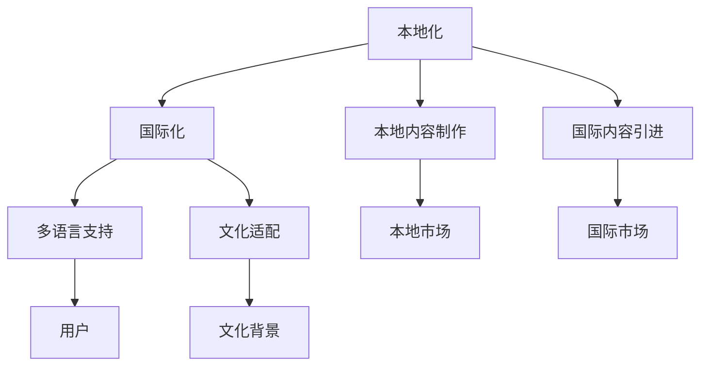

                 

# 知识付费创业中的内容本地化与国际化

## 1. 背景介绍

在数字化时代，知识付费作为一种新兴的经济形态，正在以前所未有的速度和规模发展。根据中国互联网络信息中心（CNNIC）发布的《中国互联网络发展状况统计报告》显示，截至2020年底，中国知识付费用户规模已经突破2亿。

知识付费的形式多样，包括在线课程、付费文章、专家咨询、学习社区等。知识付费的崛起不仅改变了传统教育行业的生态格局，也催生了新的创业机会。据艾媒咨询《2019中国知识付费用户洞察报告》显示，2018年中国知识付费市场规模达到289亿元，预计2023年将突破1000亿元。

知识付费的火爆背后，离不开两大核心因素的推动：一是“知识焦虑”，即在快速变化的社会中，个人需要不断学习新知识以保持竞争力；二是移动互联网的普及，使得知识传播更加便捷高效。然而，知识付费虽然炙手可热，但也面临着内容供给不足、质量参差不齐、市场竞争激烈等诸多问题。特别是在全球化的知识付费市场中，如何实现内容本地化与国际化，成为了创业公司亟需解决的难题。

## 2. 核心概念与联系

### 2.1 核心概念概述

为更好地理解内容本地化与国际化的实现，本节将介绍几个关键概念：

- 本地化(Localization)：将产品或服务翻译成目标语言，并调整相关界面、文本、功能，使其符合当地文化习惯和法律法规的过程。

- 国际化(Internationalization)：使产品或服务能够适应多种语言和文化环境，并提供相应的本地化服务。

- 知识付费平台：指提供在线课程、付费文章、专家咨询、学习社区等知识服务，并通过订阅、单次购买等方式获取收入的在线平台。

- 本地内容制作：指针对目标市场的特定需求，制作符合当地文化和价值观的知识内容。

- 国际内容引进：指通过翻译、版权合作等方式，将国际优质内容引入本地市场。

- 多语言支持：指平台支持多种语言，并提供相应的语言切换功能，方便用户在不同语言环境下使用。

- 文化适配：指在本地化过程中，不仅翻译文本，还调整界面、排版、配色等视觉元素，使其符合当地审美习惯。

这些核心概念之间的逻辑关系可以通过以下Mermaid流程图来展示：



这个流程图展示了本地化与国际化过程中涉及的关键环节：

1. 本地化包括本地内容制作和国际内容引进两个主要环节。
2. 国际化则包含多语言支持和文化适配两个关键维度。
3. 本地市场和国际市场是本地化与国际化服务的最终受益者。
4. 用户是本地化与国际化的主要目标对象。

这些概念共同构成了知识付费内容本地化与国际化的基础框架，帮助创业公司更好地理解和实施相关策略。

## 3. 核心算法原理 & 具体操作步骤

### 3.1 算法原理概述

内容本地化与国际化本质上是一个多语言信息处理过程，其核心算法包括文本翻译、文化适配、界面本地化等。下面详细介绍这些核心算法原理。

### 3.2 算法步骤详解

**步骤一：内容收集与分析**
- 收集平台上的所有文本内容，包括文章、课程描述、用户评论等。
- 分析不同语言的内容数量、用户活跃度、热门话题等，确定翻译和本地化的优先级。

**步骤二：文本翻译**
- 选择机器翻译工具或人工翻译，将目标语言文本进行翻译。
- 对于重要或特殊内容，优先采用人工翻译以提高翻译质量。

**步骤三：文化适配**
- 调整界面元素、配色、字体等视觉元素，使其符合当地文化和审美习惯。
- 根据当地语言习惯，调整文本的表达方式和长度。

**步骤四：界面本地化**
- 修改界面元素文本，如按钮标签、提示信息等。
- 调整布局和交互方式，确保界面在不同语言环境下依然易用。

**步骤五：用户测试与反馈**
- 在目标市场进行小规模用户测试，收集用户反馈。
- 根据反馈结果，不断优化翻译和文化适配。

**步骤六：推广与运营**
- 通过本地化的推广策略，吸引更多用户。
- 在本地市场开展运营活动，提升用户粘性和平台知名度。

### 3.3 算法优缺点

内容本地化与国际化的优点包括：
1. 提高用户粘性和满意度。本地化的内容更容易被当地用户接受，提升用户使用体验。
2. 拓展市场范围。通过本地化服务，可以进入新的国际市场，扩大用户群体。
3. 增加内容多样性。引入国际优质内容，提升平台内容的丰富度和多样性。
4. 提升品牌形象。本地化的服务表明平台对当地市场的重视，有利于提升品牌声誉。

缺点包括：
1. 成本高。本地化翻译和文化适配需要大量人力和时间，成本较高。
2. 翻译质量难以保证。高质量的翻译需要专业人才，翻译质量难以统一。
3. 文化差异。不同文化背景可能导致内容表达方式和用户习惯不同，难以完全适配。

尽管存在这些局限性，但整体而言，内容本地化与国际化仍是大规模知识付费平台的重要战略方向，对于提升用户满意度和拓展市场具有重要意义。

### 3.4 算法应用领域

内容本地化与国际化的应用领域非常广泛，特别是在知识付费领域，其作用尤为显著。

**1. 在线课程**
- 将热门课程翻译成多种语言，覆盖全球用户。
- 根据不同市场文化，调整课程内容和界面设计。

**2. 付费文章**
- 将优质文章翻译成多种语言，增加全球读者。
- 调整文章风格和排版，适应不同市场阅读习惯。

**3. 专家咨询**
- 将专家讲座和咨询内容翻译成多种语言。
- 调整咨询方式和语言风格，适应不同文化背景用户。

**4. 学习社区**
- 将社区讨论和用户评论翻译成多种语言。
- 根据不同市场文化，调整社区规则和活动设计。

**5. 多语言支持平台**
- 提供多语言切换功能，方便不同语言用户使用。
- 支持多种语言搜索和过滤，提升用户体验。

这些应用场景展示了内容本地化与国际化的重要性和广泛性，对于知识付费平台的全球化发展具有重要作用。

## 4. 数学模型和公式 & 详细讲解 & 举例说明

### 4.1 数学模型构建

内容本地化与国际化的数学模型主要涉及文本翻译、文化适配、界面本地化等环节。以下将分别介绍这些模型的构建方法。

**文本翻译模型**
文本翻译是内容本地化的核心环节，其数学模型如下：

设 $S$ 为源语言文本，$T$ 为目标语言文本，则翻译模型可以表示为：
$$
P(T|S) = \prod_{i=1}^n P(t_i|s_i)
$$
其中 $n$ 为文本长度，$P(t_i|s_i)$ 为第 $i$ 个单词在目标语言中的翻译概率。

**文化适配模型**
文化适配模型主要用于调整文本风格和排版，其数学模型如下：

设 $C$ 为文化适配后的文本，则文化适配模型可以表示为：
$$
P(C|S) = \prod_{i=1}^n P(c_i|s_i)
$$
其中 $c_i$ 为文化适配后的单词，$s_i$ 为源语言单词。

**界面本地化模型**
界面本地化模型主要用于调整界面元素文本和布局，其数学模型如下：

设 $U$ 为用户界面，$V$ 为用户界面元素文本，则界面本地化模型可以表示为：
$$
P(U|V) = \prod_{i=1}^n P(u_i|v_i)
$$
其中 $u_i$ 为用户界面元素，$v_i$ 为用户界面元素文本。

### 4.2 公式推导过程

**文本翻译模型推导**
翻译模型主要通过神经机器翻译(Neural Machine Translation, NMT)实现。NMT模型通常基于循环神经网络(RNN)或Transformer等架构，其目标是通过源语言文本 $S$ 生成目标语言文本 $T$。NMT模型的数学公式如下：
$$
P(T|S) = \prod_{i=1}^n P(t_i|s_i) = \prod_{i=1}^n \frac{e^{w_{i-1} \cdot h_i}}{\sum_{j=1}^n e^{w_j \cdot h_i}}
$$
其中 $h_i$ 为第 $i$ 个单词的隐藏表示，$w_j$ 为第 $j$ 个单词的权重。

**文化适配模型推导**
文化适配模型主要通过文本风格和排版调整实现。其数学模型可以表示为：
$$
P(C|S) = \prod_{i=1}^n P(c_i|s_i) = \prod_{i=1}^n \frac{e^{w_{i-1} \cdot h_i}}{\sum_{j=1}^n e^{w_j \cdot h_i}}
$$
其中 $h_i$ 为第 $i$ 个单词在目标语言中的隐藏表示，$w_j$ 为目标语言中第 $j$ 个单词的权重。

**界面本地化模型推导**
界面本地化模型主要通过界面元素文本调整和布局优化实现。其数学模型可以表示为：
$$
P(U|V) = \prod_{i=1}^n P(u_i|v_i) = \prod_{i=1}^n \frac{e^{w_{i-1} \cdot h_i}}{\sum_{j=1}^n e^{w_j \cdot h_i}}
$$
其中 $h_i$ 为用户界面元素在目标语言中的隐藏表示，$w_j$ 为目标语言中第 $j$ 个界面元素的权重。

### 4.3 案例分析与讲解

以在线课程内容本地化为例，介绍如何在全球范围内推广课程。

**步骤一：内容收集与分析**
- 收集所有在线课程的课程描述、讲义、视频等文本内容。
- 分析不同语言的课程数量和用户活跃度，确定翻译和本地化的优先级。

**步骤二：文本翻译**
- 选择机器翻译工具（如Google Translate）或人工翻译，将课程内容翻译成多种语言。
- 对于课程介绍和讲义，优先采用人工翻译以提高翻译质量。

**步骤三：文化适配**
- 调整课程界面元素，如按钮标签、菜单等，使其符合当地文化和审美习惯。
- 根据当地语言习惯，调整课程内容和讲义，使其适应当地用户。

**步骤四：界面本地化**
- 修改课程界面元素文本，如课程名称、讲义标题等。
- 调整课程界面布局，确保不同语言用户都能方便使用。

**步骤五：用户测试与反馈**
- 在目标市场进行小规模用户测试，收集用户反馈。
- 根据反馈结果，不断优化翻译和文化适配。

**步骤六：推广与运营**
- 通过本地化的推广策略，吸引更多用户。
- 在本地市场开展运营活动，提升用户粘性和平台知名度。

通过以上步骤，可以在全球范围内推广在线课程，提升用户满意度和平台知名度。

## 5. 项目实践：代码实例和详细解释说明

### 5.1 开发环境搭建

在进行内容本地化与国际化的实践前，我们需要准备好开发环境。以下是使用Python进行Flask开发的环境配置流程：

1. 安装Python：从官网下载并安装Python，用于构建Web应用。
2. 安装Flask：使用pip命令安装Flask框架，搭建Web服务器。
3. 安装Flask-RESTful：用于实现RESTful API接口，方便数据传输。
4. 安装Flask-Localization：用于实现多语言支持，方便界面本地化。
5. 安装Flask-WTF：用于实现Web表单验证，增强用户体验。

完成上述步骤后，即可在本地搭建Flask应用，并开始内容本地化与国际化的实践。

### 5.2 源代码详细实现

下面以在线课程平台为例，给出使用Flask框架实现内容本地化的代码实现。

首先，定义课程模块的视图函数：

```python
from flask import Flask, render_template, request, redirect, url_for
from flask_localization import Localization
from flask_babel import Babel, gettext

app = Flask(__name__)
babel = Babel(app)
babel.locale = 'en_US'

@babel.localeselector
def get_locale():
    return request.accept_languages.best_match(['en', 'zh-CN'])

@app.route('/')
def index():
    return render_template('index.html', messages=gettext('Welcome to our online course platform!'))

@app.route('/courses/<course_id>')
def course(course_id):
    course = courses[course_id]
    return render_template('course.html', course=course)
```

然后，定义课程内容的多语言支持：

```python
from flask_localization import Localization
from flask_babel import Babel

app = Flask(__name__)
babel = Babel(app)
babel.locale = 'en_US'

@babel.localeselector
def get_locale():
    return request.accept_languages.best_match(['en', 'zh-CN'])

# 课程列表数据
courses = {
    '1': {
        'title': 'Python Programming',
        'description': 'Learn Python from scratch',
        'author': 'John Doe',
        'language': 'English'
    },
    '2': {
        'title': 'Java Programming',
        'description': 'Learn Java from scratch',
        'author': 'Jane Smith',
        'language': 'Chinese'
    }
}

# 课程内容多语言支持
@app.route('/courses/<course_id>')
def course(course_id):
    course = courses[course_id]
    return render_template('course.html', course=course)
```

接着，定义界面元素多语言支持：

```python
from flask_localization import Localization

app = Flask(__name__)
localization = Localization(app, language='en_US')
localization.init_app(app)

# 界面元素多语言支持
@app.route('/courses/<course_id>')
def course(course_id):
    course = courses[course_id]
    return render_template('course.html', course=course)
```

最后，启动Flask应用：

```python
if __name__ == '__main__':
    app.run(debug=True)
```

通过以上代码，实现了课程内容的文本翻译和界面本地化。用户可以通过多语言切换，在不同语言环境下访问课程界面。

### 5.3 代码解读与分析

让我们再详细解读一下关键代码的实现细节：

**Flask框架**
Flask是一个轻量级的Python Web框架，易于上手和使用。通过Flask，可以快速搭建Web应用，并实现RESTful API接口和界面本地化。

**Flask-Localization**
Flask-Localization是Flask的扩展包，用于实现多语言支持。通过Flask-Localization，可以在应用程序中切换语言，并方便地处理多语言文本。

**Flask-Babel**
Flask-Babel是另一个用于多语言支持的扩展包，提供了一些额外的功能，如国际化设置、文本翻译等。与Flask-Localization配合使用，可以实现更加灵活多变的多语言支持。

通过以上工具和技术，可以在Web应用中实现内容本地化与国际化。开发者可以根据具体需求，灵活配置多语言支持，提高应用的可访问性和用户体验。

## 6. 实际应用场景

### 6.1 在线教育平台

在线教育平台是知识付费创业的核心领域之一，内容本地化与国际化对于提升用户粘性和拓展市场具有重要作用。

以Coursera平台为例，其在全球范围内提供多门在线课程，涵盖计算机科学、数据科学、人文学科等多个领域。Coursera平台通过多语言支持、文化适配等策略，吸引全球数百万用户注册和使用。

Coursera平台的本地化策略主要包括以下几个方面：
- 多语言支持：提供多语言切换功能，方便不同语言用户访问。
- 文化适配：根据不同市场文化，调整课程内容和界面设计。
- 用户测试：通过小规模用户测试，不断优化翻译和文化适配。

通过这些策略，Coursera平台实现了全球化的知识传播，为用户提供了丰富的学习资源。

### 6.2 在线新闻平台

在线新闻平台同样是知识付费创业的重要领域之一，内容本地化与国际化对于提升平台影响力和用户粘性具有重要作用。

以BBC News为例，其在全球范围内提供多门新闻内容，涵盖国际、国内、娱乐、科技等多个领域。BBC News平台通过多语言支持、文化适配等策略，吸引了全球数亿用户访问。

BBC News平台的本地化策略主要包括以下几个方面：
- 多语言支持：提供多语言切换功能，方便不同语言用户访问。
- 文化适配：根据不同市场文化，调整新闻内容和界面设计。
- 用户测试：通过小规模用户测试，不断优化翻译和文化适配。

通过这些策略，BBC News平台实现了全球化的新闻传播，为用户提供了及时、准确、多样化的新闻内容。

## 7. 工具和资源推荐

### 7.1 学习资源推荐

为帮助开发者系统掌握内容本地化与国际化的理论基础和实践技巧，这里推荐一些优质的学习资源：

1. 《Flask Web Development with Python》：由Flask官方文档编写，全面介绍了Flask框架的使用方法，包括多语言支持和界面本地化等。

2. 《Web Application Development with Flask》：由Flask官方文档编写，介绍了如何使用Flask构建Web应用，并涵盖了多语言支持、用户认证等高级功能。

3. 《Python Web Development: An Introduction to Flask》：由Flask官方文档编写，适合初学者入门，详细介绍了Flask框架的使用方法。

4. 《Flask-Pytest Web Development》：由Flask官方文档编写，介绍了如何使用Pytest进行Flask应用的单元测试。

5. 《Python Flask Web Development》：由Flask官方文档编写，适合Flask初学者，介绍了如何使用Flask构建Web应用。

通过对这些资源的学习实践，相信你一定能够快速掌握内容本地化与国际化的精髓，并用于解决实际的Web开发问题。

### 7.2 开发工具推荐

高效的开发离不开优秀的工具支持。以下是几款用于Flask开发的工具：

1. VSCode：一款流行的开源代码编辑器，支持多语言开发和Flask插件。
2. PyCharm：一款专业的IDE，支持Flask开发和调试，提供强大的代码补全和测试功能。
3. Flask-RESTful：一个用于实现RESTful API的扩展包，方便数据传输和接口管理。
4. Flask-Security：一个用于实现用户认证和权限管理的扩展包，提高应用安全性。
5. Flask-Admin：一个用于构建Web管理界面的扩展包，方便后台管理和数据查询。

合理利用这些工具，可以显著提升Flask应用开发效率，加快创新迭代的步伐。

### 7.3 相关论文推荐

内容本地化与国际化的发展源于学界的持续研究。以下是几篇奠基性的相关论文，推荐阅读：

1. "Machine Translation with Attention-based Neural Networks"：介绍基于注意力机制的神经机器翻译模型，广泛应用于文本翻译领域。

2. "The Modeling of Multilingual and Multicolor Cultural Aspects of Localization"：介绍如何从多语言和多文化角度进行内容本地化，提出文化适配的多维模型。

3. "Multilingual Content Management System"：介绍如何使用多语言管理系统进行内容管理和本地化，提高内容可访问性。

4. "Internationalization of Web Applications"：介绍如何实现Web应用的多语言支持，包括文本翻译、界面本地化等。

5. "Machine Translation for Business Applications"：介绍机器翻译在商业应用中的实现方法和应用场景，提升国际市场的竞争力。

这些论文代表了大规模内容本地化与国际化的发展脉络，通过学习这些前沿成果，可以帮助研究者把握学科前进方向，激发更多的创新灵感。

## 8. 总结：未来发展趋势与挑战

### 8.1 总结

本文对内容本地化与国际化的实现进行了全面系统的介绍。首先阐述了知识付费创业中内容本地化与国际化的背景和意义，明确了内容本地化与国际化的重要性。其次，从原理到实践，详细讲解了内容本地化与国际化的数学模型和操作步骤，给出了Flask框架实现的完整代码实例。同时，本文还广泛探讨了内容本地化与国际化的实际应用场景，展示了其广泛的应用前景。此外，本文精选了内容本地化与国际化的各类学习资源，力求为开发者提供全方位的技术指引。

通过本文的系统梳理，可以看到，内容本地化与国际化的实现不仅有助于提升知识付费平台的市场影响力和用户粘性，还能够帮助企业拓展新的市场空间，实现全球化发展。未来，随着技术的不断进步，内容本地化与国际化将成为知识付费创业的重要战略方向，为平台提供更大的发展机遇和更多的业务机会。

### 8.2 未来发展趋势

展望未来，内容本地化与国际化将呈现以下几个发展趋势：

1. 多语言支持的普及。随着多语言技术的发展，越来越多的知识付费平台将实现多语言支持，提升全球用户的可访问性。

2. 个性化翻译和适配。基于自然语言处理(NLP)技术，未来的内容本地化将能够根据用户偏好和历史行为进行个性化翻译和适配，提升用户体验。

3. 跨文化内容创作。内容创作将更加注重跨文化元素的融合，提升内容的全球可接受性和影响力。

4. 智能化内容推荐。通过大数据和机器学习技术，实现更加智能化、精准的内容推荐，提升用户粘性和满意度。

5. 内容聚合与分发。未来内容本地化将与内容聚合和分发平台结合，实现内容的高效管理和精准推送。

这些趋势凸显了内容本地化与国际化的广阔前景，对于知识付费平台的全球化发展具有重要作用。

### 8.3 面临的挑战

尽管内容本地化与国际化的技术不断进步，但在实现过程中仍面临诸多挑战：

1. 成本高。本地化翻译和文化适配需要大量人力和时间，成本较高。
2. 翻译质量难以保证。高质量的翻译需要专业人才，翻译质量难以统一。
3. 文化差异。不同文化背景可能导致内容表达方式和用户习惯不同，难以完全适配。
4. 技术门槛高。内容本地化与国际化需要多学科知识的融合，对技术团队的要求较高。

尽管存在这些局限性，但整体而言，内容本地化与国际化仍是大规模知识付费平台的重要战略方向，对于提升用户满意度和拓展市场具有重要意义。

### 8.4 研究展望

面对内容本地化与国际化的挑战，未来的研究需要在以下几个方面寻求新的突破：

1. 探索无监督和半监督翻译方法。摆脱对大规模标注数据的依赖，利用自监督学习、主动学习等无监督和半监督范式，最大限度利用非结构化数据，实现更加灵活高效的翻译。

2. 研究多模态内容本地化。结合文本、图像、视频等多模态信息，实现更加全面、多样化的内容本地化。

3. 引入专家知识进行内容审核。将专家知识与机器翻译结合，提升翻译和适配的质量和可信度。

4. 开发跨文化内容创作工具。利用跨文化分析工具，帮助内容创作者更好地理解和表达不同文化背景的用户需求。

5. 实现智能化内容推荐系统。结合推荐算法和机器学习技术，实现更加智能化、精准的内容推荐。

6. 探索内容本地化的新路径。如自然语言生成(NLG)技术，能够直接生成目标语言的内容，减少翻译成本和误差。

这些研究方向将进一步推动内容本地化与国际化的发展，为知识付费平台的全球化发展提供新的技术支撑。

## 9. 附录：常见问题与解答

**Q1：内容本地化与国际化是否适用于所有知识付费平台？**

A: 内容本地化与国际化对于大多数知识付费平台都是适用的，特别是那些希望拓展全球市场、覆盖多语言用户的企业。但对于一些特定领域的平台，如专业医学、法律等，由于领域特殊性，可能需要结合专业知识进行定制化适配。

**Q2：如何进行内容本地化与国际化的成本控制？**

A: 成本控制是内容本地化与国际化的一个重要挑战。为降低成本，可以采用以下策略：
1. 优先考虑机器翻译。对于文本内容，优先采用机器翻译，减少人工翻译成本。
2. 引入开源工具。利用开源的翻译工具和库，如OpenNMT、Google Translate等，减少开发成本。
3. 逐步迭代优化。从小规模项目开始，逐步迭代优化，减少一次性投入。
4. 自动化工具。利用自动化工具，如Jupyter Notebook、Anaconda等，加速翻译和适配过程。

**Q3：内容本地化与国际化在实施过程中需要注意哪些问题？**

A: 在实施内容本地化与国际化的过程中，需要注意以下问题：
1. 文化差异。不同文化背景下，内容表达方式和用户习惯不同，需要进行适应性调整。
2. 用户体验。本地化翻译和文化适配不能影响用户体验，确保界面友好和易用。
3. 数据隐私。在收集和处理用户数据时，需要遵守本地法律法规，确保数据隐私和安全。
4. 可扩展性。本地化工具和流程需要具备良好的可扩展性，能够应对未来的规模增长和需求变化。
5. 技术支持。需要建立强大的技术支持团队，及时解决本地化过程中出现的问题。

**Q4：内容本地化与国际化在知识付费平台中的应用场景有哪些？**

A: 内容本地化与国际化的应用场景非常广泛，包括：
1. 在线课程：将课程内容翻译成多种语言，根据不同市场文化调整课程内容。
2. 付费文章：将优质文章翻译成多种语言，提升全球读者访问量。
3. 专家咨询：将专家讲座和咨询内容翻译成多种语言，提升平台影响力。
4. 学习社区：将社区讨论和用户评论翻译成多种语言，提升全球用户粘性。
5. 多语言支持：提供多语言切换功能，方便不同语言用户使用。

**Q5：如何评估内容本地化与国际化的效果？**

A: 评估内容本地化与国际化的效果可以从以下几个方面进行：
1. 用户反馈。通过用户调查、评论等方式，收集用户反馈，评估本地化与国际化的效果。
2. 转化率。通过分析不同语言用户的转化率，评估本地化与国际化的效果。
3. 活跃度。通过分析不同语言用户的活跃度，评估本地化与国际化的效果。
4. 满意度。通过用户满意度调查，评估本地化与国际化的效果。
5. 市场扩展。通过分析不同语言市场的发展情况，评估本地化与国际化的效果。

通过以上方法，可以全面评估内容本地化与国际化的效果，为后续优化提供依据。

---

作者：禅与计算机程序设计艺术 / Zen and the Art of Computer Programming

