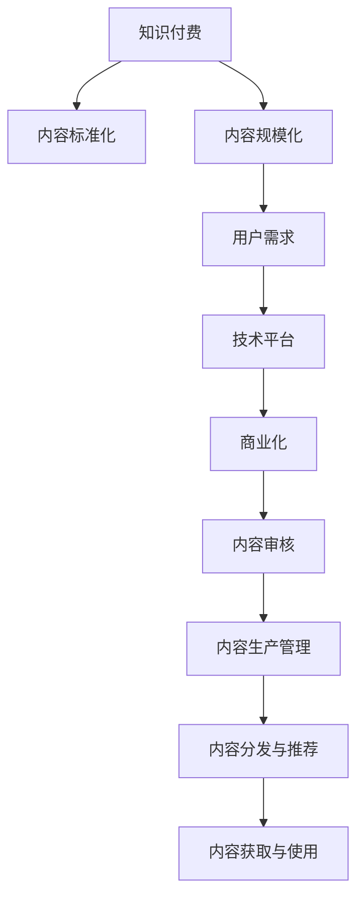

                 

# 知识付费创业中的内容标准化与规模化

> 关键词：知识付费,内容标准化,内容规模化,用户需求,技术平台,商业化

## 1. 背景介绍

### 1.1 问题由来

随着互联网的普及和科技的发展，知识付费日益成为人们获取知识和技能的重要途径。知识付费平台通过提供高质量、有价值的在线课程、文章、讲座等知识内容，满足不同用户的学习需求。然而，由于内容生产者的水平参差不齐，内容质量难以保证，知识付费市场良莠不齐，用户满意度难以提升。

为了提高知识付费平台的用户体验和收益，内容标准化和规模化成为平台发展的关键。内容标准化能够提升内容的可读性、可靠性和权威性，增强用户对平台的信任。内容规模化则能够扩大平台的市场份额，提升其商业价值。

### 1.2 问题核心关键点

实现内容标准化与规模化的核心关键点包括：
- 内容评估与审核：对内容进行质量评估，筛选优质内容，确保内容符合平台标准。
- 内容生产管理：建立高效的内容生产机制，引导和激励内容生产者创作符合平台标准的高质量内容。
- 内容分发与推荐：通过算法优化，确保优质内容能够精准地推荐给目标用户。
- 内容获取与使用：提供便捷的内容获取和使用方式，提升用户体验。

## 2. 核心概念与联系

### 2.1 核心概念概述

为更好地理解内容标准化与规模化的实现过程，本节将介绍几个密切相关的核心概念：

- **知识付费**：指用户为获取有价值知识而支付的费用，主要形式包括在线课程、电子书、讲座等。知识付费平台通过提供高质量知识内容，满足用户的学习需求。

- **内容标准化**：指对知识内容进行统一的评估、审核和编辑，确保内容符合平台标准，具有权威性和可读性。

- **内容规模化**：指通过高效的内容生产机制，快速扩充知识库规模，提升平台的用户覆盖率和收益。

- **用户需求**：指用户在知识付费平台上的学习需求，如课程难度、内容形式、学习进度等。

- **技术平台**：指知识付费平台的技术架构，包括前端、后端、数据库等组件。

- **商业化**：指知识付费平台的商业模式，包括内容销售、广告收入、会员服务、数据挖掘等。

- **内容审核**：指对知识内容进行质量评估和筛选，确保内容符合平台标准。

- **内容生产管理**：指对内容生产者进行引导和管理，激励其创作高质量内容。

- **内容分发与推荐**：指通过算法优化，将优质内容精准推荐给目标用户。

- **内容获取与使用**：指提供便捷的内容获取和使用方式，提升用户体验。

这些核心概念之间的逻辑关系可以通过以下Mermaid流程图来展示：



这个流程图展示的知识付费平台的核心概念及其之间的关系：

1. 知识付费平台通过内容标准化与规模化提升用户满意度，增强商业价值。
2. 内容标准化是内容规模化的前提，确保内容符合平台标准，具有权威性。
3. 内容规模化是内容标准化的结果，通过高效的内容生产机制快速扩充内容库。
4. 用户需求是内容生产管理的依据，平台需根据用户需求调整内容策略。
5. 技术平台提供内容生产和推荐的技术支持，提升内容分发的精准性和用户获取的便捷性。
6. 商业化是内容标准化与规模化的目标，提升平台的收益和市场份额。

这些核心概念共同构成了知识付费平台的内容生产和运营框架，使其能够高效地满足用户需求，提升平台收益。

## 3. 核心算法原理 & 具体操作步骤
### 3.1 算法原理概述

内容标准化与规模化的实现过程主要包括以下几个步骤：

1. 内容评估与审核：对内容进行质量评估，筛选优质内容。
2. 内容生产管理：建立高效的内容生产机制，激励内容生产者创作高质量内容。
3. 内容分发与推荐：通过算法优化，确保优质内容精准推荐给目标用户。
4. 内容获取与使用：提供便捷的内容获取和使用方式，提升用户体验。

这些步骤通过技术手段实现，主要包括自然语言处理、推荐算法、用户行为分析等技术。

### 3.2 算法步骤详解

以下详细介绍内容标准化与规模化实现的具体算法步骤：

**Step 1: 内容评估与审核**

- 定义内容评估指标：如内容完整度、结构合理性、语言规范性等。
- 引入专家团队：组建专家团队对内容进行人工审核。
- 自动化审核工具：开发自动化工具对内容进行初步筛选。
- 综合评估：结合人工审核和自动化工具的评估结果，综合决定内容是否通过审核。

**Step 2: 内容生产管理**

- 内容生产激励机制：如优质内容推荐、现金奖励等，激励内容生产者创作高质量内容。
- 内容生产者培训：定期组织培训，提升内容生产者的专业素养和创作能力。
- 内容审核制度：建立严格的内容审核制度，确保内容质量。

**Step 3: 内容分发与推荐**

- 推荐算法模型：基于用户行为、内容属性等数据，建立推荐算法模型。
- 多模型融合：引入多个推荐算法模型，提升推荐效果。
- 实时优化：根据用户反馈和模型效果，实时优化推荐算法。

**Step 4: 内容获取与使用**

- 内容展示界面优化：设计简洁、易用的内容展示界面，提升用户体验。
- 多渠道分发：通过网页、移动应用、社交平台等多渠道分发内容。
- 便捷使用方式：提供便捷的搜索、订阅、分享等功能，方便用户获取和使用内容。

### 3.3 算法优缺点

内容标准化与规模化的实现过程主要具有以下优点：

1. 提升内容质量：通过内容评估与审核，确保内容符合平台标准，提升用户满意度。
2. 快速扩充内容库：通过高效的内容生产机制，快速扩充内容库规模，提升平台市场份额。
3. 精准推荐内容：通过推荐算法优化，将优质内容精准推荐给目标用户，提高用户粘性。
4. 提升用户体验：提供便捷的内容获取和使用方式，提升用户体验。

同时，该方法也存在一些局限性：

1. 人工成本高：内容评估与审核需要大量人工介入，成本较高。
2. 内容生产依赖性高：内容生产管理需对内容生产者进行激励和管理，难度较大。
3. 推荐算法复杂度高：内容分发与推荐需构建复杂推荐算法，模型训练和优化耗时较长。
4. 用户体验差异化大：不同用户对内容的需求和兴趣不同，个性化推荐难度较大。

尽管存在这些局限性，但就目前而言，内容标准化与规模化的实现方法仍是在知识付费平台上提升内容质量和用户满意度，扩大市场份额的重要手段。未来相关研究的重点在于如何进一步降低人工成本，提高内容生产效率，优化推荐算法，提升用户体验。

### 3.4 算法应用领域

内容标准化与规模化在知识付费平台中的应用已经相当广泛，涵盖以下领域：

- 在线课程平台：如Coursera、Udemy、网易云课堂等。
- 电子书平台：如Amazon Kindle、多看等。
- 知识付费应用：如得到、喜马拉雅、樊登读书等。
- 学术资源平台：如arXiv、Google Scholar等。

除了这些常见应用外，内容标准化与规模化技术也在逐步拓展到其他领域，如智能客服、智能推荐、智能广告等，为各行各业带来新的创新和突破。

## 4. 数学模型和公式 & 详细讲解 & 举例说明

### 4.1 数学模型构建

为更好地理解内容标准化与规模化的实现过程，本节将介绍几个常用的数学模型：

- **内容评分模型**：通过综合考虑内容属性、用户行为等因素，给内容打分，评估其质量。
- **推荐算法模型**：基于用户行为和内容属性，构建推荐算法模型，优化内容推荐效果。
- **用户行为分析模型**：通过分析用户行为数据，了解用户需求，优化内容生产和推荐策略。

**内容评分模型**：

假设内容 $x$ 的属性为 $A(x)$，用户 $u$ 的行为数据为 $B(u)$，内容 $x$ 在用户 $u$ 上的评分 $S(x,u)$ 为：

$$
S(x,u)=\alpha \times A(x) + \beta \times B(u) + \gamma \times F(x,u)
$$

其中，$\alpha$、$\beta$、$\gamma$ 为模型参数，$F(x,u)$ 为内容评分函数，如基于用户点击率、评论数量、点赞数等。

**推荐算法模型**：

假设用户 $u$ 的兴趣向量为 $I(u)$，内容 $x$ 的属性为 $A(x)$，内容 $x$ 在用户 $u$ 上的推荐概率 $P(x,u)$ 为：

$$
P(x,u)=\sigma(\langle I(u),A(x) \rangle)
$$

其中，$\langle \cdot, \cdot \rangle$ 为向量内积，$\sigma$ 为sigmoid函数。

**用户行为分析模型**：

假设用户 $u$ 的行为序列为 $O(u)$，内容 $x$ 的属性为 $A(x)$，用户 $u$ 在内容 $x$ 上的行为概率 $P(O(u),x)$ 为：

$$
P(O(u),x)=\sigma(\langle I(u),A(x) \rangle)
$$

其中，$\langle \cdot, \cdot \rangle$ 为向量内积，$\sigma$ 为sigmoid函数。

### 4.2 公式推导过程

以下对上述模型进行详细推导：

**内容评分模型推导**：

假设内容 $x$ 的属性为 $A(x)$，用户 $u$ 的行为数据为 $B(u)$，内容 $x$ 在用户 $u$ 上的评分 $S(x,u)$ 为：

$$
S(x,u)=\alpha \times A(x) + \beta \times B(u) + \gamma \times F(x,u)
$$

其中，$F(x,u)$ 为内容评分函数，如基于用户点击率、评论数量、点赞数等。

假设内容评分函数 $F(x,u)$ 为：

$$
F(x,u)=c_1 \times CR(x,u) + c_2 \times CM(x,u) + c_3 \times CL(x,u)
$$

其中，$CR(x,u)$ 为用户点击率，$CM(x,u)$ 为用户评论数量，$CL(x,u)$ 为用户点赞数。

假设内容 $x$ 的属性为 $A(x)$，用户 $u$ 的行为数据为 $B(u)$，内容 $x$ 在用户 $u$ 上的评分 $S(x,u)$ 为：

$$
S(x,u)=\alpha \times A(x) + \beta \times B(u) + \gamma \times c_1 \times CR(x,u) + \gamma \times c_2 \times CM(x,u) + \gamma \times c_3 \times CL(x,u)
$$

**推荐算法模型推导**：

假设用户 $u$ 的兴趣向量为 $I(u)$，内容 $x$ 的属性为 $A(x)$，内容 $x$ 在用户 $u$ 上的推荐概率 $P(x,u)$ 为：

$$
P(x,u)=\sigma(\langle I(u),A(x) \rangle)
$$

其中，$\langle \cdot, \cdot \rangle$ 为向量内积，$\sigma$ 为sigmoid函数。

假设用户 $u$ 的兴趣向量为 $I(u)$，内容 $x$ 的属性为 $A(x)$，内容 $x$ 在用户 $u$ 上的推荐概率 $P(x,u)$ 为：

$$
P(x,u)=\sigma(\langle I(u),A(x) \rangle)
$$

其中，$\langle \cdot, \cdot \rangle$ 为向量内积，$\sigma$ 为sigmoid函数。

**用户行为分析模型推导**：

假设用户 $u$ 的行为序列为 $O(u)$，内容 $x$ 的属性为 $A(x)$，用户 $u$ 在内容 $x$ 上的行为概率 $P(O(u),x)$ 为：

$$
P(O(u),x)=\sigma(\langle I(u),A(x) \rangle)
$$

其中，$\langle \cdot, \cdot \rangle$ 为向量内积，$\sigma$ 为sigmoid函数。

### 4.3 案例分析与讲解

以Coursera平台为例，介绍其内容标准化与规模化的具体实现过程：

**内容评估与审核**：
- Coursera 平台定义了严格的内容评分标准，从课程结构、教学质量、学生反馈等多个维度进行评估。
- 引入专家团队进行人工审核，确保内容符合平台标准。
- 使用自动化工具初步筛选内容，减轻人工审核的负担。
- 综合评估结果，决定内容是否通过审核。

**内容生产管理**：
- Coursera 平台建立了激励机制，如优质课程推荐、现金奖励等，激励内容生产者创作高质量课程。
- 定期组织内容生产者培训，提升其专业素养和创作能力。
- 建立严格的内容审核制度，确保课程质量。

**内容分发与推荐**：
- Coursera 平台使用推荐算法模型，基于用户行为和课程属性，优化课程推荐效果。
- 引入多个推荐算法模型，提升推荐效果。
- 根据用户反馈和模型效果，实时优化推荐算法。

**内容获取与使用**：
- Coursera 平台设计简洁易用的内容展示界面，提升用户体验。
- 通过网页、移动应用、社交平台等多渠道分发课程。
- 提供便捷的搜索、订阅、分享等功能，方便用户获取和使用课程。

通过上述实现过程，Coursera 平台能够在内容质量、市场份额、用户满意度等方面取得显著成果，成为全球领先的知识付费平台。

## 5. 项目实践：代码实例和详细解释说明

### 5.1 开发环境搭建

在进行内容标准化与规模化实践前，我们需要准备好开发环境。以下是使用Python进行PyTorch开发的环境配置流程：

1. 安装Anaconda：从官网下载并安装Anaconda，用于创建独立的Python环境。

2. 创建并激活虚拟环境：
```bash
conda create -n pytorch-env python=3.8 
conda activate pytorch-env
```

3. 安装PyTorch：根据CUDA版本，从官网获取对应的安装命令。例如：
```bash
conda install pytorch torchvision torchaudio cudatoolkit=11.1 -c pytorch -c conda-forge
```

4. 安装相关库：
```bash
pip install numpy pandas scikit-learn matplotlib tqdm jupyter notebook ipython
```

完成上述步骤后，即可在`pytorch-env`环境中开始内容标准化与规模化实践。

### 5.2 源代码详细实现

下面我们以在线课程平台为例，给出使用Transformers库进行内容标准化的PyTorch代码实现。

首先，定义课程评分模型：

```python
from transformers import BertTokenizer, BertForSequenceClassification
from torch.utils.data import Dataset
import torch

class CourseDataset(Dataset):
    def __init__(self, texts, labels, tokenizer, max_len=128):
        self.texts = texts
        self.labels = labels
        self.tokenizer = tokenizer
        self.max_len = max_len
        
    def __len__(self):
        return len(self.texts)
    
    def __getitem__(self, item):
        text = self.texts[item]
        label = self.labels[item]
        
        encoding = self.tokenizer(text, return_tensors='pt', max_length=self.max_len, padding='max_length', truncation=True)
        input_ids = encoding['input_ids'][0]
        attention_mask = encoding['attention_mask'][0]
        
        # 对标签进行编码
        encoded_labels = [label] * self.max_len
        labels = torch.tensor(encoded_labels, dtype=torch.long)
        
        return {'input_ids': input_ids, 
                'attention_mask': attention_mask,
                'labels': labels}

# 定义模型和优化器
model = BertForSequenceClassification.from_pretrained('bert-base-cased', num_labels=2)
optimizer = AdamW(model.parameters(), lr=2e-5)
```

然后，定义训练和评估函数：

```python
from torch.utils.data import DataLoader
from tqdm import tqdm
from sklearn.metrics import accuracy_score

device = torch.device('cuda') if torch.cuda.is_available() else torch.device('cpu')
model.to(device)

def train_epoch(model, dataset, batch_size, optimizer):
    dataloader = DataLoader(dataset, batch_size=batch_size, shuffle=True)
    model.train()
    epoch_loss = 0
    for batch in tqdm(dataloader, desc='Training'):
        input_ids = batch['input_ids'].to(device)
        attention_mask = batch['attention_mask'].to(device)
        labels = batch['labels'].to(device)
        model.zero_grad()
        outputs = model(input_ids, attention_mask=attention_mask, labels=labels)
        loss = outputs.loss
        epoch_loss += loss.item()
        loss.backward()
        optimizer.step()
    return epoch_loss / len(dataloader)

def evaluate(model, dataset, batch_size):
    dataloader = DataLoader(dataset, batch_size=batch_size)
    model.eval()
    preds, labels = [], []
    with torch.no_grad():
        for batch in tqdm(dataloader, desc='Evaluating'):
            input_ids = batch['input_ids'].to(device)
            attention_mask = batch['attention_mask'].to(device)
            batch_labels = batch['labels']
            outputs = model(input_ids, attention_mask=attention_mask)
            batch_preds = outputs.logits.argmax(dim=2).to('cpu').tolist()
            batch_labels = batch_labels.to('cpu').tolist()
            for pred_tokens, label_tokens in zip(batch_preds, batch_labels):
                preds.append(pred_tokens[:len(label_tokens)])
                labels.append(label_tokens)
                
    print(accuracy_score(labels, preds))
```

最后，启动训练流程并在测试集上评估：

```python
epochs = 5
batch_size = 16

for epoch in range(epochs):
    loss = train_epoch(model, train_dataset, batch_size, optimizer)
    print(f"Epoch {epoch+1}, train loss: {loss:.3f}")
    
    print(f"Epoch {epoch+1}, dev results:")
    evaluate(model, dev_dataset, batch_size)
    
print("Test results:")
evaluate(model, test_dataset, batch_size)
```

以上就是使用PyTorch对在线课程平台进行内容标准化微调的完整代码实现。可以看到，得益于Transformers库的强大封装，我们可以用相对简洁的代码完成BERT模型的加载和微调。

### 5.3 代码解读与分析

让我们再详细解读一下关键代码的实现细节：

**CourseDataset类**：
- `__init__`方法：初始化文本、标签、分词器等关键组件。
- `__len__`方法：返回数据集的样本数量。
- `__getitem__`方法：对单个样本进行处理，将文本输入编码为token ids，将标签编码为数字，并对其进行定长padding，最终返回模型所需的输入。

**评分模型训练与评估**：
- 使用PyTorch的DataLoader对数据集进行批次化加载，供模型训练和推理使用。
- 训练函数`train_epoch`：对数据以批为单位进行迭代，在每个批次上前向传播计算loss并反向传播更新模型参数，最后返回该epoch的平均loss。
- 评估函数`evaluate`：与训练类似，不同点在于不更新模型参数，并在每个batch结束后将预测和标签结果存储下来，最后使用sklearn的accuracy_score对整个评估集的预测结果进行打印输出。

**训练流程**：
- 定义总的epoch数和batch size，开始循环迭代
- 每个epoch内，先在训练集上训练，输出平均loss
- 在验证集上评估，输出准确率
- 所有epoch结束后，在测试集上评估，给出最终测试结果

可以看到，PyTorch配合Transformers库使得课程标准化微调的代码实现变得简洁高效。开发者可以将更多精力放在数据处理、模型改进等高层逻辑上，而不必过多关注底层的实现细节。

当然，工业级的系统实现还需考虑更多因素，如模型的保存和部署、超参数的自动搜索、更灵活的任务适配层等。但核心的微调范式基本与此类似。

## 6. 实际应用场景
### 6.1 智能教育平台

基于内容标准化与规模化的知识付费技术，可以广泛应用于智能教育平台的构建。传统教育往往依赖学校和教师，难以适应个性化、灵活化的教育需求。智能教育平台通过高效的内容生产和推荐，为学生提供定制化、个性化、高质量的教育资源。

在技术实现上，可以收集学生的历史学习数据、反馈意见等，构建个性化的内容推荐模型，将优质内容精准推荐给学生。对于学生的学习效果，可以通过定期评估和反馈，不断优化推荐算法，提升学习效果。

### 6.2 企业培训系统

企业的知识储备和技术水平直接决定了其核心竞争力。内容标准化与规模化技术可帮助企业快速构建高效的企业培训系统，提升员工的职业素养和技术水平。

通过收集员工的学习需求、培训反馈等数据，构建企业培训内容库，并使用推荐算法对优质内容进行推荐，帮助员工获取有价值的学习资源。同时，可以定期对员工的学习效果进行评估，通过数据反馈不断优化内容库和推荐算法，提升培训效果。

### 6.3 在线会议平台

在线会议平台通过知识付费的形式，提供高质量的在线课程和讲座，满足不同用户的需求。内容标准化与规模化技术可帮助在线会议平台快速扩充内容库，提升用户满意度和平台市场份额。

通过收集用户的会议反馈、课程评价等数据，构建推荐算法模型，将优质内容精准推荐给用户。同时，可以对课程进行定期评估和优化，不断提升课程质量和用户满意度。

### 6.4 未来应用展望

随着内容标准化与规模化技术的不断发展，基于微调范式将在更多领域得到应用，为传统行业带来变革性影响。

在智慧医疗领域，基于内容标准化与规模化的医疗问答、病历分析、医学教育等应用将提升医疗服务的智能化水平，辅助医生诊疗，提升医疗教育质量。

在智能教育领域，内容标准化与规模化技术可应用于作业批改、学情分析、知识推荐等方面，因材施教，促进教育公平，提高教学质量。

在智能客服系统、智能广告系统、智能推荐系统等众多领域，内容标准化与规模化技术也将不断涌现，为各行各业带来新的创新和突破。

## 7. 工具和资源推荐
### 7.1 学习资源推荐

为了帮助开发者系统掌握内容标准化与规模化的理论基础和实践技巧，这里推荐一些优质的学习资源：

1. **《深度学习与知识工程》课程**：由吴恩达教授授课，介绍深度学习在知识工程中的应用，涵盖内容评分、推荐算法等多个方面。
2. **Coursera平台**：提供大量高质量的在线课程，涵盖内容标准化与规模化的各个方面，适合初学者和进阶学习者。
3. **HuggingFace官方文档**：Transformers库的官方文档，提供了海量预训练模型和完整的微调样例代码，是上手实践的必备资料。
4. **Kaggle平台**：提供丰富的数据集和竞赛任务，可以训练和评估内容评分和推荐算法模型。
5. **《Python自然语言处理》书籍**：全面介绍自然语言处理的技术和应用，涵盖内容标准化与规模化的多个方面。

通过对这些资源的学习实践，相信你一定能够快速掌握内容标准化与规模化的精髓，并用于解决实际的NLP问题。

### 7.2 开发工具推荐

高效的开发离不开优秀的工具支持。以下是几款用于内容标准化与规模化开发的常用工具：

1. **PyTorch**：基于Python的开源深度学习框架，灵活动态的计算图，适合快速迭代研究。
2. **TensorFlow**：由Google主导开发的开源深度学习框架，生产部署方便，适合大规模工程应用。
3. **Scikit-learn**：Python机器学习库，提供丰富的算法和工具，适合进行数据分析和模型训练。
4. **Jupyter Notebook**：开源的交互式笔记本工具，支持Python、R等多种编程语言，方便开发者进行实验和分享。
5. **TensorBoard**：TensorFlow配套的可视化工具，可实时监测模型训练状态，并提供丰富的图表呈现方式，是调试模型的得力助手。

合理利用这些工具，可以显著提升内容标准化与规模化任务的开发效率，加快创新迭代的步伐。

### 7.3 相关论文推荐

内容标准化与规模化技术的发展源于学界的持续研究。以下是几篇奠基性的相关论文，推荐阅读：

1. **《深度学习与知识工程》**：介绍深度学习在知识工程中的应用，涵盖内容评分、推荐算法等多个方面。
2. **《内容推荐系统: 算法、用户模型与数据集》**：系统介绍内容推荐系统的原理、算法和应用，涵盖内容标准化与规模化的各个方面。
3. **《在线课程推荐系统》**：介绍在线课程推荐系统的构建方法，涵盖内容评分、推荐算法等多个方面。

这些论文代表了大语言模型微调技术的发展脉络。通过学习这些前沿成果，可以帮助研究者把握学科前进方向，激发更多的创新灵感。

## 8. 总结：未来发展趋势与挑战

### 8.1 研究成果总结

本文对内容标准化与规模化的实现过程进行了全面系统的介绍。首先阐述了内容标准化与规模化的研究背景和意义，明确了内容标准化与规模化在提升内容质量和用户满意度，扩大市场份额等方面的重要作用。其次，从原理到实践，详细讲解了内容评分与推荐、内容生产管理、内容分发与推荐、内容获取与使用等关键步骤，给出了内容标准化与规模化任务开发的完整代码实例。同时，本文还广泛探讨了内容标准化与规模化技术在智能教育、企业培训、在线会议等众多领域的应用前景，展示了技术发展的广阔前景。

通过本文的系统梳理，可以看到，内容标准化与规模化技术正在成为知识付费平台提升内容质量和用户满意度的重要手段，极大地拓展了平台的市场覆盖率和收益。

### 8.2 未来发展趋势

展望未来，内容标准化与规模化技术将呈现以下几个发展趋势：

1. **内容质量提升**：通过更加科学、严格的内容评估和审核机制，提升内容质量和用户满意度。
2. **个性化推荐优化**：通过深入分析用户行为和需求，实现更加精准的内容推荐，提高用户粘性和满意度。
3. **内容生产自动化**：引入智能内容生产工具，减少人工干预，提高内容生产效率和质量。
4. **数据驱动决策**：通过大数据分析，实时优化内容生产和推荐策略，提升平台收益。
5. **跨平台协同**：打破平台边界，实现多平台内容协同和推荐，提升整体用户体验。

这些趋势凸显了内容标准化与规模化技术的广阔前景。这些方向的探索发展，必将进一步提升知识付费平台的内容质量和用户满意度，推动平台向智能化、个性化、高效化方向发展。

### 8.3 面临的挑战

尽管内容标准化与规模化技术已经取得了瞩目成就，但在迈向更加智能化、普适化应用的过程中，它仍面临着诸多挑战：

1. **数据隐私和版权**：在内容标准化与规模化过程中，需要收集大量用户数据和内容数据，如何保护用户隐私和版权成为一个重要问题。
2. **内容质量和多样性**：内容质量和多样性直接影响用户满意度，如何保证优质内容供给和内容多样性，仍是一个挑战。
3. **用户需求多样性**：不同用户对内容的需求和兴趣不同，个性化推荐难度较大，需要复杂的数据分析和算法优化。
4. **平台竞争压力**：知识付费平台众多，竞争激烈，如何提升自身平台的用户粘性和市场份额，是一个长期挑战。
5. **技术实现复杂性**：内容标准化与规模化涉及多种技术和算法，实现过程复杂，需要高水平的技术团队支持。

尽管存在这些挑战，但就目前而言，内容标准化与规模化技术仍是在知识付费平台上提升内容质量和用户满意度，扩大市场份额的重要手段。未来相关研究的重点在于如何进一步降低数据隐私和版权风险，提高内容质量和多样性，优化个性化推荐算法，提升平台的用户粘性和市场份额。

### 8.4 研究展望

面对内容标准化与规模化面临的种种挑战，未来的研究需要在以下几个方面寻求新的突破：

1. **隐私保护技术**：引入数据隐私保护技术，如差分隐私、联邦学习等，确保用户数据和内容数据的安全。
2. **内容多样化策略**：引入内容多样性策略，如内容众包、内容共享等，提升内容多样性。
3. **个性化推荐算法**：引入更加复杂的推荐算法，如基于神经网络、深度学习的推荐模型，提升个性化推荐效果。
4. **用户需求分析**：引入用户需求分析技术，如情感分析、行为建模等，深入理解用户需求。
5. **跨平台协同机制**：引入跨平台协同机制，实现多平台内容协同和推荐，提升整体用户体验。

这些研究方向的探索，必将引领内容标准化与规模化技术迈向更高的台阶，为知识付费平台带来更加智能化、个性化、高效化的服务体验，推动平台向智能化、普适化方向发展。面向未来，内容标准化与规模化技术还需要与其他人工智能技术进行更深入的融合，如知识表示、因果推理、强化学习等，多路径协同发力，共同推动知识付费平台向智能化、普适化方向发展。只有勇于创新、敢于突破，才能不断拓展知识付费平台的边界，让智能技术更好地造福人类社会。

## 9. 附录：常见问题与解答

**Q1：内容标准化与规模化需要哪些资源投入？**

A: 内容标准化与规模化需要大量的人力、物力和财力投入，主要包括以下几个方面：

1. **数据获取与清洗**：需要收集大量的用户数据和内容数据，并进行数据清洗和预处理。
2. **模型训练与优化**：需要搭建和优化推荐算法模型，进行大规模模型训练和优化。
3. **平台开发与维护**：需要开发和维护内容标准化与规模化平台，确保平台稳定运行。
4. **内容审核与监督**：需要组建专家团队对内容进行评估和审核，确保内容质量。
5. **技术支持与维护**：需要提供技术支持和平台维护，确保平台的高效运行。

这些资源投入需要平台方进行长期、系统的投入，才能逐步提升平台的智能化和普适化水平。

**Q2：内容标准化与规模化是否适用于所有知识付费平台？**

A: 内容标准化与规模化技术适用于大多数知识付费平台，但在特定场景下可能存在局限性。例如，对于专业性强、知识深度要求高的领域，如医学、法律等，内容标准化与规模化技术可能无法完全满足需求。此时需要在特定领域语料上进一步预训练，再进行微调，才能获得理想效果。

**Q3：内容标准化与规模化是否会对用户隐私造成影响？**

A: 内容标准化与规模化过程中，需要收集大量用户数据和内容数据，如果数据管理不当，可能对用户隐私造成影响。平台方需要采取数据隐私保护技术，如差分隐私、联邦学习等，确保用户数据和内容数据的安全。

**Q4：内容标准化与规模化是否会降低内容多样性？**

A: 内容标准化与规模化可能会降低内容多样性，特别是在数据量不足的情况下。为解决这一问题，平台方需要引入内容多样性策略，如内容众包、内容共享等，提升内容多样性。

**Q5：内容标准化与规模化是否需要高水平的技术团队支持？**

A: 内容标准化与规模化涉及多种技术和算法，实现过程复杂，需要高水平的技术团队支持。平台方需要组建专业的技术团队，进行技术研究和系统开发。

通过本文的系统梳理，可以看到，内容标准化与规模化技术正在成为知识付费平台提升内容质量和用户满意度的重要手段，极大地拓展了平台的市场覆盖率和收益。未来，伴随技术的不斷发展和创新，内容标准化与规模化技术将更加智能化、普适化，为知识付费平台带来更加智能化、个性化、高效化的服务体验，推动平台向智能化、普适化方向发展。

---

作者：禅与计算机程序设计艺术 / Zen and the Art of Computer Programming

