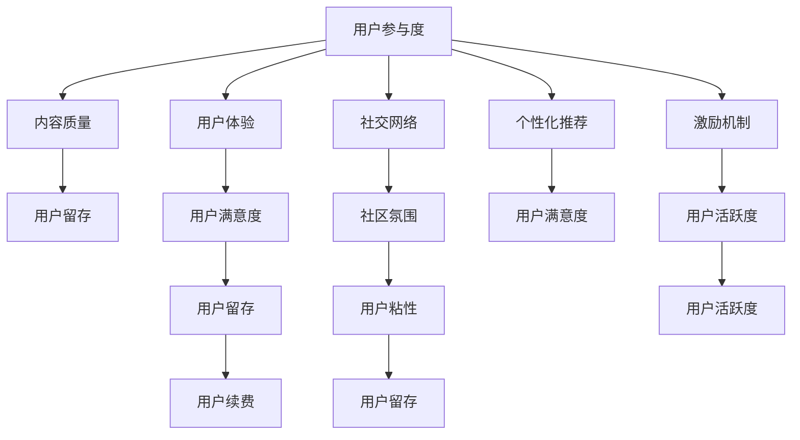

                 

# 知识付费创业中的用户参与度提升策略

> 关键词：知识付费, 用户参与度, 策略, 数据分析, 用户体验, 增长黑客, 社交网络, 内容个性化

## 1. 背景介绍

### 1.1 问题由来
知识付费行业近年来迅速崛起，用户规模不断扩大。然而，随着市场竞争的加剧，用户获取的难度和成本增加，参与度逐渐下降。如何提升用户参与度，成为知识付费创业的关键问题。本文将从用户行为分析、策略制定、数据应用等多个角度，详细阐述如何通过科学的策略提升知识付费平台的用户参与度，帮助平台实现健康稳定发展。

### 1.2 问题核心关键点
提升用户参与度涉及多个关键点，包括内容质量、用户体验、社交互动、数据驱动的个性化推荐、用户激励体系等。本文将重点关注用户参与度的数据驱动方法，并通过实例展示具体策略的实施效果。

### 1.3 问题研究意义
通过科学的策略提升用户参与度，可以显著提高知识付费平台的活跃度和粘性，降低流失率，促进用户续费和口碑传播。具体而言，用户参与度的提升：
- 增加平台收入。更多用户的付费订阅能够带来更大的收入，提高平台的财务稳定性和可持续性。
- 提升内容传播。高质量的内容和良好的用户体验能够吸引更多用户关注和分享，扩大内容影响力。
- 加强用户粘性。通过个性化推荐和社交互动，提升用户体验，增强用户对平台的忠诚度。
- 强化用户转化。通过精心设计的激励机制，促进潜在用户转化为付费用户，提升转化率。

## 2. 核心概念与联系

### 2.1 核心概念概述

为更好地理解知识付费用户参与度提升策略，本节将介绍几个密切相关的核心概念：

- 用户参与度：指用户与平台互动的频率和深度，包括内容消费、社交互动、付费行为等。
- 内容质量：指平台内容的专业性、丰富性和时效性，是影响用户参与度的关键因素。
- 用户体验：指用户在使用平台时的流畅度、便捷性和满意度，直接决定用户留存率。
- 社交网络：指平台内的用户互动关系和社区氛围，可以增强用户粘性和参与度。
- 个性化推荐：指根据用户行为数据，动态调整内容推荐算法，提升用户满意度。
- 激励机制：指通过各类奖励和特权，激励用户积极参与平台活动，提升用户活跃度。

这些核心概念之间的逻辑关系可以通过以下Mermaid流程图来展示：



这个流程图展示了个体概念之间的内在联系和影响路径：

1. 用户参与度受内容质量、用户体验、社交网络、个性化推荐和激励机制的综合影响。
2. 高内容质量、优质体验、活跃社交、个性化推荐和激励机制能够有效提升用户留存、满意度、粘性和活跃度。
3. 用户留存、满意度、粘性和活跃度，最终推动用户续费和口碑传播。

## 3. 核心算法原理 & 具体操作步骤
### 3.1 算法原理概述

用户参与度的提升，本质上是一个数据驱动的优化问题。通过收集和分析用户行为数据，识别影响参与度的关键因素，再制定针对性的优化策略，逐步提升用户参与度。

### 3.2 算法步骤详解

以下是以用户参与度提升为目标，详细介绍具体算法步骤和方法：

**Step 1: 数据收集与预处理**
- 收集平台上的各类用户行为数据，如浏览时长、观看次数、评论次数、订阅状态等。
- 进行数据清洗和去重，去除异常值和噪声数据，确保数据质量。
- 将数据划分训练集、验证集和测试集，用于模型训练和评估。

**Step 2: 特征工程与模型选择**
- 构建用户特征向量，包括历史行为、兴趣偏好、社交网络关系等。
- 选择合适的机器学习模型，如协同过滤、逻辑回归、梯度提升等，以预测用户参与度。
- 设计合适的损失函数和评价指标，如均方误差、准确率、召回率等。

**Step 3: 模型训练与参数调优**
- 在训练集上训练模型，使用交叉验证等方法评估模型性能，避免过拟合。
- 根据验证集上的表现，调整模型参数和超参数，优化模型预测效果。
- 在测试集上评估模型最终性能，确保模型的泛化能力和可靠性。

**Step 4: 策略制定与实施**
- 根据模型预测结果，制定用户参与度提升的策略。
- 实施具体策略，如内容推荐、活动激励、社交互动等，提升用户参与度。
- 定期监控用户行为数据，评估策略效果，及时调整优化策略。

**Step 5: 持续优化与迭代**
- 持续收集用户行为数据，定期更新模型和策略，保持策略的适应性和有效性。
- 引入用户反馈机制，通过用户调研、问卷等方式，收集用户意见，优化策略。
- 借鉴最新研究和实践经验，不断创新和改进策略，推动用户参与度持续提升。

### 3.3 算法优缺点

提升用户参与度的算法方法具有以下优点：
1. 数据驱动。通过分析大量用户行为数据，制定科学的策略，有针对性地提升用户参与度。
2. 精准预测。使用机器学习模型，可以准确预测用户参与度，避免误判和资源浪费。
3. 动态优化。根据用户行为数据的变化，及时调整策略，保持策略的有效性。
4. 可解释性。算法模型的预测过程透明，便于分析优化原因，增强策略的可信度。

同时，该方法也存在一定的局限性：
1. 数据依赖。策略的有效性高度依赖于数据的质量和代表性，数据收集和处理成本较高。
2. 模型复杂。使用复杂机器学习模型，需要较高的技术门槛和计算资源。
3. 用户隐私。处理用户数据时，需要严格遵守隐私保护法规，避免数据泄露风险。
4. 策略变化。用户行为和偏好会随时间变化，需要不断调整优化策略，保持适应的灵活性。

尽管存在这些局限性，但就目前而言，数据驱动的用户参与度提升方法仍是大语言模型应用的最主流范式。未来相关研究的重点在于如何进一步降低数据依赖，提高模型的适应性，同时兼顾可解释性和隐私保护等因素。

### 3.4 算法应用领域

提升用户参与度的算法方法在知识付费平台应用广泛，具体包括：

- 内容推荐系统：通过分析用户行为，推荐用户感兴趣的内容，提升内容消费频率。
- 活动激励机制：设计各种奖励和特权，激励用户积极参与平台活动，提升用户活跃度。
- 社交互动策略：促进平台内的用户交流和讨论，增加用户粘性。
- 个性化推荐优化：通过用户行为数据分析，动态调整推荐算法，提升推荐效果。
- 用户流失预警：通过模型预测，提前识别潜在流失用户，及时采取挽留措施。

除了上述这些核心应用外，平台还可以通过个性化广告投放、内容策划、用户分层管理等方式，进一步提升用户参与度。通过数据驱动和策略迭代，可以显著提升知识付费平台的整体运营水平和用户满意度。

## 4. 数学模型和公式 & 详细讲解 & 举例说明
### 4.1 数学模型构建

本节将使用数学语言对用户参与度提升的算法过程进行更加严格的刻画。

设平台用户数为 $U$，历史行为数为 $B$，兴趣偏好数为 $I$，社交网络关系数为 $S$。则用户参与度 $P$ 可以表示为：

$$
P = f(B, I, S)
$$

其中，$f$ 为具体的模型函数。假设模型为线性回归模型，则有：

$$
\hat{P} = \alpha_1 B + \alpha_2 I + \alpha_3 S
$$

其中 $\alpha_1, \alpha_2, \alpha_3$ 为模型的系数，需要通过训练集数据进行学习。

### 4.2 公式推导过程

以内容推荐为例，我们推导用户参与度预测公式。

假设内容 $C$ 为用户感兴趣的概率，则用户参与度 $P_C$ 可以表示为：

$$
P_C = \sum_i p_i P(\text{观看}_i | C)
$$

其中，$p_i$ 为用户观看内容 $i$ 的概率，$P(\text{观看}_i | C)$ 为观看内容 $i$ 的预测概率。

根据协同过滤方法，预测概率可以表示为：

$$
P(\text{观看}_i | C) = \frac{\text{相似度}_i \times \text{内容质量}_i}{\sum_j \text{相似度}_j \times \text{内容质量}_j}
$$

其中，相似度可以通过余弦相似度、皮尔逊相关系数等方法计算，内容质量可以通过内容评分、用户评分等指标表示。

### 4.3 案例分析与讲解

以下以一个具体的案例，展示如何使用数据驱动的策略提升用户参与度。

假设某知识付费平台收集到大量用户行为数据，包括：
- 用户观看时长 $B$（小时）
- 用户观看次数 $V$（次）
- 用户评论数量 $C$（条）
- 用户订阅状态 $S$（是否订阅）
- 用户兴趣偏好 $I$（兴趣标签）

使用这些数据，构建用户参与度预测模型：

$$
\hat{P} = \alpha_1 B + \alpha_2 V + \alpha_3 C + \alpha_4 S + \alpha_5 I
$$

其中，$\alpha_1, \alpha_2, \alpha_3, \alpha_4, \alpha_5$ 需要通过训练集数据学习获得。

在模型训练完成后，对新用户进行参与度预测，通过分析预测结果，制定针对性的内容推荐和激励策略。例如，对于预测参与度较高的用户，推荐更多高质量内容，并通过优惠券、会员特权等激励其订阅，提升平台收入和用户粘性。

## 5. 项目实践：代码实例和详细解释说明
### 5.1 开发环境搭建

在进行用户参与度提升实践前，我们需要准备好开发环境。以下是使用Python进行数据科学开发的典型环境配置流程：

1. 安装Anaconda：从官网下载并安装Anaconda，用于创建独立的Python环境。

2. 创建并激活虚拟环境：
```bash
conda create -n data-env python=3.8 
conda activate data-env
```

3. 安装相关库：
```bash
pip install pandas numpy scikit-learn xgboost seaborn matplotlib
```

4. 安装Jupyter Notebook：
```bash
pip install jupyter notebook
```

完成上述步骤后，即可在`data-env`环境中开始数据科学实践。

### 5.2 源代码详细实现

下面我们以用户参与度提升为例，给出使用Python进行数据科学实践的完整代码实现。

```python
import pandas as pd
import numpy as np
from sklearn.model_selection import train_test_split
from sklearn.linear_model import LinearRegression
from sklearn.metrics import mean_squared_error
from sklearn.preprocessing import StandardScaler

# 加载数据
data = pd.read_csv('user_behavior_data.csv')

# 数据预处理
features = ['watch_time', 'watch_count', 'comments', 'subscribed', 'interests']
target = 'participation'
X = data[features]
y = data[target]

# 特征工程
scaler = StandardScaler()
X = scaler.fit_transform(X)

# 划分训练集和测试集
X_train, X_test, y_train, y_test = train_test_split(X, y, test_size=0.2, random_state=42)

# 模型训练
model = LinearRegression()
model.fit(X_train, y_train)

# 模型评估
y_pred = model.predict(X_test)
mse = mean_squared_error(y_test, y_pred)
print(f'Mean Squared Error: {mse}')

# 预测新用户参与度
new_user = np.array([24, 100, 20, 1, [1, 2, 3]])  # 新用户数据
new_user_scaled = scaler.transform(new_user.reshape(1, -1))
pred_participation = model.predict(new_user_scaled)
print(f'Predicted Participation: {pred_participation[0]}')
```

以上代码实现了使用线性回归模型预测用户参与度的基本流程。通过读取用户行为数据，进行特征工程和模型训练，最终对新用户进行参与度预测。

### 5.3 代码解读与分析

让我们再详细解读一下关键代码的实现细节：

- 数据加载：使用`pandas`库的`read_csv`方法，读取用户行为数据集。
- 数据预处理：选择相关特征，并进行标准化处理，以提升模型训练效果。
- 模型训练：使用`sklearn`库的`LinearRegression`模型，对特征和目标变量进行训练。
- 模型评估：使用均方误差指标，评估模型在测试集上的预测性能。
- 预测新用户：对新用户数据进行标准化处理，再使用模型进行参与度预测。

通过以上代码，可以清晰看到从数据加载到模型预测的全过程，以及每个步骤的实现细节。开发者可以基于此代码基础，进一步优化和扩展，满足实际项目需求。

## 6. 实际应用场景

### 6.1 内容推荐系统

知识付费平台的核心功能之一是内容推荐，通过数据驱动的用户参与度提升策略，可以显著提升内容推荐效果，增加用户观看时长和订阅率。

具体而言，可以收集用户历史行为数据，使用协同过滤、深度学习等方法，构建推荐模型。通过预测用户参与度，动态调整推荐算法，优先推荐用户感兴趣的内容，增加平台内容的消费量和用户粘性。

### 6.2 活动激励机制

平台可以通过活动激励机制，增强用户参与度。例如，针对首次订阅的用户，提供免费的试用期、优惠券或独家内容。通过用户行为数据分析，识别高潜在价值用户，进行精准营销，提升转化率。

### 6.3 社交互动策略

知识付费平台鼓励用户互动交流，通过社交网络增强用户粘性。可以在平台内引入社交功能，如点赞、评论、分享等，增加用户之间的互动频率。通过用户行为数据分析，识别活跃用户，提供更多特权和奖励，增强其平台粘性。

### 6.4 未来应用展望

随着数据驱动技术的发展，未来的知识付费平台将更加智能和高效。具体而言，未来的发展趋势包括：

1. 智能化推荐：利用深度学习、强化学习等技术，实现更加精准和个性化的内容推荐。
2. 动态激励：通过用户行为数据实时分析，动态调整激励机制，保持用户长期参与。
3. 社交网络分析：引入社交网络分析方法，提升用户之间的互动质量，增强社区氛围。
4. 实时监控：利用大数据和AI技术，实时监控用户行为，及时发现和解决用户问题。
5. 个性化定制：通过机器学习算法，为不同用户定制个性化内容和活动，提升用户体验。

## 7. 工具和资源推荐
### 7.1 学习资源推荐

为了帮助开发者系统掌握数据驱动的用户参与度提升策略，这里推荐一些优质的学习资源：

1. 《Python数据分析》系列书籍：全面介绍了数据处理、特征工程、机器学习等核心技能，适合从入门到进阶的学习者。
2. Kaggle机器学习竞赛平台：提供大量数据集和比赛题目，通过实践提高数据处理和模型优化能力。
3. Coursera《数据科学导论》课程：由斯坦福大学开设的入门级数据科学课程，涵盖数据处理、统计分析、机器学习等内容。
4. Udacity《机器学习工程师》纳米学位课程：通过实战项目，深入理解数据驱动技术在实际应用中的应用。
5. 数据科学社区Kaggle、CSDN等：提供丰富的学习资源和交流平台，适合深度学习爱好者进行学习和交流。

通过对这些资源的学习实践，相信你一定能够快速掌握数据驱动的用户参与度提升策略，并用于解决实际的NLP问题。

### 7.2 开发工具推荐

高效的开发离不开优秀的工具支持。以下是几款用于数据科学开发常用的工具：

1. Jupyter Notebook：免费的开源Jupyter客户端，支持丰富的数据科学库，适合进行数据处理和模型训练。
2. Google Colab：谷歌提供的免费Jupyter Notebook环境，支持GPU/TPU算力，适合进行大数据和深度学习实验。
3. PyTorch：基于Python的开源深度学习框架，支持动态计算图和GPU加速，适合进行机器学习和深度学习实验。
4. TensorFlow：由Google主导开发的开源深度学习框架，支持分布式训练和模型部署，适合进行大规模深度学习实验。
5. Kaggle Kernels：基于Jupyter Notebook的云服务，支持共享和协作，适合进行数据科学实验和竞赛。

合理利用这些工具，可以显著提升数据科学开发效率，加速模型迭代和优化进程。

### 7.3 相关论文推荐

数据驱动的用户参与度提升策略发展迅速，以下是几篇奠基性的相关论文，推荐阅读：

1. "推荐系统：由协同过滤到深度学习"：论文详细介绍了推荐系统的经典算法和最新进展，包括协同过滤和深度学习范式。
2. "用户行为分析：基于模型的预测与优化"：提出用户行为预测模型，并通过实验验证其有效性。
3. "数据驱动的个性化推荐"：通过深度学习模型，实现个性化推荐，并分析模型在实际应用中的效果。
4. "知识付费平台的社交网络分析"：研究知识付费平台内的社交网络结构，提出增强用户互动的策略。
5. "动态激励机制的设计与实施"：通过实验分析，提出动态激励机制，提升用户参与度。

这些论文代表了大语言模型微调技术的发展脉络。通过学习这些前沿成果，可以帮助研究者把握学科前进方向，激发更多的创新灵感。

## 8. 总结：未来发展趋势与挑战
### 8.1 总结

本文对数据驱动的用户参与度提升策略进行了全面系统的介绍。首先阐述了用户参与度提升的重要性，明确了数据驱动方法的核心思想和实施流程。其次，通过具体的算法步骤和案例分析，详细讲解了如何通过数据驱动技术，制定科学的用户参与度提升策略。最后，本文还展望了知识付费平台未来的发展趋势，并指出了面临的挑战。

通过本文的系统梳理，可以看到，数据驱动的用户参与度提升策略正在成为知识付费平台的重要范式，极大地提升了平台的用户粘性和活跃度。未来，伴随数据科学和人工智能技术的发展，知识付费平台将迎来更智能、更高效的用户体验，为用户创造更多价值。

### 8.2 未来发展趋势

展望未来，数据驱动的用户参与度提升策略将呈现以下几个发展趋势：

1. 智能化推荐：利用深度学习、强化学习等技术，实现更加精准和个性化的内容推荐。
2. 动态激励：通过用户行为数据实时分析，动态调整激励机制，保持用户长期参与。
3. 社交网络分析：引入社交网络分析方法，提升用户之间的互动质量，增强社区氛围。
4. 实时监控：利用大数据和AI技术，实时监控用户行为，及时发现和解决用户问题。
5. 个性化定制：通过机器学习算法，为不同用户定制个性化内容和活动，提升用户体验。

以上趋势凸显了数据驱动技术在知识付费平台的重要价值，为平台带来更智能、高效的用户体验。未来，数据驱动的用户参与度提升策略将进一步推动知识付费平台的创新和进步。

### 8.3 面临的挑战

尽管数据驱动的用户参与度提升策略已经取得了显著效果，但在迈向更加智能化、普适化应用的过程中，它仍面临诸多挑战：

1. 数据依赖：策略的有效性高度依赖于数据的质量和代表性，数据收集和处理成本较高。如何降低数据依赖，提高数据采集效率，是关键问题。
2. 模型复杂：使用复杂机器学习模型，需要较高的技术门槛和计算资源。如何简化模型，提高模型训练和推理效率，是重要研究方向。
3. 用户隐私：处理用户数据时，需要严格遵守隐私保护法规，避免数据泄露风险。如何在保障隐私的前提下，提升策略效果，是核心难点。
4. 策略变化：用户行为和偏好会随时间变化，需要不断调整优化策略，保持适应的灵活性。如何实时更新策略，保持策略的有效性，是重要研究方向。

尽管存在这些挑战，但通过科学的方法论和技术手段，可以逐步克服这些难题，推动数据驱动的用户参与度提升策略走向成熟。相信随着数据科学和人工智能技术的不断发展，知识付费平台将迎来更智能、高效的用户体验，为用户创造更多价值。

### 8.4 研究展望

面向未来，数据驱动的用户参与度提升策略需要在以下几个方面寻求新的突破：

1. 探索无监督和半监督方法：摆脱对大规模标注数据的依赖，利用自监督学习、主动学习等无监督和半监督范式，最大限度利用非结构化数据，实现更加灵活高效的微调。
2. 研究参数高效和计算高效方法：开发更加参数高效的微调方法，在固定大部分预训练参数的同时，只更新极少量的任务相关参数。同时优化微调模型的计算图，减少前向传播和反向传播的资源消耗，实现更加轻量级、实时性的部署。
3. 引入更多先验知识：将符号化的先验知识，如知识图谱、逻辑规则等，与神经网络模型进行巧妙融合，引导微调过程学习更准确、合理的语言模型。同时加强不同模态数据的整合，实现视觉、语音等多模态信息与文本信息的协同建模。
4. 结合因果分析和博弈论工具：将因果分析方法引入微调模型，识别出模型决策的关键特征，增强输出解释的因果性和逻辑性。借助博弈论工具刻画人机交互过程，主动探索并规避模型的脆弱点，提高系统稳定性。
5. 纳入伦理道德约束：在模型训练目标中引入伦理导向的评估指标，过滤和惩罚有偏见、有害的输出倾向。同时加强人工干预和审核，建立模型行为的监管机制，确保输出符合人类价值观和伦理道德。

这些研究方向的探索，必将引领数据驱动的用户参与度提升策略迈向更高的台阶，为构建安全、可靠、可解释、可控的智能系统铺平道路。面向未来，数据驱动的用户参与度提升策略还需要与其他人工智能技术进行更深入的融合，如知识表示、因果推理、强化学习等，多路径协同发力，共同推动知识付费平台的创新和进步。

