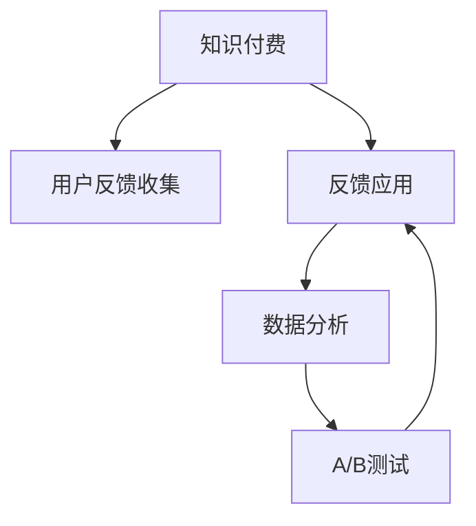

                 

## 1. 背景介绍

### 1.1 问题由来
随着互联网的快速发展和数字经济的崛起，知识付费市场成为各大平台竞相布局的新风口。根据艾瑞咨询的报告，2020年我国知识付费市场规模已达N亿元，预计到2023年将达到M亿元。面对庞大的市场规模和潜在的商业价值，越来越多的创业者投身于知识付费的创业行列中，旨在为用户提供更加专业、便捷、高质量的付费内容和服务。

然而，知识付费创业的竞争激烈，用户需求复杂多变，优质的用户体验是决定平台成败的关键。传统的客户服务模式已无法满足用户的多元需求，如何更高效地收集和利用用户反馈，成为创业者们亟待解决的问题。

### 1.2 问题核心关键点
用户反馈收集与应用是大知识付费创业成功的核心要素。有效的用户反馈不仅能够帮助创业者精准把握用户需求，优化产品功能和服务流程，还能够提升用户满意度和忠诚度，驱动平台良性发展。

如何构建用户反馈收集体系，设计科学的反馈应用机制，已经成为知识付费创业的关键挑战之一。本文将深入探讨知识付费中用户反馈收集与应用的关键原理和实践方法，为创业者提供系统性的参考。

### 1.3 问题研究意义
研究用户反馈收集与应用，对大知识付费创业具有重要意义：

1. **产品优化**：通过用户反馈了解用户痛点和需求，持续改进产品和服务，提升用户体验。
2. **市场定位**：精准把握用户需求，针对不同用户群体提供个性化服务，提升平台竞争力。
3. **运营决策**：利用用户反馈数据，优化平台运营策略，提高资源利用效率。
4. **风险防控**：及时响应用户投诉和建议，减少负面评价，降低用户流失率。
5. **数据驱动**：建立数据驱动的用户行为分析体系，驱动平台业务持续创新。

## 2. 核心概念与联系

### 2.1 核心概念概述

为更好地理解知识付费平台中的用户反馈收集与应用，本节将介绍几个核心概念：

- **知识付费**：以付费方式获取内容和服务的新兴产业模式。常见的形式包括在线课程、电子书、音频、视频等。
- **用户反馈**：用户在使用产品或服务后，对产品功能、服务质量、用户体验等方面提出的意见和建议。
- **反馈应用**：通过科学有效的机制，将用户反馈转化为产品优化和服务的改进措施，提高用户满意度和忠诚度。
- **数据分析**：利用统计学和机器学习等方法，对用户反馈数据进行建模和分析，辅助决策。
- **A/B测试**：通过随机分组对比测试不同的产品功能或服务策略，以科学的方式评估其效果。

这些概念之间的关系可以通过以下Mermaid流程图来展示：



这个流程图展示了大知识付费中用户反馈收集与应用的核心概念及其之间的关系：

1. 知识付费平台通过向用户提供付费内容和服务，收集用户反馈。
2. 利用用户反馈进行数据分析，以科学的方式进行产品优化和策略调整。
3. A/B测试帮助评估不同策略的效果，进一步指导产品改进。
4. 优化后的产品与服务被应用到实际运营中，提升用户满意度和忠诚度。

## 3. 核心算法原理 & 具体操作步骤
### 3.1 算法原理概述

用户反馈收集与应用的核心算法原理基于数据驱动和用户行为分析。其核心思想是：通过分析用户在使用产品和服务时的行为数据，挖掘用户需求，提炼用户意见，利用数据分析工具进行科学决策，将反馈应用到产品优化和服务改进中，最终提升用户体验。

在知识付费平台中，用户反馈主要来源于以下几个渠道：

- **付费课程评价**：用户在课程结束后对课程内容和讲师表现的评分和评论。
- **学习进度跟踪**：用户在学习过程中对课程内容的反馈和建议。
- **平台使用体验**：用户在使用平台时的感受和建议。
- **客服互动**：用户通过客服渠道提出的问题和建议。

形式化地，假设平台有N个用户，每个用户都给出了k条反馈。设反馈内容为 $F = \{f_1, f_2, ..., f_k\}$，其中 $f_i$ 为第i条反馈，包含文本、评分等形式的信息。定义用户反馈的聚合函数 $\mathcal{S}$ 来计算反馈内容的重要性或相关性，即：

$$
\mathcal{S}(F) = \sum_{i=1}^{k} w_i s_i
$$

其中 $w_i$ 为第i条反馈的权重，$s_i$ 为反馈内容的具体评分或情感分析结果。

根据用户反馈的聚合函数，可以构建反馈集 $G = \{g_1, g_2, ..., g_n\}$，其中每个 $g_i$ 表示一个用户的反馈集合。通过分析 $G$ 中的数据，识别出用户关注的热点和问题，进行有针对性的产品优化。

### 3.2 算法步骤详解

基于用户反馈收集与应用的核心算法原理，知识付费平台可以按照以下步骤进行操作：

**Step 1: 构建用户反馈收集体系**
- 定义反馈渠道：包括课程评价、学习进度反馈、平台使用体验、客服互动等。
- 设计反馈表单：根据不同反馈渠道设计相应的表单，收集用户意见和建议。
- 确定反馈处理流程：明确反馈的收集、分类、筛选、处理和回复等环节。

**Step 2: 设计反馈应用机制**
- 数据清洗：对收集到的反馈数据进行清洗，去除无效或垃圾数据。
- 情感分析：使用情感分析算法对反馈内容进行情感倾向判断，分类整理反馈信息。
- 主题建模：利用主题建模技术，发现用户反馈中的共同主题和热点问题。
- 数据可视化：通过数据可视化工具展示用户反馈的统计信息，帮助决策者理解用户需求。

**Step 3: 开展数据分析和优化**
- 用户画像分析：利用机器学习算法对用户反馈数据进行建模，形成用户画像，识别不同用户群体的需求差异。
- 行为分析：通过分析用户学习行为数据，找出用户流失的原因和改进点。
- 优化策略制定：根据用户画像和行为分析结果，制定有针对性的产品优化策略。
- 产品迭代：根据优化策略，进行产品功能的迭代升级，优化用户体验。

**Step 4: 测试与反馈循环**
- A/B测试：通过设计A/B测试方案，对比不同产品策略的效果，以科学的方式评估优化效果。
- 用户反馈收集：继续收集用户对优化策略的反馈，形成持续的优化迭代循环。

### 3.3 算法优缺点

用户反馈收集与应用算法具有以下优点：
1. 科学高效：通过数据驱动的方式，能够快速准确地发现用户需求，提升产品优化效率。
2. 可解释性强：利用机器学习算法建模用户行为，可以提供更直观的解释和分析结果。
3. 用户参与度高：通过多种反馈渠道和应用机制，鼓励用户积极参与，提升用户满意度。

同时，该算法也存在以下局限性：
1. 数据质量依赖高：依赖于用户的主动反馈和质量，部分用户可能不愿参与或提供无效反馈。
2. 模型复杂度高：需要较高的数据量和计算资源，模型的训练和维护成本较高。
3. 隐私风险：在收集和分析用户反馈时，需要注意保护用户隐私，防止数据泄露。
4. 时效性差：数据采集和处理存在延迟，难以实时响应用户需求和问题。

尽管存在这些局限性，但就目前而言，基于用户反馈的数据驱动优化方法仍是大知识付费创业中不可或缺的手段。未来相关研究的重点在于如何进一步提升数据质量，降低模型复杂度，确保数据隐私，提高响应速度。

### 3.4 算法应用领域

用户反馈收集与应用算法在大知识付费创业中的应用领域广泛：

- **课程内容优化**：利用用户反馈数据，调整课程难度、内容结构，提升课程质量和用户满意度。
- **平台功能改进**：根据用户反馈，优化平台功能设计，如学习进度追踪、搜索推荐、用户互动等。
- **客服系统提升**：通过分析用户投诉和建议，改进客服服务流程，提高用户满意度。
- **市场营销策略**：利用用户反馈数据，制定精准的市场营销策略，提升用户获取和留存率。
- **个性化推荐**：根据用户反馈，改进推荐算法，提供个性化的内容和服务。

除了上述这些直接应用外，用户反馈收集与应用还对平台的运营决策、用户行为分析、风险防控等方面有着重要影响。随着算法的不断演进，其在知识付费创业中的应用将更加广泛和深入。

## 4. 数学模型和公式 & 详细讲解 & 举例说明（备注：数学公式请使用latex格式，latex嵌入文中独立段落使用 $$，段落内使用 $)
### 4.1 数学模型构建

本节将使用数学语言对用户反馈收集与应用的算法流程进行更加严格的刻画。

假设知识付费平台有N个用户，每个用户有K条反馈，定义用户反馈内容为 $F = \{f_1, f_2, ..., f_k\}$，其中 $f_i$ 为第i条反馈，包含文本 $x_i$ 和评分 $y_i$。定义用户反馈的聚合函数 $\mathcal{S}$ 为：

$$
\mathcal{S}(F) = \sum_{i=1}^{k} w_i y_i
$$

其中 $w_i$ 为第i条反馈的权重，$s_i$ 为反馈内容的具体评分或情感分析结果。

通过用户反馈的聚合函数，可以构建反馈集 $G = \{g_1, g_2, ..., g_n\}$，其中每个 $g_i$ 表示一个用户的反馈集合。利用聚类算法（如K-means、LDA等）对反馈集进行主题建模，识别出用户关注的热点和问题。

### 4.2 公式推导过程

以下我们以情感分析为例，推导用户反馈内容情感分析的计算公式。

假设用户反馈内容为 $x_i = \{x_{i1}, x_{i2}, ..., x_{im}\}$，其中 $x_{ij}$ 为第i条反馈的第j个文本词汇。假设单词 $x_{ij}$ 的情感极性为 $v_{ij}$，定义单词的情感强度为 $s_{ij} = f(v_{ij})$，其中 $f$ 为情感强度函数，如：

$$
f(v) = \begin{cases}
1 & v > 0 \\
0 & v = 0 \\
-1 & v < 0
\end{cases}
$$

则用户反馈内容的情感极性为：

$$
y_i = \sum_{j=1}^{m} s_{ij} x_{ij}
$$

通过上述公式，可以将用户反馈内容转化为情感极性，用于后续的主题建模和情感分析。

### 4.3 案例分析与讲解

假设某知识付费平台收集到了如下两条用户反馈：

- 用户A：“课程内容过于简单，缺乏深度和广度。建议增加更多实际案例和实践机会。”
- 用户B：“平台推荐算法不准确，无法找到我感兴趣的课程。建议改进推荐算法。”

通过定义的聚合函数 $\mathcal{S}$，可以计算这两条反馈的聚合分数，并进行主题建模。通过情感分析算法，可以将反馈内容转化为情感极性，最终识别出用户关注的热点和问题。

## 5. 项目实践：代码实例和详细解释说明
### 5.1 开发环境搭建

在进行用户反馈收集与应用实践前，我们需要准备好开发环境。以下是使用Python进行Keras开发的环境配置流程：

1. 安装Anaconda：从官网下载并安装Anaconda，用于创建独立的Python环境。

2. 创建并激活虚拟环境：
```bash
conda create -n feedback-env python=3.8 
conda activate feedback-env
```

3. 安装Keras：使用Python的包管理工具pip安装Keras，具体命令为：
```bash
pip install keras
```

4. 安装TensorFlow：根据你的CPU或GPU版本，使用以下命令安装TensorFlow：
```bash
pip install tensorflow==2.5.0
```

5. 安装Scikit-learn：用于数据处理和特征提取：
```bash
pip install scikit-learn
```

完成上述步骤后，即可在`feedback-env`环境中开始项目实践。

### 5.2 源代码详细实现

下面以构建用户反馈收集体系为例，给出使用Keras库进行情感分析的PyTorch代码实现。

首先，定义情感分析模型：

```python
from keras.preprocessing.text import Tokenizer
from keras.preprocessing.sequence import pad_sequences
from keras.layers import Embedding, LSTM, Dense
from keras.models import Sequential

# 定义模型
model = Sequential([
    Embedding(input_dim=vocab_size, output_dim=embedding_dim, input_length=max_len),
    LSTM(units=64, return_sequences=True),
    LSTM(units=64),
    Dense(units=num_classes, activation='softmax')
])
model.compile(optimizer='adam', loss='categorical_crossentropy', metrics=['accuracy'])
```

然后，进行数据预处理和模型训练：

```python
# 构建Tokenizer
tokenizer = Tokenizer(num_words=vocab_size, oov_token=oov_token)
tokenizer.fit_on_texts(texts)

# 将文本序列化为Token IDs
sequences = tokenizer.texts_to_sequences(texts)

# 对序列进行填充，保证序列长度一致
padded_sequences = pad_sequences(sequences, maxlen=max_len, padding='post', truncating='post')

# 构建标签矩阵
labels = np.array([one_hot_labels])
```

最后，启动情感分析模型的训练流程：

```python
model.fit(padded_sequences, labels, epochs=num_epochs, batch_size=batch_size)
```

以上就是使用Keras进行情感分析的完整代码实现。可以看到，通过Keras库，开发者可以方便地构建和训练情感分析模型，处理用户反馈的文本数据。

### 5.3 代码解读与分析

让我们再详细解读一下关键代码的实现细节：

**定义模型**：
- 使用Embedding层将文本转换为词嵌入向量，用于后续的LSTM层处理。
- 使用LSTM层对词嵌入向量进行序列建模，捕捉时间依赖关系。
- 使用Dense层对LSTM的输出进行分类，输出情感极性。

**数据预处理**：
- 使用Tokenizer将文本序列化为Token IDs，便于模型处理。
- 对序列进行填充，保证序列长度一致。
- 构建标签矩阵，将情感极性映射为One-Hot编码，便于模型的训练。

**模型训练**：
- 使用fit方法进行模型训练，设置训练轮数和批量大小。
- 使用Categorical Cross Entropy损失函数和准确率作为评估指标。

**输出结果**：
- 训练结束后，可以保存模型，用于后续的情感分析应用。

这些代码和算法实现展示了Keras库在用户反馈收集和情感分析中的应用。开发者可以结合实际需求，进一步优化和扩展，实现更复杂的用户反馈处理功能。

## 6. 实际应用场景
### 6.1 智能客服系统

用户反馈收集与应用在智能客服系统中的应用非常广泛。通过智能客服系统，用户可以在使用过程中随时提交反馈，智能客服系统自动进行情感分析，识别用户需求，并反馈给后台进行优化。

智能客服系统可以根据用户反馈自动更新知识库，优化问答流程，提高服务效率和质量。例如，某知识付费平台可以收集用户对课程内容的反馈，自动更新课程内容和推荐算法，提升用户体验。

### 6.2 个性化推荐系统

个性化推荐系统需要实时收集用户反馈，以便及时调整推荐策略。通过用户反馈收集与应用算法，平台可以根据用户偏好和行为数据，不断优化推荐算法，提高推荐效果。

例如，某知识付费平台可以利用用户反馈，调整推荐算法中的参数，如权重、阈值等，提升推荐内容的相关性和准确性。

### 6.3 市场营销策略优化

市场营销策略需要精准把握用户需求，进行定向推广。通过用户反馈收集与应用，平台可以分析用户反馈中的热点和痛点，制定有针对性的市场营销策略，提升用户获取和留存率。

例如，某知识付费平台可以根据用户反馈，优化广告投放策略，提高广告的点击率和转化率。

### 6.4 未来应用展望

随着用户反馈收集与应用算法的不断演进，其应用场景将更加广泛和深入：

1. **智能产品开发**：利用用户反馈数据，指导产品功能的迭代升级，提升用户体验。
2. **用户行为分析**：通过分析用户行为数据，预测用户需求，优化产品和服务。
3. **市场营销策略**：利用用户反馈，优化广告投放策略，提升用户获取和留存率。
4. **客户服务优化**：通过智能客服系统，实时收集用户反馈，优化客服流程，提高服务效率。
5. **数据驱动决策**：建立数据驱动的用户行为分析体系，驱动业务持续创新和优化。

这些应用场景展示了用户反馈收集与应用算法在知识付费创业中的巨大潜力。随着算法的不断优化和扩展，其应用将更加广泛和深入，驱动知识付费行业的持续发展。

## 7. 工具和资源推荐
### 7.1 学习资源推荐

为了帮助开发者系统掌握用户反馈收集与应用的理论基础和实践技巧，这里推荐一些优质的学习资源：

1. **《Python机器学习》**：由著名的机器学习专家Sebastian Raschka和Vahid Mirjalili合著，涵盖了机器学习的基础知识、算法原理和实战技巧。
2. **Kaggle平台**：一个著名的数据科学竞赛平台，提供大量真实世界的用户反馈数据集，适合实战练习。
3. **Google TensorFlow官方文档**：提供详细的TensorFlow库使用指南，适合快速上手和深入学习。
4. **Coursera平台**：提供机器学习、深度学习等课程，适合初学者系统学习。
5. **机器之心**：一个专注于机器学习领域的科技媒体，提供最新研究动态和技术文章。

通过对这些资源的学习实践，相信你一定能够快速掌握用户反馈收集与应用的核心原理和实践方法，为知识付费创业提供科学的数据驱动决策支持。

### 7.2 开发工具推荐

高效的开发离不开优秀的工具支持。以下是几款用于用户反馈收集与应用开发的常用工具：

1. **Jupyter Notebook**：一个轻量级、交互式的开发环境，支持多种编程语言和库，适合快速迭代和实验。
2. **Scikit-learn**：一个开源的机器学习库，提供了丰富的数据预处理和模型训练功能，适合快速开发和优化。
3. **TensorFlow**：由Google主导开发的深度学习框架，支持分布式计算和GPU加速，适合大规模数据处理和模型训练。
4. **NLTK**：一个自然语言处理工具包，提供了丰富的文本处理和情感分析功能，适合文本数据的处理和分析。

合理利用这些工具，可以显著提升用户反馈收集与应用任务的开发效率，加快创新迭代的步伐。

### 7.3 相关论文推荐

用户反馈收集与应用的研究源于学界的持续研究。以下是几篇奠基性的相关论文，推荐阅读：

1. **《用户反馈的情感分析与情感分类》**：介绍了基于情感词典和机器学习模型的情感分析方法，应用于用户反馈数据处理。
2. **《基于聚类的主题建模方法》**：探讨了基于K-means和LDA的主题建模方法，用于用户反馈数据的主题分析。
3. **《基于A/B测试的产品优化方法》**：介绍了A/B测试的基本原理和实现方法，用于评估产品优化效果。

这些论文代表了大知识付费中用户反馈收集与应用的研究脉络。通过学习这些前沿成果，可以帮助研究者把握学科前进方向，激发更多的创新灵感。

## 8. 总结：未来发展趋势与挑战
### 8.1 总结

本文对基于用户反馈收集与应用算法在大知识付费创业中的应用进行了全面系统的介绍。首先阐述了知识付费创业中用户反馈收集与应用的关键原理和实践方法，明确了算法在产品优化、市场定位、运营决策等方面的重要价值。其次，从原理到实践，详细讲解了情感分析、主题建模、A/B测试等核心步骤，给出了用户反馈收集与应用的完整代码实例。同时，本文还广泛探讨了算法在智能客服、个性化推荐、市场营销等诸多领域的应用前景，展示了算法的大数据潜力。

通过本文的系统梳理，可以看到，基于用户反馈的数据驱动优化方法在大知识付费创业中具有广阔的应用前景。尽管存在数据质量、模型复杂度等挑战，但通过不断优化和改进，算法将为知识付费创业提供更加科学、高效的用户反馈处理手段，驱动平台不断创新和优化，提升用户体验和满意度。

### 8.2 未来发展趋势

展望未来，用户反馈收集与应用算法将呈现以下几个发展趋势：

1. **多模态数据融合**：利用文本、图像、音频等多模态数据，进行更加全面的用户行为分析。
2. **实时化处理**：通过大数据技术和流处理算法，实现实时用户反馈收集和处理。
3. **深度学习模型的应用**：利用深度学习模型提升情感分析和主题建模的准确性和鲁棒性。
4. **联邦学习的应用**：在保护用户隐私的前提下，利用联邦学习技术进行分布式数据处理和分析。
5. **自然语言处理技术的应用**：利用自然语言处理技术，提升用户反馈数据的自动化处理和分析能力。
6. **用户反馈分析工具的开发**：开发更加智能、易于使用的用户反馈分析工具，帮助企业快速实现数据驱动决策。

这些趋势将进一步推动用户反馈收集与应用算法在大知识付费创业中的应用，提升平台的用户体验和运营效率。

### 8.3 面临的挑战

尽管用户反馈收集与应用算法在大知识付费创业中具有广泛的应用前景，但在迈向更加智能化、普适化应用的过程中，仍面临诸多挑战：

1. **数据质量问题**：用户反馈数据的质量和多样性直接影响算法的效果。部分用户可能不愿参与或提供无效反馈，如何提升数据质量是关键问题。
2. **模型复杂度问题**：深度学习模型需要较高的计算资源和数据量，模型的训练和维护成本较高。如何降低模型复杂度，提高算法效率是重要挑战。
3. **隐私保护问题**：在收集和分析用户反馈时，需要注意保护用户隐私，防止数据泄露。如何平衡数据利用和隐私保护是难点。
4. **技术融合问题**：用户反馈收集与应用算法需要与多个技术模块（如推荐系统、客服系统等）进行融合，如何协同优化是重要挑战。
5. **实时性问题**：用户反馈数据需要实时收集和处理，以快速响应用户需求和问题。如何提升实时处理能力是重要问题。

这些挑战需要在算法设计和工程实践中不断优化和改进，才能更好地实现用户反馈收集与应用，驱动知识付费创业的持续发展。

### 8.4 研究展望

面对用户反馈收集与应用算法面临的挑战，未来的研究需要在以下几个方面寻求新的突破：

1. **用户参与度的提升**：利用激励机制、互动设计等手段，提升用户反馈的参与度和质量。
2. **数据质量的提升**：引入数据标注、数据清洗等技术，提升用户反馈数据的质量和多样性。
3. **深度学习模型的优化**：通过模型压缩、模型蒸馏等技术，降低深度学习模型的计算资源消耗，提高算法效率。
4. **隐私保护机制的建立**：引入差分隐私、联邦学习等技术，保护用户隐私，提升数据安全性。
5. **技术融合优化**：开发更加智能的融合工具，实现各技术模块的协同优化，提升系统整体的性能和稳定性。
6. **实时处理能力的提升**：利用大数据技术和流处理算法，提升用户反馈数据的实时处理能力，快速响应用户需求和问题。

这些研究方向的探索，将推动用户反馈收集与应用算法在大知识付费创业中的应用，提升平台的用户体验和运营效率。总之，用户反馈收集与应用算法是大知识付费创业中不可或缺的工具，需要在技术优化和工程实践中不断创新和改进，才能更好地驱动平台业务持续创新和发展。

## 9. 附录：常见问题与解答

**Q1：用户反馈数据的质量和多样性如何保证？**

A: 用户反馈数据的质量和多样性是算法效果的重要保障。为了提升数据质量，可以采取以下措施：

1. **激励机制**：引入奖励机制，激励用户积极参与反馈。例如，通过积分、优惠券等奖励，提升用户参与度。
2. **反馈引导**：在反馈表单中加入引导性问题，帮助用户提供更有价值的反馈。例如，引导用户描述具体的痛点和需求。
3. **数据清洗**：对收集到的数据进行清洗，去除无效或垃圾数据。例如，使用正则表达式过滤掉垃圾信息。
4. **数据标注**：引入人工标注机制，标注用户反馈的情感极性和主题标签，提升数据质量。

**Q2：用户反馈的情感极性如何计算？**

A: 用户反馈的情感极性计算通常依赖于自然语言处理技术和情感分析算法。以下是两种常见的情感极性计算方法：

1. **情感词典法**：使用情感词典，将文本中的情感词汇映射为情感极性，计算文本整体的情感极性。
2. **深度学习方法**：利用深度学习模型，对文本进行情感分类，输出文本的情感极性。例如，可以使用卷积神经网络（CNN）或循环神经网络（RNN）进行情感分类。

**Q3：用户反馈主题建模的方法有哪些？**

A: 用户反馈主题建模可以采用以下几种方法：

1. **K-means聚类**：将用户反馈数据聚类成不同的主题，识别出用户关注的热点和问题。
2. **LDA主题模型**：利用概率模型对用户反馈数据进行主题建模，识别出主题分布和主题关键词。
3. **Word2Vec**：通过词向量模型，提取用户反馈中的主题词汇，进行主题分析。
4. **TextRank**：通过图模型对用户反馈数据进行主题建模，识别出关键主题和主题权重。

**Q4：用户反馈的A/B测试如何设计？**

A: 用户反馈的A/B测试需要设计合适的对照组和实验组，以科学的方式评估优化效果。以下是A/B测试的基本流程：

1. **划分组别**：将用户反馈随机分成两组，一组为对照组，一组为实验组。
2. **确定指标**：确定评估指标，例如点击率、转化率、满意度等。
3. **实施测试**：在实验组中应用优化策略，在对照组中保持原始策略。
4. **收集数据**：收集两组数据，并进行统计分析。
5. **评估结果**：利用统计分析方法，评估优化策略的效果，决定是否推广应用。

**Q5：用户反馈收集与应用算法在技术实现中需要注意哪些问题？**

A: 用户反馈收集与应用算法的技术实现需要注意以下问题：

1. **数据安全和隐私保护**：在收集和处理用户反馈数据时，需要采取数据加密、匿名化等措施，确保数据安全和隐私保护。
2. **系统稳定性和可扩展性**：在构建用户反馈收集体系和应用机制时，需要考虑系统的稳定性和可扩展性，确保系统能够应对大规模数据和高并发请求。
3. **模型训练和优化**：在训练情感分析模型和优化推荐算法时，需要考虑模型复杂度和训练效率，避免模型过拟合和计算资源浪费。
4. **用户体验优化**：在应用用户反馈收集与应用算法时，需要考虑用户体验，设计易于使用的反馈界面，提升用户参与度和满意度。
5. **多模态数据融合**：在处理用户反馈数据时，需要考虑多模态数据的融合，利用文本、图像、音频等多模态数据，进行更加全面的用户行为分析。

通过合理处理这些技术问题，可以有效提升用户反馈收集与应用算法的应用效果，驱动知识付费创业的持续发展。

---

作者：禅与计算机程序设计艺术 / Zen and the Art of Computer Programming

