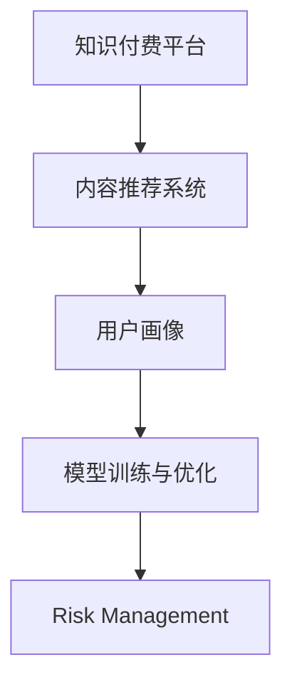

                 

# 知识付费创业中的风险管理

## 1. 背景介绍

### 1.1 问题由来
知识付费行业近年来蓬勃发展，成为互联网新兴经济领域的重要组成部分。其发展势头迅猛，从音频、视频到图文，从专业课程到泛娱乐内容，知识付费内容形式多样，覆盖面广，满足了用户日益增长的知识需求和娱乐需求。

然而，知识付费行业在快速发展的过程中也面临着诸多挑战和风险。盗版侵权、质量参差不齐、用户体验差、商业模式不清晰等风险因素，使得知识付费企业的盈利能力受到严重制约。这些问题不仅仅是技术问题，更关乎商业运营、用户体验和市场监管等多个方面。

在行业初期，知识付费平台主要依赖少数知名讲师，通过课程内容和讲师名气吸引用户。然而，随着内容同质化和过度竞争，部分平台陷入低质内容的恶性循环，用户体验大打折扣。为了突破这种局面，企业开始探索利用数据分析和智能推荐技术，提高平台内容质量和用户粘性，增强市场竞争力。

## 2. 核心概念与联系

### 2.1 核心概念概述

为更好地理解知识付费行业中的风险管理，本节将介绍几个密切相关的核心概念：

- **知识付费平台(Knowledge Subscription Platform)**：提供各类知识课程、专业技能培训、文化娱乐等内容，用户通过付费获取优质内容的平台。
- **内容推荐系统(Content Recommendation System)**：根据用户历史行为和偏好，实时推荐用户可能感兴趣的内容，提升用户体验和平台粘性的系统。
- **风险管理(Risk Management)**：通过建立模型和算法，识别和预测潜在风险，制定应对措施，保障平台运营稳定性和持续发展的管理活动。
- **用户画像(User Persona)**：综合用户性别、年龄、兴趣、行为等多个维度，刻画用户特征，指导内容推荐和运营决策。
- **模型训练与优化(Model Training and Optimization)**：通过机器学习技术，利用历史数据训练模型，不断优化模型参数，提升模型预测准确率和泛化能力。

这些核心概念之间的逻辑关系可以通过以下Mermaid流程图来展示：



这个流程图展示了大模型微调的各个核心概念及其之间的逻辑关系：

1. 知识付费平台通过内容推荐系统，为用户推送个性化的内容。
2. 内容推荐系统根据用户画像，进行个性化推荐，需通过模型训练与优化进行指导。
3. 模型训练与优化通过历史数据和用户行为数据，对用户画像和推荐模型进行训练和优化。
4. 风险管理通过建立风险预测模型，识别潜在风险，及时采取措施，保障平台运营稳定。

这些概念共同构成了知识付费平台的技术和管理框架，指导着平台的内容推荐和风险防控工作。通过理解这些核心概念，我们可以更好地把握知识付费平台的运营逻辑。

## 3. 核心算法原理 & 具体操作步骤
### 3.1 算法原理概述

知识付费平台的内容推荐系统是一种基于协同过滤和深度学习推荐技术实现的智能推荐系统。其核心思想是通过建立用户行为和内容特征之间的关系，预测用户对不同内容项的兴趣，从而进行个性化推荐。

形式化地，假设用户集为 $U$，内容集为 $I$，用户-内容行为矩阵为 $R \in \mathbb{R}^{N\times M}$，其中 $N$ 为用户数量，$M$ 为内容数量。设 $R_{ui} = 1$ 表示用户 $u$ 对内容 $i$ 进行了某种行为，如观看、购买等，否则 $R_{ui} = 0$。设 $p_i$ 为用户对内容 $i$ 的兴趣评分，$p_i \in [0,1]$，$u$ 对内容 $i$ 的评分即为 $p_{ui} = \hat{p}_i$。

推荐算法通过学习模型 $P(u,i) = p_{ui}$，预测用户 $u$ 对内容 $i$ 的评分，从而进行个性化推荐。常见的推荐算法包括基于矩阵分解的协同过滤、基于深度学习的协同过滤、基于序列的协同过滤等。

### 3.2 算法步骤详解

基于协同过滤的推荐系统一般包括以下几个关键步骤：

**Step 1: 数据收集与预处理**
- 收集用户对内容的点击、观看、收藏、购买等行为数据，构建用户-内容行为矩阵 $R$。
- 对数据进行清洗和归一化处理，去除异常值，避免模型过拟合。

**Step 2: 特征提取**
- 从行为数据中提取用户特征和内容特征，如用户ID、内容ID、时间戳、类别等。
- 利用词袋模型、TF-IDF等文本处理方法，将内容描述转换为特征向量。

**Step 3: 用户画像建模**
- 通过用户行为数据，构建用户画像，描述用户的兴趣和行为模式。
- 对用户画像进行降维和归一化，生成用户嵌入向量。

**Step 4: 内容画像建模**
- 利用内容特征，构建内容画像，描述内容的属性和风格。
- 对内容画像进行降维和归一化，生成内容嵌入向量。

**Step 5: 模型训练**
- 使用矩阵分解等方法，对用户嵌入向量和内容嵌入向量进行训练，得到用户-内容兴趣矩阵 $\hat{R}$。
- 利用用户-内容兴趣矩阵 $\hat{R}$ 和用户画像，生成用户对内容的评分预测 $p_{ui}$。

**Step 6: 推荐策略**
- 根据评分预测 $p_{ui}$，计算用户对内容的兴趣得分。
- 对所有内容进行排序，推荐兴趣得分高的内容。

### 3.3 算法优缺点

基于协同过滤的推荐算法具有以下优点：
1. 简单易用。不需要对内容本身进行深入了解，只需要关注用户行为数据。
2. 效果显著。在许多实证研究中，基于协同过滤的推荐算法已经展示出优于其他算法的推荐性能。
3. 普适性强。可以应用到各类内容推荐场景，如音乐、视频、新闻等。
4. 可扩展性好。随着数据量的增加，模型性能提升明显。

同时，该算法也存在以下局限性：
1. 冷启动问题。对于新用户和新内容，无法进行准确推荐。
2. 数据稀疏性。用户-内容行为矩阵稀疏，推荐精度可能较低。
3. 数据噪声。行为数据可能包含大量异常值和噪声，影响推荐效果。
4. 扩展性差。对于大规模用户和内容集，矩阵分解的计算复杂度较高，难以高效运行。

尽管存在这些局限性，但就目前而言，基于协同过滤的推荐算法仍是内容推荐的主流范式。未来相关研究的重点在于如何进一步提升算法准确性，优化推荐策略，增强对新用户和新内容的推荐能力。

### 3.4 算法应用领域

基于协同过滤的推荐算法广泛应用于知识付费平台的内容推荐场景，其具体应用领域包括：

- **个性化课程推荐**：根据用户历史行为，为用户推荐可能感兴趣的课程。
- **个性化视频推荐**：通过用户观看历史，推荐用户可能喜欢的视频。
- **个性化文章推荐**：利用用户阅读行为，推荐用户可能感兴趣的深度文章。
- **个性化活动推荐**：根据用户参加历史，推荐用户可能感兴趣的活动。

除了这些经典场景，基于协同过滤的推荐算法还被广泛应用于电商网站、社交媒体、音乐平台等多个领域，为平台提供精准的个性化推荐服务，提升用户体验和平台粘性。

## 4. 数学模型和公式 & 详细讲解  
### 4.1 数学模型构建

本节将使用数学语言对知识付费平台中的推荐算法进行更加严格的刻画。

假设用户集为 $U=\{u_1, u_2, \dots, u_N\}$，内容集为 $I=\{i_1, i_2, \dots, i_M\}$。设用户对内容的评分矩阵为 $R \in \mathbb{R}^{N\times M}$，其中 $R_{ui} = 1$ 表示用户 $u$ 对内容 $i$ 进行了某种行为，否则 $R_{ui} = 0$。设用户对内容 $i$ 的兴趣评分为 $p_i$，用户 $u$ 对内容 $i$ 的评分预测为 $\hat{p}_i$。

推荐算法的目标是最小化预测评分与实际评分之间的均方误差，即：

$$
\min_{\hat{p}} \frac{1}{N} \sum_{u=1}^N \frac{1}{M} \sum_{i=1}^M (p_{ui} - \hat{p}_i)^2
$$

在实践中，一般使用矩阵分解方法进行建模，设用户嵌入向量为 $u \in \mathbb{R}^k$，内容嵌入向量为 $i \in \mathbb{R}^k$，其中 $k$ 为向量维度。则用户-内容兴趣矩阵 $\hat{R}$ 可以表示为：

$$
\hat{R} = UV^T
$$

其中 $U \in \mathbb{R}^{N\times k}$ 为用户嵌入矩阵，$V \in \mathbb{R}^{M\times k}$ 为内容嵌入矩阵，$U^TV^T$ 即为用户-内容兴趣矩阵 $\hat{R}$。

通过上述矩阵分解方法，将原始评分矩阵 $R$ 分解为用户嵌入矩阵 $U$ 和内容嵌入矩阵 $V$ 的乘积，用户对内容的评分预测即为：

$$
\hat{p}_i = \langle u, v_i \rangle
$$

其中 $\langle \cdot, \cdot \rangle$ 为向量内积，$v_i$ 为内容 $i$ 的内容嵌入向量。

### 4.2 公式推导过程

以下我们以矩阵分解方法为例，推导推荐算法的损失函数及其梯度计算公式。

假设用户对内容 $i$ 的实际评分 $p_{ui} = 1$ 或 $0$，预测评分 $\hat{p}_i = \langle u, v_i \rangle$，则损失函数定义为：

$$
\mathcal{L}(u,v) = \frac{1}{N} \sum_{u=1}^N \frac{1}{M} \sum_{i=1}^M \mathbb{1}(p_{ui} \neq \hat{p}_i) \cdot (\hat{p}_i - p_{ui})^2
$$

将其代入优化目标，得：

$$
\min_{u,v} \mathcal{L}(u,v)
$$

利用梯度下降等优化算法，对用户嵌入向量 $u$ 和内容嵌入向量 $v$ 进行优化，即可得到最小化的用户嵌入向量和内容嵌入向量。

### 4.3 案例分析与讲解

以视频推荐为例，可以构建一个简单的视频推荐系统：

1. 收集用户对视频的观看历史数据 $R$。
2. 利用用户观看行为数据，构建用户嵌入向量 $u$。
3. 利用视频属性信息，构建视频嵌入向量 $v$。
4. 将用户嵌入向量 $u$ 和视频嵌入向量 $v$ 相乘，得到用户对视频的预测评分 $\hat{p}$。
5. 对所有视频的预测评分排序，推荐评分高的视频。

下面给出具体代码实现：

```python
from sklearn.decomposition import TruncatedSVD
from scipy.sparse import csc_matrix

# 用户-内容行为矩阵
R = csc_matrix([[1, 0, 1, 0, 1, 0], [0, 1, 0, 1, 0, 1], [1, 0, 0, 0, 1, 0]])

# 对行为矩阵进行矩阵分解
U, Vt = TruncatedSVD(n_components=2, random_state=42).fit_transform(R)

# 计算用户对内容的预测评分
predictions = U @ Vt.T

# 推荐评分高的视频
recommendations = predictions.argmax(axis=1)
```

可以看到，利用TruncatedSVD进行矩阵分解，将用户-内容行为矩阵 $R$ 分解为用户嵌入向量 $U$ 和内容嵌入向量 $Vt$，再计算用户对内容的预测评分，即可推荐评分高的视频。

## 5. 项目实践：代码实例和详细解释说明
### 5.1 开发环境搭建

在进行知识付费平台的推荐系统开发前，我们需要准备好开发环境。以下是使用Python进行推荐系统开发的环境配置流程：

1. 安装Anaconda：从官网下载并安装Anaconda，用于创建独立的Python环境。

2. 创建并激活虚拟环境：
```bash
conda create -n recommendation-env python=3.8 
conda activate recommendation-env
```

3. 安装必要的Python包：
```bash
pip install numpy pandas scikit-learn transformers pytorch torchtext
```

4. 安装TensorFlow：从官网下载并安装TensorFlow，用于深度学习模型的训练和推理。

5. 安装必要的深度学习框架：
```bash
pip install tensorflow-gpu==2.7.0
```

完成上述步骤后，即可在`recommendation-env`环境中开始推荐系统的开发。

### 5.2 源代码详细实现

下面以用户-内容行为矩阵分解为例，展示如何使用TensorFlow进行基于协同过滤的推荐系统开发：

```python
import tensorflow as tf
from tensorflow.keras.layers import Embedding, Dot, Dense, Flatten
from tensorflow.keras.models import Model

# 构建用户嵌入层
user_embeddings = Embedding(input_dim=n_users, output_dim=embedding_dim)
user_embeddings = Flatten()(user_embeddings)

# 构建内容嵌入层
content_embeddings = Embedding(input_dim=n_items, output_dim=embedding_dim)
content_embeddings = Flatten()(content_embeddings)

# 计算用户对内容的预测评分
predictions = Dot(axes=1)([user_embeddings, content_embeddings])
predictions = Dense(1)(predictions)

# 定义模型
model = Model(inputs=[user_embeddings.input, content_embeddings.input], outputs=predictions)
model.compile(optimizer=tf.keras.optimizers.Adam(learning_rate=0.01), loss='mse')

# 训练模型
model.fit([user_data, content_data], target_data, epochs=10, batch_size=128)

# 推荐新内容
new_user_data = [new_user]
new_content_data = [content_data]
predictions = model.predict([new_user_data, new_content_data])
recommendation = predictions.argmax(axis=1)
```

可以看到，利用TensorFlow进行推荐系统的开发，可以方便地构建用户嵌入层、内容嵌入层和预测评分模型，并通过优化器进行训练。在训练完成后，可以通过模型对新用户和内容进行推荐。

### 5.3 代码解读与分析

让我们再详细解读一下关键代码的实现细节：

**Embedding层**：
- 使用Embedding层将用户ID和内容ID映射为高维向量，分别对应用户嵌入向量和内容嵌入向量。

**Dot层**：
- 使用Dot层计算用户嵌入向量和内容嵌入向量之间的内积，得到用户对内容的预测评分。

**Dense层**：
- 使用Dense层将预测评分从二维转换为一维，得到最终的推荐评分。

**Model类**：
- 使用Model类构建完整的推荐模型，将用户嵌入层、内容嵌入层和预测评分层进行组合，形成模型结构。

**compile方法**：
- 调用compile方法对模型进行编译，设置优化器、损失函数等。

**fit方法**：
- 调用fit方法对模型进行训练，通过历史用户-内容行为数据进行拟合。

**predict方法**：
- 调用predict方法对新用户和内容进行推荐评分，返回排序后的推荐内容。

可以看到，TensorFlow提供了一系列的高级API，方便开发者快速构建和训练推荐模型，同时具有强大的计算图和优化算法，能够高效地进行模型训练和推理。

当然，工业级的系统实现还需考虑更多因素，如模型的保存和部署、超参数的自动搜索、更灵活的任务适配层等。但核心的推荐算法基本与此类似。

## 6. 实际应用场景
### 6.1 智能课程推荐

在知识付费平台中，智能课程推荐是核心功能之一。通过智能推荐，平台能够为用户推荐感兴趣的课程，提升平台粘性和用户转化率。

推荐算法可以从用户的历史观看、购买、收藏等行为数据中，提取用户画像和内容画像，通过矩阵分解等方法进行模型训练。训练后的模型可以实时计算用户对不同课程的兴趣评分，生成个性化推荐列表。

平台可以定期根据用户反馈，调整推荐策略，优化模型参数，提升推荐效果。例如，对于某门课程的推荐评分可以通过A/B测试等方法进行验证，选择最优的推荐模型和策略。

### 6.2 个性化直播推荐

直播内容在知识付费平台中越来越受到用户青睐。通过智能推荐，平台可以根据用户观看历史和直播行为，为用户推荐感兴趣的直播内容。

推荐算法可以使用实时流媒体数据进行推荐，例如通过记录用户观看直播的时长、关注的讲师、互动频率等行为数据，构建用户画像和内容画像。再利用协同过滤等方法进行模型训练，生成个性化直播推荐列表。

平台可以根据用户反馈，动态调整推荐算法，优化推荐效果。例如，对于某场直播的推荐评分可以通过用户满意度等指标进行评估，选择最优的推荐策略。

### 6.3 活动推荐

知识付费平台中，除了课程和直播外，还有各种线下活动和社区活动。通过智能推荐，平台可以为用户推荐感兴趣的线上线下活动，提升用户参与度和平台粘性。

推荐算法可以使用用户历史参与活动的行为数据，构建用户画像和内容画像，通过协同过滤等方法进行模型训练。训练后的模型可以实时计算用户对不同活动的兴趣评分，生成个性化推荐列表。

平台可以根据用户反馈，动态调整推荐策略，优化推荐效果。例如，对于某场活动的推荐评分可以通过用户参与率等指标进行评估，选择最优的推荐模型和策略。

### 6.4 未来应用展望

随着知识付费平台的不断发展，推荐系统也将迎来更多的应用场景和创新思路：

1. 内容创作推荐：利用推荐系统，平台可以发现和推荐优秀的内容创作者，激发用户创作热情，提升平台内容质量。
2. 社交推荐：推荐系统可以结合社交网络数据，为用户推荐其好友和兴趣小组，增强用户社交互动。
3. 个性化VIP服务：通过推荐系统，平台可以为不同用户提供定制化的VIP服务，增强用户体验和平台粘性。
4. 跨平台推荐：推荐系统可以实现不同平台之间的内容联动和用户迁移，提升平台综合价值。
5. 联合推荐：推荐系统可以结合用户画像、内容画像、行为数据等多维度信息，进行联合推荐，提升推荐效果。

## 7. 工具和资源推荐
### 7.1 学习资源推荐

为了帮助开发者系统掌握推荐系统的理论基础和实践技巧，这里推荐一些优质的学习资源：

1. 《推荐系统实战》系列博文：由推荐系统专家撰写，深入浅出地介绍了推荐系统的基本概念、算法和应用。
2. 《Recommender Systems: Algorithms, Implementations, and Use Cases》书籍：由推荐系统领域多位知名学者编写，全面介绍了推荐系统的各种算法和技术。
3. 《Python推荐系统实战》书籍：详细介绍了基于Python的推荐系统开发，包括协同过滤、深度学习等多种推荐算法。
4. KDD推荐系统竞赛：通过实际竞赛，学习推荐系统开发的最新技术和挑战。
5. UCI推荐系统数据集：包含多个推荐系统数据集，用于模型训练和评测。

通过对这些资源的学习实践，相信你一定能够快速掌握推荐系统的精髓，并用于解决实际的推荐问题。
###  7.2 开发工具推荐

高效的开发离不开优秀的工具支持。以下是几款用于推荐系统开发的常用工具：

1. TensorFlow：由Google主导开发的开源深度学习框架，生产部署方便，适合大规模工程应用。

2. PyTorch：基于Python的开源深度学习框架，灵活动态的计算图，适合快速迭代研究。

3. Jupyter Notebook：强大的交互式编程环境，支持代码块、可视化、协作等多种功能，适合研究和实验。

4. Weights & Biases：模型训练的实验跟踪工具，可以记录和可视化模型训练过程中的各项指标，方便对比和调优。

5. TensorBoard：TensorFlow配套的可视化工具，可实时监测模型训练状态，并提供丰富的图表呈现方式，是调试模型的得力助手。

6. Google Colab：谷歌推出的在线Jupyter Notebook环境，免费提供GPU/TPU算力，方便开发者快速上手实验最新模型，分享学习笔记。

合理利用这些工具，可以显著提升推荐系统的开发效率，加快创新迭代的步伐。

### 7.3 相关论文推荐

推荐系统的发展源于学界的持续研究。以下是几篇奠基性的相关论文，推荐阅读：

1. "Collaborative Filtering for Implicit Feedback Datasets"：提出了基于协同过滤的推荐算法，并探讨了处理稀疏数据、缓解冷启动问题的方法。
2. "Warp+NeuMF: Training Two-Way Matrix Factorization Models with Confidence Propagation"：提出了双向矩阵分解方法，进一步提升了推荐模型的精度和泛化能力。
3. "Deep Knowledge-Graph-Based Recommendation System"：将知识图谱与推荐系统结合，提升了推荐模型的知识整合能力。
4. "Item-Knowledge-Aware Matrix Factorization"：提出物品知识增强的矩阵分解方法，提升了推荐模型的表现。
5. "Real-Time Hybrid Recommender System"：结合多种推荐算法，提高了推荐系统的实时性和多样性。

这些论文代表了大规模推荐系统的演进脉络。通过学习这些前沿成果，可以帮助研究者把握推荐系统的前进方向，激发更多的创新灵感。

## 8. 总结：未来发展趋势与挑战
### 8.1 总结

本文对知识付费平台中的推荐系统进行了全面系统的介绍。首先阐述了推荐系统在知识付费平台中的核心地位和重要性，明确了推荐系统在提升用户体验、增加平台粘性、提高转化率等方面的独特价值。其次，从原理到实践，详细讲解了协同过滤推荐算法的数学原理和关键步骤，给出了推荐系统开发的完整代码实例。同时，本文还广泛探讨了推荐系统在智能课程推荐、个性化直播推荐、活动推荐等多个场景中的应用前景，展示了推荐系统的巨大潜力。此外，本文精选了推荐系统的各类学习资源，力求为读者提供全方位的技术指引。

通过本文的系统梳理，可以看到，推荐系统在知识付费平台中的地位日益重要，极大地影响了平台的运营效果和用户体验。在知识付费行业的快速发展过程中，推荐系统的优化和创新，将成为平台竞争力的重要保障。未来，伴随推荐算法的不断演进，知识付费平台的推荐效果和用户体验必将得到更大的提升。

### 8.2 未来发展趋势

展望未来，推荐系统的发展趋势将呈现以下几个方向：

1. **深度学习与协同过滤结合**：推荐系统将更多地引入深度学习技术，如卷积神经网络、循环神经网络等，提升推荐模型的精度和泛化能力。同时保留协同过滤方法的优势，实现深度学习与协同过滤的融合。

2. **跨模态推荐**：推荐系统将结合多种模态数据，如文本、图像、音频等，提升推荐模型的感知能力和表现。例如，通过结合文本和图像信息，提升视频推荐的效果。

3. **增强学习与推荐结合**：推荐系统将结合增强学习技术，动态调整推荐策略，优化推荐效果。例如，通过在线学习算法，实时更新推荐模型参数，提升推荐效果和多样性。

4. **元学习与推荐结合**：推荐系统将结合元学习技术，提升推荐模型的泛化能力和迁移能力。例如，通过元学习算法，提升推荐模型对新用户和新内容的推荐能力。

5. **推荐系统去中心化**：推荐系统将更多地考虑用户隐私和数据安全问题，去中心化的推荐系统将逐步得到应用。例如，通过区块链技术，实现推荐模型的去中心化和数据隐私保护。

6. **推荐系统的可解释性和公平性**：推荐系统将更加注重推荐模型的可解释性和公平性，帮助用户理解和信任推荐结果。例如，通过可解释性算法，提升推荐模型的透明度和可信度。

7. **推荐系统的自动化和智能化**：推荐系统将更多地应用自动化和智能化技术，提升推荐模型的开发和优化效率。例如，通过自动化调参工具，优化推荐模型的超参数和结构。

8. **推荐系统的跨平台协同**：推荐系统将结合多种平台的数据和资源，实现跨平台的协同推荐。例如，通过联合推荐算法，实现不同平台之间的内容联动和用户迁移。

这些趋势凸显了推荐系统的广阔前景。这些方向的探索发展，必将进一步提升推荐系统的精度和多样性，提升知识付费平台的运营效果和用户体验。

### 8.3 面临的挑战

尽管推荐系统已经取得了瞩目成就，但在迈向更加智能化、普适化应用的过程中，它仍面临着诸多挑战：

1. **数据质量与隐私问题**：推荐系统依赖高质量数据，但数据获取和处理成本较高，同时用户隐私问题也需要得到重视。如何保证数据质量和用户隐私，是推荐系统发展的重要挑战。

2. **模型复杂性与计算效率**：推荐系统模型复杂度高，训练和推理效率低，难以满足实时推荐需求。如何优化模型结构，提升计算效率，是推荐系统发展的重要任务。

3. **冷启动与新用户推荐**：对于新用户和新内容，推荐系统难以进行准确推荐。如何提高推荐系统的冷启动性能，是推荐系统发展的关键问题。

4. **多样化与个性化平衡**：推荐系统需要在个性化和多样化之间取得平衡，避免陷入"过滤气泡"，提升推荐效果和用户体验。

5. **鲁棒性与安全性**：推荐系统容易受到恶意攻击和数据注入，如何提高推荐系统的鲁棒性和安全性，是推荐系统发展的重点问题。

6. **可解释性与公平性**：推荐系统通常缺乏可解释性，容易受到用户质疑。如何提升推荐系统的可解释性和公平性，是推荐系统发展的关键任务。

7. **模型更新与数据流变**：推荐系统需要动态更新，以应对数据分布的变化和用户的反馈。如何实现推荐模型的动态更新和维护，是推荐系统发展的长期任务。

8. **跨平台协同与数据共享**：推荐系统需要跨平台协同，共享数据和资源，提升推荐效果。如何保证跨平台数据共享的合法性和安全性，是推荐系统发展的关键问题。

这些挑战将推动推荐系统不断进步，但其核心任务仍是如何提升推荐模型的精度和效率，增强推荐系统的普适性和智能化水平。只有不断克服这些挑战，推荐系统才能在知识付费平台中发挥更大的作用。

### 8.4 研究展望

面对推荐系统所面临的种种挑战，未来的研究需要在以下几个方面寻求新的突破：

1. **深度学习与协同过滤结合**：探索更加高效和鲁棒的深度学习与协同过滤结合方法，提升推荐模型的泛化能力和优化效率。

2. **跨模态数据融合**：研究如何更好地结合多模态数据，提升推荐模型的感知能力和表现。例如，通过结合文本和图像信息，提升视频推荐的效果。

3. **增强学习与推荐结合**：探索增强学习与推荐系统的结合方法，动态调整推荐策略，优化推荐效果。例如，通过在线学习算法，实时更新推荐模型参数，提升推荐效果和多样性。

4. **元学习与推荐结合**：研究元学习技术，提升推荐模型的泛化能力和迁移能力。例如，通过元学习算法，提升推荐模型对新用户和新内容的推荐能力。

5. **推荐系统的去中心化**：探索去中心化的推荐系统方法，提高推荐系统的鲁棒性和安全性，保护用户隐私和数据安全。例如，通过区块链技术，实现推荐模型的去中心化和数据隐私保护。

6. **推荐系统的自动化与智能化**：探索推荐系统的自动化和智能化方法，提升推荐模型的开发和优化效率。例如，通过自动化调参工具，优化推荐模型的超参数和结构。

7. **推荐系统的跨平台协同**：研究跨平台协同推荐方法，实现不同平台之间的内容联动和用户迁移。例如，通过联合推荐算法，实现不同平台之间的内容联动和用户迁移。

这些研究方向的探索，必将引领推荐系统迈向更高的台阶，为知识付费平台提供更精准、个性化的推荐服务，提升平台运营效果和用户体验。面向未来，推荐系统需要在技术创新和应用实践中不断突破，才能更好地服务于知识付费行业的发展。

## 9. 附录：常见问题与解答

**Q1：推荐系统如何进行冷启动推荐？**

A: 冷启动问题是指推荐系统无法对新用户和新内容进行准确推荐。为了解决冷启动问题，推荐系统通常采用以下方法：

1. **基于内容推荐**：对于新用户，推荐系统可以通过内容的属性信息，推荐与用户兴趣相关的初始内容。例如，对于新用户，推荐热门课程或热门视频，吸引用户留存。

2. **基于社区推荐**：推荐系统可以通过社区数据，推荐新用户的朋友或兴趣小组中的热门内容。例如，对于新用户，推荐其好友关注的内容，提升用户粘性。

3. **基于兴趣标签推荐**：推荐系统可以通过用户输入的兴趣标签，推荐相关内容。例如，对于新用户，通过用户填写的兴趣标签，推荐相关课程或视频。

4. **基于社交网络推荐**：推荐系统可以通过社交网络数据，推荐新用户的朋友和邻居中的热门内容。例如，对于新用户，推荐其好友和邻居关注的内容。

5. **基于搜索推荐**：推荐系统可以通过搜索数据，推荐与用户搜索意图相关的初始内容。例如，对于新用户，推荐与其搜索意图相关的课程或视频。

通过这些方法，推荐系统可以在一定程度上缓解冷启动问题，提升新用户和新内容的推荐效果。

**Q2：推荐系统如何优化模型训练过程？**

A: 推荐系统的模型训练过程可以通过以下方法进行优化：

1. **数据增强**：通过数据增强技术，扩充训练数据集。例如，利用生成对抗网络（GAN）生成假数据，提升模型泛化能力。

2. **正则化技术**：通过正则化技术，防止模型过拟合。例如，使用L2正则、Dropout等技术。

3. **超参数调优**：通过自动化调参工具，优化模型的超参数。例如，使用网格搜索、贝叶斯优化等技术。

4. **增量学习**：通过增量学习算法，动态更新模型参数。例如，使用在线学习算法，实时更新推荐模型。

5. **分布式训练**：通过分布式训练技术，提高模型训练效率。例如，使用Spark等分布式计算框架，提升训练速度。

6. **混合精度训练**：通过混合精度训练技术，优化模型训练的资源消耗。例如，使用混合精度模型，提高训练效率。

7. **模型裁剪**：通过模型裁剪技术，减少模型参数量。例如，使用知识蒸馏等方法，生成轻量级推荐模型。

通过这些方法，推荐系统可以在一定程度上优化模型训练过程，提高模型的泛化能力和训练效率。

**Q3：推荐系统如何提升推荐效果的公平性？**

A: 推荐系统的公平性问题是指推荐结果可能存在偏差，影响用户的公平体验。为了提升推荐效果的公平性，推荐系统可以采用以下方法：

1. **多样性约束**：推荐系统可以通过多样性约束，避免推荐结果集中于少数内容。例如，限制推荐列表中同一类型内容的数量。

2. **公平性算法**：推荐系统可以通过公平性算法，确保推荐结果的公平性。例如，使用等距推荐算法，避免推荐结果的偏差。

3. **用户反馈机制**：推荐系统可以通过用户反馈机制，收集用户对推荐结果的反馈，优化推荐策略。例如，通过用户评分数据，调整推荐策略。

4. **透明度提升**：推荐系统可以通过提升推荐过程的透明度，增强用户对推荐结果的信任。例如，通过可解释性算法，提升推荐模型的可解释性。

5. **数据清洗与预处理**：推荐系统可以通过数据清洗与预处理，去除数据中的噪声和异常值，提升推荐效果和公平性。

6. **推荐结果后评估**：推荐系统可以通过推荐结果后评估，评估推荐结果的公平性。例如，使用公平性指标，评估推荐结果的公平性。

通过这些方法，推荐系统可以在一定程度上提升推荐效果的公平性，保障用户的公平体验。

**Q4：推荐系统如何实现实时推荐？**

A: 实时推荐是指推荐系统能够实时响应用户请求，提供最新的推荐结果。为了实现实时推荐，推荐系统可以采用以下方法：

1. **增量学习**：推荐系统可以通过增量学习算法，实时更新模型参数。例如，使用在线学习算法，实时更新推荐模型。

2. **分布式训练**：推荐系统可以通过分布式训练技术，提高模型训练效率。例如，使用Spark等分布式计算框架，提升训练速度。

3. **缓存与缓存淘汰**：推荐系统可以通过缓存技术，存储热门推荐结果，提升推荐效率。例如，使用Redis等缓存系统，存储热门推荐结果。

4. **异步处理**：推荐系统可以通过异步处理技术，优化模型训练和推理的延迟。例如，使用异步任务队列，提高处理效率。

5. **分布式存储**：推荐系统可以通过分布式存储技术，提高数据访问效率。例如，使用Hadoop等分布式存储系统，提升数据访问速度。

通过这些方法，推荐系统可以在一定程度上实现实时推荐，提升用户体验和平台粘性。

**Q5：推荐系统如何保护用户隐私和数据安全？**

A: 推荐系统的隐私和数据安全问题是指推荐系统可能泄露用户隐私数据，遭受恶意攻击。为了保护用户隐私和数据安全，推荐系统可以采用以下方法：

1. **数据匿名化**：推荐系统可以通过数据匿名化技术，保护用户隐私。例如，使用K-匿名等技术，去除用户隐私信息。

2. **差分隐私**：推荐系统可以通过差分隐私技术，保护用户隐私。例如，使用Laplace机制等技术，保护用户隐私。

3. **安全加密**：推荐系统可以通过安全加密技术，保护数据安全。例如，使用AES加密算法，保护数据安全。

4. **访问控制**：推荐系统可以通过访问控制技术，限制数据访问权限。例如，使用RBAC等技术，限制数据访问权限。

5. **安全审计**：推荐系统可以通过安全审计技术，监控数据访问行为。例如，使用安全审计工具，监控数据访问行为。

6. **数据备份与恢复**：推荐系统可以通过数据备份与恢复技术，保护数据安全。例如，使用数据备份工具，定期备份数据。

通过这些方法，推荐系统可以在一定程度上保护用户隐私和数据安全，提升平台信任度和用户满意度。

---

作者：禅与计算机程序设计艺术 / Zen and the Art of Computer Programming

