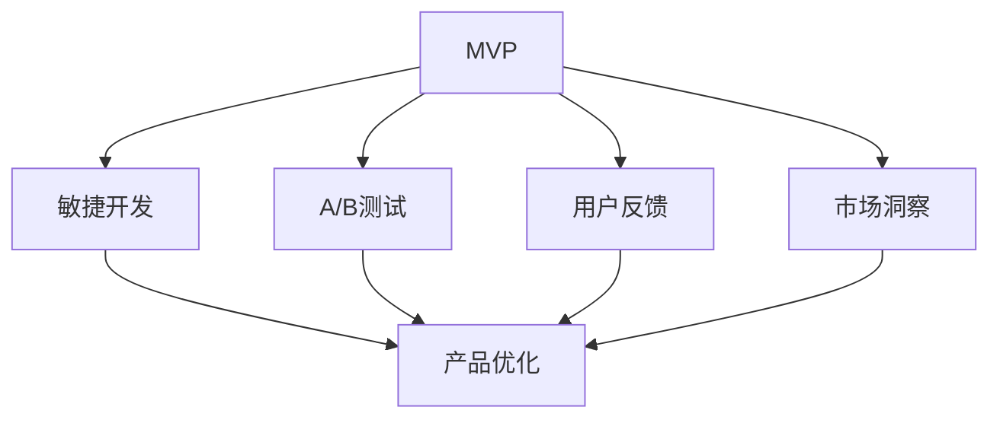

                 

# 知识付费创业的产品迭代方法论

## 1. 背景介绍

在数字化转型的大趋势下，知识付费市场正迎来快速发展期。各类知识付费平台层出不穷，各种付费课程、文章、音频、视频等内容如雨后春笋般涌现。然而，面对竞争激烈的市场，如何持续推出高质量内容、快速迭代产品，成为知识付费创业者必须解决的难题。本文将基于多年的行业经验和理论实践，详细介绍知识付费创业的产品迭代方法论，力求帮助创业者在激烈的市场竞争中，找到突破口、把握新机遇。

## 2. 核心概念与联系

### 2.1 核心概念概述

为更好地理解知识付费产品的迭代方法，本节将介绍几个密切相关的核心概念：

- 知识付费：指通过互联网平台，向用户提供具有付费价值的学习资源，如在线课程、电子书、专家咨询等，以提升用户专业技能和知识水平。

- 产品迭代：指在产品开发和发布过程中，根据用户反馈、市场变化等，持续对产品进行优化和升级，提升用户体验和产品竞争力。

- MVP（最小可行产品）：指以最小成本快速开发的产品原型，用以验证产品核心功能和用户需求，快速积累用户反馈，指导后续产品优化。

- 敏捷开发：指通过迭代开发、持续交付、用户反馈等方法，提升产品开发效率和用户满意度的一种敏捷项目管理方式。

- A/B测试：指同时运行两个或多个版本的产品，通过比较不同版本的用户行为、转化率等指标，评估各版本的效果，指导产品优化。

- 用户反馈：指用户在使用产品过程中提出的意见、建议、投诉等，是产品迭代的重要依据。

- 市场洞察：指通过对市场数据、用户行为、行业趋势等进行分析，发现潜在机会和挑战，指导产品策略制定。

这些核心概念之间的逻辑关系可以通过以下Mermaid流程图来展示：



这个流程图展示了一些关键概念及其之间的关系：

1. MVP是产品迭代的基础，通过快速构建原型验证需求。
2. 敏捷开发强调快速迭代、持续交付，提升产品开发效率。
3. A/B测试用于评估不同版本产品的用户行为，指导产品优化。
4. 用户反馈和市场洞察为产品迭代提供决策依据。
5. 产品优化不断优化产品功能和用户体验，最终提升产品竞争力。

这些概念共同构成了知识付费产品迭代的核心框架，帮助创业者实现产品快速、灵活、有效的迭代。

## 3. 核心算法原理 & 具体操作步骤

### 3.1 算法原理概述

知识付费产品的迭代过程，本质上是一个基于用户反馈和市场数据的持续优化过程。其核心思想是通过快速构建最小可行产品（MVP），通过敏捷开发和A/B测试，不断收集用户反馈和市场洞察，及时调整产品策略和功能，最终提升产品市场竞争力和用户体验。

具体而言，知识付费产品的迭代流程可以概括为：

1. **需求分析**：基于用户调研、市场分析等手段，确定产品核心需求和功能。
2. **原型设计**：快速开发MVP原型，验证产品核心功能是否满足用户需求。
3. **敏捷开发**：通过快速迭代、持续交付的方式，不断优化和完善产品功能。
4. **A/B测试**：同时运行多个产品版本，对比不同版本的用户行为和转化率，评估各版本效果。
5. **用户反馈**：持续收集用户反馈，及时发现问题和改进空间。
6. **市场洞察**：通过市场数据和行业趋势分析，发现潜在机会和挑战。
7. **产品优化**：根据用户反馈和市场洞察，调整产品策略和功能，提升产品竞争力。

### 3.2 算法步骤详解

以下是知识付费产品迭代的详细步骤：

**Step 1: 需求分析**
- 通过用户调研问卷、市场调研报告等手段，确定用户核心需求和功能优先级。
- 分析用户行为数据，识别用户痛点和需求。
- 了解行业趋势和竞争对手，制定产品差异化策略。

**Step 2: MVP设计**
- 快速构建MVP原型，验证核心功能是否满足用户需求。
- 最小化功能模块，保证低成本快速交付。
- 确保MVP具备完整业务流程和数据流，以便后续优化。

**Step 3: 敏捷开发**
- 采用Scrum等敏捷开发框架，划分迭代周期。
- 每个迭代周期开发新功能、优化现有功能。
- 持续交付产品增量，快速迭代、反馈。

**Step 4: A/B测试**
- 同时运行多个产品版本，对比不同版本的用户行为和转化率。
- 确定最优版本，明确优化方向。
- 基于测试结果，更新产品路线图和功能优先级。

**Step 5: 用户反馈**
- 通过产品内置反馈功能、问卷调查等方式，收集用户反馈。
- 分析用户反馈，识别高频问题和需求。
- 根据反馈，及时调整产品策略和功能。

**Step 6: 市场洞察**
- 定期收集市场数据，如用户增长、行业趋势等。
- 分析市场洞察，发现潜在机会和挑战。
- 基于洞察，调整产品方向和市场策略。

**Step 7: 产品优化**
- 根据用户反馈和市场洞察，调整产品策略和功能。
- 确定优化优先级，进行功能增强和性能优化。
- 持续迭代产品，提升用户体验和市场竞争力。

### 3.3 算法优缺点

基于敏捷开发的知识付费产品迭代方法具有以下优点：

- 快速交付：通过敏捷开发，快速迭代产品，缩短开发周期，快速满足用户需求。
- 用户参与：用户反馈贯穿产品迭代全过程，确保产品功能贴近用户需求。
- 灵活调整：市场洞察和用户反馈引导产品策略，提升产品灵活性和适应性。

同时，该方法也存在一定的局限性：

- 高成本风险：敏捷开发和A/B测试可能导致资源浪费，特别是在产品初期阶段。
- 进度不均衡：迭代周期短可能导致功能不完善，影响用户体验。
- 复杂管理：敏捷开发需要高度协同和沟通，管理复杂。

尽管存在这些局限性，但就目前而言，敏捷开发和A/B测试仍是知识付费产品迭代的最主流范式。未来相关研究的重点在于如何进一步降低敏捷开发的成本和风险，提高产品迭代的效率和效果。

### 3.4 算法应用领域

基于敏捷开发的知识付费产品迭代方法，在知识付费创业领域已经得到了广泛的应用，覆盖了课程制作、内容分发、用户运营等各个环节。

- 课程制作：通过敏捷开发，快速迭代课程内容和形式，提升课程质量。
- 内容分发：利用A/B测试，优化推荐算法和分发策略，提升内容曝光和转化率。
- 用户运营：通过用户反馈和市场洞察，不断优化用户运营策略，提升用户粘性和留存率。

除了上述这些经典应用外，知识付费产品迭代方法还被创新性地应用到更多场景中，如精准推荐、用户画像构建、智能客服等，为知识付费平台带来了全新的突破。随着敏捷开发和A/B测试方法的不断进步，相信知识付费产品迭代将在更多领域得到应用，为知识付费创业带来新的创新机会。

## 4. 数学模型和公式 & 详细讲解 & 举例说明

### 4.1 数学模型构建

本节将使用数学语言对知识付费产品的迭代过程进行更加严格的刻画。

记知识付费产品为 $P$，用户需求为 $D$，市场洞察为 $M$，产品功能为 $F$，用户反馈为 $R$，A/B测试结果为 $T$。定义产品迭代过程为 $I$，迭代周期为 $t$。

定义产品迭代过程 $I$ 的数学模型为：

$$
I_t = f(P_{t-1}, D, M, F, R, T)
$$

其中 $f$ 为迭代函数，表示在当前迭代周期内，根据用户需求、市场洞察、产品功能、用户反馈和A/B测试结果，更新产品策略和功能。

### 4.2 公式推导过程

以下我们以知识付费平台的课程制作过程为例，推导敏捷开发和A/B测试的数学公式。

**敏捷开发**
- 敏捷开发流程可以看作是一个连续的迭代过程，每个迭代周期 $t$ 内，产品功能 $F_t$ 的更新为：

$$
F_t = F_{t-1} + \Delta F
$$

其中 $\Delta F$ 为每次迭代新增或优化的功能集合。

**A/B测试**
- A/B测试结果可以表示为用户行为指标 $C$ 的对比，如点击率、转化率等。假设有两个版本 $V_1$ 和 $V_2$，在 $t$ 次测试中，用户行为指标的平均值分别为 $C_1$ 和 $C_2$，则版本优劣可以通过对比 $C_1$ 和 $C_2$ 来确定：

$$
C_1 \leq C_2 \Rightarrow V_2 \text{ 更优}
$$

通过A/B测试，可以不断对比不同版本的用户行为指标，优化产品功能。

### 4.3 案例分析与讲解

**案例一：课程制作**
- 假设知识付费平台通过敏捷开发流程，迭代开发课程制作功能。在 $t$ 次迭代中，新增了视频制作、智能生成课程大纲、实时互动等新功能。每次迭代后的功能更新量为 $\Delta F$。

**案例二：内容分发**
- 假设知识付费平台使用A/B测试，对比两个推荐算法 $A$ 和 $B$ 的点击率 $C_1$ 和 $C_2$。通过对比测试结果，发现算法 $B$ 的点击率高于算法 $A$，因此选择算法 $B$ 进行全站推广。

## 5. 项目实践：代码实例和详细解释说明

### 5.1 开发环境搭建

在进行知识付费产品的迭代实践前，我们需要准备好开发环境。以下是使用Python进行Flask开发的环境配置流程：

1. 安装Python和Flask：从官网下载并安装Python和Flask，确保其版本支持敏捷开发和A/B测试。

2. 创建Flask应用：编写应用程序入口文件，定义路由、模板和静态文件等基本配置。

3. 设计数据模型：使用SQLAlchemy等ORM工具，设计用户、课程、评价等数据模型，存储用户行为数据和产品功能。

4. 集成用户反馈模块：设计用户反馈功能，通过API接收用户反馈，存储到数据库中。

5. 实现A/B测试模块：设计A/B测试功能，通过随机分配用户，对比不同版本的行为指标，存储测试结果。

完成上述步骤后，即可在开发环境中启动知识付费产品的迭代流程。

### 5.2 源代码详细实现

下面我们以知识付费平台的课程制作功能为例，给出使用Flask和SQLAlchemy进行敏捷开发和A/B测试的代码实现。

```python
from flask import Flask, request
from flask_sqlalchemy import SQLAlchemy
from flask_marshmallow import Marshmallow
from sqlalchemy import create_engine
from sqlalchemy.orm import sessionmaker

# 初始化应用
app = Flask(__name__)
app.config['SQLALCHEMY_DATABASE_URI'] = 'sqlite:///example.db'
app.config['SQLALCHEMY_TRACK_MODIFICATIONS'] = False

# 初始化ORM和序列化库
db = SQLAlchemy(app)
ma = Marshmallow(app)

# 定义数据模型
class User(db.Model):
    id = db.Column(db.Integer, primary_key=True)
    name = db.Column(db.String(50))
    email = db.Column(db.String(50))
    feedback = db.Column(db.String(200))

class Course(db.Model):
    id = db.Column(db.Integer, primary_key=True)
    name = db.Column(db.String(50))
    description = db.Column(db.String(200))
    evaluation = db.Column(db.String(200))

# 定义序列化器
class UserSchema(ma.SQLAlchemyAutoSchema):
    class Meta:
        model = User
        fields = ('id', 'name', 'email', 'feedback')

class CourseSchema(ma.SQLAlchemyAutoSchema):
    class Meta:
        model = Course
        fields = ('id', 'name', 'description', 'evaluation')

# 初始化ORM引擎
engine = create_engine(app.config['SQLALCHEMY_DATABASE_URI'])
Session = sessionmaker(bind=engine)
session = Session()

# 定义敏捷开发逻辑
def agile_development():
    for i in range(1, 6):
        # 新增功能
        new_functionality = f'Feature_{i}'
        # 存储功能更新到数据库
        new_course = Course(name=new_functionality, description=f'Course {i}', evaluation=f'Course {i} feedback')
        session.add(new_course)
        session.commit()
        print(f'Iteration {i}: Added {new_functionality}')

# 定义A/B测试逻辑
def ab_test():
    # 创建两个测试版本
    version_a = 'Version A'
    version_b = 'Version B'

    # 随机分配用户到不同版本
    user_count = 100
    test_users = [version_a] * int(user_count/2) + [version_b] * int(user_count/2)

    # 对比不同版本的点击率
    click_count_a = 0
    click_count_b = 0
    for user in test_users:
        if user == version_a:
            click_count_a += 1
        else:
            click_count_b += 1

    # 输出测试结果
    print(f'Version A click rate: {click_count_a / user_count}')
    print(f'Version B click rate: {click_count_b / user_count}')
    if click_count_a / user_count > click_count_b / user_count:
        print(f'Version A is better')
    else:
        print(f'Version B is better')

# 启动迭代流程
if __name__ == '__main__':
    agile_development()
    ab_test()
```

以上代码实现了基于Flask的敏捷开发和A/B测试功能。在实际应用中，开发者可以将更多精力放在敏捷开发和A/B测试的逻辑设计和优化上，而不必过多关注底层的实现细节。

## 6. 实际应用场景

### 6.1 智能内容推荐

知识付费平台可以利用敏捷开发和A/B测试，快速迭代推荐算法，提升内容推荐效果。具体而言，可以采用以下步骤：

1. 定期收集用户行为数据，如点击、购买、评论等。
2. 使用A/B测试对比不同推荐算法的效果，选择最优算法。
3. 根据用户反馈和市场洞察，不断优化推荐算法和策略。
4. 通过敏捷开发，持续迭代推荐系统，提升推荐精准度和用户体验。

### 6.2 用户运营管理

知识付费平台可以利用敏捷开发和用户反馈，持续优化用户运营策略，提升用户留存和粘性。具体而言，可以采用以下步骤：

1. 定期收集用户反馈，如课程满意度、平台使用体验等。
2. 使用A/B测试对比不同运营策略的效果，选择最优策略。
3. 根据用户反馈和市场洞察，调整运营策略和活动。
4. 通过敏捷开发，持续迭代用户运营系统，提升运营效果。

### 6.3 课程制作流程优化

知识付费平台可以利用敏捷开发，快速迭代课程制作流程，提升课程质量和制作效率。具体而言，可以采用以下步骤：

1. 定期收集课程制作反馈，如课程难度、内容质量等。
2. 使用A/B测试对比不同课程制作流程的效果，选择最优流程。
3. 根据用户反馈和市场洞察，优化课程制作流程和资源配置。
4. 通过敏捷开发，持续迭代课程制作系统，提升制作效率和课程质量。

### 6.4 未来应用展望

随着敏捷开发和A/B测试方法的不断进步，基于知识付费产品的迭代方法将在更多领域得到应用，为知识付费创业带来新的创新机会。

在智慧教育领域，利用敏捷开发和用户反馈，可以构建更加个性化、互动性强的学习平台，提升学习效果和用户满意度。

在在线培训市场，通过A/B测试，可以优化培训课程内容和交付方式，提升培训效果和用户体验。

在企业内训领域，利用敏捷开发，可以加速培训课程开发和迭代，提升培训效率和培训内容质量。

此外，在智慧政府、智慧医疗、智慧媒体等众多领域，基于知识付费产品的迭代方法也将不断涌现，为数字化转型和智慧治理带来新的思路。相信随着敏捷开发和A/B测试方法的持续优化，知识付费产品迭代将在更广泛的领域得到应用，推动数字化技术的普及和应用。

## 7. 工具和资源推荐

### 7.1 学习资源推荐

为了帮助开发者系统掌握知识付费产品的迭代方法，这里推荐一些优质的学习资源：

1. 《敏捷开发实践指南》：详细介绍了敏捷开发流程和实践方法，适合初学者入门。

2. 《A/B测试：为什么A/B测试很重要？》：介绍了A/B测试的基本原理和应用场景，适合了解A/B测试的基本概念。

3. 《精益创业》：通过实际案例，讲解了敏捷开发和精益创业的方法，适合创业者实践。

4. 《精益创业实战》：提供了敏捷开发和A/B测试的具体实践工具和框架，适合操作层面学习。

5. 《知识付费平台实战》：结合实际案例，详细介绍了知识付费平台的产品迭代方法和实践，适合深入学习。

通过对这些资源的学习实践，相信你一定能够快速掌握知识付费产品的迭代方法，并用于解决实际的创业问题。

### 7.2 开发工具推荐

高效的开发离不开优秀的工具支持。以下是几款用于知识付费产品迭代的常用工具：

1. Flask：轻量级Web开发框架，易于上手，适合敏捷开发和API构建。

2. SQLAlchemy：ORM工具，方便进行数据库操作，支持敏捷开发的数据模型设计。

3. Marshmallow：序列化库，方便进行数据序列化和反序列化，支持敏捷开发的数据处理。

4. Jupyter Notebook：交互式开发环境，方便进行数据探索和算法实验。

5. TensorBoard：可视化工具，方便实时监测模型训练状态，适合敏捷开发中的模型优化。

6. Weights & Biases：实验跟踪工具，方便记录和可视化实验数据，适合敏捷开发中的实验管理。

合理利用这些工具，可以显著提升知识付费产品的迭代效率，加速创新迭代的步伐。

### 7.3 相关论文推荐

知识付费产品迭代技术的发展源于学界的持续研究。以下是几篇奠基性的相关论文，推荐阅读：

1. 《敏捷开发：如何通过迭代和持续交付来提高产品开发效率》：详细介绍敏捷开发流程和实践方法，奠定了敏捷开发的基础。

2. 《A/B测试：如何设计有效的A/B测试实验》：讲解了A/B测试的基本原理和设计方法，适合了解A/B测试的基本概念。

3. 《精益创业：如何从创意到市场》：通过实际案例，讲解了精益创业的方法和实践，适合创业者实践。

4. 《A/B测试：如何设计有效的A/B测试实验》：提供了A/B测试的具体实践工具和框架，适合操作层面学习。

5. 《知识付费平台实战》：结合实际案例，详细介绍了知识付费平台的产品迭代方法和实践，适合深入学习。

这些论文代表了大规模知识付费产品迭代技术的发展脉络。通过学习这些前沿成果，可以帮助研究者把握学科前进方向，激发更多的创新灵感。

## 8. 总结：未来发展趋势与挑战

### 8.1 总结

本文对知识付费产品的迭代方法进行了全面系统的介绍。首先阐述了知识付费创业的背景和迭代方法的核心概念，明确了敏捷开发和A/B测试在产品迭代中的重要作用。其次，从原理到实践，详细讲解了知识付费产品的迭代流程，给出了敏捷开发和A/B测试的代码实现。同时，本文还广泛探讨了知识付费产品迭代在智能内容推荐、用户运营管理、课程制作流程优化等多个应用场景中的应用前景，展示了敏捷开发和A/B测试的巨大潜力。此外，本文精选了敏捷开发和A/B测试的各类学习资源，力求为开发者提供全方位的技术指引。

通过本文的系统梳理，可以看到，敏捷开发和A/B测试方法正在成为知识付费产品迭代的重要范式，极大地提升了产品开发和优化的效率和效果。未来，伴随敏捷开发和A/B测试方法的持续演进，知识付费产品迭代必将在更多领域得到应用，为知识付费创业带来新的创新机会。

### 8.2 未来发展趋势

展望未来，知识付费产品迭代技术将呈现以下几个发展趋势：

1. 技术融合加速：敏捷开发和A/B测试将与其他人工智能技术、区块链技术等进行深度融合，提升产品功能和服务质量。

2. 用户参与加深：通过用户调研和用户反馈，敏捷开发和A/B测试将更加关注用户需求和用户体验，提升用户满意度。

3. 市场洞察精准化：利用大数据分析和机器学习技术，敏捷开发和A/B测试将能够精准获取市场数据，指导产品策略制定。

4. 产品迭代自动化：通过智能算法和自动化工具，敏捷开发和A/B测试将实现自动迭代和优化，提升迭代效率和效果。

5. 跨领域应用拓展：敏捷开发和A/B测试将在更多领域得到应用，如智能制造、智慧城市、智慧医疗等，推动数字化转型和智慧治理进程。

以上趋势凸显了敏捷开发和A/B测试技术的广阔前景。这些方向的探索发展，必将进一步提升知识付费产品的性能和应用范围，为知识付费创业带来新的创新机会。

### 8.3 面临的挑战

尽管敏捷开发和A/B测试技术已经取得了瞩目成就，但在迈向更加智能化、普适化应用的过程中，它仍面临着诸多挑战：

1. 敏捷开发成本高：敏捷开发和A/B测试需要频繁迭代和对比，可能导致资源浪费，特别是在产品初期阶段。

2. 用户参与度不足：敏捷开发和A/B测试需要大量用户参与，但用户反馈数据可能不够充分，难以指导产品优化。

3. 数据隐私问题：用户反馈和行为数据涉及个人隐私，如何在保护用户隐私的同时，获取有效数据，成为一大难题。

4. 技术依赖性强：敏捷开发和A/B测试需要高度依赖技术手段，开发和维护成本较高。

5. 产品迭代复杂性：敏捷开发和A/B测试需要高度协同和沟通，管理复杂。

正视知识付费产品迭代面临的这些挑战，积极应对并寻求突破，将是知识付费创业成功的关键。相信随着敏捷开发和A/B测试技术的不断优化，知识付费产品迭代将在更广泛的应用领域得到应用，为知识付费创业带来新的创新机会。

### 8.4 研究展望

面对知识付费产品迭代面临的种种挑战，未来的研究需要在以下几个方面寻求新的突破：

1. 探索无监督和半监督迭代方法。摆脱对大规模标注数据的依赖，利用自监督学习、主动学习等无监督和半监督范式，最大限度利用非结构化数据，实现更加灵活高效的迭代。

2. 研究自动化和智能化的迭代方法。开发更加自动化和智能化的迭代工具，实现自动迭代和优化，提升迭代效率和效果。

3. 引入因果分析和强化学习范式。通过引入因果推断和强化学习思想，增强敏捷开发和A/B测试建立稳定因果关系的能力，学习更加普适、鲁棒的产品特征。

4. 结合符号化的知识图谱和规则库。将符号化的先验知识，如知识图谱、逻辑规则等，与敏捷开发和A/B测试进行融合，引导产品迭代过程学习更准确、合理的知识表示。

5. 纳入伦理道德约束。在迭代目标中引入伦理导向的评估指标，过滤和惩罚有害的输出倾向，确保产品迭代的道德性和安全性。

这些研究方向的探索，必将引领知识付费产品迭代技术迈向更高的台阶，为知识付费创业带来新的创新机会。面向未来，知识付费产品迭代技术还需要与其他人工智能技术进行更深入的融合，如知识表示、因果推理、强化学习等，多路径协同发力，共同推动知识付费创业的持续发展。

## 9. 附录：常见问题与解答

**Q1：敏捷开发和A/B测试适用于所有知识付费产品吗？**

A: 敏捷开发和A/B测试在大多数知识付费产品上都能取得不错的效果，特别是在数据量较小的产品上。但对于一些特别复杂的产品，如在线教育平台，其涉及的功能和用户群体非常庞大，可能需要多轮迭代和对比才能找到最优方案。

**Q2：如何降低敏捷开发和A/B测试的成本？**

A: 可以通过以下几个方面来降低敏捷开发和A/B测试的成本：
1. 最小化功能模块，避免不必要的功能开发。
2. 使用测试数据生成工具，模拟用户行为，降低测试成本。
3. 采用自动化测试工具，提高测试效率。
4. 利用用户数据，快速获取市场洞察，减少无意义的迭代。

**Q3：如何保障用户数据隐私？**

A: 可以采用以下几个措施保障用户数据隐私：
1. 匿名化处理：对用户数据进行匿名化处理，去除敏感信息。
2. 数据加密：使用数据加密技术，保护用户数据不被非法获取。
3. 用户同意：在数据收集前获取用户同意，确保数据合法合规。
4. 数据访问控制：限制数据访问权限，确保只有授权人员可以访问用户数据。

**Q4：如何进行敏捷开发和A/B测试的协同管理？**

A: 可以采用以下几个措施进行敏捷开发和A/B测试的协同管理：
1. 制定详细的迭代计划和测试计划，明确每个迭代和测试的目标和时间节点。
2. 使用项目管理工具，如Jira、Trello等，进行任务分配和进度跟踪。
3. 定期召开项目会议，确保所有参与人员对项目进展和问题有清晰的了解。
4. 使用测试数据和模拟用户，快速获取测试结果，避免不必要的迭代和对比。

**Q5：如何优化A/B测试的效果？**

A: 可以通过以下几个方面来优化A/B测试的效果：
1. 增加样本量：通过增加测试样本量，提高测试结果的可靠性。
2. 使用随机分配：确保测试样本随机分配，避免选择偏差。
3. 设置足够的对比周期：确保对比周期足够长，才能得出稳定的测试结果。
4. 分析测试数据：通过分析测试数据，识别影响测试结果的关键因素。

这些措施可以帮助开发者更好地利用敏捷开发和A/B测试，实现知识付费产品的快速迭代和优化。

---

作者：禅与计算机程序设计艺术 / Zen and the Art of Computer Programming

