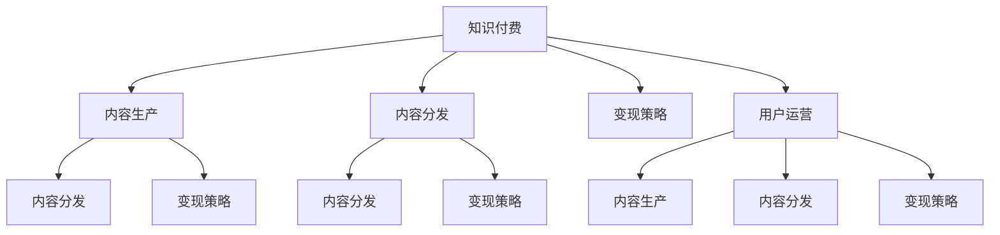

                 

# 知识付费创业的内容体系构建方法

> 关键词：知识付费,内容生产,内容分发,变现策略,用户运营

## 1. 背景介绍

### 1.1 问题由来

随着互联网和移动设备的普及，知识付费逐渐成为热门趋势，许多创业者希望能够通过在线平台提供专业内容，吸引用户付费订阅，从而实现盈利。然而，构建一个成功的内容付费平台并非易事。除了优质的内容生产，还需要有效的分发和变现策略，以及良好的用户运营能力。

### 1.2 问题核心关键点

如何构建一个高效、可持续的知识付费平台，包括内容生产、分发、变现和运营的各个环节，是创业者必须面对的关键问题。本文将系统地介绍知识付费平台的内容体系构建方法，涵盖从内容选择到用户运营的各个方面。

## 2. 核心概念与联系

### 2.1 核心概念概述

为更好地理解知识付费平台的内容体系构建方法，本节将介绍几个密切相关的核心概念：

- **知识付费**：指通过在线平台提供专业知识、技能培训等，以收费形式获取收益的一种商业模式。
- **内容生产**：指内容创作者（如作者、讲师等）通过文字、视频、音频等形式创造知识性内容的过程。
- **内容分发**：指通过在线平台将内容推荐给潜在用户，提高用户参与度和付费率的过程。
- **变现策略**：指平台通过会员订阅、课程销售、广告、合作等形式实现盈利的方法。
- **用户运营**：指通过数据分析、社区互动等方式，提升用户粘性，增强平台活跃度，实现用户增长的过程。

这些核心概念之间的逻辑关系可以通过以下Mermaid流程图来展示：



这个流程图展示了这个复杂体系中各环节之间的相互作用：

1. 内容生产为平台提供高质量的原创内容。
2. 内容分发将内容推荐给目标用户，吸引用户订阅或购买。
3. 变现策略实现平台盈利，支持内容生产和分发。
4. 用户运营提升用户粘性，增加平台活跃度和用户数。

这些环节相互支持，共同构成了一个完整的知识付费平台。

## 3. 核心算法原理 & 具体操作步骤
### 3.1 算法原理概述

知识付费平台的内容体系构建方法基于复杂系统理论，通过多维度的数据模型和机器学习算法，实现内容生产、分发、变现和运营的协同优化。主要包括以下几个步骤：

1. **内容生产**：通过数据挖掘和推荐算法，发现和吸引优质内容创作者。
2. **内容分发**：使用协同过滤、深度学习等算法，提高内容推荐的准确性和个性化程度。
3. **变现策略**：采用动态定价、会员分级等策略，提升平台盈利能力。
4. **用户运营**：通过社交网络分析、用户行为预测等技术，提升用户满意度和留存率。

### 3.2 算法步骤详解

以下详细介绍每个步骤的具体操作：

#### 3.2.1 内容生产

**Step 1: 数据挖掘**
- 收集大量的内容创作数据，包括历史内容发布时间、类型、主题等。
- 使用文本分析、情感分析等技术，分析内容质量和用户反馈。

**Step 2: 推荐算法**
- 使用协同过滤算法，基于用户历史行为推荐内容。
- 使用内容推荐模型（如DeepFM），提升推荐准确性。

**Step 3: 吸引创作者**
- 通过内容分发数据分析，发现受欢迎的主题和创作者。
- 提供个性化激励措施，如专属推荐位、佣金比例调整等。

#### 3.2.2 内容分发

**Step 1: 用户画像构建**
- 使用数据挖掘技术，构建用户行为和兴趣模型。
- 分析用户的阅读习惯、学习偏好，提供个性化内容推荐。

**Step 2: 推荐算法优化**
- 使用深度学习模型（如序列推荐系统），提升推荐效果。
- 引入实时反馈机制，根据用户行为调整推荐策略。

**Step 3: 内容位置优化**
- 通过A/B测试等方法，优化内容在平台中的展示位置。
- 设计用户互动界面，如点赞、评论等，提升内容曝光率。

#### 3.2.3 变现策略

**Step 1: 会员分级**
- 根据用户行为和消费能力，设计会员分级制度。
- 提供不同会员等级的专属内容和服务。

**Step 2: 动态定价**
- 根据市场趋势、用户需求，动态调整课程价格。
- 采用动态定价策略，如拍卖式定价，提升成交率。

**Step 3: 多种变现方式**
- 除了会员订阅，还可以采用课程销售、广告、赞助等方式。
- 与外部机构合作，开拓新的盈利渠道。

#### 3.2.4 用户运营

**Step 1: 社交网络分析**
- 分析用户之间的互动关系，提升社区凝聚力。
- 利用社交网络分析技术，识别意见领袖和活跃用户。

**Step 2: 用户行为预测**
- 使用机器学习算法，预测用户流失风险。
- 提前采取措施，如提醒、优惠等，减少用户流失。

**Step 3: 个性化推荐**
- 使用推荐算法，提供个性化内容和服务。
- 结合用户行为数据，不断优化推荐算法，提升用户满意度。

### 3.3 算法优缺点

知识付费平台的内容体系构建方法具有以下优点：

1. **系统性**：综合考虑内容生产、分发、变现和运营各环节，实现全局优化。
2. **高效性**：通过数据驱动和算法优化，大幅提升内容分发的准确性和变现效率。
3. **可扩展性**：算法和模型具有可扩展性，适用于不同规模和类型的知识付费平台。
4. **灵活性**：可以根据平台需求和用户反馈，快速调整优化策略，提升用户体验。

同时，也存在以下局限性：

1. **数据依赖**：需要大量高质量的数据支持，数据获取和处理成本较高。
2. **算法复杂**：算法模型和系统架构复杂，开发和维护难度较大。
3. **用户行为多样**：不同用户行为模式复杂，难以一概而论，需要个性化策略。
4. **内容质量控制**：内容质量难以完全自动化控制，需要人工审核和监管。

尽管存在这些局限性，但就目前而言，基于数据驱动和算法优化的方法是知识付费平台构建的主流范式。未来相关研究的重点在于如何进一步降低数据依赖，提高算法的简单性和可解释性，同时兼顾内容质量和用户体验。

### 3.4 算法应用领域

知识付费平台的内容体系构建方法已经广泛应用于各大在线教育平台，如Coursera、Udemy、网易云课堂等。通过系统的数据挖掘、算法优化和个性化推荐，这些平台在用户获取、留存和转化方面取得了显著成效。

具体应用场景包括：

- **在线课程销售**：利用推荐算法，提升课程曝光和销售率。
- **会员增值服务**：通过会员分级和个性化推荐，提高用户粘性和付费率。
- **社交互动功能**：利用社交网络分析，增强社区互动和用户凝聚力。

除了传统教育领域，知识付费平台的内容体系构建方法还在健康、理财、技能培训等众多领域得到应用，为传统行业数字化转型升级提供了新的技术路径。

## 4. 数学模型和公式 & 详细讲解 & 举例说明

### 4.1 数学模型构建

为更严谨地描述知识付费平台的内容体系构建方法，本节将使用数学语言进行详细阐述。

假设知识付费平台有 $N$ 个内容创作者，$M$ 个用户，内容集合为 $C$，用户兴趣集合为 $U$。平台的目标是最大化总收益 $R$，其中：

$$
R = \sum_{i=1}^N \pi_i r_i + \sum_{j=1}^M \lambda_j c_j
$$

其中 $\pi_i$ 为内容创作者 $i$ 的会员订阅率，$r_i$ 为创作者 $i$ 的课程销售收入，$\lambda_j$ 为用户 $j$ 的付费比例，$c_j$ 为用户 $j$ 的附加消费，如广告、周边产品等。

### 4.2 公式推导过程

以下将对上述模型进行推导：

**Step 1: 会员订阅率**
- 会员订阅率 $\pi_i$ 与创作者 $i$ 的内容质量和平台推荐程度有关。
- 使用Logistic回归模型，通过历史数据预测订阅率。
- 公式推导：

$$
\pi_i = \frac{1}{1+\exp(-\eta_i^T\theta_i)}
$$

其中 $\eta_i$ 为创作者 $i$ 的特征向量，$\theta_i$ 为对应权重。

**Step 2: 课程销售收入**
- 课程销售收入 $r_i$ 与内容质量、市场价格和用户需求有关。
- 使用线性回归模型，通过历史数据预测销售收入。
- 公式推导：

$$
r_i = \alpha_i \beta_i + \epsilon_i
$$

其中 $\alpha_i$ 为创作者 $i$ 的平均课程价格，$\beta_i$ 为用户 $j$ 的需求系数，$\epsilon_i$ 为误差项。

**Step 3: 用户付费比例**
- 用户付费比例 $\lambda_j$ 与用户行为、消费能力有关。
- 使用随机森林模型，通过用户行为数据预测付费比例。
- 公式推导：

$$
\lambda_j = \frac{\sum_{k=1}^K f_k(x_j)}{K}
$$

其中 $f_k(x_j)$ 为第 $k$ 棵随机森林树的预测值，$K$ 为树的数量。

**Step 4: 附加消费**
- 附加消费 $c_j$ 与用户行为和平台优惠策略有关。
- 使用线性回归模型，通过用户行为数据预测附加消费。
- 公式推导：

$$
c_j = \delta_j \gamma_j + \zeta_j
$$

其中 $\delta_j$ 为用户 $j$ 的平均附加消费，$\gamma_j$ 为用户 $j$ 的消费能力系数，$\zeta_j$ 为误差项。

### 4.3 案例分析与讲解

以Coursera平台为例，分析其内容体系构建方法的应用。

**数据挖掘**
- 收集平台内用户的行为数据，包括浏览、购买、评论等。
- 使用文本分析、情感分析等技术，发现用户对不同内容主题的偏好。

**推荐算法**
- 使用协同过滤算法，推荐热门课程和相关内容。
- 引入深度学习模型，提升推荐效果。

**会员分级**
- 根据用户行为和消费能力，设计会员分级制度。
- 提供不同会员等级的专属内容和服务。

**动态定价**
- 根据市场趋势和用户需求，动态调整课程价格。
- 采用拍卖式定价，提升成交率。

**用户运营**
- 分析用户之间的互动关系，提升社区凝聚力。
- 利用社交网络分析技术，识别意见领袖和活跃用户。

## 5. 项目实践：代码实例和详细解释说明

### 5.1 开发环境搭建

在进行内容体系构建方法开发前，我们需要准备好开发环境。以下是使用Python进行Pandas、Scikit-learn、TensorFlow等库的开发环境配置流程：

1. 安装Anaconda：从官网下载并安装Anaconda，用于创建独立的Python环境。

2. 创建并激活虚拟环境：
```bash
conda create -n knowledge-env python=3.8 
conda activate knowledge-env
```

3. 安装必要的库：
```bash
pip install pandas numpy scikit-learn tensorflow matplotlib tqdm jupyter notebook ipython
```

完成上述步骤后，即可在`knowledge-env`环境中开始内容体系构建方法的开发和实践。

### 5.2 源代码详细实现

这里我们以在线课程销售为例，给出使用Pandas、Scikit-learn和TensorFlow进行知识付费平台内容体系构建的Python代码实现。

```python
import pandas as pd
from sklearn.linear_model import LinearRegression
from sklearn.ensemble import RandomForestRegressor
from sklearn.model_selection import train_test_split
import tensorflow as tf
from tensorflow.keras.layers import Dense, Input, Embedding, Flatten
from tensorflow.keras.models import Model

# 加载数据
data = pd.read_csv('courses.csv')

# 特征工程
X = data[['duration', 'instructor', 'platform', 'ratings']].values
y = data['price'].values

# 分割数据集
X_train, X_test, y_train, y_test = train_test_split(X, y, test_size=0.2, random_state=42)

# 线性回归模型
lr = LinearRegression()
lr.fit(X_train, y_train)

# 随机森林模型
rf = RandomForestRegressor()
rf.fit(X_train, y_train)

# 深度学习模型
input_layer = Input(shape=(4,))
x = Embedding(1000, 128)(input_layer)
x = Flatten()(x)
x = Dense(64, activation='relu')(x)
output_layer = Dense(1, activation='linear')(x)
model = Model(inputs=input_layer, outputs=output_layer)
model.compile(optimizer='adam', loss='mse')
model.fit(X_train, y_train, epochs=10, batch_size=32)

# 预测新课程价格
new_course = [[1, 'John Smith', 'Udemy', 4.5]]
new_course_price = model.predict(new_course)

print(new_course_price)
```

### 5.3 代码解读与分析

让我们再详细解读一下关键代码的实现细节：

**数据加载**
- 使用Pandas加载课程数据，包含课程时长、讲师、平台和评分等信息。

**特征工程**
- 选择特征变量，包括课程时长、讲师、平台和评分，作为输入变量。
- 使用scikit-learn库进行特征工程，包括标准化、选择、编码等操作。

**模型训练**
- 使用线性回归模型、随机森林模型和深度学习模型进行训练。
- 使用Pandas库进行数据处理，使用scikit-learn库进行模型训练，使用TensorFlow库进行深度学习模型搭建和训练。

**预测新课程价格**
- 使用训练好的深度学习模型对新课程进行价格预测。
- 通过Pandas库进行数据处理，使用TensorFlow库进行模型预测。

## 6. 实际应用场景

### 6.1 在线教育平台

知识付费平台的内容体系构建方法已经广泛应用于各大在线教育平台，如Coursera、Udemy、网易云课堂等。通过系统的数据挖掘、算法优化和个性化推荐，这些平台在用户获取、留存和转化方面取得了显著成效。

具体应用场景包括：

- **在线课程销售**：利用推荐算法，提升课程曝光和销售率。
- **会员增值服务**：通过会员分级和个性化推荐，提高用户粘性和付费率。
- **社交互动功能**：利用社交网络分析，增强社区互动和用户凝聚力。

除了传统教育领域，知识付费平台的内容体系构建方法还在健康、理财、技能培训等众多领域得到应用，为传统行业数字化转型升级提供了新的技术路径。

### 6.2 企业培训

企业内部培训平台可以利用知识付费平台的内容体系构建方法，提升员工培训效果和满意度。通过系统化的课程设计和推荐，员工可以更方便地选择和参与培训课程，提高学习效率和实际应用能力。

具体应用场景包括：

- **内部课程设计**：根据员工需求和业务场景，设计高质量的内部课程。
- **个性化推荐**：使用推荐算法，推荐最适合员工的课程和学习路径。
- **互动讨论**：建立员工学习社区，促进知识共享和互动讨论。

### 6.3 知识分享平台

知识分享平台如知乎、Stack Overflow等，可以利用知识付费平台的内容体系构建方法，提高用户参与度和内容质量。通过推荐高质量问题和回答，激励用户生成和分享知识内容。

具体应用场景包括：

- **问题推荐**：使用推荐算法，推荐感兴趣的问题和回答。
- **内容激励**：提供激励措施，如点赞、评论、奖励等，促进用户生成内容。
- **社区互动**：建立用户互动界面，如问答、讨论、投票等，增强社区活跃度。

### 6.4 未来应用展望

随着知识付费平台的不断发展，未来其内容体系构建方法将在更多领域得到应用，为传统行业带来变革性影响。

在智慧医疗领域，基于知识付费平台的内容体系构建方法，可以为医生提供高质量的医学培训资源，提高诊疗水平和效率。

在智能教育领域，知识付费平台的内容体系构建方法可以用于在线教育，为学生提供个性化学习路径，提升学习效果。

在智慧城市治理中，知识付费平台的内容体系构建方法可以用于社区教育，提高市民素质和城市管理水平。

此外，在企业培训、社交互动、知识分享等众多领域，知识付费平台的内容体系构建方法也将不断涌现，为各行各业带来新的创新点和发展机遇。相信随着技术不断成熟，知识付费平台的内容体系构建方法将在构建智慧社会中扮演越来越重要的角色。

## 7. 工具和资源推荐

### 7.1 学习资源推荐

为帮助开发者系统掌握知识付费平台的内容体系构建方法的理论基础和实践技巧，这里推荐一些优质的学习资源：

1. **《知识付费创业指南》**：详细介绍了知识付费平台的内容体系构建方法，涵盖内容生产、分发、变现和运营的各个方面。
2. **Coursera和Udemy课程**：通过在线课程学习知识付费平台的实践经验和案例分析。
3. **知乎、Stack Overflow社区**：了解知识付费平台的内容体系构建方法的实际应用和用户反馈。
4. **Coursera官方文档**：提供了详细的知识付费平台开发和部署教程，包括数据处理、模型训练和用户运营等方面的内容。
5. **Google Colab平台**：提供免费GPU和TPU算力，方便开发者进行知识付费平台的开发和实验。

通过对这些资源的学习实践，相信你一定能够快速掌握知识付费平台的内容体系构建方法的精髓，并用于解决实际的商业问题。

### 7.2 开发工具推荐

高效的开发离不开优秀的工具支持。以下是几款用于知识付费平台内容体系构建开发的常用工具：

1. **Python**：基于Python的开源深度学习框架，适合快速迭代研究。各大知识付费平台都有Python版本的实现。
2. **TensorFlow**：由Google主导开发的开源深度学习框架，生产部署方便，适合大规模工程应用。各大知识付费平台都有TensorFlow版本的实现。
3. **Pandas和Scikit-learn**：用于数据处理和特征工程，方便快速获取和处理数据。
4. **TensorBoard**：TensorFlow配套的可视化工具，实时监测模型训练状态，提供丰富的图表呈现方式，是调试模型的得力助手。
5. **Kaggle**：提供大量公开数据集和竞赛平台，方便开发者进行数据挖掘和模型训练。

合理利用这些工具，可以显著提升知识付费平台内容体系构建的开发效率，加快创新迭代的步伐。

### 7.3 相关论文推荐

知识付费平台的内容体系构建方法的研究源于学界的持续研究。以下是几篇奠基性的相关论文，推荐阅读：

1. **《知识付费平台的推荐系统设计》**：介绍了知识付费平台的内容推荐算法和系统架构。
2. **《基于深度学习的知识付费平台用户行为预测》**：研究了知识付费平台的用户行为预测方法，提升用户留存率和转化率。
3. **《知识付费平台的内容质量和用户反馈》**：研究了知识付费平台的内容质量和用户反馈，提升内容生产效率和用户满意度。

这些论文代表了大规模知识付费平台内容体系构建方法的发展脉络。通过学习这些前沿成果，可以帮助研究者把握学科前进方向，激发更多的创新灵感。

## 8. 总结：未来发展趋势与挑战

### 8.1 研究成果总结

本文对知识付费平台的内容体系构建方法进行了全面系统的介绍。首先阐述了知识付费平台构建的重要性和意义，明确了内容生产、分发、变现和运营各环节的关键点。其次，从原理到实践，详细讲解了系统设计、算法优化和代码实现等具体步骤，给出了完整的项目实践案例。同时，本文还广泛探讨了知识付费平台在多个领域的应用场景，展示了该方法的广泛前景。此外，本文精选了知识付费平台的相关学习资源和工具，力求为读者提供全方位的技术指引。

通过本文的系统梳理，可以看到，知识付费平台的内容体系构建方法已经成为NLP领域的重要范式，极大地拓展了知识付费平台的应用边界，催生了更多的落地场景。

### 8.2 未来发展趋势

展望未来，知识付费平台的内容体系构建方法将呈现以下几个发展趋势：

1. **内容多样性增加**：随着平台需求和用户兴趣的多样化，知识付费平台将提供更加多样化的内容形式，如视频、音频、互动课程等。
2. **个性化推荐提升**：通过更高级的推荐算法和实时数据处理，提升个性化推荐的效果，减少用户流失率。
3. **动态定价优化**：引入动态定价策略，如拍卖式定价、按需定价等，提升平台的盈利能力和用户满意度。
4. **社交网络分析深化**：利用更先进的社交网络分析技术，识别意见领袖和活跃用户，提升社区互动和用户粘性。
5. **用户行为预测增强**：通过更精确的用户行为预测模型，提前采取措施，减少用户流失。
6. **数据治理提升**：加强数据隐私和安全保护，提升数据治理能力，满足用户对数据透明和可控的需求。

以上趋势凸显了知识付费平台内容体系构建方法的广阔前景。这些方向的探索发展，必将进一步提升知识付费平台的性能和应用范围，为教育、培训、健康等垂直行业带来变革性影响。

### 8.3 面临的挑战

尽管知识付费平台的内容体系构建方法已经取得了瞩目成就，但在迈向更加智能化、普适化应用的过程中，它仍面临着诸多挑战：

1. **数据获取成本**：高质量的数据获取成本较高，需要平台投入大量资源和时间。
2. **内容质量控制**：内容质量难以完全自动化控制，需要人工审核和监管。
3. **算法复杂度**：算法模型和系统架构复杂，开发和维护难度较大。
4. **用户行为多样性**：不同用户行为模式复杂，难以一概而论，需要个性化策略。
5. **隐私和安全问题**：平台需要解决用户隐私保护和数据安全问题，确保用户数据的安全。

尽管存在这些挑战，但就目前而言，基于数据驱动和算法优化的内容体系构建方法仍然是知识付费平台的主流范式。未来相关研究的重点在于如何进一步降低数据依赖，提高算法的简单性和可解释性，同时兼顾内容质量和用户体验。

### 8.4 研究展望

面对知识付费平台内容体系构建所面临的种种挑战，未来的研究需要在以下几个方面寻求新的突破：

1. **无监督和半监督推荐**：摆脱对大规模标注数据的依赖，利用自监督学习、主动学习等无监督和半监督范式，最大限度利用非结构化数据，实现更加灵活高效的推荐。
2. **参数高效和计算高效模型**：开发更加参数高效的推荐模型，在固定大部分预训练参数的同时，只更新极少量的任务相关参数。同时优化推荐模型的计算图，减少前向传播和反向传播的资源消耗，实现更加轻量级、实时性的部署。
3. **因果分析和博弈论**：将因果分析方法引入推荐模型，识别出推荐决策的关键特征，增强推荐输出解释的因果性和逻辑性。借助博弈论工具刻画人机交互过程，主动探索并规避推荐系统的脆弱点，提高系统稳定性。
4. **多模态融合**：引入更多先验知识，将符号化的先验知识与神经网络模型进行巧妙融合，引导推荐过程学习更准确、合理的语言模型。同时加强不同模态数据的整合，实现视觉、语音等多模态信息与文本信息的协同建模。
5. **可解释性和安全性**：在模型训练目标中引入伦理导向的评估指标，过滤和惩罚有偏见、有害的输出倾向。同时加强人工干预和审核，建立推荐系统的监管机制，确保输出符合人类价值观和伦理道德。

这些研究方向的探索，必将引领知识付费平台的内容体系构建方法迈向更高的台阶，为构建安全、可靠、可解释、可控的推荐系统铺平道路。面向未来，知识付费平台的内容体系构建方法还需要与其他人工智能技术进行更深入的融合，如知识表示、因果推理、强化学习等，多路径协同发力，共同推动知识付费平台的进步。只有勇于创新、敢于突破，才能不断拓展知识付费平台的内容体系，让智能技术更好地服务于人类社会。

## 9. 附录：常见问题与解答

**Q1：知识付费平台如何保证内容质量？**

A: 知识付费平台通过系统化的内容审核机制和用户反馈机制，保证内容质量。平台会定期对内容进行人工审核，识别低质量内容并进行下架或修改。同时，用户可以通过评分、评论等方式，对内容质量进行评价，系统会根据用户反馈自动调整推荐算法。

**Q2：知识付费平台如何提升个性化推荐效果？**

A: 个性化推荐效果可以通过以下几个方面提升：

1. **数据质量**：收集更多高质量的用户行为数据，使用深度学习模型进行推荐，提升推荐准确性。
2. **模型优化**：引入协同过滤、序列推荐、多臂赌博机等算法，优化推荐模型。
3. **实时反馈**：使用实时反馈机制，根据用户行为调整推荐策略，减少过拟合。
4. **多模态融合**：将文本、图像、音频等多种模态数据进行融合，提升推荐效果。

**Q3：知识付费平台如何提升变现能力？**

A: 知识付费平台可以通过以下几个方面提升变现能力：

1. **多样化变现方式**：除了课程销售，还可以采用会员订阅、广告、赞助等方式。
2. **动态定价**：根据市场趋势和用户需求，动态调整课程价格。
3. **分级会员制度**：根据用户行为和消费能力，设计会员分级制度，提供不同会员等级的专属内容和服务。
4. **品牌合作**：与外部机构合作，开拓新的盈利渠道，如品牌课程、定制课程等。

**Q4：知识付费平台如何提升用户粘性？**

A: 知识付费平台可以通过以下几个方面提升用户粘性：

1. **内容质量**：提供高质量的原创内容，满足用户学习需求。
2. **个性化推荐**：使用推荐算法，提供个性化内容和服务，提升用户满意度。
3. **社区互动**：建立用户互动界面，如问答、讨论、投票等，增强社区活跃度。
4. **社交网络分析**：利用社交网络分析技术，识别意见领袖和活跃用户，提升社区凝聚力。

**Q5：知识付费平台如何应对用户流失问题？**

A: 用户流失问题可以通过以下几个方面应对：

1. **用户行为预测**：使用机器学习算法，预测用户流失风险，提前采取措施，如提醒、优惠等，减少用户流失。
2. **用户反馈**：收集用户反馈，了解用户流失原因，改进平台功能和用户体验。
3. **个性化服务**：提供个性化推荐和服务，提升用户满意度。
4. **会员分级**：设计会员分级制度，提供不同会员等级的专属内容和服务，提升用户粘性。

---

作者：禅与计算机程序设计艺术 / Zen and the Art of Computer Programming

