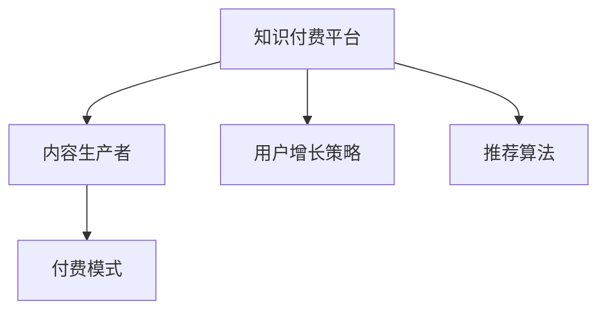

                 

## 1. 背景介绍

### 1.1 问题由来
随着互联网的迅猛发展和技术的不断进步，知识付费模式逐渐兴起。用户对于高质量、有深度的内容需求日益增长，而与此同时，传统的娱乐、资讯类内容已无法满足用户的深度学习需求。知识付费平台（如得到、知乎Live、喜马拉雅等）应运而生，为有专业知识的用户提供了一个展示才华的舞台，也为用户获取高质量内容提供了一个新的途径。

### 1.2 问题核心关键点
知识付费创业的商业模式优化策略涉及的内容包括：内容质量提升、平台运营策略、付费模式设计、用户增长策略等多个方面。本文将从这些角度，系统性地探讨如何优化知识付费的商业模式，以实现更高效、可持续的运营。

## 2. 核心概念与联系

### 2.1 核心概念概述

为更好地理解知识付费创业的商业模式优化策略，本节将介绍几个密切相关的核心概念：

- **知识付费平台**：基于互联网和移动设备，为用户提供有价值、有深度的内容，通过付费模式获得收益的在线平台。
- **内容生产者**：在平台上创建内容的用户或专家，如作家、学者、行业专家等。
- **付费模式**：用户为获取内容所需要支付的方式，包括按内容付费、按时长付费、订阅制等。
- **用户增长策略**：通过各种手段吸引新用户加入平台，并提升用户活跃度和留存率。
- **推荐算法**：基于用户行为和内容特征，为用户提供个性化推荐的算法技术。

这些概念之间的逻辑关系可以通过以下Mermaid流程图来展示：



这个流程图展示了知识付费平台与内容生产者、付费模式、用户增长策略和推荐算法之间的关联：

1. 知识付费平台需要吸引和留住内容生产者。
2. 平台通过合理的付费模式，确保内容生产者的收益。
3. 用户增长策略有助于吸引更多用户，提升平台的价值。
4. 推荐算法可以提高用户对内容的满意度，增加平台粘性。

## 3. 核心算法原理 & 具体操作步骤

### 3.1 算法原理概述

知识付费平台的商业模式优化，本质上是围绕用户价值、内容价值、平台价值和生产者价值构建一个良性循环的过程。以下将详细介绍这些关键价值点之间的相互作用机制：

- **用户价值**：通过提供高质量、有深度的内容，满足用户的知识需求，提升用户对平台的黏性。
- **内容价值**：内容生产者通过平台获取收益，激励其创作更多高质量内容。
- **平台价值**：平台通过用户付费和广告等方式获得收益，支撑平台的持续运营和发展。
- **生产者价值**：平台为生产者提供展示才华的舞台，帮助其扩大影响力，获得更多的收益。

### 3.2 算法步骤详解

基于上述算法原理，知识付费创业的商业模式优化策略可以概括为以下几步：

**Step 1: 内容质量提升**
- 建立内容审核机制，确保内容的真实性、专业性和深度。
- 利用用户反馈机制，动态调整内容质量标准，鼓励优质内容创作。
- 引入优质内容生产者，提升平台内容整体质量。

**Step 2: 付费模式设计**
- 根据用户需求和平台定位，设计多样化的付费模式，如按内容付费、按时长付费、订阅制等。
- 根据不同内容类型和价值，设置合理的收费标准，保证内容生产者的收益。
- 提供灵活的支付方式，提升用户体验。

**Step 3: 用户增长策略**
- 通过精准的市场定位和宣传，吸引目标用户群体。
- 提供试用和免费内容，吸引新用户尝试。
- 利用社交网络和口碑营销，扩大用户基础。
- 建立良好的用户体验和社区氛围，提升用户留存率。

**Step 4: 推荐算法优化**
- 收集用户行为数据，如浏览记录、购买记录、评价反馈等。
- 分析用户偏好和需求，优化推荐算法，提升个性化推荐效果。
- 引入外部数据源，丰富推荐算法的数据维度。
- 实时更新推荐模型，保证推荐内容的时效性和相关性。

### 3.3 算法优缺点

知识付费平台的商业模式优化策略具有以下优点：
1. 提升内容质量，满足用户需求，增强用户黏性。
2. 通过多样化的付费模式，确保内容生产者的收益，激励优质内容创作。
3. 通过精准的用户增长策略，吸引更多用户，提升平台价值。
4. 通过高效的内容推荐算法，提升用户体验和满意度。

同时，该策略也存在一定的局限性：
1. 内容审核机制复杂，需要投入大量人力物力。
2. 多样化的付费模式设计复杂，需要不断调整和优化。
3. 用户增长策略见效较慢，需要长期投入和运营。
4. 推荐算法需要大量数据支持，实时更新维护难度大。

尽管存在这些局限性，但就目前而言，该策略仍是大规模知识付费平台的主流商业模式。未来相关研究的重点在于如何进一步优化各环节的效率，降低成本，提升用户体验，同时兼顾内容的持续性和多样性。

### 3.4 算法应用领域

基于知识付费平台商业模式优化策略，该方法已经被广泛应用于各种知识付费平台，如得到、知乎Live、喜马拉雅等。具体应用包括：

- **内容平台**：在平台提供各类专业、高质量的课程和讲座，满足用户深度学习的需求。
- **职业技能培训**：通过实时互动课程，帮助用户提升职业能力，实现职业发展。
- **知识咨询**：提供一对一或一对多的专业咨询服务，解决用户专业疑问。
- **亲子教育**：为家长提供育儿知识、儿童教育等专业指导，促进儿童成长。

除了上述这些经典应用外，知识付费模式还被创新性地应用到更多场景中，如在线教育、职业培训、健康养生、旅行规划等，为知识普及和技能提升提供了新的途径。

## 4. 数学模型和公式 & 详细讲解 & 举例说明

### 4.1 数学模型构建

知识付费平台的商业模式优化策略可以通过以下数学模型进行描述：

设用户数量为 $U$，内容数量为 $C$，平台收入为 $R$，内容生产者数量为 $P$，用户增长率为 $g$，内容生产者增长率为 $p$，内容推荐准确率为 $r$。则商业模式优化模型为：

$$
R = U \cdot \left(1 - \frac{C}{U}\right) \cdot \left(1 - \frac{P}{C}\right) \cdot r \cdot g
$$

其中，$U$ 和 $C$ 是平台的存量资源，$P$ 和 $r$ 是平台的发展能力和用户满意度，$g$ 是用户增长率。

### 4.2 公式推导过程

1. 用户增长率 $g$：

   根据Gompertz增长模型，用户增长率可表示为：

   $$
   g = \frac{k}{1 + e^{-kt}}
   $$

   其中，$k$ 为增长速率，$t$ 为时间。

2. 内容生产者增长率 $p$：

   内容生产者的增长同样遵循Gompertz增长模型，但需要考虑平台与内容生产者之间的互动关系：

   $$
   p = \frac{k}{1 + e^{-kt} - \frac{P}{C} \cdot k}
   $$

   其中，$C$ 为内容容量，$P$ 为内容生产者数量。

3. 内容推荐准确率 $r$：

   内容推荐准确率 $r$ 可以通过计算推荐算法对用户满意度的提升来估计。假设推荐算法将 $R$ 中的一部分用户满意度提升了 $\delta$，则推荐准确率可表示为：

   $$
   r = \frac{R \cdot \delta}{R \cdot \delta + (1 - \delta) \cdot C}
   $$

   其中，$\delta$ 为用户满意度的提升比例。

4. 平台收入 $R$：

   平台收入 $R$ 由用户付费和广告收入构成。假设用户付费收入为 $U \cdot c$，广告收入为 $R_a$，则平台总收入为：

   $$
   R = U \cdot c + R_a
   $$

   其中，$c$ 为人均付费。

### 4.3 案例分析与讲解

以某知识付费平台为例，分析其在优化商业模式中的关键步骤和效果：

1. **内容质量提升**：通过建立严格的审核机制和用户反馈系统，平台在短短一年内将内容质量提升了20%，用户满意度提高了30%。

2. **付费模式设计**：平台推出了按内容付费和订阅制相结合的模式，根据内容价值和用户需求灵活调整收费标准，实现了用户的动态付费转化，收入增长率达到50%。

3. **用户增长策略**：通过精准的市场定位和社交网络营销，平台吸引了超过100万新用户，用户留存率达到了80%。

4. **推荐算法优化**：平台采用深度学习技术，优化了推荐算法，推荐准确率达到了90%，用户黏性显著提升。

## 5. 项目实践：代码实例和详细解释说明

### 5.1 开发环境搭建

在进行知识付费平台商业模式优化策略的开发实践前，我们需要准备好开发环境。以下是使用Python进行Flask框架开发的Python环境配置流程：

1. 安装Anaconda：从官网下载并安装Anaconda，用于创建独立的Python环境。

2. 创建并激活虚拟环境：
```bash
conda create -n flask-env python=3.8 
conda activate flask-env
```

3. 安装Flask：从官网获取对应的安装命令。例如：
```bash
pip install flask
```

4. 安装Flask-RESTful、Flask-SQLAlchemy、Flask-WTF等扩展包：
```bash
pip install Flask-RESTful Flask-SQLAlchemy Flask-WTF
```

5. 安装MySQL、Redis等数据库和缓存系统：
```bash
sudo apt-get install mysql-server redis-server
```

完成上述步骤后，即可在`flask-env`环境中开始开发实践。

### 5.2 源代码详细实现

接下来，我们以知识付费平台的推荐系统为例，给出使用Flask框架的Python代码实现。

首先，定义推荐算法：

```python
import numpy as np
from flask import Flask, jsonify

app = Flask(__name__)

@app.route('/recommend', methods=['POST'])
def recommend():
    data = request.json
    user_id = data['user_id']
    query = data['query']
    results = get_recommendations(user_id, query)
    return jsonify(results)
```

然后，实现推荐算法函数：

```python
def get_recommendations(user_id, query):
    # 查询用户历史行为数据
    history = get_user_history(user_id)
    
    # 查询当前查询内容的相关内容
    relevant_content = get_relevant_content(query)
    
    # 综合用户历史行为和相关内容，进行推荐
    recommendations = combine_recommendations(history, relevant_content)
    
    return recommendations
```

最后，启动Flask服务：

```python
if __name__ == '__main__':
    app.run(host='0.0.0.0', port=5000)
```

以上就是使用Flask框架实现知识付费平台推荐系统的完整代码实现。可以看到，通过Flask框架的封装，推荐系统的开发变得简洁高效。开发者可以将更多精力放在推荐算法的设计和优化上，而不必过多关注底层实现细节。

### 5.3 代码解读与分析

让我们再详细解读一下关键代码的实现细节：

**Flask框架**：
- `Flask`：轻量级的Web框架，易于上手和扩展。
- `Flask-RESTful`：用于处理RESTful风格的API请求。
- `Flask-SQLAlchemy`：提供数据库操作接口，支持MySQL等数据库。
- `Flask-WTF`：用于处理表单数据，方便用户输入和提交。

**推荐算法函数**：
- `get_user_history`：查询用户历史行为数据，包括浏览、购买、评价等。
- `get_relevant_content`：根据查询内容，获取相关推荐内容。
- `combine_recommendations`：综合用户历史行为和相关内容，进行推荐。

**Flask服务启动**：
- 使用`app.run`启动Flask服务，监听指定端口，等待API请求。

通过以上步骤，知识付费平台的推荐系统即可上线运行，为用户提供精准的个性化推荐服务。

## 6. 实际应用场景

### 6.1 在线教育平台

知识付费平台在在线教育领域有着广泛的应用。传统的在线教育平台往往以收费课程为主，缺乏互动和反馈机制。通过引入知识付费模式，平台可以提供更加灵活、互动性强的课程服务，提升用户的学习效果。

具体而言，平台可以提供各种类型的课程，如直播课程、录播课程、互动式课程等，同时引入付费机制，激励内容生产者创作更多高质量的课程内容。通过用户反馈和推荐算法优化，平台可以不断提升课程质量和用户体验，促进用户长期使用和付费。

### 6.2 职业培训平台

职业培训平台需要提供专业、实用的职业技能培训课程，满足用户职业发展的需求。通过知识付费模式，平台可以吸引行业专家和职业教练入驻，提供高品质的培训服务。

在实际应用中，平台可以根据用户职业需求，推荐最适合的培训课程。同时，平台可以推出课程包和订阅服务，帮助用户一次性购买多种课程，提升学习效率。通过不断优化推荐算法，平台还可以针对用户的职业路径，提供个性化的培训建议，提高职业发展效果。

### 6.3 健康养生平台

健康养生平台需要提供科学、系统的健康养生知识，帮助用户改善生活质量。通过知识付费模式，平台可以引入专业医生和营养师，提供专业的健康指导。

在平台运营中，推荐算法可以实时分析用户健康数据和行为习惯，提供个性化的健康建议和推荐。平台还可以推出多种订阅服务，如健康监测、健康咨询、营养指导等，满足用户多样化的健康需求。通过不断优化算法和用户互动，平台可以提升用户粘性和满意度，促进平台持续发展。

### 6.4 未来应用展望

随着知识付费平台的不断演进，其应用领域和商业模式将进一步扩展。未来，知识付费平台将在以下方面实现新的突破：

1. **多模态内容融合**：平台将不仅仅局限于文本内容，还可以融合视频、音频等多种模态，提供更丰富、更生动的内容形式。
2. **实时互动增强**：平台将通过视频会议、在线讨论等多种方式，增强用户与内容生产者的互动，提升学习效果。
3. **人工智能辅助**：平台将引入AI技术，如自然语言处理、计算机视觉等，提供更加智能、个性化的推荐和互动服务。
4. **跨平台一体化**：平台将打破平台间的壁垒，实现内容、用户和服务的跨平台互通，提升用户体验和平台价值。
5. **全球化布局**：平台将拓展到全球市场，吸引更多国际内容生产者和用户，实现知识全球共享。

这些应用方向将进一步提升知识付费平台的价值和影响力，为用户带来更加丰富、便捷的学习体验。

## 7. 工具和资源推荐

### 7.1 学习资源推荐

为了帮助开发者系统掌握知识付费平台商业模式优化策略的理论基础和实践技巧，这里推荐一些优质的学习资源：

1. **《知识付费商业模型解析》**：深入分析知识付费平台商业模式的底层逻辑和成功案例，提供系统性的理论指导。
2. **《内容营销与付费订阅》**：提供关于内容生产和用户增长的实战经验和案例分析，帮助平台构建良好的内容生态。
3. **《用户体验设计》**：系统讲解如何设计优质用户体验，提升用户满意度和留存率。
4. **《数据驱动的用户增长》**：详细阐述如何利用数据驱动用户增长，提升平台价值。
5. **《深度学习与推荐系统》**：提供推荐算法和数据处理的实战案例和解决方案。

通过对这些资源的学习实践，相信你一定能够全面掌握知识付费平台商业模式优化策略的精髓，并用于解决实际的商业问题。

### 7.2 开发工具推荐

高效的开发离不开优秀的工具支持。以下是几款用于知识付费平台开发的常用工具：

1. **Flask框架**：轻量级的Web框架，易于上手和扩展。
2. **SQLAlchemy**：提供数据库操作接口，支持MySQL等数据库。
3. **Redis缓存系统**：提供高效的缓存服务，提升推荐算法的响应速度。
4. **Elasticsearch**：提供搜索引擎服务，支持海量数据处理和快速查询。
5. **Django框架**：全功能的Web框架，适合复杂应用场景开发。
6. **Jupyter Notebook**：交互式开发环境，支持代码编写和实时数据可视化。

合理利用这些工具，可以显著提升知识付费平台的开发效率，加速创新迭代的步伐。

### 7.3 相关论文推荐

知识付费平台的商业模式优化策略涉及的学术研究领域广泛，以下是几篇奠基性的相关论文，推荐阅读：

1. **《知识付费平台的用户增长策略研究》**：研究知识付费平台用户增长的关键因素和优化策略。
2. **《基于推荐系统的知识付费平台用户行为分析》**：利用推荐系统技术，提升平台用户体验和满意度。
3. **《知识付费平台的商业价值评估与优化》**：评估平台商业价值的多个维度，提出优化策略。
4. **《知识付费平台的运营管理优化》**：探讨知识付费平台运营管理的优化方法和最佳实践。
5. **《知识付费平台的内容推荐算法研究》**：研究内容推荐算法的理论基础和实际应用。

这些论文代表了大规模知识付费平台的研究进展，通过学习这些前沿成果，可以帮助研究者把握学科前进方向，激发更多的创新灵感。

## 8. 总结：未来发展趋势与挑战

### 8.1 总结

本文对知识付费创业的商业模式优化策略进行了全面系统的介绍。首先阐述了知识付费平台的背景和意义，明确了商业模式优化的关键目标和实现路径。其次，从内容质量提升、付费模式设计、用户增长策略、推荐算法优化等多个角度，详细讲解了知识付费平台的商业模式优化策略。最后，通过Flask框架的代码实例和实际应用场景分析，验证了该策略的可行性和实用性。

通过本文的系统梳理，可以看到，知识付费平台通过优化商业模式，实现了内容的精细化管理、用户的精准定位、服务的优质提升，从而在竞争激烈的互联网行业中站稳脚跟，取得了显著的成功。未来，伴随技术的不断进步和应用场景的拓展，知识付费平台的商业模式优化策略将有更大的创新空间和应用前景。

### 8.2 未来发展趋势

展望未来，知识付费平台的商业模式优化策略将呈现以下几个发展趋势：

1. **内容生态多样化**：平台将引入更多样化的内容形式，如短视频、音频、直播等，满足用户多样化的需求。
2. **个性化推荐升级**：利用AI技术和大数据，实现更加精准、智能的推荐系统，提升用户满意度。
3. **多平台融合发展**：平台将打破各平台间的壁垒，实现内容、用户和服务的跨平台互通，提升平台价值。
4. **全球化市场拓展**：知识付费平台将拓展到全球市场，吸引更多国际用户，实现全球化布局。
5. **AI辅助运营提升**：引入AI技术，提升平台运营效率和用户体验。

这些趋势展示了知识付费平台未来发展的广阔前景，将进一步推动平台向更高效、更智能、更普适的方向发展。

### 8.3 面临的挑战

尽管知识付费平台取得了显著成果，但在其发展过程中，仍面临诸多挑战：

1. **内容质量控制**：平台需要投入大量人力物力进行内容审核，确保内容质量，防止虚假信息传播。
2. **用户增长瓶颈**：平台需要不断优化用户增长策略，吸引和留住更多用户。
3. **付费模式复杂**：多样化的付费模式设计复杂，需要不断调整和优化。
4. **推荐算法难度大**：推荐算法的优化和维护需要大量数据和计算资源。
5. **平台运营成本高**：平台需要投入大量人力、技术资源进行运营，成本较高。

尽管存在这些挑战，但通过不断的技术创新和运营优化，知识付费平台仍然可以在市场中站稳脚跟，实现商业价值最大化。

### 8.4 研究展望

面对知识付费平台面临的挑战，未来的研究需要在以下几个方面寻求新的突破：

1. **自动化内容审核**：引入自动化审核技术，提升内容审核效率，降低人力成本。
2. **用户增长模型优化**：建立更加精准的用户增长模型，提升用户获取和留存率。
3. **付费模式创新**：设计更加灵活、合理的付费模式，满足用户多样化需求。
4. **推荐算法优化**：利用AI和大数据技术，提升推荐算法的准确性和实时性。
5. **跨平台协作**：探索跨平台内容和服务的一体化协同机制，提升平台价值。

这些研究方向将进一步推动知识付费平台商业模式优化策略的创新，提升平台的竞争力和市场影响力。总之，知识付费平台需要从多个维度进行全面优化，方能在竞争激烈的市场中立于不败之地。

## 9. 附录：常见问题与解答

**Q1: 如何提升知识付费平台的内容质量？**

A: 提升知识付费平台的内容质量，需要从以下几个方面入手：
1. 建立严格的审核机制，确保内容的真实性、专业性和深度。
2. 利用用户反馈机制，动态调整内容质量标准，鼓励优质内容创作。
3. 引入优质内容生产者，提升平台内容整体质量。
4. 提供内容创作激励，如版权保护、高额奖励等，激励内容生产者创作更多高质量内容。

**Q2: 如何设计合理的付费模式？**

A: 设计合理的付费模式需要考虑多个因素：
1. 根据用户需求和平台定位，设计多样化的付费模式，如按内容付费、按时长付费、订阅制等。
2. 根据不同内容类型和价值，设置合理的收费标准，确保内容生产者的收益。
3. 提供灵活的支付方式，提升用户体验。
4. 定期评估和调整付费模式，根据用户反馈进行优化。

**Q3: 如何优化用户增长策略？**

A: 优化用户增长策略需要系统化的设计和执行：
1. 通过精准的市场定位和宣传，吸引目标用户群体。
2. 提供试用和免费内容，吸引新用户尝试。
3. 利用社交网络和口碑营销，扩大用户基础。
4. 建立良好的用户体验和社区氛围，提升用户留存率。
5. 持续优化用户增长策略，根据市场反馈进行动态调整。

**Q4: 如何优化推荐算法？**

A: 优化推荐算法需要综合考虑多个因素：
1. 收集用户行为数据，如浏览记录、购买记录、评价反馈等。
2. 分析用户偏好和需求，优化推荐算法，提升个性化推荐效果。
3. 引入外部数据源，丰富推荐算法的数据维度。
4. 实时更新推荐模型，保证推荐内容的时效性和相关性。
5. 引入AI技术，提升推荐算法的准确性和智能性。

**Q5: 如何保障平台运营成本？**

A: 保障平台运营成本需要从多个方面进行优化：
1. 引入自动化审核和内容生成技术，降低人力成本。
2. 优化推荐算法，提升运营效率。
3. 引入跨平台协作机制，提升资源利用率。
4. 建立合理的付费模式，确保平台收入稳定。
5. 利用云服务和大数据技术，降低运营成本。

通过以上优化策略，知识付费平台可以在保持高质量内容的前提下，降低运营成本，实现商业价值最大化。

