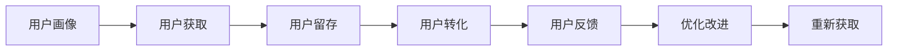

                 

## 1. 背景介绍

### 1.1 问题由来

随着知识付费市场的快速发展，越来越多的知识付费平台出现，如得到、樊登读书、喜马拉雅等，这些平台涵盖了科技、文化、职场、心理等多个领域。然而，尽管用户增长迅速，许多平台的盈利模式仍显单一，知识付费的商业模式也面临诸多挑战。

面对知识付费市场的激烈竞争和用户需求的多样化，平台如何精准触达目标用户群体、提高用户黏性和留存率，成为了亟待解决的问题。为此，本文旨在深入探讨用户运营策略，助力知识付费平台构建可持续发展的商业模式，提升用户体验和平台价值。

### 1.2 问题核心关键点

在知识付费平台的用户运营中，核心问题包括：

- **目标用户精准识别**：如何定位核心用户群体，制定精准的用户画像和营销策略？
- **用户获取与留存**：如何通过优质内容和个性化推荐，吸引用户订阅，提升用户活跃度和留存率？
- **用户价值最大化**：如何挖掘用户需求，提供高质量内容和服务，提升用户转化和消费频次？
- **用户反馈与优化**：如何建立有效反馈机制，持续改进产品和服务，提升用户满意度？

本文将针对上述关键问题，提出具体用户运营策略，助力知识付费平台实现从用户获取到价值转化的全生命周期运营优化。

### 1.3 问题研究意义

精准的用户运营策略能够有效提升平台的用户增长、活跃度和留存率，实现用户价值的最大化，从而助力平台健康、可持续的发展。通过用户运营，平台可以：

- **提高用户转化率**：通过精准营销和优质内容吸引用户订阅，提升付费转化率。
- **增强用户黏性**：通过个性化推荐和优质服务提升用户活跃度和留存率。
- **增加用户消费频次**：通过提供丰富多样的内容和服务，满足用户多样化需求，提升用户消费频次。
- **提升用户满意度**：通过用户反馈和优化，持续改进产品和服务，增强用户粘性和忠诚度。

## 2. 核心概念与联系

### 2.1 核心概念概述

在知识付费平台的运营中，涉及的核心概念包括：

- **用户画像（User Persona）**：通过对用户的人口统计学特征、兴趣爱好、消费行为等进行分析，建立精准的用户画像，以便制定个性化营销策略。
- **用户获取（User Acquisition）**：通过各种营销手段，吸引潜在用户关注并使用平台，提高平台的知名度和用户规模。
- **用户留存（User Retention）**：通过个性化推荐、优质服务和定期内容更新，提高用户粘性和长期使用频率，减少用户流失。
- **用户转化（User Conversion）**：将潜在用户转化为付费用户，提升平台收入。
- **用户反馈（User Feedback）**：收集和分析用户反馈，持续改进产品和服务，提升用户满意度。

这些概念之间的逻辑关系可以通过以下Mermaid流程图来展示：



这个流程图展示了这个循环过程，即通过精准的用户画像和营销策略吸引用户，通过优质内容和个性化推荐提高用户留存率和转化率，通过用户反馈不断优化改进，最终实现用户再获取。

## 3. 核心算法原理 & 具体操作步骤

### 3.1 算法原理概述

在知识付费平台的用户运营中，常用的算法和模型包括：

- **协同过滤（Collaborative Filtering）**：通过分析用户行为和兴趣，推荐相似用户或内容的协同过滤算法，用于个性化推荐。
- **内容推荐算法（Content-based Recommendation）**：基于用户兴趣和内容特征，推荐相关内容的推荐算法，用于提高用户活跃度和留存率。
- **深度学习模型（Deep Learning Models）**：如基于神经网络的推荐模型，用于挖掘用户潜在需求，提高转化率和用户满意度。

### 3.2 算法步骤详解

以下详细介绍用户运营中的核心算法步骤：

**Step 1: 用户画像构建**

1. **用户数据收集**：收集用户在平台上的注册信息、浏览历史、购买记录、用户评价等数据，建立用户画像库。
2. **特征工程**：通过数据清洗、特征提取和特征工程，将用户数据转化为可供模型训练的特征向量。
3. **用户画像模型训练**：采用聚类、分类、回归等机器学习模型，训练用户画像模型，识别不同用户群体的特征和需求。

**Step 2: 用户获取策略**

1. **多渠道营销**：通过社交媒体、搜索引擎、广告投放、内容营销等多种渠道吸引用户关注平台。
2. **精准推荐**：根据用户画像和行为数据，采用协同过滤、内容推荐等算法，提供个性化推荐内容，吸引用户订阅和购买。
3. **激励机制**：设计激励机制，如免费试用、折扣优惠、积分兑换等，提高用户转化率。

**Step 3: 用户留存与转化**

1. **内容更新与优化**：定期更新高质量内容，持续优化用户体验，提升用户活跃度和留存率。
2. **个性化推荐**：基于用户画像和行为数据，提供精准的个性化推荐，满足用户多样化需求，提升用户粘性。
3. **会员服务与特权**：提供会员服务，如VIP会员、知识星球等，提供更多优质内容和特权，增强用户转化。

**Step 4: 用户反馈与优化**

1. **反馈收集**：通过问卷调查、用户评价、行为分析等方式，收集用户反馈。
2. **问题识别与解决**：分析用户反馈，识别问题和需求，制定优化计划。
3. **产品迭代**：根据反馈持续改进产品和服务，提升用户体验和满意度。

### 3.3 算法优缺点

基于协同过滤和深度学习的用户运营策略具有以下优点：

- **精准性高**：通过分析用户行为和兴趣，提供个性化推荐，提高用户满意度和留存率。
- **可扩展性强**：能够处理大规模用户数据，支持平台规模化扩展。
- **用户留存率提升**：通过精准推荐和优质服务，提升用户黏性和长期使用频率。

同时，这些算法也存在一定的局限性：

- **数据需求高**：需要大量高质量的用户行为数据，数据获取和处理成本较高。
- **模型复杂度**：深度学习模型训练复杂，需要较长的训练时间和计算资源。
- **冷启动问题**：新用户数据稀疏，难以进行有效推荐，需要进行冷启动处理。

### 3.4 算法应用领域

基于协同过滤和深度学习的用户运营策略，已经在知识付费、电商、社交网络等多个领域得到了广泛应用，具体如下：

- **知识付费平台**：如得到、樊登读书等，通过个性化推荐和优质服务，提升用户留存率和转化率。
- **电商网站**：如京东、淘宝等，通过推荐系统，提高用户购物体验和消费频次。
- **社交网络**：如微信、微博等，通过精准推荐和个性化内容，提升用户粘性和活跃度。

## 4. 数学模型和公式 & 详细讲解  
### 4.1 数学模型构建

在知识付费平台的用户运营中，常见的数学模型包括：

- **协同过滤模型**：如基于用户的协同过滤模型和基于物品的协同过滤模型。
- **内容推荐模型**：如基于用户兴趣的推荐模型和基于内容的推荐模型。
- **深度学习模型**：如基于神经网络的推荐模型和基于强化学习的推荐模型。

**协同过滤模型**：

基于用户的协同过滤模型可以表示为：

$$
\hat{r}_{ui} = \frac{1}{1 + \exp(-\alpha (\hat{r}_{ui} - r_{ui}))
$$

其中，$r_{ui}$为实际评分，$\hat{r}_{ui}$为预测评分，$\alpha$为平滑系数。

**内容推荐模型**：

基于内容的推荐模型可以表示为：

$$
\hat{y} = W'y + b
$$

其中，$y$为用户兴趣向量，$W$为权重矩阵，$b$为偏置向量。

**深度学习模型**：

基于神经网络的推荐模型可以表示为：

$$
\hat{y} = W_1 \sigma(W_2 \sigma(W_3 \sigma(... \sigma(W_L x)...))
$$

其中，$W_i$为权重矩阵，$\sigma$为激活函数，$x$为输入特征向量。

### 4.2 公式推导过程

**协同过滤模型推导**：

假设用户$u$对物品$i$的评分$r_{ui}$未知，通过分析其他用户对物品$i$的评分$r_{iu_j}$，可以得到预测评分$\hat{r}_{ui}$，其中$j$为其他用户。具体公式如下：

$$
\hat{r}_{ui} = \frac{\sum_j a_{ij} r_{iu_j}}{\sum_j a_{ij}}
$$

其中，$a_{ij}$为物品$i$和物品$j$之间的相似度系数。

**内容推荐模型推导**：

基于用户兴趣的推荐模型可以表示为：

$$
\hat{y} = W'y + b
$$

其中，$W$为用户兴趣向量和物品特征向量之间的权重矩阵，$b$为偏置向量。

**深度学习模型推导**：

基于神经网络的推荐模型可以表示为：

$$
\hat{y} = W_1 \sigma(W_2 \sigma(W_3 \sigma(... \sigma(W_L x)...))
$$

其中，$W_i$为权重矩阵，$\sigma$为激活函数，$x$为输入特征向量。

### 4.3 案例分析与讲解

**案例一：协同过滤在知识付费平台中的应用**

假设平台上有$U$个用户和$I$个课程，用户对课程的评分数据为$r_{ui}$。根据协同过滤模型，可以计算用户$u$对课程$i$的预测评分$\hat{r}_{ui}$：

$$
\hat{r}_{ui} = \frac{\sum_j a_{ij} r_{iu_j}}{\sum_j a_{ij}}
$$

其中，$a_{ij}$为课程$i$和课程$j$之间的相似度系数。通过比较预测评分和实际评分，选择评分较高的课程进行推荐。

**案例二：内容推荐在电商网站中的应用**

假设电商网站上有$U$个用户和$I$个商品，用户对商品的兴趣向量为$y_u$，商品的属性向量为$i_i$。根据内容推荐模型，可以计算用户$u$对商品$i$的推荐评分$\hat{y}_{ui}$：

$$
\hat{y}_{ui} = y_u^T W_i
$$

其中，$W_i$为商品$i$的属性权重向量。通过选择评分较高的商品进行推荐。

**案例三：深度学习模型在社交网络中的应用**

假设社交网络上有$U$个用户和$I$个内容，用户对内容的兴趣向量为$y_u$，内容的文字特征向量为$i_i$。根据深度学习模型，可以计算用户$u$对内容$i$的推荐评分$\hat{y}_{ui}$：

$$
\hat{y}_{ui} = W_1 \sigma(W_2 \sigma(W_3 \sigma(... \sigma(W_L i_i)...))
$$

其中，$W_i$为内容的特征权重矩阵，$y_u$为用户兴趣向量，$\sigma$为激活函数。通过选择评分较高的内容进行推荐。

## 5. 项目实践：代码实例和详细解释说明

### 5.1 开发环境搭建

为了进行用户运营策略的开发，需要搭建一个完整的开发环境，包括数据收集、特征工程、模型训练和推荐系统部署等环节。以下是搭建开发环境的详细步骤：

**Step 1: 数据收集**

1. 收集用户数据：收集用户在平台上的注册信息、浏览历史、购买记录、用户评价等数据。
2. 数据清洗：去除数据中的噪声和异常值，确保数据质量。
3. 数据标注：对数据进行标注，建立用户画像库。

**Step 2: 特征工程**

1. 特征提取：从用户数据中提取有用的特征，如用户年龄、性别、兴趣等。
2. 特征选择：选择对推荐效果影响较大的特征，构建特征向量。
3. 特征变换：对特征进行归一化、标准化等处理，提高模型效果。

**Step 3: 模型训练**

1. 选择模型：根据用户画像和推荐任务，选择合适的协同过滤或深度学习模型。
2. 训练模型：使用训练数据集进行模型训练，调整超参数。
3. 模型评估：使用测试数据集评估模型效果，选择最优模型。

**Step 4: 推荐系统部署**

1. 搭建推荐系统架构：搭建推荐系统的高可用架构，支持用户画像构建和推荐模型部署。
2. 实时推荐引擎：开发实时推荐引擎，根据用户行为和兴趣进行实时推荐。
3. 缓存机制：使用缓存机制，提高推荐系统响应速度和系统稳定性。

### 5.2 源代码详细实现

以下是使用Python实现用户运营策略的示例代码：

**用户画像构建**

```python
import pandas as pd

# 数据清洗
data = pd.read_csv('user_data.csv')
data = data.dropna() # 去除缺失值
data = data.drop_duplicates() # 去除重复值

# 特征提取
user_features = data[['age', 'gender', 'interest']]
item_features = data[['item_type', 'item_category', 'item_price']]

# 特征选择
user_features = pd.get_dummies(user_features, prefix='user', drop_first=True)
item_features = pd.get_dummies(item_features, prefix='item', drop_first=True)

# 特征合并
X = pd.concat([user_features, item_features], axis=1)

# 训练模型
from sklearn.ensemble import RandomForestRegressor
model = RandomForestRegressor(n_estimators=100, random_state=42)
model.fit(X, data['score'])
```

**用户获取策略**

```python
import numpy as np
from sklearn.metrics.pairwise import cosine_similarity

# 数据预处理
train_data = pd.read_csv('train_data.csv')
test_data = pd.read_csv('test_data.csv')

# 协同过滤模型
train_matrix = train_data[['user_id', 'item_id', 'score']]
test_matrix = test_data[['user_id', 'item_id']]
train_matrix = train_matrix.dropna().reset_index(drop=True)
test_matrix = test_matrix.dropna().reset_index(drop=True)

# 计算相似度矩阵
train_matrix = train_matrix.pivot(index='user_id', columns='item_id', values='score').fillna(0)
similarity_matrix = cosine_similarity(train_matrix)

# 推荐算法
def recommend_items(user_id, similarity_matrix):
    user_row = similarity_matrix[user_id].sort_values()[::-1]
    recommended_items = [item for item, similarity in zip(train_matrix.columns, user_row) if similarity != 0]
    return recommended_items

# 推荐系统实现
def recommend(user_id, similarity_matrix, items):
    recommended_items = recommend_items(user_id, similarity_matrix)
    return recommended_items

# 实际应用
user_id = '12345'
recommended_items = recommend(user_id, similarity_matrix, items)
print(recommended_items)
```

**用户留存与转化**

```python
import tensorflow as tf
from tensorflow.keras.layers import Dense, Input
from tensorflow.keras.models import Model

# 用户画像数据
user_features = pd.read_csv('user_features.csv')

# 深度学习模型
input_layer = Input(shape=(user_features.shape[1],))
hidden_layer = Dense(32, activation='relu')(input_layer)
output_layer = Dense(1, activation='sigmoid')(hidden_layer)
model = Model(inputs=input_layer, outputs=output_layer)

# 模型训练
model.compile(optimizer='adam', loss='binary_crossentropy', metrics=['accuracy'])
model.fit(user_features, user_purchases, epochs=10, batch_size=32)

# 模型预测
def predict_purchase(user_id):
    user_data = user_features.loc[user_id]
    predictions = model.predict(user_data.values.reshape(1, -1))
    return predictions[0]

# 实际应用
user_id = '12345'
prediction = predict_purchase(user_id)
print(prediction)
```

### 5.3 代码解读与分析

**用户画像构建**

1. **数据清洗**：使用pandas库对数据进行清洗，去除缺失值和重复值，确保数据质量。
2. **特征提取**：使用pandas库中的get_dummies函数将分类特征转换为哑变量，构建特征向量。
3. **特征选择**：使用pandas库中的drop_first函数去除掉无意义的特征，减少特征维度。
4. **特征合并**：使用pandas库的concat函数将用户特征和物品特征合并，形成完整的特征矩阵。
5. **模型训练**：使用sklearn库中的RandomForestRegressor模型进行训练，调整超参数。

**用户获取策略**

1. **数据预处理**：使用pandas库读取训练数据和测试数据，并进行预处理。
2. **协同过滤模型**：使用scikit-learn库的cosine_similarity函数计算相似度矩阵，用于协同过滤推荐。
3. **推荐算法**：定义recommend_items函数，根据相似度矩阵计算用户推荐项。
4. **推荐系统实现**：定义recommend函数，将推荐项返回给用户。
5. **实际应用**：根据用户ID调用推荐函数，返回推荐项列表。

**用户留存与转化**

1. **用户画像数据**：使用pandas库读取用户特征数据。
2. **深度学习模型**：使用Keras库搭建深度学习模型，包含输入层、隐藏层和输出层。
3. **模型训练**：使用Keras库编译模型，使用训练数据进行训练，调整超参数。
4. **模型预测**：定义predict_purchase函数，使用训练好的模型进行预测。
5. **实际应用**：根据用户ID调用predict_purchase函数，返回预测结果。

## 6. 实际应用场景

### 6.1 智能客服系统

知识付费平台的智能客服系统可以采用用户运营策略，通过用户画像和推荐算法，提升用户交互体验。具体应用场景如下：

1. **用户画像构建**：根据用户在平台上的浏览历史、购买记录等数据，构建用户画像。
2. **推荐算法应用**：根据用户画像和行为数据，推荐相关课程和内容，提高用户满意度。
3. **实时反馈机制**：通过用户反馈和在线客服，及时解决用户问题，提升用户粘性。

### 6.2 个性化推荐系统

个性化推荐系统可以通过用户运营策略，提升用户活跃度和留存率。具体应用场景如下：

1. **用户画像构建**：根据用户注册信息、浏览历史、购买记录等数据，构建用户画像。
2. **推荐算法应用**：根据用户画像和行为数据，提供个性化推荐，满足用户多样化需求。
3. **用户反馈机制**：通过用户反馈和推荐调整，持续优化推荐算法，提高用户满意度。

### 6.3 客户关系管理系统

客户关系管理系统（CRM）可以采用用户运营策略，提升客户忠诚度和留存率。具体应用场景如下：

1. **用户画像构建**：根据客户历史数据，构建客户画像，识别高价值客户。
2. **个性化营销策略**：根据客户画像，提供个性化营销方案，提升客户转化率。
3. **客户反馈机制**：通过客户反馈，持续改进产品和服务，提升客户满意度。

## 7. 工具和资源推荐

### 7.1 学习资源推荐

为了系统掌握用户运营策略，以下是几本推荐书籍：

1. 《用户画像：构建精准用户画像的方法与技术》：介绍用户画像构建方法和技术，帮助读者构建精准用户画像。
2. 《深度学习推荐系统：理论与实践》：详细介绍推荐系统的理论基础和实践技术，涵盖协同过滤、深度学习等算法。
3. 《机器学习实战》：通过实战项目，介绍机器学习算法和工具的实战应用，提升实践能力。
4. 《Python数据分析与可视化》：介绍Python在数据分析和可视化方面的应用，提升数据处理能力。

### 7.2 开发工具推荐

为了快速实现用户运营策略，以下是几款推荐工具：

1. Python：使用Python语言，语法简洁，生态丰富，适合进行数据分析和机器学习。
2. Pandas：使用Pandas库，方便数据处理和分析，适合进行数据清洗和特征工程。
3. TensorFlow：使用TensorFlow库，适合进行深度学习模型的构建和训练。
4. PyTorch：使用PyTorch库，适合进行深度学习模型的构建和训练。
5. Keras：使用Keras库，适合进行深度学习模型的构建和训练，提供了高层次的API。

### 7.3 相关论文推荐

为了深入了解用户运营策略，以下是几篇推荐论文：

1. "Collaborative Filtering Techniques for Recommendation Systems"：介绍协同过滤算法的理论基础和实际应用，帮助读者理解协同过滤机制。
2. "Deep Learning Recommendation Systems"：介绍深度学习推荐算法的理论基础和实践技术，涵盖基于神经网络的推荐模型。
3. "User Modelling and Recommendation System: An Overview"：介绍用户建模和推荐系统的整体框架，涵盖协同过滤、深度学习等多种推荐方法。
4. "A Survey on User Behavior Analytics"：介绍用户行为分析的理论基础和应用场景，帮助读者理解用户行为分析的必要性和方法。

## 8. 总结：未来发展趋势与挑战

### 8.1 总结

本文详细探讨了知识付费平台的用户运营策略，通过精准的用户画像构建、个性化推荐和用户反馈机制，帮助平台提升用户转化率和留存率，实现从用户获取到价值转化的全生命周期运营优化。在实际应用中，通过协同过滤和深度学习等推荐算法，提升用户活跃度和满意度。

通过本文的系统梳理，可以看到，精准的用户运营策略能够有效提升平台的用户增长、活跃度和留存率，实现用户价值的最大化。随着用户运营策略的不断优化，知识付费平台将逐步构建可持续发展的商业模式，提升用户体验和平台价值。

### 8.2 未来发展趋势

未来，用户运营策略的发展趋势如下：

1. **数据驱动决策**：用户运营策略将更加依赖数据驱动的决策，通过实时数据分析和反馈机制，持续优化产品和服务。
2. **个性化推荐**：个性化推荐将更加精准和多样化，结合用户行为和兴趣，提供更加丰富和高质量的内容和服务。
3. **多渠道营销**：通过多渠道营销策略，提升用户获取率和用户转化率，实现全渠道运营。
4. **用户反馈机制**：建立更加完善的用户反馈机制，及时解决用户问题，提升用户满意度和留存率。
5. **智能客服**：采用智能客服技术，提升用户交互体验，提高用户满意度和粘性。

### 8.3 面临的挑战

尽管用户运营策略已经取得了一定的成效，但在实现过程中仍然面临诸多挑战：

1. **数据获取难度**：高质量用户数据获取难度较大，数据质量参差不齐，数据清洗和特征工程成本较高。
2. **模型复杂度**：深度学习模型训练复杂，需要较长的训练时间和计算资源，模型部署和优化难度较大。
3. **用户隐私保护**：用户数据隐私保护问题日益突出，需要建立健全的数据保护机制，确保用户数据安全。
4. **算法公平性**：推荐算法需要考虑公平性问题，避免算法偏见和歧视，确保推荐结果公平合理。
5. **冷启动问题**：新用户数据稀疏，难以进行有效推荐，需要进行冷启动处理，提高新用户推荐效果。

### 8.4 研究展望

未来，用户运营策略的研究方向包括：

1. **数据治理与隐私保护**：研究如何构建数据治理体系，确保数据质量和隐私保护，提高数据利用效率。
2. **推荐算法优化**：研究如何优化推荐算法，提升推荐效果和用户满意度，降低模型复杂度和训练成本。
3. **智能客服技术**：研究如何提升智能客服技术，提高用户交互体验和问题解决效率。
4. **个性化推荐策略**：研究如何实现个性化推荐策略，提升用户活跃度和留存率，实现全渠道运营。

总之，精准的用户运营策略能够有效提升知识付费平台的用户增长、活跃度和留存率，实现用户价值的最大化。未来，随着用户运营策略的不断优化和创新，知识付费平台将迈向更加智能化、普适化和可持续发展的未来。

