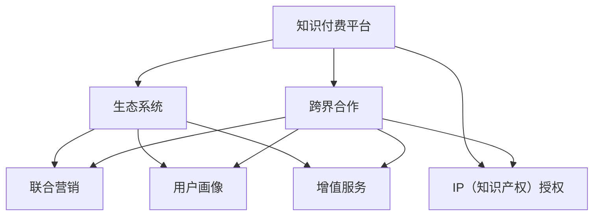

                 

# 知识付费创业的跨界合作策略

## 1. 背景介绍

### 1.1 问题由来
随着移动互联网的普及和数字技术的进步，知识付费逐渐成为一种新型的商业模式。知识付费不仅让知识价值得以货币化，还推动了学习效率的提升。然而，单独的知识付费平台面临着内容同质化、用户粘性差、流量获取难等挑战。跨界合作策略，通过将知识付费与多元业务进行深度融合，可以弥补单一平台的局限性，形成协同效应，提升整体市场竞争力。

### 1.2 问题核心关键点
跨界合作策略的核心关键点在于如何选择合作伙伴、构建合作模式、优化合作流程、实现双赢效果。它涉及到内容开发、技术对接、商业运营、用户体验等多个层面。通过深入分析这些关键点，可以更好地指导知识付费创业中的跨界合作实践。

### 1.3 问题研究意义
实施跨界合作策略，不仅可以扩大知识付费的内容和用户基础，还可以利用合作伙伴的资源和能力，实现创新突破。这对于提升知识付费平台的市场竞争力、拓展新业务、推动产业升级具有重要意义。

## 2. 核心概念与联系

### 2.1 核心概念概述

为更好地理解知识付费创业的跨界合作策略，本节将介绍几个密切相关的核心概念：

- **知识付费平台**：以内容为核心，为用户提供专业课程、音频、视频、电子书等知识产品或服务，并采取订阅制、按需付费等模式收费的在线平台。
- **跨界合作**：指不同领域、不同类型的主体基于共同目标，通过资源共享、业务协同、利益联结等方式，实现优势互补、共赢发展的策略。
- **生态系统**：多个主体之间相互依存、相互促进，共同构成一个动态、开放、有机的系统。
- **联合营销**：指两个或多个品牌通过资源整合、优势互补，共同开展市场推广活动，提升整体市场占有率。
- **用户画像**：对用户的兴趣、行为、消费能力等进行详细描述，帮助企业更好地理解目标用户，实现精准营销。
- **增值服务**：指通过附加服务（如社群互动、职业发展咨询、导师答疑等），提升用户满意度和黏性，实现用户价值最大化。
- **IP（知识产权）授权**：指知识付费平台向其他领域授权其内容、技术、品牌等知识产权，获取额外收入和曝光度。

这些核心概念之间的逻辑关系可以通过以下Mermaid流程图来展示：



这个流程图展示了两类主体的合作过程：

1. 知识付费平台通过跨界合作与其他主体建立合作关系，形成更广阔的生态系统。
2. 通过联合营销、用户画像、增值服务和IP授权等方式，实现多方共赢。

## 3. 核心算法原理 & 具体操作步骤
### 3.1 算法原理概述

知识付费创业的跨界合作策略，本质上是一种基于协作优化的商业模式设计。其核心思想是：通过资源共享、优势互补、利益联结等方式，最大化各方资源效用，实现合作共赢。

具体而言，合作双方或多方通过以下步骤达成一致：

1. **资源共享**：包括知识内容、技术能力、市场渠道等，实现资源的高效利用。
2. **优势互补**：利用合作伙伴的独特资源和能力，弥补自身短板，提升整体竞争力。
3. **利益联结**：通过设立合理的利益分配机制，确保各方获得公平合理的收益。

通过这些步骤，合作双方可以在内容质量、用户粘性、市场覆盖等多个维度取得突破，形成良性循环。

### 3.2 算法步骤详解

知识付费创业的跨界合作策略，主要包括以下几个关键步骤：

**Step 1: 识别潜在的合作伙伴**
- 根据业务发展需求，识别具有潜在合作价值的企业或机构，如教育机构、技术公司、媒体平台等。
- 分析合作伙伴的核心能力和资源，评估其与自身业务的契合度。

**Step 2: 制定合作方案**
- 明确合作目标，如扩大用户基础、丰富内容、增强技术能力等。
- 设计具体的合作方式，如内容共建、联合营销、技术对接等。
- 确定合作的期限、范围和预期效果。

**Step 3: 进行商务谈判**
- 与合作伙伴就合作条款、知识产权归属、利益分配等进行谈判。
- 签订合作协议，明确各方的权利和义务。

**Step 4: 执行合作流程**
- 根据合作协议，共同进行资源整合、业务流程对接。
- 开展联合营销活动，如联合广告、促销活动等。
- 定期评估合作效果，根据反馈进行调整和优化。

**Step 5: 效果评估与反馈**
- 收集合作效果数据，如用户增长、内容互动、收入增长等。
- 对合作效果进行评估，识别成功经验和不足之处。
- 根据评估结果，调整合作策略和流程，实现持续改进。

### 3.3 算法优缺点

跨界合作策略具有以下优点：
1. 资源互补。通过与其他领域的企业合作，获取更多的资源和能力，弥补自身不足。
2. 降低风险。多方合作分担风险，避免单一模式的风险累积。
3. 扩大市场。通过多渠道推广，提升品牌知名度和用户基础。
4. 创新突破。结合多方优势，实现技术、内容、运营等领域的创新。

同时，该策略也存在一定的局限性：
1. 协调难度大。多个主体之间的合作，需要协调各方利益，达成一致意见。
2. 利益分配复杂。多方合作的利益分配机制设计复杂，容易出现分歧。
3. 灵活性不足。合作协议一旦签订，可能难以灵活调整。
4. 依赖性强。合作的成功依赖于双方的信任和执行力度。

尽管存在这些局限性，但就目前而言，跨界合作策略仍是大规模知识付费创业的重要手段。未来相关研究的重点在于如何进一步优化合作机制，提高合作的灵活性和透明度，以更好地发挥跨界合作的优势。

### 3.4 算法应用领域

知识付费创业的跨界合作策略，可以广泛应用于以下几个领域：

1. **教育与培训**：与学校、培训机构、在线教育平台合作，共同开发课程内容、开展职业培训、进行人才输送。
2. **媒体与出版**：与出版社、期刊社、媒体平台合作，共同出版书籍、制作视频、举办讲座，扩大知识传播范围。
3. **技术与服务**：与科技公司、软件公司合作，共同研发技术产品、提供咨询服务，提升知识付费平台的技术水平。
4. **消费与娱乐**：与电商平台、在线平台、文娱公司合作，共同开发知识付费产品、进行联合营销、提供增值服务，拓展知识付费的消费场景。
5. **政府与公益**：与政府机构、公益组织合作，共同开展公益教育、政策解读、行业咨询，提升知识付费的社会价值。

这些领域的应用，展示了知识付费跨界合作策略的广泛适用性。通过多方合作，知识付费平台可以在不同的业务领域实现突破，形成多元化的业务布局。

## 4. 数学模型和公式 & 详细讲解 & 举例说明
### 4.1 数学模型构建

知识付费创业的跨界合作策略，可以构建如下数学模型进行描述和优化：

设知识付费平台为A，潜在的合作伙伴为B，双方合作的资源贡献分别为R_A、R_B，合作带来的新增价值为V，合作带来的成本为C，则合作的净价值为：

$$ V_{\text{合作}} = V_{\text{新增}} - C $$

其中，$V_{\text{新增}} = R_A + R_B - C$，表示合作带来的新增价值。

### 4.2 公式推导过程

通过上述模型，我们可以分析合作策略对知识付费平台的影响。假设A、B双方的资源贡献和合作成本不变，则合作带来的新增价值$V_{\text{新增}}$随合作方式的不同而变化。具体推导如下：

1. **内容共建**：双方共同开发课程内容，A贡献内容资源，B贡献技术平台。设A贡献的内容价值为$R_{A,C}$，B贡献的技术平台价值为$R_{B,T}$，则新增价值为$V_{\text{新增}} = R_{A,C} + R_{B,T} - C$。

2. **联合营销**：双方联合进行市场推广，A贡献内容资源，B贡献市场渠道。设A提供的内容曝光价值为$R_{A,M}$，B提供的市场渠道曝光价值为$R_{B,M}$，则新增价值为$V_{\text{新增}} = R_{A,M} + R_{B,M} - C$。

3. **技术对接**：双方进行技术合作，A贡献技术能力，B贡献数据资源。设A提供的技术能力价值为$R_{A,T}$，B提供的数据资源价值为$R_{B,D}$，则新增价值为$V_{\text{新增}} = R_{A,T} + R_{B,D} - C$。

### 4.3 案例分析与讲解

以教育与培训为例，分析跨界合作的数学模型应用。设知识付费平台A与培训机构B合作，共同开发职业培训课程。A提供课程内容资源，B提供培训平台和技术支持。双方合作带来的新增价值$V_{\text{新增}}$计算如下：

1. **内容贡献**：A提供高质量课程内容，B提供技术平台，进行课程上线和用户管理。假设A内容资源价值为$R_{A,C} = 10$万元/年，B技术平台价值为$R_{B,T} = 5$万元/年，合作成本为$C = 2$万元/年。则新增价值为$V_{\text{新增}} = 10 + 5 - 2 = 13$万元/年。

2. **联合营销**：双方共同进行市场推广，A提供课程广告，B提供社交媒体渠道。假设A内容曝光价值为$R_{A,M} = 5$万元/年，B提供社交媒体曝光价值为$R_{B,M} = 8$万元/年，合作成本为$C = 2$万元/年。则新增价值为$V_{\text{新增}} = 5 + 8 - 2 = 11$万元/年。

3. **技术对接**：B提供技术支持，A利用B的技术能力优化课程开发流程。假设A提供的技术能力价值为$R_{A,T} = 3$万元/年，B提供的数据资源价值为$R_{B,D} = 4$万元/年，合作成本为$C = 2$万元/年。则新增价值为$V_{\text{新增}} = 3 + 4 - 2 = 5$万元/年。

通过以上分析，可以看出不同的合作方式对新增价值的贡献不同。知识付费平台应根据自身需求和合作伙伴的能力，选择最适合的合作方式，以最大化合作带来的新增价值。

## 5. 项目实践：代码实例和详细解释说明
### 5.1 开发环境搭建

在进行跨界合作策略的实践前，我们需要准备好开发环境。以下是使用Python进行代码实现的开发环境配置流程：

1. 安装Anaconda：从官网下载并安装Anaconda，用于创建独立的Python环境。

2. 创建并激活虚拟环境：
```bash
conda create -n knowledge cooperation python=3.8 
conda activate knowledge cooperation
```

3. 安装必要的Python库：
```bash
pip install pandas numpy scipy requests
```

4. 安装SQL数据库：
```bash
pip install sqlalchemy sqlite3
```

5. 安装Web框架：
```bash
pip install flask
```

完成上述步骤后，即可在`knowledge cooperation`环境中开始跨界合作策略的代码实现。

### 5.2 源代码详细实现

以下是一个使用Python实现知识付费跨界合作策略的示例代码：

```python
from flask import Flask, request, jsonify
import sqlite3
import pandas as pd

app = Flask(__name__)

# 创建数据库连接
conn = sqlite3.connect('cooperation.db')
c = conn.cursor()

# 查询合作伙伴信息
def get_partners():
    c.execute('SELECT * FROM partners')
    return c.fetchall()

# 查询合作方案信息
def get_cooperation_plans():
    c.execute('SELECT * FROM cooperation_plans')
    return c.fetchall()

# 添加合作伙伴
def add_partner(partner):
    c.execute('INSERT INTO partners (name, description) VALUES (?, ?)', (partner['name'], partner['description']))
    conn.commit()

# 添加合作方案
def add_cooperation_plan(plan):
    c.execute('INSERT INTO cooperation_plans (partner, plan_name, plan_details) VALUES (?, ?, ?)', 
              (plan['partner'], plan['plan_name'], plan['plan_details']))
    conn.commit()

# 保存数据到数据库
def save_data(data):
    conn.execute('DELETE FROM cooperation_data')
    conn.execute('INSERT INTO cooperation_data VALUES (?, ?, ?)', (*data,))

# 获取合作伙伴和合作方案
@app.route('/partners', methods=['GET'])
def get_partners():
    partners = get_partners()
    return jsonify(partners)

@app.route('/cooperation_plans', methods=['GET'])
def get_cooperation_plans():
    plans = get_cooperation_plans()
    return jsonify(plans)

# 添加合作伙伴和合作方案
@app.route('/add_partner', methods=['POST'])
def add_partner():
    partner = request.json
    add_partner(partner)
    return jsonify(partner)

@app.route('/add_cooperation_plan', methods=['POST'])
def add_cooperation_plan():
    plan = request.json
    add_cooperation_plan(plan)
    return jsonify(plan)

# 保存合作数据
@app.route('/save_data', methods=['POST'])
def save_data():
    data = request.json
    save_data(data)
    return jsonify(data)

if __name__ == '__main__':
    app.run(debug=True)
```

在这个示例中，我们使用SQLite数据库存储合作伙伴和合作方案的信息，使用Flask框架实现Web服务，通过API接口进行数据的获取和存储。

### 5.3 代码解读与分析

让我们再详细解读一下关键代码的实现细节：

**SQLite数据库操作**：
- 使用`sqlite3`库连接SQLite数据库，创建游标对象`c`，执行SQL语句。
- 定义四个SQL函数，分别用于查询合作伙伴信息、合作方案信息、添加合作伙伴和合作方案、保存合作数据。

**Flask框架**：
- 使用`Flask`框架创建Web应用，定义四个API路由，分别用于获取合作伙伴信息、合作方案信息、添加合作伙伴和合作方案、保存合作数据。
- 在API路由中，使用`request`对象获取请求参数，执行SQL函数并返回JSON格式的响应数据。

**API接口**：
- 使用`@app.route`装饰器定义API路由和HTTP方法。
- 在每个路由中，使用`request.json`获取请求参数，调用对应的SQL函数进行数据处理。
- 使用`jsonify`函数将处理后的数据转换为JSON格式的响应数据。

**运行结果展示**：
- 启动应用后，可以使用Web浏览器访问`http://localhost:5000/partners`、`http://localhost:5000/cooperation_plans`、`http://localhost:5000/add_partner`、`http://localhost:5000/add_cooperation_plan`和`http://localhost:5000/save_data`，进行数据获取、添加和存储。

可以看到，通过以上代码实现，我们可以快速搭建一个基本的知识付费跨界合作策略平台，实现合作伙伴和合作方案的管理和数据保存。

## 6. 实际应用场景
### 6.1 智能教育平台与在线教育机构的合作

智能教育平台与在线教育机构合作，可以实现内容资源和技术能力的互补。例如，智能教育平台可以利用在线教育机构的课程资源和教学团队，开发高质量的在线课程。同时，平台提供技术平台和数据分析能力，帮助在线教育机构优化教学效果和用户体验。

具体合作方式包括：
1. **内容共建**：平台与机构共同开发课程内容，提供内容资源，机构提供课程设计和技术支持。
2. **联合营销**：平台与机构共同进行市场推广，提高课程曝光度，吸引更多学员报名。
3. **技术对接**：机构提供教学数据，平台进行数据分析和优化，提升教学效果。

### 6.2 知识付费平台与技术公司的合作

知识付费平台与技术公司合作，可以提升自身的技术水平和产品竞争力。例如，平台可以利用技术公司的软件开发能力，开发智能推荐系统、用户画像系统等核心功能。同时，技术公司也可以利用平台的数据资源，进行技术创新和产品开发。

具体合作方式包括：
1. **技术对接**：平台提供技术数据，技术公司进行技术开发，提升平台的技术能力。
2. **联合营销**：平台与技术公司共同进行市场推广，提高品牌知名度和用户基础。
3. **数据共享**：平台与技术公司共享用户数据，进行技术创新和产品优化。

### 6.3 知识付费平台与媒体平台的合作

知识付费平台与媒体平台合作，可以实现内容传播和品牌曝光的互补。例如，平台可以利用媒体平台的广告资源和传播渠道，扩大课程内容的曝光度。同时，平台提供内容资源和技术支持，帮助媒体平台制作高质量的节目和内容。

具体合作方式包括：
1. **联合营销**：平台与媒体平台共同进行市场推广，提高品牌知名度和用户基础。
2. **内容共建**：平台提供课程内容资源，媒体平台进行内容制作和传播，扩大课程内容的曝光度。
3. **数据共享**：平台与媒体平台共享用户数据，进行市场分析和技术优化。

## 7. 工具和资源推荐
### 7.1 学习资源推荐

为了帮助开发者系统掌握知识付费创业的跨界合作策略，这里推荐一些优质的学习资源：

1. **《跨界合作的艺术》**：一本关于跨界合作的经典书籍，深入浅出地介绍了跨界合作的原理、模式和实践案例。
2. **《知识付费的商业模型创新》**：针对知识付费平台商业模式的创新思考，提供系统性、实用性强的知识付费策略。
3. **《知识付费平台的数据科学应用》**：探讨知识付费平台如何利用数据科学进行用户画像、推荐系统、内容优化等，提高平台的用户体验和运营效率。
4. **《跨界合作的成功案例分析》**：提供多领域的跨界合作成功案例，供开发者参考借鉴。

通过对这些资源的学习实践，相信你一定能够全面掌握知识付费创业的跨界合作策略，并用于解决实际的业务问题。

### 7.2 开发工具推荐

高效的开发离不开优秀的工具支持。以下是几款用于知识付费跨界合作策略开发的常用工具：

1. **SQLite**：轻量级的关系型数据库，适用于数据存储和查询，易于安装和使用。
2. **Flask**：轻量级的Web框架，易于上手，支持RESTful API开发，适合快速迭代和测试。
3. **Python**：简单易学的编程语言，生态丰富，支持大量的Python库和框架。
4. **Jupyter Notebook**：强大的交互式编程环境，支持多种编程语言，适合进行数据分析和算法验证。
5. **Git**：版本控制系统，支持代码管理和协作，方便团队开发和代码维护。

合理利用这些工具，可以显著提升知识付费跨界合作策略的开发效率，加快创新迭代的步伐。

### 7.3 相关论文推荐

知识付费创业的跨界合作策略，需要广泛借鉴相关领域的理论研究成果。以下是几篇奠基性的相关论文，推荐阅读：

1. **《跨界合作的商业模式创新》**：提出跨界合作的商业模式创新思路，探讨跨界合作的盈利模式和利益分配机制。
2. **《知识付费平台的数据科学应用》**：探讨知识付费平台如何利用数据科学进行用户画像、推荐系统、内容优化等，提高平台的用户体验和运营效率。
3. **《跨界合作的案例研究》**：提供多领域的跨界合作成功案例，供开发者参考借鉴。
4. **《跨界合作的网络效应》**：研究跨界合作的网络效应，探讨如何通过网络效应提升跨界合作的协同效应。

这些论文代表了大规模知识付费创业的跨界合作策略的发展脉络。通过学习这些前沿成果，可以帮助研究者把握学科前进方向，激发更多的创新灵感。

## 8. 总结：未来发展趋势与挑战
### 8.1 总结

本文对知识付费创业的跨界合作策略进行了全面系统的介绍。首先阐述了跨界合作策略的研究背景和意义，明确了跨界合作在提升知识付费平台市场竞争力、拓展新业务、推动产业升级等方面的独特价值。其次，从原理到实践，详细讲解了跨界合作的数学模型和关键步骤，给出了跨界合作策略的完整代码实例。同时，本文还广泛探讨了跨界合作在智能教育、技术合作、媒体合作等多个领域的应用前景，展示了跨界合作策略的广泛适用性。

通过本文的系统梳理，可以看到，跨界合作策略正在成为知识付费平台的重要手段，极大地拓展了知识付费的内容和用户基础，推动了平台的多元化发展。未来，伴随跨界合作机制的不断优化，知识付费平台将能够在更多的业务领域实现突破，形成多元化的业务布局。

### 8.2 未来发展趋势

展望未来，知识付费创业的跨界合作策略将呈现以下几个发展趋势：

1. **数据驱动**：跨界合作将更加依赖数据驱动，通过数据分析和挖掘，实现精准营销和内容优化，提高合作效果。
2. **技术融合**：跨界合作将更多地融合人工智能、大数据、区块链等前沿技术，提升合作的智能化和安全性。
3. **平台生态化**：跨界合作将更多地构建平台生态系统，形成资源共享、利益联结的协同网络，提升整体竞争力。
4. **用户画像细化**：跨界合作将更加注重用户画像的细化和应用，实现精准定位和个性化服务。
5. **利益分配透明化**：跨界合作将更多地采用透明化的利益分配机制，确保各方获得公平合理的收益，提升合作意愿。
6. **用户体验优化**：跨界合作将更多地关注用户体验，提供更加优质的课程内容、技术和平台服务，提升用户满意度和黏性。

以上趋势凸显了知识付费创业的跨界合作策略的广阔前景。这些方向的探索发展，必将进一步提升知识付费平台的市场竞争力，推动知识付费行业的快速发展。

### 8.3 面临的挑战

尽管知识付费创业的跨界合作策略已经取得了显著成果，但在迈向更加智能化、普适化应用的过程中，它仍面临诸多挑战：

1. **资源协调困难**：多个主体之间的合作，需要协调各方利益，达成一致意见。
2. **利益分配复杂**：多方合作的利益分配机制设计复杂，容易出现分歧。
3. **合作灵活性不足**：合作协议一旦签订，可能难以灵活调整。
4. **依赖性强**：合作的成功依赖于双方的信任和执行力度。
5. **市场竞争激烈**：知识付费行业的竞争日益激烈，跨界合作策略需要不断优化和创新。

尽管存在这些挑战，但就目前而言，跨界合作策略仍是大规模知识付费创业的重要手段。未来相关研究的重点在于如何进一步优化合作机制，提高合作的灵活性和透明度，以更好地发挥跨界合作的优势。

### 8.4 研究展望

面对知识付费创业的跨界合作策略所面临的种种挑战，未来的研究需要在以下几个方面寻求新的突破：

1. **自动化合作协议生成**：利用自然语言处理技术，自动生成合作协议，提高合作效率。
2. **动态利益分配机制**：根据市场变化和合作效果，动态调整利益分配机制，确保各方获得公平合理的收益。
3. **区块链技术应用**：利用区块链技术，实现跨界合作的数据共享和利益联结，提升合作的透明性和安全性。
4. **多主体协同优化**：利用多主体协同优化理论，构建跨界合作的多方协同网络，提升整体竞争力。
5. **跨界合作平台化**：构建跨界合作平台，提供资源对接、利益联结、数据共享等服务，促进跨界合作的顺利实施。

这些研究方向的探索，必将引领知识付费创业的跨界合作策略迈向更高的台阶，为知识付费平台带来新的发展机遇。面向未来，跨界合作策略需要在技术与业务层面持续创新，才能更好地应对市场变化和用户需求，推动知识付费行业的可持续发展。

## 9. 附录：常见问题与解答
**Q1: 跨界合作如何选择合适的合作伙伴？**

A: 选择合适的合作伙伴需要考虑多个因素，包括合作伙伴的资源和能力、双方的业务契合度、利益分配机制等。具体而言，可以通过以下步骤进行选择：
1. **需求分析**：明确自身业务需求，识别潜在的合作伙伴。
2. **资源评估**：评估合作伙伴的资源和能力，确定是否能够提供相应的支持和资源。
3. **利益匹配**：分析双方的利益诉求，确定合作的利益联结方式。
4. **风险评估**：评估合作的潜在风险，确定风险管理策略。
5. **决策决策**：综合考虑以上因素，做出最终决策。

**Q2: 跨界合作如何设计利益分配机制？**

A: 设计合理的利益分配机制是跨界合作成功的重要保障。具体而言，可以从以下几个方面进行设计：
1. **明确合作目标**：明确合作的目标和预期效果，确定各方在合作中的贡献和收益。
2. **收益分配比例**：根据各方的贡献和收益，设计合理的收益分配比例，确保各方的利益公平合理。
3. **激励机制**：设计激励机制，鼓励各方的积极参与和贡献。
4. **透明化管理**：建立透明的利益分配机制，确保各方的知情权和监督权。
5. **动态调整**：根据合作效果和市场变化，动态调整利益分配机制，确保各方的利益持续合理。

**Q3: 跨界合作如何提升合作效率？**

A: 提升跨界合作效率需要从多个方面进行优化，包括流程简化、技术支撑、数据共享等。具体而言，可以通过以下步骤进行优化：
1. **流程简化**：简化合作流程，缩短从需求提出到项目实施的时间。
2. **技术支撑**：利用信息技术，实现自动化管理和协同，提升合作效率。
3. **数据共享**：建立数据共享机制，实现资源的有效利用和协同优化。
4. **利益透明**：建立透明的利益分配机制，确保各方的利益公平合理。
5. **定期沟通**：建立定期沟通机制，及时解决合作中的问题和障碍。

通过以上措施，可以显著提升跨界合作的效率，实现更好的合作效果。

**Q4: 跨界合作如何提升用户体验？**

A: 提升用户体验是跨界合作的重要目标之一。具体而言，可以从以下几个方面进行优化：
1. **内容优化**：提供高质量、多样化的内容资源，满足用户的学习需求。
2. **技术优化**：提升平台的稳定性和响应速度，提高用户的使用体验。
3. **服务优化**：提供个性化的服务，如社群互动、职业发展咨询等，提升用户黏性。
4. **数据分析**：利用数据科学，进行用户画像和行为分析，提供精准推荐和个性化服务。
5. **用户体验设计**：优化平台的界面和功能设计，提升用户的互动体验和满意度。

通过以上措施，可以显著提升跨界合作的用户体验，吸引更多的用户参与和贡献。

---

作者：禅与计算机程序设计艺术 / Zen and the Art of Computer Programming

