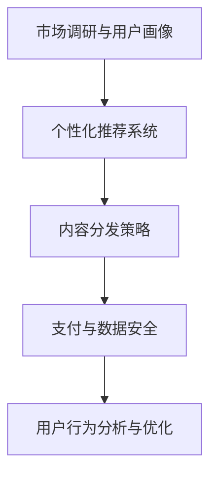

                 

# 知识付费创业者的日常工作安排

## 1. 背景介绍

在当今数字化时代，知识付费成为越来越多人获取知识、提升自我能力的新方式。特别是在信息技术、金融、健康、教育等行业，知识付费创业如雨后春笋般涌现，为社会带来了新的增长点。本文将深入剖析知识付费创业者的日常工作安排，探寻背后的技术挑战与解决方案，为广大创业者提供实用的工作指南。

### 1.1 问题由来

知识付费创业者的日常工作安排需要兼顾市场调研、内容创作、平台运营和技术开发等多方面，因此需要细致规划和管理。在这一过程中，技术成为了不可或缺的核心支撑。从用户需求分析、个性化推荐算法设计、内容分发策略到支付处理、数据安全和隐私保护，每个环节都需要技术的深度参与。

### 1.2 问题核心关键点

知识付费创业者的工作安排中，技术层面的核心关键点包括：

- **市场调研与用户画像构建**：通过数据分析技术，深入了解用户需求，构建精准的用户画像。
- **个性化推荐系统设计**：基于机器学习算法，设计高效、可扩展的个性化推荐引擎。
- **高效内容分发策略**：结合算法和人工运营，实现高效的内容分发与推送。
- **支付与数据安全**：确保支付流程和用户数据的安全性，防止数据泄露和欺诈。
- **用户行为分析与优化**：通过数据分析，优化产品功能和用户体验。

这些关键点围绕着内容为核心，技术为支撑的思路展开，旨在构建一个既满足用户需求，又能提升运营效率、保障数据安全的知识付费平台。

## 2. 核心概念与联系

### 2.1 核心概念概述

为更好地理解知识付费创业者的日常工作安排，本节将介绍几个关键概念：

- **知识付费**：用户通过支付费用获取专业知识和技能，提升自身能力的过程。
- **平台运营**：包括内容管理、用户互动、社区建设、用户增长等，是知识付费创业成功的关键。
- **个性化推荐系统**：根据用户行为和偏好，推荐最匹配的内容，提升用户体验和平台黏性。
- **支付与数据安全**：确保支付流程的流畅和用户数据的安全，是知识付费平台信任的基础。
- **用户行为分析**：通过数据分析了解用户行为，优化产品和服务，提升用户满意度和留存率。

这些概念之间的逻辑关系可以通过以下Mermaid流程图来展示：



这个流程图展示了几大核心概念之间的联系：市场调研与用户画像为个性化推荐系统和内容分发策略提供基础；个性化推荐系统提升用户黏性和平台流量；内容分发策略确保内容的有效传递；支付与数据安全保障用户信任；用户行为分析指导产品优化和用户增长。

## 3. 核心算法原理 & 具体操作步骤

### 3.1 算法原理概述

知识付费创业者的日常工作安排中，涉及多个核心算法，其中个性化推荐系统和内容分发策略尤为重要。

**个性化推荐系统**：基于用户的浏览、购买、评价等行为数据，结合用户画像和内容属性，通过协同过滤、基于内容的推荐等算法，推荐符合用户兴趣的内容。其核心原理是利用用户历史行为数据，计算用户和内容之间的相似度，从而预测用户可能感兴趣的下一个内容。

**内容分发策略**：结合算法和人工运营，制定内容分发的策略和时间表，确保内容能够在合适的时间被合适的用户看到。具体包括但不限于：通过协同过滤算法推荐相关内容；结合时事热点和社会事件，动态调整推荐内容；人工干预和用户反馈调整推荐策略。

### 3.2 算法步骤详解

#### 个性化推荐系统

1. **用户画像构建**：
   - 收集用户的基本信息、浏览历史、购买记录、评价反馈等。
   - 利用自然语言处理和机器学习算法，对用户信息进行分类和标注。
   - 构建用户画像，识别用户的兴趣偏好、行为模式和潜在需求。

2. **内容表示与相似度计算**：
   - 对内容进行特征提取，如关键词、分类标签、用户评分等。
   - 计算用户与内容之间的相似度，如余弦相似度、皮尔逊相关系数等。
   - 根据相似度计算推荐得分，排序推荐内容。

3. **推荐模型训练与评估**：
   - 使用协同过滤、矩阵分解等算法，训练个性化推荐模型。
   - 在验证集上评估模型的性能，如准确率、召回率、F1分数等。
   - 根据评估结果调整模型参数，优化推荐效果。

4. **实时推荐与更新**：
   - 实时计算用户当前的兴趣，结合实时数据进行推荐。
   - 定期更新用户画像和内容库，保持推荐系统的时效性和准确性。

#### 内容分发策略

1. **内容标签与分类**：
   - 对内容进行分类和标签标注，如课程分类、学科标签、难度级别等。
   - 利用自然语言处理技术，提取关键特征，生成内容摘要。

2. **用户行为分析**：
   - 收集用户的行为数据，如浏览时长、浏览顺序、购买路径等。
   - 分析用户的行为模式，识别热门内容、热门时间和热门主题。

3. **推荐与分发策略制定**：
   - 结合算法和人工运营，制定推荐策略，如内容时间表、推送频率等。
   - 根据推荐结果，制定内容分发的具体计划，如推送时间、推送渠道等。

4. **效果评估与优化**：
   - 定期评估内容分发策略的效果，如点击率、转化率、留存率等。
   - 根据评估结果，调整分发策略，优化用户体验和平台流量。

### 3.3 算法优缺点

**个性化推荐系统**：

优点：
- 提高用户满意度和黏性，增加平台流量和收入。
- 帮助用户发现新的兴趣点，提升学习效果。

缺点：
- 依赖大量用户数据，数据隐私和安全问题需重点关注。
- 算法复杂度高，计算资源消耗大。

**内容分发策略**：

优点：
- 提高内容曝光率，增加用户访问量和互动率。
- 结合算法和人工运营，灵活调整分发策略。

缺点：
- 人工运营成本高，需兼顾人工和算法之间的平衡。
- 分发策略需定期优化，工作量大。

### 3.4 算法应用领域

**个性化推荐系统**：
- **电商**：推荐用户可能感兴趣的商品。
- **社交媒体**：推荐用户可能感兴趣的朋友、文章、视频等。
- **视频网站**：推荐用户可能感兴趣的视频内容。

**内容分发策略**：
- **新闻平台**：通过算法和人工运营，优化新闻内容的展示时间和顺序。
- **视频平台**：制定视频内容的推荐策略和播放时间表。
- **知识付费平台**：通过算法和人工运营，优化课程内容的推荐和分发。

## 4. 数学模型和公式 & 详细讲解 & 举例说明

### 4.1 数学模型构建

本节将使用数学语言对个性化推荐系统和内容分发策略的算法进行更加严格的刻画。

设用户集合为 $U$，内容集合为 $I$，用户对内容的评分矩阵为 $R \in \mathbb{R}^{N\times M}$，其中 $N$ 为用户数，$M$ 为内容数，$R_{ij}$ 表示用户 $i$ 对内容 $j$ 的评分。

个性化推荐系统的目标是在新用户 $u$ 加入平台后，能够推荐其最感兴趣的内容 $i$，即最大化推荐准确率 $P$。推荐准确率的定义为：

$$
P = \frac{1}{N} \sum_{i=1}^{N} \frac{\sum_{j=1}^{M} I(u_i \text{ 关注 } j) \cdot I(R_{ij} > 0)}{\sum_{j=1}^{M} I(u_i \text{ 关注 } j)}
$$

其中 $I(u_i \text{ 关注 } j)$ 表示用户 $i$ 关注内容 $j$ 的布尔变量。

### 4.2 公式推导过程

以协同过滤算法为例，推导个性化推荐系统的工作原理。

协同过滤算法基于用户-物品相似度，将用户和内容进行匹配。假设用户-物品相似度矩阵为 $S \in \mathbb{R}^{N\times M}$，$S_{ij} = s_{u_i, v_j}$ 表示用户 $u_i$ 和内容 $v_j$ 之间的相似度。

推荐模型的目标是最小化用户-物品距离，即：

$$
\min_{S} \sum_{i=1}^{N} \sum_{j=1}^{M} (R_{ij} - S_{ij})^2
$$

通过求解上述最小二乘问题，得到最优的相似度矩阵 $S$。

在实际应用中，协同过滤算法通常分为用户-用户协同过滤和物品-物品协同过滤两种形式。用户-用户协同过滤基于用户的历史评分，生成用户之间的相似度矩阵；物品-物品协同过滤基于物品的相似度，生成物品之间的相似度矩阵。

### 4.3 案例分析与讲解

以在线教育平台为例，分析个性化推荐系统的应用效果。

假设有一个在线教育平台，平台上有 $N=1000$ 个用户和 $M=5000$ 门课程。通过用户评分数据，计算用户与课程之间的相似度矩阵 $S$。对于新用户 $u_{1001}$，根据相似度矩阵 $S$，推荐其最感兴趣的课程 $i_{100}$，即：

$$
i_{100} = \arg\max_i (S_{1001,i} \cdot R_{i,1})
$$

其中 $R_{i,1}$ 表示课程 $i$ 的评分。

通过推荐系统，平台能够帮助新用户快速找到最感兴趣的课程，提升学习体验和效果。同时，平台也能根据用户的行为数据，持续优化推荐算法，提升推荐准确率。

## 5. 项目实践：代码实例和详细解释说明

### 5.1 开发环境搭建

在进行个性化推荐系统和内容分发策略的开发前，我们需要准备好开发环境。以下是使用Python进行PyTorch开发的环境配置流程：

1. 安装Anaconda：从官网下载并安装Anaconda，用于创建独立的Python环境。

2. 创建并激活虚拟环境：
```bash
conda create -n pytorch-env python=3.8 
conda activate pytorch-env
```

3. 安装PyTorch：根据CUDA版本，从官网获取对应的安装命令。例如：
```bash
conda install pytorch torchvision torchaudio cudatoolkit=11.1 -c pytorch -c conda-forge
```

4. 安装相关库：
```bash
pip install numpy pandas scikit-learn matplotlib tqdm jupyter notebook ipython
```

完成上述步骤后，即可在`pytorch-env`环境中开始开发。

### 5.2 源代码详细实现

下面我们以个性化推荐系统为例，给出使用PyTorch进行协同过滤算法的PyTorch代码实现。

```python
import torch
import torch.nn as nn
import torch.optim as optim
from torch.utils.data import TensorDataset, DataLoader

class协同过滤模型(nn.Module):
    def __init__(self, user_num, item_num, embedding_dim):
        super(协同过滤模型, self).__init__()
        self.user_embedding = nn.Embedding(user_num, embedding_dim)
        self.item_embedding = nn.Embedding(item_num, embedding_dim)
        self similarity_matrix = nn.Parameter(torch.randn(user_num, item_num))
        self.learning_rate = 0.001
        self.mse_loss = nn.MSELoss()
        self.optimizer = optim.Adam([self.user_embedding.weight, self.item_embedding.weight, self.similarity_matrix], lr=self.learning_rate)
    
    def forward(self, user, item):
        user_embedding = self.user_embedding(user)
        item_embedding = self.item_embedding(item)
        return (user_embedding @ self.similarity_matrix @ item_embedding).mean()

    def train(self, user, item, ratings):
        self.train()
        output = self.forward(user, item)
        loss = self.mse_loss(output, ratings)
        loss.backward()
        self.optimizer.step()
        return loss
    
    def predict(self, user, item):
        self.eval()
        output = self.forward(user, item)
        return output

# 创建训练数据集
user_id = torch.tensor([0, 1, 2, 3, 4, 5, 6, 7, 8, 9], dtype=torch.long)
item_id = torch.tensor([0, 1, 2, 3, 4, 5, 6, 7, 8, 9], dtype=torch.long)
rating = torch.tensor([5.0, 4.0, 3.0, 2.0, 1.0, 5.0, 4.0, 3.0, 2.0, 1.0], dtype=torch.float)
train_dataset = TensorDataset(user_id, item_id, rating)
train_loader = DataLoader(train_dataset, batch_size=2, shuffle=True)

# 训练模型
model = 协同过滤模型(10, 10, 10)
criterion = nn.MSELoss()
optimizer = optim.Adam(model.parameters(), lr=0.001)
for epoch in range(1000):
    for i, data in enumerate(train_loader, 0):
        user, item, rating = data
        loss = model.train(user, item, rating)
        print('Epoch [%d/%d], Iter [%d/%d] Loss: %.4f' % (epoch+1, 1000, i+1, len(train_loader), loss.item()))

# 预测推荐结果
user = torch.tensor([8])
item = torch.tensor([5])
prediction = model.predict(user, item)
print('Prediction:', prediction.item())
```

以上代码实现了基本的协同过滤算法，并在训练集上进行训练，输出推荐结果。

### 5.3 代码解读与分析

让我们再详细解读一下关键代码的实现细节：

**协同过滤模型类**：
- `__init__`方法：初始化用户嵌入、物品嵌入和相似度矩阵等关键组件，并设置学习率、损失函数和优化器。
- `forward`方法：实现模型前向传播，计算用户和物品的相似度。
- `train`方法：实现模型训练过程，包括前向传播、损失计算、反向传播和参数更新。
- `predict`方法：实现模型预测过程，输出推荐结果。

**训练数据集**：
- 使用PyTorch的TensorDataset将用户ID、物品ID和评分封装为Tensor，并使用DataLoader进行批量加载。

**模型训练**：
- 通过循环迭代训练数据集，每次更新模型参数，计算并输出训练过程中的损失值。

**模型预测**：
- 使用训练好的模型，对新用户和物品进行预测，输出推荐结果。

## 6. 实际应用场景

### 6.1 智能推荐系统

智能推荐系统广泛应用于电商、社交媒体、视频平台等领域，通过个性化推荐算法，提升用户满意度、平台流量和商业价值。

**电商推荐系统**：通过分析用户的历史购买行为、浏览记录和评价反馈，推荐用户可能感兴趣的商品。推荐算法通常采用协同过滤、基于内容的推荐、混合推荐等策略。

**社交媒体推荐系统**：根据用户的行为数据，推荐可能感兴趣的朋友、文章、视频等。推荐算法通常采用协同过滤、社交网络分析等策略。

**视频平台推荐系统**：结合用户的历史观看记录、评价反馈和内容特征，推荐用户可能感兴趣的视频内容。推荐算法通常采用协同过滤、混合推荐等策略。

### 6.2 内容分发策略

内容分发策略结合算法和人工运营，制定内容分发的策略和时间表，确保内容能够在合适的时间被合适的用户看到。

**新闻平台**：通过算法和人工运营，优化新闻内容的展示时间和顺序。新闻平台通常采用协同过滤、时事热点分析等策略，结合编辑和记者的人工干预。

**视频平台**：制定视频内容的推荐策略和播放时间表。视频平台通常采用协同过滤、混合推荐等策略，结合编辑和制片人的人工干预。

**知识付费平台**：通过算法和人工运营，优化课程内容的推荐和分发。知识付费平台通常采用协同过滤、个性化推荐等策略，结合编辑和讲师的人工干预。

## 7. 工具和资源推荐

### 7.1 学习资源推荐

为了帮助开发者系统掌握个性化推荐系统和内容分发策略的理论基础和实践技巧，这里推荐一些优质的学习资源：

1. **《推荐系统实战》**：作者张烨，通过案例驱动的方式，全面介绍了推荐系统的理论基础和实践技巧。
2. **Coursera《Recommender Systems》课程**：斯坦福大学开设的推荐系统课程，由教授Cover Mario主讲，深入浅出地介绍了推荐系统的基本概念和前沿技术。
3. **《推荐系统算法与案例》**：作者方安奇，系统介绍了推荐系统的经典算法和应用案例。
4. **Kaggle推荐系统竞赛**：Kaggle平台上众多推荐系统竞赛，通过实际数据集训练和评估推荐模型，积累实战经验。

通过对这些资源的学习实践，相信你一定能够快速掌握个性化推荐系统和内容分发策略的精髓，并用于解决实际的推荐问题。

### 7.2 开发工具推荐

高效的开发离不开优秀的工具支持。以下是几款用于推荐系统开发的常用工具：

1. **TensorFlow**：由Google主导开发的开源深度学习框架，生产部署方便，适合大规模工程应用。
2. **PyTorch**：基于Python的开源深度学习框架，灵活动态的计算图，适合快速迭代研究。
3. **Scikit-learn**：Python中常用的机器学习库，提供了丰富的算法和工具，方便模型训练和评估。
4. **Scalene**：Python性能分析工具，帮助优化模型性能，提高计算效率。
5. **Ray**：分布式计算框架，支持大规模并行计算，适合训练大规模推荐模型。

合理利用这些工具，可以显著提升推荐系统开发的效率，加快创新迭代的步伐。

### 7.3 相关论文推荐

推荐系统的发展源于学界的持续研究。以下是几篇奠基性的相关论文，推荐阅读：

1. **《Item-based collaborative filtering recommendation algorithms》**：作者Amarasinghaketti, Suman, 详细介绍了协同过滤算法的原理和实现。
2. **《Matrix factorization techniques for recommendation》**：作者Koren, Y.,讨论了矩阵分解等推荐算法的理论基础和应用。
3. **《Hybrid matrix factorization methods for recommendation》**：作者Chen, H.,等，介绍了混合推荐算法的设计与实现。
4. **《Neural collaborative filtering》**：作者He, X.,等，介绍了神经网络在推荐系统中的应用。

这些论文代表了个推荐系统的发展脉络。通过学习这些前沿成果，可以帮助研究者把握学科前进方向，激发更多的创新灵感。

## 8. 总结：未来发展趋势与挑战

### 8.1 总结

本文对知识付费创业者的日常工作安排进行了全面系统的介绍。首先阐述了知识付费创业者的日常工作安排需要兼顾市场调研、内容创作、平台运营和技术开发等多方面，强调了技术在大语言模型微调中的核心支撑作用。其次，从原理到实践，详细讲解了个性化推荐系统和内容分发策略的数学模型和算法流程，给出了微调任务开发的完整代码实例。同时，本文还广泛探讨了推荐系统在电商、社交媒体、视频平台等多个行业领域的应用前景，展示了微调范式的巨大潜力。此外，本文精选了推荐系统的各类学习资源，力求为读者提供全方位的技术指引。

通过本文的系统梳理，可以看到，知识付费平台在市场调研、个性化推荐和内容分发等多个环节，需要依赖技术的大力支持，才能实现高效运营和持续增长。未来，伴随推荐算法的不断演进，知识付费平台必将在用户满意度和商业价值方面迈上新的台阶。

### 8.2 未来发展趋势

展望未来，推荐系统的发展趋势包括：

1. **实时推荐系统**：通过流式数据处理技术，实现实时推荐，提升用户体验和平台流量。
2. **个性化推荐引擎**：结合深度学习算法和大数据技术，设计高效、可扩展的个性化推荐引擎。
3. **多模态推荐系统**：结合视频、音频等多模态数据，提升推荐系统的综合能力。
4. **可解释性推荐**：通过因果分析和对比学习，提升推荐系统的可解释性，增强用户信任。
5. **联邦推荐系统**：通过联邦学习技术，保护用户隐私，提升推荐系统的安全性。
6. **跨平台推荐**：将不同平台的数据和推荐策略进行联合优化，提升跨平台推荐效果。

以上趋势凸显了推荐系统的广阔前景。这些方向的探索发展，必将进一步提升知识付费平台的用户体验和商业价值，为人工智能技术在垂直行业的落地应用提供新的动力。

### 8.3 面临的挑战

尽管推荐系统已经取得了显著成果，但在迈向更加智能化、普适化应用的过程中，它仍面临着诸多挑战：

1. **数据质量问题**：推荐系统依赖大量高质量的数据，但数据采集、标注和清洗过程复杂，存在数据偏差和噪音问题。
2. **冷启动问题**：新用户或新商品没有历史数据，难以进行个性化推荐。
3. **多样性和公平性**：推荐系统需要避免长尾商品的冷启动问题，同时保证推荐结果的多样性和公平性。
4. **隐私和安全**：用户数据的隐私和安全问题，如数据泄露、恶意攻击等，是推荐系统面临的重要挑战。
5. **模型复杂性**：大规模推荐系统的模型复杂度较高，计算资源和存储空间消耗大。

面对这些挑战，未来的研究需要在以下几个方面寻求新的突破：

1. **数据治理和增强**：通过数据清洗、标注和增强，提升数据质量和多样性，确保推荐系统的公平性和多样性。
2. **冷启动和推荐**：结合知识图谱、用户画像等手段，解决新用户和新商品的冷启动问题。
3. **隐私和安全技术**：通过联邦学习、差分隐私等技术，保护用户隐私，确保推荐系统的安全性。
4. **模型压缩和优化**：通过模型压缩、剪枝等技术，降低推荐系统的计算资源和存储消耗，提升系统效率。
5. **多目标优化**：结合用户满意度、平台流量、商业收益等多目标优化，设计更加智能化的推荐策略。

只有勇于创新、敢于突破，才能在未来的知识付费市场中占据优势，实现商业和技术的双赢。

### 8.4 研究展望

面对知识付费市场的激烈竞争和不断变化的用户需求，未来的研究需要在以下几个方面进行深入探索：

1. **智能推荐引擎的构建**：结合深度学习算法和大数据技术，设计高效、可扩展的智能推荐引擎，提升推荐系统的准确性和可解释性。
2. **个性化推荐策略的优化**：通过结合用户画像、行为数据、时事热点等，优化个性化推荐策略，提升用户满意度和留存率。
3. **推荐系统的跨平台应用**：将不同平台的数据和推荐策略进行联合优化，提升跨平台推荐效果，满足用户多场景需求。
4. **推荐系统的公平性和多样性**：通过引入多样性损失函数、公平性约束等，确保推荐系统能够提供多样化、公平化的推荐结果，满足不同用户需求。
5. **推荐系统的社会责任**：结合用户需求和社会价值观，设计具有社会责任感的推荐策略，确保推荐系统的正面影响。

通过这些方向的探索，相信知识付费平台的推荐系统将更加智能、高效、公平、可靠，为用户的知识获取和成长提供更加精准的推荐服务，同时也将为社会发展和经济增长贡献力量。

## 9. 附录：常见问题与解答

**Q1：如何进行市场调研和用户画像构建？**

A: 市场调研和用户画像构建是推荐系统成功的关键。具体步骤如下：
1. **数据采集**：通过问卷调查、用户行为数据分析等方式，收集用户的基本信息、行为数据和评价反馈。
2. **数据清洗和标注**：对采集到的数据进行清洗和标注，去除噪音和异常值，提升数据质量。
3. **特征工程**：根据用户行为数据和评价反馈，提取关键特征，如浏览时长、购买路径、评分等。
4. **用户画像构建**：利用机器学习算法，对用户特征进行分类和标注，构建用户画像，识别用户的兴趣偏好和行为模式。

**Q2：如何设计高效的个性化推荐算法？**

A: 设计高效的个性化推荐算法需要考虑以下几个方面：
1. **选择合适的推荐算法**：根据推荐系统的特点和用户需求，选择合适的推荐算法，如协同过滤、基于内容的推荐、混合推荐等。
2. **优化模型参数**：通过调整模型参数，优化推荐效果，如学习率、正则化系数、特征选择等。
3. **引入外部数据**：结合用户画像、时事热点、专家知识等，提升推荐系统的多样性和公平性。
4. **实时推荐和更新**：根据实时数据和用户行为，动态调整推荐策略，提升推荐系统的时效性和准确性。

**Q3：如何保护用户隐私和安全？**

A: 保护用户隐私和安全是推荐系统的核心问题之一。具体措施包括：
1. **数据匿名化**：对用户数据进行匿名化处理，确保用户隐私不被泄露。
2. **差分隐私**：在推荐模型训练过程中，引入差分隐私技术，保护用户数据的隐私性。
3. **安全加密**：对用户数据进行加密处理，确保数据在传输和存储过程中的安全性。
4. **联邦学习**：通过联邦学习技术，将数据在多个客户端进行分布式训练，保护用户数据的隐私和安全性。

**Q4：如何评估推荐系统的性能？**

A: 评估推荐系统的性能需要考虑以下几个指标：
1. **准确率**：衡量推荐系统推荐的准确性，如召回率、准确率、F1分数等。
2. **多样性**：衡量推荐系统推荐的物品多样性，如Simplicity等。
3. **公平性**：衡量推荐系统推荐的公平性，如Bias-Variance Trade-off、多样性损失等。
4. **用户满意度**：通过用户调查和行为分析，评估用户对推荐系统的满意度。
5. **商业价值**：衡量推荐系统带来的商业价值，如转化率、营收增长等。

通过这些指标的评估，可以全面了解推荐系统的性能，并进行优化和改进。

**Q5：推荐系统如何结合用户行为分析和内容特征？**

A: 结合用户行为分析和内容特征，可以设计更加智能化的推荐策略。具体步骤包括：
1. **用户行为分析**：收集用户的行为数据，如浏览时长、购买路径等，分析用户的兴趣和行为模式。
2. **内容特征提取**：提取内容的关键词、分类标签、用户评分等特征，建立内容表示。
3. **相似度计算**：计算用户和内容之间的相似度，如余弦相似度、皮尔逊相关系数等。
4. **推荐模型训练**：基于相似度计算结果，训练推荐模型，预测用户可能感兴趣的内容。
5. **推荐结果输出**：根据推荐模型输出结果，推荐给用户。

通过以上步骤，可以设计出高效的推荐系统，提升用户满意度和留存率。

---

作者：禅与计算机程序设计艺术 / Zen and the Art of Computer Programming

