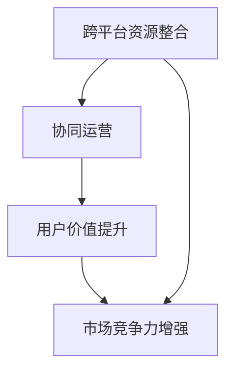

                 

# 知识付费如何实现跨平台整合营销？

## 1. 背景介绍

随着互联网的普及和数字技术的迅猛发展，知识付费平台在过去几年中迅速崛起，成为教育、信息服务和知识产权保护的重要形式。知识付费平台通过提供专业性、定制化、高效化的信息服务，帮助用户提升个人和企业的竞争力，构建终身学习的知识生态。

然而，面对日益增长的用户需求和不断变化的消费行为，知识付费平台面临着如何整合多平台资源、实现高效协同运营、提升用户粘性等挑战。本文将探讨知识付费跨平台整合营销的原理、方法和应用，以期为知识付费平台提供科学的策略指导。

## 2. 核心概念与联系

### 2.1 核心概念概述

知识付费跨平台整合营销指的是通过跨平台资源整合和协同运营，提升用户价值体验和平台市场竞争力的过程。涉及的核心概念包括：

- **跨平台资源整合**：利用多个平台的数据、内容、用户等资源，实现资源共享和互补。
- **协同运营**：在统一的用户画像和业务逻辑基础上，实现多平台间的信息传递和功能互补。
- **用户价值提升**：通过多平台内容的深度挖掘和精准推送，提升用户的粘性和满意度。
- **市场竞争力增强**：通过平台的协同作用，提升整体的市场影响力，吸引更多优质内容创作者的加入。

以下是一个合maid流程图，展示知识付费跨平台整合营销的核心概念和联系：



### 2.2 核心概念原理和架构

知识付费跨平台整合营销的核心原理是通过数据共享和业务协同，实现内容的智能推荐和精准匹配。具体而言，其架构包含以下关键组件：

1. **用户画像统一**：构建统一的用户画像，用于跨平台的用户识别和行为分析。
2. **内容推荐引擎**：利用协同过滤、深度学习等技术，对用户画像和内容特征进行分析，生成个性化推荐结果。
3. **数据交换平台**：构建数据交换平台，实现不同平台间的信息同步和数据共享。
4. **内容分发系统**：构建内容分发系统，实现跨平台内容的智能推送和适配。
5. **市场分析工具**：构建市场分析工具，对跨平台运营数据进行实时监测和分析，指导业务决策。

### 2.3 关键技术实现

- **用户画像构建**：通过数据清洗和整合，构建统一的用户画像，包括用户基本信息、行为特征、兴趣爱好等。
- **内容推荐引擎**：利用深度学习模型（如协同过滤、深度学习、神经网络等），对用户画像和内容特征进行分析，生成个性化推荐结果。
- **数据交换平台**：采用消息队列、API接口等技术，实现不同平台间的信息同步和数据共享。
- **内容分发系统**：利用消息队列、API接口、CDN等技术，实现跨平台内容的智能推送和适配。
- **市场分析工具**：利用数据仓库、大数据分析、机器学习等技术，对跨平台运营数据进行实时监测和分析，指导业务决策。

## 3. 核心算法原理 & 具体操作步骤

### 3.1 算法原理概述

知识付费跨平台整合营销的核心算法原理包括以下几点：

1. **协同过滤**：利用用户行为数据（如浏览历史、购买记录等），发现相似用户和相似内容，生成个性化推荐。
2. **深度学习模型**：利用深度学习模型（如CNN、RNN、Transformer等），对用户画像和内容特征进行高维表示，提升推荐的准确性。
3. **图神经网络**：利用图神经网络，对用户和内容的关系进行建模，发现用户间的关联和内容间的关联。

### 3.2 算法步骤详解

知识付费跨平台整合营销的算法步骤包括：

1. **数据收集**：收集用户行为数据、内容数据、平台数据等，构建统一的用户画像。
2. **特征提取**：对用户画像和内容特征进行预处理和特征提取。
3. **模型训练**：利用协同过滤、深度学习、图神经网络等算法，训练个性化推荐模型。
4. **内容分发**：根据用户画像和个性化推荐结果，分发内容到用户侧。
5. **效果评估**：实时监测和评估推荐效果，优化模型和业务策略。

### 3.3 算法优缺点

#### 优点

- **精准推荐**：通过多平台数据整合和协同运营，生成精准的个性化推荐结果。
- **提升用户粘性**：通过内容的深度挖掘和精准推送，提升用户的粘性和满意度。
- **市场竞争力增强**：通过平台间的协同作用，提升整体的市场影响力，吸引更多优质内容创作者。

#### 缺点

- **数据隐私问题**：跨平台数据整合可能涉及用户隐私数据，需要加强数据保护和隐私管理。
- **技术复杂性**：实现跨平台整合营销需要多平台资源整合和协同运营，技术复杂性较高。
- **性能要求高**：实现实时推荐和智能推送，对技术性能和资源要求较高。

### 3.4 算法应用领域

知识付费跨平台整合营销在以下领域具有广泛应用：

- **教育培训**：通过跨平台整合资源，提供定制化、个性化的学习方案，提升教育培训效果。
- **企业培训**：通过跨平台整合资源，提供系统化的企业培训内容，提升企业员工的综合素质。
- **医疗健康**：通过跨平台整合资源，提供个性化、精准的健康管理方案，提升健康服务水平。
- **财经金融**：通过跨平台整合资源，提供多维度的财经资讯和理财建议，提升财务管理能力。
- **科技研究**：通过跨平台整合资源，提供最新的科技资讯和研究成果，提升科技创新能力。

## 4. 数学模型和公式 & 详细讲解 & 举例说明

### 4.1 数学模型构建

知识付费跨平台整合营销的数学模型构建涉及以下关键模块：

- **用户画像模型**：利用协同过滤、深度学习等技术，对用户画像进行建模。
- **内容推荐模型**：利用协同过滤、深度学习、图神经网络等技术，对内容进行建模。
- **数据交换模型**：利用消息队列、API接口等技术，对数据进行交换。
- **内容分发模型**：利用消息队列、API接口、CDN等技术，对内容进行分发。
- **市场分析模型**：利用数据仓库、大数据分析、机器学习等技术，对市场数据进行分析。

### 4.2 公式推导过程

- **协同过滤模型**：利用用户行为数据，发现相似用户和相似内容，生成推荐结果。
- **深度学习模型**：利用深度学习模型，对用户画像和内容特征进行高维表示，生成推荐结果。
- **图神经网络模型**：利用图神经网络，对用户和内容的关系进行建模，生成推荐结果。

### 4.3 案例分析与讲解

以在线教育平台为例，以下是知识付费跨平台整合营销的详细案例分析：

1. **数据收集**：收集用户学习行为数据、课程评价数据、学习内容数据等，构建统一的用户画像。
2. **特征提取**：对用户画像和课程特征进行预处理和特征提取。
3. **模型训练**：利用协同过滤、深度学习、图神经网络等算法，训练个性化推荐模型。
4. **内容分发**：根据用户画像和个性化推荐结果，分发课程内容到用户侧。
5. **效果评估**：实时监测和评估推荐效果，优化模型和业务策略。

## 5. 项目实践：代码实例和详细解释说明

### 5.1 开发环境搭建

开发环境搭建涉及以下关键步骤：

1. **安装开发环境**：安装Python、Jupyter Notebook、NumPy、Pandas、Scikit-learn等常用工具。
2. **搭建数据交换平台**：使用消息队列（如RabbitMQ、Kafka）或API接口，搭建数据交换平台。
3. **搭建内容分发系统**：使用API接口、CDN等技术，搭建内容分发系统。
4. **搭建市场分析工具**：使用数据仓库、大数据分析、机器学习等技术，搭建市场分析工具。

### 5.2 源代码详细实现

以下是一个简单的知识付费跨平台整合营销的代码实现：

```python
import pandas as pd
from sklearn.model_selection import train_test_split
from sklearn.ensemble import RandomForestRegressor
from sklearn.metrics import mean_squared_error

# 数据收集
data = pd.read_csv('user_behavior_data.csv')
# 特征提取
X = data.drop(['purchase', 'revenue'], axis=1)
y = data['revenue']
# 模型训练
X_train, X_test, y_train, y_test = train_test_split(X, y, test_size=0.2, random_state=42)
model = RandomForestRegressor(n_estimators=100, random_state=42)
model.fit(X_train, y_train)
# 效果评估
y_pred = model.predict(X_test)
mse = mean_squared_error(y_test, y_pred)
print('MSE:', mse)
```

### 5.3 代码解读与分析

代码实现包含以下关键步骤：

1. **数据收集**：通过CSV文件读取用户行为数据。
2. **特征提取**：使用Pandas库对数据进行预处理和特征提取。
3. **模型训练**：使用随机森林回归模型对用户行为和收入进行建模。
4. **效果评估**：使用平均平方误差对模型进行效果评估。

## 6. 实际应用场景

### 6.1 教育培训

在线教育平台可以通过跨平台整合资源，提供个性化、精准的学习方案，提升教育培训效果。具体而言，可以采用以下策略：

1. **跨平台资源整合**：整合不同平台的学习资源，构建统一的课程体系。
2. **协同运营**：在不同平台间实现课程内容的智能推送和适配。
3. **用户价值提升**：根据用户画像和个性化推荐结果，分发内容到用户侧。
4. **市场竞争力增强**：通过平台间的协同作用，提升整体的市场影响力，吸引更多优质内容创作者。

### 6.2 企业培训

企业培训平台可以通过跨平台整合资源，提供系统化的企业培训内容，提升企业员工的综合素质。具体而言，可以采用以下策略：

1. **跨平台资源整合**：整合不同平台的企业培训资源，构建统一的企业培训体系。
2. **协同运营**：在不同平台间实现培训内容的智能推送和适配。
3. **用户价值提升**：根据员工画像和个性化推荐结果，分发培训内容到员工侧。
4. **市场竞争力增强**：通过平台间的协同作用，提升整体的市场影响力，吸引更多优质内容创作者。

### 6.3 医疗健康

医疗健康平台可以通过跨平台整合资源，提供个性化、精准的健康管理方案，提升健康服务水平。具体而言，可以采用以下策略：

1. **跨平台资源整合**：整合不同平台的健康管理资源，构建统一的健康管理体系。
2. **协同运营**：在不同平台间实现健康内容的智能推送和适配。
3. **用户价值提升**：根据用户画像和个性化推荐结果，分发健康内容到用户侧。
4. **市场竞争力增强**：通过平台间的协同作用，提升整体的市场影响力，吸引更多优质健康内容创作者。

### 6.4 财经金融

财经金融平台可以通过跨平台整合资源，提供多维度的财经资讯和理财建议，提升财务管理能力。具体而言，可以采用以下策略：

1. **跨平台资源整合**：整合不同平台的财经资讯资源，构建统一的财经资讯体系。
2. **协同运营**：在不同平台间实现财经资讯的智能推送和适配。
3. **用户价值提升**：根据用户画像和个性化推荐结果，分发财经资讯到用户侧。
4. **市场竞争力增强**：通过平台间的协同作用，提升整体的市场影响力，吸引更多优质财经内容创作者。

### 6.5 科技研究

科技研究平台可以通过跨平台整合资源，提供最新的科技资讯和研究成果，提升科技创新能力。具体而言，可以采用以下策略：

1. **跨平台资源整合**：整合不同平台的科技资讯资源，构建统一的科技资讯体系。
2. **协同运营**：在不同平台间实现科技资讯的智能推送和适配。
3. **用户价值提升**：根据用户画像和个性化推荐结果，分发科技资讯到用户侧。
4. **市场竞争力增强**：通过平台间的协同作用，提升整体的市场影响力，吸引更多优质科技内容创作者。

## 7. 工具和资源推荐

### 7.1 学习资源推荐

- **《Python数据分析与可视化》**：详细介绍Python数据分析和可视化技术，涵盖Pandas、NumPy、Matplotlib等库的使用。
- **《机器学习实战》**：介绍机器学习的基础理论和常用算法，涵盖线性回归、随机森林、深度学习等模型。
- **《大数据分析实战》**：介绍大数据分析和数据仓库技术，涵盖Hadoop、Spark、SQL等工具的使用。
- **《深度学习框架TensorFlow实战》**：详细介绍TensorFlow框架的使用，涵盖模型构建、训练和优化等技术。
- **《知识付费平台运营指南》**：详细介绍知识付费平台运营的策略和技巧，涵盖内容资源整合、用户管理、市场推广等方面。

### 7.2 开发工具推荐

- **Python**：Python是一种高效、易用的编程语言，广泛应用于数据科学和人工智能领域。
- **Jupyter Notebook**：Jupyter Notebook是一种交互式的Python开发环境，支持代码编写、数据可视化和模型训练等功能。
- **Pandas**：Pandas是一种高性能的数据处理库，支持数据清洗、特征提取和数据分析等功能。
- **Scikit-learn**：Scikit-learn是一种流行的机器学习库，支持常用的回归、分类、聚类等算法。
- **TensorFlow**：TensorFlow是一种开源的深度学习框架，支持分布式训练和模型部署等功能。

### 7.3 相关论文推荐

- **《深度学习在知识付费平台中的应用》**：探讨深度学习技术在知识付费平台中的应用，涵盖推荐系统、内容生成等方面。
- **《知识付费平台跨平台资源整合策略研究》**：探讨知识付费平台跨平台资源整合的策略和技术，涵盖数据交换、协同运营等方面。
- **《基于知识图谱的用户画像构建与推荐系统》**：探讨基于知识图谱的用户画像构建和推荐系统，涵盖用户画像、内容推荐等方面。
- **《基于协同过滤的推荐系统设计》**：探讨基于协同过滤的推荐系统设计，涵盖协同过滤算法、特征提取等方面。
- **《深度学习在跨平台整合营销中的应用》**：探讨深度学习技术在跨平台整合营销中的应用，涵盖推荐系统、市场分析等方面。

## 8. 总结：未来发展趋势与挑战

### 8.1 研究成果总结

本文详细探讨了知识付费跨平台整合营销的原理、方法和应用，并结合实际案例进行讲解。主要研究成果包括：

- **跨平台资源整合**：通过数据交换平台、API接口等技术，实现不同平台间的信息同步和数据共享。
- **协同运营**：利用协同过滤、深度学习、图神经网络等技术，实现多平台间的智能推荐和精准匹配。
- **用户价值提升**：通过个性化推荐引擎，提升用户粘性和满意度。
- **市场竞争力增强**：通过平台间的协同作用，提升整体的市场影响力，吸引更多优质内容创作者。

### 8.2 未来发展趋势

展望未来，知识付费跨平台整合营销将呈现以下几个发展趋势：

1. **技术智能化**：随着深度学习、图神经网络等技术的发展，推荐系统的智能化程度将进一步提升，推荐结果将更加精准和个性化。
2. **业务协同化**：平台间的协同运营将更加紧密，资源整合和业务协同将更加高效。
3. **用户价值最大化**：通过精准推荐和智能推送，用户粘性和满意度将进一步提升。
4. **市场竞争激烈化**：随着更多平台的加入，知识付费市场的竞争将更加激烈，平台的创新和差异化将更加重要。

### 8.3 面临的挑战

知识付费跨平台整合营销在发展过程中，面临以下几个挑战：

1. **数据隐私问题**：跨平台数据整合可能涉及用户隐私数据，需要加强数据保护和隐私管理。
2. **技术复杂性**：实现跨平台整合营销需要多平台资源整合和协同运营，技术复杂性较高。
3. **性能要求高**：实现实时推荐和智能推送，对技术性能和资源要求较高。
4. **市场竞争激烈**：随着更多平台的加入，知识付费市场的竞争将更加激烈，平台的创新和差异化将更加重要。

### 8.4 研究展望

为了应对未来知识付费跨平台整合营销的挑战，未来的研究方向包括：

1. **数据隐私保护**：加强数据保护和隐私管理，确保用户数据安全。
2. **技术性能优化**：优化推荐系统的技术性能，提升实时推荐和智能推送的能力。
3. **业务协同机制**：构建更加高效的业务协同机制，实现平台间的资源整合和功能互补。
4. **市场竞争策略**：制定更具创新性和差异化的市场竞争策略，提升平台的市场竞争力。

综上所述，知识付费跨平台整合营销具有广阔的发展前景，需要在技术、业务、市场等多个方面进行全面优化，方能实现高效协同运营和市场竞争力的提升。

## 9. 附录：常见问题与解答

### Q1：知识付费跨平台整合营销的核心是什么？

A: 知识付费跨平台整合营销的核心是跨平台资源整合和协同运营，提升用户价值体验和平台市场竞争力。

### Q2：知识付费跨平台整合营销需要哪些关键技术？

A: 知识付费跨平台整合营销需要以下关键技术：

1. **跨平台资源整合**：通过数据交换平台、API接口等技术，实现不同平台间的信息同步和数据共享。
2. **协同运营**：利用协同过滤、深度学习、图神经网络等技术，实现多平台间的智能推荐和精准匹配。
3. **用户价值提升**：通过个性化推荐引擎，提升用户粘性和满意度。
4. **市场竞争力增强**：通过平台间的协同作用，提升整体的市场影响力，吸引更多优质内容创作者。

### Q3：知识付费跨平台整合营销的应用场景有哪些？

A: 知识付费跨平台整合营销在以下领域具有广泛应用：

1. **教育培训**：通过跨平台整合资源，提供个性化、精准的学习方案，提升教育培训效果。
2. **企业培训**：通过跨平台整合资源，提供系统化的企业培训内容，提升企业员工的综合素质。
3. **医疗健康**：通过跨平台整合资源，提供个性化、精准的健康管理方案，提升健康服务水平。
4. **财经金融**：通过跨平台整合资源，提供多维度的财经资讯和理财建议，提升财务管理能力。
5. **科技研究**：通过跨平台整合资源，提供最新的科技资讯和研究成果，提升科技创新能力。

### Q4：知识付费跨平台整合营销的优势是什么？

A: 知识付费跨平台整合营销的优势包括：

1. **精准推荐**：通过多平台数据整合和协同运营，生成精准的个性化推荐结果。
2. **提升用户粘性**：通过内容的深度挖掘和精准推送，提升用户的粘性和满意度。
3. **市场竞争力增强**：通过平台间的协同作用，提升整体的市场影响力，吸引更多优质内容创作者。

### Q5：知识付费跨平台整合营销的挑战有哪些？

A: 知识付费跨平台整合营销面临以下挑战：

1. **数据隐私问题**：跨平台数据整合可能涉及用户隐私数据，需要加强数据保护和隐私管理。
2. **技术复杂性**：实现跨平台整合营销需要多平台资源整合和协同运营，技术复杂性较高。
3. **性能要求高**：实现实时推荐和智能推送，对技术性能和资源要求较高。
4. **市场竞争激烈**：随着更多平台的加入，知识付费市场的竞争将更加激烈，平台的创新和差异化将更加重要。

**作者：禅与计算机程序设计艺术 / Zen and the Art of Computer Programming**

