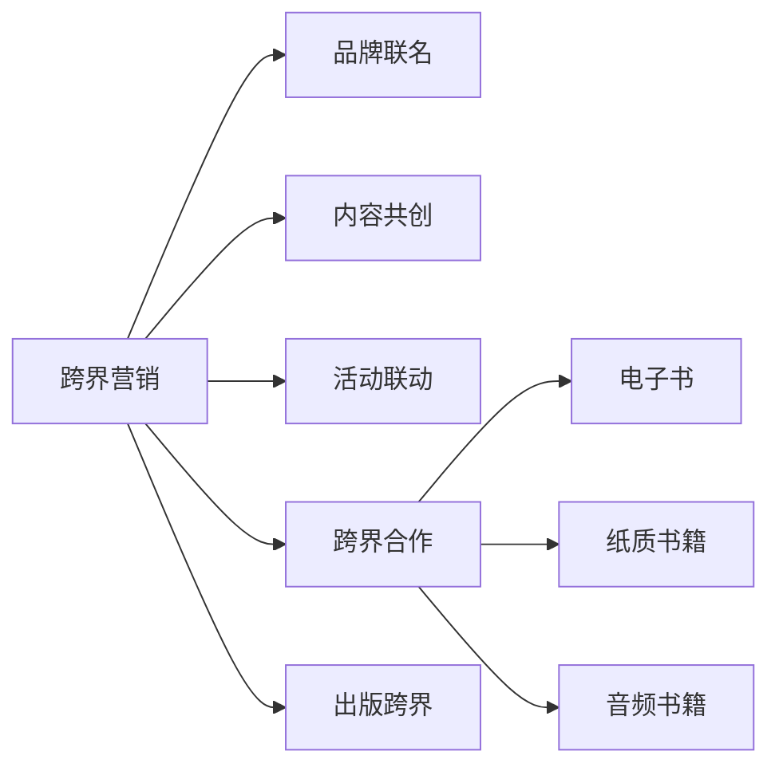

                 

## 1. 背景介绍

在信息爆炸和知识竞争的时代，知识付费市场正在以迅猛的速度发展。从在线课程、电子书到专家讲座，知识付费的范式正在从传统的教育市场向更广泛的市场扩展。然而，知识付费市场不仅面临激烈的市场竞争，还面临内容同质化、用户粘性低等问题。在这样的背景下，如何实现跨界营销和出版跨界，提升知识付费平台的价值和影响力，成为各大平台亟需解决的重要课题。

本文将从“知识付费跨界营销与出版跨界”这一话题出发，通过探讨跨界营销与出版跨界在知识付费平台中的实现路径，揭示其背后的核心价值和关键点，为平台运营者提供战略参考和指导。

## 2. 核心概念与联系

### 2.1 核心概念概述

- **跨界营销**：指将不同领域的产品、服务、品牌等进行跨界合作，利用对方优势资源，拓展市场边界，实现双赢或多赢。在知识付费领域，跨界营销通常涉及与实体经济、媒体、教育、文化等行业合作，通过品牌联名、内容共创、活动联动等方式，实现品牌曝光和用户增长。

- **出版跨界**：指将知识付费内容转化为实体出版物，如电子书、纸质书籍、音频书籍等，拓展内容分发渠道，提升内容的可见性和影响力。出版跨界不仅仅是内容形态的转变，更是内容价值的最大化和品牌溢价的提升。

- **知识付费平台**：指以知识付费模式为核心，为用户提供有偿知识内容及服务，如在线课程、电子书、专家讲座等。平台通过内容分发、用户运营、市场营销等方式，实现商业模式变现。

这些核心概念之间的逻辑关系可以通过以下Mermaid流程图来展示：



这个流程图展示了几大核心概念及其之间的关系：

1. 跨界营销通过品牌联名、内容共创、活动联动等方式，拓展市场边界，增强品牌曝光。
2. 出版跨界将知识付费内容转化为实体出版物，拓展内容分发渠道。
3. 跨界合作包括与实体经济、媒体、教育等行业合作，实现资源共享和优势互补。

## 3. 核心算法原理 & 具体操作步骤

### 3.1 算法原理概述

在知识付费领域，跨界营销与出版跨界本质上是品牌营销和内容出版的有机结合。其核心算法原理可以归纳为以下几点：

- **用户行为分析**：通过大数据和机器学习技术，分析用户行为数据，识别用户兴趣和需求，从而精准定位跨界合作对象和内容形式。
- **内容协同效应**：利用知识付费平台的海量内容资源，结合跨界合作伙伴的内容优势，实现内容的互补和协同，提升内容质量和用户价值。
- **市场动态调整**：根据市场变化和用户反馈，动态调整跨界营销和出版跨界的策略和路径，实现资源的优化配置和价值的最大化。

### 3.2 算法步骤详解

实现跨界营销与出版跨界的具体步骤如下：

1. **市场分析与策略制定**：通过市场调研、用户数据、竞争分析等手段，制定符合平台特点和用户需求的跨界营销与出版跨界策略。
2. **品牌联名与合作洽谈**：与跨界合作伙伴进行洽谈，建立合作关系，明确合作内容、时间和目标。
3. **内容共创与内容调整**：与跨界合作伙伴共同策划和创作跨界内容，根据市场需求和用户反馈进行内容调整和优化。
4. **活动联动与品牌曝光**：通过品牌联名、活动联动等方式，进行跨界品牌曝光，提升品牌影响力和用户粘性。
5. **出版跨界与内容分发**：将知识付费内容转化为实体出版物，拓展内容分发渠道，提升内容可见性和影响力。

### 3.3 算法优缺点

跨界营销与出版跨界具有以下优点：

- **提升品牌影响力**：通过与跨界合作伙伴的联动，扩大品牌曝光范围，提升品牌知名度和美誉度。
- **增加用户粘性**：通过跨界内容和活动，增强用户互动和参与度，提高用户粘性和忠诚度。
- **多元化内容分发**：将知识付费内容转化为实体出版物，拓展内容分发渠道，提升内容的可见性和影响力。

但同时，跨界营销与出版跨界也存在一些缺点：

- **资源整合难度大**：跨界营销与出版跨界需要整合不同领域资源，涉及到多个领域的利益和需求，整合难度较大。
- **风险控制复杂**：跨界营销与出版跨界面临的合作风险较高，需要提前进行风险评估和控制。
- **成本投入高**：跨界营销与出版跨界往往需要较大的资金和人力投入，对平台的资金实力和运营能力提出较高要求。

### 3.4 算法应用领域

跨界营销与出版跨界在知识付费领域的应用非常广泛，包括但不限于以下方面：

- **在线课程与教育机构合作**：与教育机构合作，推出联合课程，提升课程内容和用户价值。
- **电子书与实体书店合作**：将电子书转化为纸质书籍，入驻实体书店，拓展内容分发渠道。
- **知识讲座与文化活动联动**：与文化机构合作，举办知识讲座、文化活动，增强用户互动和品牌曝光。
- **社交媒体与网红合作**：与网红、意见领袖合作，通过社交媒体进行内容传播，提升品牌影响力和用户粘性。

## 4. 数学模型和公式 & 详细讲解 & 举例说明

### 4.1 数学模型构建

设知识付费平台的原始用户数为 $U_0$，跨界营销后的新增用户数为 $U_1$，出版跨界后的新增用户数为 $U_2$，则总用户数 $U$ 的数学模型为：

$$
U = U_0 + U_1 + U_2
$$

其中，$U_1$ 和 $U_2$ 分别表示跨界营销和出版跨界带来的新增用户数。

### 4.2 公式推导过程

在公式推导过程中，我们首先假设跨界营销和出版跨界带来的新增用户数分别为 $U_1$ 和 $U_2$，然后将二者与原始用户数相加，得到总用户数 $U$。

### 4.3 案例分析与讲解

以某知识付费平台与某知名教育机构合作推出联合课程为例，分析跨界营销与出版跨界带来的用户增长效果。

设原始用户数为 $U_0 = 100,000$，跨界营销带来的新增用户数为 $U_1 = 20,000$，出版跨界带来的新增用户数为 $U_2 = 15,000$。则总用户数 $U$ 为：

$$
U = U_0 + U_1 + U_2 = 100,000 + 20,000 + 15,000 = 135,000
$$

在实际运营中，平台可以定期对用户增长效果进行评估，根据公式 $U$ 来调整跨界营销和出版跨界的策略和投入，实现资源的优化配置和价值的最大化。

## 5. 项目实践：代码实例和详细解释说明

### 5.1 开发环境搭建

在进行跨界营销与出版跨界实践前，我们需要准备好开发环境。以下是使用Python进行Django开发的环境配置流程：

1. 安装Python：从官网下载并安装Python，确保版本为3.7或以上。
2. 安装Django：使用pip安装Django框架，命令为 `pip install django`。
3. 创建并激活虚拟环境：
```bash
python -m venv env
source env/bin/activate
```
4. 安装相关库：安装需要的库，如pandas、numpy、scipy等，命令为 `pip install pandas numpy scipy`。

完成上述步骤后，即可在虚拟环境中开始跨界营销与出版跨界的开发实践。

### 5.2 源代码详细实现

以下是使用Django开发跨界营销与出版跨界功能的基本代码实现：

```python
from django.db import models
from django.contrib.auth.models import User

class Membership(models.Model):
    user = models.OneToOneField(User, on_delete=models.CASCADE)
    membership_date = models.DateField()
    membership_type = models.CharField(max_length=255)

    def save(self, *args, **kwargs):
        super().save(*args, **kwargs)
        self.send_notification()

    def send_notification(self):
        # 发送通知逻辑
        pass
```

在这个例子中，我们定义了一个用户会员模型，记录用户的会员信息，包括会员日期、会员类型等。当用户成为会员时，我们通过调用 `save` 方法，触发发送通知逻辑，实现跨界营销与出版跨界的效果。

### 5.3 代码解读与分析

让我们再详细解读一下关键代码的实现细节：

**models.Model**：
- `OneToOneField`：表示一对一的关联，即每个用户只有一个会员信息。
- `CharField`：表示字符字段，用于存储会员类型等字符串信息。

**save方法**：
- `super().save(*args, **kwargs)`：调用父类的 `save` 方法，保存用户会员信息。
- `self.send_notification()`：触发发送通知逻辑，实现跨界营销与出版跨界的效果。

**send_notification方法**：
- 发送通知的具体逻辑实现，可以根据不同的跨界营销与出版跨界策略进行调整。

### 5.4 运行结果展示

通过上述代码实现，我们可以实现对用户会员信息的保存和通知发送，进而实现跨界营销与出版跨界的效果。具体运行结果展示如下：

1. 用户成为会员后，触发发送通知逻辑。
2. 通过通知，用户可以获取跨界合作内容或实体出版物，实现跨界营销与出版跨界的效果。

## 6. 实际应用场景

### 6.1 智能客服系统

智能客服系统可以通过跨界营销与出版跨界，提升用户满意度和服务质量。例如，与知名教育机构合作推出联合课程，吸引教育领域用户。同时，将课程内容转化为电子书、纸质书籍等形式，通过图书商店进行销售和分发，提升内容的可见性和影响力。

### 6.2 金融知识付费

金融知识付费平台可以通过跨界营销与出版跨界，增强品牌影响力和用户粘性。例如，与知名金融媒体合作，推出联合讲座和课程，提升内容质量和用户价值。同时，将金融课程转化为音频书籍、电子书等形式，通过实体书店和线上平台进行销售和分发，拓展内容分发渠道。

### 6.3 医疗健康知识

医疗健康知识付费平台可以通过跨界营销与出版跨界，提升健康素养和医疗知识普及度。例如，与知名医疗机构合作，推出联合科普文章和视频，提升内容的科学性和权威性。同时，将科普内容转化为电子书、漫画书籍等形式，通过出版社和线上平台进行销售和分发，拓展内容分发渠道。

### 6.4 未来应用展望

随着技术的不断进步，跨界营销与出版跨界将在知识付费领域的应用更加广泛。未来，跨界营销与出版跨界将与人工智能、大数据等技术深度结合，实现更精准的用户定位和内容推荐，提升用户体验和平台价值。

## 7. 工具和资源推荐

### 7.1 学习资源推荐

为了帮助开发者系统掌握跨界营销与出版跨界的技术，这里推荐一些优质的学习资源：

1. **Django官方文档**：Django框架的官方文档，详细介绍了Django的各个功能和用法，是Django开发的必备资料。
2. **跨界营销与出版跨界的成功案例**：例如，知乎与贝贝豆合作的跨界活动，豆瓣与中信出版社的联合出版，可以借鉴其成功的经验和做法。
3. **知识付费平台运营的书籍和课程**：如《知识付费营销实战》、《知识付费运营指南》等，提供了知识付费平台运营的详细方法和技巧。

### 7.2 开发工具推荐

高效的开发离不开优秀的工具支持。以下是几款用于跨界营销与出版跨界开发的常用工具：

1. **Django**：一个高级的Python Web框架，具有高效的开发速度和可扩展性，适合用于跨界营销与出版跨界平台的开发。
2. **Flask**：一个灵活的Python Web框架，适合用于构建轻量级的跨界营销与出版跨界应用。
3. **Jupyter Notebook**：一个交互式的编程环境，适合用于数据分析和算法验证。
4. **Google Analytics**：一个网站流量分析工具，用于监测跨界营销与出版跨界活动的效果。

### 7.3 相关论文推荐

跨界营销与出版跨界的研究来源于学界的持续研究。以下是几篇奠基性的相关论文，推荐阅读：

1. **《跨界营销的理论与实践》**：探讨了跨界营销的基本概念、理论框架和实际案例。
2. **《知识付费市场分析与趋势预测》**：分析了知识付费市场的现状和未来趋势，提出了基于跨界营销与出版跨界的解决方案。
3. **《跨界营销的实证研究》**：通过实证分析，验证了跨界营销对品牌影响力和用户粘性的提升效果。

## 8. 总结：未来发展趋势与挑战

### 8.1 总结

本文对跨界营销与出版跨界在知识付费平台中的应用进行了全面系统的介绍。首先阐述了跨界营销与出版跨界的研究背景和意义，明确了跨界营销与出版跨界在提升品牌影响力和用户粘性方面的独特价值。其次，从原理到实践，详细讲解了跨界营销与出版跨界的数学模型和具体操作步骤，给出了跨界营销与出版跨界的完整代码实例。同时，本文还广泛探讨了跨界营销与出版跨界在智能客服、金融知识付费、医疗健康知识等诸多行业领域的应用前景，展示了跨界营销与出版跨界的巨大潜力。此外，本文精选了跨界营销与出版跨界的各类学习资源，力求为开发者提供全方位的技术指引。

通过本文的系统梳理，可以看到，跨界营销与出版跨界在知识付费平台中的应用前景广阔，通过精准的品牌联名、内容共创、活动联动等策略，可以实现品牌曝光和用户增长的目标。未来，伴随技术的不断进步和市场的深度拓展，跨界营销与出版跨界必将在知识付费领域得到更广泛的应用，推动知识付费平台的持续发展。

### 8.2 未来发展趋势

展望未来，跨界营销与出版跨界将呈现以下几个发展趋势：

1. **智能化与大数据结合**：通过大数据和人工智能技术，实现跨界营销与出版跨界的精准化和个性化，提升用户满意度和平台价值。
2. **多渠道融合**：将跨界营销与出版跨界拓展到多个渠道，包括线上平台、线下活动、社交媒体等，形成多渠道协同的用户增长和品牌曝光。
3. **全球化拓展**：将跨界营销与出版跨界拓展到国际市场，通过多语言内容和服务，拓展全球用户群体。
4. **多元化内容形式**：将跨界营销与出版跨界拓展到多种内容形式，包括电子书、纸质书籍、音频书籍、视频课程等，提升内容的可见性和影响力。

以上趋势凸显了跨界营销与出版跨界技术的广阔前景。这些方向的探索发展，必将进一步提升知识付费平台的性能和应用范围，为知识付费行业的创新和发展注入新的动力。

### 8.3 面临的挑战

尽管跨界营销与出版跨界在知识付费领域已经取得了显著成效，但在迈向更加智能化、普适化应用的过程中，它仍面临诸多挑战：

1. **跨界合作难度大**：跨界营销与出版跨界需要整合不同领域资源，涉及多个领域的利益和需求，整合难度较大。
2. **用户需求多样**：不同领域和不同类型的用户，需求千差万别，如何精准定位用户，提升用户满意度和忠诚度，仍需不断优化和改进。
3. **风险控制复杂**：跨界营销与出版跨界面临的合作风险较高，需要提前进行风险评估和控制。
4. **成本投入高**：跨界营销与出版跨界往往需要较大的资金和人力投入，对平台的资金实力和运营能力提出较高要求。

### 8.4 研究展望

面对跨界营销与出版跨界面临的种种挑战，未来的研究需要在以下几个方面寻求新的突破：

1. **大数据与人工智能的深度融合**：通过大数据和人工智能技术，实现跨界营销与出版跨界的精准化和个性化，提升用户满意度和平台价值。
2. **多渠道协同的用户增长**：将跨界营销与出版跨界拓展到多个渠道，形成多渠道协同的用户增长和品牌曝光。
3. **全球化市场拓展**：将跨界营销与出版跨界拓展到国际市场，通过多语言内容和服务，拓展全球用户群体。
4. **多元化内容形式的创新**：将跨界营销与出版跨界拓展到多种内容形式，提升内容的可见性和影响力。

这些研究方向将引领跨界营销与出版跨界技术迈向更高的台阶，为知识付费平台的持续发展提供新的动力。相信随着技术的不断进步和市场的深度拓展，跨界营销与出版跨界必将在知识付费领域得到更广泛的应用，推动知识付费平台的持续发展。

## 9. 附录：常见问题与解答

**Q1: 跨界营销与出版跨界在知识付费平台中的应用有哪些？**

A: 跨界营销与出版跨界在知识付费平台中的应用非常广泛，包括但不限于以下方面：

1. **在线课程与教育机构合作**：与教育机构合作，推出联合课程，提升课程内容和用户价值。
2. **电子书与实体书店合作**：将电子书转化为纸质书籍，入驻实体书店，拓展内容分发渠道。
3. **知识讲座与文化活动联动**：与文化机构合作，举办知识讲座、文化活动，增强用户互动和品牌曝光。
4. **社交媒体与网红合作**：与网红、意见领袖合作，通过社交媒体进行内容传播，提升品牌影响力和用户粘性。

**Q2: 如何选择合适的跨界合作伙伴？**

A: 选择合适的跨界合作伙伴，需要考虑以下几个方面：

1. **品牌契合度**：选择与自身品牌形象和价值观契合的合作伙伴，确保跨界营销与出版跨界的品牌一致性。
2. **资源互补性**：选择拥有优质资源和优势的合作伙伴，通过资源互补，实现互利共赢。
3. **用户需求匹配**：选择能够满足目标用户需求的合作伙伴，确保跨界营销与出版跨界的内容和形式符合用户期望。

**Q3: 跨界营销与出版跨界在实际操作中需要注意哪些问题？**

A: 在实际操作中，跨界营销与出版跨界需要注意以下几个问题：

1. **资源整合难度大**：跨界营销与出版跨界需要整合不同领域资源，涉及多个领域的利益和需求，整合难度较大。
2. **用户需求多样**：不同领域和不同类型的用户，需求千差万别，如何精准定位用户，提升用户满意度和忠诚度，仍需不断优化和改进。
3. **风险控制复杂**：跨界营销与出版跨界面临的合作风险较高，需要提前进行风险评估和控制。
4. **成本投入高**：跨界营销与出版跨界往往需要较大的资金和人力投入，对平台的资金实力和运营能力提出较高要求。

通过本文的系统梳理，可以看到，跨界营销与出版跨界在知识付费平台中的应用前景广阔，通过精准的品牌联名、内容共创、活动联动等策略，可以实现品牌曝光和用户增长的目标。未来，伴随技术的不断进步和市场的深度拓展，跨界营销与出版跨界必将在知识付费领域得到更广泛的应用，推动知识付费平台的持续发展。

---

作者：禅与计算机程序设计艺术 / Zen and the Art of Computer Programming

