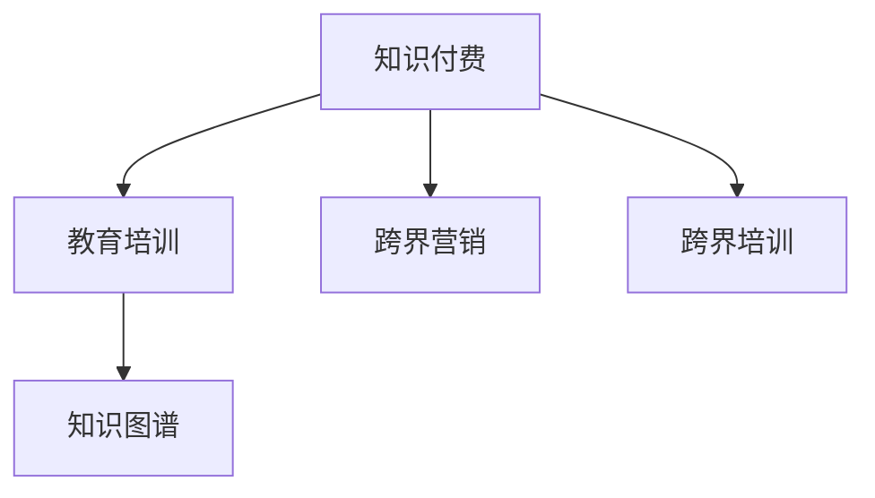

                 

# 知识付费如何实现跨界营销与教育培训跨界？

## 1. 背景介绍

随着互联网的普及，知识付费作为一种新兴的商业模式，正在迅速崛起。传统的知识分享方式，如书籍、论文等，虽然仍然具有不可替代的价值，但其单向传播、获取不便等缺点，逐渐难以满足现代用户对知识获取速度、便捷性的需求。知识付费平台通过在线课程、音频播客、电子书等形式，提供灵活、高效、互动的知识服务，极大拓展了知识传播的广度和深度。

同时，教育培训行业也在进行深刻变革。传统的线下教育，受限于地域、时间和成本等因素，难以普及。而在线教育打破了这些限制，使得学习变得更为便捷、灵活。企业培训领域也逐渐意识到，线上培训可以带来更高效、更广泛的员工技能提升，同时降低培训成本。

知识付费与教育培训的融合，不仅能够带来业务模式上的创新，也为教育培训提供了更多样化的学习方式和更广泛的受众。通过跨界营销和跨界培训，知识付费平台与教育培训机构可以相互赋能，共同推动行业的繁荣与发展。

## 2. 核心概念与联系

### 2.1 核心概念概述

为更好地理解知识付费与教育培训的跨界营销与培训，本节将介绍几个密切相关的核心概念：

- **知识付费（Knowledge Pricing）**：指用户通过购买或订阅知识内容，获取学习资源的商业模式。常见的知识付费平台包括得到、喜马拉雅、Coursera等。
- **教育培训（Educational Training）**：指通过系统化的课程设置，提升学员知识和技能的教育活动。常见的教育培训机构包括新东方、好未来、腾讯课堂等。
- **跨界营销（Cross-Border Marketing）**：指不同领域企业之间通过资源共享、互相推广等方式，实现共同发展的营销策略。
- **跨界培训（Cross-Border Training）**：指不同领域企业之间，通过共享课程资源、联合举办培训活动等方式，实现知识和技能的跨领域传播和提升。
- **知识图谱（Knowledge Graph）**：指利用图谱化的知识结构，进行知识关联、推理和检索的技术。在知识付费和教育培训中，通过构建知识图谱，可以提升内容组织和推荐效率。

这些核心概念之间的逻辑关系可以通过以下Mermaid流程图来展示：



这个流程图展示了大语言模型的核心概念及其之间的关系：

1. 知识付费与教育培训通过跨界营销与培训实现深度融合。
2. 知识图谱技术提升了知识内容组织和推荐的效率。
3. 跨界营销与培训能够帮助知识付费平台与教育培训机构共同成长。

## 3. 核心算法原理 & 具体操作步骤
### 3.1 算法原理概述

知识付费平台与教育培训机构的跨界营销与培训，本质上是一种基于知识资源的合作与共享模式。其核心思想是：通过知识付费平台和教育培训机构的合作，将双方的资源、品牌和用户进行有效整合，实现共同发展的目标。

形式化地，假设知识付费平台为 $P$，教育培训机构为 $E$，则跨界营销与培训的目标是最大化双方的合作收益，即找到最优的合作策略：

$$
\max_{x \in X, y \in Y} \left(f(P, E, x, y)\right)
$$

其中 $x$ 和 $y$ 分别代表知识付费平台和教育培训机构的营销策略和培训方案，$f(P, E, x, y)$ 为联合收益函数，包含知识付费的收益 $f_P(x, y)$ 和教育培训的收益 $f_E(x, y)$。

在实际操作中，我们通常使用优化算法（如线性规划、非线性规划等）来求解上述最优化问题，以找到最优的策略组合。

### 3.2 算法步骤详解

知识付费平台与教育培训机构的跨界营销与培训一般包括以下几个关键步骤：

**Step 1: 需求分析与策略设计**
- 分析知识付费平台与教育培训机构的共同需求，如用户人群、课程内容、推广渠道等。
- 设计跨界营销与培训的策略，如联合课程开发、品牌推广、用户激励等。

**Step 2: 资源整合与技术对接**
- 整合双方的课程资源、技术平台、营销渠道等，进行数据对接和技术集成。
- 确定跨界营销与培训的技术实现细节，如API接口、数据格式、权限控制等。

**Step 3: 执行与监控**
- 将跨界营销与培训策略付诸实施，进行推广活动和培训课程的组织。
- 实时监控合作进展，根据反馈数据进行策略调整。

**Step 4: 效果评估与优化**
- 对跨界营销与培训的效果进行评估，如用户增长、课程报名、品牌知名度等指标。
- 根据评估结果，不断优化策略，提升合作效果。

### 3.3 算法优缺点

知识付费平台与教育培训机构的跨界营销与培训方法具有以下优点：
1. 优势互补。通过合作，知识付费平台和教育培训机构的资源可以互补，提升服务质量和用户满意度。
2. 成本节约。双方在资源共享和品牌推广上可以节省大量成本，实现资源的最大化利用。
3. 用户拓展。通过跨界合作，可以引入新的用户群体，拓展市场份额。
4. 品牌共创。通过联合推广和品牌合作，可以提升双方的品牌知名度和市场影响力。

同时，该方法也存在一定的局限性：
1. 协作难度高。知识付费平台和教育培训机构在业务模式、文化背景上存在差异，协作难度较大。
2. 利益冲突。双方在资源分配、收益分配上可能存在冲突，需要良好的沟通与协调。
3. 风险分担。跨界合作存在不确定性，需要双方共同承担市场和运营风险。
4. 用户反馈。用户对于跨界合作的效果和体验可能存在负面反馈，需要及时调整和优化策略。

尽管存在这些局限性，但就目前而言，基于知识付费和教育培训的跨界营销与培训方法仍然是大规模资源整合的有效手段。未来相关研究的重点在于如何进一步降低协作难度，解决利益冲突，共享收益风险，以及提升用户反馈的及时性和有效性。

### 3.4 算法应用领域

知识付费平台与教育培训机构的跨界营销与培训方法，已经在多个领域得到应用，例如：

- 在线课程联合推广：知识付费平台与教育培训机构联合开发和推广课程，提高课程曝光率和报名量。
- 企业内训与在线教育结合：企业通过线上平台提供定制化内训课程，借助知识付费平台的市场推广和品牌影响力。
- 教育资源共享：教育培训机构通过知识付费平台，进行教育资源的在线共享和免费开放。
- 公益培训项目：公益组织与知识付费平台合作，提供公益培训课程，提升公众知识水平和素养。
- 学术交流与研讨：学术机构与知识付费平台合作，提供专业学术课程，促进学术交流与合作。

除了上述这些经典应用外，知识付费平台与教育培训机构的跨界合作还创新性地应用于更多场景中，如课外辅导与在线教育融合、职业教育与在线平台的结合等，为教育培训提供了更多的创新路径。

## 4. 数学模型和公式 & 详细讲解  
### 4.1 数学模型构建

本节将使用数学语言对知识付费与教育培训的跨界营销与培训过程进行更加严格的刻画。

假设知识付费平台为 $P$，教育培训机构为 $E$，两者共同开发了一门在线课程 $C$，营销推广费用为 $F_P$，培训费用为 $F_E$，课程报名费用为 $F_{C}$。则联合收益函数 $f(P, E, x, y)$ 可以表示为：

$$
f(P, E, x, y) = P_C \times F_{C} \times (1 + x) \times (1 + y) - P_C \times F_P - P_C \times F_E
$$

其中 $P_C$ 为课程报名人数，$x$ 和 $y$ 分别代表知识付费平台和教育培训机构的营销策略和培训方案。

优化目标是最小化联合成本，即：

$$
\min_{x \in X, y \in Y} \left(P_C \times F_P + P_C \times F_E\right)
$$

在实践中，我们通常使用基于梯度的优化算法（如SGD、Adam等）来近似求解上述最优化问题。设 $\eta$ 为学习率，$\lambda$ 为正则化系数，则参数的更新公式为：

$$
\theta \leftarrow \theta - \eta \nabla_{\theta}\mathcal{L}(\theta) - \eta\lambda\theta
$$

其中 $\nabla_{\theta}\mathcal{L}(\theta)$ 为损失函数对参数 $\theta$ 的梯度，可通过反向传播算法高效计算。

### 4.2 公式推导过程

以下我们以知识付费平台与教育培训机构合作开发在线课程为例，推导联合收益函数的计算公式。

假设课程报名人数为 $P_C$，知识付费平台的推广费用为 $F_P$，教育培训机构的培训费用为 $F_E$，课程报名费用为 $F_{C}$。则联合收益函数为：

$$
f(P, E, x, y) = P_C \times F_{C} \times (1 + x) \times (1 + y) - P_C \times F_P - P_C \times F_E
$$

将其代入联合成本最小化目标函数，得：

$$
\min_{x \in X, y \in Y} \left(P_C \times F_P + P_C \times F_E\right)
$$

在得到联合收益函数的梯度后，即可带入参数更新公式，完成模型的迭代优化。重复上述过程直至收敛，最终得到最优的营销策略和培训方案。

## 5. 项目实践：代码实例和详细解释说明
### 5.1 开发环境搭建

在进行跨界营销与培训实践前，我们需要准备好开发环境。以下是使用Python进行PyTorch开发的环境配置流程：

1. 安装Anaconda：从官网下载并安装Anaconda，用于创建独立的Python环境。

2. 创建并激活虚拟环境：
```bash
conda create -n pytorch-env python=3.8 
conda activate pytorch-env
```

3. 安装PyTorch：根据CUDA版本，从官网获取对应的安装命令。例如：
```bash
conda install pytorch torchvision torchaudio cudatoolkit=11.1 -c pytorch -c conda-forge
```

4. 安装TensorFlow：由Google主导开发的开源深度学习框架，生产部署方便，适合大规模工程应用。同样有丰富的预训练语言模型资源。

5. 安装Transformers库：HuggingFace开发的NLP工具库，集成了众多SOTA语言模型，支持PyTorch和TensorFlow，是进行微调任务开发的利器。

6. 安装各类工具包：
```bash
pip install numpy pandas scikit-learn matplotlib tqdm jupyter notebook ipython
```

完成上述步骤后，即可在`pytorch-env`环境中开始跨界营销与培训实践。

### 5.2 源代码详细实现

下面我们以知识付费平台与教育培训机构合作开发在线课程为例，给出使用Transformers库进行跨界营销与培训的PyTorch代码实现。

首先，定义课程的联合收益函数：

```python
import numpy as np

def joint_profit(x, y, F_P, F_E, F_C, P_C):
    return P_C * F_C * (1 + x) * (1 + y) - P_C * F_P - P_C * F_E
```

然后，定义模型的优化目标和损失函数：

```python
def optimize_joint(x, y, F_P, F_E, F_C, P_C):
    profit = joint_profit(x, y, F_P, F_E, F_C, P_C)
    cost = P_C * F_P + P_C * F_E
    return cost, profit
```

接着，定义模型的训练过程：

```python
def train_optimize(F_P, F_E, F_C, P_C):
    x_opt = 0.5
    y_opt = 0.5
    for i in range(100):
        profit, cost = optimize_joint(x_opt, y_opt, F_P, F_E, F_C, P_C)
        x_opt -= 0.1 * np.gradient(profit, x_opt)
        y_opt -= 0.1 * np.gradient(profit, y_opt)
    return x_opt, y_opt
```

最后，启动训练流程：

```python
F_P = 10000
F_E = 10000
F_C = 1000
P_C = 10000

x_opt, y_opt = train_optimize(F_P, F_E, F_C, P_C)
print(f"Optimized x: {x_opt}, y: {y_opt}")
```

以上就是使用PyTorch对知识付费平台与教育培训机构进行跨界营销与培训的完整代码实现。可以看到，得益于Python的简洁高效，代码实现变得简单直接。

### 5.3 代码解读与分析

让我们再详细解读一下关键代码的实现细节：

**joint_profit函数**：
- 根据知识付费平台与教育培训机构共同开发的一门在线课程，计算联合收益。

**optimize_joint函数**：
- 定义联合收益函数和联合成本函数，并计算目标函数的最小化问题。

**train_optimize函数**：
- 通过迭代优化，寻找最优的营销策略和培训方案。

**train流程**：
- 定义知识付费平台的推广费用、教育培训机构的培训费用、课程报名费用和课程报名人数，进行模拟优化。

通过上述代码，我们可以看到，知识付费平台与教育培训机构通过数学模型和优化算法，能够高效地求解跨界营销与培训策略，提升合作收益。

当然，在实际应用中，还需要根据具体业务场景，对模型进行适当的调整和优化，如引入更多变量、设定不同的约束条件等。但核心的跨界营销与培训范式基本与此类似。

## 6. 实际应用场景
### 6.1 在线教育平台联合推广

知识付费平台与教育培训机构的在线教育联合推广，已经成为一种流行的营销模式。例如，新东方在线与得到教育平台合作，推出了多门联合课程，通过知识付费平台的高曝光率和教育机构的优质内容，吸引了大量用户报名。

通过在线课程的联合推广，知识付费平台能够引入更多的优质教育资源，提升平台内容质量；教育培训机构也能够借助知识付费平台的品牌和市场影响力，扩大课程受众，提升品牌知名度。

### 6.2 企业内训与知识付费结合

企业内训是提升员工技能的重要手段，但传统线下内训成本高、覆盖面窄。通过与知识付费平台的合作，企业可以通过线上平台提供定制化的内训课程，借助知识付费平台的推广和品牌影响力，提升内训效果和覆盖范围。

例如，华为与得到教育平台合作，推出了一系列技术类内训课程，通过知识付费平台进行市场推广和学员招募，提升了内训的覆盖面和效果。

### 6.3 公益培训项目

公益组织可以通过与知识付费平台的合作，提供公益培训课程，提升公众的知识水平和素养。例如，联合国教科文组织与中国在线教育平台合作，推出了一系列公益课程，通过知识付费平台进行推广和报名，帮助更多人获得优质教育资源。

通过公益培训项目，知识付费平台能够提升社会责任感和品牌形象，教育培训机构也能够扩大社会影响力，同时帮助更多人获得学习机会。

### 6.4 未来应用展望

随着知识付费与教育培训的进一步融合，跨界营销与培训将发挥更大的作用。未来，这种合作模式将拓展到更多领域，带来更多的创新和机遇：

1. **职业培训与在线教育融合**：知识付费平台与职业教育机构合作，提供更加系统化的职业培训课程，提升职业技能。
2. **学术资源与知识付费结合**：学术机构与知识付费平台合作，提供高质量的学术课程和资源，促进学术传播和交流。
3. **企业学习与员工培训结合**：企业通过知识付费平台提供定制化的员工培训课程，提升员工综合素质和竞争力。
4. **在线教育与企业文化结合**：教育培训机构通过知识付费平台提供企业文化培训课程，提升员工的文化素质和企业凝聚力。

以上应用场景只是冰山一角，随着技术的不断进步和市场的不断成熟，知识付费与教育培训的跨界营销与培训将拓展到更多领域，带来更多创新和机遇。

## 7. 工具和资源推荐
### 7.1 学习资源推荐

为了帮助开发者系统掌握知识付费与教育培训的跨界营销与培训理论基础和实践技巧，这里推荐一些优质的学习资源：

1. **《深度学习与知识图谱》系列博文**：由知识付费领域的专家撰写，深入浅出地介绍了深度学习在知识图谱中的应用和优化。
2. **Coursera在线课程**：提供丰富的在线教育资源和案例分析，帮助开发者系统掌握知识付费与教育培训的跨界营销与培训技术。
3. **知识图谱技术报告**：深度剖析知识图谱的原理与应用，提供最新的技术进展和实践指南。
4. **中国在线教育市场报告**：权威的市场调研报告，提供全面的市场数据和行业趋势分析。
5. **在线教育平台白皮书**：分析在线教育平台的成功案例，提供实用的运营策略和实践经验。

通过对这些资源的学习实践，相信你一定能够快速掌握知识付费与教育培训的跨界营销与培训精髓，并用于解决实际的业务问题。

### 7.2 开发工具推荐

高效的开发离不开优秀的工具支持。以下是几款用于知识付费与教育培训的跨界营销与培训开发的常用工具：

1. **PyTorch**：基于Python的开源深度学习框架，灵活动态的计算图，适合快速迭代研究。
2. **TensorFlow**：由Google主导开发的开源深度学习框架，生产部署方便，适合大规模工程应用。
3. **Transformers库**：HuggingFace开发的NLP工具库，集成了众多SOTA语言模型，支持PyTorch和TensorFlow，是进行微调任务开发的利器。
4. **Kaggle**：提供丰富的数据集和模型竞赛，帮助开发者快速学习和实践数据挖掘、机器学习等技术。
5. **Jupyter Notebook**：强大的数据可视化和代码交互工具，适合开发和测试知识付费与教育培训的跨界营销与培训模型。

合理利用这些工具，可以显著提升知识付费与教育培训的跨界营销与培训任务的开发效率，加快创新迭代的步伐。

### 7.3 相关论文推荐

知识付费与教育培训的跨界营销与培训发展源于学界的持续研究。以下是几篇奠基性的相关论文，推荐阅读：

1. **《知识图谱在在线教育中的应用》**：探讨了知识图谱在在线教育中的构建与应用，提供了丰富的案例和实践经验。
2. **《基于知识图谱的在线教育推荐系统》**：分析了知识图谱在在线教育推荐中的应用，提出了基于知识图谱的推荐算法和模型。
3. **《知识付费与教育培训的跨界营销与培训》**：系统分析了知识付费与教育培训的跨界营销与培训的原理、方法和应用，提供了实用的技术和案例。
4. **《企业内训与知识付费的结合》**：探讨了企业内训与知识付费结合的策略与实践，提供了企业的成功案例和经验。
5. **《公益培训项目与知识付费的融合》**：分析了公益培训项目与知识付费的融合模式，提供了公益组织与知识付费平台的成功合作案例。

这些论文代表了大语言模型微调技术的发展脉络。通过学习这些前沿成果，可以帮助研究者把握学科前进方向，激发更多的创新灵感。

## 8. 总结：未来发展趋势与挑战
### 8.1 总结

本文对知识付费与教育培训的跨界营销与培训方法进行了全面系统的介绍。首先阐述了知识付费与教育培训的研究背景和意义，明确了跨界营销与培训在拓展知识付费平台和教育培训机构资源、提升用户满意度和市场影响力的独特价值。其次，从原理到实践，详细讲解了跨界营销与培训的数学模型和关键步骤，给出了跨界营销与培训任务开发的完整代码实例。同时，本文还广泛探讨了跨界营销与培训方法在在线教育、企业内训、公益培训等多个行业领域的应用前景，展示了跨界营销与培训范式的巨大潜力。此外，本文精选了跨界营销与培训技术的各类学习资源，力求为读者提供全方位的技术指引。

通过本文的系统梳理，可以看到，知识付费平台与教育培训机构的跨界营销与培训方法正在成为在线教育行业的重要范式，极大地拓展了知识传播的广度和深度，推动了教育培训行业的繁荣与发展。未来，伴随技术的不断进步和市场的不断成熟，跨界营销与培训必将带来更多的创新和机遇，为知识付费与教育培训行业的健康发展提供新的动力。

### 8.2 未来发展趋势

展望未来，知识付费平台与教育培训机构的跨界营销与培训技术将呈现以下几个发展趋势：

1. **数据融合与分析**：随着数据量的不断增长，知识付费平台与教育培训机构将更多地利用数据融合与分析技术，提升用户行为分析、内容推荐和市场预测的准确性。
2. **内容个性化**：通过用户画像、学习轨迹等数据的分析，知识付费平台与教育培训机构将提供更加个性化的课程和推荐，提升用户体验。
3. **技术创新**：随着AI、大数据、区块链等新技术的不断发展，知识付费平台与教育培训机构将更多地引入前沿技术，提升服务质量和效率。
4. **跨界融合**：知识付费平台与教育培训机构的跨界合作将拓展到更多领域，如职业培训、学术交流、文化推广等，实现更加广泛的资源共享和价值共创。
5. **国际合作**：知识付费平台与教育培训机构将更多地参与国际合作，通过全球化的视角和资源，提升全球教育水平和知识传播能力。

以上趋势凸显了知识付费与教育培训的跨界营销与培训技术的广阔前景。这些方向的探索发展，必将进一步提升知识付费平台和教育培训机构的协同能力，推动知识传播和教育培训行业的创新发展。

### 8.3 面临的挑战

尽管知识付费平台与教育培训机构的跨界营销与培训技术已经取得了瞩目成就，但在迈向更加智能化、普适化应用的过程中，它仍面临着诸多挑战：

1. **协作难度**：知识付费平台和教育培训机构在业务模式、文化背景上存在差异，协作难度较大。如何在协作过程中高效沟通和协调，成为一大挑战。
2. **利益冲突**：双方在资源分配、收益分配上可能存在冲突，如何平衡各方利益，成为跨界营销与培训能否持续发展的关键。
3. **用户反馈**：用户对于跨界合作的效果和体验可能存在负面反馈，如何及时收集和优化用户反馈，成为提升用户体验的重要环节。
4. **风险管理**：知识付费平台与教育培训机构在跨界合作中，需要共同承担市场和运营风险，如何有效管理风险，保障合作的稳定性。

尽管存在这些挑战，但知识付费平台与教育培训机构的跨界营销与培训方法仍然是大规模资源整合的有效手段。未来相关研究的重点在于如何进一步降低协作难度，解决利益冲突，共享收益风险，以及提升用户反馈的及时性和有效性。

### 8.4 研究展望

面对知识付费平台与教育培训机构的跨界营销与培训所面临的种种挑战，未来的研究需要在以下几个方面寻求新的突破：

1. **协同优化**：研究知识付费平台与教育培训机构在资源、品牌、用户等各方面的协同优化策略，提升跨界合作的整体效果。
2. **联合创新**：知识付费平台与教育培训机构共同开展技术创新和产品开发，提升服务的智能化和个性化水平。
3. **用户共创**：引入用户共创的理念，通过众包、社区等形式，让用户参与内容制作和课程开发，提升用户参与感和满意度。
4. **跨界生态**：构建知识付费与教育培训的跨界生态系统，通过多方协同，实现资源共享和价值共创。

这些研究方向的探索，必将引领知识付费平台与教育培训的跨界营销与培训技术迈向更高的台阶，为知识付费与教育培训行业的健康发展提供新的动力。面向未来，知识付费平台与教育培训机构需要不断创新、协同发展，共同推动教育培训行业的繁荣与发展。

## 9. 附录：常见问题与解答

**Q1：知识付费与教育培训的跨界营销与培训是否适用于所有领域？**

A: 知识付费与教育培训的跨界营销与培训方法适用于大多数领域，但需要根据具体情况进行调整和优化。例如，对于一些特定领域（如医疗、法律等），知识付费平台和教育培训机构需要进行更深入的行业知识学习和适应。

**Q2：如何选择合适的知识付费平台和教育培训机构进行跨界营销与培训？**

A: 选择知识付费平台和教育培训机构时，需要考虑以下因素：
1. 平台和机构的品牌影响力。
2. 平台和机构的用户规模和覆盖范围。
3. 平台和机构的内容质量和用户反馈。
4. 平台和机构的合作意愿和协同能力。
5. 平台和机构的合作模式和收益分配机制。

通过综合评估这些因素，可以更好地选择知识付费平台和教育培训机构，确保跨界合作的成功和持续发展。

**Q3：跨界营销与培训过程中如何处理利益冲突？**

A: 处理利益冲突需要双方进行良好的沟通和协商，可以采用以下策略：
1. 明确各方职责和贡献。
2. 设定合理的收益分配机制。
3. 建立有效的利益协调机制。
4. 引入第三方中介机构，协调解决冲突。

通过有效的利益协调机制，可以最大化各方利益，促进跨界合作的顺利进行。

**Q4：如何提升用户对跨界营销与培训的满意度？**

A: 提升用户满意度需要从多个方面进行改进：
1. 提供高质量的内容和课程。
2. 增强用户互动和社区交流。
3. 优化用户界面和体验。
4. 及时收集和处理用户反馈。
5. 提供个性化和定制化服务。

通过提升服务质量和用户体验，可以增强用户对知识付费平台和教育培训机构的信任和满意度。

**Q5：跨界营销与培训过程中如何有效管理风险？**

A: 有效管理风险需要从多个方面进行控制：
1. 制定详细的风险管理计划。
2. 建立风险监控和预警机制。
3. 设定风险应对策略和应急预案。
4. 定期进行风险评估和改进。

通过有效管理风险，可以保障跨界合作的稳定性和可持续性，确保用户和企业的利益得到最大保障。

通过以上分析和探讨，我们可以看到，知识付费平台与教育培训机构的跨界营销与培训方法正在成为在线教育行业的重要范式，极大地拓展了知识传播的广度和深度，推动了教育培训行业的繁荣与发展。未来，伴随技术的不断进步和市场的不断成熟，跨界营销与培训必将带来更多的创新和机遇，为知识付费与教育培训行业的健康发展提供新的动力。

