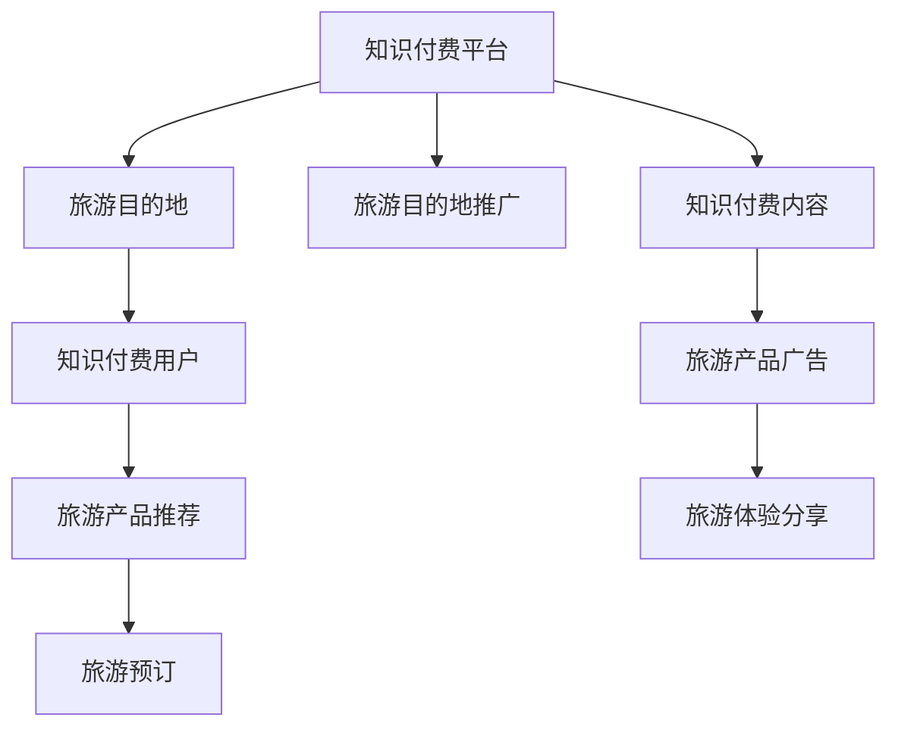

                 

# 知识付费如何实现跨界营销与旅游出行跨界？

## 1. 背景介绍

随着知识付费领域的兴起，越来越多的内容生产者和企业开始寻求跨界营销的合作方式，以拓展业务范围和提升市场影响力。其中，旅游出行成为与知识付费结合的热门跨界领域。本文将深入探讨知识付费如何与旅游出行实现跨界营销，以及这种合作方式的具体实现方法和策略。

## 2. 核心概念与联系

### 2.1 核心概念概述

1. **知识付费**：指用户为获取有价值的信息和知识而支付费用的服务模式。涵盖在线课程、电子书、音频内容等，强调内容的深度和专业性。
2. **跨界营销**：不同行业之间的合作营销策略，通过跨界整合资源和优势，实现品牌、产品或服务的相互推广。
3. **旅游出行**：指人们通过各种交通方式在不同地点之间进行移动，包括航空、铁路、公路、海运等多种方式。
4. **目的地营销**：指通过各种手段和策略，吸引游客前往特定旅游目的地，提高目的地知名度和吸引力。

这些概念之间存在紧密的联系。知识付费平台可以利用其内容传播能力，为旅游目的地带来品牌曝光和潜在客户；旅游出行则可以通过平台推广特色旅游产品，吸引更多知识付费用户，实现双赢。

### 2.2 核心概念联系

知识付费与旅游出行的跨界营销可以建立在以下联系上：

- **用户画像重叠**：知识付费平台的用户通常对教育和提升自我有较高需求，这与旅游用户追求知识和体验增长相契合。
- **内容传播渠道共享**：知识付费平台的内容传播渠道（如App、微信公众号、社交媒体等），可以同时用于推广旅游产品。
- **产品互补性**：知识付费内容和旅游产品具有互补性，前者提供知识、技能等软性产品，后者提供实际体验、休闲放松等硬性产品。
- **营销成本共担**：通过合作，双方可以在营销成本上实现资源共享，降低单方投入。

以下是一个简化的Mermaid流程图，展示知识付费与旅游出行的跨界营销过程：



## 3. 核心算法原理 & 具体操作步骤

### 3.1 算法原理概述

知识付费与旅游出行的跨界营销主要依赖于以下算法原理：

1. **推荐系统**：通过分析用户行为数据和偏好，推荐与旅游相关的知识和产品。
2. **内容生成与优化**：利用自然语言处理（NLP）等技术，生成高质量的旅游内容，并通过优化算法提升内容吸引力和转化率。
3. **用户画像分析**：利用机器学习算法分析用户画像，预测用户的旅游兴趣和需求。
4. **动态定价策略**：通过算法预测市场需求，动态调整旅游产品价格，实现收益最大化。

### 3.2 算法步骤详解

**Step 1: 用户画像分析**

- 收集用户的基本信息（如年龄、性别、职业等）、历史行为数据（如浏览、购买记录）、社交媒体互动数据等。
- 利用聚类算法和特征提取技术，生成用户画像，包括用户的兴趣、偏好和旅游行为模式。

**Step 2: 内容生成与优化**

- 根据用户画像，生成定制化的旅游相关内容，如旅游攻略、目的地介绍、旅游故事等。
- 使用NLP技术对内容进行优化，提高内容的可读性和吸引力。
- 通过A/B测试等方法，评估内容的转化效果，不断迭代优化。

**Step 3: 推荐系统设计**

- 设计推荐算法，根据用户的兴趣和行为，推荐适合的旅游内容和产品。
- 考虑用户偏好和多样性，采用协同过滤、基于内容的推荐等算法。
- 定期更新推荐算法，保持推荐结果的实时性和准确性。

**Step 4: 动态定价策略**

- 基于市场需求和竞争情况，设计动态定价模型。
- 利用机器学习算法预测市场需求，实时调整产品价格。
- 考虑用户的心理预期和价值感知，设计合理的定价策略。

### 3.3 算法优缺点

**优点**：

- **提升品牌曝光度**：通过知识付费平台进行旅游产品推广，能够吸引更多潜在用户。
- **降低营销成本**：双方共同投入资源，降低单方营销成本。
- **精准推荐**：利用推荐算法，为用户提供个性化的旅游产品推荐，提升用户满意度和转化率。
- **数据驱动决策**：通过数据分析，优化营销策略，实现更高效的资源利用。

**缺点**：

- **协调复杂**：不同行业间的合作需要协调多个方面，包括资源、利益分配等。
- **用户隐私保护**：需要严格保护用户隐私，避免数据泄露和滥用。
- **跨界适应性**：不同行业的运营模式和业务流程差异较大，需要进行适应性调整。
- **风险共担**：双方合作中的风险需要合理分配，避免单方承担过多风险。

### 3.4 算法应用领域

知识付费与旅游出行的跨界营销可以应用于以下领域：

- **在线教育平台**：如Coursera、Udemy等，提供旅游相关的在线课程和知识。
- **旅游内容平台**：如TripAdvisor、马蜂窝等，推广旅游目的地和产品。
- **知识付费应用**：如得到、喜马拉雅等，整合旅游产品推荐和内容推广。
- **社交媒体平台**：如微信、微博等，进行旅游相关的互动和推广。

## 4. 数学模型和公式 & 详细讲解 & 举例说明

### 4.1 数学模型构建

以下是一个简化的推荐系统数学模型：

- **用户画像矩阵**：$U \in R^{N \times F}$，其中$N$为用户数，$F$为特征数。
- **物品特征矩阵**：$I \in R^{M \times F}$，其中$M$为物品数。
- **用户-物品评分矩阵**：$R \in R^{N \times M}$，其中$R_{ij}$为用户$i$对物品$j$的评分。
- **物品嵌入向量**：$V \in R^{M \times L}$，其中$L$为嵌入维度。
- **用户嵌入向量**：$U \in R^{N \times L}$。

### 4.2 公式推导过程

1. **用户嵌入计算**：
   $$
   U = X^TW
   $$
   其中$X \in R^{N \times F}$为原始用户画像数据，$W \in R^{F \times L}$为嵌入矩阵。

2. **物品嵌入计算**：
   $$
   V = I^TV
   $$
   其中$T \in R^{F \times L}$为嵌入矩阵。

3. **用户-物品评分预测**：
   $$
   \hat{R}_{ij} = U_i^TV_j
   $$
   其中$\hat{R}_{ij}$为预测评分。

4. **评分矩阵分解**：
   $$
   R = UV^T
   $$
   通过分解评分矩阵，得到用户和物品的嵌入向量。

### 4.3 案例分析与讲解

假设某知识付费平台上有10万用户，每个用户有5个特征（年龄、性别、兴趣、历史行为、社交互动），共20个旅游目的地，每个目的地有3个特征（地理位置、活动内容、价格）。

- **用户画像矩阵**$U$：$N=100000, F=5$
- **物品特征矩阵**$I$：$M=20, F=3$
- **用户-物品评分矩阵**$R$：$N=100000, M=20$

通过上述公式，计算用户和物品的嵌入向量$U$和$V$，然后利用嵌入向量计算预测评分，最终生成推荐列表。

## 5. 项目实践：代码实例和详细解释说明

### 5.1 开发环境搭建

- **开发语言**：Python
- **开发框架**：TensorFlow
- **环境搭建步骤**：
  1. 安装TensorFlow和其他必要的依赖库。
  2. 准备用户画像数据、物品特征数据和用户-物品评分数据。
  3. 搭建推荐系统框架，包括用户嵌入计算、物品嵌入计算、评分预测和评分矩阵分解等模块。

### 5.2 源代码详细实现

以下是一个简化的推荐系统代码实现：

```python
import tensorflow as tf
import numpy as np

# 用户画像矩阵U
U = np.random.rand(100000, 5)

# 物品特征矩阵I
I = np.random.rand(20, 3)

# 物品嵌入向量V
V = np.random.rand(20, 10)

# 用户嵌入向量W
W = np.random.rand(5, 10)

# 用户-物品评分矩阵R
R = np.random.rand(100000, 20)

# 用户嵌入计算
U_embed = tf.keras.layers.Dense(10, activation='relu')(tf.keras.layers.Dense(5, activation='relu')(U))

# 物品嵌入计算
I_embed = tf.keras.layers.Dense(10, activation='relu')(tf.keras.layers.Dense(3, activation='relu')(I))

# 用户嵌入向量U
U = tf.keras.layers.Dense(10, activation='relu')(U_embed)

# 物品嵌入向量V
V = tf.keras.layers.Dense(10, activation='relu')(I_embed)

# 用户-物品评分预测
predicted_R = tf.reduce_sum(tf.multiply(U, V), axis=1)

# 评分矩阵分解
R = tf.keras.layers.Dot(axes=[2, 2])([U, V])

# 训练和评估
model = tf.keras.models.Model(inputs=[U, I], outputs=predicted_R)
model.compile(optimizer='adam', loss='mse')
model.fit([U, I], R, epochs=10, batch_size=32)
model.evaluate([U, I], R, batch_size=32)
```

### 5.3 代码解读与分析

这段代码实现了一个基本的推荐系统，包括以下关键步骤：

- **用户嵌入计算**：首先通过两个全连接层计算用户嵌入向量$U$。
- **物品嵌入计算**：同样通过两个全连接层计算物品嵌入向量$V$。
- **评分预测**：通过点乘计算用户和物品的嵌入向量，得到预测评分。
- **评分矩阵分解**：通过点乘操作，将评分矩阵$R$分解为用户嵌入向量$U$和物品嵌入向量$V$的乘积。
- **模型训练和评估**：定义模型，使用Adam优化器和均方误差损失函数进行训练和评估。

## 6. 实际应用场景

### 6.1 在线教育平台

在线教育平台可以通过知识付费与旅游出行的跨界营销，推广旅游相关的课程和讲座，吸引更多用户。例如，某在线教育平台可以邀请知名旅游专家录制旅游知识课程，通过知识付费平台进行推广，同时结合旅游出行的优惠活动，吸引用户报名旅游课程。

### 6.2 旅游内容平台

旅游内容平台可以利用知识付费平台的数据分析和推荐算法，为用户推荐个性化的旅游攻略和目的地。例如，某旅游内容平台可以与知识付费平台合作，通过用户画像和推荐系统，精准推送个性化旅游内容，吸引更多用户访问平台。

### 6.3 知识付费应用

知识付费应用可以通过旅游内容来丰富其内容生态，提升用户体验。例如，某知识付费应用可以在推荐系统中添加旅游相关的推荐内容，如旅游视频、音频、文章等，增加用户粘性和活跃度。

### 6.4 社交媒体平台

社交媒体平台可以利用知识付费与旅游出行的跨界营销，提高平台的互动性和内容丰富度。例如，某社交媒体平台可以与知识付费平台合作，定期举办旅游相关的内容活动，如旅游知识问答、旅游故事分享等，吸引更多用户参与互动。

## 7. 工具和资源推荐

### 7.1 学习资源推荐

1. **《推荐系统实战》**：详细介绍推荐系统算法和实际案例，适合深度学习工程师参考。
2. **《知识付费平台运营手册》**：包含知识付费平台运营的全面指南，包括内容生产、用户管理、盈利模式等。
3. **《旅游行业大数据应用》**：介绍旅游行业大数据技术的应用，涵盖旅游目的地推广、用户行为分析等。
4. **《自然语言处理与深度学习》**：涵盖自然语言处理和深度学习的基础知识，适合入门学习。

### 7.2 开发工具推荐

1. **TensorFlow**：适合构建推荐系统等深度学习模型。
2. **PyTorch**：适合构建复杂的推荐系统，支持动态图和静态图计算。
3. **Scikit-learn**：适合进行用户画像分析和特征工程。
4. **Apache Hadoop**：适合处理大规模数据，支持分布式计算。
5. **MySQL/MongoDB**：适合存储和查询用户行为数据。

### 7.3 相关论文推荐

1. **《基于协同过滤的推荐系统》**：介绍协同过滤推荐算法的基本原理和实现方法。
2. **《深度学习在知识付费中的应用》**：探讨深度学习技术在知识付费平台中的应用，包括用户画像分析、推荐系统设计等。
3. **《旅游大数据在目的地营销中的应用》**：介绍旅游大数据技术在目的地营销中的应用，涵盖用户行为分析、需求预测等。
4. **《动态定价策略在旅游业中的应用》**：探讨动态定价策略在旅游业中的应用，包括实时调价、预测市场需求等。

## 8. 总结：未来发展趋势与挑战

### 8.1 总结

本文系统介绍了知识付费与旅游出行的跨界营销方法，包括算法原理和具体操作步骤。通过推荐系统、内容生成与优化、用户画像分析、动态定价策略等算法，实现了知识付费平台和旅游出行的深度融合，提高了品牌曝光度、降低营销成本、提升用户转化率。

### 8.2 未来发展趋势

1. **AI驱动的推荐系统**：未来推荐系统将更加智能化，通过深度学习、增强学习等技术，提升推荐结果的准确性和个性化程度。
2. **跨界数据融合**：更多行业的数据将进行深度融合，实现更全面的用户画像和推荐。
3. **内容生态构建**：通过跨界合作，构建丰富多样的内容生态，提升用户粘性和满意度。
4. **全渠道营销**：跨界营销将覆盖更多渠道，如社交媒体、视频平台、搜索引擎等，实现全渠道的协同推广。

### 8.3 面临的挑战

1. **数据隐私和安全**：跨界合作中的数据隐私和安全问题，需要严格保护用户信息。
2. **技术融合难度**：不同行业的技术体系和数据格式差异较大，需要进行复杂的技术适配和整合。
3. **用户需求多样性**：不同用户的兴趣和需求差异较大，需要灵活的推荐策略。
4. **利益分配公平性**：跨界合作中的利益分配需要公平透明，避免单方承担过多风险。

### 8.4 研究展望

1. **跨界营销模型优化**：开发更高效、更智能的跨界营销模型，提升跨界合作的实际效果。
2. **多模态数据融合**：融合视觉、听觉等多模态数据，提升用户体验和推荐效果。
3. **实时反馈系统**：建立实时反馈系统，根据用户反馈不断优化推荐和营销策略。
4. **自动化系统建设**：通过自动化系统，实现跨界合作的自动化流程和决策。

## 9. 附录：常见问题与解答

**Q1: 如何选择合适的知识付费内容进行跨界营销？**

A: 选择合适的知识付费内容进行跨界营销，需要考虑以下几个方面：
- **用户兴趣**：选择与旅游相关的热门课程或讲座，吸引更多用户关注。
- **内容质量**：选择高质量的内容，确保用户有良好的学习体验。
- **市场热度**：选择当前热门的旅游相关课程，增加话题曝光度。
- **用户需求**：根据用户画像，选择能够满足用户需求的旅游相关课程。

**Q2: 如何进行跨界营销的用户画像分析？**

A: 进行跨界营销的用户画像分析，可以按照以下步骤进行：
- **数据收集**：收集用户的基本信息、历史行为数据、社交互动数据等。
- **特征提取**：提取用户画像的关键特征，如年龄、性别、兴趣、行为等。
- **聚类分析**：利用聚类算法，将用户分为不同的群体，找到具有相似特征的用户群。
- **用户画像生成**：根据聚类结果，生成用户画像，包括用户的兴趣、偏好和行为模式。

**Q3: 如何设计动态定价策略？**

A: 设计动态定价策略，可以按照以下步骤进行：
- **市场需求分析**：利用机器学习算法，预测市场需求和价格变化趋势。
- **竞争对手分析**：分析竞争对手的定价策略和价格变化，找到定价优势。
- **收益最大化模型**：根据市场需求和竞争对手价格，设计收益最大化模型，动态调整旅游产品价格。
- **用户心理预期**：考虑用户的心理预期和价值感知，设计合理的定价策略，避免价格过高或过低。

**Q4: 如何利用知识付费平台进行旅游出行的跨界营销？**

A: 利用知识付费平台进行旅游出行的跨界营销，可以按照以下步骤进行：
- **内容生成与优化**：生成与旅游相关的知识内容，如旅游攻略、目的地介绍、旅游故事等，并进行优化。
- **推荐系统设计**：设计推荐算法，根据用户画像和行为，推荐适合的旅游内容和产品。
- **广告投放**：通过知识付费平台进行旅游产品和目的地的广告投放，吸引更多用户关注和参与。
- **用户互动**：通过社交媒体等渠道，与用户进行互动，收集反馈和意见，不断优化推荐和营销策略。

**Q5: 如何平衡跨界合作中的利益分配？**

A: 平衡跨界合作中的利益分配，可以按照以下步骤进行：
- **利益分配模型设计**：设计合理的利益分配模型，考虑双方的投入和收益。
- **风险共担机制**：建立风险共担机制，明确各方在合作中的责任和风险。
- **合同签订**：签订详细的合同，明确合作内容和双方的权利义务。
- **透明度和公平性**：保持利益分配的透明度和公平性，定期审计和评估合作效果。

通过深入探讨知识付费与旅游出行的跨界营销方法，本文希望能为更多企业和平台提供实际可行的解决方案，实现跨界合作的共赢局面。未来，随着技术的不断进步和应用的不断深入，跨界营销将具有更广阔的发展前景和更丰富的应用场景。

