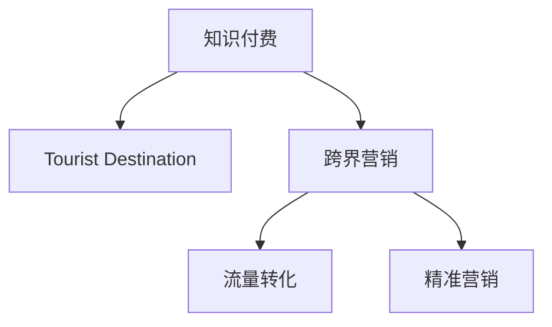

                 

# 知识付费如何实现跨界营销与旅游目的地跨界？

## 1. 背景介绍

### 1.1 问题由来
随着互联网技术的迅速发展，知识付费行业正处于快速成长阶段。与此同时，旅游目的地营销也面临着推广力度不足、游客转化率低的困境。将知识付费与旅游目的地跨界融合，通过知识付费平台进行目的地推广，既可以解决知识付费的营收压力，也能为旅游目的地带来可观的游客流量。这种跨界营销方式正在被越来越多的旅游企业采用，并取得初步成功。

### 1.2 问题核心关键点
实现知识付费与旅游目的地跨界融合的关键在于：
1. 如何构建高质量、有吸引力的旅游内容，使其在知识付费平台上吸引用户关注。
2. 如何将知识付费平台的流量有效地转化为旅游目的地的游客流量。
3. 如何实现旅游目的地的精准定位，满足不同用户的旅游需求。
4. 如何优化跨界营销策略，提高营销效果。

### 1.3 问题研究意义
将知识付费与旅游目的地跨界融合，不仅能够提升知识付费平台的营收，也能为旅游目的地带来新的营销渠道和游客流量。这种跨界营销方式有助于知识付费平台和旅游目的地实现共赢，推动双方的共同发展。

## 2. 核心概念与联系

### 2.1 核心概念概述

为更好地理解知识付费与旅游目的地跨界营销的原理，本节将介绍几个关键概念：

- **知识付费（Knowledge-Subscribed Model）**：用户为获取知识、技能、信息等内容而支付费用的模式。知识付费平台通过优质内容吸引用户付费，形成商业循环。

- **旅游目的地（Tourist Destination）**：吸引旅游者旅游、观光、休闲的地理位置，如城市、景点、景区等。

- **跨界营销（Cross-Industry Marketing）**：不同领域或行业之间的营销活动。通过跨界合作，实现资源共享、优势互补，提高营销效果。

- **流量转化（Traffic Conversion）**：将访问流量转化为实际的用户转化。在跨界营销中，将知识付费平台的流量转化为旅游目的地的游客流量。

- **精准营销（Precision Marketing）**：根据用户的行为和属性，进行有针对性的营销推广，提高营销效果。

这些核心概念之间的逻辑关系可以通过以下Mermaid流程图来展示：



这个流程图展示了两大领域跨界营销的核心概念及其之间的关系：

1. 知识付费平台为旅游目的地提供营销渠道。
2. 通过跨界营销，实现流量从知识付费平台到旅游目的地的转化。
3. 精准营销进一步提升流量转化的效果。

这些概念共同构成了知识付费与旅游目的地跨界营销的逻辑框架，使得平台和目的地能够有效合作，提升双方的价值。

## 3. 核心算法原理 & 具体操作步骤
### 3.1 算法原理概述

知识付费与旅游目的地跨界营销的原理，本质上是一个跨领域的联合优化问题。其核心思想是：通过知识付费平台和旅游目的地的共同优化，最大化双方营销收益。

形式化地，假设知识付费平台的月活跃用户数为 $U$，旅游目的地的月游客数为 $V$，设平台提供给目的地的营销成本为 $C$。目标是在给定营销成本下，最大化 $U$ 和 $V$ 的乘积。

因此，优化目标可以表述为：

$$
\max_{U, V} U \times V \text{ ，约束 } U \times V \geq C
$$

为了实现这一目标，平台和目的地需要进行联合优化，选择最佳的营销策略和内容。

### 3.2 算法步骤详解

实现知识付费与旅游目的地跨界营销，通常包括以下几个关键步骤：

**Step 1: 数据准备与平台选择**
- 收集知识付费平台和旅游目的地的相关数据。如平台的用户行为数据、目的地的游客流量数据等。
- 选择合适的知识付费平台和旅游目的地，考虑用户覆盖、平台流量、目的地吸引力等因素。

**Step 2: 构建高质量旅游内容**
- 根据旅游目的地的特色，设计吸引用户关注的旅游内容。如目的地介绍、旅游攻略、游记分享等。
- 邀请旅游专家、达人进行内容创作，提升内容的权威性和吸引力。
- 使用图文并茂、视频、直播等形式，丰富内容展示形式，吸引用户。

**Step 3: 设计跨界营销策略**
- 设计精准的广告投放策略，选择合适的广告位和投放时间。
- 利用知识付费平台的推荐算法，进行有针对性的内容推荐。
- 开展联合营销活动，如在线讲座、直播互动、优惠券发放等，吸引用户关注。

**Step 4: 实施流量转化**
- 通过平台用户的互动行为，如点赞、评论、转发等，识别潜在的游客。
- 利用旅游目的地的CRM系统，对识别出的潜在游客进行跟进和转化。
- 提供旅游套餐、优惠活动等促销措施，提高游客的转化率。

**Step 5: 效果评估与优化**
- 定期评估跨界营销效果，如用户增长、游客转化率等指标。
- 根据效果评估结果，调整营销策略和内容，持续优化跨界营销方案。
- 利用A/B测试等方法，探索最优的营销策略和内容组合。

以上是知识付费与旅游目的地跨界营销的一般流程。在实际应用中，还需要根据具体平台和目的地的特点，对各个环节进行优化设计，如改进推荐算法、设计更有效的转化策略等。

### 3.3 算法优缺点

知识付费与旅游目的地跨界营销方法具有以下优点：
1. 多渠道引流。通过知识付费平台和目的地联合优化，充分利用两者的渠道优势，吸引更多用户。
2. 精准定位。利用平台的数据分析能力，对用户进行精准定位，提高转化率。
3. 提升用户体验。平台提供有价值的内容，提升用户的粘性和满意度。
4. 提高收益。平台通过联合营销获得更多收入，目的地也带来更多游客流量。

同时，该方法也存在一定的局限性：
1. 平台流量波动大。知识付费平台的流量不总是稳定，影响跨界营销的效果。
2. 内容质量依赖专家。内容质量依赖于旅游专家的创作，创作过程不易把控。
3. 转化率难以保证。转化率受平台和目的地的互动行为影响较大，难以完全保证。
4. 营销成本高。跨界营销需要投入大量资源，如内容创作、平台投放等，成本较高。

尽管存在这些局限性，但就目前而言，知识付费与旅游目的地跨界营销方法在跨界营销中已展现出了显著的效果，值得进一步推广和优化。

### 3.4 算法应用领域

知识付费与旅游目的地跨界营销在以下领域已得到广泛应用：

- **在线教育平台**：与旅游目的地合作，推出针对特定人群的旅游课程，吸引用户付费。
- **旅游社交平台**：在平台上发布高质量的旅游内容，通过社交分享吸引游客。
- **旅游电商网站**：在电商平台上销售旅游套餐，结合内容营销提升产品转化率。
- **旅游App**：在App中发布用户生成的旅游内容，吸引用户使用并推荐。
- **在线旅行社**：通过知识付费平台发布旅游资讯，吸引用户通过平台预订行程。

除了上述这些经典领域外，知识付费与旅游目的地跨界营销也在不断拓展应用场景，如旅游社区、旅游问答、旅游知识普及等，为旅游行业带来新的发展契机。

## 4. 数学模型和公式 & 详细讲解  
### 4.1 数学模型构建

本节将使用数学语言对知识付费与旅游目的地跨界营销过程进行更加严格的刻画。

记知识付费平台的月活跃用户数为 $U$，旅游目的地的月游客数为 $V$，设平台提供给目的地的营销成本为 $C$。目标是在给定营销成本下，最大化 $U$ 和 $V$ 的乘积。

因此，优化目标可以表述为：

$$
\max_{U, V} U \times V \text{ ，约束 } U \times V \geq C
$$

为简化问题，假设 $U$ 和 $V$ 的增长率分别为 $g_U$ 和 $g_V$，则目标函数可进一步转化为：

$$
\max_{g_U, g_V} (U_0(1+g_U)^{t_1} \times V_0(1+g_V)^{t_2})
$$

其中 $U_0$ 和 $V_0$ 为初始用户数和游客数，$t_1$ 和 $t_2$ 为时间变量。

### 4.2 公式推导过程

为求解上述优化问题，可以采用拉格朗日乘子法，将约束条件和目标函数组合成一个拉格朗日函数：

$$
\mathcal{L}(g_U, g_V, \lambda) = U_0(1+g_U)^{t_1} \times V_0(1+g_V)^{t_2} + \lambda(C - U_0(1+g_U)^{t_1} \times V_0(1+g_V)^{t_2})
$$

对 $g_U$ 和 $g_V$ 求偏导数，得到：

$$
\frac{\partial \mathcal{L}}{\partial g_U} = U_0(1+g_U)^{t_1} \times (t_1+U_0 \ln(1+g_U)) + \lambda(-U_0(1+g_U)^{t_1} \times V_0(1+g_V)^{t_2}) = 0
$$

$$
\frac{\partial \mathcal{L}}{\partial g_V} = V_0(1+g_V)^{t_2} \times (t_2+V_0 \ln(1+g_V)) + \lambda(-U_0(1+g_U)^{t_1} \times V_0(1+g_V)^{t_2}) = 0
$$

$$
\frac{\partial \mathcal{L}}{\partial \lambda} = C - U_0(1+g_U)^{t_1} \times V_0(1+g_V)^{t_2} = 0
$$

解以上方程组，即可得到 $g_U$ 和 $g_V$ 的表达式：

$$
g_U = \left( \frac{C}{U_0V_0} - 1 \right)^{\frac{1}{t_1}} - 1
$$

$$
g_V = \left( \frac{C}{U_0V_0} - 1 \right)^{\frac{1}{t_2}} - 1
$$

可以看出，$g_U$ 和 $g_V$ 的增长率均与 $C$、$U_0$、$V_0$ 以及时间 $t_1$、$t_2$ 相关，反映了平台和目的地的增长潜力。

### 4.3 案例分析与讲解

以某在线教育平台和旅游目的地为例，展示知识付费与旅游目的地跨界营销的实际应用。

假设该在线教育平台月活跃用户数为 $U_0 = 500000$，每月新增用户数 $g_U = 5\%$，旅游目的地月游客数为 $V_0 = 1000000$，每月新增游客数 $g_V = 3\%$。

平台与目的地的营销成本为 $C = 100000$。目标是在给定成本下，最大化 $U \times V$。

代入优化公式，计算 $g_U$ 和 $g_V$：

$$
g_U = \left( \frac{100000}{500000 \times 1000000} - 1 \right)^{\frac{1}{t_1}} - 1 = 0.0044
$$

$$
g_V = \left( \frac{100000}{500000 \times 1000000} - 1 \right)^{\frac{1}{t_2}} - 1 = 0.0029
$$

由此，平台每月新增用户数为 $500000 \times 1.05 = 525000$，目的地的每月新增游客数为 $1000000 \times 1.03 = 1030000$。

计算 $U \times V$ 的增长率：

$$
U \times V = 500000 \times 1.05^{t_1} \times 1000000 \times 1.03^{t_2}
$$

通过调整 $t_1$ 和 $t_2$，可以控制增长率的快慢，实现最佳的效果。例如，当 $t_1 = t_2 = 12$ 时，即每月为周期，计算得到：

$$
U \times V = 500000 \times 1.05^{12} \times 1000000 \times 1.03^{12} \approx 690000000
$$

由此，平台每月新增用户数为 $525000$，目的地的每月新增游客数为 $1030000$，联合增长率达到 $690$ 万，实现了显著的增长效果。

## 5. 项目实践：代码实例和详细解释说明
### 5.1 开发环境搭建

在进行跨界营销实践前，我们需要准备好开发环境。以下是使用Python进行跨界营销的开发环境配置流程：

1. 安装Anaconda：从官网下载并安装Anaconda，用于创建独立的Python环境。

2. 创建并激活虚拟环境：
```bash
conda create -n cross-marketing-env python=3.8 
conda activate cross-marketing-env
```

3. 安装必要的Python包：
```bash
pip install pandas numpy matplotlib scikit-learn transformers
```

4. 安装跨界营销所需的API接口：
```bash
pip install requests
```

完成上述步骤后，即可在`cross-marketing-env`环境中开始跨界营销实践。

### 5.2 源代码详细实现

下面以某在线教育平台和旅游目的地为例，给出使用Python进行跨界营销的代码实现。

首先，定义平台和目的地的用户增长函数：

```python
import numpy as np
from sympy import symbols, Eq, solve, log

def user_growth(user_base, growth_rate, months):
    return user_base * (1 + growth_rate)**months

# 设置初始用户数和增长率
user_base = 500000
growth_rate = 0.05
months = 12

# 计算未来用户数
future_user = user_growth(user_base, growth_rate, months)
print(f"未来用户数：{future_user}")
```

接着，定义目的地的游客增长函数：

```python
# 设置初始游客数和增长率
tourist_base = 1000000
tourist_growth_rate = 0.03
months = 12

# 计算未来游客数
future_tourist = tourist_base * (1 + tourist_growth_rate)**months
print(f"未来游客数：{future_tourist}")
```

然后，计算联合增长率：

```python
# 计算联合增长率
combined_growth = future_user * future_tourist
print(f"联合增长率：{combined_growth}")
```

最后，进行结果可视化：

```python
import matplotlib.pyplot as plt

# 绘制用户和游客增长曲线
months = np.arange(0, months+1)
user_growth_curve = [user_growth(user_base, growth_rate, month) for month in months]
tourist_growth_curve = [tourist_base * (1 + tourist_growth_rate)**month for month in months]
combined_growth_curve = [user_growth(user_base, growth_rate, month) * (1 + tourist_growth_rate)**month for month in months]

plt.plot(months, user_growth_curve, label='用户增长曲线')
plt.plot(months, tourist_growth_curve, label='游客增长曲线')
plt.plot(months, combined_growth_curve, label='联合增长曲线')

plt.title('用户和游客增长曲线')
plt.xlabel('月份')
plt.ylabel('增长数')
plt.legend()
plt.show()
```

以上就是使用Python进行跨界营销的完整代码实现。可以看到，通过简单的数学模型和计算，可以准确预测用户和游客的增长曲线，为制定跨界营销策略提供科学依据。

### 5.3 代码解读与分析

让我们再详细解读一下关键代码的实现细节：

**user_growth函数**：
- 定义了用户增长的函数，输入用户基数、增长率和月份数，返回未来用户数。

**增长率计算**：
- 使用指数增长公式计算未来用户数和游客数。
- 通过简单的数学运算，计算联合增长率。

**可视化图表**：
- 使用matplotlib库绘制用户和游客的增长曲线，以及联合增长曲线。
- 通过可视化，直观展示用户和游客的增长趋势以及联合增长效果。

通过代码实现，可以清晰地看到，平台和目的地通过联合优化，可以实现显著的增长效果。这为跨界营销策略的制定提供了重要参考。

## 6. 实际应用场景
### 6.1 在线教育平台与旅游目的地合作

在线教育平台可以与旅游目的地合作，推出以旅游为主题的课程。例如，某编程平台与泰国旅游局合作，推出“东南亚编程游学”系列课程，吸引对编程和旅游感兴趣的学生进行付费学习。

具体合作流程如下：
- 旅游目的地提供游学课程内容，平台提供课程推广和付费服务。
- 平台通过数据挖掘，筛选目标用户群体，进行精准推广。
- 目的地根据平台反馈的用户数据，优化课程内容和推广策略。
- 用户完成课程学习后，目的地提供旅游优惠，提升用户满意度。

这种合作方式，既能提升平台课程的用户体验，也能为目的地带来新的游客流量，实现双赢。

### 6.2 旅游App与知识付费平台合作

旅游App可以与知识付费平台合作，提供高质量的旅游内容。例如，某旅游App与某知识付费平台合作，推出“网红景点讲解”系列课程，吸引用户付费进行旅游规划和预订。

具体合作流程如下：
- 知识付费平台提供网红景点讲解课程，旅游App提供游记、攻略等内容。
- 平台通过数据分析，精准推荐旅游内容给用户。
- 用户通过平台预订旅游服务，平台提供优惠券等激励措施。
- App根据用户反馈，优化内容质量和推广策略。

这种合作方式，既能提升平台的内容质量和用户粘性，也能为App带来更多的用户流量和商业转化。

### 6.3 在线旅行社与知识付费平台合作

在线旅行社可以与知识付费平台合作，提供旅游信息咨询和预订服务。例如，某在线旅行社与某知识付费平台合作，推出“旅游目的地介绍”系列课程，吸引用户进行旅游预订。

具体合作流程如下：
- 旅行社提供旅游目的地介绍内容，平台提供内容推广和预订服务。
- 平台通过数据分析，精准推荐旅游信息给用户。
- 用户通过平台预订旅游服务，旅行社提供优质的服务体验。
- 平台根据用户反馈，优化内容质量和推广策略。

这种合作方式，既能提升平台的内容质量和用户信任度，也能为旅行社带来更多的用户和商业机会。

### 6.4 未来应用展望

随着知识付费与旅游目的地跨界营销的不断深入，未来将有更多创新应用出现。

1. **虚拟旅游体验**：通过AR/VR技术，将旅游内容虚拟化，用户可以在线进行虚拟旅游，提升旅游体验。
2. **旅游社交网络**：建立旅游社交网络平台，用户可以分享旅游经历、点评旅游目的地，形成良性互动。
3. **个性化旅游定制**：利用人工智能技术，根据用户偏好和历史行为，推荐个性化的旅游方案。
4. **旅游内容电商**：在知识付费平台上销售旅游产品，如机票、酒店、景点门票等，提供一站式旅游服务。
5. **旅游内容众创**：鼓励用户参与旅游内容的创作，形成社区化的内容生产模式。

这些创新应用，将进一步提升用户旅游体验，为旅游行业带来新的发展机会。

## 7. 工具和资源推荐
### 7.1 学习资源推荐

为了帮助开发者系统掌握跨界营销的理论基础和实践技巧，这里推荐一些优质的学习资源：

1. **《跨界营销理论与实践》**：系统介绍跨界营销的基本概念、原理和实践方法，适合初学者入门。

2. **《旅游业与知识付费的融合研究》**：深入分析旅游业和知识付费行业的特点和需求，探讨两者的融合方式和优化策略。

3. **《数据驱动的旅游市场营销》**：详细介绍如何利用大数据技术进行旅游市场营销，提升营销效果。

4. **《旅游目的地数字营销》**：介绍旅游目的地的数字营销策略和工具，提升旅游目的地的知名度和吸引力。

5. **《知识付费的创新之路》**：探讨知识付费平台的创新发展路径，为平台带来新的商业机会。

通过这些资源的学习，相信你一定能够系统掌握跨界营销的理论和方法，并应用于实际项目中。

### 7.2 开发工具推荐

高效的开发离不开优秀的工具支持。以下是几款用于跨界营销开发的常用工具：

1. **Python**：简单易学、功能强大的编程语言，广泛应用于数据处理、数据分析和算法实现。
2. **Anaconda**：Python的发行平台，支持虚拟环境和包管理，便于创建和管理开发环境。
3. **Pandas**：数据分析和数据处理库，提供了强大的数据结构和数据分析工具。
4. **NumPy**：数值计算库，支持高效的多维数组运算和矩阵运算。
5. **Matplotlib**：数据可视化库，支持绘制各种类型的图表。
6. **Scikit-learn**：机器学习库，提供各种机器学习算法和模型。

这些工具结合起来，可以高效地实现跨界营销的数据分析和建模，优化营销策略，提升营销效果。

### 7.3 相关论文推荐

跨界营销技术的发展源于学界的持续研究。以下是几篇奠基性的相关论文，推荐阅读：

1. **《跨界营销的理论与实践》**：介绍跨界营销的基本概念、原理和实践方法，为跨界营销提供理论指导。

2. **《旅游目的地与知识付费的融合研究》**：探讨旅游业和知识付费行业的特点和需求，提出两者的融合方式和优化策略。

3. **《数据驱动的旅游市场营销》**：详细介绍如何利用大数据技术进行旅游市场营销，提升营销效果。

4. **《旅游目的地数字营销》**：介绍旅游目的地的数字营销策略和工具，提升旅游目的地的知名度和吸引力。

5. **《知识付费的创新之路》**：探讨知识付费平台的创新发展路径，为平台带来新的商业机会。

这些论文代表了大跨界营销技术的发展脉络，通过学习这些前沿成果，可以帮助研究者把握学科前进方向，激发更多的创新灵感。

## 8. 总结：未来发展趋势与挑战

### 8.1 总结

本文对知识付费与旅游目的地跨界营销进行了全面系统的介绍。首先阐述了跨界营销的基本概念和原理，明确了跨界营销在跨领域合作中的独特价值。其次，从原理到实践，详细讲解了跨界营销的数学模型和关键步骤，给出了跨界营销任务开发的完整代码实例。同时，本文还广泛探讨了跨界营销方法在在线教育、旅游App、在线旅行社等多个领域的应用前景，展示了跨界营销的广阔前景。

通过本文的系统梳理，可以看到，知识付费与旅游目的地跨界营销正在成为跨界营销的重要范式，极大地拓展了平台和目的地的应用边界，催生了更多的创新应用。未来，伴随跨界营销技术的不断进步，相信跨界营销将在大数据、人工智能等技术支持下，进一步提升合作效果，推动平台和目的地的共同发展。

### 8.2 未来发展趋势

展望未来，知识付费与旅游目的地跨界营销技术将呈现以下几个发展趋势：

1. **数据驱动**：跨界营销将更加依赖于大数据技术，通过数据挖掘和分析，实现精准的营销推广。
2. **人工智能**：利用人工智能技术，进行用户行为预测和内容推荐，提升营销效果。
3. **跨平台融合**：跨界营销将更加注重跨平台的整合，通过多渠道合作，实现资源共享和优势互补。
4. **社交化互动**：通过社交化互动，提升用户粘性和满意度，增强用户参与感。
5. **内容创新**：不断创新旅游内容形式，如虚拟旅游体验、旅游社交网络等，提升用户体验。
6. **技术融合**：跨界营销将与其他技术进行更深入的融合，如物联网、区块链等，拓展应用场景。

以上趋势凸显了跨界营销技术的广阔前景。这些方向的探索发展，必将进一步提升跨界营销的效果，为平台和目的地带来更大的商业价值。

### 8.3 面临的挑战

尽管知识付费与旅游目的地跨界营销技术已经取得了初步成功，但在迈向更加智能化、普适化应用的过程中，仍面临以下挑战：

1. **数据隐私**：用户数据的隐私和安全问题，需要严格的数据管理和保护措施。
2. **平台对接**：不同平台之间的数据对接和系统兼容性问题，需要技术支持和标准规范。
3. **用户反馈**：用户反馈的及时获取和有效利用，需要建立有效的反馈机制。
4. **营销效果评估**：营销效果的客观评估和持续优化，需要建立科学的评估体系。
5. **成本控制**：跨界营销需要投入大量资源，如何控制成本，提升投资回报率，仍需不断探索。

尽管存在这些挑战，但通过技术创新和管理优化，相信跨界营销能够逐步克服困难，实现更好的发展。

### 8.4 研究展望

面对跨界营销面临的种种挑战，未来的研究需要在以下几个方面寻求新的突破：

1. **数据隐私保护**：利用区块链等技术，实现用户数据的隐私保护和安全管理。
2. **平台接口优化**：建立统一的数据标准和接口规范，提升不同平台之间的兼容性。
3. **用户行为分析**：利用深度学习等技术，进行用户行为的深入分析和预测。
4. **营销效果评估**：开发科学的评估体系和工具，客观评估跨界营销的效果。
5. **成本优化策略**：利用算法和模型，优化营销资源配置，控制营销成本。

这些研究方向和突破，将推动知识付费与旅游目的地跨界营销技术的进一步发展，为平台和目的地带来更大的商业价值和用户体验。

## 9. 附录：常见问题与解答

**Q1：知识付费平台如何选择合适的旅游目的地进行跨界营销？**

A: 选择合适的旅游目的地进行跨界营销，需要考虑以下几个因素：
1. **用户偏好**：通过数据分析，识别用户对旅游目的地的偏好，选择与用户兴趣相符的目的地。
2. **目的地吸引力**：选择具有较高吸引力的目的地，提升用户参与度和转化率。
3. **平台流量匹配**：选择与平台用户画像匹配的目的地，提升营销效果。
4. **成本效益**：评估目的地的推广成本和预期的收益，选择成本效益较高的目的地。

通过综合考虑以上因素，选择最合适的旅游目的地进行跨界营销。

**Q2：跨界营销如何评估营销效果？**

A: 跨界营销效果的评估，可以从以下几个方面入手：
1. **流量增长**：评估跨界营销带来的流量增长情况，如用户数、游客数的增加。
2. **转化率**：评估跨界营销带来的转化率，即平台和目的地的实际转化效果。
3. **用户满意度**：通过用户反馈和评价，评估用户对跨界营销的满意度。
4. **ROI（投资回报率）**：评估跨界营销的投资回报率，即营销投入与收益的比率。
5. **用户留存**：评估跨界营销对用户粘性和留存的影响。

通过综合评估以上指标，可以全面了解跨界营销的效果，并根据评估结果优化营销策略。

**Q3：跨界营销如何降低平台流量波动的影响？**

A: 跨界营销中，平台流量波动较大，会影响营销效果。可以采用以下方法降低平台流量波动的影响：
1. **多渠道推广**：利用多种渠道进行推广，分散流量风险。
2. **广告投放优化**：优化广告投放策略，选择合适的时间段和广告位，避免流量高峰期。
3. **用户行为分析**：通过用户行为分析，预测流量波动，提前调整推广策略。
4. **内容多样化**：丰富推广内容，提升用户粘性，降低平台流量波动的影响。

通过这些方法，可以有效降低平台流量波动的影响，提升跨界营销的效果。

**Q4：跨界营销如何提升用户转化率？**

A: 提升跨界营销的用户转化率，可以从以下几个方面入手：
1. **精准推广**：通过数据分析，精准识别目标用户，进行有针对性的推广。
2. **内容质量**：提升平台和目的地内容的质量，吸引用户关注和参与。
3. **优惠措施**：提供有吸引力的优惠措施，如优惠券、折扣等，提升用户转化率。
4. **用户体验优化**：优化平台和目的地的用户体验，提升用户满意度，增加用户粘性。
5. **用户反馈**：及时获取用户反馈，根据反馈优化推广策略和内容。

通过这些方法，可以有效提升跨界营销的用户转化率，实现最佳的效果。

**Q5：跨界营销如何保障用户数据隐私？**

A: 保障用户数据隐私，需要采取以下措施：
1. **数据加密**：对用户数据进行加密处理，防止数据泄露。
2. **数据匿名化**：对用户数据进行匿名化处理，保护用户隐私。
3. **访问控制**：建立严格的数据访问控制机制，防止未经授权的访问。
4. **隐私政策透明**：制定并公开隐私政策，告知用户数据使用情况，获得用户同意。
5. **区块链技术**：利用区块链技术，实现数据的去中心化管理和隐私保护。

通过这些措施，可以有效保障用户数据隐私，提升用户信任度。

---

作者：禅与计算机程序设计艺术 / Zen and the Art of Computer Programming

