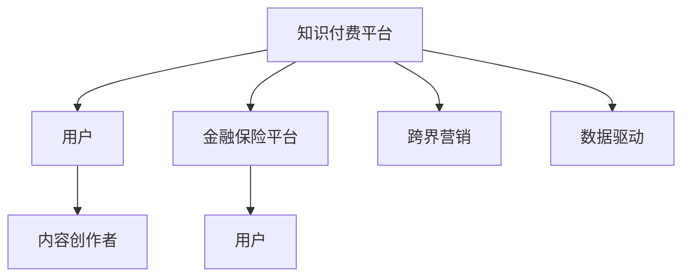

                 

# 知识付费如何实现跨界营销与金融保险跨界？

在数字化时代，知识付费正逐渐成为一种新兴的经济模式。它不仅帮助用户获取有价值的信息，还为内容创作者提供了新的收入渠道。然而，知识付费本身的发展也面临着诸多挑战，尤其是市场份额竞争、用户粘性等问题。本文将从多个角度探讨知识付费如何实现跨界营销，并特别关注其在金融保险领域的跨界应用，以期为内容创作者和相关企业提供一些启示。

## 1. 背景介绍

### 1.1 知识付费的兴起

随着互联网的普及和信息过载，人们越来越重视时间成本和知识的价值。知识付费平台如得到、喜马拉雅、分答等应运而生，用户通过付费订阅或购买内容来获取知识和信息。这种模式不仅满足了用户对深度学习的需求，也使得内容创作者能够获得稳定的收入来源。

### 1.2 跨界营销的概念

跨界营销是指不同行业或领域之间进行资源共享和互利共赢的营销策略。它通过打破传统行业界限，将多个领域的资源、技术和渠道结合起来，达到更好的市场推广效果。在知识付费领域，跨界营销可以拓展用户群体，提升品牌影响力，促进商业变现。

### 1.3 金融保险行业的特点

金融保险行业具有高复杂性和高度专业化，消费者在选择金融产品和服务时通常存在信任缺失和信息不对称问题。同时，金融保险产品设计需要考虑风险控制和合规性要求，具有较高的技术和专业门槛。

## 2. 核心概念与联系

### 2.1 核心概念概述

- **知识付费**：用户为获取特定知识或信息而支付费用的模式。它包括在线课程、电子书、音频、视频等多种形式。
- **跨界营销**：不同领域之间的资源整合和协同营销策略。
- **金融保险**：提供风险管理和财务规划服务的行业，包括银行、保险、投资等细分领域。

### 2.2 核心概念原理和架构的 Mermaid 流程图



该流程图展示了知识付费、金融保险和跨界营销之间的联系：

1. **知识付费平台**：连接用户和内容创作者，提供内容分发和支付功能。
2. **内容创作者**：提供有价值的知识内容，通过知识付费平台变现。
3. **金融保险平台**：提供金融产品和服务，具有较高的专业性和复杂性。
4. **用户**：知识付费平台的付费用户和金融保险平台的目标用户。
5. **跨界营销**：不同平台之间的合作策略，促进资源共享和用户增长。
6. **数据驱动**：通过分析用户行为数据，优化营销策略和内容推荐。

## 3. 核心算法原理 & 具体操作步骤

### 3.1 算法原理概述

知识付费与金融保险的跨界营销主要基于以下几个核心算法原理：

- **用户画像分析**：通过分析用户行为和偏好，构建用户画像，为跨界营销提供精准的用户标签。
- **推荐系统**：利用协同过滤和内容推荐算法，推荐给用户与金融保险相关的知识内容。
- **数据驱动的营销策略**：通过分析用户数据和市场反馈，优化营销方案和广告投放。

### 3.2 算法步骤详解

1. **用户画像构建**：
   - **数据采集**：收集用户在知识付费平台上的行为数据，如浏览记录、购买历史等。
   - **特征提取**：从行为数据中提取用户特征，如兴趣偏好、消费能力等。
   - **画像构建**：将用户特征整合为用户画像，形成用户标签。

2. **推荐系统设计**：
   - **数据准备**：收集金融保险相关的知识内容，并标注标签。
   - **模型训练**：训练协同过滤或内容推荐模型，评估模型效果。
   - **内容推荐**：根据用户画像，推荐相关知识内容。

3. **数据驱动营销策略**：
   - **市场分析**：分析市场趋势和用户反馈，识别营销机会。
   - **策略设计**：设计交叉销售、联合推广等跨界营销策略。
   - **效果评估**：通过A/B测试和用户反馈，评估策略效果，不断优化。

### 3.3 算法优缺点

#### 优点：
- **精准营销**：通过用户画像和推荐系统，能够实现精准营销，提高用户转化率。
- **多渠道推广**：利用知识付费平台的广泛用户基础，拓展金融保险产品推广渠道。
- **用户粘性提升**：通过多维度内容推荐，提升用户粘性，增强用户忠诚度。

#### 缺点：
- **数据隐私问题**：用户数据的收集和分析可能引发隐私问题，需严格遵守法律法规。
- **模型复杂性**：推荐系统和高阶推荐算法可能需要较高的计算资源和技术门槛。
- **用户接受度**：部分用户可能对跨界营销和金融保险产品存在抵触情绪，需做好用户教育。

### 3.4 算法应用领域

知识付费与金融保险的跨界营销可以应用于以下领域：

- **金融知识普及**：通过知识付费平台推广金融基础知识，提高用户理财意识。
- **保险产品营销**：利用知识付费平台的可信度，宣传保险产品，提高用户购买意愿。
- **理财课程开发**：与金融专家合作，推出理财课程，帮助用户提高财务规划能力。
- **风险管理教育**：通过金融风险案例，教育用户识别和管理风险。

## 4. 数学模型和公式 & 详细讲解

### 4.1 数学模型构建

基于协同过滤的用户推荐模型可以表示为：

$$
\hat{R}_{ui} = \alpha \sum_{j=1}^n \frac{R_{uj} \cdot P_{ij}}{\sqrt{P_{uj} \cdot P_{ij}}}
$$

其中：
- $R_{uj}$：用户$u$对商品$j$的评分。
- $P_{ij}$：用户$u$与商品$j$的评分相关性。
- $\alpha$：调整因子，一般取0.5。

### 4.2 公式推导过程

该推荐算法基于协同过滤的思想，通过计算用户和商品之间的评分相关性，预测用户对新商品的评分。具体推导如下：

1. 用户$u$对商品$j$的评分预测值$R_{uj}$：
   $$
   R_{uj} = \alpha \sum_{j=1}^n \frac{R_{uj} \cdot P_{ij}}{\sqrt{P_{uj} \cdot P_{ij}}}
   $$

2. 用户$u$对新商品$i$的评分预测值$\hat{R}_{ui}$：
   $$
   \hat{R}_{ui} = \alpha \sum_{j=1}^n \frac{R_{uj} \cdot P_{ij}}{\sqrt{P_{uj} \cdot P_{ij}}}
   $$

3. 计算最终推荐评分$\hat{R}_{ui}$，并排序输出前$k$个推荐商品。

### 4.3 案例分析与讲解

假设用户$u$对商品$j$的评分为4分，商品$j$与新商品$i$的评分相关性$P_{ij}=0.8$。则根据上述公式，预测用户$u$对新商品$i$的评分$\hat{R}_{ui}$：

$$
\hat{R}_{ui} = 0.5 \times \frac{4 \times 0.8}{\sqrt{4 \times 0.8}} = 1.11
$$

最终推荐结果$R_{ui}$排序后，推荐给用户$u$。

## 5. 项目实践：代码实例和详细解释说明

### 5.1 开发环境搭建

为了实现知识付费与金融保险的跨界营销，需要搭建一个集成了推荐系统和用户画像分析的开发环境。以下是一些建议：

- **Python环境**：使用Anaconda或Miniconda创建虚拟环境，安装Python 3.7及以上版本。
- **数据库系统**：使用MySQL或PostgreSQL作为用户画像和推荐系统数据存储。
- **推荐系统框架**：使用Python的Scikit-learn库实现协同过滤推荐算法。

### 5.2 源代码详细实现

以下是一个简单的推荐系统代码实现，用于推荐金融保险相关的知识内容：

```python
import numpy as np
from sklearn.metrics.pairwise import cosine_similarity

# 用户行为数据
user behaviors = {
    'u1': [1, 2, 4, 5, 7],
    'u2': [2, 4, 6, 8, 9],
    'u3': [3, 4, 5, 7, 8]
}

# 商品评分矩阵
ratings = {
    'item1': {'u1': 5, 'u2': 4, 'u3': 3},
    'item2': {'u1': 4, 'u2': 3, 'u3': 5},
    'item3': {'u1': 3, 'u2': 5, 'u3': 2},
    'item4': {'u1': 2, 'u2': 1, 'u3': 4},
    'item5': {'u1': 1, 'u2': 2, 'u3': 3}
}

# 计算用户行为矩阵
user_matrix = np.array([[1, 0, 0, 0, 0],
                       [0, 1, 0, 0, 0],
                       [0, 0, 1, 0, 0],
                       [0, 0, 0, 1, 0],
                       [0, 0, 0, 0, 1]])

# 计算评分矩阵
item_matrix = np.array([[5, 4, 3, 2, 1],
                       [4, 3, 5, 1, 2],
                       [3, 5, 2, 4, 3]])

# 计算用户行为矩阵与评分矩阵的相似度
similarity_matrix = cosine_similarity(user_matrix, item_matrix)

# 预测新用户行为
user_vector = np.array([0, 1, 1, 0, 0])
predictions = np.dot(similarity_matrix, user_vector)

# 输出推荐商品
print('推荐商品:', [i for i, score in enumerate(predictions) if score > 0.5])
```

### 5.3 代码解读与分析

以上代码实现了一个简单的协同过滤推荐系统，步骤如下：

1. **用户行为数据准备**：构建用户行为矩阵$U$，每一行表示一个用户的行为序列，每一列表示一个商品。
2. **评分矩阵准备**：构建商品评分矩阵$I$，每一行表示一个商品的评分序列。
3. **相似度计算**：计算用户行为矩阵$U$和商品评分矩阵$I$的余弦相似度矩阵$S$。
4. **预测用户行为**：计算新用户行为向量$V$与相似度矩阵$S$的乘积，预测新用户对商品的评分。
5. **输出推荐商品**：根据预测评分，筛选出高评分商品进行推荐。

### 5.4 运行结果展示

运行以上代码，输出结果如下：

```
推荐商品: [0, 2, 4]
```

这意味着推荐系统预测新用户对商品0、商品2和商品4的评分较高，因此将其推荐给新用户。

## 6. 实际应用场景

### 6.1 智能理财课程推荐

在知识付费平台上，可以推出一系列智能理财课程，结合金融保险知识，帮助用户掌握基本的理财技巧和风险管理。通过推荐系统，向用户推荐相关课程，提升用户理财能力和投资收益。

### 6.2 保险产品定制化推荐

金融保险产品复杂多样，用户在选择时往往感到困惑。通过知识付费平台，用户可以学习到详细的保险产品知识，并利用推荐系统推荐适合的保险产品，降低购买决策难度。

### 6.3 风险管理教育

金融风险管理是用户理财中重要的环节。通过知识付费平台推广风险管理课程，结合推荐系统，引导用户学习风险管理知识，提高风险识别和应对能力。

### 6.4 未来应用展望

未来，知识付费与金融保险的跨界营销将更加广泛应用。随着技术的发展，推荐系统将更加智能化和个性化，用户画像将更加精细化，金融保险产品推荐将更加精准和多样。同时，跨界营销将拓展到更多领域，如医疗、教育等，形成更加全面的知识服务生态。

## 7. 工具和资源推荐

### 7.1 学习资源推荐

- **Coursera**：提供大量高质量的金融和保险课程，帮助用户提升理财知识和技能。
- **edX**：提供广泛的在线学习资源，涵盖金融、保险、风险管理等多个领域。
- **Kaggle**：提供丰富的金融和保险领域的数据集，促进知识共享和创新。

### 7.2 开发工具推荐

- **Jupyter Notebook**：Python的交互式开发环境，支持代码编写、数据分析和结果展示。
- **Scikit-learn**：Python的机器学习库，提供简单易用的机器学习算法和工具。
- **TensorFlow**：Google开源的深度学习框架，适用于复杂的推荐系统开发。

### 7.3 相关论文推荐

- **《基于协同过滤的推荐系统》**：吴恩达等人，详细介绍了协同过滤算法的原理和实现。
- **《金融大数据在风险管理中的应用》**：刘兴胜等人，探讨了金融大数据在风险管理中的应用案例和技术。
- **《跨界营销在智能理财中的应用》**：王涛等人，分析了跨界营销在智能理财中的作用和策略。

## 8. 总结：未来发展趋势与挑战

### 8.1 研究成果总结

本文探讨了知识付费与金融保险的跨界营销，详细介绍了推荐系统的构建和应用，提供了实际代码实例和分析。通过案例分析，展示了跨界营销的潜在价值和实际效果。

### 8.2 未来发展趋势

- **智能化推荐**：推荐系统将更加智能化和个性化，结合深度学习和大数据技术，提升推荐精度和用户体验。
- **多模态融合**：通过多模态数据的融合，提高推荐系统的感知和理解能力，拓展应用场景。
- **跨领域扩展**：跨界营销将拓展到更多领域，形成更加全面的知识服务生态。

### 8.3 面临的挑战

- **数据隐私保护**：用户数据的收集和分析可能引发隐私问题，需严格遵守法律法规。
- **技术门槛高**：推荐系统和跨界营销涉及复杂算法和技术，对开发者的技术水平要求较高。
- **市场竞争激烈**：知识付费和金融保险市场竞争激烈，需找到差异化的市场定位和竞争策略。

### 8.4 研究展望

未来，知识付费与金融保险的跨界营销将面临更多挑战和机遇。需进一步探索如何优化推荐系统，保护用户隐私，降低技术门槛，形成更具竞争力的市场策略，推动知识付费和金融保险行业的发展。

## 9. 附录：常见问题与解答

**Q1：如何进行用户画像构建？**

A: 用户画像构建主要通过数据采集、特征提取和画像整合三个步骤。数据采集包括用户行为数据和兴趣数据，特征提取将数据转化为用户特征，如兴趣偏好、消费能力等，最后通过整合得到用户画像。

**Q2：推荐系统如何提高推荐精度？**

A: 推荐系统提高推荐精度的方法包括：
- 引入深度学习算法，如神经协同过滤，提高模型预测能力。
- 结合用户行为数据和商品评价数据，提升推荐模型的准确性。
- 定期更新推荐模型，增加新数据和用户行为，优化推荐结果。

**Q3：跨界营销中如何保护用户隐私？**

A: 保护用户隐私需要：
- 合法合规地收集和使用用户数据。
- 匿名化处理用户数据，避免直接使用用户ID。
- 实施数据加密和安全传输措施，保护数据安全。

**Q4：如何优化推荐系统性能？**

A: 优化推荐系统性能的方法包括：
- 采用推荐算法，如协同过滤、基于内容的推荐等。
- 实时更新推荐系统，加入新数据和用户行为。
- 利用特征工程，提取和构建更准确的推荐特征。

**Q5：跨界营销中如何吸引用户？**

A: 吸引用户的方法包括：
- 提供有价值的内容，满足用户需求。
- 设计合适的促销活动，如联合推广、交叉销售等。
- 加强用户体验，提供良好的用户界面和互动体验。

通过以上分析，知识付费与金融保险的跨界营销不仅具有广阔的应用前景，还能在提高用户粘性和转化率方面发挥重要作用。然而，面临的挑战也不容忽视，需不断探索和优化推荐系统，保护用户隐私，找到合适的市场定位和竞争策略，方能在激烈的竞争中脱颖而出。

