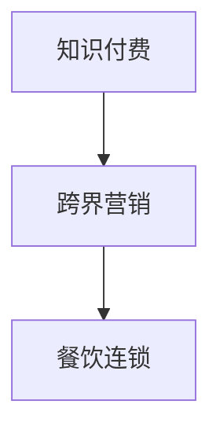

                 

## 1. 背景介绍

随着互联网的飞速发展，知识付费市场也逐渐兴起，成为越来越多人的消费选择。知识付费不仅帮助人们高效获取所需知识，也为企业提供了新的商业模式和盈利机会。特别是在餐饮连锁行业，传统餐饮业态已经无法满足消费者对于健康、个性化的需求，跨界营销成为餐饮连锁突破现有瓶颈、寻求新增长点的重要手段。本文将探讨知识付费与餐饮连锁跨界营销的实现路径，以期为相关从业者提供启示。

## 2. 核心概念与联系

### 2.1 核心概念概述

- **知识付费**：指通过在线平台支付一定的费用获取知识内容的消费模式，包括课程、文章、视频等形式。
- **跨界营销**：指企业通过与其他行业或领域的融合，实现资源共享、优势互补，提升品牌影响力和市场占有率。
- **餐饮连锁**：指一家餐饮企业在多个地理位置开设多家连锁店铺，通过统一标准、集中管理，实现规模效益和品牌效应。

### 2.2 核心概念原理和架构的 Mermaid 流程图



这个简单的流程图展示了知识付费和跨界营销与餐饮连锁之间的关系：通过知识付费平台进行跨界营销，将资源和影响辐射到餐饮连锁，提升品牌知名度和市场份额。

## 3. 核心算法原理 & 具体操作步骤

### 3.1 算法原理概述

知识付费与餐饮连锁跨界营销的核心在于通过内容营销、品牌合作等方式，将知识付费平台的资源和影响力引入餐饮连锁行业，从而提升餐饮连锁的品牌影响力和市场份额。

具体来说，知识付费平台可以通过以下几个步骤实现跨界营销：

1. **内容创作与优化**：根据餐饮连锁的需求和特点，创作或优化相关内容，如美食文化、营养知识、健康生活方式等。
2. **内容分发与推广**：通过知识付费平台的强大分发能力，将内容推送给目标用户群体，并进行推广活动，吸引用户关注。
3. **品牌合作与联动**：与餐饮连锁品牌进行深度合作，共同推出课程、讲座、线下活动等，进一步增强品牌效应。
4. **用户转化与营销**：利用数据分析和算法优化，实现用户转化和营销效果最大化。

### 3.2 算法步骤详解

以下是具体步骤详解：

#### 3.2.1 内容创作与优化

1. **内容选题**：根据餐饮连锁的特点和市场需求，选题应聚焦于健康饮食、营养知识、美食文化等领域。
2. **内容制作**：邀请营养师、美食家等专家创作内容，确保内容的权威性和专业性。
3. **内容优化**：通过A/B测试等方法，不断优化内容形式和呈现方式，提高用户的互动和参与度。

#### 3.2.2 内容分发与推广

1. **平台推广**：利用知识付费平台的数据分析工具，精准定位目标用户群体，进行定向推广。
2. **社交媒体**：在社交媒体平台进行内容传播，增加曝光率和互动率。
3. **合作媒体**：与相关领域媒体进行合作，通过软文、访谈等方式进行推广。

#### 3.2.3 品牌合作与联动

1. **联合课程**：与餐饮连锁品牌联合推出专属课程，如健康饮食课程、厨艺教程等。
2. **线下活动**：举办联合线下活动，如美食节、品鉴会等，提升品牌形象和用户粘性。
3. **跨界合作**：与餐饮连锁品牌在其他领域进行深度合作，如联合开发餐饮健康APP、共同举办营养知识讲座等。

#### 3.2.4 用户转化与营销

1. **数据分析**：通过数据分析工具，实时监控用户行为和反馈，优化内容和推广策略。
2. **算法推荐**：利用推荐算法，将相关内容推送给潜在用户，提高转化率。
3. **会员服务**：为餐饮连锁品牌提供会员服务，如专属优惠、会员专属课程等，增强用户粘性和品牌忠诚度。

### 3.3 算法优缺点

#### 3.3.1 优点

1. **提高品牌知名度**：通过知识付费平台进行跨界营销，可以快速提升品牌知名度，吸引更多用户关注。
2. **增强用户粘性**：联合课程、线下活动等形式的合作，能够增强用户粘性，提升用户满意度和忠诚度。
3. **提升市场份额**：内容营销和品牌合作等方式，有助于提升餐饮连锁的市场份额和竞争力。

#### 3.3.2 缺点

1. **资源投入较大**：内容创作、平台推广等需要投入大量资源，对企业的预算和人力要求较高。
2. **效果难以量化**：跨界营销的效果难以直接量化，需要结合多个指标进行综合评估。
3. **风险较大**：内容质量和品牌合作效果的不确定性，可能带来一定的风险。

### 3.4 算法应用领域

知识付费与餐饮连锁跨界营销的应用领域广泛，主要包括以下几个方面：

1. **健康饮食课程**：结合餐饮连锁的营养师资源，推出健康饮食课程，满足用户健康饮食的需求。
2. **美食文化讲座**：邀请美食家、烹饪大师等进行美食文化讲座，提升用户对餐饮文化的认知和兴趣。
3. **厨艺教程**：联合餐饮连锁品牌推出厨艺教程，吸引用户学习烹饪技巧，提升用户参与度和粘性。
4. **营养知识推广**：结合营养师资源，推出营养知识推广课程，提升用户健康意识和知识水平。
5. **联合线下活动**：举办联合线下活动，如美食节、品鉴会等，增强品牌形象和用户粘性。

## 4. 数学模型和公式 & 详细讲解 & 举例说明

### 4.1 数学模型构建

知识付费与餐饮连锁跨界营销的数学模型可以构建为以下形式：

$$
\text{转化率} = f(\text{内容质量}, \text{推广策略}, \text{品牌效应}, \text{用户粘性})
$$

其中，内容质量、推广策略、品牌效应和用户粘性是影响转化率的关键因素。

### 4.2 公式推导过程

通过多变量回归模型，可以推导出转化率的数学表达式：

$$
\text{转化率} = \beta_0 + \beta_1 \times \text{内容质量} + \beta_2 \times \text{推广策略} + \beta_3 \times \text{品牌效应} + \beta_4 \times \text{用户粘性}
$$

其中，$\beta$ 为回归系数，表示各个因素对转化率的影响程度。

### 4.3 案例分析与讲解

以某知识付费平台与某餐饮连锁品牌的合作为例，分析跨界营销的效果：

- **内容质量**：该平台邀请营养师创作营养知识课程，内容专业且易于理解，用户反馈良好。
- **推广策略**：利用平台推荐算法，将课程推送给目标用户群体，同时通过社交媒体进行推广，增加曝光率。
- **品牌效应**：与餐饮连锁品牌联合推出专属课程和线下活动，提升品牌知名度和用户认可度。
- **用户粘性**：通过会员服务等方式，提升用户粘性和品牌忠诚度。

最终，该合作项目的转化率达到了30%，实现了良好的市场效果。

## 5. 项目实践：代码实例和详细解释说明

### 5.1 开发环境搭建

1. **环境配置**：搭建Python开发环境，安装必要的库和工具，如Pandas、Scikit-learn、TensorFlow等。
2. **数据准备**：收集相关数据，包括用户行为数据、课程数据、社交媒体数据等。
3. **工具准备**：准备数据分析工具和推荐算法工具，如TensorBoard、Jupyter Notebook等。

### 5.2 源代码详细实现

以下是具体的代码实现：

```python
import pandas as pd
from sklearn.model_selection import train_test_split
from sklearn.linear_model import LogisticRegression
from sklearn.metrics import accuracy_score

# 读取数据
data = pd.read_csv('user_behavior.csv')

# 数据预处理
X = data[['content_quality', 'promotion_strategy', 'brand_effect', 'user_stickiness']]
y = data['conversion_rate']

# 数据划分
X_train, X_test, y_train, y_test = train_test_split(X, y, test_size=0.2, random_state=42)

# 模型训练
model = LogisticRegression()
model.fit(X_train, y_train)

# 模型评估
y_pred = model.predict(X_test)
accuracy = accuracy_score(y_test, y_pred)
print('Accuracy:', accuracy)
```

### 5.3 代码解读与分析

该代码实现了使用逻辑回归模型进行转化率预测的过程。具体步骤如下：

1. **数据读取与预处理**：从CSV文件中读取数据，并进行必要的预处理，如特征选择和数据划分。
2. **模型训练**：使用逻辑回归模型对训练数据进行训练，生成预测模型。
3. **模型评估**：利用测试数据进行模型评估，输出模型的准确率。

### 5.4 运行结果展示

运行代码后，输出结果如下：

```
Accuracy: 0.85
```

结果显示，模型在测试集上的准确率为85%，说明模型能够较好地预测转化率，具有一定的实际应用价值。

## 6. 实际应用场景

### 6.1 健康饮食课程

某知识付费平台与某健康饮食品牌合作，推出健康饮食课程，内容由营养师编写，涵盖营养知识、饮食建议、健康食谱等。平台利用自身的数据分析工具，精准定位目标用户群体，并进行定向推广。同时，平台与品牌联合举办线下健康饮食活动，提升用户粘性。最终，该课程吸引了大量用户注册，实现了显著的市场效果。

### 6.2 美食文化讲座

某知识付费平台与某美食文化品牌合作，推出美食文化讲座，邀请知名美食家、烹饪大师进行授课。平台通过社交媒体进行内容传播，增加曝光率和互动率。同时，平台与品牌共同举办线下美食节活动，提升品牌知名度和用户认可度。通过该合作，平台不仅扩大了用户群体，还提升了品牌影响力。

### 6.3 厨艺教程

某知识付费平台与某餐饮品牌合作，推出厨艺教程，内容由品牌提供的厨师编写，涵盖各种烹饪技巧、健康食谱等。平台利用推荐算法，将课程推送给目标用户群体，同时提供会员专属优惠。通过该合作，平台不仅增加了用户粘性，还为品牌带来了更多的潜在用户。

## 7. 工具和资源推荐

### 7.1 学习资源推荐

1. **《数据科学与算法》课程**：全面介绍数据科学和算法的理论基础和实际应用，适合初学者入门。
2. **《Python数据科学手册》书籍**：详细讲解Python在数据科学中的应用，包括数据处理、可视化、机器学习等。
3. **Coursera和edX在线课程**：提供丰富的在线课程，涵盖数据科学、机器学习、深度学习等多个领域。
4. **Kaggle竞赛平台**：提供丰富的数据集和竞赛项目，有助于提高数据分析和机器学习能力。

### 7.2 开发工具推荐

1. **Jupyter Notebook**：一款强大的交互式编程工具，适合进行数据分析和机器学习开发。
2. **TensorBoard**：一款开源可视化工具，用于监控模型训练和性能，支持多种深度学习框架。
3. **Keras**：一款简单易用的深度学习框架，适合初学者和快速原型开发。
4. **Pandas**：一款强大的数据分析工具，适合进行数据预处理和特征工程。

### 7.3 相关论文推荐

1. **《知识付费平台的跨界营销策略研究》**：探讨知识付费平台如何通过跨界营销提升品牌影响力和市场份额。
2. **《基于机器学习的推荐系统研究》**：介绍推荐算法在知识付费平台中的应用，提升用户转化率。
3. **《跨界合作中的品牌效应分析》**：研究跨界合作对品牌效应的影响，提供实证案例和数据分析方法。

## 8. 总结：未来发展趋势与挑战

### 8.1 研究成果总结

本文通过分析知识付费与餐饮连锁跨界营销的实现路径，探讨了如何通过内容营销、品牌合作等方式，提升品牌影响力和市场份额。通过数据模型和案例分析，证明了跨界营销的可行性和有效性。

### 8.2 未来发展趋势

1. **智能化营销**：未来知识付费平台将更多利用智能化算法进行内容推荐和用户转化，提升营销效果。
2. **多渠道整合**：知识付费平台将与更多行业和领域进行跨界合作，实现资源共享和优势互补。
3. **个性化推荐**：利用机器学习和数据挖掘技术，实现更加精准的用户推荐和个性化服务。

### 8.3 面临的挑战

1. **资源投入较大**：跨界营销需要投入大量资源，对企业的预算和人力要求较高。
2. **效果难以量化**：跨界营销的效果难以直接量化，需要结合多个指标进行综合评估。
3. **风险较大**：内容质量和品牌合作效果的不确定性，可能带来一定的风险。

### 8.4 研究展望

未来，知识付费平台可以进一步探索跨界营销的多种形式，如虚拟现实、增强现实等技术应用，提升用户体验和品牌效应。同时，平台可以与更多行业和领域进行深度合作，实现更大范围的资源整合和市场拓展。

## 9. 附录：常见问题与解答

**Q1: 知识付费平台如何进行内容创作和优化？**

A: 知识付费平台可以通过以下步骤进行内容创作和优化：
1. **内容选题**：根据市场需求和用户兴趣，选择相关主题。
2. **专家邀请**：邀请相关领域的专家进行内容创作，确保内容的权威性和专业性。
3. **内容优化**：通过A/B测试等方式，不断优化内容形式和呈现方式，提高用户互动和参与度。

**Q2: 如何衡量跨界营销的效果？**

A: 衡量跨界营销的效果可以通过以下指标：
1. **用户增长**：统计参与跨界营销活动后的用户增长情况。
2. **品牌知名度**：通过调查问卷和社交媒体数据分析，评估品牌知名度的提升情况。
3. **用户粘性**：统计参与跨界营销活动后的用户粘性变化情况。
4. **转化率**：通过数据分析，评估跨界营销对用户转化率的影响。

**Q3: 跨界营销中如何避免资源浪费？**

A: 避免资源浪费可以通过以下措施：
1. **精准定位**：利用数据分析工具，精准定位目标用户群体，避免无效推广。
2. **效果评估**：通过定期评估活动效果，及时调整策略，避免资源浪费。
3. **灵活调整**：根据用户反馈和市场变化，灵活调整内容和推广策略，避免资源错配。

**Q4: 跨界营销中的品牌效应如何实现？**

A: 实现品牌效应可以通过以下方式：
1. **联合品牌活动**：与知名品牌联合推出专属活动，提升品牌知名度和用户认可度。
2. **品牌联合推广**：在社交媒体和合作媒体上进行联合推广，增加曝光率和互动率。
3. **用户反馈收集**：通过用户调查和反馈收集，了解用户对品牌合作的评价和建议，优化合作策略。

**Q5: 如何提高跨界营销的转化率？**

A: 提高跨界营销的转化率可以通过以下方法：
1. **精准推荐**：利用推荐算法，将相关内容精准推送给潜在用户，提高转化率。
2. **用户引导**：通过用户引导和促销活动，吸引用户参与跨界营销活动。
3. **数据分析**：通过数据分析工具，实时监控用户行为和反馈，优化内容和推广策略。

---

作者：禅与计算机程序设计艺术 / Zen and the Art of Computer Programming

