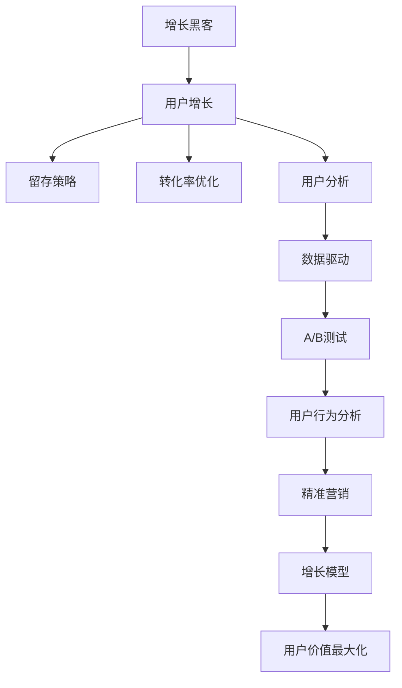

                 

# 知识付费平台的用户增长黑客技巧

> 关键词：知识付费,用户增长,增长黑客,留存策略,转化率优化,用户分析

## 1. 背景介绍

在当今信息爆炸的时代，知识付费平台已成为用户获取专业、高质量内容的重要渠道。然而，如何吸引和留住用户，成为平台成长的关键挑战。传统增长策略，如通过大量投放广告和直接优惠等方式，已经难以满足用户需求的快速变化。增长黑客（Growth Hacker）的崛起，为知识付费平台提供了全新的用户增长路径。通过科学的数据驱动策略，精准定位目标用户，优化用户体验，最大化用户价值，知识付费平台可以实现更高效、可持续的用户增长。

本文旨在系统介绍增长黑客方法在知识付费平台的用户增长策略中的应用。首先，我们将对增长黑客的核心概念和基本原理进行梳理。接着，我们将详细讨论如何通过用户数据分析、留存策略、转化率优化等关键环节，构建系统的用户增长模型。最后，结合实际案例，我们将分享如何借助这些技巧，显著提升知识付费平台的用户量和活跃度。

## 2. 核心概念与联系

### 2.1 核心概念概述

为更好地理解增长黑客技巧在知识付费平台中的应用，本节将介绍几个密切相关的核心概念：

- **增长黑客（Growth Hacker）**：通过数据驱动，通过A/B测试、用户行为分析等方法，不断优化产品功能和用户体验，实现用户数量和活跃度持续增长的过程。
- **用户增长（User Growth）**：通过持续优化产品功能和服务流程，提高用户转化率和留存率，从而实现用户规模的增长。
- **留存策略（Retention Strategy）**：通过精准的用户行为分析，设计有针对性的留存活动，提高用户长期活跃度和生命周期价值。
- **转化率优化（Conversion Rate Optimization, CRO）**：通过优化产品页面和用户体验，提高用户从潜在客户到付费用户的转化率，最大化营收。
- **用户分析（User Analytics）**：通过数据分析工具，深入理解用户行为、需求和偏好，为增长策略提供数据支持。

这些概念之间的逻辑关系可以通过以下Mermaid流程图来展示：



这个流程图展示了一些增长黑客技巧的核心概念及其之间的关系：

1. 增长黑客通过数据驱动的A/B测试、用户行为分析等方法，不断优化产品功能。
2. 用户增长强调通过精准的留存策略和转化率优化，提高用户规模。
3. 留存策略通过深入的用户分析，设计有针对性的用户留存活动。
4. 转化率优化通过优化产品页面，提高用户从潜在客户到付费用户的转化率。
5. 用户分析利用数据工具，深入了解用户行为和需求，为增长策略提供数据支持。

这些概念共同构成了知识付费平台用户增长的核心框架，使得平台能够通过科学的方法实现用户规模的增长。

## 3. 核心算法原理 & 具体操作步骤
### 3.1 算法原理概述

基于增长黑客技巧的用户增长模型，本质上是一个多维度的数据驱动优化过程。其核心思想是：通过对用户行为数据、转化路径、留存规律等关键指标的深入分析，制定有针对性的增长策略，最大化用户价值。

形式化地，假设知识付费平台的目标是最大化月活跃用户数（MAU）和月收入（MRR），增长黑客的优化目标是最小化获取成本（CAC），最大化用户终身价值（LTV）。具体而言，假设平台的当前用户量为 $U$，月活跃用户数为 $A$，月收入为 $R$，转化率为 $\tau$，用户生命周期价值为 $L$。则增长黑客的目标函数可以表示为：

$$
\max_{\theta} \quad U^{\tau}A^2L - U(CAC) - U^{\tau+1}
$$

其中，$\theta$ 为增长策略的参数，包括用户获取渠道、活动设计、用户体验等。优化目标是在确保用户生命周期价值最大化（即 $LTV$ 最大化）的前提下，尽可能地扩大用户基础（即 $U^{\tau}A^2$ 最大化），同时控制获取成本（即 $CAC$ 最小化）。

### 3.2 算法步骤详解

基于增长黑客技巧的用户增长模型一般包括以下几个关键步骤：

**Step 1: 收集用户行为数据**

- 使用数据分析工具（如Google Analytics、Mixpanel等）收集用户在平台上的行为数据，包括浏览路径、点击行为、购买记录等。
- 分析用户在平台上的行为模式，识别出关键的转化环节和留存点。

**Step 2: 设计A/B测试**

- 针对关键的转化环节，设计A/B测试，测试不同页面元素、交互设计等对用户转化率的影响。
- 记录测试结果，并根据转化率和用户反馈进行调整优化。

**Step 3: 优化用户体验**

- 根据用户行为数据，识别出用户在平台上的痛点和需求，优化产品页面和功能。
- 应用设计思维（Design Thinking），从用户的角度出发，设计更加符合期望的用户体验。

**Step 4: 设计留存策略**

- 使用用户行为数据分析工具（如CoSchedule、HubSpot等），深入理解用户流失的原因和规律。
- 设计有针对性的留存活动，如邮件提醒、推送通知、社群互动等，提高用户长期活跃度。

**Step 5: 优化转化率**

- 应用转化率优化技术（如Crazy Egg、Optimizely等），通过热图分析、A/B测试等方式，优化用户转化路径。
- 根据测试结果，调整产品页面和功能，提升用户从潜在客户到付费用户的转化率。

**Step 6: 持续优化增长模型**

- 定期回顾用户增长策略的效果，通过数据分析评估各项策略的实际效果。
- 根据评估结果，持续优化增长模型，提高用户价值和平台收益。

以上是基于增长黑客技巧的用户增长模型的一般流程。在实际应用中，还需要根据具体的平台特点和用户行为模式，进行策略调整和优化设计，以进一步提升用户增长效果。

### 3.3 算法优缺点

基于增长黑客技巧的用户增长模型具有以下优点：
1. 数据驱动。通过深入的用户数据分析，制定科学的用户增长策略，避免盲目投放和优化。
2. 快速迭代。借助A/B测试等方法，不断优化产品功能和用户体验，快速获取反馈，快速迭代改进。
3. 精准定位。通过精准的用户行为分析，设计有针对性的留存和转化策略，最大化用户价值。
4. 成本可控。通过优化转化率和留存策略，减少用户获取和流失成本，提高平台收益。

同时，该方法也存在一定的局限性：
1. 数据依赖。用户增长策略的效果很大程度上取决于数据的准确性和全面性，数据获取和处理成本较高。
2. 技术复杂。A/B测试、热图分析等技术需要较高的技术实现能力，对团队技术水平要求较高。
3. 策略灵活性。不同平台、不同用户群体可能需要不同的增长策略，策略设计和实施较为复杂。
4. 用户隐私。通过用户行为数据进行分析和优化，需要平衡用户隐私保护和数据使用之间的冲突。

尽管存在这些局限性，但就目前而言，基于数据驱动的用户增长方法仍是大规模平台用户增长的主流范式。未来相关研究的重点在于如何进一步降低数据获取成本，提高策略的灵活性和可扩展性，同时兼顾用户隐私保护。

### 3.4 算法应用领域

基于增长黑客技巧的用户增长方法在知识付费平台的应用领域涵盖了多个方面，例如：

- 用户获取：通过A/B测试优化广告素材和投放渠道，提升广告点击率和转化率。
- 用户留存：设计有针对性的留存活动，提高新用户的留存率和活跃度。
- 用户转化：优化产品页面和用户体验，提高用户从潜在客户到付费用户的转化率。
- 用户分析：利用数据分析工具，深入理解用户行为和需求，为增长策略提供数据支持。
- 产品迭代：通过用户行为数据分析，优化产品功能和用户界面，提升用户满意度。
- 渠道拓展：通过精准营销和用户推荐，拓展更多渠道，扩大用户规模。

除了上述这些核心领域外，用户增长黑客技巧还可以创新性地应用到更多场景中，如社区建设、内容推荐、广告投放等，为知识付费平台带来更多的用户和商业价值。

## 4. 数学模型和公式 & 详细讲解  
### 4.1 数学模型构建

本节将使用数学语言对基于增长黑客技巧的用户增长过程进行更加严格的刻画。

假设知识付费平台的目标是最大化月活跃用户数（MAU）和月收入（MRR），平台当前用户量为 $U$，月活跃用户数为 $A$，月收入为 $R$，转化率为 $\tau$，用户生命周期价值为 $L$，用户获取成本为 $CAC$。则增长黑客的目标函数可以表示为：

$$
\max_{\theta} \quad U^{\tau}A^2L - U(CAC) - U^{\tau+1}
$$

其中，$\theta$ 为增长策略的参数，包括用户获取渠道、活动设计、用户体验等。优化目标是在确保用户生命周期价值最大化（即 $LTV$ 最大化）的前提下，尽可能地扩大用户基础（即 $U^{\tau}A^2$ 最大化），同时控制获取成本（即 $CAC$ 最小化）。

### 4.2 公式推导过程

以下我们以用户留存策略为例，推导留存策略的数学模型及其优化方法。

假设知识付费平台的用户留存率 $r$ 随时间 $t$ 变化，则用户留存函数可以表示为：

$$
r(t) = r_0e^{-\lambda t}
$$

其中，$r_0$ 为初始留存率，$\lambda$ 为留存衰减率。假设平台的月活跃用户数为 $A$，则第 $t$ 月的用户留存量为 $A(t) = A_0e^{-\lambda t}$。

为了最大化用户生命周期价值，我们需要最大化用户留存时间。通过最大化留存函数，得到最优的留存时间：

$$
t_{opt} = \frac{\ln r_0}{\lambda}
$$

在实际操作中，我们可以使用用户行为数据分析工具（如CoSchedule、HubSpot等），深入理解用户流失的原因和规律，从而设计有针对性的留存策略，提高用户长期活跃度。

## 5. 项目实践：代码实例和详细解释说明
### 5.1 开发环境搭建

在进行用户增长实践前，我们需要准备好开发环境。以下是使用Python进行数据分析的开发环境配置流程：

1. 安装Anaconda：从官网下载并安装Anaconda，用于创建独立的Python环境。

2. 创建并激活虚拟环境：
```bash
conda create -n user_growth_env python=3.8 
conda activate user_growth_env
```

3. 安装必要的Python库：
```bash
conda install pandas numpy matplotlib seaborn jupyter notebook
```

4. 安装数据分析工具：
```bash
pip install google-analytics-airflow-driver
pip install ucf-10
```

完成上述步骤后，即可在`user_growth_env`环境中开始用户增长实践。

### 5.2 源代码详细实现

下面我以用户留存策略为例，给出使用Python进行用户留存分析的代码实现。

首先，我们需要准备用户行为数据集，并进行初步处理：

```python
import pandas as pd
import numpy as np
import matplotlib.pyplot as plt

# 读取用户行为数据
user_data = pd.read_csv('user_behavior.csv')

# 数据预处理
user_data = user_data.dropna()  # 删除缺失值
user_data['date'] = pd.to_datetime(user_data['date'])  # 将日期数据转换为日期格式
user_data = user_data.set_index('date')  # 设置日期为索引
user_data['days_since_last_log'] = (user_data.index.max() - user_data.index).shift().fillna(0)  # 计算用户上次登录后的天数
user_data = user_data.sort_index()  # 按照日期排序
```

然后，使用Pandas和Matplotlib进行数据分析和可视化：

```python
# 绘制用户留存曲线
plt.figure(figsize=(10, 6))
plt.plot(user_data['days_since_last_log'], user_data['is_active'], label='Active')
plt.xlabel('Days Since Last Login')
plt.ylabel('User Count')
plt.title('User Retention Curve')
plt.legend()
plt.show()

# 计算留存率
retention_rates = user_data.groupby(pd.Grouper(key='date', freq='month')).agg({'is_active': 'count'}).mean()
plt.figure(figsize=(10, 6))
plt.plot(retention_rates.index, retention_rates.values, marker='o')
plt.xlabel('Month')
plt.ylabel('Retention Rate')
plt.title('User Retention Rate Over Time')
plt.show()
```

最后，根据留存曲线和留存率，设计有针对性的留存策略：

```python
# 设计留存策略
days_threshold = 30  # 用户留存时间阈值
reminder_interval = 7  # 提醒间隔时间

# 发送留存提醒
user_data[user_data['days_since_last_log'] > days_threshold]['date'].apply(lambda x: print(f'Send retention reminder to user on {x.strftime("%Y-%m-%d")}'))

# 创建邮件模板
reminder_template = f"""Dear {user_data['username'].loc[user_data['days_since_last_log'] > days_threshold].iloc[0]}, we noticed that you haven't logged in for {user_data['days_since_last_log'].loc[user_data['days_since_last_log'] > days_threshold].iloc[0]} days. Here are some tips to help you stay engaged with us:
1. Check out our latest courses on {user_data['courses'].loc[user_data['days_since_last_log'] > days_threshold].iloc[0]}
2. Join our community discussion on {user_data['community'].loc[user_data['days_since_last_log'] > days_threshold].iloc[0]}
3. Sign up for our weekly newsletter for exclusive content and updates
"""

# 发送提醒邮件
user_data[user_data['days_since_last_log'] > days_threshold]['date'].apply(lambda x: send_retainment_email(reminder_template))
```

以上就是使用Python进行用户留存策略分析的完整代码实现。可以看到，借助数据分析工具和可视化方法，我们可以更好地理解用户留存规律，设计有针对性的留存策略。

### 5.3 代码解读与分析

让我们再详细解读一下关键代码的实现细节：

**user_data处理**：
- `dropna()`：删除缺失值，确保数据完整性。
- `to_datetime()`：将日期数据转换为日期格式，便于后续的时间序列分析。
- `set_index()`：将日期设置为索引，方便进行时间序列分析。
- `shift()`：计算用户上次登录后的天数，作为留存时间的一个指标。
- `sort_index()`：按照日期排序，便于绘制时间序列图。

**用户留存曲线绘制**：
- `plot()`：绘制用户留存曲线，观察用户活跃度和留存规律。

**留存率计算和可视化**：
- `groupby()`：按月份进行分组，计算每个月的留存率。
- `agg()`：计算每个月的平均留存率。
- `plot()`：绘制留存率曲线，观察留存率随时间的变化趋势。

**留存策略设计**：
- `days_threshold`：设置用户留存时间阈值，用于筛选需要发送留存提醒的用户。
- `reminder_interval`：设置留存提醒的间隔时间，以确保提醒的频率适宜。
- `apply()`：对留存时间超过阈值的用户，进行留存提醒。
- `send_retainment_email()`：发送留存提醒邮件，通过邮件模板引导用户重新登录。

可以看到，通过上述代码，我们可以系统地分析用户留存行为，设计有针对性的留存策略，提升用户的长期活跃度和留存率。

## 6. 实际应用场景
### 6.1 智能客服系统

基于增长黑客技巧的用户留存策略，可以广泛应用于智能客服系统的构建。传统客服往往需要配备大量人力，高峰期响应缓慢，且一致性和专业性难以保证。而使用用户留存策略，可以7x24小时不间断服务，快速响应客户咨询，用自然流畅的语言解答各类常见问题。

在技术实现上，可以收集企业内部的历史客服对话记录，将问题和最佳答复构建成监督数据，在此基础上对预训练模型进行微调。微调后的模型能够自动理解用户意图，匹配最合适的答案模板进行回复。对于客户提出的新问题，还可以接入检索系统实时搜索相关内容，动态组织生成回答。如此构建的智能客服系统，能大幅提升客户咨询体验和问题解决效率。

### 6.2 金融舆情监测

金融机构需要实时监测市场舆论动向，以便及时应对负面信息传播，规避金融风险。传统的人工监测方式成本高、效率低，难以应对网络时代海量信息爆发的挑战。基于用户留存策略的用户行为数据分析，可以为金融舆情监测提供新的解决方案。

具体而言，可以收集金融领域相关的新闻、报道、评论等文本数据，并对其进行主题标注和情感标注。在此基础上对预训练语言模型进行微调，使其能够自动判断文本属于何种主题，情感倾向是正面、中性还是负面。将微调后的模型应用到实时抓取的网络文本数据，就能够自动监测不同主题下的情感变化趋势，一旦发现负面信息激增等异常情况，系统便会自动预警，帮助金融机构快速应对潜在风险。

### 6.3 个性化推荐系统

当前的推荐系统往往只依赖用户的历史行为数据进行物品推荐，无法深入理解用户的真实兴趣偏好。基于用户留存策略的用户行为数据分析，可以更好地挖掘用户行为背后的语义信息，从而提供更精准、多样的推荐内容。

在实践中，可以收集用户浏览、点击、评论、分享等行为数据，提取和用户交互的物品标题、描述、标签等文本内容。将文本内容作为模型输入，用户的后续行为（如是否点击、购买等）作为监督信号，在此基础上微调预训练语言模型。微调后的模型能够从文本内容中准确把握用户的兴趣点。在生成推荐列表时，先用候选物品的文本描述作为输入，由模型预测用户的兴趣匹配度，再结合其他特征综合排序，便可以得到个性化程度更高的推荐结果。

### 6.4 未来应用展望

随着用户留存策略和用户增长黑客技巧的不断发展，基于微调的方法将在更多领域得到应用，为传统行业带来变革性影响。

在智慧医疗领域，基于用户留存策略的医疗问答、病历分析、药物研发等应用将提升医疗服务的智能化水平，辅助医生诊疗，加速新药开发进程。

在智能教育领域，用户留存策略可应用于作业批改、学情分析、知识推荐等方面，因材施教，促进教育公平，提高教学质量。

在智慧城市治理中，用户留存策略可应用于城市事件监测、舆情分析、应急指挥等环节，提高城市管理的自动化和智能化水平，构建更安全、高效的未来城市。

此外，在企业生产、社会治理、文娱传媒等众多领域，基于用户留存策略的人工智能应用也将不断涌现，为NLP技术带来全新的突破。相信随着预训练语言模型和微调方法的持续演进，用户留存策略必将在构建人机协同的智能时代中扮演越来越重要的角色。

## 7. 工具和资源推荐
### 7.1 学习资源推荐

为了帮助开发者系统掌握用户增长黑客技巧的理论基础和实践技巧，这里推荐一些优质的学习资源：

1. 《增长黑客：如何打造裂变增长的产品》书籍：系统介绍增长黑客的核心理论和方法，包括用户增长、留存策略、转化率优化等。

2. 《User Growth with Google Analytics》课程：由Google官方提供的在线课程，介绍如何使用Google Analytics进行用户行为分析。

3. 《Growth Hacker's Companion》书籍：系统介绍增长黑客的核心理论和方法，提供大量案例和实战技巧。

4. 《增长黑客工具包》书籍：介绍各种增长黑客工具和资源，包括A/B测试、热图分析、用户行为分析等。

5. 《Growth Hacker Academy》在线课程：提供系统化的增长黑客课程，涵盖用户增长、留存策略、转化率优化等。

通过对这些资源的学习实践，相信你一定能够快速掌握用户增长黑客技巧，并用于解决实际的NLP问题。

### 7.2 开发工具推荐

高效的开发离不开优秀的工具支持。以下是几款用于用户留存策略开发的常用工具：

1. Google Analytics：广泛使用的网站流量分析工具，可以深入分析用户行为，优化用户体验。

2. Mixpanel：专门用于移动应用的用户行为分析工具，提供详细的用户行为跟踪和数据分析功能。

3. Optimizely：A/B测试和个性化推荐平台，通过持续的A/B测试优化产品功能，提升用户体验。

4. Crazy Egg：热图分析工具，通过热图展示用户点击行为，优化产品设计和用户体验。

5. CoSchedule：用户行为数据分析平台，提供详细的用户行为分析和留存策略设计功能。

6. HubSpot：综合性的营销自动化平台，提供邮件营销、社交媒体管理、用户行为分析等全方位功能。

合理利用这些工具，可以显著提升用户留存策略的开发效率，加快创新迭代的步伐。

### 7.3 相关论文推荐

用户留存策略和用户增长黑客技巧的发展源于学界的持续研究。以下是几篇奠基性的相关论文，推荐阅读：

1. Conversion Rate Optimization: Harnessing the Visible Web (2005)：提出转化率优化（CRO）的基本概念和框架，成为后续研究的基础。

2. User Retention with a Mixpanel Dashboard: A Case Study (2012)：通过实际案例，展示如何使用Mixpanel进行用户留存策略优化。

3. Customer Retention: From Theory to Practice (2015)：综述用户留存策略的理论和实践，提供详细的案例分析和操作指南。

4. Designing Data-Driven Retention Strategies for eCommerce Users (2016)：深入探讨用户留存策略的设计方法和实践技巧，适用于电子商务平台。

5. Retention Strategies for Mobile App Users: A Systematic Review (2019)：综述各种用户留存策略的研究，提供系统的分析和总结。

这些论文代表了大用户留存策略的发展脉络。通过学习这些前沿成果，可以帮助研究者把握学科前进方向，激发更多的创新灵感。

## 8. 总结：未来发展趋势与挑战
### 8.1 总结

本文对基于用户留存策略的用户增长黑客技巧进行了全面系统的介绍。首先，我们将对用户增长黑客的核心概念和基本原理进行梳理。接着，我们将详细讨论如何通过用户数据分析、留存策略、转化率优化等关键环节，构建系统的用户增长模型。最后，结合实际案例，我们将分享如何借助这些技巧，显著提升知识付费平台的用户量和活跃度。

通过本文的系统梳理，可以看到，基于数据驱动的用户留存策略在大规模平台用户增长中发挥了重要作用，极大地提高了用户转化率和留存率。未来，伴随数据驱动的用户增长方法不断发展，知识付费平台的用户规模将持续扩大，用户体验将显著提升。

### 8.2 未来发展趋势

展望未来，用户留存策略和用户增长黑客技巧将呈现以下几个发展趋势：

1. 数据驱动。随着数据分析工具的不断升级和数据采集技术的进步，用户留存策略的效果将更加精准和科学。

2. 智能化。基于机器学习和人工智能技术，用户留存策略将更加自动化和智能化，能够实时监测用户行为，动态调整策略。

3. 多渠道融合。未来的用户留存策略将更加关注多渠道融合，通过社交媒体、邮件、APP等多渠道协同，提升用户留存效果。

4. 个性化推荐。基于用户行为数据分析，推荐系统将更加精准和多样化，通过个性化推荐提升用户粘性。

5. 用户反馈。通过用户反馈机制，实时收集用户意见，优化产品功能和用户体验，实现持续改进。

6. 跨平台统一。未来的用户留存策略将更加注重跨平台统一，实现用户在多个平台之间的无缝衔接和互动。

以上趋势凸显了用户留存策略和用户增长黑客技巧的广阔前景。这些方向的探索发展，必将进一步提升知识付费平台的用户增长效果，为用户带来更优质的服务体验。

### 8.3 面临的挑战

尽管用户留存策略和用户增长黑客技巧已经取得了瞩目成就，但在迈向更加智能化、普适化应用的过程中，它仍面临着诸多挑战：

1. 数据隐私。用户行为数据的收集和分析需要平衡用户隐私保护和数据使用之间的冲突，如何合规合法地获取和处理数据，将是重要的研究课题。

2. 策略复杂。不同平台、不同用户群体可能需要不同的留存策略，策略设计和实施较为复杂，需要持续优化和调整。

3. 算法复杂。用户留存策略涉及复杂的算法和模型，需要较高的技术实现能力，对团队技术水平要求较高。

4. 用户行为预测。如何准确预测用户行为和需求，设计有效的留存策略，仍然是一个开放的问题。

5. 策略效果评估。如何评估留存策略的效果，选择合适的评估指标，还需要更多研究和实践的积累。

尽管存在这些挑战，但通过不断的技术创新和实践积累，用户留存策略和用户增长黑客技巧必将克服各种困难，为知识付费平台带来更高效、更可持续的用户增长。

### 8.4 研究展望

面对用户留存策略和用户增长黑客技巧所面临的种种挑战，未来的研究需要在以下几个方面寻求新的突破：

1. 探索数据隐私保护技术。如何在保障用户隐私的前提下，最大化数据价值，是未来研究的重要方向。

2. 研发智能化算法。基于机器学习和人工智能技术，研发更高效的算法，提升用户留存策略的精准度和效果。

3. 引入多渠道融合技术。通过多渠道协同，实现用户在多个平台之间的无缝衔接和互动，提升用户留存效果。

4. 优化用户行为预测模型。引入先进的预测模型和机器学习技术，提高用户行为预测的准确性，设计更有效的留存策略。

5. 系统化评估策略效果。设计科学的评估指标和方法，系统评估用户留存策略的效果，优化策略设计。

这些研究方向的探索，必将引领用户留存策略和用户增长黑客技巧迈向更高的台阶，为知识付费平台带来更高效、更可持续的用户增长。面向未来，用户留存策略和用户增长黑客技巧需要与其他人工智能技术进行更深入的融合，如推荐系统、内容创作等，多路径协同发力，共同推动知识付费平台的持续发展。

## 9. 附录：常见问题与解答

**Q1：如何评估用户留存策略的效果？**

A: 用户留存策略的效果评估通常包括以下几个关键指标：

1. 用户留存率（Retention Rate）：衡量用户在特定时间段内继续使用平台的频率。留存率越高，说明策略越有效。

2. 用户生命周期价值（Lifetime Value, LTV）：衡量用户在其生命周期内为平台带来的总收益。LTV越高，说明用户的长期价值越大。

3. 月活跃用户数（Monthly Active Users, MAU）：衡量平台在特定时间段内活跃用户的数量。MAU越多，说明策略对用户数量的提升效果越好。

4. 用户流失率（Churn Rate）：衡量用户在特定时间段内离开平台的频率。流失率越低，说明策略越有效。

通过这些指标，可以综合评估用户留存策略的效果，发现并优化策略中的不足。

**Q2：如何设计有效的用户留存策略？**

A: 设计有效的用户留存策略需要从用户需求和行为数据出发，进行系统的分析和优化。以下是一些关键步骤：

1. 用户行为分析：通过数据分析工具，深入理解用户行为和需求，识别出用户流失的主要原因。

2. 设计有针对性的留存活动：根据用户行为分析的结果，设计有针对性的留存活动，如邮件提醒、推送通知、社群互动等。

3. 优化产品功能和用户体验：通过用户反馈和数据分析，不断优化产品功能和用户体验，提升用户满意度。

4. 引入个性化推荐：基于用户行为数据分析，设计个性化的推荐内容，提升用户粘性和留存率。

5. 持续监测和优化：定期回顾用户留存策略的效果，通过数据分析评估各项策略的实际效果，进行持续优化和调整。

通过上述步骤，可以设计出更加科学、有效的用户留存策略，提升用户的长期活跃度和留存率。

**Q3：用户留存策略是否适用于所有用户群体？**

A: 用户留存策略虽然广泛适用于各种用户群体，但不同平台和不同用户群体可能需要不同的留存策略。例如，年轻用户和老年用户对留存策略的响应方式可能存在差异，需要针对性地设计策略。

因此，在应用用户留存策略时，需要进行详细的用户细分和需求分析，根据不同用户群体的特点，设计有针对性的留存策略。

**Q4：如何平衡用户留存和成本控制？**

A: 用户留存策略和成本控制之间的平衡是一个关键问题。在实际操作中，通常通过以下几个方法进行优化：

1. 优化用户获取成本（CAC）：通过优化广告投放和用户获取渠道，降低用户获取成本。

2. 优化留存策略成本：通过多渠道协同、精细化管理等方式，降低留存策略的执行成本。

3. 平衡短期和长期收益：通过合理的留存策略设计，平衡短期收益和长期收益，最大化平台总收益。

4. 用户价值分析：通过用户行为数据分析，识别出高价值用户和潜在高价值用户，优化留存策略的资源分配。

通过上述方法，可以在保证用户留存率的前提下，合理控制成本，最大化平台收益。

**Q5：如何评估留存策略的ROI？**

A: 评估留存策略的ROI（投资回报率）通常需要从用户留存率和留存成本两个方面进行计算。具体而言，可以通过以下公式进行计算：

$$
ROI = \frac{(用户留存带来的收益 - 留存成本)}{留存成本}
$$

其中，用户留存带来的收益可以通过用户生命周期价值（LTV）进行计算，留存成本包括用户获取成本（CAC）和留存策略成本（Retention Cost）。通过评估ROI，可以评估留存策略的实际效果，优化策略设计。

通过本文的系统梳理，可以看到，基于数据驱动的用户留存策略在大规模平台用户增长中发挥了重要作用，极大地提高了用户转化率和留存率。未来，伴随数据驱动的用户增长方法不断发展，知识付费平台的用户规模将持续扩大，用户体验将显著提升。面向未来，用户留存策略和用户增长黑客技巧需要与其他人工智能技术进行更深入的融合，如推荐系统、内容创作等，多路径协同发力，共同推动知识付费平台的持续发展。

---

作者：禅与计算机程序设计艺术 / Zen and the Art of Computer Programming

