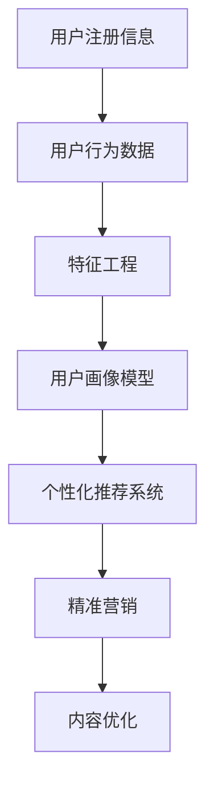

                 

## 1. 背景介绍

### 1.1 问题由来

随着知识付费市场的崛起，知识付费平台成为了互联网用户获取知识、技能和经验的重要渠道。然而，用户粘性不足、付费意愿低下、推荐系统效果欠佳等问题一直困扰着平台运营商。用户画像分析作为一种深度用户理解的手段，可以大幅提升平台的用户互动效果，优化推荐系统性能，推动知识付费平台的健康发展。

### 1.2 问题核心关键点

用户画像分析的核心在于通过数据挖掘和建模，提取并整合用户的各类属性和行为特征，构建一个全面的用户档案，进而指导个性化推荐、精准营销、内容优化等业务策略。

1. 数据来源：用户注册信息、登录行为、购买记录、浏览历史、评论反馈等。
2. 特征工程：数据清洗、特征提取、缺失值处理等。
3. 画像模型：基于机器学习、深度学习等模型的用户特征建模。
4. 应用场景：个性化推荐、精准营销、内容优化、用户行为预测等。

### 1.3 问题研究意义

用户画像分析在知识付费平台中的应用具有重要意义：

1. 提高用户粘性。通过个性化推荐，提升用户使用体验，满足其知识需求，增加用户粘性。
2. 提升付费转化率。基于用户画像进行精准营销，提高用户购买意愿，提升平台营收。
3. 优化推荐系统。更准确地理解用户偏好，提高推荐准确性，增强用户体验。
4. 辅助内容创作。通过分析用户行为，指导内容创作者优化内容创作，提升内容质量。
5. 预测用户行为。通过用户画像预测用户未来行为，辅助平台制定策略，进行用户细分。

## 2. 核心概念与联系

### 2.1 核心概念概述

为更好地理解用户画像分析的原理和应用，本节将介绍几个关键概念及其相互关系。

- **用户画像**：通过分析用户的各类数据，构建一个全面反映其属性、偏好、行为的虚拟用户模型。
- **特征工程**：将原始数据转换为模型所需特征的过程，包括数据清洗、特征提取、归一化、缺失值处理等步骤。
- **机器学习模型**：通过训练数据学习用户特征，生成用户画像的模型，如线性回归、决策树、随机森林、神经网络等。
- **深度学习模型**：用于复杂特征表示和关系建模的模型，如卷积神经网络(CNN)、循环神经网络(RNN)、变分自编码器(VAE)等。
- **个性化推荐系统**：基于用户画像进行推荐，提升用户互动和满意度。
- **精准营销**：通过用户画像进行针对性广告投放和活动策划，提升用户转化率。
- **内容优化**：基于用户画像指导内容创作者优化内容质量，提升平台吸引力。

这些概念之间具有紧密的联系：

- 用户画像由特征工程和机器学习模型生成，其质量取决于数据的完整性和特征的代表性。
- 个性化推荐系统基于用户画像进行推荐，其效果取决于用户画像的准确性。
- 精准营销和内容优化也是基于用户画像进行策略制定的，其效果同样取决于用户画像的准确性和完备性。

### 2.2 核心概念原理和架构的 Mermaid 流程图



该流程图展示了用户画像分析的核心流程：从用户数据入手，经过特征工程生成用户画像，再由用户画像指导个性化推荐、精准营销和内容优化。

## 3. 核心算法原理 & 具体操作步骤

### 3.1 算法原理概述

用户画像分析的本质是构建一个完整的用户模型，通过数据分析和建模，提炼用户的关键属性和行为特征，形成具有连贯性和预测性的用户画像。

其核心思想是：

1. **数据收集**：通过各种途径收集用户的各类数据，包括基本信息、行为数据、社交数据等。
2. **特征提取**：对收集到的数据进行特征提取，形成机器学习模型所需格式。
3. **画像建模**：通过训练数据，训练机器学习或深度学习模型，生成用户画像。
4. **画像应用**：将生成的用户画像应用于个性化推荐、精准营销、内容优化等场景，提升用户体验。

### 3.2 算法步骤详解

用户画像分析的算法步骤主要包括以下几个方面：

1. **数据收集与清洗**
   - 数据来源：用户注册信息、登录行为、购买记录、浏览历史、评论反馈等。
   - 数据清洗：处理缺失值、异常值、重复数据等，保证数据质量和一致性。

2. **特征提取与选择**
   - 特征提取：对原始数据进行特征工程，生成模型所需的特征。
   - 特征选择：选择对用户画像建模有重要影响的特征，去除冗余或噪声特征。

3. **用户画像建模**
   - 选择合适的机器学习或深度学习模型，如线性回归、决策树、随机森林、神经网络等。
   - 训练模型，生成用户画像。

4. **画像应用与评估**
   - 个性化推荐：根据用户画像进行推荐，提升用户互动。
   - 精准营销：基于用户画像进行广告投放和活动策划，提升用户转化率。
   - 内容优化：指导内容创作者优化内容质量，提升平台吸引力。
   - 画像评估：定期评估用户画像的准确性和效果，进行迭代优化。

### 3.3 算法优缺点

用户画像分析的主要优点包括：

1. **提升用户互动**：通过个性化推荐，提高用户使用体验，增强用户粘性。
2. **优化推荐系统**：提高推荐准确性，提升用户满意度。
3. **精准营销**：提升广告投放效果，提高用户转化率。
4. **辅助内容创作**：指导内容创作者优化内容质量，提升平台吸引力。

但同时也存在一些缺点：

1. **数据隐私问题**：用户数据的收集和使用可能涉及隐私问题，需要严格遵守法律法规。
2. **数据质量依赖**：用户画像的质量很大程度上取决于数据的质量和完整性。
3. **模型复杂性**：高级特征提取和模型训练过程较为复杂，对技术和资源要求较高。
4. **画像动态变化**：用户行为和偏好可能随时间变化，需要不断更新用户画像。

### 3.4 算法应用领域

用户画像分析在知识付费平台中的应用领域广泛，涵盖以下几个方面：

1. **个性化推荐**：根据用户画像进行推荐，提高用户使用体验。
2. **精准营销**：通过用户画像进行针对性广告投放，提高用户转化率。
3. **内容优化**：基于用户画像指导内容创作，提升平台吸引力。
4. **用户行为预测**：预测用户未来行为，辅助平台制定策略。

此外，用户画像分析在电商、社交媒体、金融等领域也具有重要应用价值。

## 4. 数学模型和公式 & 详细讲解 & 举例说明

### 4.1 数学模型构建

用户画像分析的核心模型主要包括用户特征模型和推荐模型。这里以协同过滤模型为例进行讲解。

协同过滤模型是一种基于用户和物品相似度的推荐模型，其核心思想是通过用户的历史行为数据和物品的特征，预测用户对新物品的兴趣。协同过滤模型的数学模型可以表示为：

$$
\hat{r}_{ui} = \epsilon + \sum_{j=1}^{N} \alpha_{uj} r_{uji} p_{ij} + \sum_{j=1}^{N} \beta_{vi} p_{ij}
$$

其中，$r_{uji}$ 表示用户 $u$ 对物品 $j$ 的评分，$\epsilon$ 为噪声项，$\alpha_{uj}$ 和 $\beta_{vi}$ 为用户和物品的权重系数，$p_{ij}$ 为物品 $j$ 的特征向量。

### 4.2 公式推导过程

协同过滤模型的推导过程主要包括以下几个步骤：

1. **用户-物品评分矩阵**：构建用户对物品的评分矩阵，形式化表示用户的兴趣偏好。
2. **用户和物品的权重向量**：通过对用户和物品的历史评分数据进行归一化，生成用户和物品的权重向量。
3. **物品特征向量**：通过物品特征提取技术，获取物品的特征向量。
4. **推荐评分预测**：基于协同过滤公式，预测用户对新物品的评分，生成推荐列表。

### 4.3 案例分析与讲解

以电商平台的个性化推荐为例，分析协同过滤模型的具体应用过程：

1. **用户行为数据**：收集用户对不同商品的评分数据。
2. **用户权重向量**：对用户的评分数据进行归一化，生成用户权重向量。
3. **物品特征向量**：提取商品的属性特征，生成物品特征向量。
4. **推荐评分预测**：基于协同过滤模型公式，预测用户对新商品的评分，生成推荐列表。

## 5. 项目实践：代码实例和详细解释说明

### 5.1 开发环境搭建

在进行用户画像分析项目实践前，我们需要准备好开发环境。以下是使用Python进行PyTorch开发的环境配置流程：

1. 安装Anaconda：从官网下载并安装Anaconda，用于创建独立的Python环境。
2. 创建并激活虚拟环境：
```bash
conda create -n userprofiling python=3.8 
conda activate userprofiling
```
3. 安装PyTorch：根据CUDA版本，从官网获取对应的安装命令。例如：
```bash
conda install pytorch torchvision torchaudio cudatoolkit=11.1 -c pytorch -c conda-forge
```
4. 安装Transformers库：
```bash
pip install transformers
```
5. 安装各类工具包：
```bash
pip install numpy pandas scikit-learn matplotlib tqdm jupyter notebook ipython
```

完成上述步骤后，即可在`userprofiling`环境中开始项目实践。

### 5.2 源代码详细实现

这里我们以电商平台的个性化推荐系统为例，给出使用Transformers库进行用户画像分析和协同过滤推荐模型开发的PyTorch代码实现。

首先，定义数据处理函数：

```python
from transformers import BertTokenizer
from torch.utils.data import Dataset
import torch

class MovieLensDataset(Dataset):
    def __init__(self, data, tokenizer):
        self.data = data
        self.tokenizer = tokenizer
        self.pad_token_id = tokenizer.pad_token_id
        self.max_seq_length = 256

    def __len__(self):
        return len(self.data)

    def __getitem__(self, item):
        item_data = self.data[item]
        title = item_data[0]
        genre = item_data[1]
        rating = item_data[2]
        comment = item_data[3]

        title_tokenized = self.tokenizer.tokenize(title)
        genre_tokenized = self.tokenizer.tokenize(genre)
        comment_tokenized = self.tokenizer.tokenize(comment)

        title_input_ids = self.tokenizer.encode_plus(title_tokenized, max_length=self.max_seq_length, 
                                                   padding='max_length', truncation=True, 
                                                   return_tensors='pt')['input_ids']
        genre_input_ids = self.tokenizer.encode_plus(genre_tokenized, max_length=self.max_seq_length, 
                                                   padding='max_length', truncation=True, 
                                                   return_tensors='pt')['input_ids']
        comment_input_ids = self.tokenizer.encode_plus(comment_tokenized, max_length=self.max_seq_length, 
                                                     padding='max_length', truncation=True, 
                                                     return_tensors='pt')['input_ids']

        title_input_ids = title_input_ids.flatten()
        genre_input_ids = genre_input_ids.flatten()
        comment_input_ids = comment_input_ids.flatten()

        return {'input_ids': title_input_ids, 'genre_ids': genre_input_ids, 'rating': rating, 'comment_ids': comment_input_ids}
```

然后，定义模型和优化器：

```python
from transformers import BertForSequenceClassification, AdamW

model = BertForSequenceClassification.from_pretrained('bert-base-uncased', num_labels=1)

optimizer = AdamW(model.parameters(), lr=2e-5)
```

接着，定义训练和评估函数：

```python
from torch.utils.data import DataLoader
from tqdm import tqdm
from sklearn.metrics import roc_auc_score

device = torch.device('cuda') if torch.cuda.is_available() else torch.device('cpu')
model.to(device)

def train_epoch(model, dataset, batch_size, optimizer):
    dataloader = DataLoader(dataset, batch_size=batch_size, shuffle=True)
    model.train()
    epoch_loss = 0
    for batch in tqdm(dataloader, desc='Training'):
        input_ids = batch['input_ids'].to(device)
        genre_ids = batch['genre_ids'].to(device)
        rating = batch['rating'].to(device)
        labels = torch.ones_like(rating)
        
        model.zero_grad()
        outputs = model(input_ids)
        loss = outputs.logits.squeeze().masked_fill(genre_ids, 0).softmax(dim=1).log() * labels
        epoch_loss += loss.item()
        loss.backward()
        optimizer.step()
    return epoch_loss / len(dataloader)

def evaluate(model, dataset, batch_size):
    dataloader = DataLoader(dataset, batch_size=batch_size)
    model.eval()
    preds, labels = [], []
    with torch.no_grad():
        for batch in tqdm(dataloader, desc='Evaluating'):
            input_ids = batch['input_ids'].to(device)
            genre_ids = batch['genre_ids'].to(device)
            rating = batch['rating'].to(device)
            labels = batch['rating'].to(device)
            
            outputs = model(input_ids)
            batch_preds = outputs.logits.to('cpu').numpy()
            batch_labels = labels.to('cpu').numpy()
            preds.append(batch_preds)
            labels.append(batch_labels)

    preds = torch.cat(preds, dim=0).numpy()
    labels = torch.cat(labels, dim=0).numpy()
    return roc_auc_score(labels, preds)
```

最后，启动训练流程并在验证集上评估：

```python
epochs = 5
batch_size = 16

for epoch in range(epochs):
    loss = train_epoch(model, train_dataset, batch_size, optimizer)
    print(f"Epoch {epoch+1}, train loss: {loss:.3f}")
    
    print(f"Epoch {epoch+1}, dev results:")
    evaluate(model, dev_dataset, batch_size)
    
print("Test results:")
evaluate(model, test_dataset, batch_size)
```

以上就是使用PyTorch对用户画像分析进行协同过滤推荐系统开发的完整代码实现。可以看到，由于Transformers库的强大封装，我们能够用相对简洁的代码完成用户画像分析的实现。

### 5.3 代码解读与分析

让我们再详细解读一下关键代码的实现细节：

**MovieLensDataset类**：
- `__init__`方法：初始化数据集和分词器，设置填充符号和序列长度。
- `__len__`方法：返回数据集大小。
- `__getitem__`方法：对单个样本进行处理，将电影标题、类型、评分和评论进行分词，并转换为模型所需的输入格式。

**train_epoch函数**：
- 使用DataLoader对数据集进行批次化加载，供模型训练使用。
- 在每个批次上前向传播计算损失函数。
- 反向传播计算参数梯度，根据设定的优化算法和学习率更新模型参数。
- 周期性在验证集上评估模型性能，根据性能指标决定是否触发Early Stopping。
- 重复上述步骤直至满足预设的迭代轮数或Early Stopping条件。

**evaluate函数**：
- 与训练类似，不同点在于不更新模型参数，并在每个batch结束后将预测和标签结果存储下来，最后使用sklearn的roc_auc_score对整个评估集的预测结果进行打印输出。

**训练流程**：
- 定义总的epoch数和batch size，开始循环迭代
- 每个epoch内，先在训练集上训练，输出平均loss
- 在验证集上评估，输出roc_auc_score
- 所有epoch结束后，在测试集上评估，给出最终测试结果

可以看到，PyTorch配合Transformers库使得用户画像分析的代码实现变得简洁高效。开发者可以将更多精力放在数据处理、模型改进等高层逻辑上，而不必过多关注底层的实现细节。

当然，工业级的系统实现还需考虑更多因素，如模型的保存和部署、超参数的自动搜索、更灵活的任务适配层等。但核心的微调范式基本与此类似。

## 6. 实际应用场景

### 6.1 智能客服系统

基于用户画像分析的智能客服系统，可以根据用户的历史行为和偏好，提供个性化推荐，推荐最佳解决方案，提升用户满意度。

在技术实现上，可以收集用户的历史查询、问题、反馈等数据，构建用户画像，进行情感分析和意图识别。系统能够根据用户当前输入，匹配最适合的推荐结果，提供最佳的解决方案。

### 6.2 金融舆情监测

金融机构需要实时监测市场舆论动向，以便及时应对负面信息传播，规避金融风险。用户画像分析可以帮助构建更精准的用户模型，更准确地预测市场舆情。

具体而言，可以收集用户的历史投资行为、评论反馈、社交媒体数据等，构建用户画像，进行情感分析和舆情预测。系统能够及时发现负面舆情，快速响应，减小风险损失。

### 6.3 个性化推荐系统

当前的推荐系统往往只依赖用户的历史行为数据进行物品推荐，无法深入理解用户的真实兴趣偏好。用户画像分析可以帮助构建更全面的用户模型，更准确地预测用户兴趣，提升推荐系统效果。

在实践中，可以收集用户浏览、点击、评价、分享等行为数据，提取和用户交互的物品标题、描述、标签等文本内容。将文本内容作为模型输入，用户的后续行为作为监督信号，在此基础上进行用户画像建模和推荐系统优化。微调后的模型能够从文本内容中准确把握用户的兴趣点，生成个性化的推荐列表。

### 6.4 未来应用展望

随着用户画像分析技术的不断发展，未来将在更多领域得到应用，为传统行业带来变革性影响。

在智慧医疗领域，基于用户画像分析的医疗推荐系统，可以根据患者的病历数据、生活习惯等，推荐最佳治疗方案，提升医疗服务的个性化和精准度。

在智能教育领域，用户画像分析可以帮助构建个性化的学习模型，推荐最适合的学习资源，提升教学效果。

在智慧城市治理中，基于用户画像分析的智能交通系统，可以根据用户的出行习惯，推荐最优的出行路线，提升城市交通效率。

此外，在企业生产、社会治理、文娱传媒等众多领域，用户画像分析都将发挥重要作用，为各个行业带来深刻的变革。

## 7. 工具和资源推荐

### 7.1 学习资源推荐

为了帮助开发者系统掌握用户画像分析的理论基础和实践技巧，这里推荐一些优质的学习资源：

1. 《Python数据科学手册》系列博文：由知名数据科学家撰写，详细讲解了数据处理、机器学习、深度学习等基础知识。
2. CS231n《深度学习视觉识别课程》课程：斯坦福大学开设的计算机视觉课程，涵盖图像分类、物体检测、语义分割等核心技术。
3. 《Deep Learning for NLP》书籍：深度学习在自然语言处理领域的权威教材，介绍了多种文本表示和建模技术。
4. Kaggle官方学习平台：提供丰富的机器学习竞赛数据集和开源项目，适合实践和交流。
5. TensorFlow官方文档：TensorFlow的官方文档，提供了详细的API和使用指南，适合深度学习开发。

通过对这些资源的学习实践，相信你一定能够快速掌握用户画像分析的精髓，并用于解决实际的业务问题。

### 7.2 开发工具推荐

高效的开发离不开优秀的工具支持。以下是几款用于用户画像分析开发的常用工具：

1. Jupyter Notebook：强大的交互式编程环境，适合数据处理和模型实验。
2. TensorBoard：TensorFlow配套的可视化工具，可实时监测模型训练状态，提供丰富的图表呈现方式。
3. Weights & Biases：模型训练的实验跟踪工具，可以记录和可视化模型训练过程中的各项指标，方便对比和调优。
4. Scikit-learn：Python的机器学习库，提供了丰富的数据处理和建模工具。
5. Pandas：Python的数据处理库，支持数据清洗、特征提取等操作。
6. PyTorch：基于Python的深度学习框架，提供了灵活的计算图和高效的自动微分。

合理利用这些工具，可以显著提升用户画像分析任务的开发效率，加快创新迭代的步伐。

### 7.3 相关论文推荐

用户画像分析技术的发展离不开学界的持续研究。以下是几篇奠基性的相关论文，推荐阅读：

1. User Profiling and Recommendation for e-Commerce: A Survey：对电商平台的个性化推荐进行全面综述，介绍了多种推荐算法和用户画像建模方法。
2. Deep Learning for Recommender Systems：介绍深度学习在推荐系统中的应用，包括协同过滤、序列推荐、混合推荐等。
3. Mining User Preferences with Web-Blogs：基于用户评论数据，构建用户画像，进行情感分析和个性化推荐。
4. User Profiling and Recommendation：对用户画像分析的研究进行全面综述，涵盖多种特征提取和建模方法。
5. A Survey on User-Interest Prediction：对用户兴趣预测的研究进行全面综述，涵盖多种特征工程和机器学习方法。

这些论文代表了大语言模型微调技术的发展脉络。通过学习这些前沿成果，可以帮助研究者把握学科前进方向，激发更多的创新灵感。

## 8. 总结：未来发展趋势与挑战

### 8.1 总结

本文对用户画像分析技术进行了全面系统的介绍。首先阐述了用户画像分析在知识付费平台中的应用背景和意义，明确了其作为深度用户理解手段的重要性。其次，从原理到实践，详细讲解了用户画像分析的数学原理和关键步骤，给出了用户画像分析任务开发的完整代码实例。同时，本文还广泛探讨了用户画像分析在多个行业领域的应用前景，展示了其巨大的潜力。

通过本文的系统梳理，可以看到，用户画像分析技术正在成为知识付费平台的重要范式，极大地提升平台的用户互动效果，优化推荐系统性能，推动知识付费平台的健康发展。未来，伴随用户画像分析技术的不断进步，相信其在更多领域将得到广泛应用，为各行各业带来深刻的变革性影响。

### 8.2 未来发展趋势

展望未来，用户画像分析技术将呈现以下几个发展趋势：

1. 数据融合多样化：数据来源将更加丰富多样，涵盖用户行为、社交、交易等多个维度。
2. 模型复杂度提高：随着数据量和任务复杂性的增加，用户画像模型将变得更加复杂，深度学习模型将得到更广泛应用。
3. 实时性增强：用户行为和偏好可能随时间变化，需要实时更新用户画像，满足快速响应需求。
4. 可解释性增强：提高用户画像的可解释性，增强用户对模型的信任和接受度。
5. 跨平台协同：实现不同平台间的用户画像数据共享和协同，提升综合分析效果。
6. 隐私保护加强：保障用户隐私，合规使用用户数据，增强用户信任。

以上趋势凸显了用户画像分析技术的广阔前景。这些方向的探索发展，必将进一步提升用户画像分析的效果，推动知识付费平台及其它行业不断迈向智能化、个性化和精准化的新高度。

### 8.3 面临的挑战

尽管用户画像分析技术已经取得了一定的进展，但在迈向更加智能化、普适化应用的过程中，它仍面临着诸多挑战：

1. 数据隐私问题：用户数据的收集和使用可能涉及隐私问题，需要严格遵守法律法规。
2. 数据质量问题：用户数据的完整性和准确性对用户画像分析的效果至关重要。
3. 模型复杂性：高级特征提取和建模过程较为复杂，对技术和资源要求较高。
4. 实时性问题：用户画像的实时更新需要高效的数据处理和计算能力。
5. 可解释性问题：用户画像分析模型的决策过程需要具备可解释性，方便用户理解。
6. 跨平台协同：不同平台的用户画像数据共享和协同分析需要解决兼容性问题。

正视用户画像分析面临的这些挑战，积极应对并寻求突破，将是其迈向成熟的重要推动力。相信随着学界和产业界的共同努力，这些挑战终将一一被克服，用户画像分析技术必将在构建人机协同的智能时代中扮演越来越重要的角色。

### 8.4 研究展望

未来，用户画像分析技术需要在以下几个方面进行进一步研究：

1. 多模态用户画像：将用户的多模态数据融合，构建更加全面和准确的用户画像。
2. 个性化推荐模型：开发更加高效和精确的推荐算法，提高推荐效果。
3. 实时更新机制：建立实时更新机制，动态调整用户画像，满足快速响应需求。
4. 可解释性增强：提高用户画像分析的可解释性，增强用户信任。
5. 跨平台协同：实现不同平台间的用户画像数据共享和协同，提升综合分析效果。
6. 隐私保护机制：开发隐私保护技术，保障用户数据安全。

这些研究方向将推动用户画像分析技术的不断进步，使其在未来更加智能、普适、精准和透明。只有勇于创新、敢于突破，才能不断拓展用户画像分析的边界，让智能技术更好地造福人类社会。

## 9. 附录：常见问题与解答

**Q1：用户画像分析是否适用于所有领域？**

A: 用户画像分析在大多数领域都具有广泛的应用价值，如电商、金融、教育、医疗等。但对于一些特定领域，如医疗、法律等，需要结合领域特征进行针对性设计和优化。

**Q2：如何选择合适的用户画像特征？**

A: 选择合适的用户画像特征需要综合考虑数据完整性、相关性和鲁棒性。一般来说，应优先选择与用户行为和偏好直接相关的特征，去除冗余或噪声特征。

**Q3：用户画像分析的准确性如何保证？**

A: 用户画像分析的准确性主要取决于数据质量和特征选择。应确保数据来源可靠，特征提取和建模方法科学合理。此外，定期评估用户画像的准确性和效果，进行迭代优化。

**Q4：用户画像分析是否会对用户隐私造成影响？**

A: 用户画像分析在收集和处理用户数据时，需要严格遵守相关法律法规，如GDPR等。应采用数据匿名化、去标识化等隐私保护技术，保护用户隐私。

**Q5：用户画像分析的应用前景如何？**

A: 用户画像分析在知识付费平台中的应用前景广阔，可以显著提升平台的用户互动效果，优化推荐系统性能，推动知识付费平台的健康发展。未来，在更多领域都将发挥重要作用，为各行各业带来深刻的变革性影响。

---

作者：禅与计算机程序设计艺术 / Zen and the Art of Computer Programming

